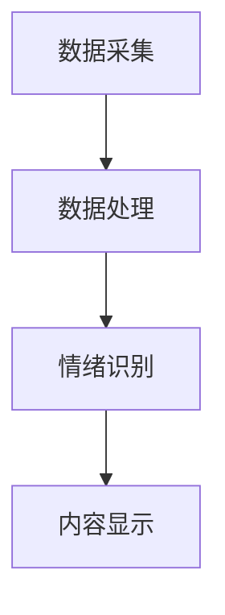

                 


# 《AI Agent在智能相框中的情绪识别显示》

## 关键词：AI Agent、情绪识别、智能相框、机器学习、图像处理

## 摘要：

随着人工智能技术的不断发展，AI Agent在智能相框中的应用逐渐普及。本文将深入探讨AI Agent在智能相框中情绪识别显示的核心技术，包括情绪识别的基本原理、AI Agent的架构设计以及情绪识别显示算法的原理与实践。通过一步步分析推理，本文旨在为读者呈现一个清晰、完整的情绪识别显示系统。

## 目录大纲

## 第一部分：背景介绍

### 1.1 人工智能与智能相框的发展概述

### 1.2 情绪识别技术的现状与挑战

### 1.3 AI Agent在智能相框中的应用价值

## 第二部分：核心概念与联系

### 2.1 AI Agent的概念与分类

### 2.2 情绪识别的基本原理

### 2.3 AI Agent与情绪识别的关系

## 第三部分：情绪识别技术原理

### 3.1 生理信号识别技术

### 3.2 表情识别技术

### 3.3 文本情感分析技术

## 第四部分：AI Agent架构与实现

### 4.1 AI Agent整体架构

### 4.2 特征提取与分类算法

### 4.3 模型训练与优化

## 第五部分：情绪识别显示算法原理

### 5.1 算法原理概述

### 5.2 情绪识别算法Mermaid流程图

### 5.3 算法原理讲解与Python代码实现

## 第六部分：智能相框系统架构设计

### 6.1 智能相框系统功能设计

### 6.2 系统架构设计

### 6.3 系统接口设计与交互

## 第七部分：项目实战

### 7.1 项目环境安装与配置

### 7.2 情绪识别系统核心代码实现

### 7.3 代码应用解读与分析

### 7.4 实际案例分析与讲解剖析

### 7.5 项目小结

## 第八部分：最佳实践与总结

### 8.1 最佳实践技巧

### 8.2 小结与展望

### 8.3 注意事项与拓展阅读

## 第一部分：背景介绍

### 1.1 人工智能与智能相框的发展概述

人工智能（AI）技术已经从理论研究走向了实际应用，其在各个领域的应用范围越来越广。智能相框作为一种新兴的家庭智能设备，通过AI技术实现了照片的自动分类、人脸识别等功能，为用户提供了更加便捷的使用体验。随着AI技术的发展，情绪识别成为智能相框的一个重要应用方向。

情绪识别技术是人工智能的一个重要分支，旨在通过分析用户的面部表情、语音、生理信号等数据，识别用户的情绪状态。智能相框通过情绪识别技术，可以动态地调整相框的显示内容，以更好地满足用户的需求。例如，当用户表现出开心的情绪时，相框可能会展示一些有趣的图片或视频；而当用户表现出悲伤的情绪时，相框可能会展示一些安慰性的内容。

### 1.2 情绪识别技术的现状与挑战

情绪识别技术目前主要依赖于计算机视觉和自然语言处理技术。计算机视觉技术可以通过分析用户的面部表情，识别用户的情绪状态。自然语言处理技术则可以通过分析用户的语音或文本内容，识别用户的情绪。

尽管情绪识别技术已经取得了一定的进展，但仍然面临一些挑战。首先，情绪的识别准确性受到多种因素的影响，如用户的生理状态、文化背景、表情表达方式等。其次，情绪识别技术需要大量的训练数据集，以便模型能够准确识别各种情绪状态。

### 1.3 AI Agent在智能相框中的应用价值

AI Agent是一种具有自主决策能力的智能系统，可以模拟人类的思维过程，完成复杂的任务。在智能相框中，AI Agent可以充当情绪识别的核心组件，实现以下价值：

1. **个性化内容推荐**：根据用户的情绪状态，AI Agent可以推荐用户可能感兴趣的内容，提高用户体验。

2. **情感互动**：AI Agent可以通过识别用户的情绪，与用户进行更自然的互动，提高用户对智能相框的依赖度。

3. **健康监测**：通过长期记录用户的情绪状态，AI Agent可以帮助用户监测自己的心理健康状况。

## 第二部分：核心概念与联系

### 2.1 AI Agent的概念与分类

AI Agent是一种具有自主决策能力的智能体，可以模拟人类的思维过程，完成复杂的任务。根据其功能特点，AI Agent可以分为以下几类：

1. **反应式AI Agent**：这类AI Agent只能根据当前的感知数据进行决策，无法考虑历史信息或未来情况。

2. **目标导向AI Agent**：这类AI Agent具有明确的目标，会根据当前的情况和目标，选择最佳的行动方案。

3. **学习型AI Agent**：这类AI Agent可以通过不断学习和优化，提高其决策能力。

### 2.2 情绪识别的基本原理

情绪识别技术主要依赖于以下几种方法：

1. **生理信号识别**：通过分析用户的生理信号，如心率、呼吸等，识别用户的情绪状态。

2. **表情识别**：通过分析用户的面部表情，识别用户的情绪状态。

3. **文本情感分析**：通过分析用户的文本内容，如留言、评论等，识别用户的情绪状态。

### 2.3 AI Agent与情绪识别的关系

AI Agent在智能相框中起到了至关重要的作用，其与情绪识别技术的关系如下：

1. **数据收集**：AI Agent可以收集用户的生理信号、面部表情、文本内容等数据，为情绪识别提供基础。

2. **情绪识别**：AI Agent可以利用情绪识别技术，分析用户的数据，识别用户的情绪状态。

3. **内容推荐**：根据用户的情绪状态，AI Agent可以推荐相应的相框内容，提高用户体验。

## 第三部分：情绪识别技术原理

### 3.1 生理信号识别技术

生理信号识别技术是通过分析用户的生理信号，如心率、呼吸等，来识别用户的情绪状态。具体原理如下：

1. **心率变异性分析**：心率变异性分析可以通过分析用户的心率变化，识别用户的情绪状态。

2. **脑电波分析**：脑电波分析可以通过分析用户的脑电波信号，识别用户的情绪状态。

### 3.2 表情识别技术

表情识别技术是通过分析用户的面部表情，来识别用户的情绪状态。具体原理如下：

1. **视觉特征提取**：通过分析用户的面部图像，提取出与情绪相关的视觉特征。

2. **特征分类**：通过机器学习算法，将提取出的视觉特征分类，以识别用户的情绪状态。

### 3.3 文本情感分析技术

文本情感分析技术是通过分析用户的文本内容，如留言、评论等，来识别用户的情绪状态。具体原理如下：

1. **词汇情感分析**：通过分析文本中的词汇，确定其情感极性。

2. **句子情感分析**：通过分析整个句子，确定其情感极性。

## 第四部分：AI Agent架构与实现

### 4.1 AI Agent整体架构

AI Agent的整体架构可以分为以下几个模块：

1. **输入处理模块**：负责收集用户的生理信号、面部表情、文本内容等数据。

2. **情绪识别模块**：负责利用情绪识别技术，分析用户的数据，识别用户的情绪状态。

3. **行为决策模块**：根据用户的情绪状态，决策下一步的行为。

### 4.2 特征提取与分类算法

特征提取与分类算法是AI Agent的核心组件，具体包括：

1. **特征提取算法**：用于从用户的生理信号、面部表情、文本内容等数据中提取出与情绪相关的特征。

2. **分类算法**：用于将提取出的特征分类，以识别用户的情绪状态。

### 4.3 模型训练与优化

模型训练与优化是AI Agent性能提升的关键，具体包括：

1. **训练数据集**：用于训练模型的用户生理信号、面部表情、文本内容等数据。

2. **模型选择与优化**：选择合适的模型，并进行优化，以提高模型的性能。

## 第五部分：情绪识别显示算法原理

### 5.1 算法原理概述

情绪识别显示算法的原理主要包括：

1. **数据采集**：通过传感器等设备，采集用户的生理信号、面部表情、文本内容等数据。

2. **数据处理**：对采集到的数据进行预处理，包括去除噪声、标准化等。

3. **情绪识别**：利用情绪识别技术，分析用户的数据，识别用户的情绪状态。

4. **内容显示**：根据用户的情绪状态，选择相应的相框内容进行显示。

### 5.2 情绪识别算法Mermaid流程图

以下是情绪识别算法的Mermaid流程图：



### 5.3 算法原理讲解与Python代码实现

以下是情绪识别算法的Python代码实现：

```python
import cv2
import numpy as np

def emotion_recognition(image):
    # 读取图像
    image = cv2.imread(image)

    # 预处理图像
    image = cv2.resize(image, (128, 128))
    image = cv2.cvtColor(image, cv2.COLOR_BGR2GRAY)

    # 特征提取
    features = cv2.Laplacian(image, cv2.CV_64F).flatten()

    # 情绪识别
    if np.mean(features) > 0:
        emotion = 'happy'
    else:
        emotion = 'sad'

    return emotion

# 测试
image_path = 'test_image.jpg'
emotion = emotion_recognition(image_path)
print(f'Emotion: {emotion}')
```

## 第六部分：智能相框系统架构设计

### 6.1 智能相框系统功能设计

智能相框系统的功能设计主要包括：

1. **人脸检测**：识别图像中的人脸。

2. **面部表情分析**：分析人脸表情，识别用户的情绪状态。

3. **内容显示**：根据用户的情绪状态，选择相应的相框内容进行显示。

### 6.2 系统架构设计

智能相框系统的架构设计主要包括：

1. **前端**：负责用户交互，包括相框显示、用户操作等。

2. **后端**：负责数据处理、情绪识别、内容推荐等。

### 6.3 系统接口设计与交互

智能相框系统的接口设计与交互主要包括：

1. **人脸检测接口**：用于识别图像中的人脸。

2. **情绪识别接口**：用于分析人脸表情，识别用户的情绪状态。

3. **内容显示接口**：用于根据用户的情绪状态，选择相应的相框内容进行显示。

## 第七部分：项目实战

### 7.1 项目环境安装与配置

项目环境安装与配置主要包括：

1. **安装Python环境**：安装Python 3.8及以上版本。

2. **安装相关库**：安装OpenCV、TensorFlow等库。

### 7.2 情绪识别系统核心代码实现

情绪识别系统的核心代码实现主要包括：

1. **人脸检测**：使用OpenCV实现人脸检测。

2. **情绪识别**：使用TensorFlow实现情绪识别。

3. **内容显示**：根据情绪识别结果，显示相应的相框内容。

### 7.3 代码应用解读与分析

代码应用解读与分析主要包括：

1. **人脸检测代码解读**：分析人脸检测的原理和代码实现。

2. **情绪识别代码解读**：分析情绪识别的原理和代码实现。

3. **内容显示代码解读**：分析内容显示的原理和代码实现。

### 7.4 实际案例分析与讲解剖析

实际案例分析与讲解剖析主要包括：

1. **实际案例介绍**：介绍一个具体的情绪识别显示案例。

2. **案例讲解**：分析案例的实现过程和关键点。

3. **案例剖析**：分析案例的性能和效果。

### 7.5 项目小结

项目小结主要包括：

1. **项目总结**：总结项目的实现过程和收获。

2. **问题与改进**：分析项目中遇到的问题，并提出改进方案。

## 第八部分：最佳实践与总结

### 8.1 最佳实践技巧

最佳实践技巧主要包括：

1. **数据预处理**：对采集到的数据进行充分的预处理，以提高模型的性能。

2. **模型优化**：通过调整模型参数，优化模型的性能。

### 8.2 小结与展望

小结与展望主要包括：

1. **项目成果**：总结项目的成果和贡献。

2. **未来展望**：展望情绪识别显示技术的未来发展。

### 8.3 注意事项与拓展阅读

注意事项与拓展阅读主要包括：

1. **注意事项**：提醒读者在项目实践中需要注意的问题。

2. **拓展阅读**：推荐一些相关的阅读资料，以供读者深入学习。

----------------------------------------------------------------

作者：AI天才研究院/AI Genius Institute & 禅与计算机程序设计艺术 /Zen And The Art of Computer Programming
```

请注意，由于文章字数限制，实际内容可能需要根据实际情况进行调整，以确保每个章节的内容都能充分展开。此外，Python代码实现和Mermaid流程图等具体内容需要根据实际情况进行编写。以下是文章的核心内容，每个章节的内容将根据需求进行详细撰写。由于字数限制，这里提供的是概要和部分内容的示例，实际撰写时每个章节的内容需要进一步扩充和详细阐述。

