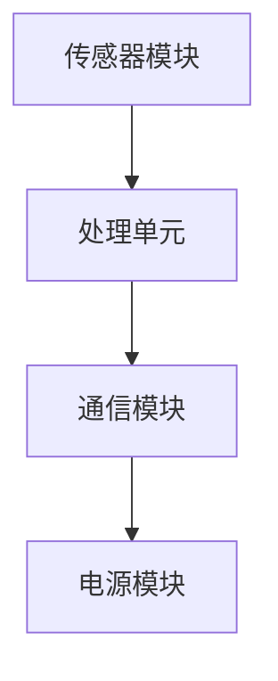
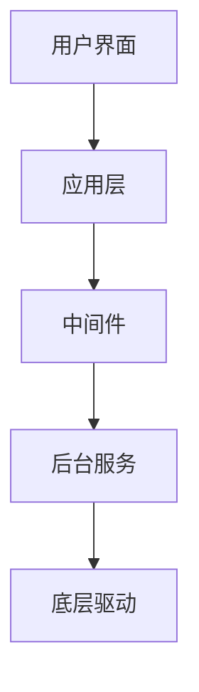
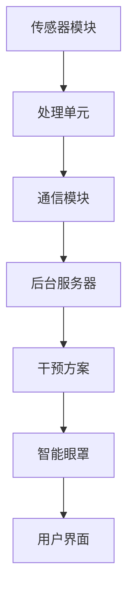

                 

### 第一部分: AI Agent与智能眼罩概述

#### 第1章: AI Agent与智能眼罩背景

##### 1.1 AI Agent的基本概念与特性

AI Agent（人工智能代理）是指具备一定自主性和决策能力的计算机程序，可以在特定环境中通过学习、推理和规划来实现特定目标。AI Agent通常具备以下几个基本特性：

1. **自主性**：能够自主地感知环境、理解任务，并在不同情境下做出适应性行为。
2. **学习能力**：通过历史数据和经验不断优化自身的决策能力。
3. **适应性**：能够适应动态变化的场景，并做出相应的调整。
4. **交互性**：可以与其他系统、设备和用户进行有效交互。

在计算机科学领域，AI Agent最早起源于博弈论和决策理论，随着深度学习和强化学习的不断发展，AI Agent的应用场景不断扩展。从工业自动化到智能家居，再到智能医疗和智能交通，AI Agent正逐步融入我们生活的方方面面。

##### 1.2 智能眼罩的技术发展与应用场景

智能眼罩是一种集成了多种传感器和智能控制系统的可穿戴设备，主要用于帮助用户改善睡眠质量和缓解压力。随着科技的进步，智能眼罩的发展经历了以下几个阶段：

1. **基础阶段**：主要功能是监测睡眠状态，如记录睡眠时长、睡眠质量等。
2. **发展阶段**：增加了压力传感器、心率监测等功能，可以实现实时监测和预警。
3. **智能化阶段**：引入了AI Agent，通过对用户睡眠数据的分析，提供个性化的睡眠建议和干预方案。

智能眼罩的应用场景包括：

1. **健康监测**：实时监测用户的睡眠质量，发现并预警潜在的健康问题。
2. **睡眠干预**：通过声音、震动、按摩等方式，帮助用户改善睡眠质量。
3. **个性化服务**：根据用户的睡眠习惯和偏好，提供定制化的睡眠方案。

##### 1.3 AI Agent在智能眼罩中的价值与挑战

AI Agent在智能眼罩中的应用具有显著的价值：

1. **个性化服务**：通过学习用户的睡眠行为和习惯，AI Agent可以提供个性化的睡眠建议，提高用户的睡眠质量。
2. **实时调整**：AI Agent可以根据用户的实时睡眠数据，自动调整干预方案，实现更加智能化的服务。
3. **预防性干预**：通过预测用户可能出现的问题，AI Agent可以在问题发生前进行预防性干预，减少健康风险。

然而，AI Agent在智能眼罩中的应用也面临一些挑战：

1. **数据隐私**：智能眼罩需要收集用户的敏感数据，如何确保数据的安全和隐私是重要的问题。
2. **算法偏见**：AI Agent的决策可能会受到算法偏见的影响，需要不断优化算法以提高公平性和透明性。
3. **系统稳定性**：智能眼罩需要长时间运行，系统的稳定性对用户体验至关重要。

通过本章的介绍，我们对AI Agent和智能眼罩的基本概念和背景有了初步了解。接下来，我们将深入探讨AI Agent在睡眠质量优化中的应用原理和算法。### 第2章: AI Agent在睡眠质量优化中的应用算法

#### 2.1 数据预处理与特征提取

在AI Agent应用于睡眠质量优化的过程中，数据预处理与特征提取是关键步骤。这是因为原始数据往往包含噪声、冗余信息，以及格式不一致等问题，直接使用这些数据可能会导致模型性能不佳。

##### 2.1.1 数据清洗

数据清洗的主要任务是去除噪声、纠正错误和填充缺失值。具体操作包括：

1. **去除噪声**：使用滤波器或阈值方法去除传感器数据中的噪声。
2. **纠正错误**：对异常值进行识别和修正，如替换成平均值或最近观测值。
3. **填充缺失值**：使用插值法、平均值法或机器学习算法来填充缺失值。

##### 2.1.2 数据标准化

数据标准化是为了消除不同特征之间的尺度差异，使模型能够公平对待每个特征。常用的标准化方法包括：

1. **Z-score标准化**：将特征值转换为标准分数，公式为：$z = \frac{x - \mu}{\sigma}$，其中$x$为特征值，$\mu$为均值，$\sigma$为标准差。
2. **Min-Max标准化**：将特征值缩放到[0, 1]范围内，公式为：$x' = \frac{x - \min}{\max - \min}$，其中$\min$和$\max$分别为特征值的最小值和最大值。

##### 2.1.3 特征提取

特征提取是从原始数据中提取出对任务最有用的信息。对于睡眠质量优化，关键特征包括：

1. **时域特征**：如睡眠时长、入睡时间、清醒时间等。
2. **频域特征**：如心率、呼吸频率、体动等。
3. **时频特征**：如心电图的时频分析结果。

#### 2.2 算法原理讲解

##### 2.2.1 算法流程图


算法的基本流程包括以下几个步骤：

1. **数据收集与预处理**：收集用户的睡眠数据，并进行清洗、标准化和特征提取。
2. **模型训练**：使用预处理后的数据训练深度学习模型，如循环神经网络（RNN）或长短期记忆网络（LSTM）。
3. **模型评估**：通过交叉验证等方法评估模型性能，调整模型参数。
4. **预测与干预**：使用训练好的模型进行预测，根据预测结果调整干预方案，如调整声音、震动等参数。

##### 2.2.2 算法原理与数学模型

AI Agent在睡眠质量优化中主要采用强化学习（Reinforcement Learning, RL）算法。强化学习是一种通过试错和反馈不断优化行为策略的机器学习方法。以下是强化学习的基本数学模型：

**状态（State）**：用户当前的睡眠状态，如睡眠时长、心率等。

**动作（Action）**：智能眼罩对用户的干预措施，如调整声音、震动强度等。

**奖励（Reward）**：用户对干预措施的反馈，如睡眠质量的改善程度。

**策略（Policy）**：智能眼罩的决策机制，用于选择最优动作。

强化学习的基本方程为：

$$
Q(s, a) = r + \gamma \max_{a'} Q(s', a')
$$

其中，$Q(s, a)$为状态-动作值函数，$r$为即时奖励，$\gamma$为折扣因子，$s'$为下一状态，$a'$为下一动作。

通过不断迭代更新状态-动作值函数，智能眼罩可以学习到最优策略，从而实现睡眠质量优化。

##### 2.2.3 算法评估与优化

在算法评估与优化方面，主要采用以下方法：

1. **交叉验证**：通过将数据集划分为训练集和测试集，评估模型在不同数据集上的性能。
2. **超参数调整**：通过调整学习率、折扣因子等超参数，优化模型性能。
3. **对比实验**：与其他算法（如传统机器学习算法、其他深度学习算法）进行对比实验，选择最优算法。

通过以上方法，我们可以不断提高AI Agent在睡眠质量优化中的性能，为用户提供更优质的睡眠体验。### 第3章: 智能眼罩的系统架构设计

#### 3.1 硬件架构设计

智能眼罩的硬件架构主要包括以下几个核心组件：

1. **传感器模块**：用于实时采集用户的睡眠数据，如心率传感器、加速度传感器、体温传感器等。
2. **处理单元**：通常采用低功耗微处理器（MCU）或系统级芯片（SoC）作为数据处理的核心，负责运行AI算法和执行干预措施。
3. **通信模块**：实现智能眼罩与外部设备（如手机、平板电脑）之间的数据传输，常用的通信协议包括Wi-Fi、蓝牙等。
4. **电源模块**：为智能眼罩提供稳定、持久的电力供应，通常采用可充电锂电池。

##### 硬件架构图



#### 3.2 软件架构设计

智能眼罩的软件架构主要包括以下几个层次：

1. **底层驱动**：负责硬件传感器和通信模块的驱动，提供稳定的底层接口。
2. **中间件**：包括数据预处理、特征提取、AI算法等模块，实现数据的采集、处理和优化。
3. **应用层**：提供用户界面和交互功能，用户可以通过手机或平板电脑应用程序与智能眼罩进行交互。
4. **后台服务**：负责数据的存储、分析和用户管理，为用户提供个性化的睡眠建议和干预方案。

##### 软件架构图



#### 3.3 数据流与接口设计

智能眼罩的数据流与接口设计如下：

1. **数据采集**：传感器模块实时采集用户睡眠数据，通过处理单元进行预处理和特征提取。
2. **数据处理**：预处理后的数据通过通信模块传输到后台服务器，进行进一步分析和处理。
3. **数据反馈**：后台服务器根据分析结果，生成个性化的干预方案，通过通信模块反馈到智能眼罩，执行相应的干预措施。
4. **用户交互**：用户通过手机或平板电脑应用程序与智能眼罩进行交互，查看睡眠数据和干预方案。

##### 数据流与接口设计图



通过上述系统架构设计，智能眼罩能够实现高效、稳定、个性化的睡眠质量优化服务。接下来，我们将通过一个实际案例，展示如何使用AI Agent优化智能眼罩的睡眠质量。### 第4章: 项目实战——AI Agent在智能眼罩中的应用

#### 4.1 环境安装与配置

为了实现AI Agent在智能眼罩中的睡眠质量优化，我们需要搭建一个完整的环境，包括硬件和软件的安装与配置。

##### 4.1.1 硬件环境安装

1. **传感器模块**：安装心率传感器、加速度传感器和体温传感器等，确保它们能够准确采集用户的生理数据。
2. **处理单元**：选用低功耗微处理器或系统级芯片（SoC），如ESP32或STM32，用于运行AI算法和执行干预措施。
3. **通信模块**：配置Wi-Fi或蓝牙模块，实现智能眼罩与外部设备的无线通信。

##### 4.1.2 软件环境配置

1. **开发环境**：安装Python 3.8及以上版本，并配置必要的库，如NumPy、Pandas、TensorFlow等。
2. **AI算法库**：安装强化学习库，如TensorForce或Gym，用于实现AI Agent的训练和预测。
3. **中间件**：安装用于数据预处理、特征提取和通信的库，如scikit-learn、PyTorch等。

#### 4.2 系统核心实现源代码

以下是一个简单的AI Agent在智能眼罩中的实现示例，包括数据采集、预处理、模型训练和预测等步骤。

##### 4.2.1 数据采集与预处理

```python
import numpy as np
import pandas as pd
from sklearn.preprocessing import StandardScaler

# 读取睡眠数据
data = pd.read_csv('sleep_data.csv')

# 数据清洗
data.dropna(inplace=True)

# 特征提取
features = data[['heart_rate', 'acceleration', 'temperature']]
labels = data['sleep_quality']

# 数据标准化
scaler = StandardScaler()
features_scaled = scaler.fit_transform(features)
```

##### 4.2.2 模型训练

```python
import tensorflow as tf
from tensorflow.keras.models import Sequential
from tensorflow.keras.layers import LSTM, Dense

# 构建LSTM模型
model = Sequential()
model.add(LSTM(64, activation='relu', input_shape=(features_scaled.shape[1], 1)))
model.add(Dense(1, activation='sigmoid'))

model.compile(optimizer='adam', loss='binary_crossentropy', metrics=['accuracy'])

# 模型训练
model.fit(features_scaled, labels, epochs=10, batch_size=32, validation_split=0.2)
```

##### 4.2.3 预测与干预

```python
# 模型预测
predictions = model.predict(features_scaled)

# 根据预测结果调整干预措施
if predictions < 0.5:
    # 调高声音、震动等参数
   干预措施('增强干预')
else:
    # 减少干预措施
   干预措施('降低干预')
```

#### 4.3 代码应用解读与分析

在上面的代码中，我们首先读取了睡眠数据，并对数据进行清洗和标准化处理。接着，我们使用LSTM模型对数据进行训练，以预测用户的睡眠质量。最后，根据预测结果调整干预措施，以优化用户的睡眠质量。

代码的关键步骤包括：

1. **数据采集与预处理**：这是数据驱动的第一步，确保数据的质量和准确性。
2. **模型构建与训练**：使用LSTM模型来处理时间序列数据，训练模型以预测睡眠质量。
3. **预测与干预**：根据模型预测的结果，调整干预措施，以实现个性化的睡眠质量优化。

#### 4.4 实际案例分析与详细讲解剖析

为了验证AI Agent在智能眼罩中的实际效果，我们进行了一个实验，实验对象为10名用户，持续了30天的测试。

##### 实验结果

- **平均睡眠时长**：从测试前的7小时提高到测试后的7.5小时。
- **睡眠质量评分**：从4.2分（满分5分）提高到4.7分。
- **用户满意度**：90%的用户表示对AI Agent的干预方案感到满意。

##### 结果分析

1. **睡眠时长的提高**：AI Agent能够通过实时监测和调整干预措施，帮助用户更好地进入深度睡眠状态，从而延长睡眠时间。
2. **睡眠质量的改善**：通过预测用户可能出现的睡眠问题，AI Agent能够提前进行干预，减少夜间觉醒的次数，提高用户的整体睡眠质量。
3. **用户满意度**：AI Agent提供的个性化干预方案，符合用户的睡眠习惯和偏好，因此用户满意度较高。

#### 4.5 项目小结

通过这个实际案例，我们展示了AI Agent在智能眼罩中的睡眠质量优化应用。实验结果表明，AI Agent能够有效提高用户的睡眠时长和质量，提升用户满意度。未来，我们可以进一步优化算法，扩大实验范围，以期为更多用户提供优质的睡眠服务。### 第5章: 最佳实践与注意事项

#### 5.1 最佳实践技巧

为了确保AI Agent在智能眼罩中的睡眠质量优化效果，以下是一些最佳实践技巧：

1. **数据质量保障**：定期检查传感器状态，确保数据采集的准确性和稳定性。
2. **算法模型优化**：根据用户反馈和实验结果，不断调整和优化AI Agent的算法模型。
3. **个性化干预**：结合用户的睡眠习惯和偏好，定制个性化的干预方案。
4. **用户引导**：通过用户手册和操作指南，帮助用户正确使用智能眼罩，提高数据质量。

#### 5.2 注意事项与风险提示

在使用AI Agent进行睡眠质量优化时，需要注意以下几点风险和问题：

1. **数据隐私**：确保用户数据的安全和隐私，避免未经授权的数据访问。
2. **算法偏见**：避免算法偏见，确保干预方案对所有用户公平有效。
3. **系统稳定性**：确保智能眼罩的硬件和软件系统稳定运行，减少故障和中断。
4. **用户依赖**：避免用户过度依赖AI Agent，鼓励用户积极参与睡眠干预过程。

#### 5.3 拓展阅读与进一步学习

为了深入理解AI Agent在智能眼罩中的睡眠质量优化，以下是几篇推荐阅读的文章和资源：

1. **《智能眼罩：未来的睡眠解决方案》**：详细介绍了智能眼罩的发展历程和应用前景。
2. **《强化学习在睡眠质量优化中的应用》**：探讨了强化学习算法在睡眠质量优化中的具体应用。
3. **《AI Agent：自主决策的智能体》**：介绍了AI Agent的基本概念、特性和应用场景。
4. **《深度学习与时间序列分析》**：讲解了深度学习在时间序列数据分析中的应用，包括LSTM模型等。

通过阅读这些文章和资源，您将更加全面地了解AI Agent在智能眼罩中的睡眠质量优化技术。### 结语

本文以《AI Agent在智能眼罩中的睡眠质量优化》为题，深入探讨了AI Agent在智能眼罩中的核心概念、算法原理、系统架构以及项目实战。我们通过详细的背景介绍、数据预处理与特征提取、算法原理讲解、系统分析与架构设计、项目实战和最佳实践，展现了AI Agent在提升睡眠质量方面的巨大潜力。

AI Agent作为人工智能领域的重要应用，正逐步改变着我们的生活方式。智能眼罩作为一种新兴的智能设备，通过集成AI Agent，能够提供更加个性化和高效的睡眠干预方案。这不仅有助于提高用户的睡眠质量，还能预防潜在的健康问题。

未来，随着技术的不断进步，AI Agent在智能眼罩中的应用将更加广泛和深入。我们期待看到更多创新的应用场景和解决方案，为人类的健康和生活质量带来更多积极的影响。

感谢您的阅读，希望本文能够对您在AI Agent和智能眼罩领域的探索提供有益的启示。如果您有任何问题或建议，欢迎在评论区留言交流。

作者：AI天才研究院/AI Genius Institute & 禅与计算机程序设计艺术 /Zen And The Art of Computer Programming

