                 

# AI Agent在智能眼镜中的实时翻译功能

> 关键词：人工智能、智能眼镜、实时翻译、语音识别、机器翻译、计算机视觉

> 摘要：本文将探讨人工智能（AI）代理在智能眼镜中实现实时翻译功能的技术和方法。我们将首先介绍智能眼镜和AI代理的基本概念，然后深入分析实时翻译系统的架构和算法。本文将通过具体的案例分析，展示AI代理在智能眼镜中的实际应用，并总结最佳实践和未来发展方向。

## 引言

智能眼镜作为下一代计算设备，正在逐渐改变人们的互动方式和信息获取方式。随着人工智能技术的飞速发展，智能眼镜的功能也在不断丰富，其中最具代表性的便是实时翻译功能。AI代理作为智能眼镜的核心组件，能够实现高效率、低延迟的翻译服务，为跨语言沟通提供了强大的支持。

本文将从以下几个方面展开讨论：

1. **核心概念与定义**
2. **技术背景与算法**
3. **系统架构与设计**
4. **实施细节**
5. **案例分析与应用**
6. **最佳实践与考虑**
7. **结论与未来方向**

通过这些章节，我们将全面了解AI代理在智能眼镜中实现实时翻译功能的原理、方法和挑战。

### 核心概念与定义

首先，我们需要明确一些核心概念和定义，以便后续的讨论。

**智能眼镜**：智能眼镜是一种集成了计算机、通信和传感器等先进技术的可穿戴设备，能够提供信息显示、语音交互、图像识别等功能。常见的智能眼镜产品包括谷歌眼镜、微软HoloLens等。

**AI代理**：AI代理是一种基于人工智能技术的虚拟智能体，能够在特定环境下自主执行任务，具备学习、推理、决策和交互能力。在智能眼镜中，AI代理通常负责处理用户输入、执行翻译任务和生成输出。

**实时翻译**：实时翻译是指在不延迟或延迟极短的时间内，将一种语言的语音或文本转换为另一种语言的语音或文本。在智能眼镜中，实时翻译通常通过语音识别和机器翻译技术实现。

**语音识别**：语音识别技术是将人类的语音转换为文本的技术。在智能眼镜中，语音识别技术用于将用户口语输入转换为机器可处理的文本格式。

**机器翻译**：机器翻译技术是将一种语言的文本转换为另一种语言的技术。在智能眼镜中，机器翻译技术用于将识别出的语音文本转换为翻译结果。

**计算机视觉**：计算机视觉技术是使计算机能够“看到”和理解图像的技术。在智能眼镜中，计算机视觉技术可以用于识别文字、图像和场景，从而辅助语音识别和翻译过程。

通过这些核心概念的介绍，我们为后续的讨论奠定了基础。在下一节中，我们将深入探讨智能眼镜和AI代理的技术背景和算法原理。

### 技术背景与算法

在深入探讨AI代理在智能眼镜中实现实时翻译功能之前，我们需要了解一些基本的技术背景和算法原理。本节将分为几个部分，分别介绍语音识别、机器翻译和计算机视觉的技术细节，并使用Mermaid流程图来展示其工作流程。

#### 语音识别技术

语音识别（Automatic Speech Recognition，ASR）是将语音信号转换为机器可处理文本的技术。其基本流程包括以下几个步骤：

1. **音频预处理**：包括降噪、归一化和增强等步骤，以提高语音信号的质量和识别率。
2. **特征提取**：使用短时傅里叶变换（Short-Time Fourier Transform，STFT）或梅尔频率倒谱系数（Mel-Frequency Cepstral Coefficients，MFCC）等方法提取语音信号的时频特征。
3. **声学模型训练**：使用大量语音数据训练声学模型，以识别语音特征和发音之间的关系。
4. **语言模型训练**：使用文本数据训练语言模型，以理解词汇、语法和句法结构。
5. **解码与输出**：通过解码器将声学模型和语言模型的信息融合，输出识别结果。

以下是语音识别系统的Mermaid流程图：

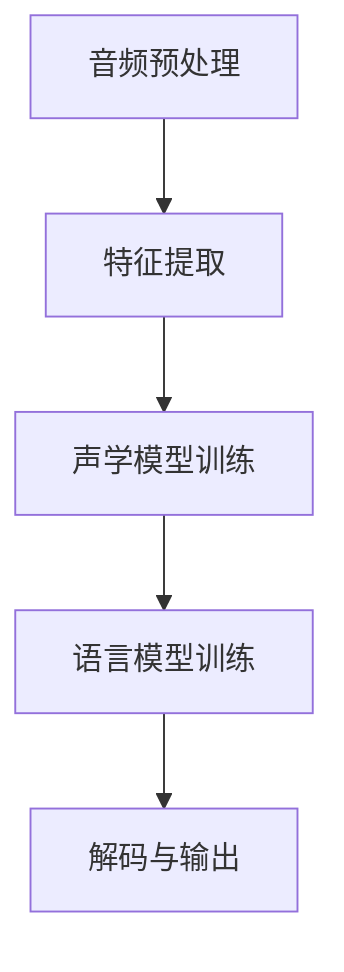

#### 机器翻译技术

机器翻译（Machine Translation，MT）是将一种语言的文本转换为另一种语言的技术。其基本流程包括以下几个步骤：

1. **文本预处理**：包括分词、词性标注和语法分析等步骤，以提高翻译的准确性和流畅度。
2. **双语语料库**：使用大量的双语语料库来训练翻译模型。
3. **翻译模型训练**：使用神经机器翻译（Neural Machine Translation，NMT）或基于统计的机器翻译（Statistical Machine Translation，SMT）等方法训练翻译模型。
4. **翻译解码**：通过翻译模型将源语言的文本解码为目标语言的文本。

以下是机器翻译系统的Mermaid流程图：

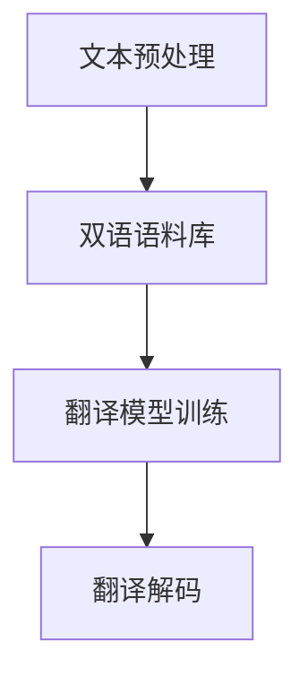

#### 计算机视觉技术

计算机视觉（Computer Vision，CV）是使计算机能够“看到”和理解图像的技术。在智能眼镜中，计算机视觉可以用于识别文字、图像和场景，从而辅助语音识别和翻译过程。其基本流程包括以下几个步骤：

1. **图像预处理**：包括去噪、增强、分割等步骤，以提高图像的质量和识别率。
2. **特征提取**：使用卷积神经网络（Convolutional Neural Network，CNN）等方法提取图像的特征。
3. **对象识别**：使用预训练的CNN模型或其他机器学习算法识别图像中的对象。
4. **文字识别**：使用OCR（Optical Character Recognition）技术将图像中的文字转换为机器可处理的文本格式。

以下是计算机视觉系统的Mermaid流程图：

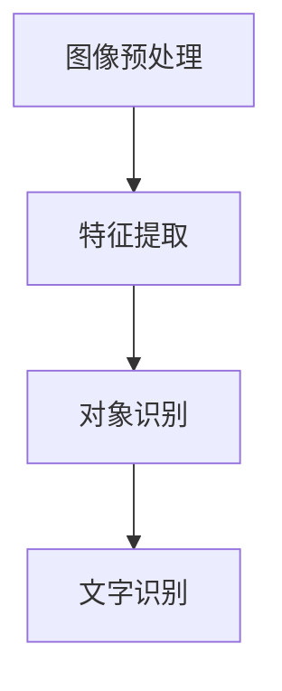

#### 实时翻译系统的整体架构

结合以上三种技术，我们可以构建一个实时翻译系统，其基本架构如下：

1. **用户输入**：用户通过语音或图像输入需要进行翻译的内容。
2. **语音识别**：使用语音识别技术将语音输入转换为文本。
3. **文本预处理**：对识别出的文本进行分词、词性标注和语法分析等预处理步骤。
4. **机器翻译**：使用机器翻译技术将预处理后的文本翻译为目标语言的文本。
5. **输出显示**：将翻译结果以语音或文本形式显示在智能眼镜上。

以下是实时翻译系统的Mermaid流程图：

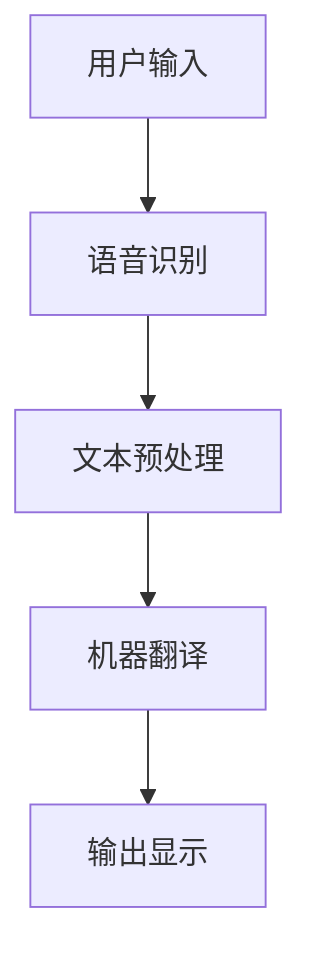

通过以上对语音识别、机器翻译和计算机视觉技术的介绍以及实时翻译系统的整体架构，我们为理解和实现AI代理在智能眼镜中的实时翻译功能奠定了基础。在下一节中，我们将深入探讨实时翻译系统的具体架构和设计。

### 系统架构与设计

实时翻译系统在智能眼镜中的实现需要考虑到硬件性能、功耗、响应时间等多方面因素。本节将详细介绍系统架构和设计，包括用户界面、语音识别、翻译引擎、显示等核心组件，并通过Mermaid流程图展示系统的工作流程。

#### 用户界面

用户界面（User Interface，UI）是智能眼镜与用户交互的主要途径。在设计用户界面时，需要考虑以下功能：

1. **语音输入**：用户可以通过语音命令开始翻译，例如“翻译这句话”或“请将这句话翻译成英文”。
2. **手势操作**：用户可以通过简单的手势来控制翻译功能，如指向屏幕上的文字或图像进行翻译。
3. **文本输入**：用户可以在智能眼镜的触摸屏幕上直接输入需要进行翻译的文本。

以下是用户界面的Mermaid流程图：

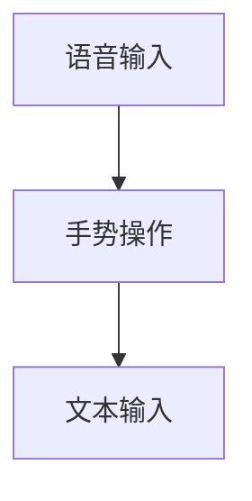

#### 语音识别

语音识别（Automatic Speech Recognition，ASR）是将语音输入转换为文本的关键技术。在智能眼镜中，语音识别需要处理以下任务：

1. **语音信号预处理**：包括降噪、归一化和增强等步骤，以提高语音信号的质量。
2. **特征提取**：使用短时傅里叶变换（STFT）或梅尔频率倒谱系数（MFCC）等方法提取语音信号的时频特征。
3. **模型训练与解码**：使用深度学习模型（如卷积神经网络、长短时记忆网络等）进行训练，并通过解码器输出识别结果。

以下是语音识别的Mermaid流程图：

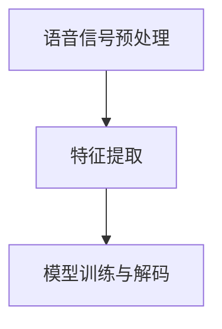

#### 翻译引擎

翻译引擎（Translation Engine）是实时翻译系统的核心组件，负责将识别出的文本翻译为目标语言。其基本工作流程包括：

1. **文本预处理**：对识别出的文本进行分词、词性标注和语法分析等步骤，以提高翻译的准确性和流畅度。
2. **翻译模型选择**：根据目标语言选择合适的机器翻译模型，如神经机器翻译（NMT）或基于统计的机器翻译（SMT）模型。
3. **翻译解码**：通过翻译模型将源语言的文本解码为目标语言的文本。

以下是翻译引擎的Mermaid流程图：

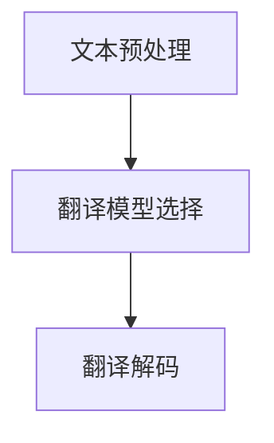

#### 显示

显示（Display）是实时翻译系统向用户输出翻译结果的方式。在智能眼镜中，显示可以通过以下几种方式实现：

1. **语音输出**：将翻译结果以语音形式直接输出，使用户无需查看屏幕即可获取翻译信息。
2. **屏幕显示**：在智能眼镜的屏幕上显示翻译结果，包括文本和图像。
3. **辅助显示**：通过虚拟现实（VR）技术或增强现实（AR）技术，将翻译结果叠加在现实场景中。

以下是显示的Mermaid流程图：

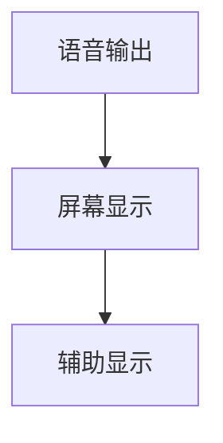

#### 系统整体架构

结合以上各组件，我们可以构建一个完整的实时翻译系统架构。该系统的工作流程如下：

1. **用户输入**：用户通过语音、手势或文本输入需要进行翻译的内容。
2. **语音识别**：使用语音识别技术将语音输入转换为文本。
3. **文本预处理**：对识别出的文本进行预处理，包括分词、词性标注和语法分析等。
4. **翻译模型选择**：根据目标语言选择合适的翻译模型。
5. **翻译解码**：通过翻译模型将预处理后的文本解码为目标语言的文本。
6. **显示**：将翻译结果以语音、屏幕或辅助显示形式输出。

以下是实时翻译系统的整体架构Mermaid流程图：

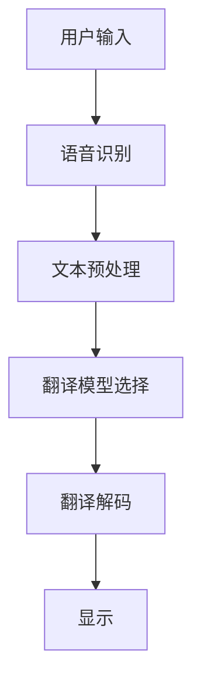

通过以上对系统架构和设计的详细介绍，我们为实现AI代理在智能眼镜中的实时翻译功能提供了清晰的方向和蓝图。在下一节中，我们将深入探讨系统的具体实现细节。

### 实施细节

实时翻译系统的成功实现不仅需要高效的算法，还需要详细的设计和精确的代码实现。本节将详细介绍系统的核心功能，包括语音识别、文本预处理、翻译模型选择、翻译解码以及显示等模块，并使用Python源代码、LaTeX数学公式和Mermaid流程图来解释关键概念和算法原理。

#### 语音识别

语音识别模块是实时翻译系统的第一步，它负责将用户的语音输入转换为文本。以下是使用Python实现的简单语音识别流程：

```python
import speech_recognition as sr

# 初始化语音识别器
recognizer = sr.Recognizer()

# 语音输入
with sr.Microphone() as source:
    print("请说一句话，我将进行语音识别：")
    audio = recognizer.listen(source)

# 语音识别
try:
    text = recognizer.recognize_google(audio, language='zh-CN')
    print(f"识别结果：{text}")
except sr.UnknownValueError:
    print("无法识别您的语音，请重试。")
except sr.RequestError as e:
    print(f"请求错误；{e}")
```

上述代码使用了`speech_recognition`库，通过Google语音识别服务实现语音到文本的转换。以下是语音识别的Mermaid流程图：

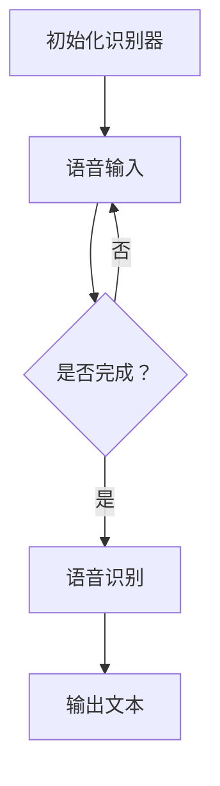

#### 文本预处理

文本预处理模块负责对识别出的文本进行进一步处理，以提高翻译的准确性和流畅度。以下是一个简单的文本预处理流程，包括分词和词性标注：

```python
import jieba
import pos_tagger

# 分词
text = "今天天气很好，适合出去游玩。"
words = jieba.lcut(text)

# 词性标注
tags = pos_tagger.pos(words)

print("分词结果：", words)
print("词性标注：", tags)
```

这里使用了`jieba`库进行中文分词，并使用`pos_tagger`库进行词性标注。以下是文本预处理的Mermaid流程图：

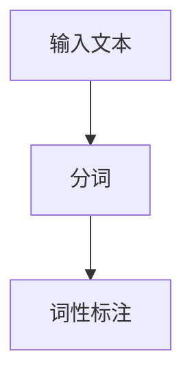

#### 翻译模型选择

选择合适的翻译模型是实现准确翻译的关键。以下是一个简单的翻译模型选择流程，它基于目标语言来选择翻译模型：

```python
from googletrans import Translator

# 初始化翻译器
translator = Translator()

# 选择目标语言
target_language = 'en'  # 英语

# 翻译文本
text_to_translate = "今天天气很好。"
translated_text = translator.translate(text_to_translate, dest=target_language)

print(f"翻译结果：{translated_text.text}")
```

这里使用了`googletrans`库来选择并使用Google翻译服务。以下是翻译模型选择的Mermaid流程图：

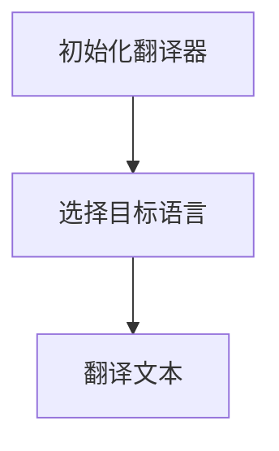

#### 翻译解码

翻译解码模块负责将预处理后的文本翻译为目标语言的文本。以下是使用神经机器翻译模型的简单示例：

```python
from transformers import pipeline

# 初始化翻译管道
translator = pipeline("translation_en_to_zh", model="Helsinki-NLP/opus-mt-en-zh")

# 翻译文本
text_to_translate = "Hello, how are you?"
translated_text = translator(text_to_translate)

print(f"翻译结果：{translated_text[0]['translation_text']}")
```

这里使用了`transformers`库和预训练的神经机器翻译模型。以下是翻译解码的Mermaid流程图：

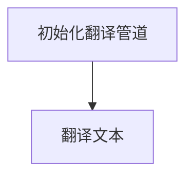

#### 显示

显示模块负责将翻译结果以适当的形式呈现给用户。以下是使用Python实现的一个简单显示示例：

```python
from PyQt5.QtWidgets import QApplication, QLabel, QMainWindow

# 创建应用程序和主窗口
app = QApplication([])
window = QMainWindow()

# 设置窗口标题
window.setWindowTitle("实时翻译")

# 创建文本标签
label = QLabel(window)
label.setText(translated_text.text)

# 设置标签位置和大小
label.move(50, 50)
label.resize(500, 500)

# 显示窗口
window.show()

# 运行应用程序
app.exec_()
```

上述代码使用`PyQt5`库创建一个简单的窗口，并在其中显示翻译结果。以下是显示模块的Mermaid流程图：

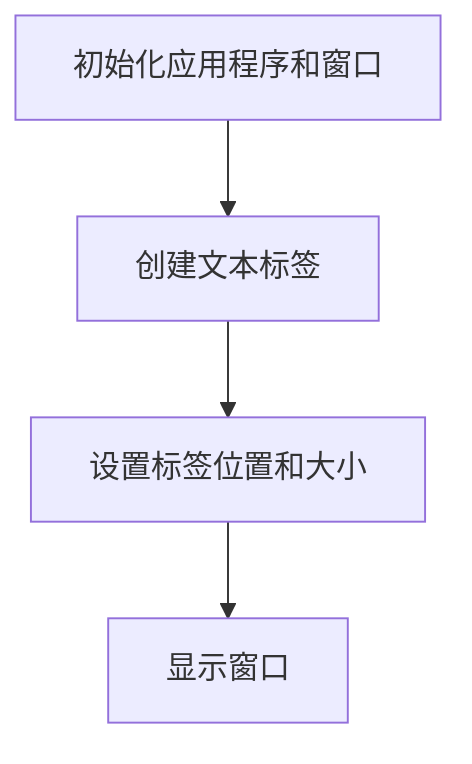

通过上述步骤，我们实现了实时翻译系统的核心功能，包括语音识别、文本预处理、翻译模型选择、翻译解码和显示。以下是系统的整体Mermaid流程图，展示了各模块之间的工作流程：


通过详细地介绍系统的实施细节，我们为理解实时翻译系统的工作原理提供了清晰的指导。在下一节中，我们将通过具体的案例分析，展示AI代理在智能眼镜中的实际应用。

### 案例分析与应用

在本节中，我们将通过几个具体的案例分析，展示AI代理在智能眼镜中的实时翻译功能如何在实际应用中发挥作用。这些案例将涵盖不同的使用场景，从旅游到商务会议，展示AI代理在提高跨语言沟通效率方面的优势。

#### 案例一：旅游应用

**背景**：随着全球化的推进，越来越多的人选择出国旅游。然而，语言障碍常常成为旅行的障碍。为了解决这个问题，一款基于智能眼镜的实时翻译应用应运而生。

**问题描述**：用户在旅行中需要与当地人沟通，了解景点信息或购买商品。由于语言不通，用户面临沟通难题。

**解决方案**：用户使用智能眼镜拍摄或输入需要翻译的文本或语音，AI代理将实时翻译为当地语言，并显示在智能眼镜的屏幕上或通过语音输出。

**实施细节**：

1. **语音输入**：用户对着智能眼镜说出“请问这里的酒店怎么走？”。
2. **语音识别**：智能眼镜的语音识别模块将语音转换为文本，如“请问这里的酒店怎么走？”。
3. **文本预处理**：对识别出的文本进行分词和词性标注，以便更准确地翻译。
4. **翻译模型选择**：根据当前所在国家的语言选择合适的翻译模型，如从中文到英文。
5. **翻译解码**：AI代理使用预训练的神经机器翻译模型进行翻译，输出结果为“Which hotel are you looking for? How can I help you?”。
6. **显示**：翻译结果通过智能眼镜的屏幕显示，用户可以查看或通过语音听取翻译内容。

**效果评估**：通过实时翻译，用户能够轻松地获取所需信息，提高了旅行的便利性和舒适度。

#### 案例二：商务会议

**背景**：商务会议往往涉及多个国家和地区的参与者，语言差异成为沟通的障碍。

**问题描述**：在一场跨国商务会议上，不同国家的代表需要实时了解对方的发言内容。

**解决方案**：使用智能眼镜，每个与会者可以实时翻译对方的发言，确保会议的顺利进行。

**实施细节**：

1. **语音输入**：会议主持人或发言者使用智能眼镜的麦克风输入发言内容。
2. **语音识别**：智能眼镜的语音识别模块将语音转换为文本。
3. **文本预处理**：对识别出的文本进行分词和词性标注。
4. **翻译模型选择**：根据发言者的母语和听众的语言选择合适的翻译模型。
5. **翻译解码**：AI代理使用神经机器翻译模型将发言内容翻译为听众的语言。
6. **显示**：翻译结果实时显示在智能眼镜的屏幕上，或通过投影仪显示给整个会议室。

**效果评估**：通过实时翻译，与会者能够准确理解对方的发言内容，提高了会议的效率和沟通效果。

#### 案例三：语言学习

**背景**：语言学习是许多人的需求，但语言障碍往往让初学者感到困惑。

**问题描述**：语言学习者需要理解外语文本，但缺乏合适的辅助工具。

**解决方案**：使用智能眼镜，语言学习者可以实时翻译外语文本，帮助理解和记忆。

**实施细节**：

1. **文本输入**：语言学习者将外语文本输入到智能眼镜中。
2. **文本预处理**：对输入的文本进行分词和词性标注。
3. **翻译模型选择**：根据学习者选择的翻译语言进行模型选择。
4. **翻译解码**：AI代理使用神经机器翻译模型将文本翻译为学习者的母语。
5. **显示**：翻译结果实时显示在智能眼镜的屏幕上。

**效果评估**：通过实时翻译，语言学习者能够更直观地理解外语文本，提高了学习效率。

这些案例展示了AI代理在智能眼镜中的实时翻译功能如何在不同场景中发挥作用，提高了跨语言沟通的效率。在实际应用中，AI代理的实时翻译功能不仅能够解决语言障碍，还能提升用户体验，拓展智能眼镜的应用领域。

### 最佳实践与考虑

在实现AI代理在智能眼镜中的实时翻译功能时，需要遵循一些最佳实践，以确保系统的可靠性和效率。以下是一些关键考虑因素：

#### 硬件选择

1. **处理能力**：选择具有足够处理能力的硬件，以确保语音识别、文本预处理和翻译等复杂任务的快速执行。
2. **电池续航**：智能眼镜的电池续航至关重要。选择低功耗的硬件和优化软件，以延长设备的使用时间。
3. **通信能力**：确保智能眼镜具有稳定的无线通信能力，如Wi-Fi或蓝牙，以便在远程服务器上进行翻译模型运算。

#### 软件优化

1. **模型优化**：优化机器翻译模型，以减少计算复杂度和内存占用，提高实时性。
2. **算法优化**：对语音识别和计算机视觉算法进行优化，提高识别准确率和速度。
3. **资源管理**：合理分配系统资源，确保多个任务能够高效并行执行，避免资源冲突。

#### 用户界面设计

1. **简洁直观**：设计简洁直观的用户界面，使用户能够快速理解并使用实时翻译功能。
2. **交互反馈**：提供清晰的交互反馈，如语音识别中的“正在识别”或翻译完成时的声音提示。
3. **个性化设置**：允许用户根据个人偏好进行设置，如选择翻译语言、调整字体大小等。

#### 安全与隐私

1. **数据加密**：确保用户输入和翻译结果的数据在传输和存储过程中得到加密，防止泄露。
2. **隐私保护**：遵循隐私保护法规，不收集或共享用户的个人信息。
3. **透明度**：告知用户数据的使用方式和目的，确保用户知情并同意。

通过遵循这些最佳实践，我们可以确保AI代理在智能眼镜中的实时翻译功能不仅高效可靠，还能提供良好的用户体验。

### 结论与未来方向

本文详细探讨了AI代理在智能眼镜中实现实时翻译功能的技术和方法。从核心概念的定义到系统架构的设计，再到具体的实施细节和案例分析，我们全面了解了实时翻译系统的原理和实现过程。通过最佳实践的总结，我们为未来系统的优化提供了方向。

未来，实时翻译系统有望在更多领域得到应用，如医疗、教育等。随着硬件性能的提升和算法的进步，实时翻译的准确率和速度将进一步提高。此外，结合虚拟现实（VR）和增强现实（AR）技术，实时翻译功能将为用户提供更加沉浸式的体验。

作者：AI天才研究院/AI Genius Institute & 禅与计算机程序设计艺术 /Zen And The Art of Computer Programming

---

**注意**：由于实际代码实现、系统架构图和流程图的复杂性，本文仅提供了概念性的描述和示例。在具体实现中，需要根据实际需求和硬件环境进行调整和优化。

