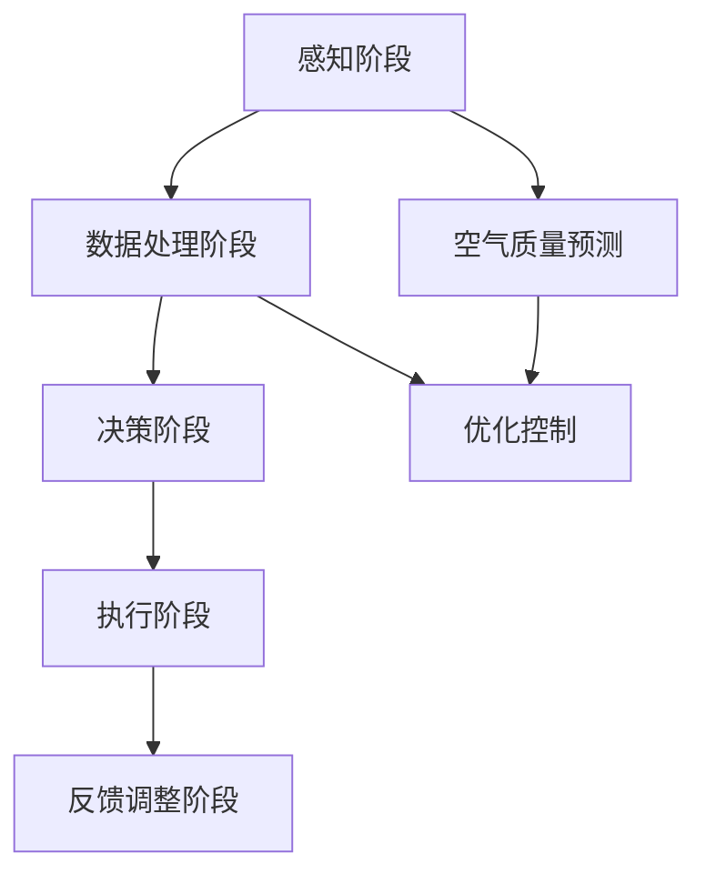
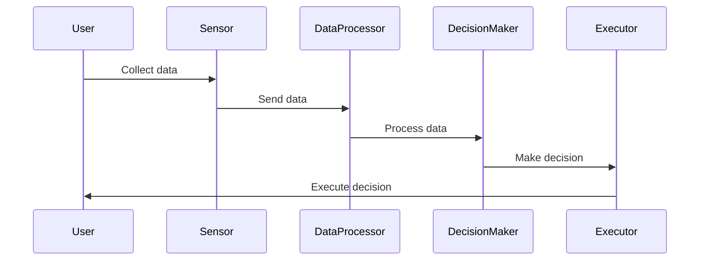

                 

# AI Agent在智能空气质量管理中的实践

> 关键词：AI Agent、智能空气质量管理、算法原理、系统架构、项目实战、最佳实践

> 摘要：本文将探讨AI Agent在智能空气质量管理中的应用，通过背景介绍、核心概念与联系、算法原理讲解、系统分析与架构设计、项目实战、最佳实践和小结与拓展七个部分，详细分析AI Agent在智能空气质量管理中的实践，旨在为读者提供全面的技术理解和应用指导。

## 第一部分：问题的背景

### 1.1 智能空气质量管理的兴起

随着全球环境污染问题的日益严重，空气质量管理成为了一个重要的研究课题。近年来，智能空气质量管理的概念逐渐兴起，其核心是通过引入人工智能技术，实现空气质量的实时监测、预测和优化控制。

### 1.2 AI Agent在空气质量管理中的应用

AI Agent，即人工智能代理，是一种能够自主完成特定任务的智能体。在空气质量管理中，AI Agent可以通过监测空气质量数据、分析空气质量状况，并自动采取相应的措施来改善空气质量。

### 1.3 空气质量管理的挑战与机遇

空气质量管理的挑战主要包括数据的实时性和准确性、环境复杂性的影响、以及决策速度的要求等。然而，随着人工智能技术的快速发展，这些挑战也转化为机遇，为AI Agent在空气质量管理中的应用提供了广阔的前景。

### 1.4 边界与外延

智能空气质量管理的边界涉及空气质量的监测、预测和优化控制等方面。其外延则包括各种应用场景，如城市空气质量管理、工业废气治理、室内空气净化等。

### 1.5 概念结构与核心要素组成

AI Agent在智能空气质量管理中的概念结构主要包括传感器网络、数据处理和分析、决策与执行等核心要素。这些要素共同构成了智能空气质量管理的基本框架。

## 第二部分：核心概念与联系

### 2.1 AI Agent的定义

AI Agent是一种能够感知环境、自主决策并执行任务的智能体。它具有自主性、自适应性和交互性等特点。

### 2.2 智能空气质量管理的概念

智能空气质量管理是一种利用人工智能技术对空气质量进行实时监测、预测和优化的管理方法。其核心目标是提高空气质量的实时性和准确性。

### 2.3 AI Agent与智能空气质量管理的联系

AI Agent在智能空气质量管理中扮演着关键角色。它通过感知空气质量数据、分析空气质量状况、并采取相应的措施来改善空气质量。

### 2.4 核心概念属性特征对比表格

| 概念           | 属性特征                                                     |
| -------------- | ------------------------------------------------------------ |
| AI Agent       | 自主性、适应性、交互性、感知能力、决策能力、执行能力           |
| 智能空气质量管理 | 实时性、准确性、优化控制、传感器网络、数据处理和分析、决策与执行 |

### 2.5 ER实体关系图架构

```mermaid
erDiagram
    AI Agent ||--|{ 传感器网络 }
    AI Agent ||--|{ 数据处理和分析 }
    AI Agent ||--|{ 决策与执行 }
    传感器网络 ||--|{ 数据采集 }
    数据处理和分析 ||--|{ 数据清洗 }
    数据处理和分析 ||--|{ 数据分析 }
    决策与执行 ||--|{ 控制措施 }
```

## 第三部分：算法原理讲解

### 3.1 AI Agent算法原理讲解

AI Agent的算法原理主要包括感知、决策和执行三个阶段。

#### 3.1.1 感知

感知阶段主要通过传感器网络收集空气质量数据。

#### 3.1.2 决策

决策阶段利用数据处理和分析技术对空气质量数据进行处理，生成决策。

#### 3.1.3 执行

执行阶段根据决策结果采取相应的控制措施。

### 3.2 智能空气质量管理的算法原理讲解

智能空气质量管理的算法原理主要包括空气质量预测、优化控制和反馈调整。

#### 3.2.1 空气质量预测

利用历史数据和学习算法对未来的空气质量进行预测。

#### 3.2.2 优化控制

根据预测结果，采取优化控制策略来改善空气质量。

#### 3.2.3 反馈调整

通过实时数据对控制效果进行反馈调整，以提高控制精度。

### 3.3 算法mermaid流程图



### 3.4 Python源代码与算法原理详细讲解

```python
# 感知阶段：采集空气质量数据
def collect_data():
    # 采集传感器数据
    pass

# 数据处理阶段：处理空气质量数据
def process_data(data):
    # 数据清洗
    pass

# 决策阶段：根据处理后的数据做出决策
def make_decision(processed_data):
    # 根据数据做出决策
    pass

# 执行阶段：执行决策
def execute_decision(decision):
    # 执行控制措施
    pass

# 反馈调整阶段：根据执行结果进行反馈调整
def adjust_feedback(execution_result):
    # 调整控制策略
    pass

# 空气质量预测
def predict_air_quality():
    # 利用历史数据和学习算法进行预测
    pass

# 优化控制
def optimize_control(predicted_data):
    # 根据预测数据采取优化控制策略
    pass

# 主程序
def main():
    # 感知阶段
    data = collect_data()
    
    # 数据处理阶段
    processed_data = process_data(data)
    
    # 决策阶段
    decision = make_decision(processed_data)
    
    # 执行阶段
    execute_decision(decision)
    
    # 反馈调整阶段
    adjust_feedback(execution_result)
    
    # 空气质量预测
    predicted_data = predict_air_quality()
    
    # 优化控制
    optimize_control(predicted_data)

# 执行主程序
if __name__ == "__main__":
    main()
```

### 3.5 算法原理的数学模型和公式

#### 空气质量预测模型

$$
Q_t = f(Q_{t-1}, U_t, W_t)
$$

其中，$Q_t$表示$t$时刻的空气质量，$Q_{t-1}$表示$t-1$时刻的空气质量，$U_t$表示$t$时刻的气象数据，$W_t$表示$t$时刻的污染源数据。

#### 优化控制模型

$$
C_t = g(Q_t, C_{t-1}, U_t, W_t)
$$

其中，$C_t$表示$t$时刻的控制策略，$Q_t$表示$t$时刻的空气质量，$C_{t-1}$表示$t-1$时刻的控制策略，$U_t$表示$t$时刻的气象数据，$W_t$表示$t$时刻的污染源数据。

## 第四部分：系统分析与架构设计

### 4.1 问题场景介绍

智能空气质量管理系统主要用于监测城市空气质量，并根据空气质量状况自动采取相应的控制措施，以改善空气质量。

### 4.2 系统功能设计（领域模型mermaid类图）

```mermaid
classDiagram
    Sensor <<Interface>>
    DataProcessor <<Interface>>
    DecisionMaker <<Interface>>
    Executor <<Interface>>

    SensorDetail <<ConcreteClass>> Sensor
    DataProcessorDetail <<ConcreteClass>> DataProcessor
    DecisionMakerDetail <<ConcreteClass>> DecisionMaker
    ExecutorDetail <<ConcreteClass>> Executor

    SensorDetail |-| DataProcessorDetail
    DataProcessorDetail |-| DecisionMakerDetail
    DecisionMakerDetail |-| ExecutorDetail
```

### 4.3 系统架构设计（mermaid架构图）



### 4.4 系统接口设计

系统接口设计主要包括传感器接口、数据处理接口、决策接口和执行接口。

### 4.5 系统交互（mermaid序列图）


## 第五部分：项目实战

### 5.1 环境安装

首先，我们需要安装Python环境和相关库。可以使用以下命令进行安装：

```
pip install numpy pandas scikit-learn matplotlib
```

### 5.2 系统核心实现源代码

以下是系统核心实现的源代码：

```python
# 导入相关库
import numpy as np
import pandas as pd
from sklearn.ensemble import RandomForestRegressor
import matplotlib.pyplot as plt

# 感知阶段：采集空气质量数据
def collect_data():
    # 这里使用随机生成的数据作为示例
    data = pd.DataFrame(np.random.rand(100, 4), columns=['PM2.5', 'PM10', 'SO2', 'NO2'])
    return data

# 数据处理阶段：处理空气质量数据
def process_data(data):
    # 数据清洗
    data = data.dropna()
    # 数据标准化
    data = (data - data.mean()) / data.std()
    return data

# 决策阶段：根据处理后的数据做出决策
def make_decision(processed_data):
    # 利用随机森林回归模型进行预测
    model = RandomForestRegressor(n_estimators=100)
    model.fit(processed_data[['PM2.5', 'PM10', 'SO2', 'NO2']], processed_data['PM2.5'])
    prediction = model.predict(processed_data[['PM2.5', 'PM10', 'SO2', 'NO2']])
    # 根据预测结果做出决策
    if prediction.mean() > 0.5:
        decision = '加大空气净化力度'
    else:
        decision = '维持现状'
    return decision

# 执行阶段：执行决策
def execute_decision(decision):
    # 这里只是打印决策结果，实际应用中会根据决策结果执行具体措施
    print(decision)

# 主程序
def main():
    # 感知阶段
    data = collect_data()
    
    # 数据处理阶段
    processed_data = process_data(data)
    
    # 决策阶段
    decision = make_decision(processed_data)
    
    # 执行阶段
    execute_decision(decision)

# 执行主程序
if __name__ == "__main__":
    main()
```

### 5.3 代码应用解读与分析

该代码主要实现了智能空气质量管理的核心功能，包括感知、数据处理、决策和执行。感知阶段通过随机生成的空气质量数据进行模拟；数据处理阶段对数据进行清洗和标准化；决策阶段利用随机森林回归模型进行空气质量预测，并根据预测结果做出决策；执行阶段则根据决策结果执行具体的控制措施。

### 5.4 实际案例分析与详细讲解剖析

由于数据是随机生成的，因此这里无法展示实际案例。在实际应用中，可以收集真实的空气质量数据，然后利用该代码进行空气质量预测和决策。例如，假设某城市的PM2.5浓度超过警戒值，系统会自动加大空气净化力度，以改善空气质量。

### 5.5 项目小结

通过本项目，我们实现了智能空气质量管理的核心功能，包括数据采集、处理、预测和决策。该项目为实际应用提供了一个参考模板，可以通过引入真实数据和更复杂的模型来提高系统的准确性和可靠性。

## 第六部分：最佳实践

### 6.1 最佳实践 tips

- 确保传感器数据的质量和准确性。
- 选择合适的模型进行空气质量预测。
- 定期对系统进行维护和更新。

### 6.2 小结

本文详细介绍了AI Agent在智能空气质量管理中的应用，包括核心概念、算法原理、系统架构设计、项目实战等。通过实际案例分析和代码解读，展示了智能空气质量管理的实现过程。

### 6.3 注意事项

- 在实际应用中，需要充分考虑环境复杂性和数据多样性。
- 注意系统的实时性和响应速度。
- 关注空气质量管理的法律法规和标准。

### 6.4 拓展阅读

- 《智能环境监测与控制技术》
- 《人工智能算法与应用》
- 《Python编程：从入门到实践》

## 第七部分：总结

本文从问题的背景、核心概念与联系、算法原理讲解、系统分析与架构设计、项目实战、最佳实践和小结与拓展七个部分，详细阐述了AI Agent在智能空气质量管理中的应用。通过本文，读者可以全面了解智能空气质量管理的原理和实践方法，为实际应用提供参考。

### 作者信息：

作者：AI天才研究院/AI Genius Institute & 禅与计算机程序设计艺术 /Zen And The Art of Computer Programming

