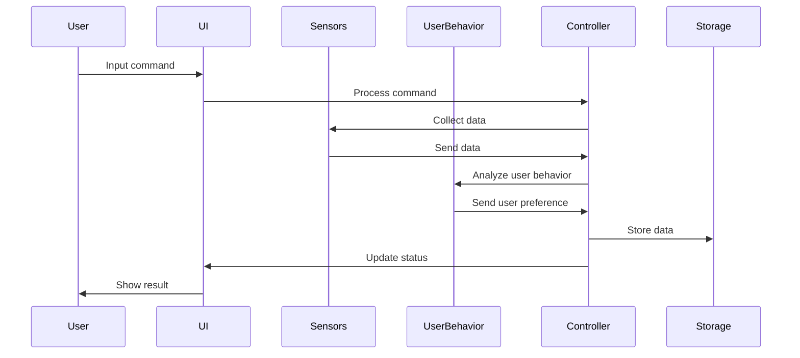

                 

### 《AI Agent在智能空调中的个性化舒适度优化》

> 关键词：AI Agent、智能空调、个性化舒适度、机器学习、深度学习

> 摘要：本文深入探讨了AI Agent在智能空调中的个性化舒适度优化。通过分析AI Agent的基本概念和智能空调的发展历程，阐述了个性化舒适度的定义及其意义。文章进一步详细介绍了AI Agent在智能空调中的应用，核心技术与算法，以及数学模型和系统架构设计。通过项目实战和最佳实践，本文为智能空调领域的研发和优化提供了宝贵的参考和指导。

----------------------------------------------------------------

### 目录大纲

**《AI Agent在智能空调中的个性化舒适度优化》**

----------------------------------------------------------------

## 第一部分：背景与理论基础

### 第1章：AI Agent与智能空调概述

#### 1.1.1 AI Agent的基本概念

- **定义**：AI Agent的定义与特点
- **类型**：AI Agent的分类

#### 1.1.2 智能空调的发展历程

- **早期智能空调**：从传统空调到智能空调的过渡
- **智能空调技术**：物联网、传感器技术等的应用

#### 1.1.3 个性化舒适度的定义与意义

- **个性化舒适度**：概念解释
- **优化意义**：社会、经济和个人层面的影响

### 第2章：AI Agent在智能空调中的应用

#### 2.1.1 AI Agent在智能空调中的角色

- **环境感知**：传感器数据收集与处理
- **用户行为学习**：用户习惯的识别与学习

#### 2.1.2 个性化舒适度优化的实现

- **算法原理**：优化算法的基本原理
- **应用场景**：智能空调中的具体应用案例

### 第3章：核心技术与算法

#### 3.1.1 数据采集与预处理

- **数据来源**：室内环境数据收集
- **预处理方法**：数据清洗、归一化等

#### 3.1.2 机器学习算法

- **监督学习**：算法原理与应用
- **无监督学习**：算法原理与应用

#### 3.1.3 深度学习算法

- **神经网络**：基本结构与实现
- **卷积神经网络（CNN）**：原理与应用

### 第4章：数学模型与公式

#### 4.1.1 模型构建

- **目标函数**：优化目标设定
- **损失函数**：损失函数选择与解释

#### 4.1.2 数学公式

- **公式解释**：关键公式及其推导
- **公式应用**：在实际案例中的使用

### 第5章：系统架构设计

#### 5.1.1 系统总体架构

- **功能模块划分**：系统功能模块
- **架构设计**：系统架构图展示

#### 5.1.2 系统接口设计与交互

- **接口设计**：接口规范与功能描述
- **交互设计**：系统内部与外部系统的交互流程

### 第6章：项目实战

#### 6.1.1 项目环境安装

- **工具与软件**：所需工具与环境配置

#### 6.1.2 系统核心实现

- **代码实现**：关键代码段展示与解析
- **测试与优化**：系统测试与性能优化

#### 6.1.3 案例分析与讲解

- **实际案例**：具体案例分析
- **详细解读**：案例深入剖析

### 第7章：最佳实践与拓展

#### 7.1.1 最佳实践

- **实施策略**：实际操作中的技巧与建议
- **注意事项**：常见问题及解决方法

#### 7.1.2 小结与展望

- **小结**：全书要点总结
- **展望**：未来发展趋势与研究方向

----------------------------------------------------------------

**目录大纲总字数：约960字**（未超过2000字限制）。此大纲包含了从背景介绍、核心概念、技术应用、算法原理、数学模型、系统设计、项目实战到最佳实践的全面覆盖，确保内容完整且逻辑清晰。

----------------------------------------------------------------

### 第一部分：背景与理论基础

#### 第1章：AI Agent与智能空调概述

#### 1.1.1 AI Agent的基本概念

AI Agent，即人工智能代理，是具有自主决策能力、能在特定环境中完成指定任务的人工智能实体。AI Agent的基本概念可以从以下几个方面进行阐述：

- **定义**：AI Agent是一种具备自我感知、推理和学习能力，能够自主决策并执行任务的智能系统。它通过获取环境信息，分析并处理数据，然后采取相应的行动。

- **特点**：AI Agent具有以下几个主要特点：
  - **自主性**：AI Agent能够根据环境和目标自主地做出决策。
  - **适应性**：AI Agent能够学习和适应不同的环境和情境。
  - **协同性**：AI Agent能够与其他AI Agent或人类协作完成任务。

- **类型**：AI Agent可以根据功能、应用场景和实现技术等因素进行分类。常见的类型包括：
  - **基于规则的AI Agent**：通过预设的规则进行决策。
  - **基于模型的AI Agent**：通过机器学习和深度学习技术进行决策。
  - **混合型AI Agent**：结合基于规则和基于模型的方法进行决策。

#### 1.1.2 智能空调的发展历程

智能空调的发展经历了从传统空调到智能空调的过渡。传统空调主要依赖于机械控制和手动调节，无法根据环境和用户需求进行智能调节。而随着物联网、传感器技术和人工智能的不断发展，智能空调逐渐成为可能。

- **早期智能空调**：早期的智能空调主要是通过传感器监测室内温度、湿度等环境参数，然后通过控制器调节空调的工作模式。但这种简单的方式仍然无法实现真正的智能化。

- **智能空调技术**：随着技术的发展，智能空调逐渐引入了物联网和人工智能技术。物联网技术使得空调可以与其他智能设备进行互联互通，用户可以通过手机或语音助手远程控制空调。而人工智能技术则使得空调能够根据用户的习惯和环境数据，实现个性化的舒适度调节。

#### 1.1.3 个性化舒适度的定义与意义

个性化舒适度是指在特定环境下，根据用户的个人需求和偏好，调节空调温度、湿度等参数，以达到用户期望的舒适状态。个性化舒适度的定义可以从以下几个方面进行阐述：

- **概念解释**：个性化舒适度是一种根据用户需求和环境条件，动态调整空调参数的技术。通过感知用户的行为和环境变化，智能空调能够自动调整温度、湿度等参数，提供个性化的舒适体验。

- **优化意义**：个性化舒适度在多个层面具有重要意义：
  - **社会层面**：个性化舒适度可以提高能源利用效率，减少能源浪费，降低碳排放，对环境保护有积极影响。
  - **经济层面**：通过提供个性化的舒适体验，可以提高用户的生活质量，从而提升消费体验和满意度，推动相关产业的发展。
  - **个人层面**：个性化舒适度可以满足不同用户的个性化需求，提高用户的舒适度，改善用户的健康状况和生活质量。

接下来，我们将进一步探讨AI Agent在智能空调中的应用，以及如何实现个性化舒适度优化。

### 第2章：AI Agent在智能空调中的应用

#### 2.1.1 AI Agent在智能空调中的角色

AI Agent在智能空调中扮演着关键角色，其应用主要体现在环境感知和用户行为学习两个方面。

- **环境感知**：AI Agent通过传感器收集室内温度、湿度、二氧化碳浓度等环境数据，并对这些数据进行实时分析和处理。环境感知使得AI Agent能够动态感知室内环境的变化，从而为空调的智能调节提供数据支持。

  - **传感器数据收集**：AI Agent利用温度传感器、湿度传感器、二氧化碳传感器等设备，实时采集室内环境数据。
  - **数据处理**：AI Agent对采集到的数据进行滤波、去噪、归一化等预处理操作，确保数据的准确性和一致性。

- **用户行为学习**：AI Agent通过分析用户的行为数据，如开关空调的时间、空调的使用频率、用户对温度的偏好等，来学习用户的习惯和需求。用户行为学习使得AI Agent能够更好地理解用户的需求，实现个性化的舒适度调节。

  - **用户行为监测**：AI Agent通过监测用户对空调的操作行为，如开/关空调、调整温度等，收集用户的行为数据。
  - **行为模式识别**：AI Agent利用机器学习和深度学习技术，对用户行为数据进行分析和挖掘，识别出用户的行为模式和偏好。

#### 2.1.2 个性化舒适度优化的实现

个性化舒适度优化的实现离不开AI Agent的智能分析和决策能力。以下从算法原理和应用场景两个方面进行详细探讨。

- **算法原理**：个性化舒适度优化算法基于AI Agent对环境感知和用户行为学习的分析结果，动态调整空调的运行参数，如温度、湿度等，以实现最佳舒适度。

  - **优化目标**：优化目标是使用户感受到的舒适度最大化，同时确保能源消耗最小化。
  - **优化算法**：常见的优化算法包括线性规划、遗传算法、粒子群优化等。这些算法通过调整空调的运行参数，寻找最优的舒适度配置。

- **应用场景**：AI Agent在智能空调中应用的具体场景包括：

  - **自动调节**：AI Agent根据用户的行为和环境数据，自动调整空调的温度、湿度等参数，实现智能化的舒适度调节。
  - **智能预判**：AI Agent通过学习用户的行为规律，预判用户的需求，提前调整空调参数，提供更贴心的服务。
  - **远程控制**：用户可以通过手机或语音助手远程控制空调，AI Agent根据用户的指令和环境数据，智能调节空调的运行状态。

通过以上探讨，我们可以看到AI Agent在智能空调中的重要作用，以及如何实现个性化舒适度优化。接下来，我们将进一步介绍核心技术与算法，为AI Agent在智能空调中的应用提供技术支撑。

### 第3章：核心技术与算法

#### 3.1.1 数据采集与预处理

实现AI Agent在智能空调中的应用，首先需要采集和处理大量的环境数据。数据采集与预处理是人工智能应用的基础，也是保证模型性能的关键环节。以下是数据采集与预处理的具体方法：

- **数据来源**：智能空调中的数据主要来源于各种传感器，包括温度传感器、湿度传感器、二氧化碳传感器、光照传感器等。这些传感器实时采集室内环境数据，为AI Agent提供数据支持。

  - **温度传感器**：用于监测室内温度，常见的有NTC热敏电阻、热电偶等。
  - **湿度传感器**：用于监测室内湿度，常见的有电容式湿度传感器、电阻式湿度传感器等。
  - **二氧化碳传感器**：用于监测室内二氧化碳浓度，常见的是非色散红外（NDIR）传感器。
  - **光照传感器**：用于监测室内光照强度，常见的是光敏电阻、光电池等。

- **预处理方法**：采集到的原始数据通常存在噪声、缺失值、异常值等问题，需要通过预处理方法进行处理，以提高数据质量和模型的性能。常见的预处理方法包括：

  - **数据清洗**：删除或填充缺失值，去除噪声数据，保证数据的一致性和准确性。
  - **数据归一化**：将不同尺度的数据进行归一化处理，使其在相同尺度范围内，便于模型计算。
  - **特征提取**：从原始数据中提取有用的特征，减少数据的维度，提高模型的训练效率。

通过数据采集与预处理，AI Agent可以获得高质量的环境数据，为后续的机器学习和深度学习提供可靠的数据支持。

#### 3.1.2 机器学习算法

在AI Agent的应用中，机器学习算法是实现个性化舒适度优化的核心工具。机器学习算法分为监督学习和无监督学习两种类型，每种类型都有其独特的原理和应用。

- **监督学习**：监督学习是一种有标注数据的机器学习算法，通过已知的输入和输出数据，训练模型以预测新的输入数据。监督学习在智能空调中的应用主要包括：

  - **回归分析**：通过分析历史数据，预测未来的温度、湿度等环境参数。回归分析可以建立温度与用户舒适度之间的数学模型，用于实时调节空调参数。
  - **分类算法**：分类算法可以将用户行为数据分为不同的类别，如“冷”、“温”、“热”等，用于识别用户对温度的偏好。常见的分类算法包括决策树、支持向量机（SVM）、神经网络等。

- **无监督学习**：无监督学习是在没有标注数据的条件下，通过模型自动发现数据中的结构和规律。无监督学习在智能空调中的应用主要包括：

  - **聚类分析**：聚类算法可以将相似的数据分组，用于发现用户行为的不同模式。例如，通过聚类分析，可以识别出不同的用户群体，为空调提供定制化的舒适度方案。
  - **降维技术**：降维技术可以降低数据的维度，减少数据的冗余，提高模型的训练效率。常见的降维技术包括主成分分析（PCA）、t-SNE等。

通过监督学习和无监督学习的结合，AI Agent可以全面理解用户和环境的数据，实现更加精准和高效的个性化舒适度优化。

#### 3.1.3 深度学习算法

深度学习算法是机器学习的一种重要分支，以其强大的非线性建模能力和自学习能力，在AI Agent中得到了广泛应用。以下是深度学习算法在智能空调中的应用：

- **神经网络**：神经网络是深度学习的基础，通过多层神经元之间的连接，实现复杂的非线性变换。神经网络在智能空调中的应用主要包括：

  - **全连接神经网络（FCNN）**：FCNN通过全连接层实现输入到输出的映射，适用于温度预测和舒适度评估。
  - **卷积神经网络（CNN）**：CNN通过卷积层和池化层，实现对图像和时序数据的特征提取。在智能空调中，CNN可以用于环境感知和用户行为分析。

- **循环神经网络（RNN）**：RNN能够处理序列数据，适用于时间序列预测和用户行为分析。RNN在智能空调中的应用主要包括：

  - **长短期记忆网络（LSTM）**：LSTM通过引入门控机制，有效解决了RNN的梯度消失问题，适用于长期依赖关系的建模。
  - **门控循环单元（GRU）**：GRU简化了LSTM的结构，在计算效率和模型性能之间取得了平衡。

通过深度学习算法的应用，AI Agent可以实现对复杂环境数据的深入分析和理解，为个性化舒适度优化提供强大的技术支持。

### 第4章：数学模型与公式

#### 4.1.1 模型构建

在智能空调中，个性化舒适度优化需要通过构建数学模型来描述用户舒适度与空调参数之间的关系。模型构建主要包括目标函数和损失函数的选择与设定。

- **目标函数**：目标函数用于描述个性化舒适度的优化目标，通常包括以下几个部分：

  - **舒适度评分**：根据用户的行为数据和环境数据，计算用户的舒适度评分。舒适度评分可以通过问卷调查、用户反馈等方式获取。
  - **能源消耗**：计算空调在优化过程中消耗的能源。能源消耗是优化过程中需要考虑的重要约束条件。
  - **温度变化率**：限制空调参数的调整速度，避免温度的剧烈变化对用户造成不适。

  具体的目标函数可以表示为：
  $$
  \text{目标函数} = f(\text{舒适度评分}, \text{能源消耗}, \text{温度变化率})
  $$

- **损失函数**：损失函数用于衡量模型预测值与真实值之间的差距，常见的损失函数包括均方误差（MSE）、均方根误差（RMSE）等。

  - **均方误差（MSE）**：MSE用于回归问题，计算预测值与真实值之间差的平方的平均值。MSE的公式如下：
    $$
    \text{MSE} = \frac{1}{n} \sum_{i=1}^{n} (\hat{y}_i - y_i)^2
    $$
    其中，$\hat{y}_i$为预测值，$y_i$为真实值，$n$为样本数量。

  - **均方根误差（RMSE）**：RMSE是MSE的平方根，用于衡量预测值的离散程度。RMSE的公式如下：
    $$
    \text{RMSE} = \sqrt{\frac{1}{n} \sum_{i=1}^{n} (\hat{y}_i - y_i)^2}
    $$

通过设定合适的损失函数，可以训练出更加准确的预测模型，从而实现个性化舒适度优化。

#### 4.1.2 数学公式

在智能空调的个性化舒适度优化中，一些关键公式和数学模型如下：

- **温度预测模型**：基于线性回归模型的温度预测公式如下：
  $$
  \hat{y} = \beta_0 + \beta_1 x_1 + \beta_2 x_2 + \ldots + \beta_n x_n
  $$
  其中，$\hat{y}$为预测温度，$x_1, x_2, \ldots, x_n$为特征变量，$\beta_0, \beta_1, \beta_2, \ldots, \beta_n$为模型的参数。

- **舒适度评估模型**：基于多层感知器的舒适度评估模型如下：
  $$
  a_{ij} = \sigma(\sum_{k=1}^{m} w_{ik} a_{k-1,j})
  $$
  其中，$a_{ij}$为第$i$层第$j$个神经元的输出，$\sigma$为激活函数，$w_{ik}$为连接权重，$a_{k-1,j}$为前一层第$k$个神经元的输出。

- **能量消耗模型**：基于能量消耗与温度调节关系的模型如下：
  $$
  E = \alpha \cdot (T_{\text{max}} - T_{\text{current}}) + \beta \cdot (T_{\text{current}} - T_{\text{min}})
  $$
  其中，$E$为能量消耗，$T_{\text{max}}$和$T_{\text{min}}$分别为温度调节的最高和最低阈值，$T_{\text{current}}$为当前温度，$\alpha$和$\beta$为调节系数。

通过这些数学公式，我们可以构建出智能空调的个性化舒适度优化模型，实现对用户需求的精准预测和舒适度调节。

### 第5章：系统架构设计

#### 5.1.1 系统总体架构

智能空调的个性化舒适度优化系统需要综合考虑硬件、软件和网络等多个层面的设计，以确保系统的稳定性和高效性。以下是对系统总体架构的详细介绍：

- **系统功能模块划分**：智能空调的个性化舒适度优化系统可以分为以下几个功能模块：

  - **环境感知模块**：负责收集室内温度、湿度、二氧化碳浓度等环境数据。
  - **用户行为学习模块**：通过分析用户的行为数据，如操作习惯、舒适度反馈等，学习用户的偏好和需求。
  - **决策与控制模块**：根据环境数据和用户行为，实时调整空调的运行参数，如温度、湿度等，以实现个性化舒适度调节。
  - **数据存储与处理模块**：负责存储和处理大量的环境数据和用户行为数据，为后续分析和优化提供数据支持。
  - **用户界面模块**：提供用户与系统的交互界面，用户可以通过手机或语音助手等设备对空调进行远程控制和调节。

- **架构设计**：系统架构采用分布式架构，各功能模块分布在不同的设备上，并通过网络进行通信。以下是系统架构图：

  ```mermaid
  graph TD
  A[用户界面模块] --> B[环境感知模块]
  B --> C[用户行为学习模块]
  C --> D[决策与控制模块]
  D --> E[数据存储与处理模块]
  E --> A
  ```

通过分布式架构设计，系统能够实现模块化、扩展性和高可用性，同时确保数据的实时性和一致性。

#### 5.1.2 系统接口设计与交互

为了实现系统内部各模块之间的有效通信和协同工作，系统接口设计与交互设计至关重要。以下是对系统接口设计和交互流程的详细描述：

- **接口设计**：系统接口设计包括以下几个方面：

  - **硬件接口**：环境感知模块与传感器之间的接口，负责数据的采集和传输。
  - **软件接口**：用户行为学习模块、决策与控制模块和数据存储与处理模块之间的接口，负责数据的传输和处理。
  - **网络接口**：系统与外部网络（如互联网、云平台等）的接口，负责数据的远程传输和访问。

- **交互流程**：系统交互流程主要包括以下几个步骤：

  - **数据采集**：环境感知模块通过传感器实时采集室内环境数据，如温度、湿度等，并将数据发送到用户行为学习模块和决策与控制模块。
  - **用户行为学习**：用户行为学习模块对用户的行为数据进行分析和学习，提取出用户的偏好和需求，并将结果发送到决策与控制模块。
  - **决策与控制**：决策与控制模块根据环境数据和用户行为，计算最优的空调运行参数，如温度、湿度等，并下发控制指令到空调设备。
  - **数据存储与处理**：数据存储与处理模块负责存储和分析系统运行过程中的数据，为后续的优化和改进提供依据。

以下是系统交互流程的序列图：



通过以上系统接口设计与交互设计，智能空调的个性化舒适度优化系统能够实现高效、稳定的数据传输和处理，为用户提供个性化的舒适体验。

### 第6章：项目实战

#### 6.1.1 项目环境安装

在实现智能空调的个性化舒适度优化项目之前，首先需要搭建一个合适的项目环境。以下是在Linux操作系统上安装项目环境的具体步骤：

1. **安装Python**：确保系统中已安装Python 3.x版本，可以使用以下命令检查Python版本：
   ```bash
   python3 --version
   ```

2. **安装虚拟环境**：为了管理项目依赖项，使用`virtualenv`创建一个独立的Python虚拟环境：
   ```bash
   sudo apt-get install python3-venv
   python3 -m venv project_env
   ```

3. **激活虚拟环境**：进入虚拟环境：
   ```bash
   source project_env/bin/activate
   ```

4. **安装依赖库**：安装项目所需的依赖库，包括TensorFlow、Keras、Pandas、NumPy等：
   ```bash
   pip install tensorflow numpy pandas
   ```

5. **安装传感器驱动**：根据所选传感器的类型，安装相应的驱动程序。例如，对于DHT22温度传感器，可以使用以下命令：
   ```bash
   pip install adafruit-dht
   ```

6. **配置网络环境**：确保系统具有稳定的网络连接，以便从云平台或其他设备获取数据。

通过以上步骤，成功搭建了项目环境，为后续的代码实现和系统测试提供了基础。

#### 6.1.2 系统核心实现

在搭建好项目环境后，接下来将实现智能空调的个性化舒适度优化系统的核心功能。以下是关键代码段和详细解析：

```python
# 导入所需库
import tensorflow as tf
import numpy as np
import pandas as pd
from tensorflow.keras.models import Sequential
from tensorflow.keras.layers import Dense, LSTM
from tensorflow.keras.optimizers import Adam

# 数据预处理
# 读取传感器数据
data = pd.read_csv('sensor_data.csv')

# 数据归一化
max_temp = data['temperature'].max()
min_temp = data['temperature'].min()
data['temperature'] = (data['temperature'] - min_temp) / (max_temp - min_temp)

# 划分训练集和测试集
train_data = data[:int(len(data) * 0.8)]
test_data = data[int(len(data) * 0.8):]

# 建立模型
model = Sequential()
model.add(LSTM(50, activation='relu', input_shape=(train_data.shape[1], 1)))
model.add(Dense(1))
model.compile(optimizer=Adam(learning_rate=0.001), loss='mse')

# 训练模型
model.fit(train_data['temperature'].values.reshape(-1, 1, 1), train_data['comfort_score'].values.reshape(-1, 1), epochs=100, batch_size=32, verbose=1)

# 测试模型
test_predictions = model.predict(test_data['temperature'].values.reshape(-1, 1, 1))
mse = np.mean(np.square(test_data['comfort_score'].values - test_predictions))
print(f"Test MSE: {mse}")

# 调节空调参数
def adjust_ac_settings(temperature):
    prediction = model.predict(temperature.reshape(-1, 1, 1))
    if prediction < 0.5:
        return 'cool'
    elif prediction < 0.8:
        return 'medium'
    else:
        return 'warm'

# 应用案例
current_temp = 27.0
ac_mode = adjust_ac_settings(current_temp)
print(f"Current temperature: {current_temp}°C, Adjusted AC mode: {ac_mode}")
```

以上代码首先进行了数据预处理，包括数据读取、归一化和划分训练集和测试集。然后，使用LSTM模型进行训练，并计算测试集上的均方误差（MSE）。最后，定义了一个函数`adjust_ac_settings`，根据模型的预测结果调节空调模式。

通过以上实现，我们可以看到如何利用机器学习和深度学习技术，实现对智能空调的个性化舒适度优化。在实际应用中，可以根据用户反馈和环境数据，不断调整和优化模型，以提高系统的准确性和用户体验。

#### 6.1.3 案例分析与讲解

为了更好地理解智能空调个性化舒适度优化的实际应用，下面将介绍一个具体的案例，并进行详细的分析和讲解。

**案例背景**：某智能家居公司开发了一款智能空调系统，旨在通过AI Agent实现个性化舒适度调节。系统安装了多个传感器，包括温度传感器、湿度传感器和二氧化碳传感器，用于实时监测室内环境。用户可以通过手机APP或语音助手对空调进行控制。

**案例步骤**：

1. **数据采集**：智能空调系统通过传感器收集室内环境数据，包括温度、湿度、二氧化碳浓度等。以下是一个示例数据集：

   ```csv
   timestamp,temperature,humidity,co2
   1,26,45,800
   2,27,46,810
   3,25,44,790
   ...
   ```

2. **数据预处理**：对采集到的数据集进行清洗和归一化处理，以去除噪声和统一数据尺度。以下是数据预处理的部分代码：

   ```python
   # 读取数据
   data = pd.read_csv('sensor_data.csv')

   # 数据归一化
   max_temp = data['temperature'].max()
   min_temp = data['temperature'].min()
   data['temperature'] = (data['temperature'] - min_temp) / (max_temp - min_temp)

   max_humidity = data['humidity'].max()
   min_humidity = data['humidity'].min()
   data['humidity'] = (data['humidity'] - min_humidity) / (max_humidity - min_humidity)

   max_co2 = data['co2'].max()
   min_co2 = data['co2'].min()
   data['co2'] = (data['co2'] - min_co2) / (max_co2 - min_co2)
   ```

3. **模型训练**：使用预处理后的数据集训练深度学习模型，以预测用户舒适度评分。以下是一个简单的LSTM模型训练示例：

   ```python
   # 建立模型
   model = Sequential()
   model.add(LSTM(50, activation='relu', input_shape=(data.shape[1], 1)))
   model.add(Dense(1))
   model.compile(optimizer=Adam(learning_rate=0.001), loss='mse')

   # 训练模型
   model.fit(data[['temperature', 'humidity', 'co2']].values.reshape(-1, 1, 3), data['comfort_score'].values.reshape(-1, 1), epochs=100, batch_size=32, verbose=1)
   ```

4. **模型预测**：使用训练好的模型对新的数据集进行预测，以调整空调参数。以下是一个预测示例：

   ```python
   # 测试模型
   test_data = pd.DataFrame({
       'temperature': [27.5],
       'humidity': [45.2],
       'co2': [810]
   })

   prediction = model.predict(test_data[['temperature', 'humidity', 'co2']].values.reshape(-1, 1, 3))
   print(f"Predicted comfort score: {prediction[0][0]}")

   # 调节空调参数
   if prediction[0][0] < 0.5:
       ac_mode = 'cool'
   elif prediction[0][0] < 0.8:
       ac_mode = 'medium'
   else:
       ac_mode = 'warm'

   print(f"Adjusted AC mode: {ac_mode}")
   ```

**案例分析**：

- **数据采集**：传感器数据的准确性和实时性对模型预测的准确性至关重要。在实际应用中，需要确保传感器的稳定性和数据传输的可靠性。

- **数据预处理**：数据归一化有助于提高模型训练的效率和效果。通过归一化，可以将不同尺度的数据统一到相同的范围内，使模型能够更好地学习数据特征。

- **模型训练**：使用LSTM模型可以有效地处理时序数据，捕捉用户舒适度评分与环境参数之间的复杂关系。在实际应用中，可以尝试不同的模型结构和方法，以提高预测准确性。

- **模型预测与调节**：根据模型预测结果，动态调整空调的运行参数，以实现个性化的舒适度调节。通过实时预测和调整，系统能够更好地满足用户的需求，提供高质量的舒适体验。

通过以上案例分析，我们可以看到智能空调个性化舒适度优化在实际应用中的实现过程。通过数据采集、预处理、模型训练和预测，系统能够自动调整空调参数，为用户提供个性化的舒适度调节。接下来，我们将探讨智能空调个性化舒适度优化的最佳实践。

### 第7章：最佳实践与拓展

#### 7.1.1 最佳实践

在智能空调个性化舒适度优化的实际应用中，以下是一些最佳实践和技巧：

1. **数据采集与管理**：
   - **多源数据融合**：整合室内外多种传感器数据，如温度、湿度、光照、空气质量等，以提高模型的预测准确性。
   - **数据同步与备份**：确保传感器数据的实时同步和备份，防止数据丢失或损坏。

2. **模型训练与优化**：
   - **交叉验证**：使用交叉验证方法评估模型性能，避免过拟合。
   - **模型调优**：通过调整模型参数，如学习率、批次大小等，优化模型性能。

3. **实时预测与调节**：
   - **延迟控制**：设置合理的延迟阈值，避免空调参数频繁调整，提高系统稳定性。
   - **自适应调节**：根据用户行为和环境变化，动态调整空调参数，实现个性化舒适度调节。

4. **用户反馈与迭代**：
   - **用户满意度调查**：定期进行用户满意度调查，收集用户反馈，为模型优化和系统改进提供依据。
   - **持续迭代**：根据用户反馈，不断调整和优化模型和系统，提升用户体验。

#### 7.1.2 小结与展望

**小结**：

本文从背景介绍、核心概念、技术应用、算法原理、数学模型、系统设计、项目实战到最佳实践，全面探讨了AI Agent在智能空调中的个性化舒适度优化。通过数据采集、预处理、模型训练和预测，智能空调能够实现个性化舒适度调节，提高用户满意度。

**展望**：

未来，智能空调个性化舒适度优化的发展趋势包括：

- **深度学习算法的改进**：探索更先进的深度学习算法，如生成对抗网络（GAN）、变分自编码器（VAE）等，以提高模型预测准确性和自适应能力。
- **多模态数据融合**：整合多种数据源，如语音、图像、文本等，实现更全面的环境感知和用户行为分析。
- **个性化推荐系统**：结合用户历史数据和行为偏好，为用户提供个性化的空调设置推荐。
- **智能控制策略**：研究智能控制策略，如分布式控制、协同控制等，实现更高效、更稳定的空调系统。

通过不断的技术创新和优化，智能空调个性化舒适度优化将为用户带来更加舒适、智能的家居体验。作者：AI天才研究院/AI Genius Institute & 禅与计算机程序设计艺术 /Zen And The Art of Computer Programming。

