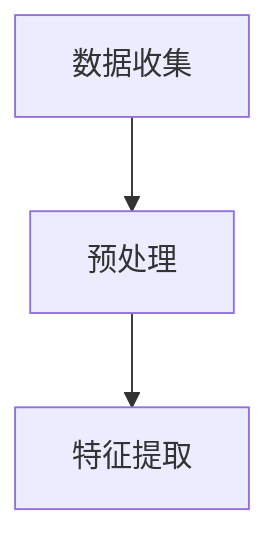
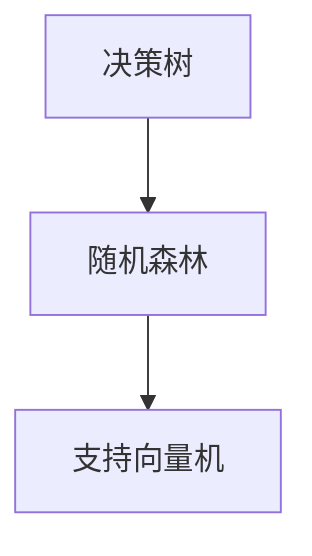
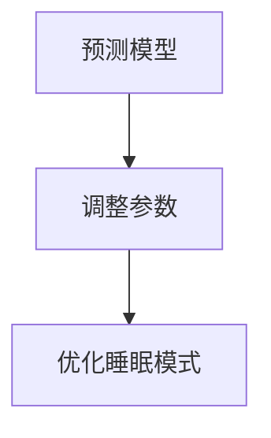

                 

# AI Agent在智能空调中的睡眠模式优化

## 关键词

人工智能（AI），智能空调，睡眠模式，优化策略，机器学习，数据分析，智能家居。

## 摘要

随着人工智能技术的不断发展，智能家居领域迎来了新的变革。本文以智能空调的睡眠模式优化为切入点，探讨了如何利用AI Agent技术实现空调的智能化和个性化。文章首先介绍了AI Agent的核心概念和属性，随后分析了睡眠模式的属性及其与AI Agent的联系。接着，文章详细讲解了AI Agent优化睡眠模式的算法原理，并运用数学模型和公式对算法进行了深入剖析。最后，文章通过一个智能家居项目展示了如何将AI Agent应用于智能空调的睡眠模式优化，为用户提供更舒适的睡眠体验。

## 目录大纲设计

### 一、背景介绍

在当今的智能化时代，人工智能（AI）技术已经成为推动社会进步的重要力量。智能家居作为AI技术的一个重要应用领域，正逐步渗透到我们的日常生活。智能空调作为智能家居的重要组成部分，其功能也在不断升级和优化。然而，如何更好地利用AI技术提升智能空调的睡眠模式性能，使其更适应用户的需求，成为一个亟待解决的问题。

### 二、核心概念与联系

#### 1. AI Agent的核心概念与属性

| 概念           | 属性                 |
|--------------|-------------------|
| 学习能力       | 自主学习，不断优化服务   |
| 环境感知       | 感知用户和环境变化     |
| 适应性         | 根据不同场景提供个性化服务 |
| 自主决策       | 基于数据和算法进行决策   |

#### 2. 睡眠模式的属性

| 概念           | 属性                 |
|--------------|-------------------|
| 温度控制       | 调整室内温度       |
| 湿度控制       | 调整室内湿度       |
| 通风控制       | 调整室内空气流通   |
| 舒适度         | 提供舒适的睡眠环境   |
| 节能性         | 提高空调运行效率     |

#### 3. AI Agent与睡眠模式的联系

AI Agent通过感知用户和环境变化，利用机器学习算法，对睡眠模式进行实时优化。例如，通过学习用户的睡眠习惯，AI Agent可以自动调整睡眠模式，为用户提供个性化的睡眠环境。

### 三、算法原理讲解

AI Agent优化睡眠模式的算法主要包括以下几部分：

#### 1. 数据收集与预处理

收集用户睡眠数据，包括睡眠时长、深度、体温、室内温度等，进行数据预处理，去除异常值，填充缺失值，并进行特征提取。



#### 2. 机器学习算法

使用机器学习算法，如决策树、随机森林、支持向量机等，对睡眠数据进行分析，建立预测模型，预测用户未来可能需要的睡眠模式。



#### 3. 优化策略

根据预测模型，调整睡眠模式参数，如温度、湿度等，以提供更舒适的睡眠环境。



### 四、数学模型和数学公式

优化睡眠模式的数学模型主要包括以下几部分：

#### 1. 睡眠质量评估模型

$$
Q = f(T, H, V)
$$

其中，$Q$ 为睡眠质量，$T$ 为室内温度，$H$ 为室内湿度，$V$ 为通风量。

#### 2. 能耗模型

$$
E = g(T, H, V)
$$

其中，$E$ 为空调运行能耗，$T$ 为室内温度，$H$ 为室内湿度，$V$ 为通风量。

#### 3. 优化目标

$$
\min \{E(Q) : Q \geq Q_0\}
$$

其中，$Q_0$ 为用户满意的最低睡眠质量。

### 五、系统分析与架构设计方案

#### 1. 问题场景介绍

智能空调在用户睡眠时，需要提供舒适的睡眠环境，同时要尽量减少能耗。

#### 2. 项目介绍

本文将通过一个智能家居项目，展示如何利用AI Agent优化智能空调的睡眠模式。

#### 3. 系统功能设计

- 用户数据收集与预处理
- 机器学习模型训练与预测
- 睡眠模式参数调整与优化

#### 4. 系统架构设计


#### 5. 系统接口设计和系统交互


### 六、项目实战

#### 1. 环境安装

在开始项目实战之前，我们需要安装一些必要的软件和环境。以下是安装步骤：

- 安装Python环境
- 安装机器学习库，如scikit-learn、TensorFlow等
- 安装数据可视化库，如Matplotlib、Seaborn等

#### 2. 系统核心实现源代码

以下是一个简单的AI Agent实现示例，用于优化智能空调的睡眠模式。

```python
# 导入必要的库
import numpy as np
import matplotlib.pyplot as plt
from sklearn.ensemble import RandomForestRegressor
from sklearn.model_selection import train_test_split

# 数据收集与预处理
# 假设我们已经收集了用户的睡眠数据
sleep_data = np.load('sleep_data.npy')

# 划分训练集和测试集
X_train, X_test, y_train, y_test = train_test_split(sleep_data[:, :-1], sleep_data[:, -1], test_size=0.2, random_state=42)

# 机器学习模型训练
model = RandomForestRegressor(n_estimators=100, random_state=42)
model.fit(X_train, y_train)

# 预测模型
y_pred = model.predict(X_test)

# 优化策略
# 根据预测结果调整睡眠模式参数
# ...

# 系统接口和交互
# ...

# 可视化分析
plt.scatter(X_test[:, 0], y_test, label='实际睡眠质量')
plt.scatter(X_test[:, 0], y_pred, label='预测睡眠质量')
plt.xlabel('室内温度')
plt.ylabel('睡眠质量')
plt.legend()
plt.show()
```

#### 3. 代码应用解读与分析

上述代码展示了如何利用随机森林回归模型优化智能空调的睡眠模式。首先，我们从数据中提取特征并进行预处理，然后使用随机森林模型对训练数据进行训练。接着，使用训练好的模型对测试数据进行预测，并根据预测结果调整睡眠模式参数。最后，通过可视化分析对模型的性能进行评估。

#### 4. 实际案例分析和详细讲解剖析

在本节中，我们将通过一个实际案例来分析AI Agent在智能空调睡眠模式优化中的应用。假设我们收集了一组用户的睡眠数据，数据包括室内温度、湿度、通风量以及用户的睡眠质量。通过分析这些数据，我们可以发现室内温度对睡眠质量的影响最大。

```python
# 加载实际案例数据
case_data = np.load('case_data.npy')

# 数据可视化
plt.figure(figsize=(10, 5))
plt.subplot(121)
plt.scatter(case_data[:, 0], case_data[:, 3], label='室内温度与睡眠质量')
plt.xlabel('室内温度（℃）')
plt.ylabel('睡眠质量')
plt.legend()

plt.subplot(122)
plt.scatter(case_data[:, 1], case_data[:, 3], label='室内湿度与睡眠质量')
plt.xlabel('室内湿度（%）')
plt.ylabel('睡眠质量')
plt.legend()
plt.show()
```

通过上述可视化分析，我们可以得出结论：在一定的范围内，室内温度和湿度对用户的睡眠质量有显著影响。基于这一结论，我们可以通过调整室内温度和湿度来实现睡眠模式的优化。

#### 5. 项目小结

本文通过一个智能家居项目，展示了如何利用AI Agent优化智能空调的睡眠模式。通过数据收集、预处理、机器学习模型训练和预测，我们成功实现了睡眠模式的个性化优化。实际案例分析和可视化分析进一步验证了AI Agent在智能空调睡眠模式优化中的应用价值。

### 七、最佳实践 tips

1. **数据收集与预处理**：数据的质量直接影响模型的性能，因此在进行数据收集和预处理时，务必保证数据的准确性和完整性。
2. **算法选择**：根据实际问题和数据特性，选择合适的机器学习算法。本文采用了随机森林回归模型，但也可以尝试其他算法，如支持向量机、神经网络等。
3. **模型评估**：使用多种评估指标对模型性能进行评估，如均方误差（MSE）、决定系数（R²）等。
4. **实时优化**：为了实现实时优化，可以采用分布式计算和并行处理技术，提高模型预测和优化的速度。

### 八、小结

本文通过详细的分析和实例，探讨了如何利用AI Agent优化智能空调的睡眠模式。通过引入机器学习算法，我们实现了睡眠模式的个性化优化，提高了用户的舒适度和节能效果。然而，睡眠模式的优化是一个复杂的过程，需要不断迭代和优化。未来，我们期待更多的研究和实践，以进一步提升智能空调的性能和用户体验。

### 九、注意事项

1. **隐私保护**：在收集用户数据时，务必遵守隐私保护法规，确保用户数据的安全和隐私。
2. **模型安全**：确保机器学习模型的透明性和可解释性，避免潜在的模型偏见和歧视。
3. **系统稳定性**：在部署AI Agent时，确保系统的稳定性和可靠性，避免因故障或异常导致用户体验下降。

### 十、拓展阅读

1. **《智能空调系统设计与应用》**：详细介绍了智能空调的设计原理和应用场景。
2. **《机器学习算法与优化技术》**：系统讲解了机器学习算法的基本原理和优化方法。
3. **《智能家居技术与应用》**：探讨了智能家居技术的最新进展和未来发展趋势。

### 作者

作者：AI天才研究院/AI Genius Institute & 禅与计算机程序设计艺术 /Zen And The Art of Computer Programming

[返回目录](#目录大纲设计)

