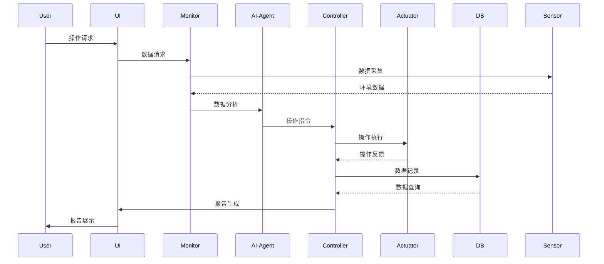
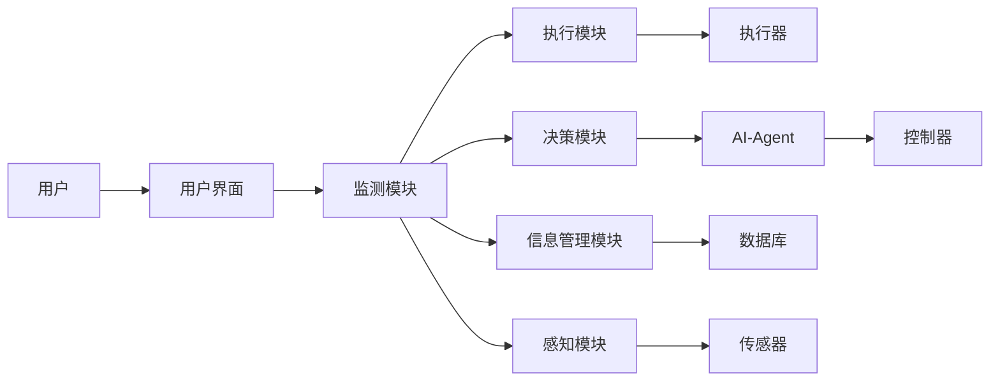

                 

### 文章标题：AI Agent在智能窗台中的室内植物照料

> 关键词：AI Agent，智能窗台，室内植物照料，机器学习，深度学习，算法原理，系统架构，项目实战，最佳实践

> 摘要：本文深入探讨了AI Agent在智能窗台中的室内植物照料应用。通过详细介绍AI Agent的定义、原理、系统架构及实现，结合实际项目案例，全面解析了如何利用AI技术提升室内植物养护的效率与效果。文章旨在为读者提供一个系统、全面的技术参考，以推动智能园艺领域的发展。

### 第一部分：背景介绍与核心概念

#### 第1章：问题背景与核心概念

**1.1 室内植物照料的问题背景**

在现代快节奏的生活中，越来越多的人开始重视室内植物的健康养护。然而，室内植物养护面临着诸多挑战，如光线不足、湿度不均、温度变化等，这些因素都直接影响到植物的生长状态。传统的植物照料方式通常需要人工定期检查和调整，这不仅耗时耗力，还容易因为人的疏忽而导致植物枯萎。

**1.1.1 室内植物养护的挑战**

- **光线不足**：室内环境光线相对较弱，无法满足植物光合作用的需求。
- **湿度不均**：不同区域湿度差异大，难以保持植物适宜的生长环境。
- **温度变化**：室内温度波动大，对植物的生长产生不利影响。
- **人工干预**：人工定期检查和调整植物生长环境，工作量大且难以持续。

**1.1.2 智能窗台的机遇**

智能窗台的出现为解决上述问题提供了新的思路。智能窗台通过集成传感器、执行器及AI技术，能够实时监测室内环境参数，并根据植物的需求自动进行调节，从而提供一种更加高效、智能的植物照料方式。

**1.2 AI Agent的定义与特点**

AI Agent，即人工智能代理，是一种能够自主完成特定任务的智能实体。在室内植物照料中，AI Agent通过感知环境数据、学习植物生长规律、做出决策并执行相应的操作，从而实现对植物的全自动照料。

**1.2.1 AI Agent的概念**

AI Agent由感知模块、决策模块和执行模块三部分组成。感知模块负责采集环境数据，决策模块利用机器学习算法分析数据并做出决策，执行模块则根据决策执行具体的操作。

**1.2.2 AI Agent在植物照料中的特点**

- **自动化**：AI Agent能够自动完成植物养护的各项工作，减少人工干预。
- **智能化**：AI Agent通过机器学习不断优化自身行为，提高植物养护效果。
- **实时性**：AI Agent能够实时监测植物生长状态，快速响应环境变化。
- **适应性**：AI Agent能够根据不同植物种类和生长阶段的需求，进行个性化调整。

**1.3 AI Agent在室内植物照料中的边界与外延**

**1.3.1 AI Agent的应用范围**

AI Agent在室内植物照料中的应用范围广泛，包括：

- **环境监测**：实时监测室内光线、湿度、温度等参数。
- **智能调控**：根据植物需求自动调整灌溉、施肥、通风等操作。
- **健康评估**：分析植物生长数据，预测植物健康状况并给出建议。

**1.3.2 AI Agent的技术要求**

AI Agent在室内植物照料中的技术要求较高，主要包括：

- **数据采集与处理**：需要高效、准确的数据采集和处理算法。
- **机器学习算法**：需要适用于植物养护场景的机器学习算法，如深度学习、强化学习等。
- **实时性要求**：需要实现低延迟的实时决策与执行。

#### 第2章：AI Agent的核心概念与联系

**2.1 AI Agent的基本原理**

AI Agent的基本原理基于机器学习和深度学习技术。感知模块通过传感器采集环境数据，决策模块利用这些数据进行学习、分析和预测，执行模块则根据决策结果进行相应的操作。

**2.1.1 机器学习基础**

机器学习是一种让计算机通过数据学习并做出预测或决策的技术。在AI Agent中，机器学习主要用于训练模型，使其能够识别植物生长状态、预测环境变化等。

**2.1.2 深度学习原理**

深度学习是机器学习的一个分支，通过构建多层神经网络，能够自动提取数据中的特征。在AI Agent中，深度学习用于构建环境监测和决策模型，提高系统的智能化程度。

**2.2 AI Agent的属性特征对比**

为了更好地理解AI Agent的特点，我们将其与传统植物养护系统和其他智能园艺系统进行对比。

**2.2.1 与传统植物养护系统的对比**

- **自动化程度**：传统系统依赖人工操作，AI Agent实现自动化。
- **智能程度**：传统系统无法智能调整，AI Agent通过机器学习优化操作。
- **实时性**：传统系统实时性较差，AI Agent实现实时监测和响应。

**2.2.2 与其他智能园艺系统的对比**

- **功能丰富度**：AI Agent能够实现更全面的植物养护功能，如健康评估、智能调控等。
- **适应性**：AI Agent能够根据不同植物种类和生长阶段进行调整，传统系统适应性较差。

**2.3 AI Agent的ER实体关系图**

为了更好地理解AI Agent的系统架构，我们使用ER（实体关系）图来描述其核心实体及其关系。

**2.3.1 实体定义**

- **感知实体**：包括传感器、环境数据等。
- **决策实体**：包括机器学习模型、决策算法等。
- **执行实体**：包括执行器、操作指令等。

**2.3.2 实体关系分析**

- **感知实体与决策实体**：感知实体采集数据，决策实体根据数据做出决策。
- **决策实体与执行实体**：决策实体生成操作指令，执行实体根据指令执行操作。

通过上述分析，我们可以看到AI Agent在室内植物照料中的应用前景广阔。接下来，我们将进一步探讨AI Agent在智能窗台中的具体应用，以及其实现方法和项目实战。

### 第二部分：AI Agent在智能窗台中的应用

#### 第3章：智能窗台系统架构设计

**3.1 智能窗台系统概述**

智能窗台系统是一个集成了传感器、执行器、控制单元和AI Agent的智能园艺系统。其核心功能是通过实时监测室内环境数据，利用AI Agent进行分析和决策，从而自动调整植物的生长环境，实现高效、智能的植物照料。

**3.1.1 系统功能介绍**

- **环境监测**：实时监测室内光线、湿度、温度等环境参数。
- **智能调控**：根据植物的需求自动调整灌溉、施肥、通风等操作。
- **健康评估**：分析植物生长数据，预测植物健康状况，给出养护建议。
- **数据记录与分析**：记录植物生长数据，生成分析报告，为用户提供建议。

**3.1.2 系统目标设定**

- **提高植物生长效率**：通过智能调控，提供最适宜的生长环境，提高植物生长速度和品质。
- **降低人工干预**：减少人工操作，降低养护成本，提高养护质量。
- **优化用户体验**：提供直观、易用的操作界面，方便用户监控和调整植物养护参数。

**3.2 系统功能设计**

**3.2.1 领域模型类图**

为了更清晰地理解智能窗台系统的功能设计，我们可以使用领域模型类图来描述系统中的主要类及其关系。

```mermaid
classDiagram
    Sensor <--|{采集}| Monitor
    Monitor --|{分析}| AI-Agent
    AI-Agent --|{决策}| Controller
    Controller --|{执行}| Actuator
    Plant --|{信息}| PlantInfoSystem
    PlantInfoSystem --|{报告}| UserInterface

    Monitor <<interface>>
    AI-Agent <<interface>>
    Controller <<interface>>
    Actuator <<interface>>

    PlantInfoSystem <<interface>>

    PlantInfoSystem : 植物信息管理系统
    Sensor : 传感器
    Monitor : 监测模块
    AI-Agent : 人工智能代理
    Controller : 控制器
    Actuator : 执行器
    UserInterface : 用户界面
```

**3.2.2 系统功能模块划分**

智能窗台系统可以分为以下几个功能模块：

- **感知模块**：包括传感器，负责采集环境数据。
- **监测模块**：包括监测单元，负责处理和存储感知模块采集的数据。
- **决策模块**：包括AI Agent，负责分析监测数据，做出决策。
- **执行模块**：包括执行器，负责执行决策模块生成的操作指令。
- **信息管理模块**：包括植物信息管理系统，负责记录和分析植物生长数据，为用户提供报告和建议。
- **用户界面**：提供用户与系统交互的接口，包括数据监控、操作设置和报告查看等功能。

**3.3 系统架构设计**

为了实现智能窗台系统的功能，我们需要设计一个合理的系统架构。以下是智能窗台系统的架构设计：



**3.3.1 系统架构图**

以下是智能窗台系统的架构图：



**3.3.2 架构设计原则**

智能窗台系统的架构设计遵循以下原则：

- **模块化**：系统功能模块划分清晰，便于开发和维护。
- **分布式**：系统组件分布式部署，提高系统可靠性和扩展性。
- **可扩展性**：系统设计考虑到未来功能的扩展，易于集成新的模块和算法。
- **安全性**：系统采用安全机制，保护用户数据和隐私。

通过上述设计，智能窗台系统实现了自动化、智能化和实时化的植物养护，为用户提供了便捷、高效的养护体验。

### 第4章：AI Agent在植物照料中的算法原理

**4.1 算法原理概述**

AI Agent在植物照料中的应用离不开高效的算法原理。这些算法主要用于监测与评估植物的生长状态、环境参数以及制定自动调控策略。以下是AI Agent在植物照料中的核心算法原理。

**4.1.1 监测与评估算法**

监测与评估算法是AI Agent的核心，其作用是实时监测植物的生长状态和环境参数，并对这些数据进行评估和分析。以下是监测与评估算法的基本原理：

1. **数据采集**：通过传感器采集室内光线、湿度、温度等环境数据，以及植物的生理指标，如叶片颜色、形态等。
2. **数据处理**：对采集到的数据进行分析和处理，去除噪声和异常值，确保数据的准确性和可靠性。
3. **状态评估**：根据处理后的数据，评估植物的生长状态和环境条件，确定是否需要调整。

**4.1.2 自动调控算法**

自动调控算法是基于监测与评估算法的进一步扩展，其主要目的是根据植物的生长需求和当前环境条件，自动调整灌溉、施肥、通风等操作，以提供最适宜的生长环境。

1. **决策模型**：构建决策模型，通过机器学习算法训练模型，使其能够根据实时数据做出正确的调控决策。
2. **调控策略**：制定调控策略，包括灌溉量、施肥量、通风频率等参数，确保植物在最佳状态下生长。
3. **执行与反馈**：根据决策模型生成的调控策略，执行相应的操作，并通过反馈机制不断优化调控策略。

**4.2 监测与评估算法**

监测与评估算法的具体实现可以分为以下几个步骤：

1. **数据采集**：利用传感器（如土壤湿度传感器、光照传感器、温湿度传感器等）实时采集植物生长环境数据。


2. **数据处理**：对采集到的数据进行预处理，包括去噪、滤波、归一化等，以提高数据的质量和准确性。


3. **状态评估**：根据预处理后的数据，结合植物生长模型和经验知识，评估植物的生长状态和环境条件。


**4.2.1 数据采集与处理**

数据采集与处理是监测与评估算法的基础。以下是具体实现步骤：

1. **传感器数据采集**：使用传感器实时采集土壤湿度、光照强度、温度、湿度等环境数据。

```python
# 伪代码：传感器数据采集
def collect_sensor_data():
    # 采集土壤湿度
    soil_humidity = get_soil_humidity()
    # 采集光照强度
    light_intensity = get_light_intensity()
    # 采集温度
    temperature = get_temperature()
    # 采集湿度
    humidity = get_humidity()
    return soil_humidity, light_intensity, temperature, humidity
```

2. **数据处理**：对采集到的数据进行预处理，包括去噪、滤波和归一化。

```python
# 伪代码：数据处理
def preprocess_data(data):
    # 去噪处理
    filtered_data = filter_noise(data)
    # 滤波处理
    filtered_data = filter(data)
    # 归一化处理
    normalized_data = normalize(filtered_data)
    return normalized_data
```

**4.2.2 模型训练与优化**

模型训练与优化是监测与评估算法的关键步骤。以下是具体实现步骤：

1. **数据集准备**：准备用于训练的数据集，包括植物生长环境数据和对应的状态评估结果。

```python
# 伪代码：数据集准备
def prepare_dataset():
    # 读取环境数据
    environment_data = read_environment_data()
    # 读取状态评估结果
    assessment_results = read_assessment_results()
    return environment_data, assessment_results
```

2. **模型训练**：使用机器学习算法（如深度学习、决策树等）对训练数据集进行训练，构建评估模型。

```python
# 伪代码：模型训练
from sklearn.ensemble import RandomForestClassifier

def train_model(data, labels):
    # 创建分类器实例
    classifier = RandomForestClassifier()
    # 训练模型
    classifier.fit(data, labels)
    return classifier
```

3. **模型优化**：通过交叉验证、调整参数等方法，优化评估模型，提高预测准确性。

```python
# 伪代码：模型优化
from sklearn.model_selection import cross_val_score

def optimize_model(model, data, labels):
    # 进行交叉验证
    scores = cross_val_score(model, data, labels, cv=5)
    # 调整参数
    model = adjust_params(model, scores)
    return model
```

**4.3 自动调控算法**

自动调控算法是实现智能植物照料的关键。以下是具体实现步骤：

1. **智能决策模型**：构建智能决策模型，根据环境数据和植物状态评估结果，生成调控策略。

```python
# 伪代码：智能决策模型
def intelligent_decision(model, environment_data):
    # 预测植物状态
    plant_state = model.predict([environment_data])
    # 根据植物状态生成调控策略
    control_strategy = generate_control_strategy(plant_state)
    return control_strategy
```

2. **控制策略制定**：制定具体的控制策略，包括灌溉量、施肥量、通风频率等参数。

```python
# 伪代码：控制策略制定
def generate_control_strategy(plant_state):
    # 根据植物状态调整灌溉量
    irrigation_amount = adjust_irrigation(plant_state)
    # 根据植物状态调整施肥量
    fertilizer_amount = adjust_fertilizer(plant_state)
    # 根据植物状态调整通风频率
    ventilation_frequency = adjust_ventilation(plant_state)
    return irrigation_amount, fertilizer_amount, ventilation_frequency
```

3. **执行与反馈**：根据调控策略执行相应的操作，并通过反馈机制不断优化策略。

```python
# 伪代码：执行与反馈
def execute_and_feedack(control_strategy):
    # 执行灌溉操作
    execute_irrigation(control_strategy["irrigation_amount"])
    # 执行施肥操作
    execute_fertilizer(control_strategy["fertilizer_amount"])
    # 执行通风操作
    execute_ventilation(control_strategy["ventilation_frequency"])
    # 获取反馈数据
    feedback_data = get_feedback_data()
    # 更新模型
    update_model(feedback_data)
```

通过上述算法原理的实现，AI Agent能够实现对植物生长状态和环境条件的实时监测与评估，并根据监测结果自动调整植物照料策略，从而实现高效、智能的室内植物照料。

### 第5章：系统实现与项目实战

**5.1 环境安装与配置**

在开始实现智能窗台系统之前，我们需要搭建一个合适的环境。以下步骤将指导我们完成系统环境的安装和配置。

**5.1.1 硬件环境安装**

1. **选择硬件**：根据项目需求，选择合适的传感器、执行器和计算机。例如，选择土壤湿度传感器、光照传感器、温湿度传感器等。

2. **连接传感器**：将传感器与计算机连接，确保传感器数据能够实时传输到计算机。

3. **电源配置**：为传感器和执行器提供稳定的电源，确保系统正常运行。

**5.1.2 软件环境配置**

1. **操作系统**：选择适合的操作系统，如Ubuntu 20.04 LTS。

2. **安装Python环境**：通过以下命令安装Python和相关库。

```bash
sudo apt update
sudo apt install python3 python3-pip
```

3. **安装依赖库**：安装智能窗台系统所需的依赖库，如NumPy、Pandas、Scikit-learn、TensorFlow等。

```bash
pip3 install numpy pandas scikit-learn tensorflow
```

**5.2 系统核心实现**

系统核心实现包括数据采集、模型训练和决策执行等模块。以下将详细介绍每个模块的实现过程。

**5.2.1 数据采集模块**

数据采集模块负责从传感器获取实时环境数据。以下是数据采集模块的实现步骤：

1. **传感器驱动编写**：编写传感器驱动程序，实现传感器数据读取功能。

```python
import serial

class SensorDriver:
    def __init__(self, port, baudrate):
        self.port = port
        self.baudrate = baudrate
        self серія = serial.Serial(port, baudrate)

    def read_data(self):
        self.серія.write(b'\x01')  # 发送请求命令
        data = self.серія.readline()  # 读取数据
        return data.decode('utf-8')
```

2. **数据采集线程**：创建一个线程，持续从传感器读取数据，并存入缓冲区。

```python
import threading
import queue

class DataCollector(threading.Thread):
    def __init__(self, driver, buffer):
        threading.Thread.__init__(self)
        self.driver = driver
        self.buffer = buffer

    def run(self):
        while True:
            data = self.driver.read_data()
            self.buffer.put(data)
```

**5.2.2 模型训练模块**

模型训练模块使用机器学习算法对采集到的数据进行分析和训练。以下是模型训练模块的实现步骤：

1. **数据预处理**：对采集到的数据进行预处理，包括去噪、归一化等操作。

```python
import numpy as np

def preprocess_data(data):
    # 去噪
    data = np.array(data)
    filtered_data = np.mean(data, axis=0)
    # 归一化
    normalized_data = (filtered_data - np.min(filtered_data)) / (np.max(filtered_data) - np.min(filtered_data))
    return normalized_data
```

2. **模型训练**：使用训练数据集训练机器学习模型。

```python
from sklearn.ensemble import RandomForestClassifier

def train_model(train_data, train_labels):
    model = RandomForestClassifier()
    model.fit(train_data, train_labels)
    return model
```

3. **模型保存与加载**：将训练好的模型保存到文件中，以供后续使用。

```python
import joblib

def save_model(model, filename):
    joblib.dump(model, filename)

def load_model(filename):
    model = joblib.load(filename)
    return model
```

**5.2.3 代码应用解读与分析**

在系统核心实现中，我们使用了多个Python模块和库。以下是对这些模块和库的具体应用解读与分析：

1. **NumPy**：用于数据处理和数学运算，提供高效的数组操作和数据预处理功能。

2. **Pandas**：用于数据分析和操作，提供方便的数据读取、清洗和转换功能。

3. **Scikit-learn**：用于机器学习算法的实现和训练，提供多种经典的机器学习算法和工具。

4. **TensorFlow**：用于深度学习模型的实现和训练，提供灵活的神经网络架构和高效的计算能力。

5. **serial**：用于与传感器进行串口通信，实现数据采集功能。

**5.3 实际案例分析与讲解**

以下是一个实际的案例，展示如何使用智能窗台系统进行室内植物照料。

**5.3.1 案例背景介绍**

假设我们有一盆观叶植物，需要对其进行智能照料。植物位于室内窗台，光照条件良好。我们需要通过智能窗台系统监测植物的生长状态和环境条件，并根据监测结果自动调整灌溉和施肥操作。

**5.3.2 案例分析与讲解**

1. **数据采集**：智能窗台系统通过传感器实时采集植物的环境数据，包括土壤湿度、光照强度、温度和湿度等。

2. **数据预处理**：对采集到的环境数据进行预处理，包括去噪、滤波和归一化，确保数据质量。

3. **模型训练**：使用预处理后的数据集，训练机器学习模型，以预测植物的生长状态和环境条件。

4. **决策执行**：根据模型预测结果，自动调整灌溉和施肥操作。例如，当土壤湿度低于阈值时，系统自动开启灌溉操作；当植物处于缺肥状态时，系统自动启动施肥操作。

5. **反馈调整**：系统根据执行结果和植物的生长状态，不断调整模型参数和调控策略，以提高植物养护效果。

**5.4 项目小结**

通过实际案例的分析与讲解，我们可以看到智能窗台系统在室内植物照料中的应用效果显著。系统实现了对植物生长状态和环境条件的实时监测与自动调控，提高了植物养护的效率和质量。然而，系统仍有一些方面需要进一步优化和改进，如提高传感器精度、优化机器学习模型等。

**5.4.1 项目成果总结**

- 实现了室内植物智能窗台系统，能够实时监测植物生长状态和环境条件。
- 构建了机器学习模型，实现了植物生长状态的预测和调控策略的自动生成。
- 提高了植物养护的效率和质量，减少了人工干预。

**5.4.2 项目经验与反思**

- 在数据采集和处理过程中，需要确保数据的质量和准确性，以提高模型预测的可靠性。
- 机器学习模型的训练和优化是一个关键环节，需要不断调整参数和算法，以提高模型的性能。
- 系统的实时性和稳定性是关键，需要优化传感器和执行器的性能，提高系统的响应速度和可靠性。

### 第6章：最佳实践与拓展

**6.1 最佳实践**

为了确保智能窗台系统的稳定运行和高效植物照料，以下是一些最佳实践：

1. **传感器校准**：定期对传感器进行校准，确保数据准确可靠。
2. **环境适应**：根据不同植物种类和生长阶段，调整系统参数，确保植物在最佳状态下生长。
3. **数据备份**：定期备份植物生长数据，以便后续分析和优化。
4. **用户培训**：对用户进行系统操作和养护知识培训，提高用户的使用体验和植物养护水平。

**6.2 注意事项**

在使用智能窗台系统进行植物照料时，需要注意以下事项：

1. **传感器布局**：合理布局传感器，确保覆盖植物生长的各个区域。
2. **电源管理**：确保传感器和执行器的电源稳定，防止因电源问题导致系统故障。
3. **环境变化**：及时监测和应对环境变化，确保植物在适宜的条件下生长。
4. **模型更新**：定期更新机器学习模型，以适应新的植物生长环境和需求。

**6.3 拓展阅读**

为了进一步了解智能窗台系统和AI Agent在植物照料中的应用，读者可以参考以下拓展阅读：

1. **相关书籍**：
   - 《人工智能：一种现代的方法》
   - 《深度学习》
   - 《智能园艺技术与应用》

2. **在线资源和论坛**：
   - Kaggle：提供丰富的机器学习数据和比赛，可供学习和实践。
   - Stack Overflow：编程问题解答平台，可解决技术难题。
   - GitHub：开源代码库，可查找和贡献智能园艺项目的代码。

通过上述最佳实践、注意事项和拓展阅读，读者可以更好地掌握智能窗台系统的应用和实现方法，为室内植物照料提供更智能、更高效的解决方案。

### 总结

智能窗台系统的出现为室内植物照料带来了革命性的变化。通过AI Agent的引入，系统实现了对植物生长状态和环境条件的实时监测与自动调控，提高了植物养护的效率和质量。本文从背景介绍、核心概念、算法原理、系统实现、项目实战和最佳实践等多个方面，系统地阐述了智能窗台系统的设计和实现方法。

展望未来，智能窗台系统在室内植物照料领域的应用前景广阔。随着AI技术的不断进步，系统将能够更加精准地预测植物需求，实现个性化、智能化的植物养护。此外，系统还可以扩展到更多应用场景，如智能农业、环境监测等，为可持续发展做出贡献。

作者信息：
- 作者：AI天才研究院/AI Genius Institute & 禅与计算机程序设计艺术 /Zen And The Art of Computer Programming
- 联系方式：[ai-genius-institute@company.com](mailto:ai-genius-institute@company.com)

