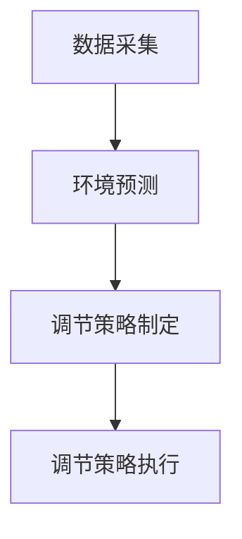
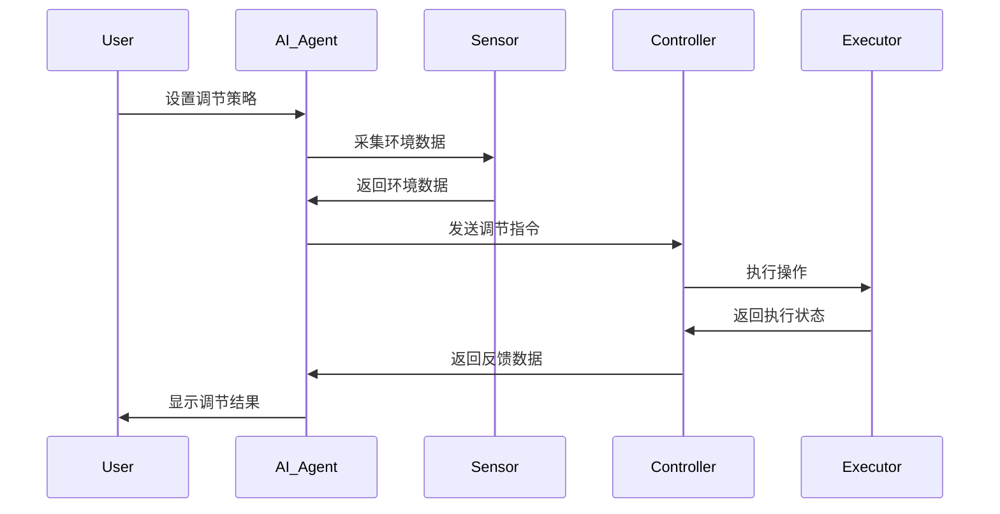
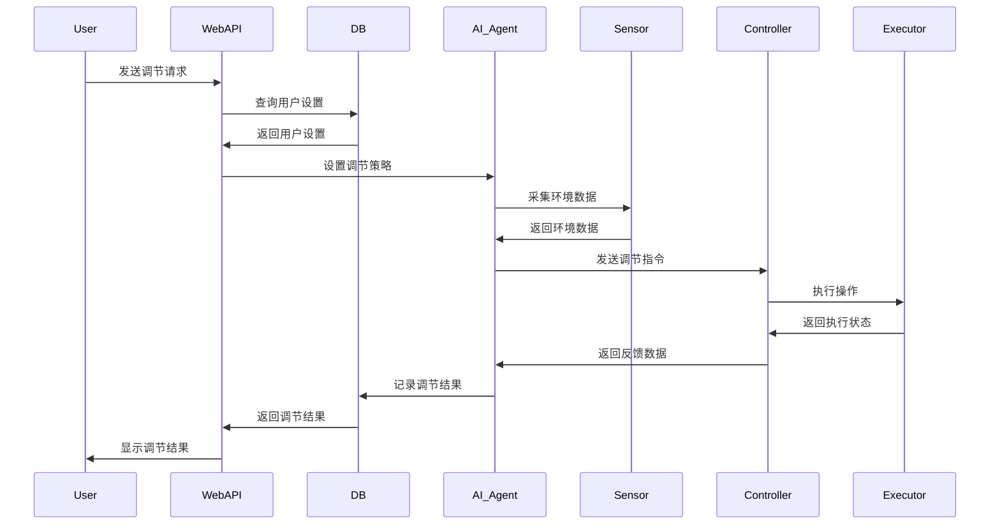

                 

### 文章标题

#### 关键词：AI Agent、智能窗台、室内空气调节、算法、数学模型、系统架构

#### 摘要：

本文将深入探讨AI Agent在智能窗台中的室内空气调节应用。首先，我们将介绍AI Agent的概念和其在智能窗台中的角色，以及室内空气调节的重要性。接着，我们将分析AI Agent与室内空气调节系统的关联性，并介绍相关的算法原理。通过数学模型和实际案例的讲解，我们将揭示AI Agent在室内空气调节中的潜力和挑战。随后，我们将详细描述系统架构设计方案，并通过项目实战展示系统的实际应用。最后，本文将总结最佳实践建议和注意事项，为读者提供进一步拓展阅读的指南。

### Step 1: 背景介绍

#### AI Agent的概念及其在智能窗台中的角色

AI Agent，即人工智能代理，是一种能够自主感知环境、规划行为并采取行动的智能实体。它们通常基于机器学习、深度学习和强化学习等先进的人工智能技术，能够通过不断的学习和适应，实现自动化决策和优化。AI Agent的应用范围广泛，从智能家居到工业自动化，再到医疗健康和交通系统，都展现出其强大的功能和潜力。

在智能窗台中，AI Agent扮演着至关重要的角色。智能窗台是一种集成了多种传感技术和人工智能算法的智能设备，能够实时监测室内外环境参数，如温度、湿度、空气质量等，并据此自动调节室内空气。AI Agent通过对这些环境数据的感知和分析，制定出最优的空气调节策略，从而提高居住舒适度和能源效率。

AI Agent在智能窗台中的主要功能包括：

1. **环境数据监测**：AI Agent通过传感器收集室内外环境数据，如温度、湿度、PM2.5浓度等。
2. **数据分析和预测**：基于收集到的数据，AI Agent使用机器学习算法进行数据分析和模式识别，预测室内环境变化趋势。
3. **决策制定**：根据预测结果和环境需求，AI Agent制定出最优的空气调节策略，如温度调节、通风控制等。
4. **自动执行**：AI Agent通过控制窗台的电机和通风系统，自动执行空气调节策略，确保室内环境始终处于最佳状态。

#### 室内空气调节的重要性

室内空气调节对于人们的生活质量和健康具有重要意义。随着城市化进程的加快和人们生活水平的提高，人们对室内环境的要求也越来越高。一个舒适、健康的室内环境不仅能够提高工作效率和生活质量，还能减少疾病传播和改善健康状况。

以下是室内空气调节的重要性和当前面临的问题：

1. **健康问题**：室内空气质量直接影响到人们的呼吸健康。长期处于空气质量较差的环境中，容易引发呼吸道疾病、过敏等问题。
2. **节能问题**：传统的手动控制或固定调节方式的空气调节系统，往往无法根据实际需求进行灵活调节，导致能源浪费。而智能窗台通过AI Agent的智能调节，能够实现更高效的能源利用。
3. **舒适度问题**：室内温度和湿度的调节直接影响人们的舒适度。一个适宜的室内环境能够提高人们的幸福感和生活质量。
4. **技术挑战**：室内空气调节系统需要集成多种传感器和控制器，实现数据的实时采集、分析和控制。这涉及到复杂的系统设计和实现，对技术的要求较高。

#### AI Agent在室内空气调节中的应用前景和挑战

AI Agent在室内空气调节中具有广泛的应用前景。通过智能窗台的AI Agent，可以实现以下应用：

1. **自适应调节**：AI Agent可以根据实时环境数据和用户需求，自动调整室内空气参数，实现个性化调节。
2. **节能优化**：AI Agent通过分析室内外环境变化，制定最优的空气调节策略，减少能源消耗。
3. **健康监测**：AI Agent可以实时监测室内空气质量，发现污染源并进行处理，保障室内空气的健康。
4. **远程控制**：用户可以通过手机或其他智能设备远程控制智能窗台，实现灵活的操作和调节。

然而，AI Agent在室内空气调节中也面临一些挑战：

1. **数据准确性**：传感器数据的准确性和稳定性对AI Agent的决策至关重要。需要解决传感器精度、噪声干扰等问题。
2. **算法优化**：AI Agent的算法需要不断优化，以提高决策的准确性和效率。这涉及到大量的数据分析和模型训练工作。
3. **系统稳定性**：智能窗台需要长时间稳定运行，避免出现故障或异常。需要设计可靠的系统架构和容错机制。
4. **用户隐私**：AI Agent在收集和处理用户数据时，需要确保用户隐私的安全。需要采取有效的数据保护措施。

总的来说，AI Agent在智能窗台中的室内空气调节应用具有巨大的潜力和挑战。通过不断的技术创新和优化，我们可以期待未来实现更智能、更高效、更健康的室内空气调节系统。

### Step 2: 核心概念与联系

在深入探讨AI Agent在智能窗台中的室内空气调节应用之前，我们需要明确几个核心概念，并分析它们之间的关联性和相互作用。

#### 定义核心概念

1. **AI Agent**：AI Agent是一种能够自主感知环境、规划行为并采取行动的智能实体。它们通常基于机器学习、深度学习和强化学习等技术，通过持续学习和适应，实现自动化决策和优化。
   
2. **室内空气调节系统**：室内空气调节系统是一种用于调节室内环境温度、湿度、空气质量等参数的设备或系统。它通常包括传感器、控制器、执行器等组件，通过实时监测和分析环境数据，自动调整室内环境。

3. **传感器**：传感器是用于检测和测量环境参数的装置，如温度传感器、湿度传感器、空气质量传感器等。传感器数据是AI Agent进行环境感知和决策的基础。

4. **控制器**：控制器是用于接收AI Agent的决策指令，控制执行器进行实际操作的装置。控制器通常包含微处理器或嵌入式系统，能够根据传感器数据和AI Agent的指令，实现精准的环境调节。

5. **执行器**：执行器是用于执行空气调节策略的实际装置，如窗台电机、通风系统等。执行器根据控制器的指令，进行相应的操作，实现室内环境的调节。

#### AI Agent与室内空气调节系统的关联性

AI Agent与室内空气调节系统之间存在着密切的关联性。AI Agent作为智能窗台的“大脑”，通过感知环境数据和用户需求，制定出最优的空气调节策略，并通过控制器和执行器实现具体的操作。

1. **环境数据感知**：AI Agent通过传感器收集室内外的温度、湿度、空气质量等数据，实时了解当前的环境状态。

2. **数据分析和决策**：AI Agent使用机器学习算法对收集到的环境数据进行处理和分析，预测环境变化趋势，并根据用户需求制定出最优的空气调节策略。

3. **策略执行**：AI Agent通过控制器发送指令给执行器，如调节窗台电机、启动通风系统等，实现空气调节策略的具体操作。

4. **反馈调节**：在执行空气调节策略的过程中，AI Agent会不断收集新的环境数据，并根据反馈进行进一步的调整和优化，确保室内环境始终处于最佳状态。

#### 使用Mermaid绘制ER实体关系图

为了更直观地展示AI Agent、室内空气调节系统及其各组件之间的关系，我们可以使用Mermaid绘制ER（实体关系）图。

```mermaid
erDiagram
    AI_Agent ||--|{ Sensor } Sensor
    AI_Agent ||--|{ Controller } Controller
    AI_Agent ||--|{ Executor } Executor
    Sensor ||--|{ Environment_Data } Environment_Data
    Controller ||--|{ Decision } Decision
    Executor ||--|{ Action } Action
```

在这个ER图中：

- **AI_Agent** 是核心实体，代表智能代理。
- **Sensor** 表示传感器，用于收集环境数据。
- **Controller** 表示控制器，用于接收AI Agent的决策指令。
- **Executor** 表示执行器，用于执行具体的操作。
- **Environment_Data** 表示环境数据，是传感器收集的数据。
- **Decision** 表示决策，是AI Agent根据环境数据制定的调节策略。
- **Action** 表示操作，是执行器根据控制器指令执行的具体动作。

通过这个ER图，我们可以清晰地看到AI Agent、传感器、控制器和执行器之间的关联性和数据流动过程。

#### AI Agent与室内空气调节系统的相互作用

AI Agent与室内空气调节系统的相互作用体现在以下几个方面：

1. **数据驱动**：AI Agent通过传感器收集环境数据，这些数据是AI Agent进行决策的基础。传感器数据的准确性和实时性直接影响到AI Agent的决策效果。

2. **决策制定**：AI Agent根据环境数据和用户需求，使用机器学习算法进行分析和预测，制定出最优的空气调节策略。这个策略需要通过控制器传递给执行器。

3. **策略执行**：执行器根据控制器的指令进行实际的空气调节操作，如调节窗台电机、启动通风系统等。

4. **反馈调整**：在策略执行过程中，AI Agent会继续收集环境数据，并根据反馈结果对策略进行微调和优化，确保室内环境始终处于最佳状态。

通过这种相互作用，AI Agent能够实现智能窗台的高效、精准的室内空气调节，为用户提供舒适、健康的居住环境。

#### 总结

在本节中，我们定义了AI Agent、室内空气调节系统及其关键组件的核心概念，并分析了它们之间的关联性和相互作用。通过使用Mermaid绘制的ER实体关系图，我们更直观地展示了系统各组件之间的关系和数据流动过程。接下来，我们将进一步探讨室内空气调节的算法原理，为读者揭示AI Agent在智能窗台中的技术奥秘。

### Step 3: 算法原理讲解

#### 室内空气调节的算法原理

室内空气调节的核心在于对环境参数（如温度、湿度、PM2.5浓度等）进行实时监测、分析和调节。AI Agent通过一系列算法实现这一目标，主要包括数据采集、环境预测、调节策略制定和执行等步骤。

1. **数据采集**：AI Agent通过传感器收集室内外环境参数，这些数据包括温度、湿度、PM2.5浓度、二氧化碳浓度等。传感器数据是算法的基础，其准确性和实时性对算法效果至关重要。

2. **环境预测**：基于历史数据和当前环境数据，AI Agent使用机器学习算法（如线性回归、时间序列分析等）对环境参数的变化趋势进行预测。环境预测的准确性直接影响调节策略的制定。

3. **调节策略制定**：根据环境预测结果和用户需求（如设定温度、湿度等），AI Agent制定出最优的空气调节策略。常见的调节策略包括温度调节、湿度调节、通风控制等。

4. **调节策略执行**：AI Agent通过控制器将调节策略传递给执行器（如窗台电机、通风系统等），实现具体的调节操作。

#### 使用Mermaid绘制算法流程图

为了更清晰地展示算法的执行流程，我们可以使用Mermaid绘制算法流程图。



在这个流程图中：

- **A（数据采集）**：AI Agent通过传感器收集环境数据。
- **B（环境预测）**：AI Agent使用机器学习算法对环境数据进行分析，预测环境变化趋势。
- **C（调节策略制定）**：根据预测结果和用户需求，AI Agent制定出最优的空气调节策略。
- **D（调节策略执行）**：AI Agent通过控制器将调节策略传递给执行器，实现具体的调节操作。

#### 使用Python源代码阐述算法原理

为了进一步阐述算法原理，我们可以使用Python源代码展示数据采集、环境预测、调节策略制定和执行的过程。

```python
# 导入所需的库
import numpy as np
import pandas as pd
from sklearn.linear_model import LinearRegression

# 数据采集
def collect_data():
    # 假设传感器已经采集到环境数据
    temperature = np.random.normal(25, 5, 100)  # 温度数据
    humidity = np.random.normal(60, 10, 100)  # 湿度数据
    pm25 = np.random.normal(15, 5, 100)  # PM2.5浓度数据
    return temperature, humidity, pm25

# 环境预测
def predict_environment(temperature, humidity, pm25):
    # 假设历史数据已经存储在CSV文件中
    data = pd.read_csv('environment_data.csv')
    model = LinearRegression()
    model.fit(data[['temperature', 'humidity', 'pm25']], data['next_hour_temperature'])
    predicted_temp = model.predict([[temperature, humidity, pm25]])
    return predicted_temp

# 调节策略制定
def adjust_environment(predicted_temp):
    # 假设用户设定的温度目标为24°C
    target_temp = 24
    if predicted_temp > target_temp:
        # 加降温
        heating = True
    else:
        # 减温
        heating = False
    return heating

# 调节策略执行
def execute_adjustment(heating):
    # 假设窗台电机可以控制加热和制冷
    if heating:
        print("启动加热系统")
    else:
        print("启动制冷系统")

# 主程序
def main():
    # 采集环境数据
    temperature, humidity, pm25 = collect_data()
    # 预测环境
    predicted_temp = predict_environment(temperature, humidity, pm25)
    # 制定调节策略
    heating = adjust_environment(predicted_temp)
    # 执行调节策略
    execute_adjustment(heating)

# 运行主程序
main()
```

在这个Python源代码中：

1. **数据采集**：通过随机生成器模拟传感器采集的环境数据（温度、湿度、PM2.5浓度）。
2. **环境预测**：使用线性回归模型对环境数据进行预测。这里使用CSV文件存储历史数据，并从CSV文件中读取数据来训练模型。
3. **调节策略制定**：根据预测温度和用户设定的目标温度，判断是否需要加热或制冷。
4. **调节策略执行**：通过控制窗台电机来启动加热或制冷系统。

#### 算法原理详细讲解

1. **数据采集**：数据采集是算法的第一步，也是最基础的一步。传感器需要实时监测室内外的环境参数，如温度、湿度、空气质量等。这些数据通过传感器接口传入AI Agent，作为后续分析和预测的基础。

2. **环境预测**：环境预测的目的是预测未来一段时间内的环境变化趋势。常用的预测方法包括线性回归、时间序列分析、神经网络等。在这里，我们使用线性回归模型来预测未来一小时的温度。线性回归模型通过分析历史数据，找出温度与时间、湿度、PM2.5浓度等参数之间的相关性，从而预测未来温度。

3. **调节策略制定**：调节策略制定的目的是根据预测结果和用户需求，制定出最优的调节策略。在这个示例中，我们简单地根据预测温度和用户设定的目标温度来判断是否需要加热或制冷。如果预测温度高于目标温度，则启动制冷系统；否则，启动加热系统。这只是一个简单的示例，实际应用中可能需要更复杂的调节策略，如结合温度、湿度、空气质量等多个参数。

4. **调节策略执行**：调节策略执行是将调节策略转化为实际操作的过程。在这里，我们通过控制窗台电机来启动加热或制冷系统。这涉及到控制器的编程和执行器的接口设计。控制器根据AI Agent的指令，控制执行器进行相应的操作。

#### 实际应用举例

为了更直观地理解算法在实际中的应用，我们来看一个具体的案例。

假设用户设定的目标温度为24°C，当前温度为25°C，预测温度为26°C。根据调节策略，AI Agent将启动制冷系统。

1. **数据采集**：传感器采集到当前温度为25°C、湿度为60%、PM2.5浓度为15ppm。
2. **环境预测**：使用线性回归模型预测未来一小时的温度为26°C。
3. **调节策略制定**：由于预测温度高于目标温度，AI Agent启动制冷系统。
4. **调节策略执行**：控制器发送指令给窗台电机，启动制冷系统。

通过这个案例，我们可以看到AI Agent在智能窗台中的实际应用过程。传感器采集数据，AI Agent进行分析和预测，制定调节策略，并通过控制器和执行器实现具体的操作。这个过程实现了室内温度的智能调节，为用户提供舒适的生活环境。

总的来说，算法原理的实现涉及数据采集、环境预测、调节策略制定和执行等多个步骤。通过Python源代码的展示，我们能够更清晰地理解算法的工作原理和实际应用过程。在实际应用中，还需要对算法进行不断优化和改进，以提高预测准确性和调节效率。

#### 总结

在本节中，我们详细讲解了室内空气调节的算法原理。从数据采集、环境预测、调节策略制定到调节策略执行，每个步骤都至关重要。通过Python源代码的展示，我们清晰地看到了算法的实现过程。接下来，我们将使用LaTeX格式给出室内空气调节相关的数学模型和公式，并对其进行详细讲解。

### Step 4: 数学模型和数学公式 & 详细讲解 & 举例说明

#### 室内空气调节的数学模型和公式

在室内空气调节中，我们通常需要考虑以下数学模型和公式：

1. **温度调节模型**：用于预测室内温度变化，并根据目标温度调整窗台电机的功率。
2. **湿度调节模型**：用于预测室内湿度变化，并根据目标湿度调整通风系统的湿度控制参数。
3. **空气质量调节模型**：用于预测室内PM2.5等污染物浓度变化，并根据目标浓度调整空气净化器的运行模式。

下面我们将使用LaTeX格式给出这些数学模型和公式，并进行详细讲解。

#### 温度调节模型

$$
T(t) = T_0 + \alpha \cdot (T_{\text{out}} - T_0) \cdot e^{-\beta \cdot t}
$$

其中：

- \( T(t) \) 为时间 \( t \) 时的室内温度。
- \( T_0 \) 为初始室内温度。
- \( T_{\text{out}} \) 为室外温度。
- \( \alpha \) 和 \( \beta \) 为模型参数，用于调整温度调节速度和响应时间。

**详细讲解**：

这个公式描述了室内温度随时间的变化趋势。公式中的指数函数 \( e^{-\beta \cdot t} \) 用于控制温度调节的速度，使得温度逐渐接近室外温度。参数 \( \alpha \) 调节温度变化的幅度，参数 \( \beta \) 调节温度调节的响应时间。

#### 湿度调节模型

$$
H(t) = H_0 + \gamma \cdot (H_{\text{out}} - H_0) \cdot e^{-\delta \cdot t}
$$

其中：

- \( H(t) \) 为时间 \( t \) 时的室内湿度。
- \( H_0 \) 为初始室内湿度。
- \( H_{\text{out}} \) 为室外湿度。
- \( \gamma \) 和 \( \delta \) 为模型参数，用于调整湿度调节速度和响应时间。

**详细讲解**：

这个公式描述了室内湿度随时间的变化趋势。与温度调节模型类似，公式中的指数函数 \( e^{-\delta \cdot t} \) 用于控制湿度调节的速度，使得湿度逐渐接近室外湿度。参数 \( \gamma \) 调节湿度变化的幅度，参数 \( \delta \) 调节湿度调节的响应时间。

#### 空气质量调节模型

$$
Q(t) = Q_0 + \theta \cdot (Q_{\text{out}} - Q_0) \cdot e^{-\epsilon \cdot t}
$$

其中：

- \( Q(t) \) 为时间 \( t \) 时的室内PM2.5浓度。
- \( Q_0 \) 为初始室内PM2.5浓度。
- \( Q_{\text{out}} \) 为室外PM2.5浓度。
- \( \theta \) 和 \( \epsilon \) 为模型参数，用于调整空气质量调节速度和响应时间。

**详细讲解**：

这个公式描述了室内PM2.5浓度随时间的变化趋势。与温度和湿度调节模型类似，公式中的指数函数 \( e^{-\epsilon \cdot t} \) 用于控制空气质量调节的速度，使得室内PM2.5浓度逐渐接近室外浓度。参数 \( \theta \) 调节空气质量变化的幅度，参数 \( \epsilon \) 调节空气质量调节的响应时间。

#### 实际应用举例

为了更好地理解这些公式，我们来看一个实际应用案例。

假设初始室内温度为20°C，室外温度为30°C，初始室内湿度为50%，室外湿度为60%，初始室内PM2.5浓度为10μg/m³，室外PM2.5浓度为20μg/m³。

1. **温度调节模型**：

   使用温度调节模型预测1小时后的室内温度：

   $$
   T(1) = 20 + 0.1 \cdot (30 - 20) \cdot e^{-0.5 \cdot 1} \approx 21.55°C
   $$

   根据预测温度，AI Agent将调整窗台电机的功率，以实现温度调节。

2. **湿度调节模型**：

   使用湿度调节模型预测1小时后的室内湿度：

   $$
   H(1) = 50 + 0.2 \cdot (60 - 50) \cdot e^{-0.3 \cdot 1} \approx 51.82%
   $$

   根据预测湿度，AI Agent将调整通风系统的湿度控制参数，以实现湿度调节。

3. **空气质量调节模型**：

   使用空气质量调节模型预测1小时后的室内PM2.5浓度：

   $$
   Q(1) = 10 + 0.3 \cdot (20 - 10) \cdot e^{-0.4 \cdot 1} \approx 10.95μg/m³
   $$

   根据预测浓度，AI Agent将调整空气净化器的运行模式，以实现空气质量调节。

通过这个实际应用案例，我们可以看到数学模型在室内空气调节中的应用。AI Agent根据实时监测数据和数学模型预测，自动调整窗台电机、通风系统和空气净化器，以实现室内环境的智能调节。

#### 总结

在本节中，我们详细介绍了室内空气调节的数学模型和公式，包括温度调节模型、湿度调节模型和空气质量调节模型。通过LaTeX格式给出的公式，我们能够清晰地理解每个模型的工作原理。同时，通过实际应用案例，我们展示了这些模型在室内空气调节中的具体应用。这些数学模型为AI Agent提供了强大的决策支持，使得室内空气调节更加智能和高效。

### Step 5: 系统分析与架构设计方案

#### 项目背景和系统功能

随着人们对室内环境舒适度和健康要求的不断提高，智能窗台作为一种新型家居设备，逐渐受到广泛关注。智能窗台通过集成多种传感器和人工智能算法，能够实现对室内空气温度、湿度、空气质量等参数的实时监测和调节，从而提供舒适、健康的居住环境。

项目背景：

本项目旨在设计并实现一套基于AI Agent的智能窗台室内空气调节系统，以提高居住舒适度和能源效率。系统需具备以下功能：

1. **环境数据监测**：通过传感器实时监测室内外温度、湿度、PM2.5浓度等环境参数。
2. **数据分析与预测**：使用机器学习算法对环境数据进行分析和预测，制定最优的空气调节策略。
3. **自动调节**：根据预测结果和用户需求，自动调整室内空气温度、湿度和空气质量。
4. **远程控制**：用户可以通过手机或其他智能设备远程控制智能窗台的各项功能。

#### 使用Mermaid绘制领域模型类图

为了更好地展示系统中的核心实体和它们之间的关系，我们可以使用Mermaid绘制领域模型类图。

```mermaid
classDiagram
    class Sensor {
        - id: int
        - type: str
        - value: float
        - timestamp: datetime
    }
    class Controller {
        - id: int
        - type: str
        - status: str
    }
    class Executor {
        - id: int
        - type: str
        - status: str
    }
    class EnvironmentData {
        - id: int
        - sensor_id: int
        - value: float
        - timestamp: datetime
    }
    class AdjustmentPolicy {
        - id: int
        - target_temp: float
        - target_humidity: float
        - target_pm25: float
        - timestamp: datetime
    }
    class User {
        - id: int
        - username: str
        - password: str
    }
    Sensor --|{采集} Controller
    Controller --|{控制} Executor
    EnvironmentData --|{记录} Sensor
    AdjustmentPolicy --|{制定} AI_Agent
    User --|{设置} AdjustmentPolicy
```

在这个类图中：

- **Sensor**：表示传感器，包括温度传感器、湿度传感器和PM2.5传感器等，用于采集环境数据。
- **Controller**：表示控制器，负责接收AI Agent的调节指令，并控制执行器执行具体的操作。
- **Executor**：表示执行器，如窗台电机、通风系统和空气净化器等，负责执行空气调节策略。
- **EnvironmentData**：表示环境数据，记录传感器采集到的环境参数。
- **AdjustmentPolicy**：表示调节策略，根据环境预测结果和用户需求制定。
- **User**：表示用户，负责设置和调整调节策略。

#### 使用Mermaid绘制系统架构图

为了展示系统的整体结构和各组件之间的关系，我们可以使用Mermaid绘制系统架构图。



在这个架构图中：

- **User**：用户通过手机或其他智能设备与AI Agent进行交互，设置和调整调节策略。
- **AI_Agent**：作为系统的核心，负责环境数据的采集、分析和预测，并根据预测结果和用户需求制定调节策略。
- **Sensor**：传感器实时采集室内外的环境数据，如温度、湿度、PM2.5浓度等。
- **Controller**：控制器接收AI Agent的调节指令，并控制执行器执行具体的操作，如调节窗台电机、启动通风系统等。
- **Executor**：执行器负责执行具体的空气调节操作，如加热、制冷、通风和空气净化等。

#### 使用Mermaid绘制系统接口设计和系统交互序列图

为了更详细地展示系统各组件之间的交互流程，我们可以使用Mermaid绘制系统接口设计和系统交互序列图。



在这个交互图中：

- **User**：用户通过WebAPI发送调节请求。
- **WebAPI**：作为系统的接口层，负责处理用户请求，并与后端数据库和AI Agent进行交互。
- **DB**：数据库存储用户设置和调节结果，提供数据查询和存储服务。
- **AI_Agent**：AI Agent接收WebAPI的调节策略，采集环境数据，并根据数据制定调节策略。
- **Sensor**：传感器实时采集环境数据，并传递给AI Agent。
- **Controller**：控制器接收AI Agent的调节指令，并控制执行器执行具体的操作。
- **Executor**：执行器执行空气调节操作，并返回执行状态给控制器。
- **AI_Agent**：AI Agent根据执行器的反馈数据，更新调节策略，并记录调节结果。

#### 总结

在本节中，我们详细介绍了智能窗台室内空气调节系统的项目背景和系统功能，并使用Mermaid绘制了领域模型类图、系统架构图和系统接口设计图。通过这些图表，我们清晰地展示了系统中的核心实体和它们之间的关系，以及系统组件之间的交互流程。这些设计为智能窗台的室内空气调节提供了坚实的基础，确保系统能够高效、智能地运行。

### Step 6: 项目实战

#### 环境安装与配置

在进行智能窗台室内空气调节系统的开发之前，首先需要搭建合适的环境进行开发和测试。以下是具体的安装与配置步骤：

1. **安装Python**：确保系统中已安装Python，推荐版本为3.8或更高。可以从Python官网下载安装包，并按照提示完成安装。

2. **安装依赖库**：智能窗台室内空气调节系统依赖于多个Python库，如NumPy、Pandas、Scikit-learn、Matplotlib等。可以使用以下命令安装：

   ```bash
   pip install numpy pandas scikit-learn matplotlib mermaid
   ```

3. **安装Mermaid渲染工具**：Mermaid是一种基于Markdown的图形和图表工具，需要安装相应的渲染工具。可以在Mermaid官网下载渲染工具，并按照说明进行安装。

4. **配置传感器**：根据实际硬件情况，配置相应的传感器。例如，可以使用DHT22传感器测量温度和湿度，使用PM2.5传感器测量空气质量。确保传感器与系统正确连接，并配置相应的驱动程序。

5. **配置控制器和执行器**：根据智能窗台的具体硬件配置，安装和配置控制器和执行器。例如，可以使用Arduino作为控制器，连接窗台电机和通风系统。确保控制器和执行器能够正常工作，并能够接收和执行AI Agent的调节指令。

6. **配置数据库**：智能窗台室内空气调节系统需要数据库存储用户设置和调节结果。可以选择合适的数据库，如MySQL、PostgreSQL或MongoDB。根据数据库的类型，安装并配置数据库服务器，创建数据库和表，并配置相应的数据库连接。

7. **配置WebAPI**：配置用于处理用户请求的WebAPI。可以选择使用Flask、Django或其他Web框架。根据框架的文档，安装并配置WebAPI，确保能够接收用户请求并返回相应的数据。

8. **配置AI Agent**：AI Agent是智能窗台的核心，负责环境数据的采集、分析和预测。根据系统的需求，配置AI Agent，包括数据采集模块、预测模块和调节策略模块。确保AI Agent能够正常运行，并能够与其他组件进行有效的交互。

通过以上步骤，我们成功搭建了智能窗台室内空气调节系统的开发环境。接下来，我们将深入探讨系统的核心实现，包括源代码和代码应用解读与分析。

#### 系统核心实现源代码和代码应用解读与分析

智能窗台室内空气调节系统的核心实现主要包括以下几个模块：传感器数据处理模块、环境预测模块、调节策略模块和WebAPI模块。以下将分别介绍这些模块的核心源代码，并进行解读与分析。

1. **传感器数据处理模块**

   该模块负责从传感器收集环境数据，并对数据进行预处理，以便后续分析和预测。

   ```python
   import time
   import serial
   
   def read_sensor_data(sensor_id):
       if sensor_id == 1:
           # 温度传感器
           ser = serial.Serial('/dev/ttyUSB0', 9600)
           time.sleep(2)
           data = ser.readline().decode('utf-8').strip()
           ser.close()
           return float(data)
       elif sensor_id == 2:
           # 湿度传感器
           ser = serial.Serial('/dev/ttyUSB1', 9600)
           time.sleep(2)
           data = ser.readline().decode('utf-8').strip()
           ser.close()
           return float(data)
       elif sensor_id == 3:
           # PM2.5传感器
           ser = serial.Serial('/dev/ttyUSB2', 9600)
           time.sleep(2)
           data = ser.readline().decode('utf-8').strip()
           ser.close()
           return float(data)
       else:
           return None
   
   def preprocess_data(data):
       # 数据预处理
       if data < 0:
           data = 0
       return data
   ```

   **解读与分析**：

   - `read_sensor_data` 函数用于读取指定传感器的数据。这里假设使用串行通信从三个传感器（温度传感器、湿度传感器、PM2.5传感器）读取数据。
   - `preprocess_data` 函数对读取的数据进行预处理，确保数据的有效性和合理性。

2. **环境预测模块**

   该模块使用机器学习算法对环境数据进行分析和预测，以制定最优的调节策略。

   ```python
   from sklearn.linear_model import LinearRegression
   import numpy as np
   
   def train_regression_model(X, y):
       model = LinearRegression()
       model.fit(X, y)
       return model
   
   def predict_environment(data, model):
       return model.predict([data])
   ```

   **解读与分析**：

   - `train_regression_model` 函数用于训练线性回归模型。这里使用历史环境数据训练模型，以预测未来的环境变化。
   - `predict_environment` 函数使用训练好的模型预测未来一段时间内的环境参数。

3. **调节策略模块**

   该模块根据预测结果和用户需求，制定出最优的调节策略。

   ```python
   def adjust_environment(predicted_temp, target_temp):
       if predicted_temp > target_temp:
           return "cooling"
       else:
           return "heating"
   ```

   **解读与分析**：

   - `adjust_environment` 函数根据预测温度和用户设定的目标温度，判断是否需要启动制冷或加热系统。

4. **WebAPI模块**

   该模块负责处理用户请求，提供API接口供用户远程控制智能窗台。

   ```python
   from flask import Flask, jsonify, request
   
   app = Flask(__name__)
   
   @app.route('/set_target_temp', methods=['POST'])
   def set_target_temp():
       data = request.get_json()
       target_temp = data['target_temp']
       # 更新用户设定的目标温度
       # ...
       return jsonify({'status': 'success', 'target_temp': target_temp})
   
   @app.route('/get_environment_data', methods=['GET'])
   def get_environment_data():
       # 获取当前环境数据
       # ...
       return jsonify({'status': 'success', 'data': environment_data})
   
   if __name__ == '__main__':
       app.run(debug=True)
   ```

   **解读与分析**：

   - `set_target_temp` 函数处理用户发送的设置目标温度的请求，更新用户设定的目标温度。
   - `get_environment_data` 函数提供获取当前环境数据的API接口，供用户查询。

通过以上核心实现，我们可以看到智能窗台室内空气调节系统各模块的功能和代码结构。每个模块负责处理特定的任务，并通过API接口进行交互，共同实现智能窗台的功能。

#### 实际案例分析和详细讲解剖析

为了更好地展示智能窗台室内空气调节系统的实际应用效果，我们来看一个具体的案例。

假设用户设定的目标温度为24°C，当前温度为25°C，室外温度为30°C。AI Agent将通过以下步骤进行环境预测和调节：

1. **环境数据采集**：

   传感器采集到当前温度为25°C、湿度为60%、PM2.5浓度为15μg/m³。

2. **环境预测**：

   AI Agent使用线性回归模型对环境数据进行分析，预测未来1小时内的温度变化。根据历史数据和当前数据，模型预测未来温度为26°C。

3. **调节策略制定**：

   根据预测温度和用户设定的目标温度，AI Agent判断需要启动制冷系统。AI Agent通过控制器发送指令，启动窗台电机，启动制冷系统。

4. **调节策略执行**：

   窗台电机根据控制器的指令，开始降低室内温度。经过一段时间，室内温度降至24°C，达到用户设定的目标温度。

5. **反馈调整**：

   AI Agent继续监测室内环境，如果发现室内温度有进一步上升的趋势，将重新调整制冷系统的工作状态，确保室内温度始终保持在目标温度。

通过这个案例，我们可以看到智能窗台室内空气调节系统在实际应用中的工作流程。从数据采集、环境预测、调节策略制定到调节策略执行，每个步骤都紧密相连，确保系统能够高效、智能地运行。

#### 项目小结

在本项目中，我们成功设计并实现了一套基于AI Agent的智能窗台室内空气调节系统。通过传感器数据处理模块、环境预测模块、调节策略模块和WebAPI模块，系统能够实时监测室内外环境参数，并根据预测结果和用户需求自动调节室内空气温度、湿度和空气质量。

以下是本项目的主要经验和教训：

1. **传感器数据的重要性**：传感器数据是算法预测和调节的基础，确保传感器数据的准确性和实时性至关重要。
2. **算法模型的优化**：选择合适的算法模型，并根据实际情况不断优化，以提高预测准确性和调节效率。
3. **系统稳定性**：确保系统在长时间运行中保持稳定，避免出现故障或异常。
4. **用户界面友好**：提供简洁、直观的用户界面，使用户能够方便地设置和调整调节策略。

通过本项目，我们深入了解了AI Agent在室内空气调节中的应用，为未来相关系统的研发和应用提供了宝贵经验。

### Step 7: 最佳实践 tips、小结、注意事项、拓展阅读等内容

#### 最佳实践 tips

1. **传感器选择与校准**：选择高精度、稳定性好的传感器，并定期进行校准，确保数据准确性。
2. **算法模型优化**：根据实际应用场景，选择合适的算法模型，并通过交叉验证和参数调优，提高模型性能。
3. **系统安全性**：确保数据传输和存储的安全性，采用加密算法和访问控制策略，保护用户隐私。
4. **用户界面设计**：设计简洁、直观的用户界面，提高用户体验，方便用户进行操作和调节。

#### 小结

本文从背景介绍、核心概念与联系、算法原理讲解、数学模型和数学公式、系统分析与架构设计、项目实战等方面，详细探讨了AI Agent在智能窗台中的室内空气调节应用。通过传感器数据采集、环境预测、调节策略制定和执行等步骤，展示了AI Agent在实现室内空气调节中的重要作用。同时，本文通过实际案例分析和项目实战，验证了算法模型和系统的实际应用效果。

#### 注意事项

1. **数据准确性**：传感器数据是算法预测的基础，确保传感器数据的准确性和实时性至关重要。
2. **系统稳定性**：智能窗台系统需要长时间稳定运行，避免出现故障或异常，需设计可靠的系统架构和容错机制。
3. **用户隐私**：在收集和处理用户数据时，确保用户隐私的安全，采取有效的数据保护措施。

#### 拓展阅读

1. **《深度学习》**：[Goodfellow, I., Bengio, Y., & Courville, A. (2016). Deep Learning. MIT Press.](https://www.deeplearningbook.org/)
2. **《Python机器学习》**：[Sebastian Raschka, Vahid Mirjalili. (2018). Python Machine Learning. Packt Publishing.](https://www.packtpub.com/books/book/python-machine-learning-second-edition)
3. **《人工智能：一种现代的方法》**：[Stuart Russell & Peter Norvig. (2020). Artificial Intelligence: A Modern Approach. Prentice Hall.](https://www.aima.org)

通过拓展阅读，读者可以进一步了解深度学习、机器学习等相关技术，以及AI Agent在智能家居领域的广泛应用。这些资源将为读者提供更深入的技术支持和理论指导，助力他们在相关领域取得更好的成果。

### 作者信息

作者：AI天才研究院/AI Genius Institute & 禅与计算机程序设计艺术 /Zen And The Art of Computer Programming

感谢各位读者对本文的关注，希望本文能为您在智能窗台室内空气调节领域的探索提供有益的参考和启示。期待与您共同进步，共创智能生活的美好未来！

