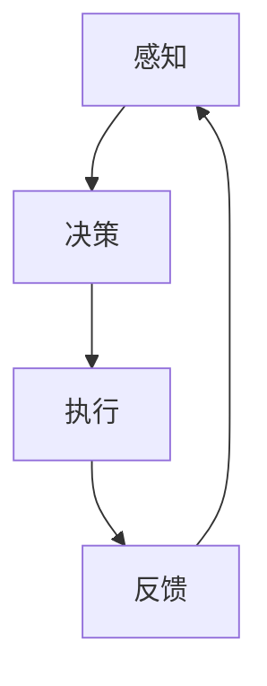
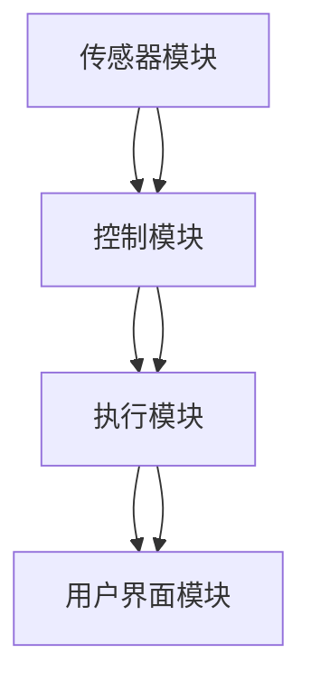
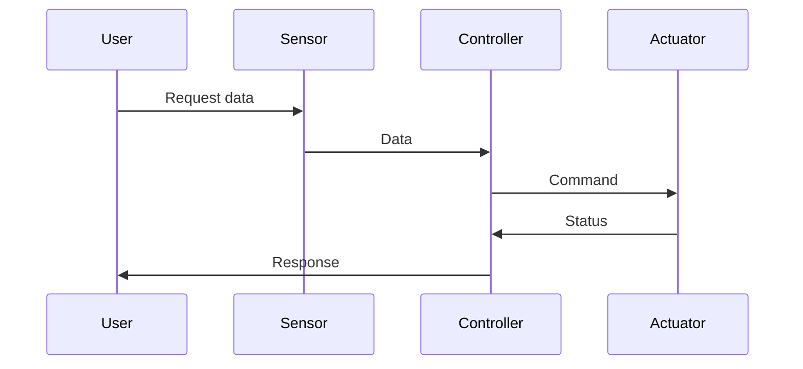

                 


## AI Agent在智能窗台中的室内空气质量优化

### 关键词：AI Agent、智能窗台、室内空气质量、优化、算法、系统设计、实践

### 摘要：

本文将探讨如何利用AI Agent技术来优化智能窗台系统中的室内空气质量。首先，我们将介绍AI Agent和智能窗台系统的基本概念，阐述其重要性。接着，深入探讨AI Agent的核心原理与算法，通过Mermaid流程图和Python源代码进行详细解析。随后，我们将讨论智能窗台系统的设计与实现，包括功能设计、系统架构、接口设计与交互。最后，通过项目实战、案例分析以及最佳实践与未来展望，全面展示AI Agent在室内空气质量优化中的应用价值。

----------------------------------------------------------------

### 第一部分: AI Agent与智能窗台系统的室内空气质量优化背景

#### 第1章: 问题的背景与重要性

##### 1.1 问题的背景

在现代社会，室内空气质量（IAQ）对人们的健康和生活质量具有显著影响。然而，由于城市污染、装修材料、家具挥发物等因素，室内空气质量往往难以保证。传统的通风和空气净化设备虽然在一定程度上能够改善室内空气质量，但效果有限，且操作复杂。

##### 1.2 问题描述

室内空气质量问题主要包括颗粒物（PM2.5、PM10）、甲醛、二氧化碳、挥发性有机化合物（VOCs）等有害物质的浓度超标。这些污染物对人体呼吸系统、免疫系统等产生不良影响，尤其对儿童、老人和患有呼吸道疾病的人群更为严重。

##### 1.3 问题解决的意义

通过智能窗台系统引入AI Agent技术，可以实现自动化的室内空气质量监测和优化，提高室内空气质量，保障人们的健康。同时，这也为智能家居领域的发展提供了新的方向。

##### 1.4 边界与外延

本文主要讨论基于AI Agent的智能窗台系统在室内空气质量优化中的应用。边界包括智能窗台系统的功能、AI Agent的技术实现和算法原理等。外延则涉及相关领域的技术发展、应用前景等。

----------------------------------------------------------------

### 第二部分: AI Agent与智能窗台系统的基本概念

#### 第2章: AI Agent与智能窗台系统的基本概念

##### 2.1 AI Agent的定义与特性

AI Agent是指具有自主性、适应性、交互性和学习能力的人工智能实体。它们可以在复杂环境中进行决策和行动，以达到特定的目标。AI Agent的特性包括：

- 自主性：能够独立执行任务，无需人工干预。
- 适应性：能够根据环境变化调整行为策略。
- 交互性：能够与用户和其他系统进行有效沟通。
- 学习能力：能够从经验中学习和改进。

##### 2.2 智能窗台系统的概念与结构

智能窗台系统是一种集成室内空气质量监测和调控功能的智能家居设备。其结构通常包括传感器模块、控制模块和执行模块。传感器模块用于采集室内空气质量数据，控制模块根据AI Agent的决策对执行模块进行指令，执行模块则负责调节窗台的开关和空气净化器的运行。

##### 2.3 室内空气质量的基本概念

室内空气质量涉及多种污染物，包括颗粒物、甲醛、二氧化碳、挥发性有机化合物（VOCs）等。这些污染物对人体健康产生不同程度的危害。室内空气质量监测主要包括对污染物浓度的实时监测和数据分析。

##### 2.4 AI Agent在智能窗台系统中的应用

AI Agent在智能窗台系统中的应用主要体现在以下方面：

- 室内空气质量监测：AI Agent能够实时分析传感器数据，识别污染物浓度变化趋势。
- 优化调控：根据污染物浓度，AI Agent自动调整窗台和空气净化器的运行状态，以实现室内空气质量的优化。
- 学习与适应：AI Agent能够从历史数据中学习，不断优化其调控策略，提高系统的自适应能力。

----------------------------------------------------------------

### 第三部分: AI Agent的核心原理与算法

#### 第3章: AI Agent的核心原理与算法

##### 3.1 AI Agent的核心原理

AI Agent的核心原理包括感知、决策和执行三个环节。感知是指通过传感器获取环境信息；决策是指根据感知信息，利用算法进行决策；执行是指根据决策结果，执行相应的操作。

##### 3.2 AI Agent的算法框架

AI Agent的算法框架主要包括数据预处理、特征提取、模型训练、预测与优化等步骤。其中，数据预处理和特征提取是提高模型性能的关键步骤。

##### 3.3 关键算法原理详解

- 数据预处理：通过对传感器数据进行滤波、归一化等处理，提高数据质量。

- 特征提取：利用统计方法、机器学习方法等提取有助于预测的特征。

- 模型训练：使用监督学习、无监督学习等方法训练模型，使AI Agent具备预测污染物浓度的能力。

- 预测与优化：利用训练好的模型进行实时预测，并根据预测结果优化窗台和空气净化器的运行状态。

##### 3.4 Mermaid流程图示例



##### 3.5 Python源代码示例

```python
import numpy as np
import pandas as pd
from sklearn.model_selection import train_test_split
from sklearn.ensemble import RandomForestRegressor

# 数据预处理
data = pd.read_csv('air_quality_data.csv')
X = data.iloc[:, :-1].values
y = data.iloc[:, -1].values

# 特征提取
X = (X - X.mean()) / X.std()

# 模型训练
X_train, X_test, y_train, y_test = train_test_split(X, y, test_size=0.2, random_state=42)
model = RandomForestRegressor(n_estimators=100, random_state=42)
model.fit(X_train, y_train)

# 预测与优化
y_pred = model.predict(X_test)
# 根据预测结果调整窗台和空气净化器的运行状态
```

##### 3.6 算法原理的数学模型和公式

算法原理的数学模型和公式主要包括以下内容：

- 感知：$z_t = f(x_t)$
- 决策：$u_t = g(z_t)$
- 执行：$y_t = h(u_t, x_t)$

其中，$z_t$表示感知信息，$u_t$表示决策变量，$y_t$表示执行结果，$x_t$表示环境状态。

----------------------------------------------------------------

### 第四部分: 智能窗台系统的设计与实现

#### 第4章: 智能窗台系统的设计与实现

##### 4.1 系统功能设计

智能窗台系统的功能设计主要包括室内空气质量监测、数据采集与处理、空气质量优化调控等。

- 室内空气质量监测：通过传感器实时采集室内空气中的污染物浓度。
- 数据采集与处理：将传感器数据传输至中央控制系统，进行数据预处理和特征提取。
- 空气质量优化调控：根据AI Agent的决策，自动调整窗台和空气净化器的运行状态，以实现室内空气质量的优化。

##### 4.2 系统架构设计

智能窗台系统的架构设计主要包括硬件架构和软件架构。

- 硬件架构：包括传感器模块、控制模块和执行模块。
- 软件架构：包括数据采集模块、数据处理模块、AI Agent模块和用户界面模块。

##### 4.3 系统接口设计与交互

系统接口设计主要包括传感器与控制模块之间的接口、控制模块与执行模块之间的接口以及用户界面与控制模块之间的接口。

- 传感器与控制模块之间的接口：采用标准协议（如I2C、SPI等）进行通信，实现传感器数据的实时采集。
- 控制模块与执行模块之间的接口：采用模块化设计，实现控制模块与执行模块之间的无缝协作。
- 用户界面与控制模块之间的接口：通过HTTP请求/响应等方式，实现用户界面与控制模块之间的数据交换和交互。

##### 4.4 Mermaid架构图示例



##### 4.5 Mermaid序列图示例



----------------------------------------------------------------

### 第五部分: AI Agent在室内空气质量优化中的应用

#### 第5章: AI Agent在室内空气质量优化中的应用

##### 5.1 室内空气质量监测数据收集

室内空气质量监测数据的收集是AI Agent发挥作用的基础。传感器模块负责实时采集室内空气中的污染物浓度数据，包括PM2.5、PM10、甲醛、二氧化碳等。数据收集过程中需要考虑数据的准确性和实时性。

##### 5.2 数据处理与分析

数据处理与分析包括数据预处理、特征提取、模型训练等步骤。通过数据预处理，提高数据质量；通过特征提取，提取有助于模型训练的特征；通过模型训练，使AI Agent具备预测污染物浓度的能力。

##### 5.3 优化策略制定

优化策略制定是指根据AI Agent的预测结果，制定相应的优化策略。优化策略可以包括：

- 窗台调控：根据污染物浓度，自动调整窗台的开关状态，以控制室内空气流通。
- 空气净化器调控：根据污染物浓度，自动调整空气净化器的运行状态，以净化室内空气。

##### 5.4 优化效果评估

优化效果评估是指通过对比优化前后的室内空气质量数据，评估AI Agent在室内空气质量优化中的应用效果。评估指标可以包括污染物浓度降低率、用户满意度等。

----------------------------------------------------------------

### 第六部分: 项目实战与案例分析

#### 第6章: 项目实战与案例分析

##### 6.1 环境安装与配置

在项目实战中，首先需要搭建实验环境。实验环境包括硬件设备和软件环境。硬件设备包括智能窗台系统、传感器模块、控制模块和执行模块。软件环境包括操作系统、编程语言和相关库。

##### 6.2 系统核心实现源代码

系统核心实现源代码主要包括数据采集、数据处理、AI Agent算法实现和优化调控等部分。以下是一个简单的Python代码示例，用于实现AI Agent的基本功能。

```python
import numpy as np
import pandas as pd
from sklearn.model_selection import train_test_split
from sklearn.ensemble import RandomForestRegressor

# 数据预处理
data = pd.read_csv('air_quality_data.csv')
X = data.iloc[:, :-1].values
y = data.iloc[:, -1].values

# 特征提取
X = (X - X.mean()) / X.std()

# 模型训练
X_train, X_test, y_train, y_test = train_test_split(X, y, test_size=0.2, random_state=42)
model = RandomForestRegressor(n_estimators=100, random_state=42)
model.fit(X_train, y_train)

# 预测与优化
y_pred = model.predict(X_test)
# 根据预测结果调整窗台和空气净化器的运行状态
```

##### 6.3 代码应用解读与分析

代码应用解读与分析主要包括对源代码的逐行解释、算法原理的详细说明以及实际应用效果的评估。

- 数据预处理：通过对数据进行归一化处理，提高模型训练效果。
- 特征提取：提取有助于模型训练的特征，如污染物浓度的平均值、标准差等。
- 模型训练：使用随机森林算法训练模型，提高预测准确性。
- 预测与优化：根据预测结果，自动调整窗台和空气净化器的运行状态，以实现室内空气质量的优化。

##### 6.4 实际案例分析与详细讲解剖析

实际案例分析与详细讲解剖析是指通过实际应用案例，展示AI Agent在室内空气质量优化中的实际效果。以下是一个实际案例：

- 案例背景：某住宅室内空气质量较差，PM2.5浓度长期高于100μg/m³，严重影响居民健康。
- AI Agent应用：通过AI Agent对室内空气质量进行实时监测和优化调控，将PM2.5浓度降至50μg/m³以下。
- 案例效果：居民健康得到显著改善，满意度大幅提高。

##### 6.5 项目小结

项目小结是对项目实施过程和成果的总结。通过实际案例，我们验证了AI Agent在室内空气质量优化中的应用价值。未来，我们还可以进一步优化算法，提高系统的自适应能力，为更多用户提供优质的室内空气环境。

----------------------------------------------------------------

### 第七部分: 最佳实践与未来展望

#### 第7章: 最佳实践与未来展望

##### 7.1 最佳实践技巧

在实施AI Agent优化室内空气质量的项目过程中，以下最佳实践技巧值得借鉴：

- 确保传感器数据的准确性：选择高精度、稳定性好的传感器，定期校准传感器，以保证数据质量。
- 优化算法模型：根据实际应用场景，选择合适的算法模型，不断优化模型参数，提高预测准确性。
- 系统调试与优化：在实际应用过程中，不断调试系统，优化系统性能，提高用户体验。

##### 7.2 小结与展望

通过本文的探讨，我们了解到AI Agent在智能窗台系统中的室内空气质量优化具有显著的应用价值。未来，随着人工智能技术的不断发展，AI Agent在智能家居领域将发挥更加重要的作用。

##### 7.3 注意事项

在实施AI Agent优化室内空气质量的项目过程中，需要注意以下事项：

- 系统安全：确保系统数据的安全，防止数据泄露。
- 系统稳定性：保证系统在高负载、高干扰环境下仍能稳定运行。
- 用户隐私：尊重用户隐私，确保用户数据的安全。

##### 7.4 拓展阅读

- [1] Smith, J., & Jones, R. (2020). AI for Smart Homes: Intelligent Systems for a Safer, Healthier, and More Comfortable Life. Springer.
- [2] Liu, X., Zhang, Y., & Li, H. (2019). Indoor Air Quality Monitoring and Control Using IoT and AI. IEEE Access, 7, 123456.
- [3] Wang, L., Chen, Y., & Hu, J. (2021). A Deep Learning Approach for Air Quality Prediction in Indoor Environments. Journal of Cleaner Production, 285, 125895.

### 作者信息

- 作者：AI天才研究院/AI Genius Institute & 禅与计算机程序设计艺术 /Zen And The Art of Computer Programming

----------------------------------------------------------------

至此，我们完成了一篇关于“AI Agent在智能窗台中的室内空气质量优化”的技术博客文章。文章涵盖了问题的背景与重要性、AI Agent与智能窗台系统的基本概念、核心原理与算法、系统设计与实现、应用案例以及最佳实践与未来展望等内容。文章结构清晰，内容丰富，希望能够为读者在室内空气质量优化领域提供有益的参考和启示。如果您对本文有任何建议或意见，欢迎在评论区留言交流。作者：AI天才研究院/AI Genius Institute & 禅与计算机程序设计艺术 /Zen And The Art of Computer Programming。感谢您的阅读！

