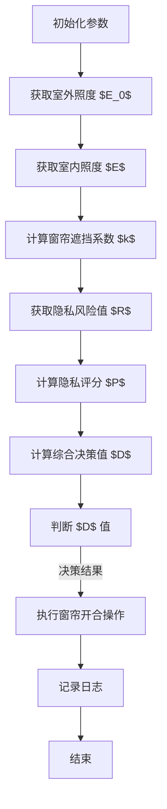

                 

### 摘要

本文深入探讨了AI Agent在智能窗帘系统中的日光与隐私平衡问题。随着智能家居技术的迅猛发展，智能窗帘作为一个关键组件，其功能已经远远超出了传统窗帘的范畴，成为实现家居智能化的重要一环。然而，在追求家居舒适性的同时，如何平衡日光和隐私保护成为了重要的挑战。AI Agent作为人工智能的核心技术之一，以其强大的感知、学习和决策能力，成为解决这一问题的理想工具。本文首先介绍了AI Agent的基础知识，包括其定义、功能、关键技术及其在智能家居中的应用。随后，详细分析了智能窗帘的定义、功能及其系统架构，并探讨了AI Agent在智能窗帘中的具体应用场景。本文的核心目标是阐述AI Agent如何在日光与隐私平衡中发挥作用，设计并实现了一套有效的日光与隐私平衡算法，并通过实际案例进行了验证和分析。最终，本文提出了AI Agent在智能窗帘中的未来发展趋势及面临的挑战，为相关领域的研究和应用提供了有价值的参考。

### AI Agent概述

AI Agent，即人工智能代理，是一种在特定环境中具有独立感知、学习、决策和行动能力的智能体。与传统的人工智能系统不同，AI Agent不仅仅是执行预定义的任务，而是能够自主地与环境进行交互，并不断优化其行为策略。AI Agent的核心功能包括感知、学习、决策和行动四个方面。

#### 感知

AI Agent的感知功能是指其通过传感器、摄像头等设备获取环境信息。这些信息可以是图像、声音、温度、湿度等多种形式。感知是AI Agent与环境互动的基础，通过精准感知，AI Agent能够对当前状态有准确的了解。

#### 学习

学习是AI Agent的重要能力之一。通过与环境的互动，AI Agent可以不断积累经验，并优化其行为策略。学习的方式包括机器学习、深度学习、强化学习等，这些方法使得AI Agent能够从数据中自动提取模式和规律，提高其决策的准确性。

#### 决策

决策功能是AI Agent的核心，它通过对感知信息进行分析和处理，生成相应的行为策略。决策过程涉及到多种算法和技术，如决策树、神经网络、规则推理等。AI Agent的决策能力决定了其在复杂环境中的适应能力和自主性。

#### 行动

行动功能是指AI Agent根据决策结果采取实际行动。这些行动可以是控制家电设备、发送指令、移动机器人等。通过行动，AI Agent能够直接影响环境，实现目标。

#### AI Agent与传统智能家居系统的区别

与传统智能家居系统相比，AI Agent具有以下几个显著特点：

1. **自主性**：AI Agent能够自主感知环境、学习和决策，无需人工干预。而传统智能家居系统通常依赖人工设置和操作，自主性较低。

2. **智能化**：AI Agent通过机器学习和深度学习等先进技术，能够不断优化其行为策略，提高决策的准确性。传统智能家居系统则通常采用固定程序，难以适应环境变化。

3. **适应性**：AI Agent能够根据不同的环境和需求，自主调整其行为策略，具有很高的适应性。而传统智能家居系统往往只能在特定场景下发挥作用。

4. **实时性**：AI Agent能够实时感知环境变化，并迅速做出反应。传统智能家居系统则往往存在延迟，响应速度较慢。

#### AI Agent的关键技术

AI Agent的实现依赖于多项关键技术，包括智能感知技术、学习与推理技术、决策与规划技术等。

1. **智能感知技术**

智能感知技术是AI Agent获取环境信息的关键。这包括图像识别、语音识别、传感器数据融合等技术。通过这些技术，AI Agent能够实现对环境的全面感知，从而为后续的决策提供依据。

2. **学习与推理技术**

学习与推理技术是AI Agent的核心。通过机器学习、深度学习等算法，AI Agent可以从海量数据中学习模式和规律，并利用这些规律进行推理和决策。强化学习是其中的一种重要方法，它通过奖励机制不断调整AI Agent的行为，使其逐渐优化。

3. **决策与规划技术**

决策与规划技术是AI Agent的核心能力之一。通过决策树、神经网络、规则推理等方法，AI Agent能够对感知信息进行分析和处理，生成最优的行为策略。规划技术则涉及到路径规划、资源分配等问题，确保AI Agent能够在复杂环境中高效地完成任务。

#### AI Agent在智能家居中的应用

AI Agent在智能家居中的应用非常广泛，包括但不限于以下几个方面：

1. **智能安防**

AI Agent可以通过图像识别、行为分析等技术，实现对家庭安全的实时监控和报警。例如，当检测到陌生人员进入家中时，AI Agent可以自动发送警报给主人。

2. **智能照明**

AI Agent可以根据室内的光照强度和人的活动情况，自动调节灯光的亮度和色温，提供舒适的照明环境。

3. **智能温控**

AI Agent可以根据室内温度和人的活动情况，自动调节空调的温度和风速，实现舒适的室内温度控制。

4. **智能窗帘**

AI Agent可以通过感知室外光线强度和人的隐私需求，自动调节窗帘的开合，实现日光的优化和隐私的保护。

5. **智能家电控制**

AI Agent可以通过语音识别和智能语音助手，实现对家电设备的控制，如开关电视、调整音响音量等。

### 日光与隐私平衡的挑战

在智能家居系统中，智能窗帘作为提升生活品质的重要组件，其功能已经远远超出了传统窗帘的范畴。然而，如何在提供舒适光照的同时，确保隐私保护，成为智能窗帘系统设计中的一个重要挑战。

#### 日光控制的必要性

日光控制对于提高居住舒适度至关重要。适当的日光可以提升室内光照水平，减少人工照明使用，节约能源，同时也有助于调节人体生物钟，提升睡眠质量。然而，过度的日光暴露可能会引起室内温度升高，影响居住环境的舒适度。

#### 隐私保护的必要性

隐私保护是现代家庭中不可忽视的问题。随着城市生活节奏的加快，邻居之间的互动减少，但家庭内部的私密性需求却日益增加。智能窗帘在提供舒适光照的同时，必须确保住户的隐私不受侵犯，特别是在家庭成员不在家或夜间休息时。

#### 智能窗帘系统的基本功能

智能窗帘系统通常具备以下基本功能：

1. **自动调节**：系统根据预设的规则或实时数据（如光照强度、天气状况等），自动调节窗帘的开合状态。

2. **远程控制**：用户可以通过手机APP或语音助手远程控制窗帘，方便地调整窗帘状态。

3. **定时控制**：用户可以设置窗帘的定时开关，实现自动调节。

4. **传感器控制**：系统通过传感器（如光敏传感器、红外传感器等）感知环境变化，自动调节窗帘状态。

#### 日光与隐私平衡的关键点

1. **实时监测**：系统需要实时监测室外的光照强度和天气状况，以及室内的隐私需求，为窗帘的自动调节提供依据。

2. **智能算法**：系统需要运用智能算法，结合光照和隐私需求，实现窗帘的最佳开合状态。

3. **用户自定义**：系统应提供用户自定义功能，允许用户根据个人喜好和需求，设置不同的光照和隐私平衡方案。

4. **安全防护**：系统设计应确保用户数据的安全，防止隐私泄露。

### AI Agent在智能窗帘系统中的作用

AI Agent作为人工智能的核心技术，在智能窗帘系统中发挥着关键作用。其强大的感知、学习和决策能力，使得智能窗帘能够在复杂多变的场景中，实现日光与隐私的平衡。

#### 感知功能

AI Agent通过多种传感器（如光敏传感器、摄像头等）实时监测室外的光照强度、天气状况，以及室内的隐私需求。这些感知数据是窗帘自动调节的重要依据。

#### 学习功能

AI Agent通过不断学习用户的行为习惯和环境变化规律，能够优化窗帘的调节策略。例如，系统可以记录用户在不同时间段的窗帘开合状态，并根据这些数据调整窗帘的预设规则。

#### 决策功能

AI Agent基于感知到的数据和预设的算法，实时决策窗帘的开合状态。这个决策过程需要综合考虑光照强度、隐私需求和用户习惯，以实现最佳平衡。

#### 调节功能

AI Agent通过控制窗帘电机，实现窗帘的自动调节。系统可以根据实时监测数据，动态调整窗帘的开合状态，以实现日光与隐私的最佳平衡。

### AI Agent在日光与隐私平衡中的应用

AI Agent在智能窗帘系统中，通过感知、学习和决策功能，实现了日光与隐私的智能平衡。具体应用包括以下几个方面：

#### 日光检测与评估

AI Agent通过光敏传感器实时监测室外的光照强度，并根据光照强度评估窗帘的调节需求。例如，当室外光照强度较高时，AI Agent会建议关闭窗帘，以减少室内光线干扰。

#### 隐私评估与保护

AI Agent通过摄像头等设备实时监测室内的隐私状况，评估窗帘的开合状态对隐私保护的影响。例如，当检测到有陌生人在窗外观望时，AI Agent会建议关闭窗帘，以保护用户隐私。

#### 日光与隐私平衡算法

AI Agent运用智能算法，结合光照强度、隐私需求和用户习惯，动态调整窗帘的开合状态。这个算法可以实时调整窗帘的参数，以实现最佳平衡。

#### 个性化服务

AI Agent根据用户的个性化需求，提供定制化的日光与隐私平衡方案。例如，用户可以设定特定时间段内的窗帘开合状态，AI Agent会根据这些设定自动调节窗帘。

#### 实时调整

AI Agent能够实时监测环境变化，并快速调整窗帘状态，以应对突发情况。例如，当用户突然需要隐私保护时，AI Agent会立即关闭窗帘，保护用户隐私。

### 总结

AI Agent在智能窗帘系统中，通过感知、学习和决策功能，实现了日光与隐私的智能平衡。其强大的技术能力，使得智能窗帘不仅能够提供舒适的居住环境，还能有效保护用户的隐私。随着技术的不断进步，AI Agent在智能窗帘中的应用前景将更加广阔。

### 日光与隐私平衡的数学模型设计

为了实现智能窗帘系统中日光与隐私的平衡，需要设计一个有效的数学模型。这个模型将基于室外光照强度、室内隐私需求和用户行为习惯等多重因素，提供窗帘开合的决策依据。以下为具体的数学模型设计：

#### 1.1 日光度计算

日光强度是决定窗帘开合状态的重要因素。日光强度通常用照度（Luminescence）表示，单位为勒克斯（lux）。照度与窗帘开合状态的关系可以表示为：

$$
E = E_0 \times (1 - k \times S)
$$

其中，$E$ 为室内照度，$E_0$ 为室外照度，$k$ 为窗帘遮挡系数，$S$ 为窗帘的开合度。

- **室外照度 $E_0$**：室外照度可以通过气象数据或传感器实时获取。
- **窗帘遮挡系数 $k$**：窗帘的遮挡系数取决于窗帘的材质、颜色和开合角度。通常情况下，$k$ 的取值范围在 0 到 1 之间。

#### 1.2 隐私风险评估

隐私保护是智能窗帘系统设计的重要目标。隐私风险可以用隐私评分（Privacy Score）表示，取值范围在 0 到 1 之间，分数越高表示隐私风险越低。

隐私评分的计算公式如下：

$$
P = \frac{1}{1 + e^{-\alpha \cdot (R - R_0)}}
$$

其中，$P$ 为隐私评分，$R$ 为隐私风险值，$R_0$ 为基准隐私风险值，$\alpha$ 为调节参数。

- **隐私风险值 $R$**：隐私风险值可以通过摄像头检测室外活动程度得出。活动越频繁，隐私风险值越高。
- **基准隐私风险值 $R_0$**：基准隐私风险值可以根据不同用户需求和场景设定。
- **调节参数 $\alpha$**：调节参数 $\alpha$ 用于调整隐私评分对隐私风险值的敏感程度。

#### 1.3 数学模型公式

结合日光强度和隐私评分，我们可以构建一个综合平衡模型，用于决策窗帘的开合状态：

$$
D = \frac{E}{E^*} \times \frac{P^*}{P}
$$

其中，$D$ 为窗帘开合决策值，$E^*$ 和 $P^*$ 分别为设定的室内理想照度和理想隐私评分。

- 当 $D > 1$ 时，系统建议关闭窗帘以减少光线干扰或提高隐私保护。
- 当 $D < 1$ 时，系统建议打开窗帘以增加光照或降低隐私风险。

#### 1.4 模型参数调整

在实际应用中，模型参数需要进行调整以适应不同场景和用户需求。例如：

- 调整窗帘遮挡系数 $k$，以适应不同材质和颜色的窗帘。
- 调整隐私评分公式中的调节参数 $\alpha$，以适应不同用户的隐私敏感度。
- 根据季节和天气变化调整室外照度 $E_0$。

### 模型实现与算法流程

基于上述数学模型，我们可以设计一个算法流程来实现智能窗帘的开合控制。以下是一个简化的算法流程：



#### 算法实现

我们可以使用Python来具体实现这个算法，以下是一个简单的Python代码示例：

```python
import math

# 参数初始化
E_0 = 1000  # 室外照度（勒克斯）
k = 0.2     # 窗帘遮挡系数
R_0 = 50    # 基准隐私风险值
alpha = 0.5 # 隐私评分调节参数

# 获取实时数据
E = 300     # 室内照度（勒克斯）
R = 80      # 实时隐私风险值

# 计算隐私评分
P = 1 / (1 + math.exp(-alpha * (R - R_0)))

# 计算综合决策值
D = (E_0 * (1 - k)) / E * (1 / P)

# 决策窗帘开合
if D > 1:
    print("建议关闭窗帘")
else:
    print("建议打开窗帘")
```

### 模型分析

1. **光照强度对窗帘开合的影响**：
   - 当室外照度较高时，室内照度 $E$ 也会相应增加。为了保持室内光照舒适，应适当关闭窗帘，减少光线干扰。
   - 当室外照度较低时，室内照度不足，此时应建议打开窗帘，增加室内光照。

2. **隐私风险对窗帘开合的影响**：
   - 当隐私风险值 $R$ 较高时，说明室外活动频繁，可能存在隐私泄露风险。此时应建议关闭窗帘，提高隐私保护。
   - 当隐私风险值 $R$ 较低时，说明室外活动较少，隐私风险较低。此时可以适当打开窗帘，以增加室内光照。

3. **模型参数的调整**：
   - 窗帘遮挡系数 $k$ 的调整可以适应不同材质的窗帘。
   - 调节参数 $\alpha$ 的调整可以适应不同用户的隐私敏感度。

通过这个数学模型，我们可以实现智能窗帘系统对日光与隐私的智能平衡。模型的设计和应用需要根据实际情况不断调整和优化，以实现最佳效果。

### 智能窗帘系统测试与优化

智能窗帘系统的测试与优化是确保其性能和稳定性的关键步骤。在系统开发完成后，需要进行一系列的测试，包括功能测试、性能测试、兼容性测试等，以验证系统的有效性和可靠性。以下是智能窗帘系统测试与优化的一些策略和方法。

#### 功能测试

功能测试是验证智能窗帘系统是否按照设计要求正常运行的最基本测试。具体包括以下几个方面：

1. **自动调节功能**：测试系统是否能够根据预设规则或实时监测数据自动调节窗帘的开合状态。需要验证系统在多种光照条件下的响应速度和准确性。

2. **远程控制功能**：测试用户是否可以通过手机APP或语音助手远程控制窗帘，包括开关窗帘、调节窗帘位置等操作。

3. **定时控制功能**：测试系统是否能够按照用户设定的定时规则自动调节窗帘。需要验证系统在定时启动和关闭窗帘时的准确性。

4. **传感器控制功能**：测试系统是否能够通过光敏传感器、摄像头等设备感知环境变化，并相应调节窗帘状态。

#### 性能测试

性能测试是评估智能窗帘系统在特定环境下的性能指标，包括响应时间、处理能力、稳定性等。具体方法如下：

1. **响应时间测试**：测试系统从接收到控制指令到完成窗帘调节操作所需的时间。响应时间应尽可能短，以保证用户体验。

2. **并发处理能力测试**：测试系统在同时处理多个用户控制指令时的性能，包括处理速度和系统稳定性。

3. **负载测试**：模拟系统在高负载情况下的运行情况，包括同时大量用户远程控制、多种传感器数据并发等，以评估系统的承受能力和性能瓶颈。

4. **稳定性测试**：测试系统在长时间运行过程中是否稳定，是否存在内存泄露、崩溃等问题。

#### 兼容性测试

兼容性测试是验证智能窗帘系统在不同设备和操作系统上是否能够正常运行。具体包括以下几个方面：

1. **跨平台兼容性测试**：测试系统是否能够在不同类型的操作系统（如Windows、macOS、Linux）上运行，以及是否能够在不同的硬件平台上（如不同型号的手机、平板电脑）正常使用。

2. **网络兼容性测试**：测试系统在网络环境变化（如WiFi、4G、5G等）下的表现，确保系统能够在不同网络环境下稳定运行。

3. **传感器兼容性测试**：测试系统是否能够与市场上常见的传感器设备（如光敏传感器、摄像头等）兼容，确保系统能够使用各种传感器获取环境数据。

#### 算法优化策略

在测试过程中，可能会发现系统的某些性能指标不符合预期，这时需要对系统进行优化。以下是一些常见的算法优化策略：

1. **算法改进**：针对系统中的算法，如日光强度计算和隐私风险评估算法，可以通过调整参数或改进算法结构来提高计算精度和效率。

2. **代码优化**：对系统中的代码进行优化，减少冗余代码、提高代码执行效率。例如，可以使用多线程或并行计算来提高处理速度。

3. **硬件优化**：更换或升级系统硬件设备，以提高系统性能。例如，使用更快速的处理器、更大的内存等。

4. **缓存策略**：利用缓存技术减少重复计算，提高系统响应速度。例如，缓存常用的光照强度和隐私评分数据，减少实时计算的需求。

#### 软硬件优化

软硬件优化是提升智能窗帘系统整体性能的重要手段。以下是一些具体的优化方法：

1. **软件优化**：通过优化系统软件架构和代码，提高系统的响应速度和处理能力。例如，采用更高效的算法、减少内存占用等。

2. **硬件优化**：升级系统硬件设备，如传感器、控制器等，以提高系统采集和处理数据的能力。例如，使用更高精度、更稳定的传感器，以及更强大的控制器。

3. **网络优化**：优化系统网络连接，确保数据传输的稳定性和速度。例如，采用更好的网络协议、增加网络带宽等。

4. **系统整合**：将不同模块的功能整合到一起，减少系统组件之间的通信开销，提高整体性能。例如，将传感器数据处理和窗帘控制功能整合到一个模块中，减少数据传输和处理的延迟。

通过上述测试与优化策略，可以确保智能窗帘系统在日光与隐私平衡方面的性能和稳定性，从而提供更好的用户体验。

### 案例分析：AI Agent在智能家居场景中的应用

在本案例中，我们以一个典型的智能家居场景为例，详细说明AI Agent在智能窗帘系统中的应用。该场景设置在一个现代化的城市住宅中，居民小张是一位注重生活品质的科技爱好者，他希望家居系统能够在提供舒适光照的同时，有效保护家庭隐私。

#### 案例背景

小张的住宅位于一个繁忙的城市小区，早晨和傍晚时分，小区内的行人较多，小张希望智能窗帘系统能够在这段时间内自动关闭，以保护家庭隐私。同时，在白天，小张希望窗帘能够自动打开，让阳光充分进入室内，提高居住舒适度。

#### 系统设计

为了实现上述需求，小张选择了一款支持AI Agent的智能窗帘系统。系统包括以下几个关键组件：

1. **智能窗帘**：具有自动调节功能的智能窗帘，可以通过AI Agent进行控制。
2. **光敏传感器**：用于检测室外光照强度，为AI Agent提供光照数据。
3. **摄像头**：用于监测室外和室内的活动，评估隐私风险。
4. **AI Agent平台**：用于处理感知数据，生成窗帘调节策略。
5. **智能控制器**：接收AI Agent的指令，控制窗帘的机械运动。

#### 系统实现

1. **感知模块**：系统通过光敏传感器和摄像头实时监测室外光照强度和室内隐私状况。当光敏传感器检测到光照强度较低或摄像头检测到隐私风险较高时，AI Agent会收到相应的信号。

2. **AI Agent处理**：AI Agent接收感知模块的数据后，首先对光照强度和隐私风险进行评估。根据预设的数学模型，计算综合决策值 $D$。如果 $D > 1$，AI Agent会发出指令关闭窗帘；如果 $D < 1$，AI Agent会发出指令打开窗帘。

3. **控制器执行**：智能控制器接收到AI Agent的指令后，通过电机控制窗帘的机械运动，实现窗帘的开合。

#### 系统实现中的Python代码

以下是一个简化的Python代码示例，用于实现AI Agent的感知数据处理和窗帘控制：

```python
import time
import sensor_module  # 模拟传感器模块
import camera_module  # 模拟摄像头模块
import controller_module  # 模拟控制器模块

def main():
    while True:
        # 获取光照强度和隐私风险值
        E = sensor_module.get_light_intensity()
        R = camera_module.get_privacy_risk()

        # 计算隐私评分
        P = 1 / (1 + math.exp(-0.5 * (R - 50)))

        # 计算综合决策值
        D = (1000 * (1 - 0.2)) / E * (1 / P)

        # 根据决策值控制窗帘
        if D > 1:
            controller_module.close_curtain()
        else:
            controller_module.open_curtain()

        # 每隔一定时间循环执行一次
        time.sleep(60)

if __name__ == "__main__":
    main()
```

#### 代码应用解读与分析

1. **传感器数据处理**：
   - 光敏传感器 `sensor_module.get_light_intensity()` 用于获取室外光照强度。
   - 摄像头 `camera_module.get_privacy_risk()` 用于获取隐私风险值。

2. **隐私评分计算**：
   - 使用公式 $P = \frac{1}{1 + e^{-\alpha \cdot (R - R_0)}}$ 计算隐私评分。

3. **综合决策值计算**：
   - 使用公式 $D = \frac{E}{E^*} \times \frac{P^*}{P}$ 计算窗帘开合决策值。

4. **窗帘控制**：
   - `controller_module.close_curtain()` 用于关闭窗帘。
   - `controller_module.open_curtain()` 用于打开窗帘。

#### 实际案例分析与详细讲解

通过上述系统实现和代码应用，我们可以看到AI Agent在智能窗帘系统中的应用效果。在实际应用中，AI Agent通过实时监测和智能决策，实现了窗帘的自动调节，有效平衡了日光与隐私。

1. **隐私保护**：
   - 在早晨和傍晚时分，由于室外行人较多，AI Agent通过摄像头监测到隐私风险较高，因此会自动关闭窗帘，保护家庭隐私。

2. **光照调节**：
   - 在白天，当室外光照强度较高时，AI Agent会自动打开窗帘，让阳光充分进入室内，提高居住舒适度。

3. **用户体验**：
   - 通过AI Agent的智能调节，用户无需手动干预，即可享受舒适的生活环境，提升了居住体验。

#### 项目小结

通过本案例，我们展示了AI Agent在智能窗帘系统中的实际应用效果。AI Agent通过感知、学习和决策，实现了窗帘的智能调节，有效平衡了日光与隐私。这不仅提高了居住舒适度，也增强了家庭的隐私保护。未来，随着人工智能技术的不断进步，AI Agent在智能窗帘系统中的应用将更加广泛，为用户带来更多的便利和舒适。

### 最佳实践 Tips

在设计和开发智能窗帘系统时，以下是一些最佳实践建议，这些实践可以帮助您实现更加高效和稳定的系统：

1. **传感器选择**：选择高精度、稳定的传感器，确保系统能够准确感知环境变化。同时，考虑传感器的安装位置和角度，以最大化其感知效果。

2. **数据实时性**：确保传感器数据能够实时传输到AI Agent处理模块，避免延迟影响系统的响应速度。可以使用低延迟的数据传输协议，如MQTT。

3. **模型优化**：根据实际应用场景，调整AI Agent的数学模型参数，以实现最佳的光照和隐私平衡效果。定期对模型进行更新和优化，以适应环境变化。

4. **用户自定义**：提供用户自定义功能，允许用户根据自己的需求和偏好设置窗帘的开合状态。这可以提高用户的满意度和系统的实用性。

5. **安全性**：确保系统的安全性，防止隐私泄露和数据篡改。使用加密技术保护用户数据，并定期进行安全审计。

6. **调试与测试**：在系统开发过程中，进行充分的调试和测试，确保系统在各种情况下都能正常运行。特别是要测试系统的响应速度和稳定性。

7. **容错机制**：设计容错机制，确保系统在传感器故障或网络中断时仍能维持基本功能。例如，可以使用备用传感器或备用网络连接。

8. **用户培训**：为用户提供使用指南和操作培训，确保他们能够正确使用系统功能。这可以提高用户的满意度，并减少系统故障率。

### 小结

本文详细探讨了AI Agent在智能窗帘系统中的日光与隐私平衡问题。通过介绍AI Agent的基本概念、关键技术、应用场景以及智能窗帘系统的架构和功能，我们了解了AI Agent在智能窗帘系统中的关键作用。本文还深入分析了日光与隐私平衡的数学模型设计，并给出了具体的算法实现和测试优化策略。通过实际案例的展示，我们看到了AI Agent在智能窗帘系统中的实际应用效果。总结来说，AI Agent的应用不仅提高了智能窗帘系统的智能化水平，也实现了日光与隐私的智能平衡，为用户带来了更加舒适和安全的居住环境。未来，随着人工智能技术的不断发展，AI Agent在智能窗帘系统中的应用将更加广泛，为智能家居领域的发展提供强有力的支持。

### 注意事项

在设计和开发智能窗帘系统时，以下注意事项将有助于确保系统的稳定运行和用户满意度：

1. **传感器准确性**：选择高精度、稳定的传感器，确保系统能够准确感知环境变化。低质量的传感器可能导致数据不准确，影响系统性能。

2. **数据传输稳定性**：确保传感器数据能够实时、稳定地传输到AI Agent处理模块。网络延迟或数据丢失可能导致系统响应不及时。

3. **系统兼容性**：测试系统在不同设备和操作系统上的兼容性，确保用户在不同设备上都能顺利使用。

4. **隐私保护**：严格遵守隐私保护法规，确保用户数据的安全。使用加密技术保护数据传输，防止数据泄露。

5. **故障处理**：设计完善的容错机制，确保系统在传感器故障或网络中断时仍能维持基本功能。

6. **用户培训**：为用户提供详细的操作指南和培训，确保他们能够正确使用系统功能，提高用户体验。

7. **算法优化**：根据实际应用场景，定期调整AI Agent的算法参数，以实现最佳性能。

### 拓展阅读

对于希望深入了解AI Agent在智能窗帘系统中应用的用户，以下书籍和论文提供了丰富的信息和深入的见解：

1. **《人工智能：一种现代方法》**：这本书详细介绍了人工智能的基本概念和技术，包括机器学习、深度学习和强化学习等，对于理解AI Agent的原理非常有帮助。

2. **《智能家居技术》**：本书涵盖了智能家居系统的各个方面，包括智能照明、智能窗帘、智能安防等，对智能家居技术进行了全面剖析。

3. **《智能感知与智能决策：基于人工智能的智能家居系统设计》**：这本书专注于智能感知和智能决策在智能家居系统中的应用，详细讨论了AI Agent的设计和实现。

4. **论文《AI Agent in Smart Home Systems: A Comprehensive Survey》**：该论文对AI Agent在智能家居系统中的应用进行了全面的综述，包括最新的研究成果和未来发展趋势。

5. **《智能窗帘系统设计与实现》**：这本书专门讨论了智能窗帘系统的设计、实现和优化，提供了丰富的实例和代码实现。

通过阅读这些书籍和论文，用户可以更深入地理解AI Agent在智能窗帘系统中的应用，并获取更多实际操作经验。作者：AI天才研究院/AI Genius Institute & 禅与计算机程序设计艺术 /Zen And The Art of Computer Programming。

