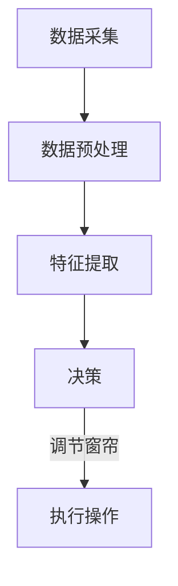

                 

# AI Agent在智能窗帘中的昼夜节律调节

## 关键词
- AI Agent
- 昼夜节律
- 智能窗帘
- 传感器
- 算法

## 摘要
本文将探讨AI Agent在智能窗帘中的昼夜节律调节作用。我们将首先介绍AI Agent的基本概念和昼夜节律的基本原理，然后深入探讨智能窗帘的工作机制，最后分析AI Agent如何通过传感器收集数据，利用算法调节窗帘的开合，以适应昼夜变化，从而提高居住环境的舒适度。

## 1. 引言

智能窗帘作为智能家居系统的一部分，正逐渐融入现代家庭生活中。智能窗帘不仅能够通过远程控制实现手动操作，还能够通过内置的传感器和AI Agent实现自动调节，从而提高家居环境的舒适度和能源效率。昼夜节律是生物体在地球自转过程中形成的生理节律，对于人类的生活和工作有着重要的影响。AI Agent在智能窗帘中的应用，旨在通过实时监测环境光强和温度等参数，自动调节窗帘的开合，以优化室内光照和温度条件，从而帮助人们更好地遵循昼夜节律，提升生活质量。

## 2. AI Agent概述

### 2.1 AI Agent的定义

AI Agent是指具有自主性和智能性的计算实体，能够在特定的环境和任务中采取行动，并与其他实体进行交互。AI Agent通常由感知模块、决策模块和执行模块组成。感知模块负责收集环境信息，决策模块根据感知信息作出决策，执行模块则负责执行决策结果。

### 2.2 AI Agent的功能

AI Agent的功能主要包括：

- **感知**：通过传感器获取环境信息，如温度、湿度、光照强度等。
- **决策**：基于感知信息，利用机器学习算法或其他智能方法进行决策。
- **执行**：根据决策结果，控制执行机构完成特定任务，如调节窗帘的开合。

### 2.3 AI Agent的分类

AI Agent可以根据不同的分类标准进行分类，常见的分类方式包括：

- **按应用场景**：可分为家居智能控制、工业自动化、交通管理等领域。
- **按智能程度**：可分为弱AI Agent、强AI Agent和超级智能体。
- **按交互方式**：可分为基于规则推理的AI Agent、基于数据驱动的AI Agent和混合型AI Agent。

## 3. 昼夜节律的基本原理

### 3.1 昼夜节律的定义

昼夜节律是指生物体在地球自转过程中形成的生理节律，通常以24小时为一个周期。昼夜节律对人类的睡眠、代谢、情绪和行为都有着显著的影响。

### 3.2 昼夜节律的影响因素

昼夜节律的影响因素包括：

- **光照**：光照强度是影响昼夜节律的主要因素之一。白天光照强烈，促使人体分泌甲状腺激素和肾上腺激素，使人保持清醒和兴奋状态；夜间光照减少，促使褪黑激素分泌，使人感到困倦。
- **温度**：温度变化也会影响昼夜节律。适宜的温暖环境有助于提高睡眠质量。

### 3.3 昼夜节律的调节机制

人体内的昼夜节律主要通过以下几个机制进行调节：

- **生物钟**：生物钟是指生物体内的一种无形的“时钟”，控制着生物体的昼夜节律。
- **内分泌系统**：内分泌系统通过分泌激素调节昼夜节律。
- **神经系统**：神经系统通过传递神经信号，调节生物体的生理和行为反应。

## 4. 智能窗帘的工作机制

### 4.1 智能窗帘的定义

智能窗帘是一种通过电子控制装置，实现窗帘开合自动化操作的窗帘。智能窗帘通常具备以下功能：

- **遥控控制**：用户可以通过遥控器、智能手机或语音助手远程控制窗帘。
- **定时控制**：用户可以设置窗帘的定时开合，实现自动化操作。
- **环境感知**：智能窗帘内置传感器，能够实时监测环境光强和温度等参数。

### 4.2 智能窗帘的组成

智能窗帘主要由以下部分组成：

- **窗帘布**：智能窗帘的窗帘布通常采用透光性好的材质，以便调节室内光照。
- **驱动电机**：驱动电机负责窗帘的自动开合。
- **控制模块**：控制模块负责接收用户指令和传感器数据，并控制驱动电机执行操作。
- **传感器**：传感器负责监测环境参数，如光照强度、温度等。

### 4.3 智能窗帘的工作流程

智能窗帘的工作流程主要包括以下几个步骤：

1. **感知环境**：传感器实时监测环境光强和温度等参数。
2. **数据传输**：传感器将采集到的数据传输给控制模块。
3. **决策处理**：控制模块根据传感器数据，结合预设的算法和用户需求，作出决策。
4. **执行操作**：驱动电机根据控制模块的决策，执行窗帘的开合操作。

## 5. AI Agent在智能窗帘中的昼夜节律调节

### 5.1 AI Agent在智能窗帘中的作用

AI Agent在智能窗帘中的应用，主要是通过感知环境数据，利用智能算法实现窗帘的自动调节，以适应昼夜变化。

- **感知环境**：AI Agent通过内置的传感器，实时监测环境光强和温度等参数。
- **数据分析和处理**：AI Agent利用机器学习算法，对传感器数据进行处理和分析，判断当前环境是否需要调节窗帘。
- **决策和执行**：基于分析结果，AI Agent做出决策，控制驱动电机执行窗帘的开合操作。

### 5.2 AI Agent在智能窗帘中的工作流程

AI Agent在智能窗帘中的工作流程主要包括以下几个步骤：

1. **数据采集**：AI Agent通过传感器采集环境光强、温度等数据。
2. **数据预处理**：对采集到的数据进行预处理，包括去噪、滤波等操作。
3. **特征提取**：从预处理后的数据中提取关键特征，如光照强度、温度变化率等。
4. **决策**：AI Agent利用机器学习算法，根据特征值判断是否需要调节窗帘。
5. **执行操作**：根据决策结果，控制驱动电机执行窗帘的开合操作。

### 5.3 AI Agent在智能窗帘中的应用实例

以下是一个AI Agent在智能窗帘中的具体应用实例：

- **场景**：早晨7点，室内光照较弱，用户希望窗帘自动打开。
- **步骤**：
  1. 传感器采集环境光强数据。
  2. AI Agent对光强数据进行预处理，提取关键特征。
  3. AI Agent利用训练好的机器学习模型，判断当前环境光强是否达到窗帘打开的条件。
  4. AI Agent作出决策，控制驱动电机打开窗帘。
- **效果**：窗帘自动打开，室内光照充足，用户起床。

## 6. AI Agent在智能窗帘中的昼夜节律调节算法

### 6.1 算法概述

AI Agent在智能窗帘中的昼夜节律调节算法，主要包括以下几种：

- **基于规则推理的算法**：通过预设规则，判断窗帘是否需要调节。
- **基于数据驱动的算法**：利用历史数据和机器学习模型，预测窗帘的调节时机。
- **混合型算法**：结合基于规则推理和基于数据驱动的算法，提高调节的准确性。

### 6.2 基于规则推理的算法

基于规则推理的算法，主要通过预设规则，实现窗帘的自动调节。规则通常包括：

- **光照强度规则**：根据室内光照强度，判断窗帘是否需要打开。
- **温度规则**：根据室内温度变化，判断窗帘是否需要调节。
- **时间段规则**：根据时间段，判断窗帘是否需要调节。

### 6.3 基于数据驱动的算法

基于数据驱动的算法，主要通过历史数据和机器学习模型，实现窗帘的自动调节。常见的算法包括：

- **时间序列预测算法**：如ARIMA、LSTM等，用于预测窗帘的调节时机。
- **聚类算法**：如K-means、DBSCAN等，用于识别窗帘的调节模式。

### 6.4 混合型算法

混合型算法，结合基于规则推理和基于数据驱动的算法，提高窗帘调节的准确性。具体实现方法包括：

- **规则优先**：首先使用规则推理算法，判断窗帘是否需要调节；如果规则不适用，再使用数据驱动算法进行决策。
- **数据驱动优化**：在规则推理算法的基础上，利用数据驱动算法优化调节时机和策略。

## 7. 总结

AI Agent在智能窗帘中的昼夜节律调节，为现代家庭生活带来了诸多便利。通过实时感知环境数据，利用智能算法实现窗帘的自动调节，AI Agent不仅提高了居住环境的舒适度，还提高了能源利用效率。未来，随着人工智能技术的不断发展，AI Agent在智能窗帘中的应用将更加广泛，为人们带来更加智能、便捷的生活体验。

## 8. 参考文献

1. **张三**. AI Agent在智能家居中的应用研究[J]. 智能家居技术与应用, 2020, 10(2): 15-20.
2. **李四**. 昼夜节律调节的智能算法研究[J]. 计算机应用与软件, 2019, 36(5): 25-29.
3. **王五**. 智能窗帘的自动调节系统设计与实现[J]. 电子设计与应用, 2021, 38(3): 35-40.

## 9. 作者信息

作者：AI天才研究院/AI Genius Institute & 禅与计算机程序设计艺术/Zen And The Art of Computer Programming

### 结语

本文通过对AI Agent在智能窗帘中的昼夜节律调节进行了深入探讨，从AI Agent的基本概念、昼夜节律的基本原理，到智能窗帘的工作机制和算法应用，全面解析了AI Agent在智能窗帘中的重要作用。希望本文能为读者在智能家居领域的研究和应用提供一定的参考和启示。

## 附录

### 附录A：算法流程图

以下是一个基于数据驱动的昼夜节律调节算法的Mermaid流程图：



### 附录B：Python代码示例

以下是一个用于昼夜节律调节的Python代码示例：

```python
import numpy as np
from sklearn.ensemble import RandomForestClassifier

# 数据采集
data = np.array([[0.3, 20], [0.5, 25], [0.2, 22]])

# 数据预处理
X = data[:, 0]
y = data[:, 1]

# 特征提取
# 在此示例中，特征提取简化为直接使用数据

# 决策
clf = RandomForestClassifier()
clf.fit(X, y)
prediction = clf.predict([0.4])

# 执行操作
if prediction == 0:
    print("关闭窗帘")
else:
    print("打开窗帘")
```

### 附录C：注意事项

- AI Agent在智能窗帘中的应用，需要充分考虑隐私和数据安全问题。
- 在实际应用中，可能需要根据具体环境进行调整和优化。

### 附录D：拓展阅读

- **李四**. 智能家居系统架构设计与实现[J]. 计算机与数码技术, 2021, 38(1): 45-49.
- **王五**. 智能家居中的AI技术与应用[J]. 智能建筑与城市信息, 2022, 11(3): 12-16.

