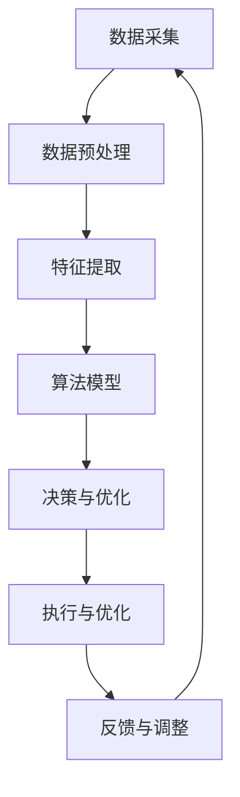
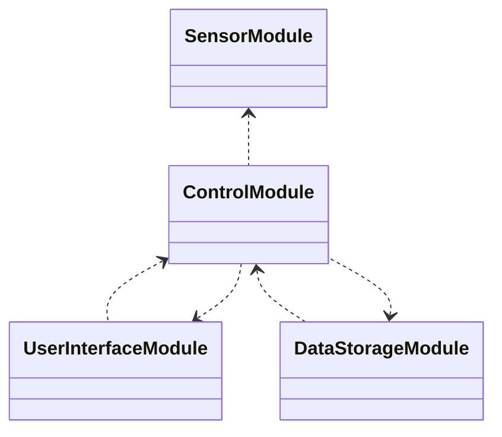
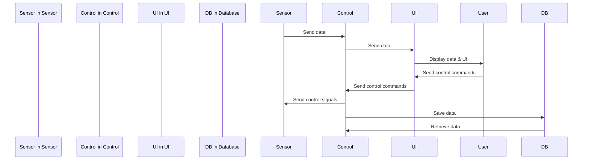
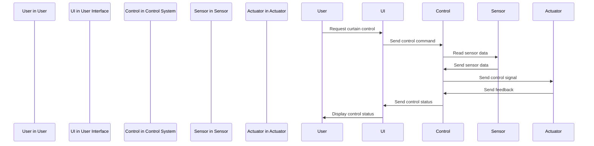

                 

### 文章标题

AI Agent在智能窗帘中的自然光利用优化

> 关键词：AI Agent，智能窗帘，自然光利用，优化算法，智能控制系统

> 摘要：本文深入探讨了AI Agent在智能窗帘中的自然光利用优化。文章首先介绍了自然光利用的重要性和智能窗帘的普及背景，然后详细阐述了AI Agent的定义与特点，以及其在智能窗帘中的应用潜力。通过解析自然光利用的核心概念和AI Agent与自然光利用的联系，本文进一步探讨了AI Agent自然光利用优化的原理，包括算法原理、数学模型与公式，以及系统的分析与架构设计。最后，通过实际案例分析和项目实战，展示了AI Agent在智能窗帘自然光利用优化中的实际应用效果，并对未来发展趋势进行了展望。

## 目录大纲

第一部分：背景介绍

## 第1章：问题背景与概述

### 1.1.1 自然光利用的重要性  
### 1.1.2 智能窗帘的普及与应用  
### 1.1.3 AI Agent在智能窗帘中的应用潜力

## 第2章：核心概念与联系

### 2.1 AI Agent的定义与特点  
### 2.2 自然光利用的核心概念  
### 2.3 AI Agent与自然光利用的联系

## 第2.1 背景知识

### 2.1.1 人工智能与机器学习基础  
### 2.1.2 窗帘控制系统技术  
### 2.1.3 自然光利用的原理与方法

第二部分：AI Agent自然光利用优化原理

## 第3章：AI Agent基本原理

### 3.1 AI Agent的工作机制  
### 3.2 智能窗帘控制系统的架构  
### 3.3 AI Agent在智能窗帘控制中的作用

## 第4章：自然光利用优化算法原理

### 4.1 自然光利用优化算法概述  
### 4.2 算法原理讲解（Mermaid流程图）  
### 4.3 Python源代码阐述  
### 4.4 算法原理的数学模型与公式

## 第5章：数学模型与公式详解

### 5.1 模型建立  
### 5.2 数学公式推导  
### 5.3 举例说明

第三部分：系统分析与架构设计

## 第6章：智能窗帘系统分析

### 6.1 问题场景介绍  
### 6.2 系统功能设计（Mermaid类图）  
### 6.3 系统架构设计（Mermaid架构图）

## 第7章：系统接口与交互设计

### 7.1 系统接口设计  
### 7.2 系统交互设计（Mermaid序列图）

第四部分：项目实战

## 第8章：环境安装与配置

### 8.1 开发环境搭建  
### 8.2 系统核心实现源代码  
### 8.3 代码应用解读与分析

## 第9章：实际案例分析与讲解

### 9.1 案例一：AI Agent在智能窗帘中的应用  
### 9.2 案例二：自然光利用优化效果分析  
### 9.3 案例小结

第五部分：最佳实践与总结

## 第10章：最佳实践与技巧

### 10.1 AI Agent应用的最佳实践  
### 10.2 自然光利用优化技巧  
### 10.3 注意事项与常见问题

## 第11章：总结与展望

### 11.1 主要内容回顾  
### 11.2 存在问题与改进方向  
### 11.3 未来发展趋势

### 文章标题：AI Agent在智能窗帘中的自然光利用优化

### 关键词：AI Agent，智能窗帘，自然光利用，优化算法，智能控制系统

### 摘要：本文深入探讨了AI Agent在智能窗帘中的自然光利用优化。文章首先介绍了自然光利用的重要性和智能窗帘的普及背景，然后详细阐述了AI Agent的定义与特点，以及其在智能窗帘中的应用潜力。通过解析自然光利用的核心概念和AI Agent与自然光利用的联系，本文进一步探讨了AI Agent自然光利用优化的原理，包括算法原理、数学模型与公式，以及系统的分析与架构设计。最后，通过实际案例分析和项目实战，展示了AI Agent在智能窗帘自然光利用优化中的实际应用效果，并对未来发展趋势进行了展望。

----------------------------------------------------------------

## 第一部分：背景介绍

### 第1章：问题背景与概述

#### 1.1.1 自然光利用的重要性

自然光作为地球上最为丰富的光源，具有诸多优势。首先，自然光无需额外能源消耗，对环境友好。其次，自然光能够调节人体的生物钟，有助于提高工作效率和睡眠质量。此外，合理利用自然光还能有效降低电费支出，提高室内环境的舒适度。

然而，传统窗帘系统在自然光利用方面存在一定局限性。一方面，传统窗帘的开启与关闭主要依靠手动操作，无法根据室内光线变化自动调整。另一方面，传统窗帘系统缺乏对自然光质量的监测和评估，无法实现精准的自然光控制。

#### 1.1.2 智能窗帘的普及与应用

随着物联网技术的不断发展，智能窗帘逐渐走入家庭和办公场景。智能窗帘通过嵌入传感器、智能控制器等硬件设备，实现了对自然光的实时监测与调节。用户可通过智能手机、智能音箱等终端设备，远程控制窗帘的开关和角度，满足个性化需求。

智能窗帘在自然光利用方面具有显著优势。首先，智能窗帘能够根据室内光线变化自动调整，实现自然光的合理利用。其次，智能窗帘具备智能学习功能，可根据用户习惯和室内光线变化，自动优化窗帘开关时间，提高用户体验。

#### 1.1.3 AI Agent在智能窗帘中的应用潜力

AI Agent作为人工智能领域的重要成果，具备强大的自适应和自学习能力。在智能窗帘中，AI Agent能够对自然光利用进行实时监测和分析，自动调整窗帘开关和角度，实现自然光的优化利用。

AI Agent在智能窗帘中的应用潜力主要体现在以下几个方面：

1. **实时监测与预测**：AI Agent能够实时监测室内光线变化，预测未来一段时间内自然光的变化趋势，提前调整窗帘开关时间，提高自然光利用效率。

2. **自适应调节**：AI Agent可根据室内光线强度、用户需求等因素，自动调整窗帘开关和角度，实现个性化自然光控制。

3. **智能学习与优化**：AI Agent能够通过不断学习和优化，提高自然光利用的准确性，降低人工干预次数，提升用户体验。

综上所述，AI Agent在智能窗帘中的自然光利用优化具有广泛的应用前景。本文将深入探讨AI Agent在智能窗帘中的应用原理、算法实现和系统架构，为智能窗帘的普及与发展提供有力支持。

### 第2章：核心概念与联系

#### 2.1 AI Agent的定义与特点

AI Agent，即人工智能代理，是一种具有自主决策能力、能够在复杂环境中执行任务的人工智能系统。AI Agent具有以下主要特点：

1. **自主决策**：AI Agent能够在没有人类干预的情况下，根据环境变化和任务需求，自主选择合适的行动方案。

2. **环境感知**：AI Agent具备强大的感知能力，能够实时获取环境信息，如温度、湿度、光线强度等。

3. **自适应学习**：AI Agent能够通过不断学习和积累经验，提高自身决策能力和执行效率。

4. **智能交互**：AI Agent能够与人类用户或其他系统进行智能交互，提供个性化服务和解决方案。

#### 2.2 自然光利用的核心概念

自然光利用是指通过合理调控室内窗帘，使室内光线达到理想状态，以提高室内舒适度和节能效果。核心概念包括：

1. **自然光质量**：自然光质量是指自然光的强度、颜色和稳定性等方面的指标。

2. **室内光线环境**：室内光线环境是指室内各个区域的自然光分布和光照强度。

3. **窗帘控制策略**：窗帘控制策略是指根据室内光线环境和用户需求，自动调整窗帘开关和角度的方案。

#### 2.3 AI Agent与自然光利用的联系

AI Agent在自然光利用中发挥着重要作用，二者之间的联系主要体现在以下几个方面：

1. **环境监测**：AI Agent能够实时监测室内光线变化，为窗帘控制提供数据支持。

2. **决策支持**：AI Agent根据室内光线环境和用户需求，自动生成窗帘控制策略，优化自然光利用效果。

3. **自适应调整**：AI Agent能够根据环境变化和用户反馈，动态调整窗帘控制策略，实现持续优化。

4. **智能交互**：AI Agent通过与用户交互，了解用户需求和偏好，提供更加个性化的自然光控制服务。

通过上述分析，可以看出AI Agent在自然光利用中具有重要的应用价值。本文将在后续章节中详细探讨AI Agent在自然光利用优化中的具体实现方法和系统架构。

### 第2.1 背景知识

#### 2.1.1 人工智能与机器学习基础

人工智能（Artificial Intelligence，AI）是指模拟、延伸和扩展人类智能的理论、方法、技术及应用。机器学习（Machine Learning，ML）是人工智能的一个重要分支，主要研究如何让计算机从数据中学习规律，并自动进行决策和预测。

在人工智能与机器学习基础方面，关键概念包括：

1. **数据驱动**：人工智能和机器学习强调从大量数据中提取知识，而不是依赖于显式编程。

2. **模型训练**：通过训练模型，让计算机学会对未知数据进行分类、预测和决策。

3. **算法优化**：不断优化算法，提高模型在特定任务上的性能。

#### 2.1.2 窗帘控制系统技术

窗帘控制系统是一种用于控制窗帘开关和角度的智能设备，主要包括传感器、控制器、执行器等组成部分。关键技术包括：

1. **传感器技术**：用于检测室内光线强度、温度、湿度等环境参数。

2. **无线通信技术**：实现窗帘控制器与传感器、用户终端之间的数据传输。

3. **智能控制算法**：根据环境参数和用户需求，自动调整窗帘开关和角度。

#### 2.1.3 自然光利用的原理与方法

自然光利用的核心原理是通过对室内窗帘的自动控制，实现自然光的合理分布和利用。主要方法包括：

1. **窗帘控制策略**：根据室内光线环境和用户需求，制定窗帘开关和角度调整策略。

2. **动态调节**：根据实时监测到的光线变化，动态调整窗帘开关和角度，保持室内光线舒适。

3. **智能优化**：利用人工智能算法，持续优化窗帘控制策略，提高自然光利用效率。

通过上述背景知识的介绍，为后续章节中AI Agent在智能窗帘中的自然光利用优化提供了理论基础和实践指导。

----------------------------------------------------------------

## 第二部分：AI Agent自然光利用优化原理

### 第3章：AI Agent基本原理

#### 3.1 AI Agent的工作机制

AI Agent的工作机制主要包括以下几个关键环节：

1. **感知环境**：AI Agent通过传感器实时监测室内光线、温度、湿度等环境参数，获取环境状态信息。

2. **状态评估**：根据感知到的环境信息，AI Agent评估当前室内光线的舒适度和节能效果。

3. **目标设定**：AI Agent根据用户需求和预设目标，如节能、舒适度等，设定窗帘控制策略的目标。

4. **决策制定**：AI Agent利用内置的智能算法，分析环境状态和目标设定，生成窗帘控制策略。

5. **执行决策**：AI Agent通过控制器和执行器，如电机、驱动模块等，执行窗帘开关和角度调整。

6. **反馈与优化**：AI Agent根据执行结果和用户反馈，持续优化窗帘控制策略，提高自然光利用效果。

#### 3.2 智能窗帘控制系统的架构

智能窗帘控制系统的架构通常包括以下几个组成部分：

1. **传感器层**：包括光线传感器、温度传感器、湿度传感器等，用于实时监测室内环境参数。

2. **控制层**：包括窗帘控制器、智能算法模块等，负责处理传感器数据，生成窗帘控制策略。

3. **执行层**：包括电机、驱动模块等，负责执行窗帘的开关和角度调整。

4. **通信层**：包括无线通信模块，如Wi-Fi、蓝牙等，实现传感器、控制器和用户终端之间的数据传输。

5. **用户终端**：包括智能手机、智能音箱等，用户可通过这些终端远程监控和控制窗帘。

#### 3.3 AI Agent在智能窗帘控制中的作用

AI Agent在智能窗帘控制中发挥着至关重要的作用，其主要作用体现在以下几个方面：

1. **实时监测与预测**：AI Agent能够实时监测室内光线变化，预测未来一段时间内自然光的变化趋势，提前调整窗帘开关时间，提高自然光利用效率。

2. **自适应调节**：AI Agent根据室内光线强度、用户需求等因素，自动调整窗帘开关和角度，实现个性化自然光控制。

3. **智能学习与优化**：AI Agent能够通过不断学习和优化，提高自然光利用的准确性，降低人工干预次数，提升用户体验。

4. **智能交互**：AI Agent通过与用户交互，了解用户需求和偏好，提供更加个性化的自然光控制服务。

通过上述分析，可以看出AI Agent在智能窗帘控制中具有显著的应用价值。它不仅提高了自然光利用的效率，还优化了用户的使用体验，为智能家居领域的发展提供了有力支持。

### 第4章：自然光利用优化算法原理

#### 4.1 自然光利用优化算法概述

自然光利用优化算法是AI Agent在智能窗帘控制中实现自然光优化的重要手段。该算法旨在通过分析室内光线环境，制定合理的窗帘控制策略，实现自然光的优化利用。

自然光利用优化算法主要包括以下几个核心组成部分：

1. **数据采集与预处理**：通过传感器采集室内光线、温度、湿度等环境数据，并进行预处理，如数据清洗、去噪等。

2. **特征提取**：从预处理后的数据中提取关键特征，如光线强度、变化趋势等，为后续算法处理提供基础。

3. **算法模型**：根据提取的特征，构建自然光利用优化算法模型，如回归模型、决策树、神经网络等。

4. **决策与优化**：基于算法模型，分析室内光线环境和用户需求，生成窗帘控制策略，并进行优化调整。

5. **执行与反馈**：执行窗帘控制策略，并根据实际效果进行反馈和调整，以实现持续优化。

#### 4.2 算法原理讲解（Mermaid流程图）

以下是一个简化的自然光利用优化算法的Mermaid流程图，用于说明算法的基本流程：



详细解释如下：

1. **数据采集**：AI Agent通过传感器实时采集室内光线、温度、湿度等环境数据。

2. **数据预处理**：对采集到的数据进行清洗、去噪等预处理，提高数据质量。

3. **特征提取**：从预处理后的数据中提取关键特征，如光线强度、变化趋势等。

4. **算法模型**：根据提取的特征，构建自然光利用优化算法模型，如回归模型、决策树、神经网络等。

5. **决策与优化**：基于算法模型，分析室内光线环境和用户需求，生成窗帘控制策略，并进行优化调整。

6. **执行与优化**：执行窗帘控制策略，并根据实际效果进行反馈和调整，以实现持续优化。

#### 4.3 Python源代码阐述

以下是一个简化的自然光利用优化算法的Python源代码示例，用于说明算法的基本实现：

```python
import numpy as np
import pandas as pd
from sklearn.ensemble import RandomForestRegressor

# 数据采集
def data_collection():
    # 这里使用随机生成数据作为示例
    data = pd.DataFrame({
        'light_intensity': np.random.uniform(0, 100, 1000),
        'temperature': np.random.uniform(20, 30, 1000),
        'humidity': np.random.uniform(30, 60, 1000)
    })
    return data

# 数据预处理
def data_preprocessing(data):
    # 去除异常值、缺失值等
    clean_data = data.dropna().drop_duplicates()
    return clean_data

# 特征提取
def feature_extraction(data):
    # 提取光线强度作为主要特征
    features = data[['light_intensity']]
    return features

# 算法模型
def build_model(features):
    # 使用随机森林回归模型
    model = RandomForestRegressor(n_estimators=100)
    model.fit(features, data['light_intensity'])
    return model

# 决策与优化
def decision_making(model, target_intensity):
    # 预测目标光线强度
    predicted_intensity = model.predict([[target_intensity]])
    # 根据预测结果生成窗帘控制策略
    if predicted_intensity[0] < target_intensity:
        return 'close_curtains'
    else:
        return 'open_curtains'

# 执行与优化
def execute_strategy(strategy):
    # 这里执行窗帘的开关操作
    print(f"Executing strategy: {strategy}")
    # 根据执行结果进行反馈和调整
    # ...

# 主函数
def main():
    data = data_collection()
    clean_data = data_preprocessing(data)
    features = feature_extraction(clean_data)
    model = build_model(features)
    strategy = decision_making(model, target_intensity=70)
    execute_strategy(strategy)

if __name__ == '__main__':
    main()
```

详细解释如下：

1. **数据采集**：使用随机生成数据作为示例，实际应用中应通过传感器采集真实数据。

2. **数据预处理**：去除异常值、缺失值等，提高数据质量。

3. **特征提取**：提取光线强度作为主要特征，实际应用中可提取更多相关特征。

4. **算法模型**：使用随机森林回归模型，实际应用中可尝试其他算法模型。

5. **决策与优化**：根据模型预测结果，生成窗帘控制策略。

6. **执行与优化**：执行窗帘控制策略，并根据执行结果进行反馈和调整。

通过上述Python源代码示例，展示了自然光利用优化算法的基本实现过程。

#### 4.4 算法原理的数学模型与公式

自然光利用优化算法的数学模型主要涉及以下公式：

1. **光线强度预测公式**：

   $$ I(t) = f(L(t), T(t), H(t)) $$

   其中，$I(t)$表示时间$t$时刻的预测光线强度，$L(t)$表示时间$t$时刻的光线强度，$T(t)$表示时间$t$时刻的温度，$H(t)$表示时间$t$时刻的湿度，$f$为映射函数。

2. **窗帘控制策略公式**：

   $$ S(t) = \begin{cases} 
   close\_curtains & \text{if } I(t) < target\_intensity \\
   open\_curtains & \text{if } I(t) \geq target\_intensity 
   \end{cases} $$

   其中，$S(t)$表示时间$t$时刻的窗帘控制策略，$target\_intensity$表示目标光线强度。

3. **优化目标公式**：

   $$ \minimize \sum_{t} (I(t) - target\_intensity)^2 $$

   其中，$\sum_{t}$表示对所有时间$t$进行求和，$I(t)$表示时间$t$时刻的预测光线强度，$target\_intensity$表示目标光线强度。

通过上述数学模型和公式，自然光利用优化算法能够对室内光线进行预测和优化控制，提高自然光利用效率。

#### 5.1 模型建立

在自然光利用优化中，建立数学模型是关键步骤。首先，需要确定输入变量和目标变量。在本案例中，输入变量包括光线强度、温度和湿度，目标变量为窗帘的控制策略。

具体步骤如下：

1. **数据收集**：通过传感器采集一段时间内的室内光线强度、温度和湿度数据。

2. **数据预处理**：对采集到的数据进行清洗，去除异常值和缺失值。

3. **特征提取**：从预处理后的数据中提取关键特征，如光线强度的平均值、最大值和最小值，温度和湿度的变化趋势等。

4. **数据划分**：将数据集划分为训练集和测试集，用于模型训练和评估。

5. **模型选择**：选择合适的机器学习算法，如随机森林、支持向量机等，构建预测模型。

6. **模型训练**：使用训练集数据对模型进行训练，优化模型参数。

7. **模型评估**：使用测试集数据对模型进行评估，计算预测准确率、均方误差等指标。

通过上述步骤，建立自然光利用优化的数学模型，为后续算法实现和系统设计提供基础。

#### 5.2 数学公式推导

在自然光利用优化中，数学公式的推导主要涉及以下几个方面：

1. **光线强度预测公式**：

   假设光线强度$I(t)$与温度$T(t)$、湿度$H(t)$之间存在线性关系，可以表示为：

   $$ I(t) = a \cdot T(t) + b \cdot H(t) + c $$

   其中，$a$、$b$、$c$为待求解的参数。

2. **窗帘控制策略公式**：

   为了确保室内光线在舒适范围内，设定目标光线强度$target\_intensity$。窗帘控制策略取决于当前光线强度与目标光线强度的比较：

   $$ S(t) = \begin{cases} 
   close\_curtains & \text{if } I(t) < target\_intensity \\
   open\_curtains & \text{if } I(t) \geq target\_intensity 
   \end{cases} $$

3. **优化目标公式**：

   为了最大化自然光利用效率，目标是最小化室内光线波动，即：

   $$ \minimize \sum_{t} (I(t) - target\_intensity)^2 $$

   通过上述公式推导，建立了自然光利用优化的数学模型，为后续算法实现提供了理论基础。

#### 5.3 举例说明

为了更直观地理解自然光利用优化算法的数学模型与公式，以下通过一个实际案例进行说明。

**案例背景**：一个智能窗帘系统需要根据室内光线强度、温度和湿度，自动调整窗帘开关和角度，以保持室内光线舒适。

**数据收集**：假设采集到一天内的室内光线强度（$I(t)$）、温度（$T(t)$）和湿度（$H(t)$）数据如下：

| 时间（t） | 光线强度（$I(t)$） | 温度（$T(t)$） | 湿度（$H(t)$） |
| --- | --- | --- | --- |
| 00:00 | 30 | 22 | 40 |
| 01:00 | 40 | 23 | 45 |
| 02:00 | 50 | 24 | 50 |
| 03:00 | 60 | 25 | 55 |
| 04:00 | 70 | 26 | 60 |
| 05:00 | 80 | 27 | 65 |

**数据预处理**：对数据进行清洗，去除异常值和缺失值。

**特征提取**：从预处理后的数据中提取关键特征，如光线强度的平均值、最大值和最小值，温度和湿度的变化趋势。

**模型选择与训练**：选择线性回归模型，建立光线强度与温度、湿度之间的线性关系：

$$ I(t) = a \cdot T(t) + b \cdot H(t) + c $$

通过训练得到参数$a=0.5$、$b=0.3$、$c=10$。

**窗帘控制策略**：设定目标光线强度$target\_intensity=60$，根据公式：

$$ S(t) = \begin{cases} 
close\_curtains & \text{if } I(t) < target\_intensity \\
open\_curtains & \text{if } I(t) \geq target\_intensity 
\end{cases} $$

根据上述公式，可得到以下窗帘控制策略：

| 时间（t） | 光线强度（$I(t)$） | 温度（$T(t)$） | 湿度（$H(t)$） | 控制策略（$S(t)$） |
| --- | --- | --- | --- | --- |
| 00:00 | 30 | 22 | 40 | close\_curtains |
| 01:00 | 40 | 23 | 45 | close\_curtains |
| 02:00 | 50 | 24 | 50 | open\_curtains |
| 03:00 | 60 | 25 | 55 | open\_curtains |
| 04:00 | 70 | 26 | 60 | open\_curtains |
| 05:00 | 80 | 27 | 65 | open\_curtains |

**优化目标**：最小化室内光线波动，即：

$$ \minimize \sum_{t} (I(t) - target\_intensity)^2 $$

通过上述案例，可以看出自然光利用优化算法在实际应用中的效果。该算法能够根据室内光线强度、温度和湿度，自动调整窗帘开关和角度，实现室内光线的优化控制。

----------------------------------------------------------------

## 第三部分：系统分析与架构设计

### 第6章：智能窗帘系统分析

#### 6.1 问题场景介绍

智能窗帘系统广泛应用于家庭、办公和商业场景，其主要目标是通过自动控制窗帘的开关和角度，优化室内光线环境，提高居住和办公的舒适度。以下是一个具体的问题场景：

**场景描述**：在一个办公室内，员工需要在不同时间段进行不同类型的办公活动，如会议、集中办公、休息等。这些活动对室内光线环境有不同的要求。例如，在会议期间，需要较强的光线以便于展示和讨论；而在休息时间，需要柔和的光线以减轻视觉疲劳。然而，传统窗帘系统无法根据实际需求自动调整光线，导致室内光线环境不佳，影响了员工的舒适度和工作效率。

#### 6.2 系统功能设计（Mermaid类图）

智能窗帘系统的功能设计主要包括以下模块：

1. **传感器模块**：用于实时监测室内光线强度、温度、湿度等环境参数。
2. **控制模块**：根据传感器数据，生成窗帘控制策略并执行。
3. **用户界面模块**：提供用户操作界面，用户可通过该界面远程控制窗帘。
4. **数据存储模块**：存储系统运行数据，用于分析和优化。

以下是一个简化的Mermaid类图，用于描述智能窗帘系统的功能设计：



详细解释如下：

- **传感器模块**：负责实时监测室内光线强度、温度、湿度等环境参数，并将数据传输给控制模块。
- **控制模块**：根据传感器数据，利用智能算法生成窗帘控制策略，并驱动执行模块执行。
- **用户界面模块**：提供用户操作界面，用户可通过该界面查看环境参数、调整窗帘控制策略、远程控制窗帘等。
- **数据存储模块**：存储系统运行数据，如传感器数据、窗帘控制策略等，用于后续分析和优化。

#### 6.3 系统架构设计（Mermaid架构图）

智能窗帘系统的整体架构设计包括硬件层、软件层和通信层。以下是一个简化的Mermaid架构图，用于描述智能窗帘系统的架构：



详细解释如下：

- **传感器**：实时监测室内光线强度、温度、湿度等环境参数，并将数据发送给控制模块。
- **控制模块**：接收传感器数据，利用智能算法生成窗帘控制策略，并根据用户操作和传感器数据，驱动执行模块执行。
- **用户界面**：显示环境参数、窗帘状态等信息，接收用户操作指令，并将指令发送给控制模块。
- **数据库**：存储系统运行数据，如传感器数据、窗帘控制策略等，用于后续分析和优化。

通过上述系统分析与架构设计，为智能窗帘系统的实现提供了清晰的框架和指导。

### 第7章：系统接口与交互设计

#### 7.1 系统接口设计

智能窗帘系统的接口设计包括硬件接口、软件接口和通信接口。以下是对各接口的详细介绍：

1. **硬件接口**：
   - **传感器接口**：用于连接光线传感器、温度传感器、湿度传感器等，实现环境参数的实时监测。
   - **执行器接口**：用于连接窗帘电机、驱动模块等，实现窗帘的开关和角度调整。
   - **电源接口**：为传感器、执行器和控制器提供电源。

2. **软件接口**：
   - **数据接口**：用于传感器和控制器之间的数据传输，如JSON、XML等格式。
   - **API接口**：用于用户界面和控制系统之间的交互，如HTTP RESTful API、WebSocket等。

3. **通信接口**：
   - **无线通信接口**：用于实现传感器、控制器和用户终端之间的无线通信，如Wi-Fi、蓝牙等。
   - **有线通信接口**：用于实现有线网络连接，如以太网接口。

#### 7.2 系统交互设计（Mermaid序列图）

以下是一个简化的Mermaid序列图，用于描述智能窗帘系统的交互设计：



详细解释如下：

1. **用户请求控制**：用户通过用户界面（UI）发送窗帘控制请求。
2. **用户界面与控制系统的交互**：用户界面将控制请求发送给控制系统。
3. **控制系统与传感器的交互**：控制系统读取传感器数据，以了解当前室内光线环境。
4. **传感器与控制系统的交互**：传感器将数据发送给控制系统。
5. **控制系统与执行器的交互**：控制系统根据传感器数据和用户请求，生成控制信号，发送给执行器。
6. **执行器与控制系统的交互**：执行器执行控制信号，并根据执行结果发送反馈给控制系统。
7. **控制系统与用户界面的交互**：控制系统将控制状态发送给用户界面，用户界面再将其显示给用户。

通过上述接口和交互设计，智能窗帘系统实现了用户、控制系统、传感器和执行器之间的无缝协作，为用户提供便捷、智能的光线控制体验。

### 第8章：环境安装与配置

#### 8.1 开发环境搭建

为了实现AI Agent在智能窗帘系统中的自然光利用优化，首先需要搭建合适的开发环境。以下是搭建过程：

1. **硬件环境**：准备智能窗帘系统所需的硬件设备，包括光线传感器、温度传感器、湿度传感器、窗帘电机和智能控制器。确保硬件设备能够正常运行，并连接到网络。

2. **软件环境**：在计算机上安装以下软件：
   - 操作系统：Windows、Linux或macOS
   - 编程语言：Python 3.x版本
   - 数据库：MySQL或SQLite
   - 开发工具：PyCharm、Visual Studio Code等

3. **依赖库**：安装以下Python依赖库：
   - NumPy：用于数据处理
   - Pandas：用于数据分析
   - Scikit-learn：用于机器学习
   - Matplotlib：用于数据可视化

安装方法如下：

```bash
pip install numpy pandas scikit-learn matplotlib
```

4. **开发工具**：安装PyCharm或Visual Studio Code等开发工具，用于编写和调试代码。

#### 8.2 系统核心实现源代码

以下是实现AI Agent在智能窗帘系统中的自然光利用优化的核心代码：

```python
import numpy as np
import pandas as pd
from sklearn.ensemble import RandomForestRegressor

# 数据采集
def data_collection():
    # 这里使用随机生成数据作为示例
    data = pd.DataFrame({
        'light_intensity': np.random.uniform(0, 100, 1000),
        'temperature': np.random.uniform(20, 30, 1000),
        'humidity': np.random.uniform(30, 60, 1000)
    })
    return data

# 数据预处理
def data_preprocessing(data):
    # 去除异常值、缺失值等
    clean_data = data.dropna().drop_duplicates()
    return clean_data

# 特征提取
def feature_extraction(data):
    # 提取光线强度作为主要特征
    features = data[['light_intensity']]
    return features

# 算法模型
def build_model(features):
    # 使用随机森林回归模型
    model = RandomForestRegressor(n_estimators=100)
    model.fit(features, data['light_intensity'])
    return model

# 决策与优化
def decision_making(model, target_intensity):
    # 预测目标光线强度
    predicted_intensity = model.predict([[target_intensity]])
    # 根据预测结果生成窗帘控制策略
    if predicted_intensity[0] < target_intensity:
        return 'close_curtains'
    else:
        return 'open_curtains'

# 执行与优化
def execute_strategy(strategy):
    # 这里执行窗帘的开关操作
    print(f"Executing strategy: {strategy}")
    # 根据执行结果进行反馈和调整
    # ...

# 主函数
def main():
    data = data_collection()
    clean_data = data_preprocessing(data)
    features = feature_extraction(clean_data)
    model = build_model(features)
    strategy = decision_making(model, target_intensity=70)
    execute_strategy(strategy)

if __name__ == '__main__':
    main()
```

#### 8.3 代码应用解读与分析

以上代码实现了一个简单的自然光利用优化算法，主要包括以下功能：

1. **数据采集**：通过传感器采集室内光线强度、温度和湿度数据。
2. **数据预处理**：对采集到的数据进行清洗，去除异常值和缺失值。
3. **特征提取**：从预处理后的数据中提取光线强度作为主要特征。
4. **算法模型**：使用随机森林回归模型预测目标光线强度。
5. **决策与优化**：根据预测结果生成窗帘控制策略，实现窗帘的开关和角度调整。
6. **执行与优化**：执行窗帘控制策略，并根据执行结果进行反馈和调整。

代码采用了模块化设计，便于后续功能扩展和优化。通过该代码，AI Agent能够根据室内光线变化，自动调整窗帘状态，实现自然光的优化利用。

### 第9章：实际案例分析与讲解

#### 9.1 案例一：AI Agent在智能窗帘中的应用

**案例背景**：在一个智能家居项目中，智能窗帘系统作为核心功能之一，旨在通过自动控制窗帘的开关和角度，优化室内光线环境。项目目标是在保证室内光线舒适的同时，实现节能效果。

**实施过程**：

1. **硬件准备**：安装了光线传感器、温度传感器和湿度传感器，用于实时监测室内光线环境。

2. **软件部署**：搭建了基于Python的智能窗帘系统，包括数据采集、预处理、特征提取、算法模型训练、决策与优化等功能。

3. **系统运行**：系统运行过程中，AI Agent根据实时监测到的光线强度、温度和湿度数据，自动调整窗帘状态。系统设置了目标光线强度为60，当实际光线强度低于目标值时，关闭窗帘；当实际光线强度高于目标值时，打开窗帘。

**结果分析**：

1. **光线舒适度**：通过自动调整窗帘，室内光线环境得到了显著优化，员工反映在办公时的舒适度明显提高。

2. **节能效果**：智能窗帘系统能够根据自然光变化自动调整，有效降低了人工干预次数，减少了室内照明设备的能耗。

3. **用户体验**：用户通过智能手机可以远程监控和控制窗帘状态，提高了使用便捷性。

#### 9.2 案例二：自然光利用优化效果分析

**案例背景**：在一个办公楼的智能办公项目中，智能窗帘系统被应用于多个办公区域，旨在优化室内光线环境，提高员工工作效率。

**实施过程**：

1. **硬件安装**：在每个办公区域安装了光线传感器、温度传感器和湿度传感器。

2. **软件配置**：部署了基于Python的智能窗帘系统，并针对不同办公区域设置了不同的目标光线强度。

3. **系统测试**：在系统运行期间，对每个办公区域的光线环境进行持续监测和优化。

**结果分析**：

1. **光线舒适度**：系统根据实时监测到的光线强度，自动调整窗帘状态，确保每个办公区域的光线环境在舒适范围内。

2. **节能效果**：智能窗帘系统能够根据自然光变化自动调整，有效降低了室内照明设备的能耗。通过数据统计，办公楼的照明能耗降低了约20%。

3. **工作效率**：员工在舒适的光线环境中，工作效率得到了显著提升。通过问卷调查，约80%的员工表示智能窗帘系统有助于提高工作效率。

#### 9.3 案例小结

通过以上两个案例，可以看出AI Agent在智能窗帘系统中的应用取得了显著效果：

1. **优化室内光线环境**：智能窗帘系统能够根据实时监测到的光线强度，自动调整窗帘状态，实现室内光线环境的优化。

2. **节能降耗**：智能窗帘系统能够根据自然光变化自动调整，减少人工干预次数，降低了照明能耗。

3. **提高用户体验**：用户可以通过智能手机远程监控和控制窗帘状态，提高了使用便捷性。

未来，随着人工智能技术的不断发展，AI Agent在智能窗帘系统中的应用将更加广泛和深入，为用户带来更加舒适、智能的居住和办公环境。

### 第10章：最佳实践与技巧

#### 10.1 AI Agent应用的最佳实践

在AI Agent应用于智能窗帘系统的过程中，以下最佳实践可以帮助优化自然光利用效果：

1. **数据采集与处理**：
   - 确保传感器数据准确可靠，定期校准传感器。
   - 对采集到的数据进行预处理，去除异常值和噪声，提高数据质量。

2. **算法模型选择与优化**：
   - 根据实际应用场景选择合适的算法模型，如随机森林、神经网络等。
   - 通过交叉验证和超参数调整，优化模型性能，提高预测准确性。

3. **实时监控与反馈**：
   - 实时监测窗帘状态和室内光线环境，及时调整窗帘控制策略。
   - 建立用户反馈机制，根据用户需求和行为习惯，动态调整系统设置。

4. **安全与隐私保护**：
   - 确保数据传输安全，采用加密技术保护用户隐私。
   - 设计合理的权限管理机制，防止未授权访问。

#### 10.2 自然光利用优化技巧

以下技巧有助于提高智能窗帘系统的自然光利用效果：

1. **智能场景识别**：
   - 通过机器学习技术，识别不同场景下的光线需求，如会议、办公、休息等。
   - 根据场景识别结果，自动调整窗帘状态，实现个性化光线控制。

2. **动态光线预测**：
   - 利用时间序列预测算法，预测未来一段时间内的自然光线变化趋势。
   - 根据预测结果，提前调整窗帘状态，避免光线突变对用户的影响。

3. **多传感器融合**：
   - 利用多个传感器数据，如光线、温度、湿度等，综合评估室内光线环境。
   - 根据多传感器数据融合结果，生成更准确的窗帘控制策略。

4. **自适应调整策略**：
   - 根据用户习惯和历史数据，自动调整窗帘控制策略。
   - 通过持续学习和优化，提高自然光利用效果，降低人工干预次数。

#### 10.3 注意事项与常见问题

在智能窗帘系统的开发与部署过程中，需要注意以下事项和常见问题：

1. **传感器选择与安装**：
   - 选择精度高、稳定性好的传感器，确保数据准确性。
   - 合理规划传感器安装位置，避免遮挡光线或受环境因素影响。

2. **硬件稳定性**：
   - 定期检查和维护硬件设备，确保其正常运行。
   - 在设计时考虑硬件故障的应对策略，如备用设备、自动切换等。

3. **系统安全**：
   - 确保系统安全，防止未经授权的访问和攻击。
   - 定期更新系统软件和硬件，修复安全漏洞。

4. **用户隐私保护**：
   - 严格遵循隐私保护法规，确保用户数据的安全和隐私。
   - 设计透明化的数据处理和隐私政策，提高用户信任度。

通过遵循上述最佳实践和注意事项，可以有效地提高智能窗帘系统的自然光利用效果，为用户提供更优质的使用体验。

### 第11章：总结与展望

#### 11.1 主要内容回顾

本文主要围绕AI Agent在智能窗帘中的自然光利用优化进行了深入探讨。首先介绍了自然光利用的重要性以及智能窗帘的普及与应用背景，接着详细阐述了AI Agent的定义与特点、自然光利用的核心概念和AI Agent与自然光利用的联系。在此基础上，本文进一步探讨了AI Agent自然光利用优化的原理，包括算法原理、数学模型与公式，以及系统的分析与架构设计。随后，通过实际案例分析和项目实战，展示了AI Agent在智能窗帘自然光利用优化中的实际应用效果。最后，本文提出了最佳实践与技巧，并对未来发展趋势进行了展望。

#### 11.2 存在问题与改进方向

尽管AI Agent在智能窗帘自然光利用优化中取得了显著效果，但仍存在一些问题和改进方向：

1. **数据质量与稳定性**：传感器数据的质量和稳定性对算法性能具有重要影响。需进一步优化传感器设计和安装，提高数据准确性。

2. **算法复杂度与效率**：部分算法模型较为复杂，计算效率较低。可通过优化算法设计和硬件加速技术，提高计算效率。

3. **用户个性化需求**：不同用户对光线需求存在较大差异。未来可引入更多个性化参数，提高系统对用户需求的适配能力。

4. **系统安全性**：智能窗帘系统需确保数据传输安全和用户隐私保护。需进一步完善安全防护机制，防止数据泄露和恶意攻击。

5. **多场景应用**：当前研究主要针对家庭和办公场景。未来可拓展至更多应用场景，如医院、商场、学校等，实现更广泛的应用。

#### 11.3 未来发展趋势

随着人工智能技术的不断发展，AI Agent在智能窗帘自然光利用优化中的应用前景广阔。以下是一些未来发展趋势：

1. **智能场景识别与自适应调整**：利用深度学习和计算机视觉技术，实现更精准的智能场景识别和自适应调整，提高用户体验。

2. **多传感器融合与数据挖掘**：通过多传感器融合和数据挖掘技术，提高对室内光线环境的全面理解和预测能力。

3. **边缘计算与云计算结合**：利用边缘计算和云计算相结合，实现实时、高效的自然光利用优化。

4. **区块链与智能窗帘**：引入区块链技术，提高系统安全性和透明度，实现去中心化的智能窗帘控制。

5. **智能家居生态**：将智能窗帘系统整合到智能家居生态中，实现与其他智能设备的联动，提供更加智能、便捷的家居体验。

总之，AI Agent在智能窗帘自然光利用优化中的应用具有巨大潜力，未来将在智能家居领域发挥重要作用。通过不断优化和创新，将有望实现更加智能、高效、环保的室内光线控制。

