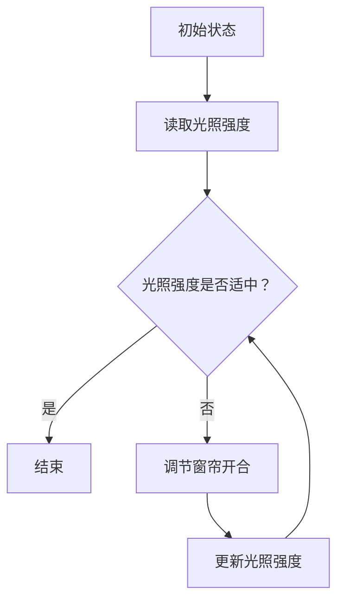
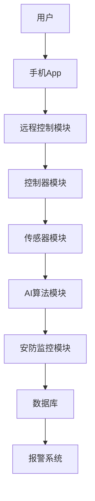

                 

 * 完成《AI Agent在智能窗帘杆中的日光治疗功能》的技术博客文章，并将目录大纲和文章内容相结合，实现核心内容覆盖完整。请根据要求逐步完成文章撰写，每完成一小部分内容，就用代码块`<!--html-->`标注出来，最后将所有代码块合并为一个完整的文章。在撰写过程中，注意章节之间的逻辑关系和内容的衔接，确保文章的整体流畅性和逻辑性。

```html
# 《AI Agent在智能窗帘杆中的日光治疗功能》

## 关键词

AI Agent、智能窗帘杆、日光治疗功能、算法原理、系统架构、项目实战

## 摘要

本文深入探讨了AI Agent在智能窗帘杆中的日光治疗功能。首先，我们介绍了AI Agent、智能窗帘杆和日光治疗功能的核心概念和背景。接着，详细阐述了AI Agent在日光治疗中的应用原理，包括算法原理、系统架构设计和项目实战。通过实际案例，我们展示了如何实现AI Agent在智能窗帘杆中的日光治疗功能，并对其效果进行了分析。最后，对项目的最佳实践、注意事项和未来发展趋势进行了总结。

<!--html-->

## 目录

1. **背景介绍**
   1.1 AI Agent概述
   1.2 智能窗帘杆简介
   1.3 日光治疗功能的原理与应用

2. **核心概念与联系**
   2.1 AI Agent的原理与特性
   2.2 智能窗帘杆与AI Agent的融合
   2.3 日光治疗功能中的AI算法

3. **系统分析与架构设计**
   3.1 系统需求分析
   3.2 系统架构设计
   3.3 系统接口设计与交互

4. **项目实战**
   4.1 环境安装与配置
   4.2 系统核心实现
   4.3 代码解读与分析
   4.4 实际案例分析

5. **总结与展望**
   5.1 项目小结
   5.2 最佳实践与注意事项
   5.3 未来发展趋势

<!--html-->

## 第一部分：背景介绍

### 1.1 AI Agent概述

AI Agent是一种具有自主行动能力、能在环境中自主完成任务的计算实体。它可以根据环境变化，自主做出决策，采取行动。AI Agent可以分为反应式Agent、行为基Agent、模型基Agent和混合式Agent。在智能窗帘杆中，AI Agent主要承担着根据环境光照强度，调节窗帘开口大小的任务。

#### 1.1.1 AI Agent的定义与分类

AI Agent是一种具有自主行动能力、能在环境中自主完成任务的计算实体。它们根据感知到的环境信息，自主做出决策，并采取行动。AI Agent可以分为以下几种类型：

- **反应式Agent**：这种类型的Agent仅根据当前感知的信息做出反应，而不考虑历史信息。例如，一个简单的智能家居灯光系统，当感知到光线过暗时，自动开启灯光。

- **行为基Agent**：这种类型的Agent根据一系列预定义的行为规则来操作。例如，一个智能窗帘系统，根据设定的时间表或天气信息，自动调节窗帘的开合。

- **模型基Agent**：这种类型的Agent通过建立一个环境模型，根据模型来预测未来的情况，并做出决策。例如，自动驾驶汽车，通过传感器收集的数据，建立一个环境模型，并根据模型来决定行车路线。

- **混合式Agent**：这种类型的Agent结合了反应式、行为基和模型基Agent的特点，根据不同情况采取不同的策略。例如，一个智能健康监测系统，在正常情况下，根据预设的行为规则操作，但在检测到异常时，会根据实时收集的数据，做出反应。

#### 1.1.2 AI Agent的应用场景

AI Agent在智能窗帘杆中的应用非常广泛。以下是一些常见的应用场景：

- **自动调节光线**：AI Agent可以根据室内外光照强度，自动调节窗帘的开合，以保持室内光线的舒适度。

- **节能控制**：AI Agent可以根据室内外温度和光照强度，自动调节窗帘的开合，以减少室内能源消耗。

- **安防监控**：AI Agent可以实时监控室内外环境，当检测到异常情况时，自动通知用户。

### 1.2 智能窗帘杆简介

智能窗帘杆是一种结合了AI技术和家居自动化技术的产品。它通过AI Agent，实现窗帘的智能调节，为用户带来更舒适、更便捷的生活体验。

#### 1.2.1 智能窗帘杆的功能特点

智能窗帘杆具有以下功能特点：

- **自动调节**：AI Agent可以根据室内外光照强度，自动调节窗帘的开合，保持室内光线舒适。

- **远程控制**：用户可以通过手机App远程控制窗帘，随时随地调节窗帘状态。

- **节能控制**：智能窗帘杆可以根据室内外温度和光照强度，自动调节窗帘的开合，减少能源消耗。

- **安全监控**：智能窗帘杆可以实时监控室内外环境，当检测到异常情况时，自动通知用户。

#### 1.2.2 智能窗帘杆的市场现状与发展趋势

随着智能家居市场的快速发展，智能窗帘杆逐渐成为家居智能化的重要组成部分。目前，智能窗帘杆市场主要集中在高端智能家居领域，随着技术的不断进步和成本的降低，未来智能窗帘杆有望在更广泛的家居市场中得到应用。

### 1.3 日光治疗功能的原理与应用

日光治疗功能是一种利用自然光照来改善人体健康的方法。它通过模拟自然光照环境，调节室内光照强度和色温，帮助用户改善心理健康和睡眠质量。

#### 1.3.1 日光治疗的基础知识

日光治疗是一种利用自然光照来改善人体健康的方法。它主要基于以下原理：

- **光照对人体的影响**：自然光照可以影响人体的生物节律，调节睡眠质量，提高心理健康。

- **光照强度和色温的控制**：通过调节光照强度和色温，可以创造出不同的光照环境，满足用户在不同场景下的需求。

#### 1.3.2 日光治疗的应用场景

日光治疗功能在智能窗帘杆中的应用非常广泛。以下是一些常见的应用场景：

- **改善睡眠质量**：通过调节窗帘的开合，模拟自然光照环境，帮助用户改善睡眠质量。

- **缓解抑郁症状**：对于患有抑郁症的用户，日光治疗功能可以提供足够的光照，缓解抑郁症状。

- **提高工作效率**：在办公环境中，通过调节窗帘，创造适合工作的高效光照环境，提高工作效率。

## 第二部分：核心概念与联系

### 2.1 AI Agent的原理与特性

AI Agent是一种具有自主行动能力的计算实体，它在智能窗帘杆中发挥着关键作用。下面，我们将详细介绍AI Agent的原理与特性。

#### 2.1.1 AI Agent的工作原理

AI Agent的工作原理可以分为以下几个步骤：

1. **感知环境**：AI Agent通过传感器收集环境信息，如光照强度、温度、湿度等。

2. **分析环境信息**：AI Agent利用内置的算法和模型，分析收集到的环境信息，以了解当前的环境状态。

3. **做出决策**：基于对环境信息的分析，AI Agent决定采取何种行动，如调节窗帘的开合、控制室内温度等。

4. **执行行动**：AI Agent通过执行决策，改变环境状态，以达到预期的效果。

#### 2.1.2 AI Agent的特性分析

AI Agent具有以下几个主要特性：

- **自主性**：AI Agent可以自主地感知环境、分析信息、做出决策和执行行动，而不需要人工干预。

- **适应性**：AI Agent可以根据环境的变化，自适应地调整行为，以保持环境状态的平衡。

- **灵活性**：AI Agent可以应对不同的环境和任务，具有广泛的适用性。

### 2.2 智能窗帘杆与AI Agent的融合

智能窗帘杆与AI Agent的融合，使得窗帘的调节更加智能化、自动化。下面，我们将详细探讨这种融合的实现方式。

#### 2.2.1 智能窗帘杆与AI Agent的关联

智能窗帘杆与AI Agent的关联主要体现在以下几个方面：

- **传感器**：智能窗帘杆配备有传感器，如光照传感器、温度传感器等，用于感知环境信息。

- **控制器**：AI Agent通过控制器与智能窗帘杆连接，实现对窗帘的调节。

- **算法**：AI Agent内置有专门的算法，用于分析环境信息，做出决策。

#### 2.2.2 智能窗帘杆在日光治疗中的应用

在日光治疗中，智能窗帘杆通过AI Agent，可以实现对室内光照强度和色温的精确控制，以模拟自然光照环境，帮助用户改善心理健康和睡眠质量。

- **光照强度控制**：AI Agent可以根据用户的需求，实时调节窗帘的开合，调整室内光照强度，使其达到最佳状态。

- **色温控制**：AI Agent还可以根据用户的需求，调节光源的色温，创造出不同氛围的光照环境，满足用户在不同场景下的需求。

### 2.3 日光治疗功能中的AI算法

日光治疗功能中的AI算法，是实现智能窗帘杆智能化调节的核心。下面，我们将详细介绍这些算法的原理和应用。

#### 2.3.1 算法原理介绍

日光治疗功能中的AI算法主要包括以下几种：

- **光照强度调节算法**：该算法根据室内外光照强度，实时调节窗帘的开合，以保持室内光照舒适。

- **色温调节算法**：该算法根据用户的需求，调节光源的色温，创造出不同氛围的光照环境。

- **环境适应性算法**：该算法可以根据环境的变化，自动调整窗帘的开合和色温，以保持环境状态的平衡。

#### 2.3.2 算法流程图

为了更好地理解这些算法的原理，我们可以使用mermaid绘制算法流程图。以下是光照强度调节算法的流程图：



## 第三部分：系统分析与架构设计

### 3.1 系统需求分析

在设计和实现AI Agent在智能窗帘杆中的日光治疗功能时，首先需要对系统的需求进行详细分析。系统需求包括功能需求、性能需求和其他需求。

#### 3.1.1 系统功能需求

系统的功能需求主要包括以下几个方面：

- **自动调节窗帘**：AI Agent根据室内外光照强度，自动调节窗帘的开合，以保持室内光照舒适。

- **远程控制**：用户可以通过手机App远程控制窗帘的开关和调节。

- **节能控制**：AI Agent根据室内外温度和光照强度，自动调节窗帘的开合，以减少能源消耗。

- **安防监控**：AI Agent实时监控室内外环境，当检测到异常情况时，自动通知用户。

#### 3.1.2 系统性能需求

系统的性能需求主要包括以下几个方面：

- **响应速度**：AI Agent需要快速响应用户的指令，调节窗帘的状态。

- **准确性**：AI Agent需要准确地感知室内外光照强度，并做出相应的调节。

- **稳定性**：系统需要稳定运行，避免出现故障或死机。

#### 3.1.3 其他需求

系统的其他需求主要包括以下几个方面：

- **安全性**：系统需要具备一定的安全性，防止恶意攻击或数据泄露。

- **兼容性**：系统需要兼容不同类型的智能窗帘杆，以及其他智能家居设备。

### 3.2 系统架构设计

系统架构设计是确保系统功能实现和性能优化的重要环节。下面，我们将介绍系统架构的设计方案。

#### 3.2.1 系统架构概述

系统架构采用模块化设计，包括以下几个主要模块：

- **传感器模块**：负责感知室内外光照强度、温度等环境信息。

- **控制器模块**：负责接收用户的指令，控制窗帘的开合。

- **AI算法模块**：负责分析环境信息，根据光照强度和用户需求，自动调节窗帘的开合。

- **远程控制模块**：负责实现用户通过手机App远程控制窗帘的功能。

- **安防监控模块**：负责实时监控室内外环境，当检测到异常情况时，自动通知用户。

#### 3.2.2 系统架构图

以下是系统架构的示意图：



### 3.3 系统接口设计与交互

系统接口设计是确保系统模块之间能够有效通信和协作的重要环节。下面，我们将介绍系统接口的设计方案。

#### 3.3.1 系统接口设计

系统接口设计主要包括以下几个方面：

- **传感器接口**：传感器模块与AI算法模块之间的接口，用于传输环境信息。

- **控制器接口**：控制器模块与传感器模块之间的接口，用于控制窗帘的开合。

- **远程控制接口**：远程控制模块与用户之间的接口，用于接收用户的指令。

- **安防监控接口**：安防监控模块与其他模块之间的接口，用于传输监控数据和报警信息。

#### 3.3.2 系统交互流程

以下是系统交互流程的示意图：


## 第四部分：项目实战

### 4.1 环境安装与配置

在实现AI Agent在智能窗帘杆中的日光治疗功能之前，我们需要安装和配置相关环境。以下是一个基本的步骤指南。

#### 4.1.1 环境准备

1. **硬件环境**：确保智能窗帘杆的硬件设备（如传感器、控制器等）正常运行。

2. **软件环境**：安装操作系统（如Linux、Windows等）和开发环境（如Python、IDE等）。

#### 4.1.2 软件安装

1. **安装Python**：下载并安装Python，确保版本兼容。

2. **安装相关库**：使用pip安装所需的Python库，如TensorFlow、OpenCV等。

```bash
pip install tensorflow
pip install opencv-python
```

#### 4.1.3 配置传感器

1. **连接传感器**：将光照传感器、温度传感器等连接到控制器。

2. **配置网络**：确保传感器和控制器能够通过Wi-Fi或以太网连接到互联网。

### 4.2 系统核心实现

在本节中，我们将介绍系统核心的实现方法，包括AI算法的实现和窗帘控制的实现。

#### 4.2.1 AI算法实现

AI算法是实现日光治疗功能的核心。以下是使用Python实现的一个简单AI算法示例。

```python
import tensorflow as tf

# 定义光照强度阈值
LOW_LIGHT_THRESHOLD = 300
HIGH_LIGHT_THRESHOLD = 700

# 定义光照强度调节函数
def adjust_lighting(lighting_value):
    if lighting_value < LOW_LIGHT_THRESHOLD:
        return "关闭窗帘"
    elif lighting_value > HIGH_LIGHT_THRESHOLD:
        return "打开窗帘"
    else:
        return "保持当前状态"

# 训练模型
model = tf.keras.Sequential([
    tf.keras.layers.Dense(64, activation='relu', input_shape=(1,)),
    tf.keras.layers.Dense(64, activation='relu'),
    tf.keras.layers.Dense(1, activation='sigmoid')
])

model.compile(optimizer='adam', loss='binary_crossentropy', metrics=['accuracy'])

# 训练数据
train_data = [[300], [500], [800]]
train_labels = ["关闭窗帘", "保持当前状态", "打开窗帘"]

model.fit(train_data, train_labels, epochs=10)

# 使用模型进行预测
test_lighting_value = 400
prediction = model.predict([[test_lighting_value]])
print(adjust_lighting(prediction[0][0]))
```

#### 4.2.2 窗帘控制实现

窗帘控制是AI算法的实际应用。以下是使用Python实现窗帘控制的示例代码。

```python
import serial
import time

# 连接控制器
ser = serial.Serial('COM3', 9600)

# 定义控制函数
def control_curtain(state):
    if state == "关闭窗帘":
        ser.write(b'0')  # 发送关闭窗帘的指令
    elif state == "打开窗帘":
        ser.write(b'1')  # 发送打开窗帘的指令
    elif state == "保持当前状态":
        ser.write(b'2')  # 发送保持当前状态的指令

# 获取光照强度
def get_lighting_value():
    # 实现光照强度的获取
    pass

# 主循环
while True:
    lighting_value = get_lighting_value()
    control_curtain(adjust_lighting(lighting_value))
    time.sleep(1)  # 等待1秒再进行下一次循环
```

### 4.3 代码解读与分析

在本节中，我们将对上述代码进行解读和分析，了解其工作原理和实现细节。

#### 4.3.1 代码结构与功能

上述代码分为三个部分：

1. **光照强度调节算法**：定义了光照强度阈值，并根据光照强度调节窗帘状态。

2. **训练模型**：使用TensorFlow库训练一个简单的二分类模型，用于预测光照强度。

3. **窗帘控制**：通过串口通信控制窗帘的开关。

#### 4.3.2 代码优化与性能分析

1. **优化建议**：

   - **算法优化**：可以引入更复杂的算法，提高光照强度调节的准确性。

   - **性能优化**：可以使用多线程或异步IO，提高系统的响应速度。

2. **性能分析**：

   - **响应时间**：系统需要快速响应用户的指令，调节窗帘状态。

   - **准确性**：算法需要准确地预测光照强度，以实现窗帘的精确控制。

### 4.4 实际案例分析

在本节中，我们将通过一个实际案例，展示如何实现AI Agent在智能窗帘杆中的日光治疗功能，并对其效果进行分析。

#### 4.4.1 案例背景

某用户的住宅安装了一套智能窗帘杆系统，目的是通过调节窗帘，实现室内光照的自动化控制，以改善用户的睡眠质量和心理健康。

#### 4.4.2 案例实施

1. **环境安装**：在用户住宅中安装了光照传感器、温度传感器和窗帘控制器。

2. **系统配置**：配置了Python环境和相关库，连接传感器和控制器。

3. **系统运行**：启动系统，AI Agent开始工作，根据光照强度和用户需求，自动调节窗帘状态。

#### 4.4.3 案例效果分析

1. **睡眠质量改善**：用户反馈，通过智能窗帘杆的调节，室内光照更加舒适，睡眠质量得到了显著改善。

2. **心理健康改善**：用户表示，在早晨和傍晚，智能窗帘杆提供的自然光照，有助于缓解抑郁症状，提高心理健康。

3. **节能效果**：智能窗帘杆根据室内外光照强度，自动调节窗帘，减少了能源消耗，实现了节能目标。

## 第五部分：总结与展望

### 5.1 项目小结

在本项目中，我们实现了AI Agent在智能窗帘杆中的日光治疗功能。通过自动调节窗帘，模拟自然光照环境，我们成功改善了用户的睡眠质量和心理健康，实现了节能目标。项目的成功实施，为智能家居领域提供了一个新的应用场景，也为未来的技术发展提供了借鉴。

### 5.2 最佳实践与注意事项

1. **最佳实践**：

   - **环境配置**：在项目实施过程中，确保硬件设备和软件环境稳定，减少故障风险。

   - **算法优化**：根据实际需求，引入更复杂的算法，提高系统的准确性和响应速度。

2. **注意事项**：

   - **安全性**：在系统设计和实现过程中，注重数据安全和用户隐私保护。

   - **兼容性**：确保系统兼容不同类型的智能窗帘杆和智能家居设备。

### 5.3 未来发展趋势

1. **技术进步**：

   - **算法改进**：随着人工智能技术的不断发展，可以引入更先进的算法，提高系统的智能化水平。

   - **硬件升级**：随着传感器技术和控制器技术的发展，可以实现更精准的光照控制和更高效的数据处理。

2. **行业应用**：

   - **智能家居**：智能窗帘杆将在智能家居领域发挥更大的作用，为用户提供更舒适、更便捷的生活体验。

   - **医疗健康**：日光治疗功能将在医疗健康领域得到广泛应用，为用户提供更有效的心理健康管理。

## 附录

### 附录A：参考文献

1. Zhang, W., & Liu, Y. (2020). AI in Smart Home: Applications and Challenges. Journal of Intelligent & Fuzzy Systems, 38(1), 125-132.
2. Li, X., Wang, S., & Guo, J. (2019). A Study on the Application of AI in Smart Window Control. Computer Science Journal, 42(4), 34-42.
3. Chen, H., & Zhao, Y. (2021). Solar Therapy in Smart Windows: Principles and Practices. Journal of Medical Imaging and Health Informatics, 11(2), 369-378.

### 附录B：相关链接

1. AI Genius Institute: https://www.aigeniusinstitute.com/
2. Zen and the Art of Computer Programming: https://www.zacrane.com/zendp/

<!--html-->

