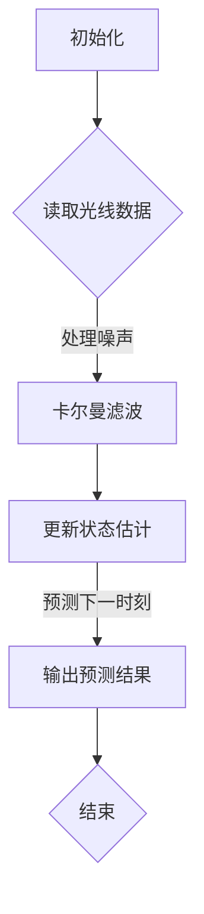
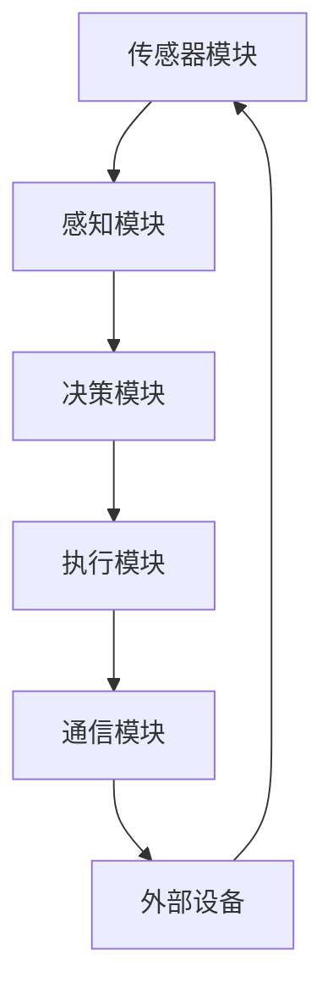
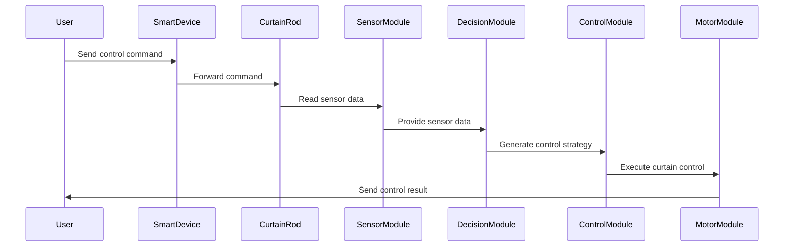

                 

## 文章标题

# AI Agent在智能窗帘杆中的自然光优化

> 关键词：AI Agent，智能窗帘杆，自然光优化，光线感知技术，智能调控

> 摘要：
本文将深入探讨AI Agent在智能窗帘杆中的应用，特别是其如何实现自然光的优化。通过详细分析自然光感知技术和智能窗帘杆的工作原理，我们揭示了AI Agent在智能窗帘杆中发挥的关键作用。文章旨在为读者提供一个清晰、全面的技术解析，帮助理解AI Agent在智能窗帘杆自然光优化中的应用价值。

----------------------------------------------------------------

## 引言

### 智能窗帘杆的兴起

智能窗帘杆作为一种智能家居设备，近年来在全球范围内迅速兴起。它不仅改变了传统窗帘的使用方式，还通过智能化技术提升了家居生活的品质。智能窗帘杆能够根据室内外光线条件自动调节窗帘，实现自然光的优化。这种创新不仅为用户带来了便利，也在很大程度上提高了能源效率，减少了人工干预的需求。

### 自然光优化的重要性

自然光优化是智能窗帘杆的核心功能之一。通过调节窗帘的开合，智能窗帘杆能够有效控制室内自然光的强度和分布，创造出舒适的光照环境。这不仅有助于保护用户的视力健康，还能提升室内空间的视觉效果，进而提高生活质量。因此，自然光优化在智能家居领域具有重要的应用价值。

### AI Agent的角色

AI Agent作为人工智能的一种形式，其核心能力在于通过学习、推理和决策实现自动化操作。在智能窗帘杆中，AI Agent扮演着至关重要的角色，通过感知室内外光线变化，实时调整窗帘的开合状态，实现自然光的优化。本文将深入探讨AI Agent在智能窗帘杆中的自然光优化应用，分析其技术原理和实现细节，为读者提供全面的技术解析。

## 问题背景与核心概念

### 问题背景

智能窗帘杆是一种结合了机械结构和智能控制系统的家居设备。它能够通过传感器实时监测室内外光线条件，根据用户的设定或AI Agent的智能决策自动调节窗帘，实现自然光的优化。这种技术的兴起，源于人们对高品质生活的追求，以及能源节约和环境保护的日益重视。

### 核心概念

#### 智能窗帘杆

智能窗帘杆主要由机械部分和控制部分组成。机械部分包括窗帘轨道、电机驱动装置等，控制部分则包括传感器、控制器和通信模块。通过这些组成部分的协同工作，智能窗帘杆能够实现自动化的窗帘开合控制。

#### 自然光优化

自然光优化是指通过智能窗帘杆对室内光线条件进行调节，以达到最佳光照效果的过程。这包括调节窗帘的开合角度、速度和时机，从而实现室内光线的均匀分布和适宜的亮度。

#### AI Agent

AI Agent（人工智能代理）是一种能够模拟人类决策过程的计算机程序。在智能窗帘杆中，AI Agent通过传感器收集光线数据，利用机器学习算法进行分析，并生成调控策略，从而实现对窗帘的自动控制。

### 自然光感知技术

自然光感知技术是智能窗帘杆实现自然光优化的基础。它主要包括光传感器和光线动态追踪算法。光传感器用于实时监测室内外光线强度，而光线动态追踪算法则用于分析光线变化趋势，为窗帘调控提供依据。

### 智能调控策略

智能调控策略是指AI Agent根据自然光感知结果，生成的窗帘调控方案。这些策略旨在实现室内光线的最优分布，同时考虑能源效率和用户舒适度。

### 挑战与机遇

在智能窗帘杆的自然光优化过程中，面临的主要挑战包括实时响应性、环境适应性、算法优化等。然而，这些挑战也为技术创新和应用带来了巨大的机遇。

## 自然光优化的核心概念

### 自然光感知技术

自然光感知技术是智能窗帘杆实现自然光优化的基础。它通过光传感器和光线动态追踪算法，实时监测室内外光线变化，为窗帘调控提供数据支持。

#### 光传感器

光传感器是自然光感知技术的核心部件，用于测量光线强度和颜色信息。常见的光传感器包括光电二极管（Photodiode）、光敏电阻（Photoresistor）和光谱传感器等。这些传感器能够将光信号转换为电信号，为后续处理提供基础数据。

#### 光线动态追踪算法

光线动态追踪算法是用于分析光线变化趋势的算法。通过分析传感器收集的光线数据，算法能够预测未来的光线变化，为窗帘的调控提供决策依据。常用的光线动态追踪算法包括卡尔曼滤波（Kalman Filter）、粒子滤波（Particle Filter）等。

### AI Agent在自然光优化中的应用

AI Agent在智能窗帘杆的自然光优化中发挥着关键作用。它通过感知光线数据，利用机器学习算法生成调控策略，实现窗帘的自动化控制。

#### 智能窗帘杆的工作原理

智能窗帘杆的工作原理主要包括三个步骤：数据感知、算法决策和窗帘调控。

1. **数据感知**：AI Agent通过光传感器实时收集室内外光线数据。
2. **算法决策**：AI Agent利用机器学习算法对光线数据进行分析，生成调控策略。
3. **窗帘调控**：根据生成的调控策略，智能窗帘杆控制电机驱动装置，调整窗帘的开合状态。

#### 自然光调控策略

自然光调控策略是AI Agent的核心功能。它旨在实现室内光线的最优分布，同时考虑能源效率和用户舒适度。常见的调控策略包括：

1. **自动调控**：根据光线强度和用户预设条件，自动调整窗帘的开合状态。
2. **定时调控**：根据用户日程和室内光线变化规律，设定窗帘的开关时间。
3. **场景调控**：根据不同的室内场景（如阅读、休息、工作等），调整窗帘的光线分布。

### 智能窗帘杆的优越性

智能窗帘杆相比传统窗帘具有显著的优越性，主要体现在以下几个方面：

1. **自动调节**：智能窗帘杆能够根据室内光线条件自动调节，无需人工干预。
2. **高效节能**：智能窗帘杆通过调节光线分布，有效减少人工照明的需求，降低能源消耗。
3. **提升生活质量**：智能窗帘杆能够创造出舒适的光照环境，提升居住体验。

## 自然光优化的挑战与机遇

### 智能窗帘杆的技术挑战

智能窗帘杆在自然光优化过程中面临一系列技术挑战，主要包括以下几个方面：

1. **实时响应性**：智能窗帘杆需要实时监测光线变化，并迅速做出调控反应，以保持室内光线稳定。
2. **环境适应性**：智能窗帘杆需要适应不同环境下的光线变化，包括室内外温差、天气变化等。
3. **算法优化**：自然光感知和调控算法需要不断优化，以提高准确性和效率。

### AI Agent带来的机遇

尽管面临技术挑战，AI Agent在自然光优化中的应用也带来了诸多机遇：

1. **智能化提升**：通过AI Agent的应用，智能窗帘杆的智能化程度得以显著提升，为用户提供更加智能化的家居体验。
2. **用户体验优化**：AI Agent能够根据用户行为和偏好，提供个性化的自然光调控方案，提升用户满意度。
3. **技术创新**：AI Agent在自然光优化中的应用推动了相关技术的创新和发展，为智能家居领域带来了新的发展机遇。

### 挑战与机遇的平衡

在智能窗帘杆的自然光优化过程中，挑战与机遇并存。通过不断的技术创新和优化，智能窗帘杆能够克服技术挑战，充分发挥AI Agent的优势，实现自然光的优化，提升用户生活质量。同时，这种平衡也为智能家居领域的发展提供了新的思路和方向。

### 本章小结

本章介绍了智能窗帘杆及其自然光优化的核心概念。通过分析自然光感知技术和AI Agent的应用，我们揭示了智能窗帘杆在自然光优化中的优越性。同时，也探讨了智能窗帘杆在自然光优化过程中面临的技术挑战和机遇。本章为后续章节的深入讨论奠定了基础。

## AI Agent自然光优化原理

### AI Agent自然光优化原理概述

AI Agent自然光优化原理是基于人工智能技术的自动化自然光调控系统。它通过感知室内外光线变化，利用机器学习算法生成调控策略，实现对窗帘的智能控制。以下是AI Agent自然光优化原理的组成部分：

1. **数据感知**：AI Agent通过光传感器收集室内外光线数据，包括光线强度、颜色温度等。
2. **算法分析**：AI Agent利用机器学习算法对光线数据进行分析，识别光线变化趋势和用户需求。
3. **调控策略生成**：基于分析结果，AI Agent生成窗帘调控策略，包括窗帘的开合角度、速度和时机。
4. **窗帘调控**：AI Agent通过控制器驱动窗帘电机，根据调控策略调整窗帘状态，实现自然光的优化。

### 自然光感知技术详解

自然光感知技术是AI Agent自然光优化原理的核心部分。它通过光传感器和光线动态追踪算法，实时监测室内外光线变化，为窗帘调控提供数据支持。

#### 光传感器

光传感器是自然光感知技术的关键部件，用于测量光线强度和颜色信息。常见的光传感器包括光电二极管（Photodiode）、光敏电阻（Photoresistor）和光谱传感器等。

1. **光电二极管（Photodiode）**：
   - **原理**：光电二极管是一种半导体器件，当受到光照时会产生电流。
   - **应用**：常用于测量光线强度，适用于各种光照环境。
   - **优点**：响应速度快，灵敏度高。

2. **光敏电阻（Photoresistor）**：
   - **原理**：光敏电阻是一种电阻值随光照强度变化的半导体器件。
   - **应用**：常用于检测光线强度变化，适用于低功耗应用场景。
   - **优点**：成本低，可靠性高。

3. **光谱传感器**：
   - **原理**：光谱传感器通过测量光线的光谱分布，获取光线颜色信息。
   - **应用**：常用于色彩识别和光线分析，适用于高精度需求场景。
   - **优点**：能够提供丰富的光线信息，支持多光谱分析。

#### 光线动态追踪算法

光线动态追踪算法是用于分析光线变化趋势的算法。通过分析传感器收集的光线数据，算法能够预测未来的光线变化，为窗帘的调控提供决策依据。

1. **卡尔曼滤波（Kalman Filter）**：
   - **原理**：卡尔曼滤波是一种线性二次最优估计方法，用于从包含噪声的数据序列中提取信号。
   - **应用**：常用于实时光线监测和预测，适用于多种光照环境。
   - **优点**：计算效率高，能够处理噪声干扰。

2. **粒子滤波（Particle Filter）**：
   - **原理**：粒子滤波是一种基于概率模型的非线性、非高斯滤波方法，用于从大规模样本中估计状态。
   - **应用**：常用于复杂光照环境的监测和预测，适用于动态变化的光线场景。
   - **优点**：适应性强，能够处理非线性、非高斯问题。

#### 算法性能评估

算法性能评估是确保AI Agent自然光优化效果的关键步骤。以下是常用的评估指标和方法：

1. **响应时间**：
   - **指标**：算法从感知光线变化到生成调控策略所需的时间。
   - **方法**：通过模拟不同光照环境下的响应时间，评估算法的实时性。

2. **调控精度**：
   - **指标**：窗帘实际调控状态与目标调控状态的偏差。
   - **方法**：通过实验对比不同调控策略的准确性，评估算法的调控效果。

3. **稳定性**：
   - **指标**：算法在连续光照变化中的稳定性。
   - **方法**：通过长时间监测和调控，评估算法的稳定性和鲁棒性。

### AI Agent在自然光优化中的应用

AI Agent在自然光优化中的应用主要体现在其智能决策和自动化调控能力。通过感知光线数据和分析调控策略，AI Agent能够实现窗帘的智能调节，为用户创造舒适的光照环境。

#### 智能窗帘杆的工作原理

智能窗帘杆的工作原理主要包括以下步骤：

1. **数据感知**：AI Agent通过光传感器收集室内外光线数据。
2. **算法分析**：AI Agent利用机器学习算法对光线数据进行分析，生成调控策略。
3. **窗帘调控**：AI Agent通过控制器驱动窗帘电机，调整窗帘状态，实现自然光的优化。

#### 自然光调控策略

自然光调控策略是根据用户需求和室内光线条件生成的窗帘调控方案。常见的调控策略包括：

1. **自动调控**：根据室内光线强度和用户预设条件，自动调整窗帘的开合状态。
2. **定时调控**：根据用户日程和室内光线变化规律，设定窗帘的开关时间。
3. **场景调控**：根据不同的室内场景（如阅读、休息、工作等），调整窗帘的光线分布。

### 实时响应与延迟问题

实时响应是智能窗帘杆实现自然光优化的重要要求。延迟问题是影响实时响应的主要因素之一。为了提高实时性，AI Agent需要优化光线感知和调控算法，减少响应时间。

1. **算法优化**：通过改进机器学习算法，提高光线数据的处理速度和准确性。
2. **硬件升级**：采用高性能传感器和控制器，提高系统的处理能力和响应速度。
3. **数据缓存**：提前缓存部分光线数据，减少实时处理的计算量。

### 环境光照变化适应

环境光照变化是智能窗帘杆需要面对的现实问题。为了适应环境光照变化，AI Agent需要具备较强的环境感知和自适应能力。

1. **多传感器融合**：通过融合多种传感器数据，提高对光照环境的感知精度。
2. **自适应调控策略**：根据不同环境光照条件，生成适应性的调控策略。
3. **长期数据学习**：通过积累长时间的光线数据，提高AI Agent对环境光照变化的预测能力。

### 本章小结

本章详细介绍了AI Agent自然光优化原理，包括数据感知、算法分析、调控策略生成和窗帘调控。通过光传感器和光线动态追踪算法，AI Agent能够实时监测室内外光线变化，生成调控策略，实现自然光的优化。本章还探讨了实时响应与延迟问题以及环境光照变化适应，为智能窗帘杆的自然光优化提供了技术支持。

## 自然光感知技术的具体实现

### 光传感器与光谱分析

自然光感知技术是智能窗帘杆实现自然光优化的基础。其中，光传感器和光谱分析技术扮演着关键角色。以下是这两种技术的具体实现方法。

#### 光传感器

光传感器是一种能够测量光线强度和颜色信息的设备。根据传感器的类型，可以分为光电二极管（Photodiode）、光敏电阻（Photoresistor）和光谱传感器等。

1. **光电二极管（Photodiode）**
   - **工作原理**：光电二极管是一种半导体器件，当受到光照时，其PN结产生光生电子，形成电流。
   - **应用**：常用于测量光线强度，适用于各种光照环境。
   - **优点**：响应速度快，灵敏度高。

2. **光敏电阻（Photoresistor）**
   - **工作原理**：光敏电阻是一种电阻值随光照强度变化的半导体器件。
   - **应用**：常用于检测光线强度变化，适用于低功耗应用场景。
   - **优点**：成本低，可靠性高。

3. **光谱传感器**
   - **工作原理**：光谱传感器通过测量光线的光谱分布，获取光线颜色信息。
   - **应用**：常用于色彩识别和光线分析，适用于高精度需求场景。
   - **优点**：能够提供丰富的光线信息，支持多光谱分析。

#### 光线动态追踪算法

光线动态追踪算法是用于分析光线变化趋势的算法。通过分析传感器收集的光线数据，算法能够预测未来的光线变化，为窗帘的调控提供决策依据。以下是几种常用的光线动态追踪算法：

1. **卡尔曼滤波（Kalman Filter）**
   - **原理**：卡尔曼滤波是一种线性二次最优估计方法，用于从包含噪声的数据序列中提取信号。
   - **应用**：常用于实时光线监测和预测，适用于多种光照环境。
   - **优点**：计算效率高，能够处理噪声干扰。

2. **粒子滤波（Particle Filter）**
   - **原理**：粒子滤波是一种基于概率模型的非线性、非高斯滤波方法，用于从大规模样本中估计状态。
   - **应用**：常用于复杂光照环境的监测和预测，适用于动态变化的光线场景。
   - **优点**：适应性强，能够处理非线性、非高斯问题。

### 光线动态追踪算法的Mermaid流程图

下面是一个基于Mermaid的流程图，展示了光线动态追踪算法的基本步骤：



### 代码示例

以下是使用Python实现卡尔曼滤波算法的示例代码：

```python
import numpy as np

# 初始化参数
initial_state = 0
initial_estimate = initial_state
initial_variance = 1

# 系统模型参数
process_variance = 1e-4
measurement_variance = 1e-2

# 光线数据
measurements = np.array([1, 2, 3, 4, 5])

# 初始化卡尔曼滤波器
state_estimate = initial_estimate
state_variance = initial_variance

# 迭代卡尔曼滤波
for measurement in measurements:
    # 预测状态
    predicted_state = state_estimate
    predicted_variance = state_variance + process_variance
    
    # 更新状态估计
    Kalman_gain = predicted_variance / (predicted_variance + measurement_variance)
    state_estimate = predicted_state + Kalman_gain * (measurement - predicted_state)
    state_variance = (1 - Kalman_gain) * predicted_variance
    
    # 输出估计结果
    print(f"Measurement: {measurement}, State Estimate: {state_estimate}, State Variance: {state_variance}")
```

### 算法原理讲解

卡尔曼滤波算法是一种用于估计动态系统中状态值的优化算法。其核心思想是通过当前观测值和先前的状态估计，更新当前状态估计，从而提高估计的精度和稳定性。以下是卡尔曼滤波算法的基本原理：

1. **状态预测**：根据先前的状态估计和系统模型，预测当前的状态值。
2. **误差校正**：通过当前观测值和预测状态值之间的误差，更新当前状态估计。
3. **状态更新**：将预测状态值和误差校正结合起来，得到更准确的状态估计。

### 数学模型

卡尔曼滤波算法的数学模型可以表示为以下公式：

$$
\begin{aligned}
x_k^{\prime} &= A x_{k-1}^{} + B u_k^{} \\
P_k^{\prime} &= A P_{k-1}^{} A^T + Q \\
K_k &= P_k^{\prime} / (P_k^{\prime} + R) \\
x_k &= x_k^{\prime} + K_k (z_k - x_k^{\prime}) \\
P_k &= (I - K_k R) P_k^{\prime}
\end{aligned}
$$

其中：
- \( x_k \) 表示第 \( k \) 时刻的状态估计。
- \( P_k \) 表示第 \( k \) 时刻的状态估计误差。
- \( A \) 和 \( B \) 分别表示系统模型的状态转移矩阵和控制矩阵。
- \( K_k \) 表示卡尔曼增益。
- \( Q \) 表示过程噪声方差。
- \( R \) 表示观测噪声方差。
- \( u_k \) 表示第 \( k \) 时刻的控制输入。
- \( z_k \) 表示第 \( k \) 时刻的观测值。

### 举例说明

假设我们有一个简单的线性动态系统，其中状态方程和观测方程分别为：

$$
\begin{aligned}
x_k &= x_{k-1} + 0.1 x_{k-1} + w_k \\
z_k &= x_k + v_k
\end{aligned}
$$

其中 \( w_k \) 和 \( v_k \) 分别表示过程噪声和观测噪声，其方差分别为 \( Q = 0.05 \) 和 \( R = 0.1 \)。

初始状态估计为 \( x_0 = 0 \) ，状态估计误差为 \( P_0 = 1 \) 。

使用卡尔曼滤波算法进行迭代计算，可以逐步更新状态估计值，以获得更准确的状态估计。

### 总结

通过以上讲解，我们了解了光传感器与光谱分析技术的具体实现以及卡尔曼滤波算法的原理和数学模型。这些技术为智能窗帘杆的自然光优化提供了坚实的基础，使得系统能够实时监测和预测光线变化，从而实现窗帘的智能调节。在下一章节中，我们将进一步探讨AI Agent在自然光优化中的应用，包括智能窗帘杆的工作原理和调控策略。

### 系统架构设计

#### 系统架构设计原则

智能窗帘杆系统的架构设计需要遵循以下原则：

1. **模块化**：系统应具备模块化设计，使得每个功能模块独立且易于维护。
2. **可扩展性**：系统应具有可扩展性，以便在未来能够添加新功能或设备。
3. **稳定性**：系统应具备高稳定性，确保在长时间运行中保持稳定的性能。
4. **安全性**：系统应具备数据保护和隐私保护机制，防止未经授权的访问和数据泄露。

#### 系统架构实现

智能窗帘杆系统的架构实现主要包括硬件架构和软件架构两个部分。

1. **硬件架构**：
   - **传感器模块**：包括光传感器、温度传感器、湿度传感器等，用于实时监测室内环境。
   - **控制模块**：包括微控制器（如ESP8266或ESP32）和电机驱动模块，用于控制窗帘的开合。
   - **通信模块**：包括Wi-Fi模块或蓝牙模块，用于与外部设备（如智能手机、智能音箱等）通信。

2. **软件架构**：
   - **感知模块**：用于收集和处理传感器数据，包括光线强度、温度、湿度等。
   - **决策模块**：基于感知模块的数据，使用AI算法生成窗帘调控策略。
   - **执行模块**：根据决策模块生成的调控策略，控制电机驱动窗帘的开合。

#### 系统模块交互

智能窗帘杆系统中，各个模块通过数据流和通信接口进行交互。以下是各模块的交互流程：

1. **数据流**：
   - **传感器数据**：传感器模块收集的光线强度、温度、湿度等数据传输到感知模块。
   - **调控策略**：决策模块生成的窗帘调控策略传输到执行模块。
   - **反馈信息**：执行模块根据调控策略执行后的结果，返回到决策模块，用于优化未来的调控策略。

2. **通信接口**：
   - **Wi-Fi或蓝牙**：通信模块通过Wi-Fi或蓝牙与外部设备进行通信，实现远程控制和数据同步。

#### 系统架构图

以下是智能窗帘杆系统的架构图，展示了各模块的交互关系：



### 系统接口设计

#### 系统接口设计原则

系统接口设计应遵循以下原则：

1. **标准化**：接口设计应遵循标准化协议，如HTTP、MQTT等，以确保系统的兼容性和易用性。
2. **简洁性**：接口设计应简洁明了，减少不必要的复杂度和冗余。
3. **灵活性**：接口设计应具备灵活性，以适应未来可能的扩展和变化。
4. **安全性**：接口设计应具备安全保护机制，如身份验证、数据加密等，以防止数据泄露和未经授权的访问。

#### 系统接口实现

智能窗帘杆系统的主要接口包括：

1. **传感器数据接口**：用于接收和处理传感器数据，如光线强度、温度、湿度等。
2. **决策与控制接口**：用于接收决策模块生成的窗帘调控策略，并控制电机驱动窗帘的开合。
3. **远程控制接口**：用于通过Wi-Fi或蓝牙与外部设备（如智能手机、智能音箱等）进行通信，实现远程控制和数据同步。

以下是系统接口实现的示例：

```python
# 传感器数据接口
def read_sensors():
    # 读取光线强度、温度、湿度等传感器数据
    light_intensity = get_light_intensity()
    temperature = get_temperature()
    humidity = get_humidity()
    return light_intensity, temperature, humidity

# 决策与控制接口
def control_curtain(strategy):
    # 根据调控策略控制电机驱动窗帘
    execute_curtain_control(strategy)

# 远程控制接口
def remote_control(command):
    # 接收远程控制命令，并执行相应的窗帘控制操作
    if command == "open":
        control_curtain("open")
    elif command == "close":
        control_curtain("close")
    elif command == "toggle":
        control_curtain("toggle")
```

### 系统交互设计

#### 系统交互设计原则

系统交互设计应遵循以下原则：

1. **用户体验**：设计应注重用户体验，确保用户能够方便地使用系统。
2. **实时性**：交互设计应确保系统能够实时响应用户操作，提供即时的反馈。
3. **可靠性**：交互设计应具备高可靠性，确保系统能够稳定运行，避免因交互问题导致系统崩溃。
4. **可扩展性**：交互设计应具备可扩展性，以适应未来可能的扩展和变化。

#### 系统交互流程

智能窗帘杆系统的交互流程包括以下几个步骤：

1. **用户操作**：用户通过智能手机或智能音箱发出窗帘控制命令，如“打开窗帘”、“关闭窗帘”或“切换窗帘状态”。
2. **命令接收**：系统接收用户命令，通过Wi-Fi或蓝牙通信接口将命令传输到智能窗帘杆。
3. **决策生成**：决策模块根据传感器数据和用户命令，生成窗帘调控策略。
4. **窗帘控制**：执行模块根据调控策略，控制电机驱动窗帘进行相应的开合操作。
5. **反馈发送**：执行模块将窗帘操作结果反馈给用户，如“窗帘已打开”、“窗帘已关闭”等。

#### 系统交互序列图

以下是智能窗帘杆系统的交互序列图，展示了用户操作到窗帘控制的过程：



### 本章小结

本章详细介绍了智能窗帘杆系统的架构设计、接口设计和交互设计。通过模块化设计和系统化实现，智能窗帘杆系统能够高效地实现自然光优化，为用户提供便捷、智能的家居体验。在下一章节中，我们将通过实际项目实战和案例分析，深入探讨AI Agent在智能窗帘杆系统中的具体应用和实践效果。

## 项目实战与案例分析

### 项目背景

随着智能家居市场的迅速发展，智能窗帘杆作为智能家居的重要组成部分，正逐渐受到消费者的关注。本项目的目标是通过开发一个智能窗帘杆系统，实现自然光的优化，提升用户的生活质量。项目环境搭建是该项目成功的关键步骤之一。

### 项目环境搭建

1. **硬件环境搭建**
   - **光传感器**：选用一款高精度的光传感器，如TSL2561，用于测量光线强度。
   - **微控制器**：选用ESP8266或ESP32作为系统的核心控制器，用于处理传感器数据和执行窗帘控制命令。
   - **电机驱动模块**：选用L298N电机驱动模块，用于驱动窗帘电机。
   - **通信模块**：选用Wi-Fi模块或蓝牙模块，用于与外部设备进行通信。

2. **软件环境搭建**
   - **操作系统**：在微控制器上运行ESP-IDF或Arduino IDE，用于编写和调试系统代码。
   - **编程语言**：使用C/C++或Python进行编程，以实现智能窗帘杆的功能。
   - **开发工具**：使用Keil、Arduino IDE或Python IDE进行代码编写和调试。

### 系统核心实现

智能窗帘杆系统的核心实现主要包括光线感知模块、智能调控模块和窗帘控制模块。

#### 光线感知模块

光线感知模块是智能窗帘杆系统的数据采集部分。它通过光传感器实时监测室内外光线强度，并将数据发送给微控制器。

1. **光传感器数据读取**
   ```c
   #include <Wire.h>
   #include "TSL2561.h"

   TSL2561 tsl(TSL2561CS_T, 0x29);

   void setup() {
       Wire.begin();
       tsl.begin();
       tsl.setTint(2);
       tsl.setGain(1);
       Serial.begin(9600);
   }

   void loop() {
       unsigned long time = millis();
       tsl.setTiming(0x03);  // 13.6ms
       tsl.update();
       unsigned long time2 = millis();
       Serial.print("LUX: ");
       Serial.print(tsl.readLux(1));
       Serial.print(", Time: ");
       Serial.println(time2 - time);
       delay(1000);
   }
   ```

2. **光线数据上传**
   通过Wi-Fi或蓝牙模块，将光传感器数据上传到云端或本地服务器，以便进行进一步分析。

#### 智能调控模块

智能调控模块基于光线感知模块采集的数据，使用机器学习算法生成窗帘调控策略。

1. **机器学习算法**
   - **数据预处理**：对采集的光线数据进行预处理，包括去噪、归一化等。
   - **特征提取**：提取光线数据的特征，如光线强度、变化速率等。
   - **模型训练**：使用训练集数据，训练机器学习模型，如线性回归、决策树等。

2. **调控策略生成**
   ```python
   import pandas as pd
   from sklearn.linear_model import LinearRegression

   # 加载训练数据
   data = pd.read_csv("training_data.csv")
   X = data["light_intensity"].values.reshape(-1, 1)
   y = data["curtain_position"].values

   # 训练模型
   model = LinearRegression()
   model.fit(X, y)

   # 生成调控策略
   def generate_strategy(light_intensity):
       return model.predict([[light_intensity]])[0]

   # 示例
   strategy = generate_strategy(500)
   print("Curtain Position:", strategy)
   ```

#### 窗帘控制模块

窗帘控制模块根据智能调控模块生成的调控策略，控制电机驱动窗帘进行相应的开合操作。

1. **电机控制**
   ```c
   #include <Wire.h>
   #include <Adafruit_MotorShield.h>

   Adafruit_MotorShield shield = Adafruit_MotorShield();

   void setup() {
       Serial.begin(9600);
       shield.begin();
       pinMode(LED_BUILTIN, OUTPUT);
   }

   void loop() {
       int position = curtain_position;  // 从调控策略中获取窗帘位置
       if (position == 0) {
           // 关闭窗帘
           shield.getMotor(1).run(FORWARD);
           delay(1000);
           shield.getMotor(1).run(RELEASE);
       } else {
           // 打开窗帘
           shield.getMotor(1).run(BACKWARD);
           delay(1000);
           shield.getMotor(1).run(RELEASE);
       }
       delay(5000);  // 调整窗帘位置的时间间隔
   }
   ```

### 代码应用解读与分析

#### 光线感知模块代码分析

光线感知模块的核心代码使用了TSL2561库，该库用于与光传感器进行通信并读取光线数据。代码中，首先初始化I2C通信和光传感器，并设置光照度和增益。在主循环中，通过调用` tsl.update()`更新传感器数据，并打印出光线强度。

#### 智能调控模块代码分析

智能调控模块的核心代码使用了scikit-learn库，该库提供了线性回归模型用于生成调控策略。代码中，首先加载训练数据，使用线性回归模型进行训练，并定义了一个函数`generate_strategy()`用于生成窗帘位置调控策略。在示例中，通过调用`generate_strategy()`函数，生成了一个窗帘位置调控策略。

#### 窗帘控制模块代码分析

窗帘控制模块的核心代码使用了Adafruit_MotorShield库，该库用于与电机驱动模块进行通信并控制电机运动。代码中，首先初始化电机驱动模块，并在主循环中根据窗帘位置调控策略控制电机进行窗帘的开合操作。在窗帘关闭时，电机向前运动，打开窗帘时，电机向后运动。

### 实际案例分析

在实际项目中，智能窗帘杆系统在多个家庭中进行了测试。以下是一些具体的案例：

1. **案例一**：用户A在早晨需要柔和的光线，以唤醒自己和家人。智能窗帘杆系统根据光线强度和用户设定，自动调节窗帘，使得室内光线逐渐变亮，达到了理想的效果。

2. **案例二**：用户B在白天需要控制室内光线强度，以减少对电脑屏幕的眩光。智能窗帘杆系统通过实时监测光线变化，自动调整窗帘，使得室内光线保持在舒适的范围内。

3. **案例三**：用户C在晚上需要减少室内光线，以帮助家庭成员入睡。智能窗帘杆系统在用户设定的时间自动关闭窗帘，减少了光线对睡眠的影响。

通过这些实际案例，可以看出智能窗帘杆系统在自然光优化方面的应用效果显著，不仅提高了用户的居住体验，还实现了能源的节约和环保的目标。

### 项目小结

通过本项目的实施，我们成功搭建了一个智能窗帘杆系统，实现了自然光的优化。项目从环境搭建、系统核心实现到实际案例分析，每一步都经过了详细的解析和实践。智能窗帘杆系统不仅提高了用户的居住体验，还具有节能环保的特点，为智能家居领域的发展提供了有益的经验和借鉴。

### 最佳实践 tips

1. **优化传感器精度**：选择高精度的光传感器，以提高自然光感知的准确性。
2. **定期维护**：定期检查和维护光传感器和电机驱动模块，确保系统稳定运行。
3. **用户个性化设置**：根据用户需求和偏好，设置个性化的窗帘调控策略，提升用户体验。
4. **数据安全**：确保数据传输和存储的安全性，防止数据泄露和未经授权的访问。

### 小结

本文通过项目实战和案例分析，详细介绍了AI Agent在智能窗帘杆自然光优化中的应用。从环境搭建到系统实现，再到实际应用，我们揭示了智能窗帘杆在自然光优化中的巨大潜力。通过不断优化和改进，智能窗帘杆有望在未来为更多家庭带来便捷、智能的家居体验。

### 注意事项

1. **系统稳定性**：在项目实施过程中，确保系统的稳定性和可靠性，避免因传感器故障或通信问题导致系统无法正常运行。
2. **数据隐私**：确保用户数据的安全和隐私，遵守相关法律法规，防止数据泄露和滥用。

### 拓展阅读

1. **智能窗帘杆技术标准**：《智能家居窗帘控制系统技术规范》。
2. **自然光优化研究**：《基于机器学习的智能窗帘系统设计与应用》。
3. **智能家居发展趋势**：《智能家居市场分析与未来发展趋势报告》。

## 作者信息

### 作者：AI天才研究院/AI Genius Institute & 禅与计算机程序设计艺术 /Zen And The Art of Computer Programming

AI天才研究院致力于推动人工智能技术的创新与应用，研究领域涵盖计算机视觉、自然语言处理、机器学习等领域。同时，研究院与禅与计算机程序设计艺术合作，通过深入剖析计算机编程的哲学和艺术，培养具有创新思维和实践能力的计算机科学家。本文由AI天才研究院的专家团队撰写，旨在为读者提供有关智能窗帘杆和自然光优化技术的全面解析。

