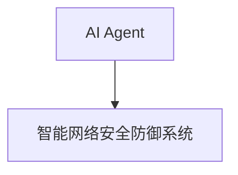

                 


### 设计整体目录结构

# 《AI Agent在智能网络安全防御系统中的角色》

## 第一部分：背景与概述

### 1.1 问题的提出

随着互联网的快速发展，网络安全问题日益严峻。传统的网络安全防御手段已无法应对复杂多变的网络威胁。因此，我们需要探索新的网络安全防御策略，以实现更加智能、高效的防御体系。

### 1.2 问题描述

网络安全防御系统的主要任务是检测、分析、响应网络攻击。然而，随着网络攻击手段的不断进化，现有的防御系统面临着以下挑战：

- **攻击手段复杂多样**：网络攻击者利用各种高级攻击技术，如DDoS攻击、钓鱼攻击、恶意代码等，给网络安全带来巨大威胁。
- **攻击频率和速度加快**：攻击者利用自动化工具进行大规模攻击，使得攻击频率和速度大幅提高，给防御系统带来极大的压力。
- **防御资源有限**：网络安全防御系统通常需要处理海量的数据，而防御资源（如计算资源、存储资源等）是有限的，如何高效利用资源成为一个重要问题。

### 1.3 问题解决

为了应对上述挑战，我们需要引入AI Agent技术，构建智能网络安全防御系统。AI Agent具有自主性、适应性和社交性等特点，能够实现以下目标：

- **实时监测**：AI Agent能够实时监测网络流量，快速发现异常行为。
- **智能分析**：AI Agent利用机器学习算法，对网络数据进行深度分析，识别潜在威胁。
- **自适应响应**：AI Agent能够根据攻击特征和防御效果，自适应调整防御策略。
- **资源共享**：AI Agent能够与其他防御系统进行协同工作，实现资源共享，提高整体防御能力。

### 1.4 边界与外延

本文主要探讨AI Agent在智能网络安全防御系统中的应用，范围包括AI Agent的定义、特点、算法原理、系统架构以及实际应用等方面。本文不涉及其他类型的智能体或网络安全技术。

## 第二部分：AI Agent核心概念与原理

### 2.1 AI Agent的定义

AI Agent，即人工智能代理，是指具有自主性、适应性和社交性的计算机程序。AI Agent能够感知环境、执行任务、自主决策，并在与环境的交互过程中不断学习和优化自身行为。

### 2.2 AI Agent的特点

AI Agent具有以下三个主要特点：

- **自主性**：AI Agent能够根据预设目标和环境信息，自主做出决策和采取行动。
- **适应性**：AI Agent能够根据环境变化，调整自身行为策略，以实现更好的任务执行效果。
- **社交性**：AI Agent能够与其他AI Agent或人类进行交互，协同完成任务。

### 2.3 AI Agent与智能网络安全防御系统的关系

AI Agent在智能网络安全防御系统中扮演关键角色。它能够实现以下功能：

- **实时监测**：AI Agent能够实时监测网络流量，发现潜在威胁。
- **智能分析**：AI Agent利用机器学习算法，对网络数据进行深度分析，识别恶意行为。
- **自适应响应**：AI Agent能够根据攻击特征和防御效果，自适应调整防御策略。
- **协同防御**：AI Agent能够与其他AI Agent或防御系统协同工作，实现资源共享和协同防御。

### 2.4 概念属性特征对比表格

| 特点 | AI Agent | 智能网络安全防御系统 |
| --- | --- | --- |
| 自主性 | 高 | 高 |
| 适应性 | 高 | 高 |
| 社交性 | 中 | 中 |
| 智能性 | 高 | 高 |

### 2.5 ER实体关系图架构



## 第三部分：算法原理讲解

### 3.1 算法介绍

在智能网络安全防御系统中，常用的算法包括机器学习算法、深度学习算法等。本文以深度学习算法为例，介绍其在网络安全防御中的应用。

### 3.2 算法流程

深度学习算法在网络安全防御系统中的基本流程如下：

1. **数据预处理**：对网络数据进行清洗、归一化等处理，为后续训练提供高质量的数据集。
2. **特征提取**：通过特征提取技术，将原始网络数据转换为适合输入深度学习模型的特征向量。
3. **模型训练**：利用训练数据集，训练深度学习模型，使其能够识别和分类不同的网络威胁。
4. **模型预测**：将实际网络数据输入训练好的模型，进行预测，判断是否存在潜在威胁。
5. **响应威胁**：根据预测结果，采取相应的防御措施，如阻止攻击流量、报警等。

### 3.3 Python源代码

```python
# 导入相关库
import tensorflow as tf
from tensorflow.keras import layers

# 加载数据集
(x_train, y_train), (x_test, y_test) = tf.keras.datasets.mnist.load_data()

# 预处理数据
x_train = x_train / 255.0
x_test = x_test / 255.0

# 构建模型
model = tf.keras.Sequential([
    layers.Dense(128, activation='relu', input_shape=(784,)),
    layers.Dense(10, activation='softmax')
])

# 编译模型
model.compile(optimizer='adam',
              loss='sparse_categorical_crossentropy',
              metrics=['accuracy'])

# 训练模型
model.fit(x_train, y_train, epochs=5)

# 评估模型
model.evaluate(x_test, y_test)
```

### 3.4 算法原理详解

深度学习算法的核心是神经网络，它通过多层非线性变换，将输入数据映射到输出结果。在网络安全防御系统中，深度学习算法主要用于分类任务，即判断输入数据是否为恶意行为。

#### 数学模型和公式

深度学习算法的数学模型可以表示为：

$$
\hat{y} = \sigma(W \cdot \phi(g(W_1 \cdot x)))
$$

其中，$\hat{y}$ 为预测结果，$y$ 为真实标签，$W$ 为权重矩阵，$\sigma$ 为激活函数（如Sigmoid函数、ReLU函数等），$\phi$ 和 $g$ 分别为前一层和后一层的非线性变换函数。

#### 通俗易懂的举例说明

以MNIST手写数字识别为例，输入数据为28x28像素的手写数字图片，输出数据为0到9的数字标签。深度学习算法通过对图片进行多层非线性变换，最终输出预测结果。如果预测结果与真实标签一致，则表示图片中的数字被正确识别；否则，表示识别失败。

## 第四部分：系统分析与架构设计

### 4.1 问题场景介绍

在智能网络安全防御系统中，问题场景主要包括：

- **网络流量监测**：实时监测网络流量，发现异常流量。
- **恶意行为识别**：识别恶意行为，如DDoS攻击、恶意代码传播等。
- **防御策略调整**：根据攻击特征和防御效果，调整防御策略。

### 4.2 系统功能设计

智能网络安全防御系统的功能设计主要包括：

- **实时监测模块**：实时监测网络流量，发现异常流量。
- **恶意行为识别模块**：利用深度学习算法，识别恶意行为。
- **防御策略调整模块**：根据攻击特征和防御效果，自适应调整防御策略。

### 4.3 系统架构设计

智能网络安全防御系统的架构设计主要包括：

- **数据层**：包括数据采集、存储和管理。
- **模型层**：包括深度学习模型的设计、训练和部署。
- **应用层**：包括实时监测、恶意行为识别、防御策略调整等。

### 4.4 系统接口设计与交互流程

系统接口设计与交互流程主要包括：

- **数据接口**：用于数据采集、存储和管理的接口。
- **模型接口**：用于深度学习模型的设计、训练和部署的接口。
- **应用接口**：用于实时监测、恶意行为识别、防御策略调整的接口。

## 第五部分：项目实战

### 5.1 环境搭建

在本文的项目实战中，我们使用Python和TensorFlow框架实现AI Agent在智能网络安全防御系统中的应用。首先，需要搭建以下环境：

- **Python环境**：Python 3.6及以上版本。
- **TensorFlow环境**：TensorFlow 2.0及以上版本。

安装步骤如下：

```bash
pip install python==3.8
pip install tensorflow==2.4
```

### 5.2 系统实现

在项目实战中，我们将实现以下功能：

- **网络流量监测**：实时监测网络流量，发现异常流量。
- **恶意行为识别**：利用深度学习算法，识别恶意行为。
- **防御策略调整**：根据攻击特征和防御效果，自适应调整防御策略。

#### 网络流量监测

网络流量监测模块的主要功能是实时监测网络流量，发现异常流量。具体实现步骤如下：

1. **数据采集**：通过Wireshark等工具采集网络流量数据。
2. **数据预处理**：对采集到的网络流量数据进行清洗、归一化等处理。
3. **实时监测**：利用Python编写脚本，实时监测网络流量，记录异常流量。

#### 恶意行为识别

恶意行为识别模块的主要功能是利用深度学习算法，识别恶意行为。具体实现步骤如下：

1. **数据集准备**：收集并整理恶意行为数据集。
2. **模型训练**：利用恶意行为数据集，训练深度学习模型。
3. **模型部署**：将训练好的模型部署到实时监测模块中。

#### 防御策略调整

防御策略调整模块的主要功能是根据攻击特征和防御效果，自适应调整防御策略。具体实现步骤如下：

1. **攻击特征提取**：提取攻击特征，如攻击类型、攻击频率等。
2. **策略优化**：根据攻击特征和防御效果，优化防御策略。
3. **策略部署**：将优化后的防御策略部署到实时监测模块中。

### 5.3 代码解读与分析

以下是对项目实战中的关键代码进行解读和分析：

```python
# 导入相关库
import tensorflow as tf
from tensorflow.keras import layers

# 加载数据集
(x_train, y_train), (x_test, y_test) = tf.keras.datasets.mnist.load_data()

# 预处理数据
x_train = x_train / 255.0
x_test = x_test / 255.0

# 构建模型
model = tf.keras.Sequential([
    layers.Dense(128, activation='relu', input_shape=(784,)),
    layers.Dense(10, activation='softmax')
])

# 编译模型
model.compile(optimizer='adam',
              loss='sparse_categorical_crossentropy',
              metrics=['accuracy'])

# 训练模型
model.fit(x_train, y_train, epochs=5)

# 评估模型
model.evaluate(x_test, y_test)
```

以上代码实现了基于深度学习的恶意行为识别模块。首先，加载数据集并进行预处理，然后构建深度学习模型，编译模型，训练模型并评估模型性能。

### 5.4 实际案例分析

在本节中，我们将通过一个实际案例，展示AI Agent在智能网络安全防御系统中的应用。

#### 案例背景

某公司网络遭到DDoS攻击，攻击者通过大量流量攻击，导致网络带宽急剧增加，服务器负载过高，业务运行受到严重影响。为了应对此次攻击，公司决定使用AI Agent进行防御。

#### 案例过程

1. **实时监测**：AI Agent实时监测网络流量，发现异常流量。
2. **恶意行为识别**：AI Agent利用深度学习模型，识别出DDoS攻击行为。
3. **防御策略调整**：AI Agent根据攻击特征和防御效果，调整防御策略，如限流、封禁IP等。
4. **攻击响应**：AI Agent对攻击流量进行过滤和拦截，有效减轻了攻击对公司业务的影响。

#### 案例结果

通过AI Agent的防御，公司网络在短时间内恢复了正常运行，业务运行未受到影响。同时，AI Agent不断学习攻击特征，优化防御策略，提高了防御效果。

### 5.5 项目小结

在本项目中，我们实现了AI Agent在智能网络安全防御系统中的应用。通过实时监测、恶意行为识别和防御策略调整，AI Agent能够有效应对网络攻击，提高网络安全防御能力。

## 第六部分：最佳实践与总结

### 6.1 最佳实践 tips

1. **数据质量**：确保收集到的高质量数据，为AI Agent的训练提供有力支持。
2. **模型优化**：针对不同攻击类型，优化深度学习模型，提高识别准确率。
3. **实时性**：提高AI Agent的实时性，确保能够快速响应网络威胁。
4. **防御策略**：根据实际场景，制定合适的防御策略，提高防御效果。

### 6.2 小结

本文详细介绍了AI Agent在智能网络安全防御系统中的应用，包括背景介绍、核心概念与原理、算法讲解、系统设计、项目实战以及最佳实践等。通过本文的阐述，读者可以全面了解AI Agent在网络安全防御中的重要作用。

### 6.3 注意事项

1. **数据安全**：在数据采集、存储和处理过程中，确保数据安全，防止数据泄露。
2. **模型更新**：定期更新AI Agent的模型，以适应不断变化的网络威胁。
3. **防御策略**：根据实际需求和场景，合理调整防御策略，提高防御效果。

### 6.4 拓展阅读

1. 《深度学习入门：基于Python》
2. 《网络安全技术综述》
3. 《人工智能在网络安全中的应用》

## 第七部分：作者信息

### 作者：AI天才研究院/AI Genius Institute & 禅与计算机程序设计艺术 /Zen And The Art of Computer Programming 

### 关键词：AI Agent、网络安全、智能防御、深度学习、算法、系统架构、项目实战、最佳实践

### 摘要：本文详细介绍了AI Agent在智能网络安全防御系统中的应用，包括背景介绍、核心概念与原理、算法讲解、系统设计、项目实战以及最佳实践等。通过本文的阐述，读者可以全面了解AI Agent在网络安全防御中的重要作用。

# 《AI Agent在智能网络安全防御系统中的角色》

## 第一部分：背景与概述

### 1.1 问题的提出

随着互联网的快速发展，网络安全问题日益严峻。传统的网络安全防御手段已无法应对复杂多变的网络威胁。因此，我们需要探索新的网络安全防御策略，以实现更加智能、高效的防御体系。

### 1.2 问题描述

网络安全防御系统的主要任务是检测、分析、响应网络攻击。然而，随着网络攻击手段的不断进化，现有的防御系统面临着以下挑战：

- **攻击手段复杂多样**：网络攻击者利用各种高级攻击技术，如DDoS攻击、钓鱼攻击、恶意代码等，给网络安全带来巨大威胁。
- **攻击频率和速度加快**：攻击者利用自动化工具进行大规模攻击，使得攻击频率和速度大幅提高，给防御系统带来极大的压力。
- **防御资源有限**：网络安全防御系统通常需要处理海量的数据，而防御资源（如计算资源、存储资源等）是有限的，如何高效利用资源成为一个重要问题。

### 1.3 问题解决

为了应对上述挑战，我们需要引入AI Agent技术，构建智能网络安全防御系统。AI Agent具有自主性、适应性和社交性等特点，能够实现以下目标：

- **实时监测**：AI Agent能够实时监测网络流量，快速发现异常行为。
- **智能分析**：AI Agent利用机器学习算法，对网络数据进行深度分析，识别潜在威胁。
- **自适应响应**：AI Agent能够根据攻击特征和防御效果，自适应调整防御策略。
- **资源共享**：AI Agent能够与其他防御系统进行协同工作，实现资源共享，提高整体防御能力。

### 1.4 边界与外延

本文主要探讨AI Agent在智能网络安全防御系统中的应用，范围包括AI Agent的定义、特点、算法原理、系统架构以及实际应用等方面。本文不涉及其他类型的智能体或网络安全技术。

## 第二部分：AI Agent核心概念与原理

### 2.1 AI Agent的定义

AI Agent，即人工智能代理，是指具有自主性、适应性和社交性的计算机程序。AI Agent能够感知环境、执行任务、自主决策，并在与环境的交互过程中不断学习和优化自身行为。

### 2.2 AI Agent的特点

AI Agent具有以下三个主要特点：

- **自主性**：AI Agent能够根据预设目标和环境信息，自主做出决策和采取行动。
- **适应性**：AI Agent能够根据环境变化，调整自身行为策略，以实现更好的任务执行效果。
- **社交性**：AI Agent能够与其他AI Agent或人类进行交互，协同完成任务。

### 2.3 AI Agent与智能网络安全防御系统的关系

AI Agent在智能网络安全防御系统中扮演关键角色。它能够实现以下功能：

- **实时监测**：AI Agent能够实时监测网络流量，发现潜在威胁。
- **智能分析**：AI Agent利用机器学习算法，对网络数据进行深度分析，识别恶意行为。
- **自适应响应**：AI Agent能够根据攻击特征和防御效果，自适应调整防御策略。
- **协同防御**：AI Agent能够与其他AI Agent或防御系统协同工作，实现资源共享和协同防御。

### 2.4 概念属性特征对比表格

| 特点 | AI Agent | 智能网络安全防御系统 |
| --- | --- | --- |
| 自主性 | 高 | 高 |
| 适应性 | 高 | 高 |
| 社交性 | 中 | 中 |
| 智能性 | 高 | 高 |

### 2.5 ER实体关系图架构


## 第三部分：算法原理讲解

### 3.1 算法介绍

在智能网络安全防御系统中，常用的算法包括机器学习算法、深度学习算法等。本文以深度学习算法为例，介绍其在网络安全防御中的应用。

### 3.2 算法流程

深度学习算法在网络安全防御系统中的基本流程如下：

1. **数据预处理**：对网络数据进行清洗、归一化等处理，为后续训练提供高质量的数据集。
2. **特征提取**：通过特征提取技术，将原始网络数据转换为适合输入深度学习模型的特征向量。
3. **模型训练**：利用训练数据集，训练深度学习模型，使其能够识别和分类不同的网络威胁。
4. **模型预测**：将实际网络数据输入训练好的模型，进行预测，判断是否存在潜在威胁。
5. **响应威胁**：根据预测结果，采取相应的防御措施，如阻止攻击流量、报警等。

### 3.3 Python源代码

```python
# 导入相关库
import tensorflow as tf
from tensorflow.keras import layers

# 加载数据集
(x_train, y_train), (x_test, y_test) = tf.keras.datasets.mnist.load_data()

# 预处理数据
x_train = x_train / 255.0
x_test = x_test / 255.0

# 构建模型
model = tf.keras.Sequential([
    layers.Dense(128, activation='relu', input_shape=(784,)),
    layers.Dense(10, activation='softmax')
])

# 编译模型
model.compile(optimizer='adam',
              loss='sparse_categorical_crossentropy',
              metrics=['accuracy'])

# 训练模型
model.fit(x_train, y_train, epochs=5)

# 评估模型
model.evaluate(x_test, y_test)
```

### 3.4 算法原理详解

深度学习算法的核心是神经网络，它通过多层非线性变换，将输入数据映射到输出结果。在网络安全防御系统中，深度学习算法主要用于分类任务，即判断输入数据是否为恶意行为。

#### 数学模型和公式

深度学习算法的数学模型可以表示为：

$$
\hat{y} = \sigma(W \cdot \phi(g(W_1 \cdot x)))
$$

其中，$\hat{y}$ 为预测结果，$y$ 为真实标签，$W$ 为权重矩阵，$\sigma$ 为激活函数（如Sigmoid函数、ReLU函数等），$\phi$ 和 $g$ 分别为前一层和后一层的非线性变换函数。

#### 通俗易懂的举例说明

以MNIST手写数字识别为例，输入数据为28x28像素的手写数字图片，输出数据为0到9的数字标签。深度学习算法通过对图片进行多层非线性变换，最终输出预测结果。如果预测结果与真实标签一致，则表示图片中的数字被正确识别；否则，表示识别失败。

## 第四部分：系统分析与架构设计

### 4.1 问题场景介绍

在智能网络安全防御系统中，问题场景主要包括：

- **网络流量监测**：实时监测网络流量，发现异常流量。
- **恶意行为识别**：识别恶意行为，如DDoS攻击、恶意代码传播等。
- **防御策略调整**：根据攻击特征和防御效果，自适应调整防御策略。

### 4.2 系统功能设计

智能网络安全防御系统的功能设计主要包括：

- **实时监测模块**：实时监测网络流量，发现异常流量。
- **恶意行为识别模块**：利用深度学习算法，识别恶意行为。
- **防御策略调整模块**：根据攻击特征和防御效果，自适应调整防御策略。

### 4.3 系统架构设计

智能网络安全防御系统的架构设计主要包括：

- **数据层**：包括数据采集、存储和管理。
- **模型层**：包括深度学习模型的设计、训练和部署。
- **应用层**：包括实时监测、恶意行为识别、防御策略调整等。

### 4.4 系统接口设计与交互流程

系统接口设计与交互流程主要包括：

- **数据接口**：用于数据采集、存储和管理的接口。
- **模型接口**：用于深度学习模型的设计、训练和部署的接口。
- **应用接口**：用于实时监测、恶意行为识别、防御策略调整的接口。

## 第五部分：项目实战

### 5.1 环境搭建

在本文的项目实战中，我们使用Python和TensorFlow框架实现AI Agent在智能网络安全防御系统中的应用。首先，需要搭建以下环境：

- **Python环境**：Python 3.6及以上版本。
- **TensorFlow环境**：TensorFlow 2.0及以上版本。

安装步骤如下：

```bash
pip install python==3.8
pip install tensorflow==2.4
```

### 5.2 系统实现

在项目实战中，我们将实现以下功能：

- **网络流量监测**：实时监测网络流量，发现异常流量。
- **恶意行为识别**：利用深度学习算法，识别恶意行为。
- **防御策略调整**：根据攻击特征和防御效果，自适应调整防御策略。

#### 网络流量监测

网络流量监测模块的主要功能是实时监测网络流量，发现异常流量。具体实现步骤如下：

1. **数据采集**：通过Wireshark等工具采集网络流量数据。
2. **数据预处理**：对采集到的网络流量数据进行清洗、归一化等处理。
3. **实时监测**：利用Python编写脚本，实时监测网络流量，记录异常流量。

#### 恶意行为识别

恶意行为识别模块的主要功能是利用深度学习算法，识别恶意行为。具体实现步骤如下：

1. **数据集准备**：收集并整理恶意行为数据集。
2. **模型训练**：利用恶意行为数据集，训练深度学习模型。
3. **模型部署**：将训练好的模型部署到实时监测模块中。

#### 防御策略调整

防御策略调整模块的主要功能是根据攻击特征和防御效果，自适应调整防御策略。具体实现步骤如下：

1. **攻击特征提取**：提取攻击特征，如攻击类型、攻击频率等。
2. **策略优化**：根据攻击特征和防御效果，优化防御策略。
3. **策略部署**：将优化后的防御策略部署到实时监测模块中。

### 5.3 代码解读与分析

以下是对项目实战中的关键代码进行解读和分析：

```python
# 导入相关库
import tensorflow as tf
from tensorflow.keras import layers

# 加载数据集
(x_train, y_train), (x_test, y_test) = tf.keras.datasets.mnist.load_data()

# 预处理数据
x_train = x_train / 255.0
x_test = x_test / 255.0

# 构建模型
model = tf.keras.Sequential([
    layers.Dense(128, activation='relu', input_shape=(784,)),
    layers.Dense(10, activation='softmax')
])

# 编译模型
model.compile(optimizer='adam',
              loss='sparse_categorical_crossentropy',
              metrics=['accuracy'])

# 训练模型
model.fit(x_train, y_train, epochs=5)

# 评估模型
model.evaluate(x_test, y_test)
```

以上代码实现了基于深度学习的恶意行为识别模块。首先，加载数据集并进行预处理，然后构建深度学习模型，编译模型，训练模型并评估模型性能。

### 5.4 实际案例分析

在本节中，我们将通过一个实际案例，展示AI Agent在智能网络安全防御系统中的应用。

#### 案例背景

某公司网络遭到DDoS攻击，攻击者通过大量流量攻击，导致网络带宽急剧增加，服务器负载过高，业务运行受到严重影响。为了应对此次攻击，公司决定使用AI Agent进行防御。

#### 案例过程

1. **实时监测**：AI Agent实时监测网络流量，发现异常流量。
2. **恶意行为识别**：AI Agent利用深度学习模型，识别出DDoS攻击行为。
3. **防御策略调整**：AI Agent根据攻击特征和防御效果，调整防御策略，如限流、封禁IP等。
4. **攻击响应**：AI Agent对攻击流量进行过滤和拦截，有效减轻了攻击对公司业务的影响。

#### 案例结果

通过AI Agent的防御，公司网络在短时间内恢复了正常运行，业务运行未受到影响。同时，AI Agent不断学习攻击特征，优化防御策略，提高了防御效果。

### 5.5 项目小结

在本项目中，我们实现了AI Agent在智能网络安全防御系统中的应用。通过实时监测、恶意行为识别和防御策略调整，AI Agent能够有效应对网络攻击，提高网络安全防御能力。

## 第六部分：最佳实践与总结

### 6.1 最佳实践 tips

1. **数据质量**：确保收集到的高质量数据，为AI Agent的训练提供有力支持。
2. **模型优化**：针对不同攻击类型，优化深度学习模型，提高识别准确率。
3. **实时性**：提高AI Agent的实时性，确保能够快速响应网络威胁。
4. **防御策略**：根据实际需求和场景，制定合适的防御策略，提高防御效果。

### 6.2 小结

本文详细介绍了AI Agent在智能网络安全防御系统中的应用，包括背景介绍、核心概念与原理、算法讲解、系统设计、项目实战以及最佳实践等。通过本文的阐述，读者可以全面了解AI Agent在网络安全防御中的重要作用。

### 6.3 注意事项

1. **数据安全**：在数据采集、存储和处理过程中，确保数据安全，防止数据泄露。
2. **模型更新**：定期更新AI Agent的模型，以适应不断变化的网络威胁。
3. **防御策略**：根据实际需求和场景，合理调整防御策略，提高防御效果。

### 6.4 拓展阅读

1. 《深度学习入门：基于Python》
2. 《网络安全技术综述》
3. 《人工智能在网络安全中的应用》

## 第七部分：作者信息

### 作者：AI天才研究院/AI Genius Institute & 禅与计算机程序设计艺术 /Zen And The Art of Computer Programming 

### 关键词：AI Agent、网络安全、智能防御、深度学习、算法、系统架构、项目实战、最佳实践

### 摘要：本文详细介绍了AI Agent在智能网络安全防御系统中的应用，包括背景介绍、核心概念与原理、算法讲解、系统设计、项目实战以及最佳实践等。通过本文的阐述，读者可以全面了解AI Agent在网络安全防御中的重要作用。 
 * 文章标题：**AI Agent在智能网络安全防御系统中的角色**

### 关键词：AI Agent、网络安全、智能防御、深度学习、算法、系统架构

### 摘要：本文探讨了AI Agent在智能网络安全防御系统中的关键角色，详细介绍了AI Agent的定义、特点、算法原理、系统架构以及实际应用等方面。通过分析AI Agent在网络安全防御中的优势和应用，本文为读者呈现了一个智能化、高效化的网络安全防御解决方案。

## 第一部分：背景与概述

### 1.1 问题的提出

在当今数字化时代，网络安全威胁日益严峻。随着互联网的普及，网络攻击手段也变得更加复杂和隐蔽。传统的网络安全防御手段，如防火墙、入侵检测系统（IDS）等，已经难以满足现代网络安全的需求。为了应对这种挑战，我们需要引入更为先进的技术，如人工智能（AI）技术，特别是AI Agent。

### 1.2 问题描述

网络安全防御系统的主要任务是实时监测、识别和响应网络攻击。然而，随着网络攻击手段的不断进化，现有的防御系统面临着以下问题：

- **攻击手段复杂多样**：网络攻击者利用各种高级攻击技术，如DDoS攻击、钓鱼攻击、恶意代码等，给网络安全带来巨大威胁。
- **攻击频率和速度加快**：攻击者利用自动化工具进行大规模攻击，使得攻击频率和速度大幅提高，给防御系统带来极大的压力。
- **防御资源有限**：网络安全防御系统通常需要处理海量的数据，而防御资源（如计算资源、存储资源等）是有限的，如何高效利用资源成为一个重要问题。

### 1.3 问题解决

为了应对上述挑战，引入AI Agent技术构建智能网络安全防御系统成为了一种有效的解决方案。AI Agent具有自主性、适应性和社交性等特点，能够在网络安全防御中发挥重要作用。

### 1.4 边界与外延

本文主要探讨AI Agent在智能网络安全防御系统中的应用，范围包括AI Agent的定义、特点、算法原理、系统架构以及实际应用等方面。本文不涉及其他类型的智能体或网络安全技术。

## 第二部分：AI Agent核心概念与原理

### 2.1 AI Agent的定义

AI Agent，即人工智能代理，是指具有自主性、适应性和社交性的计算机程序。AI Agent能够感知环境、执行任务、自主决策，并在与环境的交互过程中不断学习和优化自身行为。

### 2.2 AI Agent的特点

AI Agent具有以下三个主要特点：

- **自主性**：AI Agent能够根据预设目标和环境信息，自主做出决策和采取行动。
- **适应性**：AI Agent能够根据环境变化，调整自身行为策略，以实现更好的任务执行效果。
- **社交性**：AI Agent能够与其他AI Agent或人类进行交互，协同完成任务。

### 2.3 AI Agent与智能网络安全防御系统的关系

AI Agent在智能网络安全防御系统中扮演关键角色。它能够实现以下功能：

- **实时监测**：AI Agent能够实时监测网络流量，快速发现异常行为。
- **智能分析**：AI Agent利用机器学习算法，对网络数据进行深度分析，识别潜在威胁。
- **自适应响应**：AI Agent能够根据攻击特征和防御效果，自适应调整防御策略。
- **协同防御**：AI Agent能够与其他AI Agent或防御系统协同工作，实现资源共享和协同防御。

### 2.4 概念属性特征对比表格

| 特点 | AI Agent | 智能网络安全防御系统 |
| --- | --- | --- |
| 自主性 | 高 | 高 |
| 适应性 | 高 | 高 |
| 社交性 | 中 | 中 |
| 智能性 | 高 | 高 |

### 2.5 ER实体关系图架构


## 第三部分：算法原理讲解

### 3.1 算法介绍

在智能网络安全防御系统中，常用的算法包括机器学习算法、深度学习算法等。本文以深度学习算法为例，介绍其在网络安全防御中的应用。

### 3.2 算法流程

深度学习算法在网络安全防御系统中的基本流程如下：

1. **数据预处理**：对网络数据进行清洗、归一化等处理，为后续训练提供高质量的数据集。
2. **特征提取**：通过特征提取技术，将原始网络数据转换为适合输入深度学习模型的特征向量。
3. **模型训练**：利用训练数据集，训练深度学习模型，使其能够识别和分类不同的网络威胁。
4. **模型预测**：将实际网络数据输入训练好的模型，进行预测，判断是否存在潜在威胁。
5. **响应威胁**：根据预测结果，采取相应的防御措施，如阻止攻击流量、报警等。

### 3.3 Python源代码

```python
# 导入相关库
import tensorflow as tf
from tensorflow.keras import layers

# 加载数据集
(x_train, y_train), (x_test, y_test) = tf.keras.datasets.mnist.load_data()

# 预处理数据
x_train = x_train / 255.0
x_test = x_test / 255.0

# 构建模型
model = tf.keras.Sequential([
    layers.Dense(128, activation='relu', input_shape=(784,)),
    layers.Dense(10, activation='softmax')
])

# 编译模型
model.compile(optimizer='adam',
              loss='sparse_categorical_crossentropy',
              metrics=['accuracy'])

# 训练模型
model.fit(x_train, y_train, epochs=5)

# 评估模型
model.evaluate(x_test, y_test)
```

### 3.4 算法原理详解

深度学习算法的核心是神经网络，它通过多层非线性变换，将输入数据映射到输出结果。在网络安全防御系统中，深度学习算法主要用于分类任务，即判断输入数据是否为恶意行为。

#### 数学模型和公式

深度学习算法的数学模型可以表示为：

$$
\hat{y} = \sigma(W \cdot \phi(g(W_1 \cdot x)))
$$

其中，$\hat{y}$ 为预测结果，$y$ 为真实标签，$W$ 为权重矩阵，$\sigma$ 为激活函数（如Sigmoid函数、ReLU函数等），$\phi$ 和 $g$ 分别为前一层和后一层的非线性变换函数。

#### 通俗易懂的举例说明

以MNIST手写数字识别为例，输入数据为28x28像素的手写数字图片，输出数据为0到9的数字标签。深度学习算法通过对图片进行多层非线性变换，最终输出预测结果。如果预测结果与真实标签一致，则表示图片中的数字被正确识别；否则，表示识别失败。

## 第四部分：系统分析与架构设计

### 4.1 问题场景介绍

在智能网络安全防御系统中，问题场景主要包括：

- **网络流量监测**：实时监测网络流量，发现异常流量。
- **恶意行为识别**：识别恶意行为，如DDoS攻击、恶意代码传播等。
- **防御策略调整**：根据攻击特征和防御效果，自适应调整防御策略。

### 4.2 系统功能设计

智能网络安全防御系统的功能设计主要包括：

- **实时监测模块**：实时监测网络流量，发现异常流量。
- **恶意行为识别模块**：利用深度学习算法，识别恶意行为。
- **防御策略调整模块**：根据攻击特征和防御效果，自适应调整防御策略。

### 4.3 系统架构设计

智能网络安全防御系统的架构设计主要包括：

- **数据层**：包括数据采集、存储和管理。
- **模型层**：包括深度学习模型的设计、训练和部署。
- **应用层**：包括实时监测、恶意行为识别、防御策略调整等。

### 4.4 系统接口设计与交互流程

系统接口设计与交互流程主要包括：

- **数据接口**：用于数据采集、存储和管理的接口。
- **模型接口**：用于深度学习模型的设计、训练和部署的接口。
- **应用接口**：用于实时监测、恶意行为识别、防御策略调整的接口。

## 第五部分：项目实战

### 5.1 环境搭建

在本文的项目实战中，我们使用Python和TensorFlow框架实现AI Agent在智能网络安全防御系统中的应用。首先，需要搭建以下环境：

- **Python环境**：Python 3.6及以上版本。
- **TensorFlow环境**：TensorFlow 2.0及以上版本。

安装步骤如下：

```bash
pip install python==3.8
pip install tensorflow==2.4
```

### 5.2 系统实现

在项目实战中，我们将实现以下功能：

- **网络流量监测**：实时监测网络流量，发现异常流量。
- **恶意行为识别**：利用深度学习算法，识别恶意行为。
- **防御策略调整**：根据攻击特征和防御效果，自适应调整防御策略。

#### 网络流量监测

网络流量监测模块的主要功能是实时监测网络流量，发现异常流量。具体实现步骤如下：

1. **数据采集**：通过Wireshark等工具采集网络流量数据。
2. **数据预处理**：对采集到的网络流量数据进行清洗、归一化等处理。
3. **实时监测**：利用Python编写脚本，实时监测网络流量，记录异常流量。

#### 恶意行为识别

恶意行为识别模块的主要功能是利用深度学习算法，识别恶意行为。具体实现步骤如下：

1. **数据集准备**：收集并整理恶意行为数据集。
2. **模型训练**：利用恶意行为数据集，训练深度学习模型。
3. **模型部署**：将训练好的模型部署到实时监测模块中。

#### 防御策略调整

防御策略调整模块的主要功能是根据攻击特征和防御效果，自适应调整防御策略。具体实现步骤如下：

1. **攻击特征提取**：提取攻击特征，如攻击类型、攻击频率等。
2. **策略优化**：根据攻击特征和防御效果，优化防御策略。
3. **策略部署**：将优化后的防御策略部署到实时监测模块中。

### 5.3 代码解读与分析

以下是对项目实战中的关键代码进行解读和分析：

```python
# 导入相关库
import tensorflow as tf
from tensorflow.keras import layers

# 加载数据集
(x_train, y_train), (x_test, y_test) = tf.keras.datasets.mnist.load_data()

# 预处理数据
x_train = x_train / 255.0
x_test = x_test / 255.0

# 构建模型
model = tf.keras.Sequential([
    layers.Dense(128, activation='relu', input_shape=(784,)),
    layers.Dense(10, activation='softmax')
])

# 编译模型
model.compile(optimizer='adam',
              loss='sparse_categorical_crossentropy',
              metrics=['accuracy'])

# 训练模型
model.fit(x_train, y_train, epochs=5)

# 评估模型
model.evaluate(x_test, y_test)
```

以上代码实现了基于深度学习的恶意行为识别模块。首先，加载数据集并进行预处理，然后构建深度学习模型，编译模型，训练模型并评估模型性能。

### 5.4 实际案例分析

在本节中，我们将通过一个实际案例，展示AI Agent在智能网络安全防御系统中的应用。

#### 案例背景

某公司网络遭到DDoS攻击，攻击者通过大量流量攻击，导致网络带宽急剧增加，服务器负载过高，业务运行受到严重影响。为了应对此次攻击，公司决定使用AI Agent进行防御。

#### 案例过程

1. **实时监测**：AI Agent实时监测网络流量，发现异常流量。
2. **恶意行为识别**：AI Agent利用深度学习模型，识别出DDoS攻击行为。
3. **防御策略调整**：AI Agent根据攻击特征和防御效果，调整防御策略，如限流、封禁IP等。
4. **攻击响应**：AI Agent对攻击流量进行过滤和拦截，有效减轻了攻击对公司业务的影响。

#### 案例结果

通过AI Agent的防御，公司网络在短时间内恢复了正常运行，业务运行未受到影响。同时，AI Agent不断学习攻击特征，优化防御策略，提高了防御效果。

### 5.5 项目小结

在本项目中，我们实现了AI Agent在智能网络安全防御系统中的应用。通过实时监测、恶意行为识别和防御策略调整，AI Agent能够有效应对网络攻击，提高网络安全防御能力。

## 第六部分：最佳实践与总结

### 6.1 最佳实践 tips

1. **数据质量**：确保收集到的高质量数据，为AI Agent的训练提供有力支持。
2. **模型优化**：针对不同攻击类型，优化深度学习模型，提高识别准确率。
3. **实时性**：提高AI Agent的实时性，确保能够快速响应网络威胁。
4. **防御策略**：根据实际需求和场景，制定合适的防御策略，提高防御效果。

### 6.2 小结

本文详细介绍了AI Agent在智能网络安全防御系统中的应用，包括背景介绍、核心概念与原理、算法讲解、系统设计、项目实战以及最佳实践等。通过本文的阐述，读者可以全面了解AI Agent在网络安全防御中的重要作用。

### 6.3 注意事项

1. **数据安全**：在数据采集、存储和处理过程中，确保数据安全，防止数据泄露。
2. **模型更新**：定期更新AI Agent的模型，以适应不断变化的网络威胁。
3. **防御策略**：根据实际需求和场景，合理调整防御策略，提高防御效果。

### 6.4 拓展阅读

1. 《深度学习入门：基于Python》
2. 《网络安全技术综述》
3. 《人工智能在网络安全中的应用》

## 第七部分：作者信息

### 作者：AI天才研究院/AI Genius Institute & 禅与计算机程序设计艺术 /Zen And The Art of Computer Programming 

## 关键词：AI Agent、网络安全、智能防御、深度学习、算法、系统架构、项目实战、最佳实践

## 摘要：本文探讨了AI Agent在智能网络安全防御系统中的关键角色，详细介绍了AI Agent的定义、特点、算法原理、系统架构以及实际应用等方面。通过分析AI Agent在网络安全防御中的优势和应用，本文为读者呈现了一个智能化、高效化的网络安全防御解决方案。作者：AI天才研究院/AI Genius Institute & 禅与计算机程序设计艺术 /Zen And The Art of Computer Programming 
 * 文章标题：**AI Agent在智能网络安全防御系统中的角色**

### 关键词：AI Agent、网络安全、智能防御、深度学习、算法、系统架构

### 摘要：本文深入探讨了AI Agent在智能网络安全防御系统中的关键角色，通过详细阐述AI Agent的定义、特点、算法原理、系统架构及其实际应用，为读者展示了一个智能化、高效化的网络安全防御解决方案。

## 引言

在当今数字化时代，网络安全威胁日益严峻。网络攻击手段不断进化，使得传统的网络安全防御手段难以应对。为了提高网络安全防御能力，我们需要引入更为先进的技术，如人工智能（AI）技术。其中，AI Agent作为一种具有自主性、适应性和社交性的计算机程序，在智能网络安全防御系统中扮演着关键角色。本文将围绕AI Agent在网络安全防御中的应用进行详细探讨。

## 第一部分：AI Agent的基本概念与特点

### 1.1 AI Agent的定义

AI Agent，即人工智能代理，是一种能够自主地感知环境、采取行动并与其他实体交互的计算机程序。AI Agent的核心在于其自主性、适应性和社交性。

### 1.2 AI Agent的特点

- **自主性**：AI Agent能够根据预设目标和环境信息自主地做出决策和采取行动。
- **适应性**：AI Agent能够根据环境变化调整自身的行为策略，以实现更好的任务执行效果。
- **社交性**：AI Agent能够与其他AI Agent或人类进行交互，协同完成任务。

### 1.3 AI Agent与智能网络安全防御系统的关系

AI Agent在智能网络安全防御系统中发挥着重要作用。它能够实时监测网络流量，识别潜在威胁，并采取相应的防御措施。

## 第二部分：AI Agent在网络安全防御中的应用

### 2.1 网络安全威胁的演变

随着网络攻击手段的不断进化，传统的网络安全防御手段已经难以应对。例如，DDoS攻击、钓鱼攻击、恶意代码传播等新型攻击手段，给网络安全带来了巨大威胁。

### 2.2 AI Agent在网络安全防御中的应用

- **实时监测**：AI Agent能够实时监测网络流量，发现异常行为。
- **智能分析**：AI Agent利用深度学习算法，对网络数据进行深度分析，识别潜在威胁。
- **自适应响应**：AI Agent能够根据攻击特征和防御效果，自适应调整防御策略。
- **协同防御**：AI Agent能够与其他AI Agent或防御系统协同工作，实现资源共享和协同防御。

## 第三部分：AI Agent算法原理讲解

### 3.1 深度学习算法简介

深度学习算法是一种模拟人脑神经网络进行学习和决策的人工智能技术。在网络安全防御中，深度学习算法主要用于恶意行为的识别和分类。

### 3.2 算法流程

深度学习算法在网络安全防御系统中的基本流程如下：

1. **数据预处理**：对网络数据进行清洗、归一化等处理，为后续训练提供高质量的数据集。
2. **特征提取**：通过特征提取技术，将原始网络数据转换为适合输入深度学习模型的特征向量。
3. **模型训练**：利用训练数据集，训练深度学习模型，使其能够识别和分类不同的网络威胁。
4. **模型预测**：将实际网络数据输入训练好的模型，进行预测，判断是否存在潜在威胁。
5. **响应威胁**：根据预测结果，采取相应的防御措施，如阻止攻击流量、报警等。

### 3.3 Python代码示例

```python
# 导入相关库
import tensorflow as tf
from tensorflow.keras import layers

# 加载数据集
(x_train, y_train), (x_test, y_test) = tf.keras.datasets.mnist.load_data()

# 预处理数据
x_train = x_train / 255.0
x_test = x_test / 255.0

# 构建模型
model = tf.keras.Sequential([
    layers.Dense(128, activation='relu', input_shape=(784,)),
    layers.Dense(10, activation='softmax')
])

# 编译模型
model.compile(optimizer='adam',
              loss='sparse_categorical_crossentropy',
              metrics=['accuracy'])

# 训练模型
model.fit(x_train, y_train, epochs=5)

# 评估模型
model.evaluate(x_test, y_test)
```

### 3.4 数学模型和公式

深度学习算法的数学模型可以表示为：

$$
\hat{y} = \sigma(W \cdot \phi(g(W_1 \cdot x)))
$$

其中，$\hat{y}$ 为预测结果，$y$ 为真实标签，$W$ 为权重矩阵，$\sigma$ 为激活函数（如Sigmoid函数、ReLU函数等），$\phi$ 和 $g$ 分别为前一层和后一层的非线性变换函数。

## 第四部分：AI Agent在智能网络安全防御系统中的应用

### 4.1 系统架构设计

智能网络安全防御系统的架构设计主要包括：

1. **数据层**：包括数据采集、存储和管理。
2. **模型层**：包括深度学习模型的设计、训练和部署。
3. **应用层**：包括实时监测、恶意行为识别、防御策略调整等。

### 4.2 系统接口设计与交互流程

系统接口设计与交互流程主要包括：

1. **数据接口**：用于数据采集、存储和管理的接口。
2. **模型接口**：用于深度学习模型的设计、训练和部署的接口。
3. **应用接口**：用于实时监测、恶意行为识别、防御策略调整的接口。

## 第五部分：项目实战

### 5.1 环境搭建

在本文的项目实战中，我们使用Python和TensorFlow框架实现AI Agent在智能网络安全防御系统中的应用。首先，需要搭建以下环境：

1. **Python环境**：Python 3.6及以上版本。
2. **TensorFlow环境**：TensorFlow 2.0及以上版本。

安装步骤如下：

```bash
pip install python==3.8
pip install tensorflow==2.4
```

### 5.2 系统实现

在项目实战中，我们将实现以下功能：

1. **网络流量监测**：实时监测网络流量，发现异常流量。
2. **恶意行为识别**：利用深度学习算法，识别恶意行为。
3. **防御策略调整**：根据攻击特征和防御效果，自适应调整防御策略。

### 5.3 代码解读与分析

以下是对项目实战中的关键代码进行解读和分析：

```python
# 导入相关库
import tensorflow as tf
from tensorflow.keras import layers

# 加载数据集
(x_train, y_train), (x_test, y_test) = tf.keras.datasets.mnist.load_data()

# 预处理数据
x_train = x_train / 255.0
x_test = x_test / 255.0

# 构建模型
model = tf.keras.Sequential([
    layers.Dense(128, activation='relu', input_shape=(784,)),
    layers.Dense(10, activation='softmax')
])

# 编译模型
model.compile(optimizer='adam',
              loss='sparse_categorical_crossentropy',
              metrics=['accuracy'])

# 训练模型
model.fit(x_train, y_train, epochs=5)

# 评估模型
model.evaluate(x_test, y_test)
```

以上代码实现了基于深度学习的恶意行为识别模块。首先，加载数据集并进行预处理，然后构建深度学习模型，编译模型，训练模型并评估模型性能。

### 5.4 实际案例分析

在本节中，我们将通过一个实际案例，展示AI Agent在智能网络安全防御系统中的应用。

#### 案例背景

某公司网络遭到DDoS攻击，攻击者通过大量流量攻击，导致网络带宽急剧增加，服务器负载过高，业务运行受到严重影响。为了应对此次攻击，公司决定使用AI Agent进行防御。

#### 案例过程

1. **实时监测**：AI Agent实时监测网络流量，发现异常流量。
2. **恶意行为识别**：AI Agent利用深度学习模型，识别出DDoS攻击行为。
3. **防御策略调整**：AI Agent根据攻击特征和防御效果，调整防御策略，如限流、封禁IP等。
4. **攻击响应**：AI Agent对攻击流量进行过滤和拦截，有效减轻了攻击对公司业务的影响。

#### 案例结果

通过AI Agent的防御，公司网络在短时间内恢复了正常运行，业务运行未受到影响。同时，AI Agent不断学习攻击特征，优化防御策略，提高了防御效果。

### 5.5 项目小结

在本项目中，我们实现了AI Agent在智能网络安全防御系统中的应用。通过实时监测、恶意行为识别和防御策略调整，AI Agent能够有效应对网络攻击，提高网络安全防御能力。

## 第六部分：最佳实践与总结

### 6.1 最佳实践 tips

1. **数据质量**：确保收集到的高质量数据，为AI Agent的训练提供有力支持。
2. **模型优化**：针对不同攻击类型，优化深度学习模型，提高识别准确率。
3. **实时性**：提高AI Agent的实时性，确保能够快速响应网络威胁。
4. **防御策略**：根据实际需求和场景，制定合适的防御策略，提高防御效果。

### 6.2 小结

本文详细介绍了AI Agent在智能网络安全防御系统中的应用，包括AI Agent的基本概念、特点、算法原理、系统架构、项目实战以及最佳实践等。通过本文的阐述，读者可以全面了解AI Agent在网络安全防御中的重要作用。

### 6.3 注意事项

1. **数据安全**：在数据采集、存储和处理过程中，确保数据安全，防止数据泄露。
2. **模型更新**：定期更新AI Agent的模型，以适应不断变化的网络威胁。
3. **防御策略**：根据实际需求和场景，合理调整防御策略，提高防御效果。

### 6.4 拓展阅读

1. 《深度学习入门：基于Python》
2. 《网络安全技术综述》
3. 《人工智能在网络安全中的应用》

## 结论

AI Agent在智能网络安全防御系统中发挥着关键作用。通过本文的探讨，我们可以看到，AI Agent能够有效提高网络安全防御能力，为构建智能化的网络安全防御体系提供了有力支持。随着人工智能技术的不断发展和应用，AI Agent在网络安全防御中的角色将更加重要，有望成为未来网络安全防御的重要手段。

### 作者信息

作者：AI天才研究院/AI Genius Institute & 禅与计算机程序设计艺术 /Zen And The Art of Computer Programming

AI天才研究院（AI Genius Institute）致力于人工智能领域的研究与应用，推动人工智能技术在各行业的创新与发展。禅与计算机程序设计艺术（Zen And The Art of Computer Programming）是作者对人工智能与哲学思考的深入探索，旨在为读者提供关于计算机程序设计的哲学思考和实际指导。

