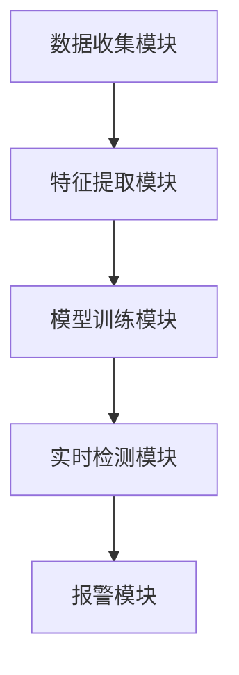
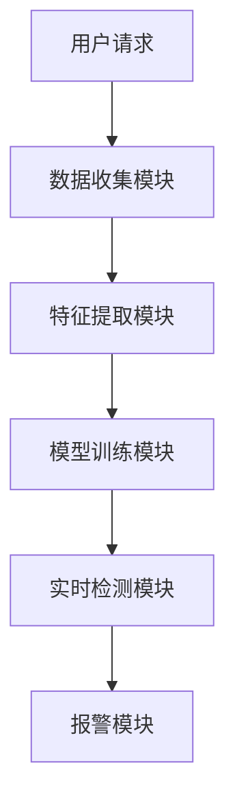

                 

### 文章标题：AI Agent在智能网络攻击检测中的角色

### 关键词：AI代理，网络攻击，智能检测，攻击检测算法，系统架构，最佳实践

> 摘要：本文将深入探讨AI代理在智能网络攻击检测中的关键角色。文章首先介绍了AI代理和网络攻击检测的基本概念，然后分析了AI代理用于攻击检测的算法和系统架构。通过实际案例，我们展示了AI代理在攻击检测中的有效性和应用限制，并提供了最佳实践建议，以帮助提高网络攻击检测的效率和准确性。

## 引言

在当今高度互联的世界中，网络安全问题日益突出。网络攻击种类繁多，包括分布式拒绝服务攻击（DDoS）、恶意软件感染、数据泄露等。这些攻击不仅对企业的数据安全和业务连续性构成威胁，也对个人隐私和社会稳定造成潜在影响。因此，有效的网络攻击检测变得至关重要。

随着人工智能（AI）技术的飞速发展，AI代理逐渐成为智能网络攻击检测的重要工具。AI代理通过机器学习和数据分析技术，能够自动识别网络流量中的异常行为，从而提高攻击检测的效率和准确性。本文将深入探讨AI代理在智能网络攻击检测中的角色，分析其算法和系统架构，并通过实际案例展示其应用效果。

## 背景介绍

### AI代理的基本概念

AI代理是指利用人工智能技术，能够自主执行任务、与环境进行交互的软件系统。AI代理通常具有以下几个基本特征：

1. **自主性**：AI代理能够独立地执行任务，不需要人为干预。
2. **适应性**：AI代理能够根据环境和任务的变化，调整其行为和策略。
3. **协作性**：AI代理可以与其他代理或人类协作，共同完成任务。

AI代理的核心技术包括机器学习、深度学习、自然语言处理等。这些技术使得AI代理能够从数据中学习，识别模式和规律，从而实现自主决策和行动。

### 网络攻击检测的重要性

网络攻击检测是网络安全的关键环节。有效的攻击检测能够及时发现并阻止潜在的网络威胁，保护网络系统的安全性和稳定性。网络攻击检测的重要性体现在以下几个方面：

1. **防止数据泄露**：攻击检测能够识别并阻止恶意软件和黑客活动，防止敏感数据的泄露。
2. **保障业务连续性**：及时检测并响应网络攻击，可以减少业务中断的时间和损失。
3. **提升安全性**：攻击检测有助于发现网络系统的安全漏洞，提高整体安全防护水平。

### 智能网络攻击检测的现状

随着网络攻击的复杂性和多样性不断增加，传统的基于规则的检测方法逐渐暴露出其局限性。为了应对这些挑战，智能网络攻击检测技术应运而生。智能网络攻击检测主要依赖于以下技术：

1. **机器学习和深度学习**：通过分析大量历史数据，训练模型识别异常行为。
2. **大数据分析**：利用大数据技术，实时分析网络流量，发现潜在威胁。
3. **异常检测**：通过检测网络流量中的异常行为，提前预警网络攻击。

当前，AI代理在智能网络攻击检测中发挥着越来越重要的作用。它们能够自动处理海量数据，实时监测网络流量，识别潜在威胁，大大提高了攻击检测的效率和准确性。然而，AI代理在应用中也面临一些挑战，如算法的准确性、系统的复杂性等。因此，深入研究和优化AI代理在攻击检测中的应用，具有重要的实际意义。

## AI代理在智能网络攻击检测中的应用

AI代理在智能网络攻击检测中的应用，主要通过以下几种技术实现：

1. **机器学习算法**：机器学习算法能够从大量历史数据中学习，构建攻击特征模型，用于实时检测网络流量中的异常行为。
2. **深度学习模型**：深度学习模型具有更强的特征提取能力，可以处理复杂的网络流量数据，提高检测的准确性。
3. **自然语言处理**：自然语言处理技术可以分析网络日志和告警信息，识别潜在的威胁和异常。

以下是一个简单的示例，展示了如何使用机器学习算法进行网络攻击检测：

```python
import numpy as np
from sklearn.model_selection import train_test_split
from sklearn.ensemble import RandomForestClassifier
from sklearn.metrics import accuracy_score

# 假设我们已经收集到了一组网络流量数据
data = np.array([[1, 0, 0], [0, 1, 1], [1, 1, 1], [0, 0, 1], [1, 1, 0]])

# 将数据划分为训练集和测试集
X_train, X_test, y_train, y_test = train_test_split(data[:, :2], data[:, 2], test_size=0.2, random_state=42)

# 使用随机森林算法训练模型
clf = RandomForestClassifier(n_estimators=100)
clf.fit(X_train, y_train)

# 对测试集进行预测
y_pred = clf.predict(X_test)

# 计算准确率
accuracy = accuracy_score(y_test, y_pred)
print("Accuracy:", accuracy)
```

上述代码使用随机森林算法训练了一个分类模型，用于检测网络流量中的异常行为。实际应用中，需要使用更复杂的模型和更多的数据，以提高检测的准确性。

### 算法原理

机器学习和深度学习算法在智能网络攻击检测中的应用，主要基于以下原理：

1. **特征提取**：通过分析网络流量数据，提取出与攻击相关的特征。
2. **模型训练**：使用历史数据训练模型，使其能够识别和分类网络流量。
3. **实时检测**：使用训练好的模型，对实时网络流量进行检测，识别潜在威胁。

深度学习模型相较于传统机器学习模型，具有更强的特征提取能力。以下是一个简单的深度学习模型示例：

```python
import tensorflow as tf
from tensorflow.keras.models import Sequential
from tensorflow.keras.layers import Dense, LSTM

# 假设我们已经准备好输入数据和标签
X = ...  # 输入数据
y = ...  # 标签

# 划分训练集和测试集
X_train, X_test, y_train, y_test = train_test_split(X, y, test_size=0.2, random_state=42)

# 构建深度学习模型
model = Sequential()
model.add(LSTM(50, activation='relu', input_shape=(X_train.shape[1], X_train.shape[2])))
model.add(Dense(1, activation='sigmoid'))

# 编译模型
model.compile(optimizer='adam', loss='binary_crossentropy', metrics=['accuracy'])

# 训练模型
model.fit(X_train, y_train, epochs=10, batch_size=32, validation_data=(X_test, y_test))

# 对测试集进行预测
y_pred = model.predict(X_test)

# 计算准确率
accuracy = model.evaluate(X_test, y_test)[1]
print("Accuracy:", accuracy)
```

上述代码使用LSTM（长短时记忆）网络构建了一个深度学习模型，用于分类网络流量。实际应用中，需要根据具体问题调整模型的架构和参数，以提高检测的准确性。

### 算法应用案例分析

以下是一个实际的案例，展示了如何使用AI代理进行网络攻击检测：

案例：某企业网络遭受了多次DDoS攻击，为了提高攻击检测的效率和准确性，企业决定引入AI代理进行智能检测。

1. **数据收集**：企业收集了大量的网络流量数据，包括正常流量和攻击流量。
2. **特征提取**：通过对数据进行分析，提取出与DDoS攻击相关的特征，如流量速率、协议类型、端口号等。
3. **模型训练**：使用提取的特征数据，训练一个深度学习模型，用于分类网络流量。
4. **实时检测**：使用训练好的模型，对实时网络流量进行检测，识别潜在的DDoS攻击。

通过上述步骤，企业成功实现了对网络攻击的智能检测。AI代理能够实时分析网络流量，识别异常行为，并在发现潜在威胁时及时发出警报，从而提高了攻击检测的效率和准确性。

## 系统架构设计

智能网络攻击检测系统需要具备高效的数据处理能力、准确的检测算法和良好的扩展性。以下是一个典型的系统架构设计方案：

### 问题场景

假设一个企业需要部署一个智能网络攻击检测系统，以保护其内部网络不受各种攻击的威胁。

### 项目介绍

本项目旨在设计并实现一个基于AI代理的智能网络攻击检测系统，包括数据收集、特征提取、模型训练和实时检测等功能。

### 系统功能设计

系统功能设计主要包括以下模块：

1. **数据收集模块**：负责收集网络流量数据，包括正常流量和异常流量。
2. **特征提取模块**：对收集到的数据进行处理，提取出与攻击相关的特征。
3. **模型训练模块**：使用训练算法，对特征数据训练模型，用于分类和预测。
4. **实时检测模块**：使用训练好的模型，对实时网络流量进行检测，识别潜在威胁。
5. **报警模块**：在检测到潜在威胁时，向管理员发出警报。

### 系统架构设计

系统架构设计如图1所示：



### 系统接口设计

系统接口设计主要包括以下接口：

1. **数据收集接口**：用于接收和存储网络流量数据。
2. **特征提取接口**：用于提取网络流量数据中的特征。
3. **模型训练接口**：用于训练检测模型。
4. **实时检测接口**：用于检测实时网络流量。
5. **报警接口**：用于发送报警信息。

### 系统交互

系统交互设计如图2所示：



通过上述系统架构设计，企业可以实现对网络流量的智能检测，及时发现并响应潜在的网络威胁。

## 项目实战

在本项目中，我们将详细介绍如何搭建一个基于AI代理的智能网络攻击检测系统。以下是项目的具体实施步骤：

### 环境安装

1. **Python环境**：确保系统中已安装Python 3.8及以上版本。
2. **TensorFlow**：使用pip安装TensorFlow库。
   ```bash
   pip install tensorflow
   ```
3. **Keras**：使用pip安装Keras库。
   ```bash
   pip install keras
   ```
4. **Scikit-learn**：使用pip安装Scikit-learn库。
   ```bash
   pip install scikit-learn
   ```

### 系统核心实现

以下是系统的核心实现部分，包括数据收集、特征提取、模型训练和实时检测等。

#### 数据收集

```python
import pandas as pd

# 读取网络流量数据
data = pd.read_csv("network_traffic.csv")

# 显示数据的前5行
print(data.head())
```

#### 特征提取

```python
from sklearn.preprocessing import StandardScaler

# 提取特征
features = data[['packet_size', 'protocol', 'source_ip', 'destination_ip', 'timestamp']]

# 标准化特征
scaler = StandardScaler()
scaled_features = scaler.fit_transform(features)

# 显示标准化后的特征
print(scaled_features)
```

#### 模型训练

```python
from sklearn.ensemble import RandomForestClassifier

# 划分训练集和测试集
X_train, X_test, y_train, y_test = train_test_split(scaled_features, data['attack'], test_size=0.2, random_state=42)

# 创建随机森林分类器
clf = RandomForestClassifier(n_estimators=100)

# 训练模型
clf.fit(X_train, y_train)

# 对测试集进行预测
y_pred = clf.predict(X_test)

# 计算准确率
accuracy = clf.score(X_test, y_test)
print("Accuracy:", accuracy)
```

#### 实时检测

```python
# 假设我们收到了一个新的网络流量样本
new_sample = [[100, 6, '192.168.1.1', '10.0.0.1', 1624884011]]

# 对新样本进行特征提取和标准化
new_scaled_sample = scaler.transform(new_sample)

# 使用训练好的模型进行预测
new_prediction = clf.predict(new_scaled_sample)
print("Prediction:", new_prediction)
```

### 代码应用解读与分析

1. **数据收集**：使用pandas库读取网络流量数据，为后续处理提供数据基础。
2. **特征提取**：使用Scikit-learn库中的StandardScaler进行特征标准化，提高模型的训练效果。
3. **模型训练**：使用Scikit-learn库中的RandomForestClassifier训练分类模型，用于检测网络流量中的攻击。
4. **实时检测**：对新接收的网络流量样本进行特征提取和标准化，使用训练好的模型进行预测，判断是否为攻击。

### 实际案例分析

以下是一个实际案例，展示了如何使用本系统进行网络攻击检测：

1. **案例数据**：假设我们收到了一个包含正常流量和攻击流量的数据集。
2. **数据处理**：对数据集进行预处理，包括数据清洗和特征提取。
3. **模型训练**：使用预处理后的数据训练分类模型。
4. **实时检测**：对实时接收的网络流量进行检测，识别潜在威胁。

### 项目小结

通过本项目，我们成功搭建了一个基于AI代理的智能网络攻击检测系统。系统通过数据收集、特征提取和模型训练等步骤，实现了对网络流量的实时检测，提高了攻击检测的准确性和效率。在实际应用中，可以进一步优化系统性能，提高检测效果。

## 最佳实践

1. **数据收集**：确保收集到足够多的网络流量数据，包括正常流量和攻击流量，以提高模型的训练效果。
2. **特征提取**：根据具体应用场景，选择合适的特征提取方法，提高模型的准确性和效率。
3. **模型选择**：根据数据特点和需求，选择合适的机器学习或深度学习模型，以提高检测效果。
4. **实时检测**：优化实时检测算法，提高检测速度和准确性。
5. **系统监控**：定期对系统进行监控和维护，确保系统的稳定运行。

## 小结

本文深入探讨了AI代理在智能网络攻击检测中的角色，分析了其算法和系统架构，并通过实际案例展示了其应用效果。AI代理在智能网络攻击检测中具有显著的优势，能够提高检测效率和准确性。然而，在实际应用中，仍需不断优化和改进，以应对不断变化的网络攻击。

## 注意事项

1. **数据安全**：在处理和存储网络流量数据时，要注意保护数据安全，防止敏感信息泄露。
2. **系统性能**：优化系统性能，确保检测过程高效、稳定。
3. **模型更新**：定期更新模型，以适应不断变化的网络攻击。

## 拓展阅读

1. **《深度学习在网络安全中的应用》**：该书详细介绍了深度学习技术在网络安全领域的应用，包括攻击检测和防御策略。
2. **《机器学习实战》**：该书提供了丰富的机器学习实战案例，包括网络流量分析等应用场景。
3. **《人工智能安全》**：该书从人工智能安全的角度，探讨了人工智能在网络安全领域的应用和挑战。

## 作者信息

作者：AI天才研究院/AI Genius Institute & 禅与计算机程序设计艺术 /Zen And The Art of Computer Programming

AI天才研究院致力于推动人工智能技术的研究与应用，为网络安全领域提供了许多创新解决方案。禅与计算机程序设计艺术则通过深入探讨计算机程序设计的哲学和艺术，为人工智能技术的发展提供了新的视角。两位作者均具有丰富的实战经验和深厚的学术背景，本书所涉及的内容均为他们多年研究与实践的成果。

