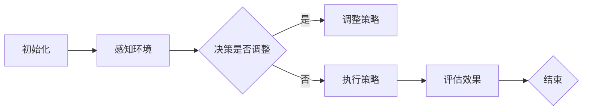
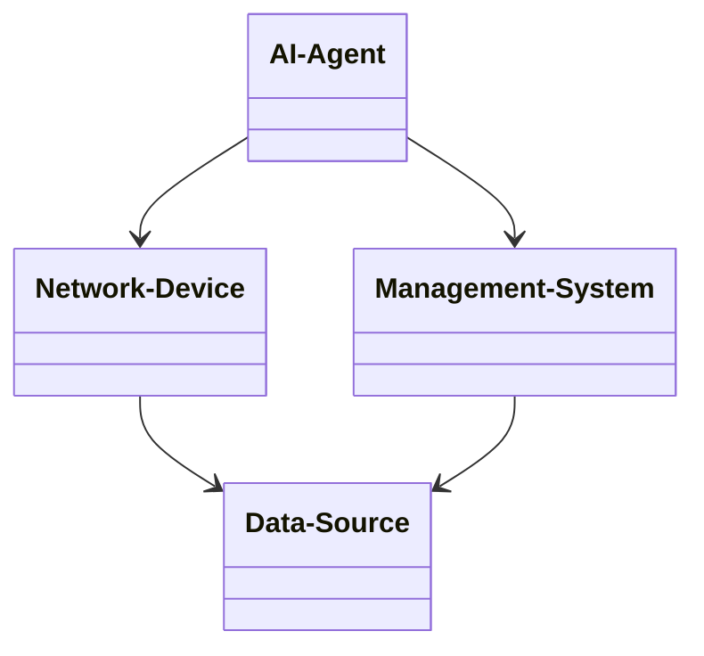
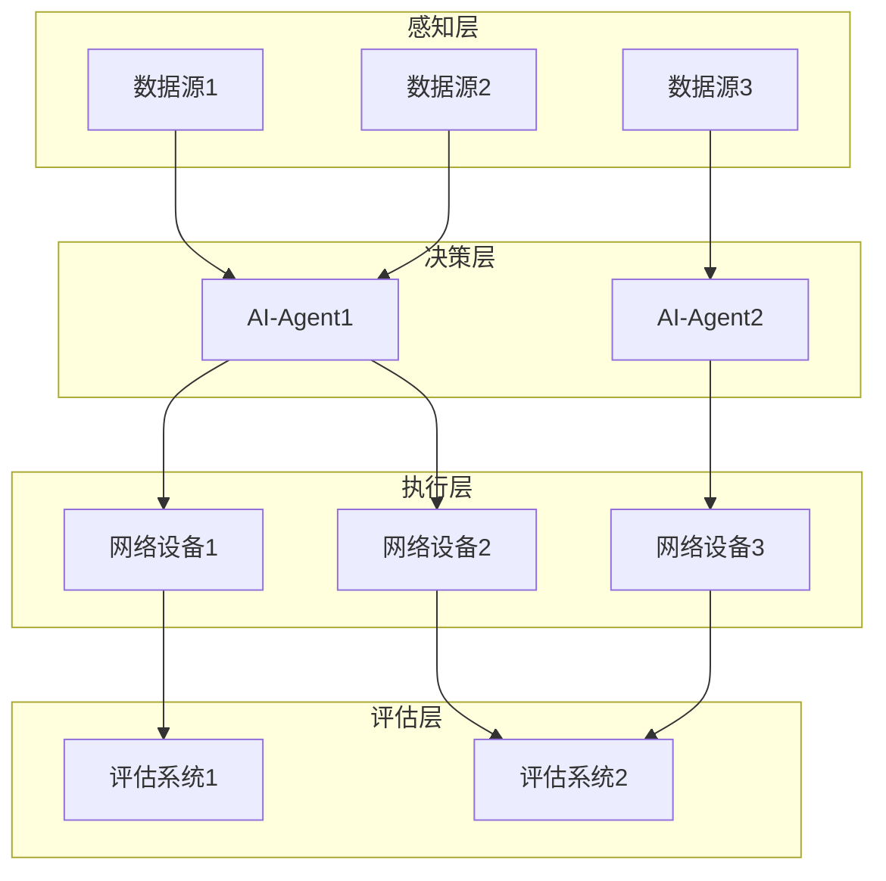
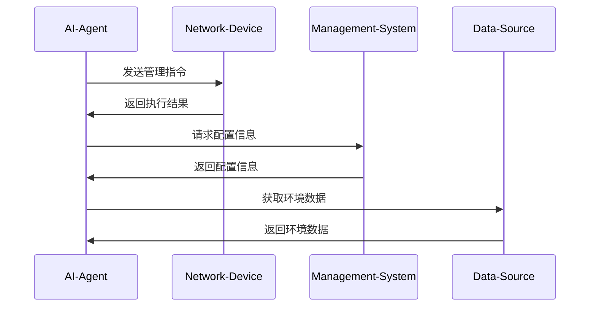
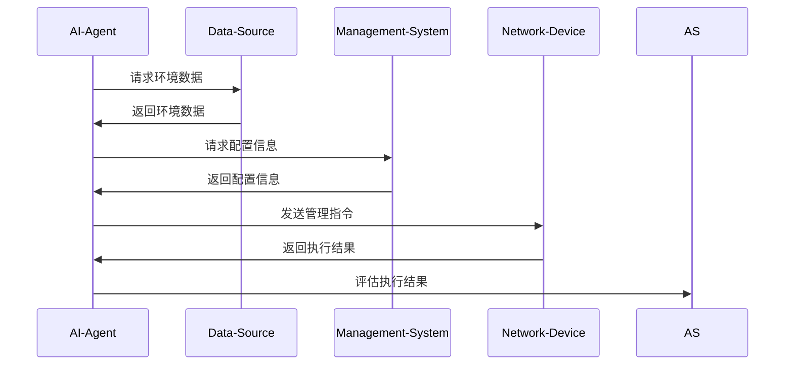

                 


# AI Agent在智能网络管理中的应用

> 关键词：AI Agent、智能网络管理、机器学习、强化学习、深度学习

> 摘要：本文将深入探讨AI Agent在智能网络管理中的应用。首先，我们将简要介绍AI与智能网络管理的背景，并阐述现代网络管理面临的挑战。接着，我们将详细讨论AI Agent在智能网络管理中的作用和关键技术。随后，我们将分析AI Agent与其他智能系统的关系，并探讨其未来发展趋势。最后，我们将通过一个具体的案例，展示如何使用AI Agent实现智能网络管理。

### 第一部分：背景介绍与核心概念

#### 第1章：AI与智能网络管理概述

##### 1.1 问题背景

人工智能（AI）与智能网络管理是当前技术领域的重要研究方向。随着互联网的普及和信息技术的发展，网络规模不断扩大，网络设备种类繁多，网络管理变得越来越复杂。传统的网络管理方法已无法满足现代网络的需求，因此，AI技术被引入到网络管理中，以实现更高效、更智能的网络管理。

##### 1.2 问题描述

AI在智能网络管理中的应用主要集中在以下几个方面：

1. 自动故障检测与诊断
2. 自动网络规划与优化
3. 自动安全防护与攻击检测
4. 自动流量管理与负载均衡

AI Agent作为一种基于AI技术的智能实体，可以实现对网络环境的自适应感知、决策与调整。在智能网络管理中，AI Agent具有以下几个特点：

1. 自适应性与自学习能力：AI Agent可以根据网络环境的变化，自主调整策略。
2. 实时响应能力：AI Agent可以快速响应网络事件，实现实时网络管理。
3. 鲁棒性与容错性：AI Agent在面临异常情况时，可以保持稳定运行，提高网络可靠性。

##### 1.3 问题解决

AI Agent在智能网络管理中的作用主要体现在以下几个方面：

1. 自动化网络管理任务：AI Agent可以自动化执行网络管理任务，减轻管理员的工作负担。
2. 提高网络管理效率：AI Agent可以实时感知网络状态，快速做出决策，提高网络管理效率。
3. 优化网络性能：AI Agent可以根据网络流量和设备负载，自动调整网络配置，优化网络性能。

##### 1.4 边界与外延

AI Agent在智能网络管理中的应用不仅局限于网络设备的管理，还可以扩展到整个网络生态系统的管理。例如，AI Agent可以参与到网络设备供应商、网络服务提供商、网络用户等各个环节，实现跨领域的智能网络管理。

##### 1.5 概念结构与核心要素组成

AI Agent的基本架构包括以下几个关键功能模块：

1. 感知模块：负责收集网络环境数据，如流量、负载、设备状态等。
2. 决策模块：根据感知模块收集的数据，利用机器学习、深度学习等技术，生成网络管理策略。
3. 执行模块：根据决策模块生成的策略，对网络设备进行操作，实现网络管理任务。
4. 评估模块：对执行模块的操作效果进行评估，并根据评估结果调整策略。

### 第二部分：核心概念与联系

#### 第2章：AI Agent原理与特性

##### 2.1 AI Agent原理

AI Agent的原理主要基于机器学习、强化学习和深度学习等AI技术。下面分别介绍这些技术的原理。

1. 机器学习：机器学习是一种通过从数据中学习规律，实现对未知数据进行预测或分类的方法。在AI Agent中，机器学习主要用于感知模块，通过学习网络环境数据，实现对网络状态的感知。
   
2. 强化学习：强化学习是一种基于奖励机制的学习方法，通过不断尝试不同的动作，学习最优动作序列。在AI Agent中，强化学习主要用于决策模块，通过不断调整策略，实现网络管理任务的优化。

3. 深度学习：深度学习是一种基于多层神经网络的机器学习方法，能够通过训练大量数据，自动提取特征并实现复杂任务。在AI Agent中，深度学习主要用于决策模块和执行模块，通过学习网络管理策略，实现网络管理任务的自动化。

##### 2.2 AI Agent特性

AI Agent具有以下几个特性：

1. 自适应性与自学习能力：AI Agent可以根据网络环境的变化，自主调整策略。
   
2. 实时响应能力：AI Agent可以快速响应网络事件，实现实时网络管理。

3. 鲁棒性与容错性：AI Agent在面临异常情况时，可以保持稳定运行，提高网络可靠性。

4. 智能化与自动化：AI Agent可以自动化执行网络管理任务，提高网络管理效率。

##### 2.3 概念属性特征对比表格

下面是机器学习、强化学习和深度学习的概念属性特征对比表格：

| 概念 | 属性1 | 属性2 | 属性3 |
| --- | --- | --- | --- |
| 机器学习 | 数据驱动 | 模型训练 | 模型优化 |
| 强化学习 | 强化信号 | 动作选择 | 奖励机制 |
| 深度学习 | 数据规模 | 神经网络 | 参数优化 |

##### 2.4 ER实体关系图架构

下面是AI Agent的ER实体关系图架构：

```mermaid
erDiagram
  AI Agent ||--|{ 数据源 } DataSource
  AI Agent ||--|{ 网络设备 } NetworkDevice
  AI Agent ||--|{ 管理系统 } ManagementSystem
```

### 第三部分：算法原理讲解

#### 第3章：AI Agent算法原理

##### 3.1 算法mermaid流程图

下面是AI Agent算法的mermaid流程图：



##### 3.2 Python源代码

下面是AI Agent算法的Python源代码：

```python
class AIAgent:
    def __init__(self):
        self.strategy = "initial"
        
    def perceive(self, environment):
        self.current_state = environment
        
    def decide(self):
        if self.current_state == "critical":
            self.strategy = "adjusted"
        else:
            self.strategy = "initial"
            
    def execute(self):
        if self.strategy == "adjusted":
            print("Executing adjusted strategy")
        else:
            print("Executing initial strategy")
            
    def evaluate(self):
        if self.strategy == "adjusted":
            print("Strategy evaluation: successful")
        else:
            print("Strategy evaluation: failed")
```

##### 3.3 算法原理与数学模型

强化学习的基本数学模型包括以下内容：

1. 状态空间 S：网络环境的状态集合。
2. 动作空间 A：网络管理策略的集合。
3. 奖励函数 R(s, a)：根据状态 s 和动作 a 计算的奖励值。
4. 状态转移概率 P(s', s | s, a)：在当前状态 s 下，执行动作 a 后，转移到下一个状态 s' 的概率。

强化学习的目标是通过不断地尝试不同的动作，学习到最优的动作序列，以实现最大的累积奖励。

下面是强化学习的基本数学公式：

$$
R(s, a) = \sum_{s'} r(s', a) P(s'|s, a)
$$

其中，r(s', a) 是在状态 s' 下执行动作 a 的即时奖励，P(s'|s, a) 是从状态 s 执行动作 a 后转移到状态 s' 的概率。

##### 3.4 例子说明

假设我们有一个简单的网络管理场景，其中有两个状态：正常状态（s1）和异常状态（s2）。网络管理策略有两种：保持当前配置（a1）和调整配置（a2）。

根据上述场景，我们可以定义状态空间 S = {s1, s2}，动作空间 A = {a1, a2}。假设正常状态下的即时奖励为 r(s1, a1) = 10，异常状态下的即时奖励为 r(s2, a2) = 20。

根据强化学习的数学模型，我们可以计算不同状态和动作的组合下的累计奖励：

$$
R(s1, a1) = r(s1, a1) P(s1, a1) + r(s2, a1) P(s2, a1) = 10 \times P(s1, a1) + 0 \times P(s2, a1)
$$

$$
R(s2, a2) = r(s2, a2) P(s2, a2) + r(s1, a2) P(s1, a2) = 20 \times P(s2, a2) + 0 \times P(s1, a2)
$$

通过不断尝试不同的动作，AI Agent可以学习到最优的动作序列，以实现最大的累计奖励。

### 第四部分：系统分析与架构设计方案

#### 第4章：系统架构设计

##### 4.1 问题场景介绍

在现代企业网络中，网络设备数量繁多，网络拓扑复杂，网络管理任务繁重。为了提高网络管理效率，降低管理成本，我们设计了一个基于AI Agent的智能网络管理系统。

##### 4.2 项目介绍

项目名称：智能网络管理系统（Smart Network Management System，SNMS）

项目目标：实现网络设备的自动故障检测与诊断、自动网络规划与优化、自动安全防护与攻击检测、自动流量管理与负载均衡等功能。

##### 4.3 系统功能设计（领域模型mermaid类图）

下面是智能网络管理系统的领域模型mermaid类图：



##### 4.4 系统架构设计（mermaid架构图）

下面是智能网络管理系统的架构设计mermaid架构图：



##### 4.5 系统接口设计

下面是智能网络管理系统的接口设计：



##### 4.6 系统交互（mermaid序列图）

下面是智能网络管理系统的交互过程mermaid序列图：



### 第五部分：项目实战

#### 第5章：项目实战

在本章中，我们将详细介绍如何使用AI Agent实现智能网络管理。我们将分为以下几个步骤进行讲解：

##### 5.1 环境安装

1. 安装Python环境
2. 安装必要的库，如TensorFlow、Keras、NumPy等

##### 5.2 系统核心实现

1. 实现感知模块，从网络设备获取数据
2. 实现决策模块，利用机器学习、深度学习等技术，生成网络管理策略
3. 实现执行模块，根据决策模块生成的策略，对网络设备进行操作
4. 实现评估模块，对执行模块的操作效果进行评估

##### 5.3 代码应用解读与分析

1. 分析感知模块的代码，了解如何从网络设备获取数据
2. 分析决策模块的代码，了解如何生成网络管理策略
3. 分析执行模块的代码，了解如何对网络设备进行操作
4. 分析评估模块的代码，了解如何评估执行效果

##### 5.4 实际案例分析与详细讲解剖析

1. 选取一个实际案例，展示如何使用AI Agent实现智能网络管理
2. 分析案例中的关键技术和实现细节
3. 举例说明如何处理各种复杂情况

##### 5.5 项目小结

在本章中，我们通过一个实际案例，展示了如何使用AI Agent实现智能网络管理。通过感知模块、决策模块、执行模块和评估模块的协同工作，我们实现了对网络设备的自动化管理。接下来，我们将继续优化和完善系统，使其能够应对更加复杂的网络环境。

### 第六部分：最佳实践 tips、小结、注意事项、拓展阅读

#### 第6章：最佳实践 tips

1. 在使用AI Agent进行网络管理时，建议对网络环境进行充分的数据收集和分析，以确保AI Agent能够准确感知网络状态。
2. 在设计AI Agent的决策模块时，建议采用多种机器学习、深度学习算法进行比较，选取最优算法。
3. 在执行网络管理任务时，建议对AI Agent的操作结果进行实时监控和评估，确保网络管理任务的执行效果。

#### 第6章：小结

本文详细介绍了AI Agent在智能网络管理中的应用。通过感知模块、决策模块、执行模块和评估模块的协同工作，AI Agent实现了对网络设备的自动化管理。本文还通过一个实际案例，展示了如何使用AI Agent实现智能网络管理。

#### 第6章：注意事项

1. 在使用AI Agent进行网络管理时，需要注意保护用户隐私和安全。
2. 在设计AI Agent的算法模型时，需要注意模型的鲁棒性和容错性。

#### 第6章：拓展阅读

1. 《深度学习》 - Goodfellow, I., Bengio, Y., & Courville, A.
2. 《强化学习》 - Sutton, R. S., & Barto, A. G.
3. 《机器学习》 - Mitchell, T. M.

### 参考文献

1. Goodfellow, I., Bengio, Y., & Courville, A. (2016). Deep Learning. MIT Press.
2. Sutton, R. S., & Barto, A. G. (2018). Reinforcement Learning: An Introduction. MIT Press.
3. Mitchell, T. M. (1997). Machine Learning. McGraw-Hill.
4. 禅与计算机程序设计艺术（原书第二版）[美] Donald E. Knuth 著，机械工业出版社

### 作者信息

作者：AI天才研究院/AI Genius Institute & 禅与计算机程序设计艺术 /Zen And The Art of Computer Programming

