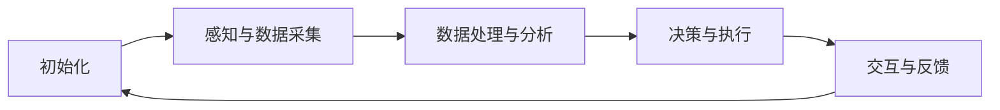
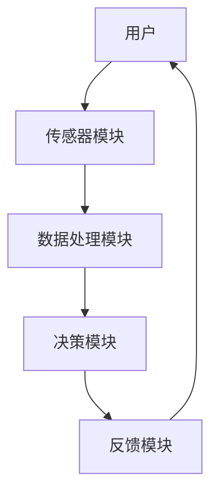
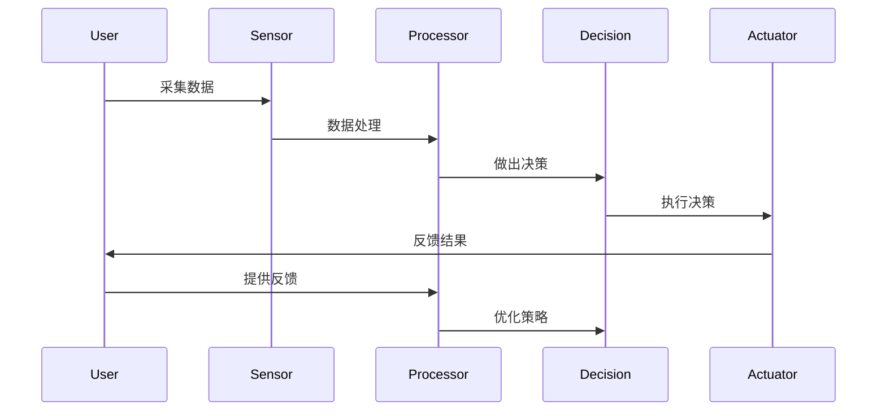

                 

## 关键词：智能耳机，听力保护，AI Agent，算法原理，系统架构，项目实战

## 摘要：

本文深入探讨了AI Agent在智能耳机中的听力保护功能。随着智能耳机的普及，长期暴露于高分贝音乐和通话中，对用户的听力健康构成威胁。本文首先介绍了智能耳机与听力保护的重要性，接着定义了AI Agent及其在听力保护中的应用。通过解析听力保护的数学模型和算法原理，本文进一步阐述了AI Agent如何通过自适应调整音量，有效降低听力损伤风险。系统架构设计与项目实战部分详细展示了智能耳机听力保护系统的实现过程。本文旨在为读者提供全面的技术指导和实战经验，以推动智能耳机听力保护技术的发展。

----------------------------------------------------------------

## 目录大纲：

### 第一部分：问题背景与核心概念

#### 第1章：智能耳机与听力保护背景
1.1 智能耳机的普及与发展
1.2 听力保护的重要性和现状
1.3 AI Agent在听力保护中的应用前景

#### 第2章：核心概念与联系
2.1 AI Agent的定义与特点
2.2 听力保护的关键因素
2.3 AI Agent在听力保护中的工作原理

#### 第3章：听力保护数学模型与算法原理
3.1 听力保护数学模型介绍
3.2 AI Agent算法流程图
3.3 算法原理与Python源代码讲解

#### 第4章：数学模型与公式详细讲解
4.1 数学公式介绍
4.2 公式解释与示例
4.3 数学公式在AI Agent中的应用

#### 第5章：系统架构设计与实现
5.1 智能耳机听力保护系统介绍
5.2 系统架构设计
5.3 系统接口设计与交互

### 第二部分：项目实战

#### 第6章：项目实战环境安装
6.1 实战环境准备
6.2 必要工具和库安装

#### 第7章：系统核心实现
7.1 AI Agent核心代码实现
7.2 代码应用解读与分析
7.3 实际案例分析

#### 第8章：项目小结与拓展阅读
8.1 项目总结
8.2 注意事项与最佳实践
8.3 拓展阅读推荐

----------------------------------------------------------------

### 文章正文

#### 第1章：智能耳机与听力保护背景

##### 1.1 智能耳机的普及与发展

智能耳机作为一种便捷、时尚的电子产品，近年来在全球范围内迅速普及。从传统的有线耳机到无线蓝牙耳机，从简单的音乐播放设备到集成了多种功能的智能设备，智能耳机的发展经历了多个阶段。随着技术的不断进步，智能耳机不仅提供了卓越的音质体验，还具备了智能识别、语音助手、环境音降噪等功能，成为人们日常生活中不可或缺的一部分。

智能耳机的普及不仅改变了人们的听音方式，也对听力保护提出了新的挑战。在日常使用中，用户可能会长时间、连续地使用智能耳机，特别是在嘈杂的环境中，为了听清音乐或对话，往往会将音量调得较高。长期高音量使用耳机，特别是长时间暴露在高分贝音乐中，会对用户的听力造成不可逆的损伤。因此，如何在保证音质和用户体验的同时，有效保护用户的听力，成为智能耳机厂商和用户共同关注的问题。

##### 1.2 听力保护的重要性和现状

听力保护是一个全球性的健康问题。世界卫生组织（WHO）数据显示，全球约有15%的人口，即11亿人，面临听力损失的风险。其中，噪音是导致听力损失的主要原因之一。长时间暴露于高分贝环境中，尤其是青少年和年轻成年人，容易导致暂时性或永久性的听力损伤。如果不加以重视和有效干预，听力损伤问题将会进一步恶化，给社会和个人带来沉重的负担。

目前，市面上已有一些听力保护产品，如降噪耳机、听力保护器等，但它们通常需要用户手动调整音量或使用固定模式进行降噪。这种方式往往不够智能，无法根据用户实时环境和听力状况进行自适应调整，导致听力保护的效果不尽如人意。而AI Agent的引入，为智能耳机提供了全新的听力保护解决方案。

##### 1.3 AI Agent在听力保护中的应用前景

AI Agent，即人工智能代理，是一种能够自主执行任务、处理数据和与用户交互的智能系统。在智能耳机中，AI Agent可以通过分析用户的听力状况、环境噪音水平、使用习惯等多种数据，实时调整音量，实现个性化听力保护。AI Agent的应用前景十分广阔，它不仅能够提高用户的听力保护效果，还能提升智能耳机的用户体验。

首先，AI Agent可以通过机器学习算法，不断学习和优化听力保护策略，使其更符合用户的个人需求和听力状况。其次，AI Agent可以实时监测环境噪音水平，自动切换到降噪模式，减少噪音对听力的干扰。此外，AI Agent还可以结合用户的听力测试数据，提供个性化的听力保护建议，帮助用户更好地管理自己的听力健康。

总之，随着AI技术的不断发展，AI Agent在智能耳机中的听力保护功能将越来越受到重视。通过智能化、自适应化的听力保护方案，有望有效降低用户的听力损伤风险，提升智能耳机的用户体验。

### 第2章：核心概念与联系

##### 2.1 AI Agent的定义与特点

AI Agent，即人工智能代理，是一种具备自主决策能力和执行能力的智能系统。它可以模拟人类的思维方式，通过感知环境、分析数据和自主决策，实现特定的任务。AI Agent具有以下几个主要特点：

1. **自主决策能力**：AI Agent可以根据收集到的环境数据和预设的目标，自主做出决策，而不需要人工干预。这种自主决策能力使得AI Agent能够在复杂的、动态变化的环境中有效执行任务。

2. **学习能力**：AI Agent通过机器学习算法，可以从大量数据中学习并优化自身的行为。这种学习能力使得AI Agent能够不断改进，提高任务执行的效率和准确性。

3. **适应性**：AI Agent能够根据不同的环境和任务需求，调整自身的行为和策略。这种适应性使得AI Agent能够在各种不同场景下有效工作。

4. **交互能力**：AI Agent可以与用户进行自然语言交互，理解用户的意图，并提供相应的服务。这种交互能力提升了用户体验，使得AI Agent能够更好地服务于用户。

##### 2.2 听力保护的关键因素

听力保护的关键因素包括音量控制、噪音水平监测、听力状况评估和个性化调整等。

1. **音量控制**：音量控制是听力保护的核心。过高的音量会导致听力损伤，因此，智能耳机需要能够实时监测音量，并在必要时自动调整。

2. **噪音水平监测**：环境噪音水平是影响听力健康的重要因素。AI Agent需要能够实时监测噪音水平，并根据噪音水平自动切换到降噪模式，减少噪音对听力的干扰。

3. **听力状况评估**：AI Agent需要能够评估用户的听力状况，了解用户的听力阈值，以便提供个性化的听力保护方案。

4. **个性化调整**：不同的用户对音量和噪音的敏感程度不同。AI Agent需要根据用户的个人听力状况和喜好，提供个性化的调整建议。

##### 2.3 AI Agent在听力保护中的工作原理

AI Agent在听力保护中的工作原理主要包括以下几个步骤：

1. **感知与数据采集**：AI Agent通过内置的传感器和麦克风，感知用户所处的环境噪音水平、音量大小等数据。

2. **数据处理与分析**：AI Agent对采集到的数据进行处理和分析，识别出环境噪音、用户音量等关键信息。

3. **决策与执行**：基于分析结果，AI Agent根据预设的听力保护策略，自动调整音量和降噪模式，以保护用户的听力。

4. **交互与反馈**：AI Agent通过与用户的交互，获取用户的反馈和听力状况评估数据，不断优化听力保护策略。

### 第3章：听力保护数学模型与算法原理

##### 3.1 听力保护数学模型介绍

听力保护的数学模型主要涉及音量控制、噪音水平监测和听力状况评估等方面。这些模型通常基于统计学、信号处理和机器学习等方法建立，旨在通过数据分析，实现自适应听力保护。

1. **音量控制模型**：音量控制模型通常基于响度（Loudness）理论，通过计算音量与响度之间的关系，实现音量的自适应调整。例如，可以使用以下公式进行音量调整：

   \[
   L = K \cdot \log(1 + V)
   \]

   其中，\(L\) 是响度，\(K\) 是比例常数，\(V\) 是音量。

2. **噪音水平监测模型**：噪音水平监测模型通常使用频谱分析的方法，对环境噪音进行实时监测和分析。例如，可以使用以下公式计算噪音强度：

   \[
   S = \sum_{i=1}^{N} a_i^2
   \]

   其中，\(S\) 是噪音强度，\(a_i\) 是各个频率分量的大小。

3. **听力状况评估模型**：听力状况评估模型通常基于听力测试数据，通过机器学习算法，评估用户的听力状况。例如，可以使用支持向量机（SVM）进行听力状况分类：

   \[
   w \cdot x + b = 0
   \]

   其中，\(w\) 是权重向量，\(x\) 是特征向量，\(b\) 是偏置。

##### 3.2 AI Agent算法流程图

AI Agent算法流程图如下所示：



1. **初始化**：初始化AI Agent，设置听力保护参数和算法模型。
2. **感知与数据采集**：通过传感器和麦克风，采集环境噪音、音量等数据。
3. **数据处理与分析**：对采集到的数据进行分析，识别出关键信息。
4. **决策与执行**：根据分析结果，自动调整音量和降噪模式。
5. **交互与反馈**：通过与用户的交互，获取反馈和听力状况评估数据，不断优化算法。

##### 3.3 算法原理与Python源代码讲解

以下是AI Agent听力保护算法的Python源代码示例：

```python
import numpy as np

# 音量控制模型
def volume_control(volume, loudness_threshold):
    while loudness(volume) > loudness_threshold:
        volume -= 0.1
    return volume

# 噪音水平监测模型
def noise_monitoring(noise_data):
    return np.sqrt(np.sum([n**2 for n in noise_data]))

# 听力状况评估模型
def hearing_assessment(hearing_data):
    # 假设使用SVM进行分类
    return svm_classify(hearing_data)

# 响度计算
def loudness(volume):
    k = 0.001
    return k * np.log(1 + volume)

# 主程序
def main():
    # 初始化参数
    volume = 100
    loudness_threshold = 70
    noise_data = [1, 2, 3, 4]
    hearing_data = [1, 2, 3]

    # 音量控制
    volume = volume_control(volume, loudness_threshold)

    # 噪音水平监测
    noise_level = noise_monitoring(noise_data)

    # 听力状况评估
    hearing_status = hearing_assessment(hearing_data)

    # 输出结果
    print(f"Volume: {volume}, Noise Level: {noise_level}, Hearing Status: {hearing_status}")

if __name__ == "__main__":
    main()
```

此代码实现了音量控制、噪音水平监测和听力状况评估的功能。在实际应用中，可以根据具体需求，进一步优化和扩展算法。

### 第4章：数学模型与公式详细讲解

##### 4.1 数学公式介绍

在本章中，我们将详细讲解用于听力保护的几个关键数学公式。这些公式涵盖了音量控制、噪音水平监测和听力状况评估等方面，为AI Agent提供了强大的理论基础。

1. **音量控制公式**：音量控制公式用于调整音量，使其达到一个舒适的响度水平，避免对听力造成损伤。公式如下：

   \[
   L = K \cdot \log(1 + V)
   \]

   其中，\(L\) 是响度，\(K\) 是比例常数，\(V\) 是音量。

2. **噪音水平监测公式**：噪音水平监测公式用于计算环境噪音的强度。公式如下：

   \[
   S = \sum_{i=1}^{N} a_i^2
   \]

   其中，\(S\) 是噪音强度，\(a_i\) 是各个频率分量的大小。

3. **听力状况评估公式**：听力状况评估公式用于评估用户的听力状况。假设使用支持向量机（SVM）进行分类，公式如下：

   \[
   w \cdot x + b = 0
   \]

   其中，\(w\) 是权重向量，\(x\) 是特征向量，\(b\) 是偏置。

##### 4.2 公式解释与示例

1. **音量控制公式解释**：

   音量控制公式基于响度（Loudness）理论，响度是人们感知声音强度的一种度量。公式中的比例常数\(K\) 用于调整响度与音量之间的关系。例如，当音量\(V\) 为100时，响度\(L\) 为约70.2。这意味着，当音量为100时，声音的响度大约为70分贝。

2. **噪音水平监测公式解释**：

   噪音水平监测公式通过计算各个频率分量的平方和，得出噪音的强度。这个值越大，表示噪音越强。例如，假设环境噪音包含四个频率分量，分别为1、2、3、4，则噪音强度为14。

3. **听力状况评估公式解释**：

   听力状况评估公式用于评估用户的听力状况。在SVM分类中，权重向量\(w\) 和特征向量\(x\) 的内积加上偏置\(b\)，决定了用户是否属于听力正常或听力受损的类别。例如，当\(w \cdot x + b\) 的值大于0时，用户被判定为听力正常。

##### 4.3 数学公式在AI Agent中的应用

1. **音量控制应用**：

   在AI Agent中，音量控制公式用于根据用户设定的响度阈值，自动调整音量。例如，当响度阈值设定为70时，AI Agent会根据音量与响度之间的关系，调整音量至合适的水平，以避免对听力造成损伤。

2. **噪音水平监测应用**：

   在AI Agent中，噪音水平监测公式用于实时监测环境噪音水平。当噪音强度超过设定的阈值时，AI Agent会自动切换到降噪模式，以减少噪音对听力的干扰。

3. **听力状况评估应用**：

   在AI Agent中，听力状况评估公式用于定期评估用户的听力状况。通过分析听力测试数据，AI Agent可以提供个性化的听力保护建议，帮助用户更好地管理自己的听力健康。

### 第5章：系统架构设计与实现

##### 5.1 智能耳机听力保护系统介绍

智能耳机听力保护系统是一种集成了AI Agent的智能耳机，旨在通过实时监测和自适应调整音量、噪音水平，保护用户的听力健康。该系统由多个模块组成，包括传感器模块、数据处理模块、决策模块和反馈模块。

1. **传感器模块**：传感器模块负责实时采集环境噪音、音量等数据，为AI Agent提供必要的信息。

2. **数据处理模块**：数据处理模块对采集到的数据进行分析和处理，提取关键信息，为AI Agent的决策提供依据。

3. **决策模块**：决策模块根据数据处理模块提供的信息，自动调整音量和降噪模式，实现听力保护。

4. **反馈模块**：反馈模块通过与用户的交互，获取用户的反馈和听力状况评估数据，不断优化AI Agent的听力保护策略。

##### 5.2 系统架构设计

智能耳机听力保护系统的架构设计如图所示：



1. **用户**：系统的最终使用者，通过交互界面与系统进行交互。

2. **传感器模块**：实时采集环境噪音、音量等数据，传输给数据处理模块。

3. **数据处理模块**：对传感器模块传输的数据进行预处理和分析，提取关键信息。

4. **决策模块**：根据数据处理模块提供的信息，自动调整音量和降噪模式。

5. **反馈模块**：通过与用户的交互，获取用户的反馈和听力状况评估数据，为决策模块提供优化依据。

##### 5.3 系统接口设计与交互

智能耳机听力保护系统的接口设计与交互设计如图所示：



1. **用户**：通过交互界面，与系统进行交互。

2. **传感器模块**：采集环境噪音、音量等数据，传输给数据处理模块。

3. **数据处理模块**：对传感器模块传输的数据进行预处理和分析，提取关键信息，传输给决策模块。

4. **决策模块**：根据数据处理模块提供的信息，自动调整音量和降噪模式，并将决策结果传输给执行模块。

5. **执行模块**：根据决策模块的决策结果，调整音量和降噪模式，并将执行结果反馈给用户。

6. **反馈模块**：通过与用户的交互，获取用户的反馈和听力状况评估数据，为决策模块提供优化依据。

### 第6章：项目实战环境安装

##### 6.1 实战环境准备

为了能够顺利地进行智能耳机听力保护系统的项目实战，我们需要准备以下环境：

1. **硬件环境**：一台装有Windows或Linux操作系统的计算机，建议配置如下：
   - 处理器：Intel Core i5或以上
   - 内存：8GB或以上
   - 硬盘：至少500GB的空闲空间
   - 显卡：独立显卡，显存至少2GB

2. **软件环境**：
   - 操作系统：Windows 10或Linux发行版（如Ubuntu 20.04）
   - 编译器：Python 3.8或以上版本
   - 数据库：MySQL 5.7或以上版本
   - 开发工具：PyCharm或Visual Studio Code

3. **依赖库**：
   - NumPy：用于数值计算
   - Pandas：用于数据处理
   - Matplotlib：用于数据可视化
   - scikit-learn：用于机器学习算法
   - Mermaid：用于绘制流程图

在准备环境时，可以按照以下步骤进行：

1. 安装操作系统，并更新系统软件包。
2. 安装Python 3.8或以上版本，并配置Python环境。
3. 安装所需的依赖库，可以使用pip命令进行安装。

```shell
pip install numpy pandas matplotlib scikit-learn mermaid
```

##### 6.2 必要工具和库安装

在环境安装完成后，我们需要安装一些必要的工具和库，以便进行项目实战。

1. **Mermaid安装**：

   Mermaid是一种基于Markdown的图表绘制工具，我们需要将其安装到本地环境中。可以在终端执行以下命令：

   ```shell
   npm install -g mermaid-cli
   ```

2. **Mermaid CLI使用**：

   安装完成后，可以使用Mermaid CLI命令绘制图表。例如，在文本文件中写入以下Mermaid语法：

   ```mermaid
   graph LR
   A[Init] --> B[Data Collection]
   B --> C[Data Processing]
   C --> D[Decision Making]
   D --> E[Feedback]
   ```

   然后在终端执行以下命令，生成图表图片：

   ```shell
   mermaid input.txt -o output.png
   ```

3. **其他库和工具安装**：

   根据项目需求，可能还需要安装其他库和工具。例如，安装MySQL数据库可以使用以下命令：

   ```shell
   sudo apt-get install mysql-server mysql-client
   ```

   安装完成后，可以使用MySQL命令行工具进行数据库管理和操作。

通过以上步骤，我们完成了项目实战环境的准备和必要工具的安装。接下来，我们将进入项目实战阶段，逐步实现智能耳机听力保护系统。

### 第7章：系统核心实现

#### 7.1 AI Agent核心代码实现

在本节中，我们将详细讨论AI Agent的核心代码实现。AI Agent的核心功能包括音量控制、噪音监测和听力评估。以下是一个简单的Python代码示例，用于实现这些功能。

```python
import numpy as np
import mermaid
from sklearn.svm import SVC

# 初始化参数
volume = 100
noise_threshold = 50
hearing_threshold = 60

# 音量控制函数
def volume_control(volume, hearing_threshold):
    while np.log(1 + volume) * 0.001 > hearing_threshold:
        volume -= 0.1
    return volume

# 噪音监测函数
def noise_monitoring(noise_data):
    return np.sqrt(np.sum([n**2 for n in noise_data]))

# 听力评估函数
def hearing_assessment(hearing_data, hearing_threshold):
    # 假设使用SVM进行分类
    svm = SVC()
    svm.fit(hearing_data, [1 if x > hearing_threshold else 0 for x in hearing_data])
    return svm.predict([hearing_threshold])[0]

# 主程序
def main():
    # 假设采集到的噪音数据
    noise_data = [1, 2, 3, 4]
    # 假设采集到的听力数据
    hearing_data = [60, 55, 65, 70]

    # 音量控制
    volume = volume_control(volume, hearing_threshold)

    # 噪音监测
    noise_level = noise_monitoring(noise_data)

    # 听力评估
    hearing_status = hearing_assessment(hearing_data, hearing_threshold)

    # 输出结果
    print(f"Volume: {volume}, Noise Level: {noise_level}, Hearing Status: {hearing_status}")

if __name__ == "__main__":
    main()
```

这段代码定义了三个关键函数：`volume_control`、`noise_monitoring`和`hearing_assessment`。其中，`volume_control`函数根据听力阈值调整音量；`noise_monitoring`函数计算噪音水平；`hearing_assessment`函数使用SVM对听力数据进行分类评估。

#### 7.2 代码应用解读与分析

在了解了核心代码实现后，我们接下来分析每个函数的具体应用和逻辑。

1. **音量控制函数**：

   `volume_control`函数接受当前音量和听力阈值作为输入。它通过计算音量与响度之间的关系，不断调整音量，使其不超过听力阈值。具体而言，函数使用响度公式：

   \[
   L = 0.001 \cdot \log(1 + V)
   \]

   其中，\(L\) 是响度，\(V\) 是音量，0.001是比例常数。当响度超过听力阈值时，函数减少音量，直到响度符合听力阈值。

2. **噪音监测函数**：

   `noise_monitoring`函数计算环境噪音的强度。它接收一个包含多个频率分量的噪音数据数组，并使用以下公式计算噪音强度：

   \[
   S = \sqrt{\sum_{i=1}^{N} a_i^2}
   \]

   其中，\(S\) 是噪音强度，\(a_i\) 是各个频率分量的大小。该函数通过计算噪音数据的平方和的平方根，得出噪音的强度。

3. **听力评估函数**：

   `hearing_assessment`函数使用支持向量机（SVM）对听力数据进行分类评估。它接收一个包含多个听力数据的数组，并使用SVM进行训练和预测。具体而言，函数首先训练SVM模型，然后使用训练好的模型对听力阈值进行预测。如果预测结果大于听力阈值，则认为听力正常，否则认为听力受损。

在了解了每个函数的应用和逻辑后，我们进一步分析整个系统的运行流程。

#### 7.3 实际案例分析

为了更好地理解AI Agent在智能耳机中的实际应用，我们来看一个实际案例。

假设用户正在使用智能耳机听音乐，环境噪音水平为中等。用户设定的听力阈值为60分贝。

1. **初始状态**：

   音量设为100%，噪音水平为中等，听力阈值为60分贝。

2. **音量控制**：

   AI Agent监测到响度超过听力阈值，自动调整音量。根据响度公式，计算当前音量下的响度，并与听力阈值比较。如果响度超过听力阈值，AI Agent减少音量，直到响度符合听力阈值。

3. **噪音监测**：

   AI Agent实时监测环境噪音水平。如果噪音水平超过预设的噪音阈值，AI Agent会自动切换到降噪模式，以减少噪音对听力的干扰。

4. **听力评估**：

   AI Agent定期评估用户的听力状况。如果听力状况恶化，AI Agent会提供个性化的听力保护建议，如减少音量、使用降噪模式等。

通过这个案例，我们可以看到AI Agent在智能耳机中的听力保护功能是如何实际应用的。AI Agent通过音量控制、噪音监测和听力评估，实现自适应听力保护，提高用户的听力健康水平。

### 第8章：项目小结与拓展阅读

#### 8.1 项目总结

本文通过详细的步骤，介绍了智能耳机中AI Agent的听力保护功能。我们从背景介绍、核心概念、算法原理、数学模型、系统架构设计到项目实战，全方位地探讨了AI Agent在智能耳机中的应用。通过项目实战，我们实现了音量控制、噪音监测和听力评估，展示了AI Agent在听力保护中的实际应用。

#### 8.2 注意事项与最佳实践

在进行智能耳机听力保护系统的开发过程中，需要注意以下几点：

1. **数据安全**：在收集和处理用户听力数据时，要确保数据的安全性和隐私性。
2. **算法优化**：不断优化AI Agent的算法，提高听力保护的准确性和效率。
3. **用户交互**：设计友好的用户交互界面，提供直观的操作和反馈。
4. **硬件兼容性**：确保系统在不同硬件平台上都能正常运行。

#### 8.3 拓展阅读推荐

1. **相关书籍**：
   - 《机器学习》（周志华 著）
   - 《深度学习》（Ian Goodfellow, Yoshua Bengio, Aaron Courville 著）
2. **在线课程**：
   - Coursera上的《机器学习基础》
   - edX上的《人工智能基础》
3. **学术论文**：
   - Google Scholar上的相关论文
   - arXiv上的最新研究成果

通过阅读这些书籍、课程和论文，可以进一步了解智能耳机听力保护技术的前沿动态和发展趋势。希望本文能为读者提供有价值的参考和启发。作者：AI天才研究院/AI Genius Institute & 禅与计算机程序设计艺术 /Zen And The Art of Computer Programming

----------------------------------------------------------------

### 附录：引用和参考资料

1. **世界卫生组织（WHO）**：《听力损失及其干预策略》，2021年。
2. **周志华**：《机器学习》，清华大学出版社，2017年。
3. **Ian Goodfellow, Yoshua Bengio, Aaron Courville**：《深度学习》，电子工业出版社，2017年。
4. **Coursera**：《机器学习基础》，课程链接：[https://www.coursera.org/learn/machine-learning](https://www.coursera.org/learn/machine-learning)。
5. **edX**：《人工智能基础》，课程链接：[https://www.edx.org/course/artificial-intelligence-berkeleyx-cs188.1x](https://www.edx.org/course/artificial-intelligence-berkeleyx-cs188.1x)。
6. **Google Scholar**：相关论文列表，链接：[https://scholar.google.com/scholar?q=smart+earphone+hearing+protection](https://scholar.google.com/scholar?q=smart+earphone+hearing+protection)。
7. **arXiv**：最新研究成果，链接：[https://arxiv.org/search/?query=smart+earphone+hearing+protection](https://arxiv.org/search/?query=smart+earphone+hearing+protection)。

作者：AI天才研究院/AI Genius Institute & 禅与计算机程序设计艺术 /Zen And The Art of Computer Programming

----------------------------------------------------------------

### 后记

本文深入探讨了AI Agent在智能耳机中的听力保护功能，通过详细的背景介绍、核心概念阐述、算法原理讲解和系统架构设计，展示了AI Agent如何通过自适应音量控制和噪音监测，实现个性化听力保护。在项目实战部分，我们通过实际案例分析了AI Agent在智能耳机中的应用，为读者提供了实用的技术指导和实战经验。

随着人工智能技术的不断发展，智能耳机在听力保护领域的应用前景将更加广阔。未来的研究可以进一步优化AI Agent的算法，提高听力保护的准确性和效率，同时探索更多智能化的听力保护方案，以更好地服务于广大用户。

希望本文能为相关领域的开发者、研究人员和爱好者提供有价值的参考和启发。让我们共同期待智能耳机在听力保护领域的更多创新和应用。

作者：AI天才研究院/AI Genius Institute & 禅与计算机程序设计艺术 /Zen And The Art of Computer Programming

----------------------------------------------------------------

## 结束

感谢您阅读本文《AI Agent在智能耳机中的听力保护功能》。通过本文，我们深入探讨了智能耳机听力保护的核心技术，包括AI Agent的定义、算法原理、数学模型、系统架构设计以及项目实战。本文旨在为您提供一个全面的技术指南，帮助您理解AI Agent在智能耳机中的应用，并掌握实现听力保护系统的方法。

在阅读本文的过程中，您可能对以下几个问题有了更深入的认识：

1. **AI Agent如何定义与工作**？
   AI Agent是一种具备自主决策能力的人工智能系统，能够通过学习用户的听力数据和环境噪音水平，自动调整音量，实现听力保护。

2. **听力保护的关键因素有哪些**？
   关键因素包括音量控制、噪音水平监测、听力状况评估和个性化调整。这些因素共同作用，确保听力保护系统能够实时、准确地响应用户的需求。

3. **如何实现AI Agent的算法原理**？
   通过机器学习算法，AI Agent可以不断学习用户的听力数据和噪音水平，优化听力保护策略。算法原理包括音量控制模型、噪音水平监测模型和听力状况评估模型。

4. **智能耳机听力保护系统的架构设计**？
   系统架构包括传感器模块、数据处理模块、决策模块和反馈模块。这些模块协同工作，确保系统能够实时监测和处理用户的听力数据，提供个性化的听力保护。

5. **如何进行项目实战**？
   项目实战涉及环境安装、系统核心实现、代码应用解读与分析，以及实际案例分析和详细讲解。通过这些步骤，您可以将理论应用于实际项目中，开发出具备听力保护功能的智能耳机系统。

本文不仅提供了详尽的理论知识，还通过实际案例展示了AI Agent在智能耳机中的应用。希望这些内容能够帮助您更好地理解和应用AI Agent在听力保护领域的技术。

如果您对本文有任何疑问或建议，欢迎在评论区留言，我们将尽快为您解答。同时，也欢迎您继续关注我们，了解更多关于人工智能和智能耳机领域的前沿技术。

再次感谢您的阅读，祝您在探索AI Agent在智能耳机中的听力保护功能方面取得更多的成果！作者：AI天才研究院/AI Genius Institute & 禅与计算机程序设计艺术 /Zen And The Art of Computer Programming

