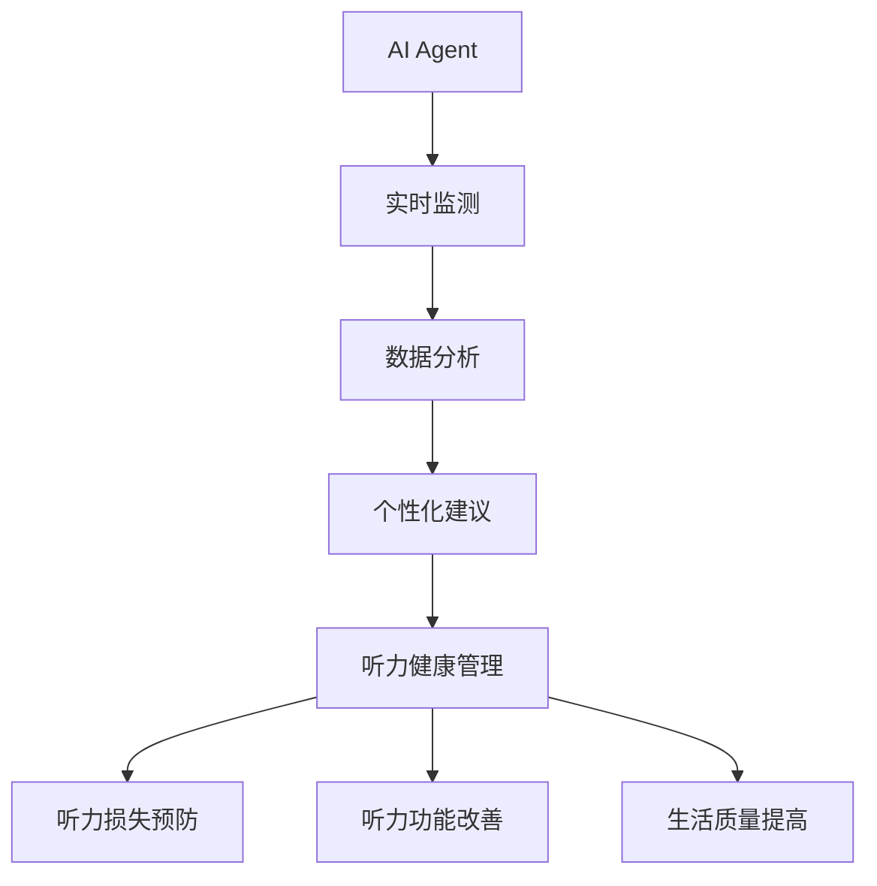

                 

### 文章标题

# AI Agent在智能耳机中的听力健康管理

关键词：AI Agent，智能耳机，听力健康管理，算法原理，系统设计，Python代码

摘要：本文深入探讨了AI Agent在智能耳机中的听力健康管理应用。通过详细的背景介绍、核心概念解析、算法原理讲解、数学模型分析、系统设计与实现等多个步骤，阐述了AI Agent在智能耳机中的重要作用和潜力。文章旨在为读者提供全面的技术见解，帮助理解AI Agent在听力健康管理中的实际应用。

---

**Step 1: 背景介绍**

在科技日新月异的今天，智能耳机已经成为人们日常生活中不可或缺的智能设备。随着AI技术的不断发展，智能耳机中的AI Agent（智能代理）逐渐成为提升用户体验的关键技术。AI Agent是一种能够模拟人类智能行为的计算机程序，它可以自动地完成特定任务，如语音识别、语音合成、情感分析等。在智能耳机中，AI Agent的应用不仅限于基本的通信功能，还可以扩展到更复杂的领域，如听力健康管理。

听力健康管理是一个涉及多个方面的复杂问题，它不仅关系到个体的听力健康，还影响到社交、工作和生活质量。然而，现有的听力健康管理方法往往依赖于定期的人工检测和干预，效率较低，且无法实时监测和调整。AI Agent的出现为听力健康管理提供了新的解决方案，它可以通过实时监测用户的听力状况，提供个性化的听力保护和建议，从而有效预防听力损失。

**Step 2: 核心概念与联系**

为了更好地理解AI Agent在智能耳机中的听力健康管理应用，我们需要先介绍AI Agent和听力健康管理的核心概念。

### 2.1 AI Agent的概念、特点和应用领域

AI Agent是指一种能够模拟人类智能行为的计算机程序，它具有自主性、协作性和适应性等特点。AI Agent可以自主地感知环境、理解指令、做出决策，并与其他系统或用户进行交互。其应用领域非常广泛，包括但不限于智能助手、智能交通、智能医疗、智能家居等。

在智能耳机中，AI Agent的应用主要体现在以下几个方面：

- **语音交互**：通过语音识别和语音合成技术，实现用户与智能耳机的自然语言交互。
- **环境监测**：实时监测用户周围的环境噪声，为用户提供个性化的听力保护。
- **健康监测**：通过传感器监测用户的生理参数，如心率、体温等，提供健康建议。

### 2.2 听力健康管理的概念、目标和评价指标

听力健康管理是指通过科学的方法，对个体的听力进行监测、评估和干预，以维持和改善听力功能，预防听力损失。听力健康管理的目标包括：

- **预防听力损失**：通过早期发现和干预，预防听力损失的发生。
- **改善听力功能**：通过康复训练和干预，提高听力损失患者的听力功能。
- **提高生活质量**：通过维护和改善听力，提高个体的社交、工作和生活质量。

听力健康管理的评价指标主要包括：

- **听力损失程度**：通过听力测试，评估个体的听力损失程度。
- **听力功能改善情况**：通过康复训练和干预，评估听力功能的改善情况。
- **生活质量变化**：通过问卷调查和访谈，评估个体生活质量的变化。

### 2.3 AI Agent与听力健康管理的关系

AI Agent在听力健康管理中的应用，主要体现在以下几个方面：

- **实时监测**：AI Agent可以通过传感器实时监测用户的听力状况，提供实时反馈和调整。
- **个性化建议**：根据用户的听力状况和需求，AI Agent可以提供个性化的听力保护和建议。
- **数据分析**：AI Agent可以对用户的听力数据进行深入分析，发现潜在问题，并提供解决方案。

使用Mermaid流程图展示AI Agent与听力健康管理之间的联系：

---

在接下来的章节中，我们将进一步探讨AI Agent在智能耳机中的听力健康管理算法原理、数学模型、系统设计与实现等内容，帮助读者全面了解这一前沿技术。

