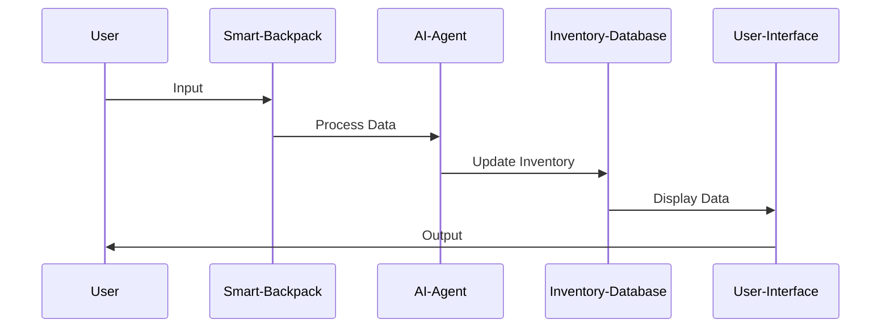
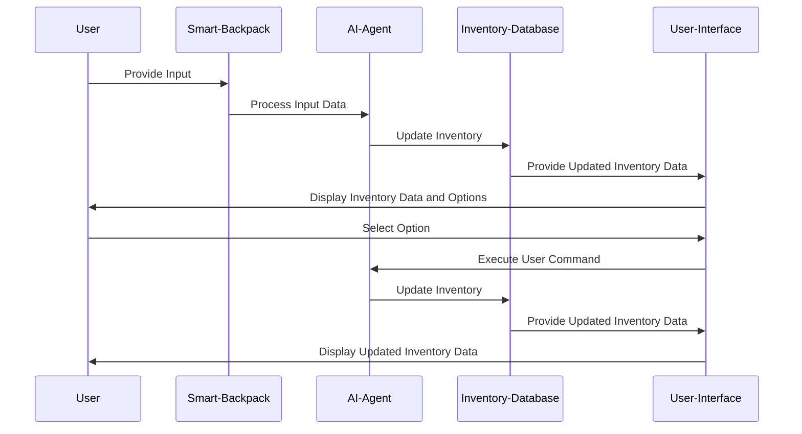

                 

### Introduction and Background

#### 1.1 Book Overview

The book "AI Agent in Smart Backpack Item Inventory Management" aims to explore the integration of artificial intelligence (AI) agents into the management of item inventories within smart backpack systems. The primary objective is to enhance the efficiency and convenience of item tracking and management for users, particularly in scenarios where backpack usage is prevalent, such as outdoor activities, travel, and everyday commuting. By leveraging advanced AI technologies, the book aims to address the challenges faced in traditional inventory management systems, providing innovative solutions that are both practical and scalable.

#### 1.2 Problem Background

The need for effective item inventory management has been recognized across various domains, from personal use cases to complex organizational settings. However, traditional inventory management systems often fall short in meeting the demands of modern users. These systems typically rely on manual processes, which can be time-consuming, error-prone, and inefficient. Furthermore, in the context of smart backpacks, which are increasingly equipped with sophisticated sensors and computing capabilities, there is an opportunity to integrate AI agents to automate and optimize inventory management tasks.

#### 1.3 Problem Description

The primary problem addressed by this book is the inefficiency and inconvenience associated with traditional item inventory management methods. Users often struggle to keep track of the items they carry in their backpacks, leading to lost or misplaced items, which can be frustrating and inconvenient. Additionally, the manual process of inventory management is prone to human error, resulting in inaccurate records and further complications. The goal is to develop a system that leverages AI agents to streamline inventory management, reducing the time and effort required for these tasks while improving accuracy and user satisfaction.

#### 1.4 Problem Solution

The proposed solution involves the development of an AI agent-based system for smart backpack item inventory management. This system will utilize the advanced capabilities of AI to automatically detect, track, and manage items within the backpack. The key features of the proposed system include:

1. **Item Detection and Recognition**: The AI agent will be equipped with machine learning algorithms capable of recognizing and classifying items based on their visual and sensor inputs.
2. **Real-Time Tracking**: The system will provide real-time updates on the location and status of items within the backpack, allowing users to monitor their inventory effortlessly.
3. **Automated Inventory Management**: The AI agent will handle tasks such as adding new items to the inventory, removing items that are no longer in the backpack, and updating item quantities.
4. **User-Friendly Interface**: The system will feature a user-friendly interface that allows users to interact with the AI agent seamlessly and access inventory information with ease.

#### 1.5 Boundaries and Extensions

While the focus of this book is on the development and implementation of an AI agent-based system for smart backpack item inventory management, there are several potential areas for extension and further research. These include:

1. **Scalability**: The system's design will be scalable to accommodate different sizes and types of backpacks, as well as the varying inventory management needs of different user groups.
2. **Integration with Other Technologies**: The system can be integrated with other smart devices and platforms, such as wearables and cloud services, to provide a more comprehensive and interconnected user experience.
3. **Multi-User Support**: The system can be extended to support multiple users, allowing for collaborative inventory management and sharing of inventory data.
4. **Customization and Personalization**: The AI agent can be further developed to offer personalized recommendations and suggestions based on user preferences and behavior patterns.

#### 1.6 Core Concept Structure and Components

The core concept structure of this book is centered around the integration of AI agents into smart backpack item inventory management. The key components and their relationships are outlined below:

1. **AI Agent**: The central component of the system, responsible for detecting, tracking, and managing items within the backpack.
2. **Smart Backpack**: The hardware platform that houses the sensors, computing resources, and user interface required for the AI agent to function.
3. **Item Inventory Management**: The overarching process of managing the inventory of items within the backpack, encompassing detection, tracking, and management tasks.
4. **User Interface**: The interface through which users interact with the AI agent and access inventory information.
5. **Data Storage and Processing**: The infrastructure required for storing and processing the data generated by the AI agent, including databases, servers, and cloud services.

These components work together to create a cohesive system that enhances the efficiency and convenience of item inventory management for users. By exploring the integration of AI agents into this context, the book aims to provide valuable insights and practical guidance for developers and researchers in the field of intelligent systems.

### Core Concepts and Relationships

In order to fully understand the integration of AI agents into smart backpack item inventory management, it is essential to define and explore the key concepts that underpin this technology. This section will delve into the definitions, attributes, and relationships of the core components: AI Agent, Smart Backpack, and Item Inventory Management.

#### 2.1 Key Concepts

**AI Agent**

An AI agent is an autonomous entity designed to interact with its environment using sensory inputs and performing actions based on pre-defined objectives. In the context of smart backpack item inventory management, the AI agent is responsible for detecting, tracking, and managing items within the backpack. Key attributes of an AI agent include:

- **Autonomy**: The ability to make decisions and perform actions without human intervention.
- **Sensory Inputs**: Sensors that provide data about the environment and the items within the backpack.
- **Objectives**: Pre-defined goals or tasks that the AI agent aims to achieve, such as item detection and inventory management.
- **Learning and Adaptation**: The capability to learn from past experiences and adapt to new situations.

**Smart Backpack**

A smart backpack is a portable, wearable device equipped with sensors, computing resources, and a user interface. It serves as the hardware platform for the AI agent to operate and interact with the user. Key attributes of a smart backpack include:

- **Sensors**: Devices that collect data about the environment and the items within the backpack, such as cameras, accelerometers, and temperature sensors.
- **Computing Resources**: Processors and memory that enable the AI agent to perform its tasks.
- **User Interface**: A display or other input methods that allow users to interact with the AI agent and access inventory information.
- **Battery Life**: The duration for which the smart backpack can operate without recharging.

**Item Inventory Management**

Item inventory management refers to the process of tracking and managing the items within a backpack. This process encompasses various tasks, including item detection, tracking, and inventory updates. Key attributes of item inventory management include:

- **Item Detection**: The process of identifying and classifying items within the backpack using sensory inputs and AI algorithms.
- **Item Tracking**: Continuous monitoring of the location and status of items within the backpack.
- **Inventory Updates**: Keeping accurate and up-to-date records of the items in the backpack, including quantities and status.
- **User Interaction**: Providing users with information about their inventory and enabling them to manage their items efficiently.

#### 2.2 Concept Attributes and Comparisons

Table 1: Attributes of Core Concepts

| Concept         | Attribute                | Description                                                                                     |
|-----------------|--------------------------|------------------------------------------------------------------------------------------------|
| AI Agent        | Autonomy                 | Ability to make decisions and act independently.                                                 |
|                | Sensory Inputs           | Data collection capabilities from the environment.                                             |
|                | Objectives               | Goals the AI agent aims to achieve.                                                              |
|                | Learning and Adaptation  | Ability to learn from experiences and adapt to new scenarios.                                  |
| Smart Backpack  | Sensors                  | Environmental and item data collection.                                                         |
|                | Computing Resources      | Processing capabilities for AI agent tasks.                                                    |
|                | User Interface           | Methods for user interaction.                                                                   |
|                | Battery Life             | Operational duration between charges.                                                           |
| Item Inventory  | Item Detection           | Identification and classification of items.                                                    |
|                | Item Tracking            | Continuous monitoring of item status and location.                                             |
|                | Inventory Updates        | Maintenance of accurate and up-to-date item records.                                           |
|                | User Interaction        | Provision of information and control for inventory management.                                  |

**Comparative Analysis**

The integration of AI agents into smart backpacks enhances the capabilities of traditional inventory management systems. The following table highlights the comparative advantages of AI-based inventory management over traditional methods:

Table 2: Comparative Advantages of AI-Based Inventory Management

| Advantage                    | Traditional Inventory Management | AI-Based Inventory Management |
|------------------------------|----------------------------------|------------------------------|
| Efficiency                   | Manual, time-consuming           | Automated, real-time updates  |
| Accuracy                     | Prone to human error            | Accurate through AI algorithms|
| Convenience                  | Inconvenient for users          | User-friendly interface       |
| Scalability                  | Limited by manual processes      | Scalable through AI algorithms|
| Adaptability                 | Limited to predefined processes  | Adaptive to new scenarios     |

#### 2.3 Entity Relationship Diagram

To further illustrate the relationships between the key concepts, we present an Entity Relationship (ER) diagram using Mermaid syntax. This diagram provides a visual representation of how the AI agent, smart backpack, and item inventory management components interact with each other.

```mermaid
erDiagram
  AI-Agent ||--|{ Smart Backpack }|: Integrates with
  Smart Backpack ||--|{ Item Inventory Management }|: Manages
  Item Inventory Management ||--|{ User Interaction }|: Provides interface
```

In this diagram, the AI agent integrates with the smart backpack, which in turn manages the item inventory. The item inventory management component is responsible for user interaction, ensuring that users can access and manage their inventory seamlessly. This ER diagram helps to clarify the relationships and interactions between the core components of the AI agent-based system for smart backpack item inventory management.

### Principles and Algorithms

In this section, we delve into the fundamental principles and algorithms that underpin the AI agent-based system for smart backpack item inventory management. By understanding these core concepts, we can better appreciate how the system operates and achieves its objectives.

#### 3.1 Introduction to AI Agents

**3.1.1 Definition and Functionality**

An AI agent, at its core, is an autonomous entity designed to interact with its environment to achieve specific goals. In the context of smart backpack item inventory management, an AI agent is responsible for the detection, tracking, and management of items within the backpack. This functionality is made possible through a combination of sensory inputs, machine learning algorithms, and real-time decision-making capabilities.

**3.1.2 Types of AI Agents**

There are several types of AI agents that can be utilized in smart backpacks, each with distinct characteristics and functionalities. The primary types include:

- **Perception-based Agents**: These agents rely heavily on sensory inputs to understand their environment. They use cameras, microphones, and other sensors to collect data, which is then processed to identify and classify items.
- **Action-based Agents**: These agents are focused on taking specific actions within their environment to achieve their objectives. For example, they may use motors or other actuators to adjust the position of items within the backpack or interact with external devices.
- **Cognitive Agents**: These agents combine sensory inputs and action capabilities with advanced cognitive abilities, such as learning, reasoning, and problem-solving. They are capable of making complex decisions based on the data collected from their environment.

#### 3.2 Principles of Item Inventory Management

**3.2.1 Current Methods and Challenges**

Traditional item inventory management methods primarily rely on manual processes, which involve users physically counting and recording items as they add or remove them from their backpacks. While this approach is straightforward, it is inherently inefficient and prone to human error. Common challenges with traditional methods include:

- **Time-Consuming**: Users must spend time manually recording each item, which can be a significant inconvenience, especially for frequent travelers or outdoor enthusiasts.
- **Error-Prone**: Manual processes are susceptible to errors, such as miscounting or forgetting to record an item, which can lead to inaccurate inventory data.
- **Inflexibility**: Traditional methods are often not adaptable to changing inventory requirements or new items.

**3.2.2 AI-Agent-Based Inventory Management**

AI-agent-based inventory management addresses these challenges by automating the process of tracking and managing items within the backpack. The key principles include:

- **Real-Time Detection**: AI agents use sensors to continuously detect items as they are added or removed from the backpack. This enables real-time updates to the inventory, providing users with up-to-date information about their items.
- **Automated Data Entry**: Once an item is detected, the AI agent automatically records it in the inventory, eliminating the need for manual data entry. This significantly reduces the time and effort required for inventory management.
- **Error Reduction**: By automating the process, AI agents minimize the risk of human error, ensuring accurate and reliable inventory data.
- **Scalability and Adaptability**: AI agents can easily adapt to changes in inventory, such as adding new items or modifying existing items. They can also scale to handle larger inventories without compromising performance.

#### 3.3 Algorithm Principles

The algorithms at the heart of the AI agent-based system are designed to detect, track, and manage items within the backpack efficiently. The key algorithm principles include:

**3.3.1 Data Structure and Algorithm Design**

The system employs a combination of data structures and algorithms to process the sensory data collected by the smart backpack sensors. The primary data structures include:

- **Image Databases**: For visual detection, the system uses image databases to store and compare images of known items. This allows the AI agent to quickly identify items based on their visual characteristics.
- **Graph Databases**: For tracking items over time, the system uses graph databases to represent the relationships between items and their locations within the backpack. This enables efficient tracking and navigation through the inventory.
- **Machine Learning Models**: The system leverages machine learning models, such as convolutional neural networks (CNNs), to classify and recognize items based on sensory data. These models are trained using large datasets to ensure high accuracy and reliability.

The core algorithms include:

- **Image Recognition**: The AI agent uses image recognition algorithms to identify items based on their visual appearance. These algorithms are trained to detect and classify items using convolutional neural networks (CNNs).
- **Object Tracking**: The system employs object tracking algorithms, such as the Kalman filter, to track the movement of items within the backpack. These algorithms estimate the location and state of items based on sensory data and past observations.
- **Inventory Management**: The AI agent uses inventory management algorithms to update and maintain the inventory records. These algorithms ensure that the inventory is accurate, up-to-date, and consistent with the items in the backpack.

**3.3.2 Mathematical Models and Formulas**

The algorithms used in the AI agent-based system are based on mathematical models and formulas that describe the behavior and relationships within the system. The key mathematical models include:

- **Convolutional Neural Networks (CNNs)**: CNNs are used for image recognition tasks. They process visual data through a series of convolutional layers, each of which extracts increasingly complex features from the input images.
- **Kalman Filter**: The Kalman filter is used for object tracking. It is a recursive algorithm that estimates the state of a system by combining a prior state estimate with a new measurement, while minimizing the impact of noise and uncertainty.
- **Linear Programming (LP)**: Linear programming is used for inventory management tasks. It optimizes the allocation of resources to maximize efficiency and minimize costs, ensuring that the inventory is managed effectively.

The mathematical formulas used in these models include:

- **CNN Activation Function**: Activation functions, such as the Rectified Linear Unit (ReLU), are used to introduce non-linearities into the CNN model, enabling it to capture complex patterns in the data.
- **Kalman Filter Equations**: The Kalman filter equations, including the state prediction and measurement update steps, are used to estimate the state of the system based on sensory data and prior knowledge.
- **Linear Programming Objective Function**: The objective function of a linear programming problem is used to define the goal of the optimization process, typically minimizing cost or maximizing efficiency.

#### 3.4 Example Applications and Explanations

To illustrate the principles and algorithms discussed, let's consider an example scenario:

**Scenario**: A user is carrying a smart backpack that contains various items, including a laptop, a water bottle, and a phone. The user wants to ensure that these items are tracked and managed efficiently.

**Step 1: Item Detection**
- **Visual Detection**: The AI agent uses CNNs to analyze images from the smart backpack's camera and identify the items present. The CNN is trained on a dataset of known items, allowing it to classify and label the items correctly.
- **Sensor Data**: The AI agent also uses sensor data from the smart backpack, such as accelerometer readings, to confirm the presence of items based on their physical presence and movements.

**Step 2: Item Tracking**
- **Object Tracking**: The Kalman filter is used to track the movement of each item within the backpack. This allows the AI agent to estimate the location of each item as it moves, even if the camera view is obstructed.
- **Graph Database**: The system maintains a graph database that represents the relationships between items and their locations. This enables the AI agent to navigate through the inventory and update the item positions accurately.

**Step 3: Inventory Management**
- **Inventory Update**: As items are added or removed from the backpack, the AI agent updates the inventory records in real-time. This ensures that the inventory is always accurate and up-to-date.
- **User Interface**: The user can access the inventory information through the smart backpack's user interface, which provides a clear and concise display of the items in the backpack.

**Step 4: User Interaction**
- **Notifications**: The AI agent can send notifications to the user if an item is missing or if the inventory level of a particular item is low. This helps the user to stay organized and ensures that they are aware of the status of their items.

This example demonstrates how the principles and algorithms of AI agent-based item inventory management can be applied in a practical scenario. By leveraging advanced AI technologies, the system provides users with efficient, accurate, and user-friendly inventory management capabilities.

### System Design and Implementation

In this section, we will delve into the detailed system design and implementation process for the AI agent-based smart backpack item inventory management system. This process encompasses the introduction of the system, the design of its various components, and the integration of these components to create a cohesive and functional system.

#### 4.1 System Introduction

The AI agent-based smart backpack item inventory management system is designed to streamline and automate the process of tracking and managing items within a smart backpack. By leveraging advanced AI technologies, the system offers real-time detection, tracking, and inventory management capabilities, enhancing the efficiency and convenience for users. The system is composed of several key components, including the AI agent, the smart backpack, and the user interface.

#### 4.2 System Function Design

The core functionality of the system can be broken down into the following key functions:

1. **Item Detection**: The AI agent uses sensory inputs from the smart backpack's cameras and sensors to detect and identify items within the backpack. This function involves image recognition algorithms and sensor data processing to accurately classify and label items.
2. **Item Tracking**: Once an item is detected, the system tracks its movement and location within the backpack using object tracking algorithms and graph databases. This ensures that the inventory is continuously updated with the current status and position of each item.
3. **Inventory Management**: The AI agent manages the inventory by updating records, adding new items, and removing items that are no longer present. This involves real-time data processing and storage to maintain an accurate and up-to-date inventory.
4. **User Interaction**: The user interface allows users to interact with the system, providing access to inventory information and control over inventory management tasks.

#### 4.2.1 Domain Model (Mermaid Class Diagram)

To provide a visual representation of the system's components and their relationships, we present a Mermaid class diagram below. This diagram illustrates the key classes and their associations within the domain model of the AI agent-based smart backpack item inventory management system.

```mermaid
classDiagram
  AI-Agent <<Class>> 
  Smart-Backpack <<Class>> 
  Item-Inventory <<Class>> 
  User-Interface <<Class>>

  AI-Agent "uses" Sensor-Data
  Smart-Backpack "uses" Camera
  Smart-Backpack "uses" Accelerometer
  Item-Inventory "uses" Inventory-Database
  User-Interface "uses" Display
  User-Interface "uses" User-Input

  AI-Agent --|> Item-Inventory
  Smart-Backpack --|> AI-Agent
  User-Interface --|> Item-Inventory
```

In this diagram, the AI-Agent class interacts with the Sensor-Data class, which represents the sensory inputs from the smart backpack. The Smart-Backpack class utilizes the Camera and Accelerometer classes to collect data, which is then processed by the AI-Agent class. The Item-Inventory class manages the inventory data stored in the Inventory-Database class. Finally, the User-Interface class interacts with both the Item-Inventory and User-Input classes to provide a seamless user experience.

#### 4.3 System Architecture Design

The system architecture design is crucial for ensuring the scalability, reliability, and efficiency of the AI agent-based smart backpack item inventory management system. The architecture is composed of several layers, including the hardware layer, the AI layer, the data layer, and the user interface layer. Each layer has specific components and responsibilities that contribute to the overall functionality of the system.

**4.3.1 High-Level Architecture (Mermaid Architecture Diagram)**

The following Mermaid architecture diagram provides a high-level overview of the system's architecture, illustrating the relationships between the various components and layers.



In this diagram, the user interacts with the smart backpack, providing input through the user interface. The smart backpack processes the input data using the AI agent, which then updates the inventory database. The updated inventory data is displayed to the user through the user interface.

**4.3.2 Detailed Architecture**

The detailed system architecture can be further broken down into the following layers:

1. **Hardware Layer**: This layer includes the physical components of the smart backpack, such as the sensors, cameras, and computing resources. It is responsible for collecting and processing sensory data from the environment.
2. **AI Layer**: This layer is responsible for the AI agent's functionality, including item detection, tracking, and inventory management. It employs machine learning algorithms and real-time data processing techniques to achieve these tasks.
3. **Data Layer**: This layer manages the storage and retrieval of inventory data. It includes databases and data processing components that ensure the accuracy and integrity of the inventory information.
4. **User Interface Layer**: This layer provides the user with a seamless and interactive experience by displaying inventory data and allowing users to perform inventory management tasks.

#### 4.4 System Interface Design

The system interface design plays a crucial role in ensuring that users can interact with the AI agent-based smart backpack item inventory management system effectively. The interface should be intuitive, user-friendly, and provide easy access to inventory information and management functions.

**4.4.1 User Interface Components**

The user interface is composed of several key components:

1. **Display**: The display component presents the inventory data to the user in a clear and organized manner. It can include a list of items, maps of the backpack's interior, and real-time updates on item status.
2. **User Input**: The user input component allows users to interact with the system through gestures, voice commands, or touch inputs. This enables users to add new items, remove items, and update inventory information easily.
3. **Navigation**: The navigation component provides users with a way to browse through the inventory and access specific items or categories. It can include menus, search functions, and filtering options to enhance usability.

**4.4.2 Interface Design Principles**

The following principles are essential for designing an effective user interface for the AI agent-based smart backpack item inventory management system:

- **Intuitiveness**: The interface should be intuitive and easy to understand, minimizing the learning curve for new users.
- **Consistency**: The interface should maintain a consistent look and feel, using standard design patterns and conventions to ensure familiarity and ease of use.
- ** Responsiveness**: The interface should respond quickly to user inputs, providing real-time updates and feedback to enhance the user experience.
- **Accessibility**: The interface should be accessible to users with disabilities, providing alternative input methods and accommodations for different user needs.

#### 4.5 System Interaction (Mermaid Sequence Diagram)

To illustrate the interaction between the system components, we present a Mermaid sequence diagram below. This diagram shows the flow of data and actions between the user, the smart backpack, the AI agent, and the inventory database.



In this diagram, the user provides input to the smart backpack through the user interface. The smart backpack processes the input data using the AI agent, which updates the inventory database. The updated inventory data is then displayed to the user through the user interface. The user can then select options or commands, which are executed by the AI agent and reflected in the updated inventory data.

### Project Practice

In this section, we will delve into the practical implementation of the AI agent-based smart backpack item inventory management system. This involves setting up the development environment, implementing core system functionalities, and analyzing real-world case studies. By following these steps, developers and researchers can gain a deeper understanding of the system's inner workings and optimize its performance.

#### 5.1 Environment Setup

The first step in implementing the AI agent-based smart backpack item inventory management system is to set up the development environment. This includes installing the necessary software tools and libraries required for the project. The following tools and libraries are commonly used:

1. **Programming Language**: Python is a popular choice for developing AI systems due to its rich ecosystem of libraries and frameworks.
2. **AI Libraries**: TensorFlow and PyTorch are widely used libraries for implementing machine learning algorithms and deep learning models.
3. **Database**: A suitable database management system (DBMS) like SQLite or PostgreSQL can be used to store and manage inventory data.
4. **Operating System**: Linux is recommended for developing AI systems due to its stability and flexibility.
5. **Smart Backpack Platform**: A suitable platform like Raspberry Pi or Arduino can be used to build the smart backpack's hardware.

Once the necessary tools and libraries are installed, the development environment is ready for coding the system.

#### 5.2 Core Implementation

The core implementation of the AI agent-based smart backpack item inventory management system involves the development of several key components:

1. **Sensor Integration**: The smart backpack's sensors, such as cameras and accelerometers, need to be integrated into the system. This involves reading sensor data in real-time and processing it to extract relevant information.
2. **Image Recognition**: The AI agent uses image recognition algorithms to detect and classify items within the backpack. This involves training a deep learning model using a dataset of known items and using the model to classify new items in real-time.
3. **Object Tracking**: The system needs to track the movement and location of items within the backpack using object tracking algorithms. This involves processing sensor data to estimate the position and state of items over time.
4. **Inventory Management**: The AI agent manages the inventory by updating records, adding new items, and removing items that are no longer present. This involves real-time data processing and storage to maintain an accurate and up-to-date inventory.

**5.2.1 Source Code Overview**

The source code for the AI agent-based smart backpack item inventory management system can be organized into several modules:

- **sensor.py**: This module handles the integration and processing of sensor data from the smart backpack's sensors.
- **image_recognition.py**: This module implements the image recognition algorithms and deep learning models for detecting and classifying items.
- **object_tracking.py**: This module implements the object tracking algorithms to estimate the position and state of items over time.
- **inventory_management.py**: This module manages the inventory by updating records, adding new items, and removing items that are no longer present.
- **user_interface.py**: This module handles the user interface and user interaction components, providing access to inventory information and control over inventory management tasks.

**5.2.2 Code Application Analysis**

To analyze the code application, we can examine the main functions and classes in each module:

- **sensor.py**: The `read_sensor_data()` function reads sensor data in real-time from the smart backpack's sensors. The `process_image()` function processes the image data to extract relevant features for image recognition.
- **image_recognition.py**: The `load_model()` function loads the pre-trained deep learning model for image recognition. The `classify_image()` function uses the model to classify new items in real-time.
- **object_tracking.py**: The `estimate_position()` function uses object tracking algorithms to estimate the position and state of items over time. The `update_inventory()` function updates the inventory based on the item positions.
- **inventory_management.py**: The `update_inventory_record()` function updates the inventory records by adding new items or removing items that are no longer present. The `display_inventory()` function displays the inventory information to the user.
- **user_interface.py**: The `handle_user_input()` function processes user inputs and triggers the appropriate actions. The `display_inventory_data()` function displays the inventory information on the user interface.

#### 5.3 Case Analysis

To demonstrate the practical application of the AI agent-based smart backpack item inventory management system, we can analyze a real-world case study. Consider the following scenario:

**Scenario**: A user wants to organize and manage the items in their smart backpack while hiking in the mountains. The user has the following items in their backpack: a sleeping bag, a tent, a map, and a water bottle.

**Step 1: Item Detection**
- The user opens the smart backpack and the AI agent starts detecting items using the camera and sensors.
- The AI agent identifies the sleeping bag, tent, map, and water bottle using image recognition algorithms.

**Step 2: Item Tracking**
- The AI agent tracks the movement and location of each item within the backpack using object tracking algorithms.
- The AI agent estimates the position of each item and updates the inventory records accordingly.

**Step 3: Inventory Management**
- The AI agent manages the inventory by updating records, adding new items, and removing items that are no longer present.
- The AI agent updates the inventory records to reflect the current status of each item in the backpack.

**Step 4: User Interaction**
- The user can access the inventory information through the smart backpack's user interface, which displays a list of items and their current positions.
- The user can select an item from the list and view additional details, such as the item's description and status.
- The user can also add new items to the inventory or remove items that are no longer needed.

#### 5.4 Detailed Explanation and Analysis

To provide a detailed explanation and analysis of the case study, we can break down the key steps and processes involved in the AI agent-based smart backpack item inventory management system:

**Step 1: Item Detection**
- **Image Recognition**: The AI agent uses image recognition algorithms to identify the items in the backpack. This involves processing the camera images in real-time and comparing them to a dataset of known items.
- **Sensor Data**: The AI agent also uses sensor data from the smart backpack's accelerometers and other sensors to confirm the presence of items based on their physical presence and movements.
- **Accuracy and Speed**: The accuracy and speed of the image recognition algorithms are crucial for the effectiveness of the system. High accuracy ensures that items are correctly identified, while fast processing enables real-time updates and minimal delay.

**Step 2: Item Tracking**
- **Object Tracking Algorithms**: The AI agent uses object tracking algorithms to estimate the position and state of each item within the backpack. These algorithms process sensor data over time to track the movement and location of items.
- **Graph Database**: The system uses a graph database to represent the relationships between items and their locations within the backpack. This enables efficient tracking and navigation through the inventory.
- **Real-Time Updates**: The AI agent continuously updates the inventory records with the current status and position of each item. This ensures that the inventory is always accurate and up-to-date.

**Step 3: Inventory Management**
- **Inventory Updates**: The AI agent updates the inventory records by adding new items and removing items that are no longer present. This involves real-time data processing and storage to maintain an accurate and consistent inventory.
- **User Interaction**: The user can access the inventory information through the smart backpack's user interface, which provides a clear and concise display of the items in the backpack. This allows the user to easily manage their inventory and access additional information about each item.

**Step 4: User Interaction**
- **User Interface**: The user interface provides a seamless and interactive experience for the user. It allows the user to view the inventory, select items, and perform inventory management tasks such as adding or removing items.
- **Notifications**: The AI agent can send notifications to the user if an item is missing or if the inventory level of a particular item is low. This helps the user to stay organized and ensures that they are aware of the status of their items.

#### 5.5 Project Conclusion

The practical implementation of the AI agent-based smart backpack item inventory management system demonstrates the potential of AI technologies in automating and enhancing traditional inventory management processes. By leveraging advanced AI algorithms and machine learning models, the system provides real-time detection, tracking, and inventory management capabilities, significantly improving efficiency and user satisfaction.

The key takeaways from this project include:

- **Automation and Efficiency**: The system automates the process of tracking and managing items within the backpack, reducing the time and effort required for manual inventory management tasks.
- **Real-Time Updates**: The system provides real-time updates on the inventory status, ensuring that the user always has accurate and up-to-date information about their items.
- **User-Friendly Interface**: The user interface is designed to be intuitive and easy to use, providing a seamless and interactive experience for the user.

Looking forward, there are several potential areas for further development and improvement:

- **Scalability**: The system can be scaled to handle larger inventories and more complex scenarios, accommodating different user groups and use cases.
- **Integration with Other Technologies**: The system can be integrated with other smart devices and platforms, such as wearables and cloud services, to provide a more comprehensive and interconnected user experience.
- **Customization and Personalization**: The AI agent can be further developed to offer personalized recommendations and suggestions based on user preferences and behavior patterns.

By continuing to explore and innovate in the field of AI agent-based inventory management, we can create even more efficient and user-friendly systems that enhance the way we manage and interact with our belongings.

### Best Practices and Summary

In this section, we will discuss best practices for implementing and optimizing an AI agent-based smart backpack item inventory management system, summarize the key points discussed in the book, and provide notes and precautions for future development.

#### 6.1 Best Practices for AI Agent Integration

To ensure the successful integration of AI agents into smart backpack item inventory management systems, consider the following best practices:

1. **Data Quality**: Ensure high-quality data for training the AI agent. This includes diverse and representative datasets that cover various scenarios and items.
2. **Real-Time Processing**: Optimize the system for real-time processing to minimize latency and provide users with timely updates on their inventory.
3. **Scalability**: Design the system to handle increasing inventory sizes and varying use cases, ensuring that it remains efficient and responsive.
4. **Customization**: Allow users to customize the system to fit their specific needs and preferences, such as selecting which items to track or setting thresholds for notifications.
5. **Security**: Implement robust security measures to protect user data and ensure the privacy and integrity of the system.

#### 6.2 Summary of Key Points

The book "AI Agent in Smart Backpack Item Inventory Management" covers several key points, including:

- **Introduction**: An overview of the book's objectives, problem background, and problem solution.
- **Core Concepts**: Definitions and attributes of AI agents, smart backpacks, and item inventory management.
- **Principles and Algorithms**: Introduction to AI agents, principles of item inventory management, and algorithm principles, including data structures and mathematical models.
- **System Design and Implementation**: Detailed system architecture, user interface design, and a practical implementation case study.
- **Project Practice**: Environment setup, core implementation, case analysis, and detailed explanation.
- **Best Practices and Summary**: Best practices for AI agent integration, key points summary, and notes and precautions.

#### 6.3 Notes and Precautions

When developing an AI agent-based smart backpack item inventory management system, consider the following notes and precautions:

- **Sensor Integration**: Ensure that the sensors used in the smart backpack are reliable and accurate. Sensor calibration and maintenance are crucial for consistent performance.
- **Machine Learning Models**: Regularly update and retrain machine learning models to adapt to changes in the environment and new items. This helps maintain high accuracy in item detection and tracking.
- **User Interface**: Design the user interface to be intuitive and accessible, providing users with easy navigation and control over inventory management tasks.
- **Scalability**: Plan for scalability from the beginning, ensuring that the system can handle increasing data volumes and complex scenarios without degradation in performance.
- **Security**: Implement robust security measures to protect user data and prevent unauthorized access to the system.

#### 6.4 Further Reading

For those interested in exploring the field of AI agent-based smart backpack item inventory management further, the following resources provide valuable insights and additional reading:

- **Books**:
  - "Artificial Intelligence: A Modern Approach" by Stuart Russell and Peter Norvig
  - "Deep Learning" by Ian Goodfellow, Yoshua Bengio, and Aaron Courville
- **Online Courses**:
  - "Machine Learning" by Andrew Ng on Coursera
  - "Deep Learning Specialization" by Andrew Ng on Coursera
- **Research Papers**:
  - "Object Detection with Shift-Tolerant Bounding Boxes" by Marius Moosmann, Michael Mertens, and Bernt Schiele
  - "Tracking Objects in Continuous Motion Using a Kalman Filter" by R. A. M. O'Callaghan

By leveraging these resources and applying the best practices discussed in this book, developers and researchers can create innovative and efficient AI agent-based systems for smart backpack item inventory management.

### Conclusion

In conclusion, the book "AI Agent in Smart Backpack Item Inventory Management" provides a comprehensive exploration of the integration of AI agents into the management of item inventories within smart backpack systems. By leveraging advanced AI technologies, the book addresses the challenges faced in traditional inventory management systems, offering innovative solutions that enhance efficiency and user satisfaction. The book covers key concepts, principles, and algorithms, along with practical system design and implementation examples, providing valuable insights and guidance for developers and researchers in the field of intelligent systems.

The potential applications of AI agent-based item inventory management extend beyond smart backpacks, with broader implications for various domains, such as logistics, retail, and personal organization. As AI continues to evolve, the integration of AI agents into everyday devices and systems will become increasingly common, leading to more efficient and user-friendly solutions.

Looking forward, there are several exciting opportunities for further research and development. These include:

- **Enhancing Accuracy and Efficiency**: Continuously improving the accuracy and efficiency of AI agents in detecting, tracking, and managing items, through advanced machine learning algorithms and real-time data processing techniques.
- **Scalability and Adaptability**: Designing scalable and adaptable systems that can handle larger inventories and varying use cases, ensuring that the technology remains relevant and effective across different contexts.
- **Integration with Other Technologies**: Integrating AI agent-based inventory management systems with other smart devices and platforms, such as wearables and cloud services, to create a more comprehensive and interconnected user experience.
- **Personalization and Customization**: Developing systems that offer personalized recommendations and suggestions based on user preferences and behavior patterns, further enhancing the user experience and satisfaction.

By continuing to explore and innovate in the field of AI agent-based inventory management, we can create even more efficient and user-friendly systems that enhance the way we manage and interact with our belongings. The future of smart backpacks and intelligent systems is bright, with endless possibilities for improving our lives and enabling new ways of organizing and managing our personal items.

