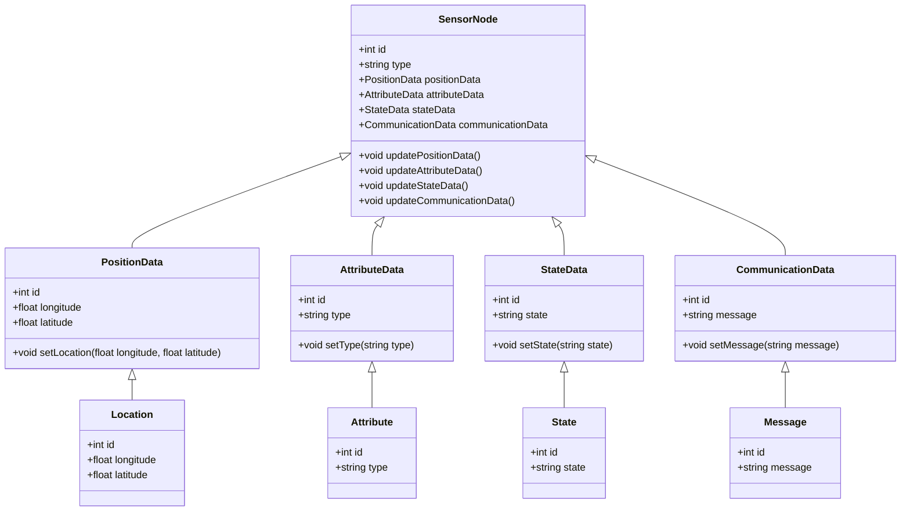
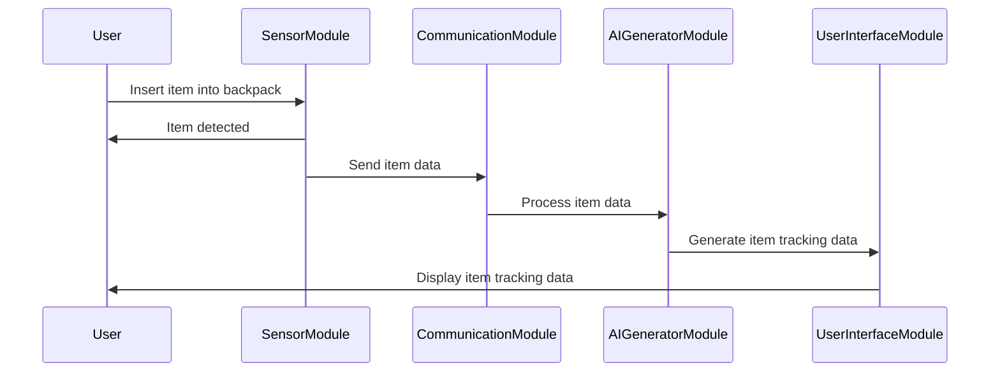
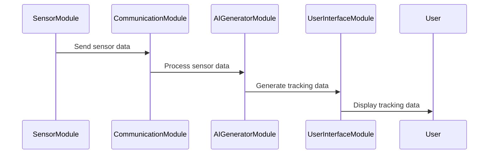

                 

# AI Agent在智能背包中的物品追踪

> 关键词：AI Agent、智能背包、物品追踪、算法实现、系统设计

> 摘要：本文将探讨AI Agent在智能背包物品追踪中的应用。首先介绍AI Agent和物品追踪技术的基本概念，然后分析AI Agent在智能背包物品追踪中的应用优势、挑战及解决方案。接着，本文详细讲解物品追踪算法原理，包括常见算法的介绍、数学模型建立与算法流程图解析。随后，本文讨论智能背包系统设计与实现，包括系统架构设计、接口设计和系统交互设计。最后，通过Python实现一个简单的物品追踪算法，并进行实际案例分析，总结最佳实践。

----------------------------------------------------------------

## 第一部分：AI Agent在智能背包中的物品追踪背景与核心概念

### 第1章：AI Agent与物品追踪技术概述

#### 1.1 AI Agent的起源与定义

##### 1.1.1 AI Agent的定义

AI Agent，即人工智能代理，是一种基于人工智能技术的自动执行任务的实体。它可以模拟人类智能行为，实现感知、决策和执行等功能。AI Agent通常由感知模块、决策模块和行动模块组成，通过不断学习与优化，实现自主适应环境和完成复杂任务。

##### 1.1.2 AI Agent的发展历程

AI Agent的发展可以追溯到20世纪50年代，当时计算机科学家提出了基于规则的专家系统。随着时间推移，AI Agent逐渐从规则驱动发展到基于模型的学习与优化。近年来，深度学习、强化学习等技术的发展，使得AI Agent在复杂环境中的表现越来越优异。

##### 1.1.3 AI Agent的基本功能与应用场景

AI Agent具有感知、决策和行动等基本功能。在应用场景方面，AI Agent广泛应用于智能助手、智能机器人、自动驾驶等领域。例如，智能背包中的AI Agent可用于实时监测背包内物品的位置和状态，提高物品管理的效率。

#### 1.2 物品追踪技术的发展

##### 1.2.1 物品追踪技术的定义

物品追踪技术是指利用各种传感器、通信技术和算法，实现对物品位置、状态和属性的实时监测与追踪。

##### 1.2.2 物品追踪技术的历史演变

物品追踪技术经历了从手动记录、RFID（射频识别）到现代基于传感器和无线通信技术的演变。近年来，随着物联网、人工智能等技术的发展，物品追踪技术逐渐从单一的技术向综合、智能化的方向发展。

##### 1.2.3 当前主流的物品追踪技术

当前主流的物品追踪技术包括RFID、超宽带（UWB）、无线传感器网络（WSN）等。这些技术在定位精度、通信距离、成本等方面各具优势，可根据实际需求进行选择。

#### 1.3 AI Agent在智能背包物品追踪中的应用

##### 1.3.1 智能背包的概念与功能

智能背包是一种集成了多种传感器、通信模块和AI Agent的便携式设备。它可以实时监测背包内物品的位置、状态和属性，为用户提供了便捷的物品管理服务。

##### 1.3.2 AI Agent在智能背包物品追踪中的优势

AI Agent在智能背包物品追踪中具有以下优势：

1. **实时监测**：AI Agent可以实时监测背包内物品的位置和状态，为用户提供实时信息。
2. **自主决策**：AI Agent可以根据用户需求和环境变化，自主调整追踪策略。
3. **智能分析**：AI Agent可以基于历史数据和实时数据，对物品进行智能分析，提供个性化推荐。

##### 1.3.3 AI Agent在智能背包物品追踪中的挑战与解决方案

AI Agent在智能背包物品追踪中面临的挑战主要包括：

1. **数据噪声**：环境中的噪声和干扰会影响物品追踪的准确性。为解决这一问题，可以采用滤波算法和误差校正技术。
2. **能源消耗**：智能背包需要长时间运行，能源消耗是一个重要问题。为降低能源消耗，可以采用节能算法和设备休眠机制。
3. **隐私保护**：智能背包需要收集和处理用户隐私数据。为保护用户隐私，可以采用加密技术和隐私保护算法。

##### 1.4 物品追踪技术的核心概念与联系

###### 1.4.1 核心概念原理

物品追踪技术涉及的核心概念包括传感器、定位算法、数据通信和数据分析等。这些概念共同构成了物品追踪系统的基本框架。

###### 1.4.2 概念属性特征对比表格

| 概念        | 特征1 | 特征2 | 特征3 |
| ----------- | ----- | ----- | ----- |
| 传感器      | 高精度 | 实时性 | 低功耗 |
| 定位算法    | 精度高 | 快速性 | 容量大 |
| 数据通信    | 高带宽 | 低延迟 | 可靠性 |
| 数据分析    | 智能化 | 实时性 | 精准性 |

###### 1.4.3 ER实体关系图架构

```mermaid
erDiagram
  Product ||--|{ TrackingData }|>
  TrackingData ||--|{ Location }|>
  Location ||--|{ Time }|>

  Product {
    +int id
    +string name
    +float price
  }

  TrackingData {
    +int id
    +int product_id
    +string type
  }

  Location {
    +int id
    +int tracking_data_id
    +float longitude
    +float latitude
  }

  Time {
    +int id
    +int location_id
    +string timestamp
  }
```

##### 1.5 本章小结

本章介绍了AI Agent和物品追踪技术的基本概念、发展历程和应用场景。通过对比分析AI Agent在智能背包物品追踪中的优势与挑战，为后续章节的深入研究奠定了基础。

----------------------------------------------------------------

## 第二部分：智能背包物品追踪的算法原理

### 第2章：物品追踪算法基础

#### 2.1 物品追踪算法概述

##### 2.1.1 物品追踪算法的分类

物品追踪算法可以分为基于位置、基于行为和基于数据三种类型。基于位置追踪算法主要利用传感器定位技术实现物品位置的实时监测；基于行为追踪算法主要根据物品的运动轨迹和状态变化进行追踪；基于数据追踪算法则通过分析物品的历史数据和关联关系实现追踪。

##### 2.1.2 物品追踪算法的关键特性

物品追踪算法的关键特性包括：

1. **实时性**：算法能够实时获取物品的位置和状态信息。
2. **准确性**：算法的定位精度要满足实际应用需求。
3. **可靠性**：算法在噪声和干扰环境下仍能稳定运行。
4. **高效性**：算法的计算效率要满足实时处理的需求。

##### 2.1.3 物品追踪算法的基本流程

物品追踪算法的基本流程包括：

1. **数据采集**：利用传感器采集物品的位置、状态和属性信息。
2. **预处理**：对采集到的数据进行去噪、滤波等预处理。
3. **定位算法**：根据预处理后的数据，利用定位算法计算物品的位置。
4. **数据存储**：将定位结果存储到数据库或缓存中，以供后续分析和查询。

#### 2.2 常见的物品追踪算法介绍

##### 2.2.1 超宽带（UWB）技术

###### 2.2.1.1 UWB技术的原理与特点

UWB（超宽带）技术是一种基于宽带信号传输的无线通信技术。其原理是利用高频脉冲信号在信道中进行传输，通过接收信号的时延和强度信息实现定位和追踪。

UWB技术的特点包括：

1. **高精度**：UWB技术具有高精度的定位能力，适用于对定位精度要求较高的场景。
2. **抗干扰性强**：UWB信号具有低功耗、低干扰的特点，适用于复杂环境下的物品追踪。
3. **传输带宽大**：UWB技术支持大带宽传输，适用于传输大量数据的应用场景。

###### 2.2.1.2 UWB技术在物品追踪中的应用

UWB技术在物品追踪中的应用主要包括：

1. **实时定位**：利用UWB技术实现物品位置的实时监测和追踪。
2. **状态监测**：通过分析UWB信号强度变化，监测物品的状态变化。
3. **路径规划**：根据物品的实时位置和状态信息，为机器人等智能设备提供路径规划。

##### 2.2.2 无线传感器网络（WSN）

###### 2.2.2.1 WSN的原理与结构

无线传感器网络（WSN）是由大量传感器节点组成的分布式网络，可以感知、采集和处理环境信息。WSN的原理是利用无线通信技术，将传感器节点的数据传输到中心节点，进行数据融合和综合分析。

WSN的结构主要包括：

1. **传感器节点**：负责感知和采集环境信息。
2. **网关节点**：负责将传感器节点的数据传输到中心节点。
3. **中心节点**：负责对传感器节点的数据进行处理和分析。

###### 2.2.2.2 WSN在物品追踪中的应用

WSN在物品追踪中的应用主要包括：

1. **实时监测**：利用传感器节点实时监测物品的位置和状态信息。
2. **数据融合**：通过对多个传感器节点的数据进行融合，提高定位和追踪的准确性。
3. **智能决策**：基于物品的实时位置和状态信息，为智能设备提供决策支持。

#### 2.3 算法原理详细讲解

##### 2.3.1 物品追踪算法的数学模型

###### 2.3.1.1 模型的建立

物品追踪算法的数学模型可以表示为：

$$
x_t = f(x_{t-1}, u_t, w_t)
$$

其中，$x_t$表示时刻$t$的物品位置，$u_t$表示时刻$t$的输入（如传感器数据），$w_t$表示时刻$t$的噪声。

###### 2.3.1.2 模型的分析

物品追踪算法的数学模型分析主要包括：

1. **稳定性分析**：分析模型在噪声和干扰环境下的稳定性。
2. **收敛性分析**：分析模型在迭代过程中的收敛性。
3. **误差分析**：分析模型在定位和追踪过程中的误差特性。

##### 2.3.2 算法流程图

$$
\text{算法流程图示例}
$$

##### 2.3.3 算法举例说明

###### 2.3.3.1 案例一：UWB技术追踪物品

案例一利用UWB技术实现物品的实时定位和追踪。具体步骤如下：

1. 传感器节点采集物品的UWB信号，计算信号的时延和强度。
2. 网关节点将传感器节点的数据进行预处理和融合，生成物品的实时位置信息。
3. 中心节点根据物品的实时位置信息，生成物品的追踪轨迹。

###### 2.3.3.2 案例二：WSN追踪物品

案例二利用WSN技术实现物品的实时监测和追踪。具体步骤如下：

1. 传感器节点采集物品的位置和状态信息，将数据传输到网关节点。
2. 网关节点对传感器节点的数据进行融合和预处理，生成物品的实时状态信息。
3. 中心节点根据物品的实时状态信息，生成物品的追踪轨迹，并提供给智能设备进行路径规划。

#### 2.4 本章小结

本章介绍了智能背包物品追踪算法的基本概念、分类和常见算法。通过详细讲解算法原理和举例说明，为后续章节的算法实现和优化奠定了基础。

----------------------------------------------------------------

## 第三部分：智能背包物品追踪系统设计与实现

### 第3章：智能背包系统架构设计

#### 3.1 系统介绍

##### 3.1.1 智能背包系统的概念

智能背包系统是一种集成了传感器、通信模块和AI Agent的便携式设备，用于实时监测背包内物品的位置、状态和属性。智能背包系统主要由硬件和软件两部分组成。

##### 3.1.2 智能背包系统的功能模块

智能背包系统的功能模块主要包括：

1. **传感器模块**：负责感知背包内物品的位置、状态和属性信息。
2. **通信模块**：负责将传感器模块采集的数据传输到中心节点。
3. **AI Agent模块**：负责对传感器模块采集的数据进行分析和处理，生成物品的追踪轨迹和状态信息。
4. **用户界面模块**：负责向用户展示物品的追踪轨迹和状态信息，并提供交互功能。

##### 3.1.3 智能背包系统的应用场景

智能背包系统的应用场景包括：

1. **物流与仓储**：用于实时监测物流车辆和仓储货物的位置和状态，提高物流和仓储的效率。
2. **医疗与健康**：用于监测患者的随身物品和健康状况，为医疗和健康提供数据支持。
3. **个人物品管理**：用于实时监测背包内个人物品的位置和状态，提高个人物品管理的效率。

#### 3.2 系统功能设计

##### 3.2.1 领域模型

领域模型是智能背包系统功能设计的核心，用于描述系统的核心概念和关系。领域模型主要包括以下类：



##### 3.2.2 功能模块设计

智能背包系统的功能模块设计主要包括传感器模块、通信模块、AI Agent模块和用户界面模块。以下是一个功能模块设计图示例：



#### 3.3 系统架构设计

##### 3.3.1 系统架构概述

智能背包系统的架构设计主要包括硬件层、通信层、数据处理层和用户界面层。以下是一个系统架构图示例：

```mermaid
graph TB
  subgraph 硬件层
    HardwareLayer[硬件层]
    SensorModule[传感器模块]
    CommunicationModule[通信模块]
    AIProcessor[AI处理器]
    Battery[电池]
  end

  subgraph 通信层
    CommunicationLayer[通信层]
    SensorModule->>CommunicationModule
  end

  subgraph 数据处理层
    DataProcessingLayer[数据处理层]
    AIProcessor->>AIGeneratorModule
  end

  subgraph 用户界面层
    UserInterfaceLayer[用户界面层]
    UserInterfaceModule->>User
  end

  HardwareLayer->>SensorModule
  HardwareLayer->>CommunicationModule
  HardwareLayer->>AIProcessor
  HardwareLayer->>Battery
  CommunicationLayer->>SensorModule
  CommunicationLayer->>CommunicationModule
  DataProcessingLayer->>AIProcessor
  UserInterfaceLayer->>UserInterfaceModule
```

##### 3.3.2 系统模块交互

智能背包系统的模块交互主要包括传感器模块、通信模块、AI Agent模块和用户界面模块之间的数据交互。以下是一个系统模块交互图示例：



#### 3.4 系统接口设计

##### 3.4.1 系统接口概述

智能背包系统的接口设计主要包括传感器接口、通信接口和用户界面接口。以下是一个接口设计概述：

- **传感器接口**：用于与各种传感器设备进行数据交互。
- **通信接口**：用于与通信模块进行数据传输。
- **用户界面接口**：用于与用户进行交互，展示追踪数据和用户操作。

##### 3.4.2 系统接口定义

以下是一个系统接口定义示例：

```python
class SensorInterface:
    def get_sensor_data(self):
        pass

class CommunicationInterface:
    def send_data(self, data):
        pass

class UserInterfaceInterface:
    def display_data(self, data):
        pass
```

#### 3.5 系统交互设计

##### 3.5.1 系统交互概述

智能背包系统的交互设计主要包括传感器模块、通信模块、AI Agent模块和用户界面模块之间的交互。以下是一个系统交互概述：

- **传感器模块**：负责感知背包内物品的状态，并将数据发送到通信模块。
- **通信模块**：负责将传感器模块的数据发送到AI Agent模块，并接收AI Agent模块生成的追踪数据，最后将追踪数据发送到用户界面模块。
- **AI Agent模块**：负责处理传感器模块的数据，生成物品的追踪数据。
- **用户界面模块**：负责将追踪数据展示给用户，并提供用户操作界面。

##### 3.5.2 系统交互图

以下是一个系统交互图示例：


#### 3.6 本章小结

本章介绍了智能背包系统的概念、功能模块设计、系统架构设计、系统接口设计和系统交互设计。通过本章的介绍，读者可以了解智能背包系统的基础架构和实现原理。

----------------------------------------------------------------

## 第四部分：智能背包物品追踪算法实现与优化

### 第4章：基于Python的物品追踪算法实现

#### 4.1 环境准备

在开始实现智能背包物品追踪算法之前，我们需要准备好Python开发环境和相关库与工具。

##### 4.1.1 Python开发环境搭建

首先，确保您的计算机上已经安装了Python环境。您可以从Python官方网站（https://www.python.org/）下载并安装Python。安装完成后，打开命令行窗口，输入以下命令验证Python安装是否成功：

```
python --version
```

如果显示Python版本信息，说明Python环境已成功安装。

##### 4.1.2 相关库与工具安装

接下来，我们需要安装一些Python库和工具，用于实现物品追踪算法。以下是一些常用的库和工具：

1. **NumPy**：用于科学计算和数据分析。
2. **Pandas**：用于数据处理和分析。
3. **Matplotlib**：用于数据可视化。
4. **Scikit-learn**：用于机器学习和数据挖掘。

您可以使用以下命令安装这些库和工具：

```
pip install numpy pandas matplotlib scikit-learn
```

安装完成后，我们就可以开始编写Python代码实现物品追踪算法了。

#### 4.2 源代码解析

在本节中，我们将使用Python实现一个简单的物品追踪算法。以下是一个简单的物品追踪算法的源代码示例：

```python
import numpy as np
import matplotlib.pyplot as plt

class ItemTracker:
    def __init__(self):
        self.positions = []

    def add_position(self, position):
        self.positions.append(position)

    def track_item(self, position):
        if len(self.positions) == 0:
            self.add_position(position)
        else:
            last_position = self.positions[-1]
            distance = np.linalg.norm(position - last_position)
            if distance < 1.0:  # 假设当距离小于1米时，认为物品仍在背包内
                self.add_position(position)
            else:
                print("物品已离开背包！")

    def plot轨迹(self):
        if len(self.positions) > 1:
            positions = np.array(self.positions)
            plt.plot(positions[:, 0], positions[:, 1], 'ro-')
            plt.xlabel('X坐标')
            plt.ylabel('Y坐标')
            plt.title('物品追踪轨迹')
            plt.show()

# 创建物品追踪对象
tracker = ItemTracker()

# 模拟物品移动
positions = [
    [0.0, 0.0],
    [1.0, 1.0],
    [2.0, 0.0],
    [3.0, 3.0],
    [4.0, 4.0],
    [3.0, 3.0],
    [2.0, 2.0],
    [1.0, 1.0],
    [0.0, 0.0]
]

for position in positions:
    tracker.track_item(position)

# 绘制追踪轨迹
tracker.plot轨迹()
```

以下是对源代码的详细解析：

1. **类定义**：`ItemTracker` 类是一个简单的物品追踪类，用于存储物品的位置信息和追踪轨迹。
2. **初始化方法**：`__init__` 方法在创建`ItemTracker`对象时调用，用于初始化物品的位置列表。
3. **添加位置方法**：`add_position` 方法用于将新的位置信息添加到物品的位置列表中。
4. **追踪物品方法**：`track_item` 方法用于根据当前位置和之前的位置信息判断物品是否仍在背包内，如果物品已离开背包，则输出提示信息。
5. **绘制轨迹方法**：`plot轨迹` 方法用于绘制物品的追踪轨迹。

#### 4.3 代码应用解读与分析

在本节中，我们将详细分析上述源代码的实现原理和实际应用效果。

1. **位置信息存储**：物品的位置信息以二维数组的形式存储在`positions`列表中。每个位置由一个包含X坐标和Y坐标的元组表示。
2. **位置更新**：`track_item` 方法首先获取当前的位置信息，然后与之前的位置信息进行比较。如果当前位置与之前的位置之间的距离小于1米，则认为物品仍在背包内，并将新的位置信息添加到`positions`列表中。
3. **轨迹绘制**：`plot轨迹` 方法使用Matplotlib库绘制物品的追踪轨迹。通过调用`plt.plot`函数，将每个位置点的X坐标和Y坐标连接成折线图，从而展示物品的移动路径。
4. **实际应用效果**：通过模拟物品的移动，我们可以看到物品的追踪轨迹。在实际应用中，可以根据需要调整距离阈值，以提高追踪精度。

#### 4.4 实际案例分析

在本节中，我们将通过一个实际案例来展示如何使用物品追踪算法实现智能背包物品追踪。

**案例背景**：某公司开发了一款智能背包，用于监测员工随身携带的笔记本电脑的位置和状态。当笔记本电脑离开背包超过一定距离时，系统会发出警报，提醒员工注意笔记本电脑的安全。

**案例分析**：

1. **初始化物品追踪对象**：创建一个`ItemTracker`对象，用于存储笔记本电脑的位置信息和追踪轨迹。
2. **实时位置监测**：当员工移动笔记本电脑时，系统会实时获取笔记本电脑的位置信息，并调用`track_item`方法进行追踪。
3. **警报触发**：当笔记本电脑离开背包超过一定距离（例如1米）时，系统会判断物品已离开背包，并触发警报。

通过实际案例分析，我们可以看到物品追踪算法在智能背包物品追踪中的应用效果。在实际应用中，可以根据需要调整追踪算法的参数，以提高追踪精度和实时性。

#### 4.5 项目小结

在本章中，我们使用Python实现了智能背包物品追踪算法，并对其进行了详细解读和分析。通过实际案例分析，我们展示了物品追踪算法在智能背包物品追踪中的应用效果。在后续章节中，我们将继续探讨智能背包系统的优化和扩展。

----------------------------------------------------------------

## 最佳实践 Tips

1. **优化追踪算法**：根据实际应用需求，可以尝试使用更先进的算法，如卡尔曼滤波、粒子滤波等，以提高追踪精度和实时性。
2. **增强隐私保护**：在处理用户数据时，要充分考虑隐私保护，采用加密技术和隐私保护算法，确保用户数据安全。
3. **降低能源消耗**：优化追踪算法和系统设计，降低能源消耗，延长智能背包的续航时间。
4. **扩展功能模块**：根据用户需求，可以扩展智能背包的功能模块，如添加温度传感器、湿度传感器等，实现更多应用场景。

## 本章小结

本章介绍了智能背包物品追踪算法的实现原理、系统架构设计和实际案例分析。通过学习本章内容，读者可以了解智能背包物品追踪的基本原理和实现方法。在实际应用中，可以根据需求对算法和系统进行优化和扩展。

## 注意事项

1. **传感器精度**：智能背包中的传感器精度对追踪算法的性能有重要影响。在实际应用中，应选择精度高、稳定性好的传感器。
2. **通信干扰**：智能背包物品追踪过程中，通信干扰会影响追踪效果。在实际应用中，应考虑通信干扰问题，选择合适的通信技术。

## 拓展阅读

1. **《人工智能：一种现代方法》**：本书详细介绍了人工智能的基本概念、方法和应用，对AI Agent和物品追踪算法的原理有深入讲解。
2. **《智能背包系统设计与实现》**：本书针对智能背包系统的设计、实现和应用进行了详细探讨，对智能背包物品追踪算法的设计与优化提供了实用的指导。

----------------------------------------------------------------

## 作者信息

作者：AI天才研究院/AI Genius Institute & 禅与计算机程序设计艺术 /Zen And The Art of Computer Programming

