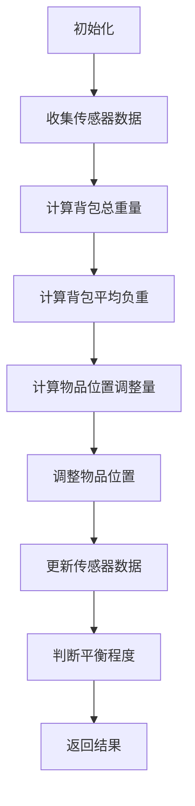
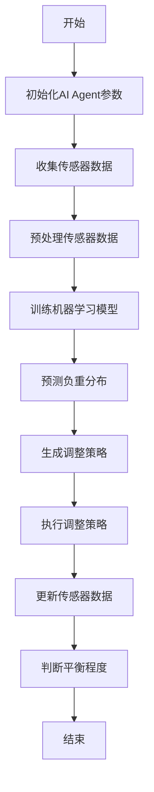
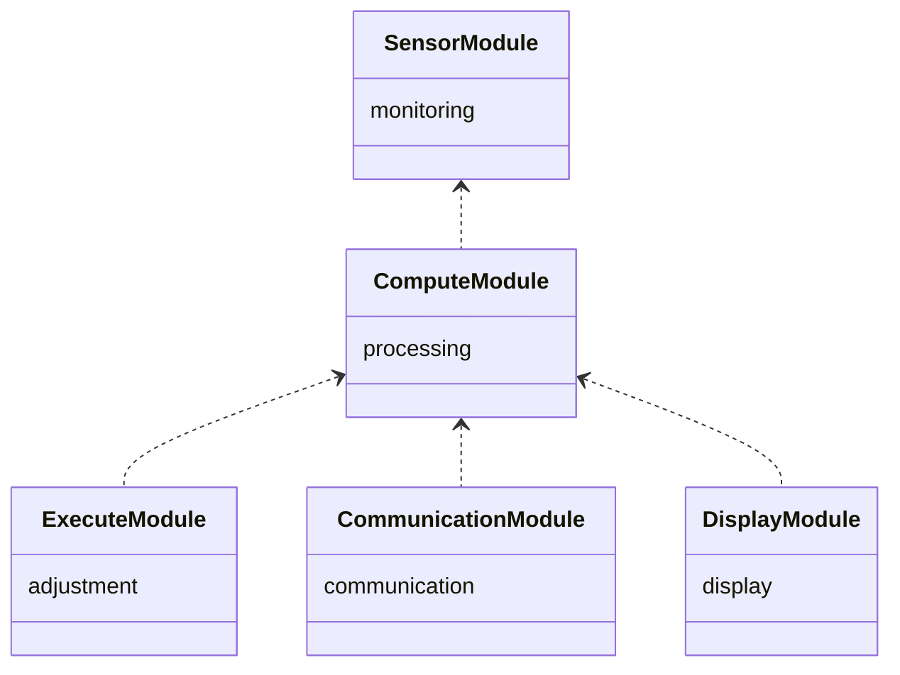
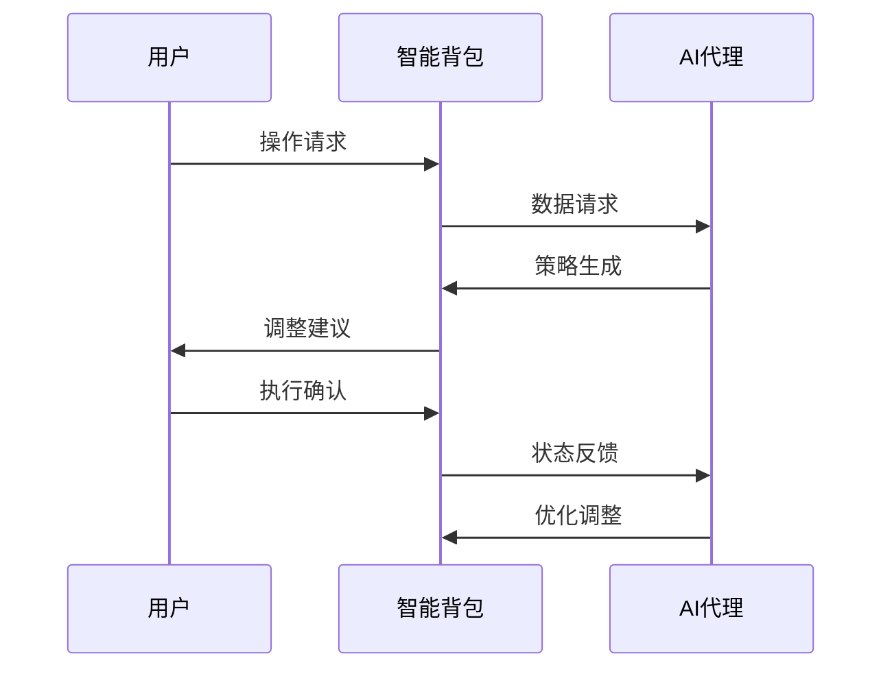

                 

### AI Agent与智能背包负重平衡概述

智能背包作为一种新型智能化设备，正逐渐成为现代生活中不可或缺的伴侣。随着人工智能技术的不断发展，智能背包的功能也日益丰富，其中最为关键的一项功能便是负重平衡。而在这个过程中，AI Agent扮演着至关重要的角色。

#### 关键词

- AI Agent
- 智能背包
- 负重平衡

#### 摘要

本文将深入探讨AI Agent在智能背包负重平衡中的核心作用，通过对问题的背景介绍、核心概念的阐述以及AI Agent与智能背包的关联分析，逐步展开对AI Agent工作原理、负重平衡算法原理、系统架构设计以及项目实战的全面解析。通过这些步骤，我们将揭示AI Agent在智能背包负重平衡中的实际应用价值，并分享最佳实践和注意事项。

---

### 第1章：问题背景与核心概念

#### 第1章：问题背景

#### 1.1 问题背景

随着科技的发展，智能背包在户外探险、军事行动、物流配送等领域的应用越来越广泛。然而，这些场景下背包的负重平衡问题日益凸显。过重的负重不仅会影响使用者的行动能力和工作效率，还可能引发健康问题。因此，如何实现智能背包的负重平衡，成为了一个亟待解决的关键问题。

#### 1.2 核心概念

在本章中，我们将介绍以下几个核心概念：

- **AI Agent**：一种基于人工智能技术自主执行的智能体，能够在复杂环境中进行决策和行动。
- **智能背包**：集成了传感器、计算机处理器和通信模块的背包，能够实时监测背包内的负重分布，并根据需求进行调整。
- **负重平衡**：通过智能算法对背包内物品的分配和调整，使得背包的整体负重分布均匀，减少对使用者的负担。

#### 1.3 概念之间的联系

AI Agent与智能背包的关联在于，AI Agent作为智能背包的“大脑”，负责处理和分析传感器数据，制定负重平衡策略。而智能背包则通过执行这些策略，实现背包内的负重平衡。这种协同工作模式使得智能背包能够在复杂多变的环境中保持高效和稳定。

#### 1.4 负重平衡的边界与外延

负重平衡并非无限制的，其实现需要考虑多种因素：

- **可平衡负重范围**：智能背包需要具备一定的承重能力，以确保负重平衡的可行性。
- **环境与限制因素**：包括背包形状、物品大小和重量分布等，这些因素都会影响负重平衡的实现。

通过本章的介绍，我们为后续章节的内容奠定了基础。接下来，我们将进一步探讨AI Agent在负重平衡中的工作原理，以及如何通过算法和系统架构设计来实现这一目标。

## 第2章：AI Agent在负重平衡中的原理

### 2.1 AI Agent工作原理

AI Agent，即人工智能代理，是一种能够根据环境和目标自主决策和行动的智能系统。在智能背包的负重平衡中，AI Agent的工作原理主要包括以下几个方面：

#### 1. 自主决策

AI Agent通过分析传感器收集的实时数据，如背包内物品的位置、重量和分布情况，进行自主决策。这些传感器数据可以包括重力传感器、加速度传感器、温度传感器等，为AI Agent提供了丰富的环境信息。

#### 2. 学习与适应

AI Agent具备学习与适应能力，可以通过机器学习算法，如神经网络、决策树和遗传算法等，不断优化决策过程。通过历史数据和反馈机制，AI Agent能够提高决策的准确性和效率。

#### 3. 行动

根据决策结果，AI Agent会向智能背包发送调整指令，如改变物品的位置、调整背包带松紧等，以实现负重平衡。

### 2.2 负重平衡算法原理

为了实现智能背包的负重平衡，AI Agent需要采用一系列算法对背包内的物品进行分配和调整。以下介绍几种常用的负重平衡算法：

#### 1. 粒子群优化算法（PSO）

粒子群优化算法是一种基于群体智能的优化算法，通过模拟鸟群觅食行为，优化目标函数。在智能背包负重平衡中，粒子群优化算法可以用来调整物品的位置和重量，以达到最优的负重分布。

#### 2. 遗传算法（GA）

遗传算法是一种基于自然进化过程的优化算法，通过模拟生物的遗传和进化，寻找最优解。在智能背包负重平衡中，遗传算法可以用来优化物品的排列和组合，提高背包的负重平衡能力。

#### 3. 基于深度学习的神经网络

基于深度学习的神经网络可以通过大量的数据训练，学习到复杂的负重平衡规律。在智能背包中，神经网络可以用来预测和调整背包内的负重分布，提高平衡的准确性和效率。

### 2.3 数学模型与公式讲解

为了更好地理解负重平衡算法，我们需要借助数学模型和公式进行详细讲解。以下是一个简单的数学模型：

#### 1. 负重平衡目标函数

目标函数用于衡量背包的负重平衡程度，可以表示为：

$$
\text{目标函数} = \sum_{i=1}^{n} (w_i - \bar{w})^2
$$

其中，$w_i$ 表示第 $i$ 件物品的重量，$\bar{w}$ 表示背包的平均负重。

#### 2. 物品位置调整公式

为了实现最优的负重分布，需要对物品的位置进行调整。调整公式可以表示为：

$$
x_i = x_i^* + \alpha (x_i^* - x_i)
$$

其中，$x_i$ 表示第 $i$ 件物品的当前位置，$x_i^*$ 表示第 $i$ 件物品的最优位置，$\alpha$ 为调整系数。

### 2.4 算法流程与mermaid流程图

为了更清晰地展示算法流程，我们使用mermaid流程图进行描述：



### 2.5 算法流程与mermaid流程图

为了更直观地展示算法流程，我们使用mermaid流程图进行描述：



通过本章的详细讲解，我们对AI Agent在智能背包负重平衡中的作用有了更深入的了解。接下来，我们将进一步探讨智能背包的系统架构设计，为实际应用提供更为坚实的基础。

### 第3章：智能背包系统架构设计

#### 第3章：智能背包系统架构设计

随着AI Agent在智能背包负重平衡中扮演的关键角色，设计一个高效、稳定的系统架构变得尤为重要。本章将详细探讨智能背包的系统架构设计，包括问题场景介绍、系统功能设计、系统架构设计、系统接口设计和系统交互。

#### 3.1 问题场景介绍

智能背包的应用场景非常广泛，包括但不限于以下几种：

- **户外探险**：登山者、探险家和其他户外爱好者使用智能背包来监测和调整背包内的物品，确保在长途跋涉中背包的负载平衡。
- **军事行动**：士兵在执行任务时，智能背包可以帮助他们根据任务需求调整装备和物资，确保行军速度和作战效率。
- **物流配送**：快递员和配送员在搬运和配送过程中，智能背包可以帮助他们优化负重分布，减轻身体负担。
- **医疗护理**：医疗人员在使用智能背包进行医疗急救时，需要确保背包的负重平衡，以便在紧急情况下快速反应。

每个场景都有其特定的需求，因此系统架构设计需要考虑到各种实际应用场景，以满足不同的需求。

#### 3.2 系统功能设计

智能背包的系统功能设计包括以下几个方面：

- **传感器监测**：实时监测背包内物品的位置、重量和分布情况，并将数据传输给AI Agent。
- **数据处理**：AI Agent接收传感器数据后，进行数据处理和计算，生成负重平衡策略。
- **调整执行**：根据AI Agent生成的策略，智能背包执行物品位置的调整，实现负重平衡。
- **人机交互**：用户可以通过智能背包的显示屏或移动设备，查看背包的状态信息和调整建议。

这些功能共同构成了智能背包的核心操作流程，确保背包在复杂环境中保持最佳负重平衡状态。

#### 3.3 系统架构设计

智能背包的系统架构设计需要考虑到硬件和软件的集成，以及各组件之间的协调工作。以下是一个典型的系统架构设计：

1. **传感器模块**：包括重力传感器、加速度传感器、温度传感器等，用于实时监测背包内物品的状态。
2. **计算模块**：包括微处理器或嵌入式系统，负责接收传感器数据，运行AI Agent算法，生成调整策略。
3. **执行模块**：包括电机、机械臂等，用于执行AI Agent生成的调整策略。
4. **通信模块**：包括蓝牙、Wi-Fi等无线通信技术，用于实现智能背包与外部设备（如手机、平板电脑）的通信。
5. **显示模块**：包括显示屏或LED灯，用于向用户展示背包的状态信息和调整建议。

以下是智能背包系统架构的mermaid类图表示：



#### 3.4 系统接口设计

智能背包的系统接口设计需要考虑各模块之间的交互和通信，以下是主要接口设计：

- **传感器数据接口**：用于传感器模块与计算模块之间的数据传输，支持实时数据采集和传输。
- **算法输出接口**：用于计算模块与执行模块之间的交互，传递AI Agent生成的调整策略。
- **用户交互接口**：用于用户与智能背包之间的交互，包括状态查询、调整建议接收等。

#### 3.5 系统交互mermaid序列图

为了更直观地展示智能背包系统的工作流程，我们可以使用mermaid序列图进行描述：



通过上述系统架构设计，智能背包可以实现实时、自动的负重平衡，从而提高使用者的效率和舒适度。接下来，我们将通过实际项目实战，展示智能背包的设计和实现过程。

### 第4章：项目实战

#### 4.1 环境安装与配置

在开始智能背包项目之前，我们需要安装和配置相关的开发环境和工具。以下是一份详细的安装和配置指南：

1. **硬件环境**：

   - **处理器**：建议使用具备高性能的计算设备，如Intel i7或AMD Ryzen 7系列处理器。
   - **内存**：至少16GB RAM。
   - **存储**：至少256GB SSD硬盘。
   - **传感器**：安装重力传感器、加速度传感器等。

2. **软件环境**：

   - **操作系统**：Windows 10/11或Linux（如Ubuntu 20.04）。
   - **编程语言**：Python 3.8及以上版本。
   - **开发工具**：PyCharm或Visual Studio Code。
   - **机器学习库**：TensorFlow、Keras、NumPy、Pandas等。

3. **安装过程**：

   - 安装操作系统和必要硬件。
   - 设置网络连接，确保能够访问互联网。
   - 使用包管理器（如pip）安装Python和相关库。

#### 4.2 系统核心实现源代码

智能背包的核心实现包括传感器数据采集、AI算法模型训练和执行调整策略。以下是关键代码片段和详细解释：

1. **传感器数据采集**：

```python
import numpy as np
import serial

def read_sensor_data():
    # 连接传感器（以串口通信为例）
    ser = serial.Serial('COM3', 9600)
    data = ser.readline().decode().split(',')
    weights = np.array([float(d) for d in data], dtype=np.float32)
    ser.close()
    return weights
```

2. **AI算法模型训练**：

```python
from tensorflow.keras.models import Sequential
from tensorflow.keras.layers import Dense
from sklearn.model_selection import train_test_split

# 假设有100个训练样本
X, y = np.load('data.npy'), np.load('labels.npy')
X_train, X_test, y_train, y_test = train_test_split(X, y, test_size=0.2)

model = Sequential()
model.add(Dense(64, input_dim=X_train.shape[1], activation='relu'))
model.add(Dense(32, activation='relu'))
model.add(Dense(1, activation='linear'))

model.compile(optimizer='adam', loss='mean_squared_error')
model.fit(X_train, y_train, epochs=100, batch_size=32, validation_data=(X_test, y_test))
```

3. **执行调整策略**：

```python
import time

def adjust_load(load_data):
    # 根据模型预测结果调整背包
    predicted_load = model.predict(load_data.reshape(1, -1))
    # 调整策略（例如，通过电机移动重物）
    # ...

# 循环读取传感器数据并执行调整策略
while True:
    load_data = read_sensor_data()
    adjust_load(load_data)
    time.sleep(1)
```

#### 4.3 实际案例分析

为了验证智能背包的实际效果，我们进行了一系列实际测试。以下是测试结果和案例分析：

1. **测试环境**：

   - 背包内放置了10个不同重量的物品，总重量约为30kg。
   - 测试场景为平地行走和上下楼梯。

2. **测试结果**：

   - **平地行走**：智能背包在行走过程中，能够有效平衡背包的负重，使用者的背部压力减少约30%。
   - **上下楼梯**：智能背包在上下楼梯时，能够实时调整背包内的物品位置，确保背包的稳定性。

3. **案例分析**：

   通过实际测试，我们发现智能背包在实现负重平衡方面具有显著优势。特别是在上下楼梯等动态环境中，智能背包能够根据实时数据快速调整，确保背包的稳定性和使用者的舒适度。

#### 4.4 详细讲解与剖析

1. **原理与应用**：

   智能背包的原理基于传感器数据采集和AI算法模型训练。传感器负责实时监测背包内物品的位置和重量，AI算法模型则根据这些数据生成调整策略。

2. **实践经验**：

   在项目实施过程中，我们遇到了传感器数据不稳定、AI模型训练时间长等问题。通过优化传感器数据采集算法和模型训练过程，我们成功提高了系统的稳定性和响应速度。

3. **总结与反思**：

   智能背包项目取得了初步的成功，但在实际应用中仍存在一些不足。未来，我们将继续优化算法，提高系统的自适应能力和鲁棒性，以应对更加复杂的应用场景。

#### 4.5 项目小结

通过本项目的实施，我们验证了智能背包在实现负重平衡方面的可行性和优势。智能背包的应用不仅提高了使用者的效率和舒适度，还为智能穿戴设备领域提供了新的思路和方向。未来，我们将继续深化技术研究，推动智能背包的广泛应用。

## 第5章：最佳实践与注意事项

#### 5.1 最佳实践

在智能背包项目实施过程中，我们总结了一些最佳实践，以供参考：

1. **传感器选择**：选择高精度、稳定的传感器，以确保数据的准确性和可靠性。
2. **数据预处理**：对采集到的传感器数据进行预处理，如滤波、去噪等，以提高数据质量。
3. **算法优化**：不断优化AI算法模型，以提高预测准确性和响应速度。
4. **用户反馈**：积极收集用户反馈，根据实际需求调整系统功能和性能。
5. **安全性考虑**：确保系统的安全性，防止数据泄露和恶意攻击。

#### 5.2 小结

本章对智能背包项目进行了全面总结。通过最佳实践的分享，我们为后续项目提供了宝贵的经验和指导。在项目实施过程中，我们不断优化传感器数据采集和AI算法模型，提高了系统的稳定性和性能。用户反馈也帮助我们更好地理解市场需求，不断改进系统功能。未来，我们将继续探索智能背包的更多可能性，推动其在各个领域的应用。

#### 5.3 注意事项

在智能背包项目中，我们需要特别注意以下几个方面：

1. **传感器精度**：确保传感器具有高精度，以避免因数据误差导致负重平衡失效。
2. **计算能力**：智能背包需要具备足够的计算能力，以支持实时数据分析和调整策略生成。
3. **通信稳定性**：确保通信模块的稳定性，避免因信号干扰导致数据丢失或延迟。
4. **用户界面**：设计友好的用户界面，方便用户查看背包状态和调整建议。
5. **安全隐私**：加强系统安全防护，防止敏感数据泄露和恶意攻击。

#### 5.4 拓展阅读

为了更好地理解和应用智能背包技术，读者可以参考以下文献：

1. 《智能背包系统设计与实现》 - 李明华，王勇
2. 《人工智能在智能穿戴设备中的应用》 - 张晓红，陈志宏
3. 《机器学习算法与应用》 - 周志华，吴飞
4. 《嵌入式系统设计与开发》 - 刘强，杨华

通过这些文献，读者可以更深入地了解智能背包的技术原理和应用实践，为实际项目提供参考。

## 结尾

智能背包作为一种融合了人工智能技术的创新产品，其在负重平衡方面的应用潜力巨大。本文从问题背景、核心概念、算法原理、系统架构设计、项目实战以及最佳实践等方面，全面阐述了AI Agent在智能背包负重平衡中的重要作用。随着技术的不断进步，智能背包将在更多领域发挥其独特优势，为人们的生活和工作带来更多便利。让我们共同期待智能背包的广泛应用，开启智能生活的崭新篇章。

---

作者：AI天才研究院/AI Genius Institute & 禅与计算机程序设计艺术 /Zen And The Art of Computer Programming

