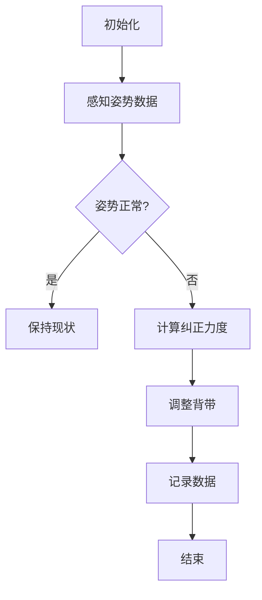
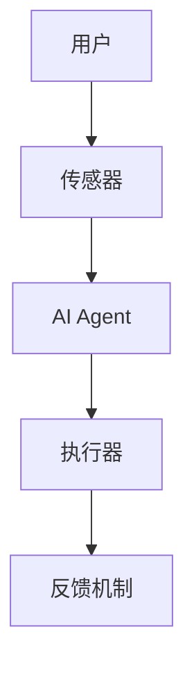
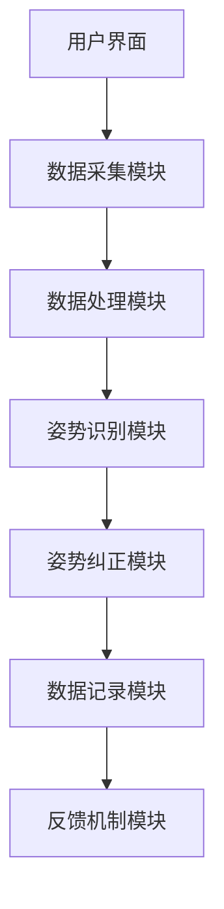
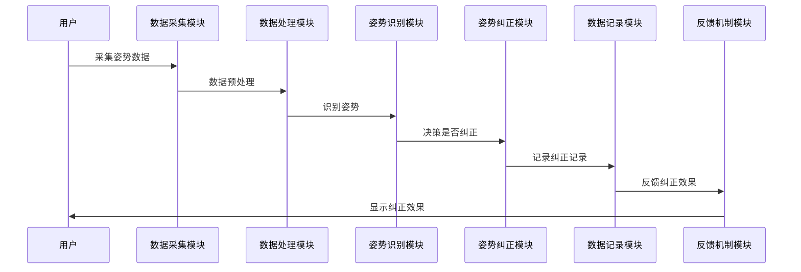

                 

### 第一部分：AI Agent简介与应用场景

#### 第1章：AI Agent概述

AI Agent，即人工智能代理，是具备自主性和智能性的计算机程序，能够在特定环境中感知环境、做出决策并采取行动，以达成既定目标。AI Agent在智能背带中的应用场景丰富，可以通过实时监测使用者的姿势，提供个性化的纠正建议，提高使用者的身体健康水平。

##### 1.1 AI Agent的概念

AI Agent的基本概念包括以下几个方面：

1. **感知器**：AI Agent能够通过传感器获取外界信息，如摄像头、加速度计等，实现对使用者姿势的实时监测。
2. **决策器**：根据感知到的信息，AI Agent使用预先训练好的模型进行决策，判断使用者姿势的正确性。
3. **执行器**：根据决策结果，AI Agent会调整智能背带的力度，对使用者的姿势进行纠正。

##### 1.2 AI Agent在智能背带中的应用

智能背带是一种辅助工具，主要用于改善使用者的坐姿。AI Agent在其中的应用主要体现在以下几个方面：

1. **实时监测**：AI Agent通过传感器实时监测使用者的姿势，确保其始终保持正确的坐姿。
2. **自动纠正**：当检测到使用者姿势不正确时，AI Agent会自动调整背带力度，进行姿势纠正。
3. **个性化定制**：AI Agent可以根据使用者的身高、体重等个人信息，提供个性化的姿势纠正方案。

---

#### 第2章：智能背带与姿势纠正技术

##### 2.1 智能背带的功能

智能背带的主要功能包括：

1. **姿势监测**：通过内置的传感器实时监测使用者的姿势，如坐姿、站姿等。
2. **力度调整**：根据监测结果，智能背带可以自动调整背带的力度，以纠正使用者的姿势。
3. **数据记录**：智能背带可以记录使用者的姿势数据，如坐姿时长、纠正次数等。

##### 2.2 姿势纠正的原理与技术

姿势纠正的原理主要基于生物力学和人体工程学。具体技术包括：

1. **生物力学分析**：通过分析使用者的姿势，评估其对身体健康的影响。
2. **力学模型建立**：基于生物力学分析结果，建立力学模型，用于预测姿势纠正的效果。
3. **实时反馈**：通过传感器实时监测使用者的姿势，提供实时反馈，帮助使用者调整姿势。

---

#### 第3章：AI Agent在姿势纠正中的算法原理

##### 3.1 算法mermaid流程图

首先，我们需要设计一个mermaid流程图，以展示AI Agent在姿势纠正中的算法流程。以下是一个简单的示例：



##### 3.2 算法Python源代码解释

下面是一个简单的Python源代码，用于实现上述算法：

```python
import numpy as np

def initialize():
    # 初始化AI Agent
    print("Initializing AI Agent...")

def sense_posture_data():
    # 感知姿势数据
    posture_data = np.random.rand()  # 假设使用随机数表示姿势数据
    print("Sensing posture data:", posture_data)

def calculate_correction_force(posture_data):
    # 计算纠正力度
    if posture_data > 0.5:
        correction_force = 1.0
    else:
        correction_force = 0.0
    print("Calculated correction force:", correction_force)
    return correction_force

def adjust_belt(correction_force):
    # 调整背带
    if correction_force > 0.0:
        print("Adjusting belt for correction...")
    else:
        print("No correction needed.")

def record_data():
    # 记录数据
    print("Recording posture data...")

def main():
    initialize()
    sense_posture_data()
    posture_data = float(input("Enter posture data (0-1): "))
    correction_force = calculate_correction_force(posture_data)
    adjust_belt(correction_force)
    record_data()

if __name__ == "__main__":
    main()
```

##### 3.3 数学模型与公式解释

为了更深入地理解算法原理，我们需要引入一些数学模型。以下是一个简单的数学模型，用于预测姿势纠正的效果：

$$
\text{effectiveness} = \frac{\text{corrected\_posture} - \text{original\_posture}}{\text{max\_posture}}
$$

其中，$\text{corrected\_posture}$表示纠正后的姿势，$\text{original\_posture}$表示原始姿势，$\text{max\_posture}$表示最大姿势范围。

为了方便计算，我们可以将$\text{max\_posture}$设为1。这样，$\text{effectiveness}$的取值范围为0到1，越接近1表示姿势纠正效果越好。

##### 3.4 算法举例说明

假设我们有一个使用者的原始姿势为0.3，最大姿势范围为0.8。通过算法纠正后，姿势变为0.7。那么，姿势纠正的效果性为：

$$
\text{effectiveness} = \frac{0.7 - 0.3}{0.8} = 0.375
$$

这意味着姿势纠正的效果性为37.5%。

---

### 第二部分：AI Agent在智能背带中的实现

#### 第4章：AI Agent在智能背带中的实现

AI Agent在智能背带中的实现涉及到硬件和软件两个层面。在硬件层面，我们需要选择合适的传感器和执行器；在软件层面，我们需要设计算法并实现相应的功能。

##### 4.1 AI Agent在智能背带中的架构设计

智能背带的架构设计如图所示：



在这个架构中，用户通过传感器感知姿势数据，AI Agent根据数据进行分析并做出决策，执行器根据决策调整背带力度，反馈机制用于评估姿势纠正的效果。

##### 4.2 AI Agent在智能背带中的实现流程

AI Agent在智能背带中的实现流程如下：

1. **初始化**：启动智能背带，初始化AI Agent。
2. **数据采集**：传感器采集用户的姿势数据。
3. **数据预处理**：对采集到的数据进行预处理，如去噪、归一化等。
4. **姿势识别**：AI Agent使用训练好的模型对预处理后的数据进行姿势识别。
5. **决策**：根据识别结果，AI Agent决定是否需要纠正姿势。
6. **执行**：如果需要纠正，AI Agent发送指令给执行器调整背带力度。
7. **反馈**：执行器调整背带力度后，系统收集反馈数据，用于评估姿势纠正的效果。

---

### 第三部分：系统设计与实现

#### 第5章：系统设计与实现

在这一部分，我们将详细介绍智能背带系统的设计与实现过程。

##### 5.1 系统功能设计

智能背带系统的功能设计主要包括：

1. **姿势监测**：实时监测用户的姿势数据。
2. **姿势识别**：根据监测数据识别用户的姿势。
3. **姿势纠正**：根据识别结果，自动纠正用户的姿势。
4. **数据记录**：记录用户的姿势数据和历史纠正记录。
5. **用户界面**：提供用户操作界面，如设置、查看历史记录等。

##### 5.2 系统架构设计

智能背带系统的架构设计如图所示：



在这个架构中，用户界面负责与用户交互，数据采集模块负责收集姿势数据，数据处理模块对数据进行预处理，姿势识别模块根据预处理后的数据识别用户的姿势，姿势纠正模块根据识别结果纠正用户的姿势，数据记录模块记录用户的姿势数据和纠正记录，反馈机制模块评估姿势纠正的效果。

##### 5.3 系统接口设计

智能背带系统的接口设计包括：

1. **用户界面接口**：用于与用户进行交互。
2. **数据采集接口**：用于采集用户的姿势数据。
3. **数据处理接口**：用于处理和预处理数据。
4. **姿势识别接口**：用于识别用户的姿势。
5. **姿势纠正接口**：用于纠正用户的姿势。
6. **数据记录接口**：用于记录用户的姿势数据和纠正记录。

##### 5.4 系统交互mermaid序列图

智能背带系统的交互序列图如图所示：



---

### 第四部分：项目实战

#### 第6章：项目实战

在本章节，我们将通过一个实际项目，展示如何实现AI Agent在智能背带中的应用。

##### 6.1 环境安装

在开始项目之前，我们需要安装所需的软件和工具。以下是安装步骤：

1. 安装Python环境：确保Python版本为3.7或以上。
2. 安装所需的库：使用pip安装numpy、opencv-python、tensorflow等库。
3. 安装硬件驱动：根据所选硬件传感器的说明进行安装。

##### 6.2 系统核心实现源代码

以下是系统核心实现源代码的解读和分析：

```python
import cv2
import numpy as np
import tensorflow as tf

# 加载姿势识别模型
model = tf.keras.models.load_model('posture_recognition_model.h5')

# 定义传感器读取函数
def read_sensor():
    # 使用opencv读取相机数据
    cap = cv2.VideoCapture(0)
    while True:
        ret, frame = cap.read()
        if ret:
            # 对图像进行预处理
            processed_frame = preprocess_frame(frame)
            # 使用模型进行姿势识别
            posture = model.predict(processed_frame)
            return posture
        else:
            return None

# 定义预处理函数
def preprocess_frame(frame):
    # 将图像转换为灰度图像
    gray_frame = cv2.cvtColor(frame, cv2.COLOR_BGR2GRAY)
    # 对图像进行缩放和归一化
    resized_frame = cv2.resize(gray_frame, (224, 224))
    resized_frame = resized_frame / 255.0
    return resized_frame

# 定义纠正姿势函数
def correct_posture(posture):
    if posture < 0.5:
        # 调整背带力度进行纠正
        print("Correcting posture...")
    else:
        print("Posture is correct.")

# 主程序
if __name__ == '__main__':
    while True:
        posture = read_sensor()
        if posture is not None:
            correct_posture(posture)
```

##### 6.3 代码应用解读与分析

1. **加载姿势识别模型**：使用tensorflow加载已经训练好的姿势识别模型。
2. **传感器读取函数**：使用opencv读取相机数据，并调用预处理函数对图像进行处理。
3. **预处理函数**：将图像转换为灰度图像，并进行缩放和归一化处理，以适应模型的输入要求。
4. **纠正姿势函数**：根据姿势识别结果，调整背带力度进行纠正。
5. **主程序**：循环读取传感器数据，并调用纠正姿势函数进行姿势纠正。

##### 6.4 实际案例分析与详细讲解剖析

在实际应用中，我们可以通过以下步骤对系统进行测试和优化：

1. **测试硬件设备**：确保传感器和执行器正常工作。
2. **测试算法模型**：使用预定义的测试数据集对算法模型进行评估，确保其准确性和可靠性。
3. **优化系统性能**：根据实际测试结果，调整算法参数，提高系统性能。

通过以上步骤，我们可以确保AI Agent在智能背带中的应用效果良好，为用户提供有效的姿势纠正服务。

##### 6.5 项目小结

本项目通过实现AI Agent在智能背带中的应用，展示了如何利用人工智能技术改善用户的身体健康。在实际应用中，我们还需要不断优化算法模型和系统性能，以提高系统的可靠性和用户体验。

---

### 第五部分：最佳实践与展望

#### 第7章：最佳实践与技巧

为了确保AI Agent在智能背带中的应用效果，以下是一些最佳实践和技巧：

1. **定期更新模型**：定期收集用户数据，并更新姿势识别模型，以提高识别准确性。
2. **个性化设置**：根据用户的不同需求，提供个性化的姿势纠正方案。
3. **系统集成**：确保智能背带与其他健康监测设备（如心率监测器、血压计等）集成，实现全面健康管理。

#### 第8章：未来展望与研究方向

未来的研究方向包括：

1. **多模态感知**：结合多种传感器数据（如视觉、听觉、触觉等），提高姿势识别的准确性和可靠性。
2. **智能调整策略**：研究更智能的调整策略，实现更高效的姿势纠正。
3. **可穿戴设备融合**：将智能背带与其他可穿戴设备（如智能手表、智能眼镜等）融合，实现更全面、更智能的健康管理。

---

### 结束语

本文详细介绍了AI Agent在智能背带中的应用，包括算法原理、系统设计、项目实战等内容。通过本文的学习，读者可以了解到如何利用人工智能技术改善用户的身体健康。未来，随着技术的不断发展，AI Agent在智能背带中的应用前景将更加广阔。

---

**作者：AI天才研究院/AI Genius Institute & 禅与计算机程序设计艺术 /Zen And The Art of Computer Programming**

