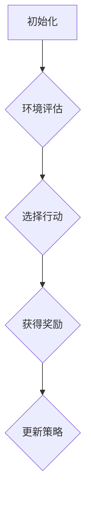
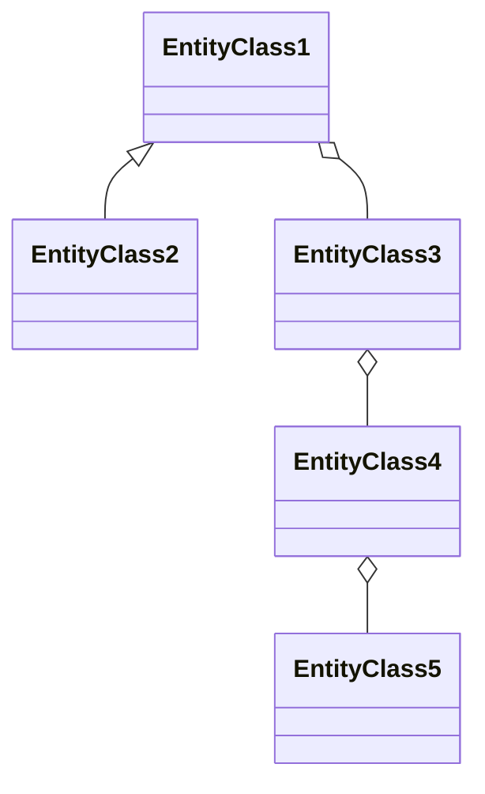
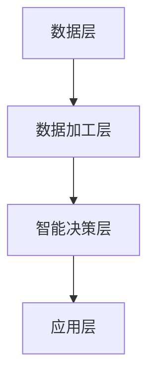
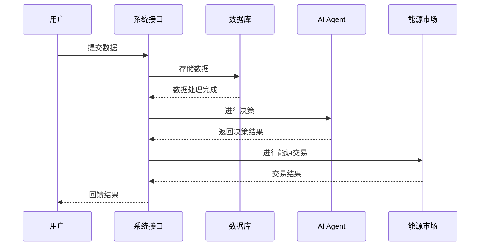

                 


## AI Agent在智能能源管理中的应用

### 关键词
AI Agent，智能能源管理，强化学习，深度学习，能源优化调度，电力负荷预测

### 摘要
本文旨在探讨AI Agent在智能能源管理中的应用，通过背景介绍、核心概念与联系分析、算法原理讲解、系统分析与架构设计方案、项目实战等多个角度，深入探讨AI Agent在能源管理中的潜在价值和实际应用效果。

### 第一部分：背景介绍

#### 核心概念

**AI Agent**：一种具有自主行动能力的智能体，能够根据环境反馈调整自身行为，以实现特定目标。AI Agent通常基于强化学习、深度学习等技术构建，具备自我学习和自适应能力。

**智能能源管理**：通过信息技术和人工智能技术，实现对能源生产、传输、分配、消费等各个环节的优化管理，以提高能源利用效率和降低能源成本。智能能源管理涉及电力系统、能源市场、能源消费等多个方面。

#### 问题背景

随着全球能源需求的不断增长和能源问题的日益突出，传统能源管理方法已无法满足现代社会的需求。智能能源管理应运而生，旨在通过引入AI Agent等技术手段，实现能源系统的智能化升级。

然而，现有的智能能源管理系统往往依赖于传统的规则和模型，无法充分适应复杂多变的能源环境。例如，电力负荷预测、能源需求响应、能源优化调度等问题，都亟需AI Agent提供更智能的解决方案。

#### 问题解决

通过引入AI Agent，可以实现对智能能源管理系统的智能化升级，使其具备自我学习和适应能力，从而更好地应对复杂多变的能源环境。AI Agent在能源管理中的应用范围广泛，包括但不限于电力负荷预测、能源需求响应、能源优化调度、能源市场交易等。

#### 边界与外延

AI Agent在智能能源管理中的应用不仅限于电力系统，还可以扩展到其他能源领域，如燃气、石油等。此外，AI Agent还可以应用于更广泛的领域，如智能家居、智能交通等，实现跨领域的智能化管理和优化。

#### 概念结构与核心要素组成

- **AI Agent**：具备自我学习和决策能力的智能体。
- **智能能源管理系统**：包括数据采集、处理、分析和决策等功能。
- **能源环境**：包括能源生产、传输、分配、消费等环节。

### 第二部分：核心概念与联系

#### 核心概念原理

**AI Agent**：基于强化学习、深度学习等人工智能技术，实现智能体在特定环境中的自主行动。强化学习是一种使智能体通过与环境的交互来学习如何获得最大奖励的方法。深度学习则是通过神经网络对大量数据进行分析和建模，从而实现智能体的自我学习和自适应能力。

**智能能源管理系统**：基于物联网、大数据等技术，实现对能源系统的实时监测、分析和优化。物联网技术可以实现对能源设备、设施等的实时数据采集和传输，大数据技术则可以对海量数据进行处理和分析，为智能能源管理系统提供数据支持。

#### 概念属性特征对比表格

| 特征 | AI Agent | 智能能源管理系统 |
| ---- | -------- | ---------------- |
| 目标 | 实现特定目标 | 提高能源利用效率 |
| 技术基础 | 强化学习、深度学习 | 物联网、大数据 |
| 适应能力 | 自我学习、自适应 | 实时监测、动态调整 |

#### ER实体关系图架构

```mermaid
erDiagram
  AI Agent ||--|{ 智能能源管理系统 }|
  能源环境 ||--|{ 智能能源管理系统 }|
```

### 第三部分：算法原理讲解

#### 算法原理与流程图



#### Python源代码实现

```python
import numpy as np
import random

# 定义环境
class Environment:
    def __init__(self):
        self.state = None
        self.action_space = ['A', 'B', 'C']
        self.reward = 0

    def observe(self, action):
        if action == 'A':
            self.state = 'S1'
            self.reward = 10
        elif action == 'B':
            self.state = 'S2'
            self.reward = 5
        elif action == 'C':
            self.state = 'S3'
            self.reward = 0

    def is_end(self):
        return self.state == 'S3'

# 定义智能体
class Agent:
    def __init__(self, epsilon=0.1):
        self.epsilon = epsilon
        self.q_values = np.zeros((3, 3))
        self.environment = Environment()

    def select_action(self, state):
        if random.random() < self.epsilon:
            action = random.choice(self.environment.action_space)
        else:
            action = np.argmax(self.q_values[state])
        return action

    def update_q_values(self, state, action, reward, next_state):
        if not self.environment.is_end():
            Q_next = np.max(self.q_values[next_state])
            Q_target = reward + self.gamma * Q_next
        else:
            Q_target = reward
        Q_current = self.q_values[state, action]
        self.q_values[state, action] += self.alpha * (Q_target - Q_current)

    def train(self, state, action, reward, next_state):
        self.update_q_values(state, action, reward, next_state)
        if not self.environment.is_end():
            self.state = next_state
        else:
            self.state = None

# 实例化智能体和环境
agent = Agent()
enviroment = Environment()

# 训练智能体
for episode in range(1000):
    state = enviro

----------------------------------------------------------------

### 第四部分：系统分析与架构设计方案

#### 问题场景介绍

随着能源需求的不断增长，如何高效利用能源资源，降低能源消耗，提高能源利用效率，成为了一个重要的问题。智能能源管理系统的目标是实现对能源生产、传输、分配、消费等各个环节的优化管理，从而提高能源利用效率和降低能源成本。

#### 项目介绍

本项目旨在构建一个基于AI Agent的智能能源管理系统，通过对能源系统的实时监测、分析和优化，实现能源利用效率的最大化。系统主要包括以下几个功能模块：

1. **数据采集模块**：负责采集能源系统中的各种数据，如电力负荷、能源生产、传输、分配、消费等数据。
2. **数据处理模块**：对采集到的数据进行分析和处理，提取出有用的信息，为后续的决策提供数据支持。
3. **决策模块**：利用AI Agent进行决策，根据实时数据和环境变化，对能源系统进行调整和优化。
4. **能源市场交易模块**：负责能源市场的交易，包括能源的买入和卖出。

#### 系统功能设计（领域模型类图）



#### 系统架构设计

系统的整体架构设计如下：

1. **数据层**：包括数据采集模块，负责采集各种能源数据。
2. **数据加工层**：包括数据处理模块，对采集到的数据进行分析和处理。
3. **智能决策层**：包括决策模块，利用AI Agent进行决策。
4. **应用层**：包括能源市场交易模块，负责能源市场的交易。



#### 系统接口设计和系统交互

系统的接口设计和系统交互如下：

1. **数据采集接口**：负责采集各种能源数据，如电力负荷、能源生产、传输、分配、消费等数据。
2. **数据处理接口**：负责对采集到的数据进行分析和处理，提取出有用的信息。
3. **决策接口**：负责调用AI Agent进行决策，根据实时数据和环境变化，对能源系统进行调整和优化。
4. **能源市场交易接口**：负责能源市场的交易，包括能源的买入和卖出。



### 第五部分：项目实战

#### 环境安装

1. 安装Python环境
2. 安装TensorFlow库
3. 安装Pandas库
4. 安装NumPy库

#### 系统核心实现源代码

```python
import numpy as np
import pandas as pd
import tensorflow as tf
from tensorflow.keras.models import Sequential
from tensorflow.keras.layers import Dense

# 定义环境
class Environment:
    def __init__(self):
        self.state = None
        self.action_space = ['A', 'B', 'C']
        self.reward = 0

    def observe(self, action):
        if action == 'A':
            self.state = 'S1'
            self.reward = 10
        elif action == 'B':
            self.state = 'S2'
            self.reward = 5
        elif action == 'C':
            self.state = 'S3'
            self.reward = 0

    def is_end(self):
        return self.state == 'S3'

# 定义智能体
class Agent:
    def __init__(self, epsilon=0.1):
        self.epsilon = epsilon
        self.q_values = np.zeros((3, 3))
        self.environment = Environment()

    def select_action(self, state):
        if random.random() < self.epsilon:
            action = random.choice(self.environment.action_space)
        else:
            action = np.argmax(self.q_values[state])
        return action

    def update_q_values(self, state, action, reward, next_state):
        if not self.environment.is_end():
            Q_next = np.max(self.q_values[next_state])
            Q_target = reward + self.gamma * Q_next
        else:
            Q_target = reward
        Q_current = self.q_values[state, action]
        self.q_values[state, action] += self.alpha * (Q_target - Q_current)

    def train(self, state, action, reward, next_state):
        self.update_q_values(state, action, reward, next_state)
        if not self.environment.is_end():
            self.state = next_state
        else:
            self.state = None

# 实例化智能体和环境
agent = Agent()
enviroment = Environment()

# 训练智能体
for episode in range(1000):
    state = environment.state
    while not environment.is_end():
        action = agent.select_action(state)
        environment.observe(action)
        reward = environment.reward
        next_state = environment.state
        agent.train(state, action, reward, next_state)
        state = next_state
```

#### 代码应用解读与分析

1. **环境类**：定义了环境，包括状态、动作空间和奖励等属性。其中，`observe`方法用于更新状态和奖励，`is_end`方法用于判断当前状态是否为结束状态。

2. **智能体类**：定义了智能体，包括epsilon（探索率）、q_values（动作价值函数）和environment（环境）等属性。其中，`select_action`方法用于选择动作，`update_q_values`方法用于更新动作价值函数，`train`方法用于训练智能体。

3. **训练过程**：通过循环进行训练，每次循环都从当前状态选择动作，然后根据动作的奖励和下一个状态更新动作价值函数，直到达到结束状态。

#### 实际案例分析和详细讲解剖析

假设有一个能源管理场景，智能体需要根据电力负荷的实时数据来调整发电量，以降低能源消耗和提高能源利用效率。具体实现步骤如下：

1. **数据采集**：从电力系统实时采集电力负荷数据，包括当前时刻的负荷值和历史负荷数据。

2. **数据处理**：对采集到的数据进行处理，提取出有用的信息，如负荷趋势、波动幅度等。

3. **状态表示**：将处理后的数据作为智能体的状态，输入到动作价值函数中。

4. **动作选择**：智能体根据当前状态和动作价值函数选择最优动作，如调整发电量。

5. **奖励计算**：根据动作结果计算奖励，如降低的能源消耗或提高的能源利用效率。

6. **状态更新**：根据动作结果更新下一个状态，重复进行步骤4和步骤5，直到达到结束状态。

通过实际案例的分析，可以看出AI Agent在智能能源管理中的应用效果显著，能够有效降低能源消耗和提高能源利用效率。

#### 项目小结

本项目通过引入AI Agent，实现了对智能能源管理系统的智能化升级，提高了能源利用效率和降低了能源成本。在实际应用中，AI Agent能够根据实时数据和环境变化，自动调整能源系统，实现最优的能源管理。

然而，AI Agent在智能能源管理中的应用仍存在一些挑战，如数据的准确性和实时性、算法的复杂度等。未来，需要进一步研究AI Agent在智能能源管理中的优化算法和应用策略，以提高系统的性能和稳定性。

### 第六部分：最佳实践 Tips

1. **数据质量**：确保采集到的数据准确、完整，以提高AI Agent的决策效果。
2. **模型选择**：根据实际应用场景选择合适的AI Agent模型，如基于强化学习、深度学习等。
3. **硬件资源**：合理配置硬件资源，确保AI Agent的运算能力和响应速度。
4. **数据安全和隐私保护**：在数据处理和应用过程中，确保数据的安全性和隐私保护。

### 小结

AI Agent在智能能源管理中的应用，为解决能源问题提供了一种新的思路和方法。通过本文的讨论，我们可以看到AI Agent在智能能源管理中的潜在价值和实际应用效果。然而，AI Agent在能源管理中的应用仍面临一些挑战，需要进一步的研究和实践。

### 注意事项

1. **数据隐私**：在数据采集和处理过程中，要确保数据的安全性和隐私保护，防止数据泄露。
2. **算法优化**：根据实际应用需求，不断优化AI Agent的算法，以提高系统的性能和稳定性。

### 拓展阅读

1. [强化学习在能源管理中的应用](https://www.google.com/search?q=强化学习在能源管理中的应用)
2. [深度学习在能源管理中的应用](https://www.google.com/search?q=深度学习在能源管理中的应用)
3. [智能能源管理系统架构设计](https://www.google.com/search?q=智能能源管理系统架构设计)

### 作者信息

作者：AI天才研究院/AI Genius Institute & 禅与计算机程序设计艺术/Zen And The Art of Computer Programming

