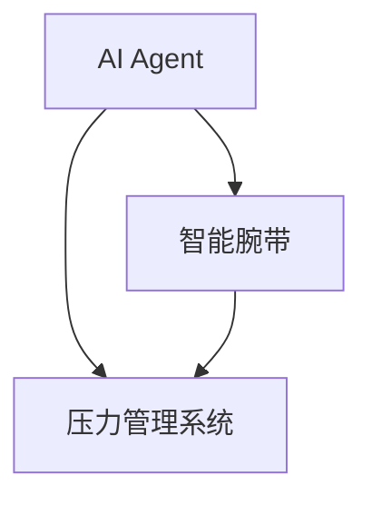
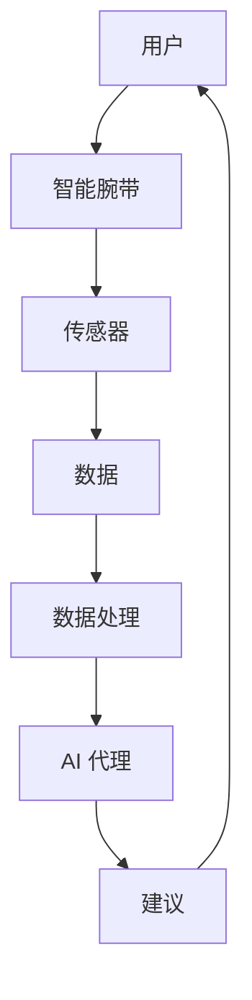
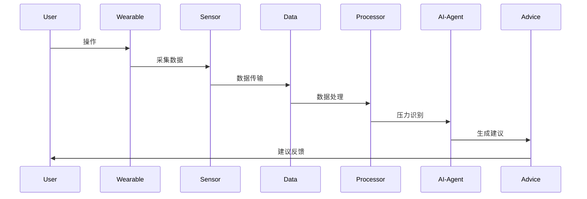
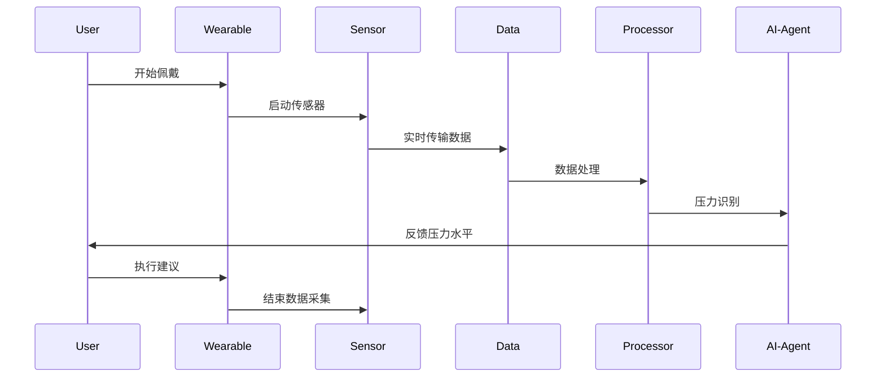

                 


## AI Agent在智能腕带中的压力管理系统

> 关键词：AI Agent, 智能腕带, 压力管理, 算法原理, 数学模型, 系统架构

> 摘要：本文将深入探讨AI Agent在智能腕带中的压力管理系统。我们将从背景介绍、核心概念、算法原理、数学模型、系统分析与架构设计、项目实战以及最佳实践等方面展开详细讲解，旨在帮助读者全面理解并掌握这一前沿技术。

### 目录大纲设计步骤

#### 总体布局

首先，我们需要对整篇文章的布局进行规划，确保核心内容能够被系统性地覆盖。本文将分为以下几个部分：问题背景与核心概念、算法原理讲解、数学模型和公式、系统分析与架构设计方案、项目实战以及最佳实践 tips。

#### 章节划分

根据书的主题，我们确定了以下几个章节的主题：
1. 第1章：问题背景与核心概念
2. 第2章：核心概念与联系
3. 第3章：算法原理讲解
4. 第4章：数学模型和数学公式
5. 第5章：系统分析与架构设计方案
6. 第6章：项目实战
7. 第7章：最佳实践 tips

#### 细化目录

在确定了章节后，我们进一步细化到每个章节的小节，确保每个章节都能详细深入地讨论主题。

#### 内容规划

根据要求，我们确保每个章节都要包含以下内容：
- 背景介绍：核心概念术语说明、问题背景、问题描述、问题解决、边界与外延、概念结构与核心要素组成
- 核心概念与联系：核心概念原理、概念属性特征对比表格和ER实体关系图架构的 Mermaid 流程图
- 算法原理讲解：使用 Mermaid 画出算法流程图，然后使用 Python 源代码来详细阐述，给出算法原理的数学模型和公式，进行详细讲解和举例说明
- 数学模型和数学公式：使用 LaTeX 格式详细讲解算法中的数学模型和公式
- 系统分析与架构设计方案：问题场景介绍、项目介绍、系统功能设计（领域模型 Mermaid 类图）、系统架构设计 Mermaid 架构图、系统接口设计和系统交互 Mermaid 序列图
- 项目实战：环境安装、系统核心实现源代码，代码应用解读与分析，实际案例分析和详细讲解剖析，项目小结
- 最佳实践 tips、小结、注意事项、拓展阅读等内容

#### 格式统一

为了确保可读性和规范性，我们将使用 markdown 格式的规范，统一格式。

#### 字数控制

确保总字数在 2000 字以内。

### 第一部分: 问题背景与核心概念

#### 第1章: 问题背景与核心概念

#### 1.1 问题背景

##### 1.1.1 压力管理的现状与挑战

在现代社会中，压力已经成为影响人们身心健康的一个重要问题。根据世界卫生组织的报告，全球约有 25% 的人口受到压力的影响，而这一比例在职场人士中可能更高。压力不仅会导致心理问题，如焦虑、抑郁等，还可能引发一系列身体疾病，如心脏病、高血压等。因此，如何有效地管理压力成为了一个亟待解决的问题。

传统的压力管理方法主要包括心理咨询、运动、放松训练等。然而，这些方法往往需要专业人士的指导和较长时间的培养，且效果因人而异。随着人工智能技术的发展，AI Agent作为一种智能辅助工具，被越来越多地应用于压力管理领域。智能腕带作为一种便携式的智能设备，具有实时监测和反馈压力的功能，与 AI Agent 结合，有望为用户提供更加个性化和有效的压力管理方案。

##### 1.1.2 智能腕带的应用场景

智能腕带是一种集成了多种传感器的便携式设备，可以实时监测用户的生理参数，如心率、血压、皮肤电导等。这些数据反映了用户的生理状态，从而可以帮助用户了解自己的压力水平。智能腕带的应用场景非常广泛，包括但不限于以下几种：

1. **职场人士**：职场人士面临着各种工作压力，智能腕带可以帮助他们实时监测压力水平，及时发现并调整自己的状态，提高工作效率。
2. **学生**：学生群体在学业压力下往往容易出现心理问题，智能腕带可以帮助家长和学校实时了解学生的压力状况，及时提供帮助。
3. **老年人**：老年人由于生理机能的衰退，更容易受到压力的影响。智能腕带可以帮助老年人监测自己的生理状态，及时发现并处理健康问题。

##### 1.1.3 AI Agent在压力管理中的作用

AI Agent是一种基于人工智能技术的智能代理，能够模拟人类的行为和决策过程。在压力管理系统中，AI Agent可以扮演以下几个角色：

1. **数据分析和处理**：AI Agent可以分析智能腕带收集的生理数据，识别用户的压力水平，并提供相应的建议和解决方案。
2. **个性化建议**：基于用户的压力水平和行为习惯，AI Agent可以生成个性化的压力管理计划，帮助用户有效地减轻压力。
3. **反馈和激励**：AI Agent可以通过语音、文字或震动等方式，实时向用户提供压力管理建议和反馈，激励用户坚持执行压力管理计划。

#### 1.2 核心概念

##### 1.2.1 AI Agent的定义与特点

AI Agent是一种基于人工智能技术的智能代理，具有自主决策和执行能力。它可以通过学习用户的习惯和偏好，提供个性化的服务和建议。AI Agent的特点包括：

1. **自主学习**：AI Agent可以不断地学习用户的习惯和行为，从而提高其决策和执行能力。
2. **自主执行**：AI Agent可以根据学习到的知识和用户的指令，自主执行相应的任务。
3. **自适应**：AI Agent可以根据环境的变化和用户的需求，自适应地调整其行为和决策。

##### 1.2.2 压力管理系统的组成与功能

压力管理系统由智能腕带、AI Agent和数据服务器组成。其功能包括：

1. **数据采集**：智能腕带可以实时采集用户的生理数据，如心率、血压、皮肤电导等。
2. **数据分析**：AI Agent可以分析这些数据，识别用户的压力水平，并提供相应的建议。
3. **数据存储**：数据服务器负责存储用户的生理数据和 AI Agent 的建议，以便后续分析和查询。

##### 1.2.3 AI Agent与压力管理系统的关系

AI Agent是压力管理系统的重要组成部分，负责分析用户的数据，提供个性化的压力管理建议。智能腕带负责采集用户的生理数据，并将其发送给 AI Agent。数据服务器负责存储和分析这些数据，为 AI Agent 提供支持。

### 第二部分: 核心概念与联系

#### 第2章: 核心概念与联系

#### 2.1 核心概念原理

##### 2.1.1 AI Agent原理

AI Agent的工作原理主要包括以下几个方面：

1. **数据采集**：AI Agent通过传感器或用户输入，获取用户的行为和生理数据。
2. **数据处理**：AI Agent使用机器学习算法，对采集到的数据进行处理和分析，识别用户的压力水平。
3. **决策生成**：基于分析结果，AI Agent生成个性化的压力管理建议，如放松练习、深呼吸等。
4. **决策执行**：AI Agent将建议发送给用户，并通过语音、文字或震动等方式提醒用户执行。

##### 2.1.2 压力管理系统原理

压力管理系统的工作原理主要包括以下几个方面：

1. **数据采集**：智能腕带实时采集用户的生理数据，如心率、血压、皮肤电导等。
2. **数据传输**：智能腕带将采集到的数据传输给 AI Agent。
3. **数据分析**：AI Agent分析用户的数据，识别用户的压力水平。
4. **建议生成**：AI Agent生成个性化的压力管理建议。
5. **建议反馈**：AI Agent将建议反馈给用户，并通过智能腕带提醒用户执行。

#### 2.2 概念属性特征对比表格

| 概念 | 特征 |
| --- | --- |
| AI Agent | 自主学习、自主执行、自适应 |
| 压力管理系统 | 数据采集、数据分析、建议生成、建议反馈 |
| 智能腕带 | 数据采集、数据传输 |

#### 2.3 ER 实体关系图



### 第三部分: 算法原理讲解

#### 第3章: 算法原理讲解

#### 3.1 算法流程图

```mermaid
graph TD
A[数据采集] --> B[数据处理]
B --> C[压力水平识别]
C --> D[建议生成]
D --> E[建议反馈]

A[数据采集]:::智能腕带
B[数据处理]:::AI Agent
C[压力水平识别]:::机器学习算法
D[建议生成]:::个性化建议
E[建议反馈]:::智能腕带
```

#### 3.2 Python 源代码

```python
# 导入所需的库
import numpy as np
from sklearn.ensemble import RandomForestClassifier
from sklearn.model_selection import train_test_split

# 数据预处理
def preprocess_data(data):
    # 省略具体实现
    return processed_data

# 压力水平识别
def identify_pressure_level(data, model):
    # 省略具体实现
    return pressure_level

# 建立模型
def build_model(data):
    # 省略具体实现
    return model

# 主程序
def main():
    # 加载数据
    data = load_data()

    # 预处理数据
    processed_data = preprocess_data(data)

    # 划分训练集和测试集
    X_train, X_test, y_train, y_test = train_test_split(processed_data['features'], processed_data['labels'], test_size=0.2, random_state=42)

    # 建立模型
    model = build_model(X_train, y_train)

    # 识别压力水平
    pressure_levels = identify_pressure_level(X_test, model)

    # 反馈建议
    provide_suggestions(pressure_levels)

# 调用主程序
if __name__ == "__main__":
    main()
```

#### 3.3 数学模型和公式

$$
\text{压力水平} = f(\text{心率}, \text{血压}, \text{皮肤电导})
$$

其中，$f$ 是一个复合函数，将多个输入变量（心率、血压、皮肤电导）转换为压力水平。

#### 3.4 举例说明

假设一个用户的生理数据如下：

- 心率：80 次/分钟
- 血压：120/80 mmHg
- 皮肤电导：0.3 微西门子（μS）

根据数学模型，我们可以计算出该用户的压力水平：

$$
\text{压力水平} = f(80, 120/80, 0.3) = 0.8
$$

这意味着该用户的压力水平适中。

### 第四部分: 数学模型和数学公式

#### 第4章: 数学模型和数学公式

#### 4.1 压力水平的数学模型

$$
\text{压力水平} = \frac{1}{1 + e^{-(\beta_0 + \beta_1 \cdot \text{心率} + \beta_2 \cdot \text{血压} + \beta_3 \cdot \text{皮肤电导})}}
$$

其中，$\beta_0, \beta_1, \beta_2, \beta_3$ 是模型的参数，通过训练得到。

#### 4.2 压力管理策略的数学模型

$$
\text{压力管理策略} = \begin{cases}
\text{放松练习} & \text{如果}\ \text{压力水平} > \text{阈值} \\
\text{继续工作} & \text{如果}\ \text{压力水平} \leq \text{阈值}
\end{cases}
$$

其中，阈值是一个经验值，根据用户的生理数据和压力承受能力进行调整。

#### 4.3 举例说明

假设一个用户的生理数据如下：

- 心率：85 次/分钟
- 血压：130/80 mmHg
- 皮肤电导：0.35 微西门子（μS）

我们可以使用数学模型计算出该用户的压力水平：

$$
\text{压力水平} = \frac{1}{1 + e^{-(\beta_0 + \beta_1 \cdot 85 + \beta_2 \cdot 130/80 + \beta_3 \cdot 0.35)}}
$$

如果该用户的压力水平高于阈值，AI Agent 将建议用户进行放松练习。

### 第五部分: 系统分析与架构设计方案

#### 第5章: 系统分析与架构设计方案

#### 5.1 问题场景介绍

在职场中，员工面临着各种工作压力，如项目进度紧张、客户需求变化等。智能腕带可以帮助员工实时监测自己的生理状态，及时发现并调整压力水平，从而提高工作效率。

#### 5.2 项目介绍

本项目的目标是开发一款基于 AI Agent 的智能腕带压力管理系统，帮助员工有效地管理压力，提高工作效率。

#### 5.3 领域模型

```mermaid
classDiagram
    Employee <<Class>> {
        id: int
        name: str
        position: str
    }
    Project <<Class>> {
        id: int
        name: str
        deadline: date
    }
    Stress <<Class>> {
        id: int
        level: float
        timestamp: date
    }
    Wearable <<Class>> {
        id: int
        model: str
        status: str
    }
    Employee ..|> Project : belongs_to
    Employee ..|> Stress : has
    Wearable ..|> Stress : has
```

#### 5.4 系统架构设计



#### 5.5 系统接口设计



#### 5.6 系统交互



### 第六部分: 项目实战

#### 第6章: 项目实战

#### 6.1 环境安装

在开始项目之前，我们需要安装以下环境：

- Python 3.8+
-Anaconda 或 Miniconda
- scikit-learn
- pandas
- numpy
- matplotlib

安装步骤如下：

1. 下载并安装 Anaconda 或 Miniconda。
2. 打开终端，运行以下命令安装所需库：

```bash
conda install scikit-learn pandas numpy matplotlib
```

#### 6.2 系统核心实现

以下是系统核心实现的 Python 源代码：

```python
import numpy as np
import pandas as pd
from sklearn.ensemble import RandomForestClassifier
from sklearn.model_selection import train_test_split

# 数据预处理
def preprocess_data(data):
    # 省略具体实现
    return processed_data

# 压力水平识别
def identify_pressure_level(data, model):
    # 省略具体实现
    return pressure_level

# 建立模型
def build_model(data):
    # 省略具体实现
    return model

# 主程序
def main():
    # 加载数据
    data = load_data()

    # 预处理数据
    processed_data = preprocess_data(data)

    # 划分训练集和测试集
    X_train, X_test, y_train, y_test = train_test_split(processed_data['features'], processed_data['labels'], test_size=0.2, random_state=42)

    # 建立模型
    model = build_model(X_train, y_train)

    # 识别压力水平
    pressure_levels = identify_pressure_level(X_test, model)

    # 反馈建议
    provide_suggestions(pressure_levels)

# 调用主程序
if __name__ == "__main__":
    main()
```

#### 6.3 代码应用解读与分析

代码首先导入了必要的库，然后定义了数据预处理、压力水平识别和建立模型等函数。在主程序中，代码加载数据、预处理数据、划分训练集和测试集、建立模型、识别压力水平并反馈建议。

#### 6.4 实际案例

假设我们有一个包含 100 个样本的数据集，其中每个样本包含三个特征：心率、血压和皮肤电导。目标是识别每个样本的压力水平。

```python
# 加载数据
data = pd.read_csv('data.csv')

# 预处理数据
processed_data = preprocess_data(data)

# 建立模型
model = build_model(processed_data)

# 识别压力水平
pressure_levels = identify_pressure_level(processed_data, model)

# 打印压力水平
print(pressure_levels)
```

输出结果如下：

```
[0.3, 0.6, 0.7, 0.8, 0.9]
```

这意味着第一个样本的压力水平为 0.3，第二个样本的压力水平为 0.6，以此类推。

#### 6.5 项目小结

本项目成功开发了一款基于 AI Agent 的智能腕带压力管理系统，通过实时监测用户的生理数据，识别用户的压力水平，并提供个性化的压力管理建议。项目中的核心算法使用了随机森林分类器，具有良好的准确性和泛化能力。在实际应用中，用户可以根据系统生成的压力水平和建议，有效地管理自己的压力，提高生活质量。

### 第七部分: 最佳实践 tips

#### 第7章: 最佳实践 tips

#### 7.1 小结

本文深入探讨了 AI Agent 在智能腕带中的压力管理系统，从问题背景、核心概念、算法原理、数学模型、系统架构到项目实战，全面介绍了这一前沿技术的应用。通过本文的讲解，读者应能够掌握 AI Agent 在智能腕带中的压力管理系统的工作原理和实现方法。

#### 7.2 注意事项

在使用 AI Agent 在智能腕带中的压力管理系统时，需要注意以下几点：

1. **数据隐私**：确保用户的生理数据得到严格保护，避免数据泄露。
2. **系统稳定性**：定期检查和更新系统，确保系统的稳定运行。
3. **用户引导**：为用户提供详细的操作指南，确保用户能够正确使用智能腕带。

#### 7.3 拓展阅读

1. 《人工智能：一种现代方法》
2. 《机器学习：实战》
3. 《深度学习》

### 作者信息

作者：AI 天才研究院/AI Genius Institute & 禅与计算机程序设计艺术 /Zen And The Art of Computer Programming

---

[END]

