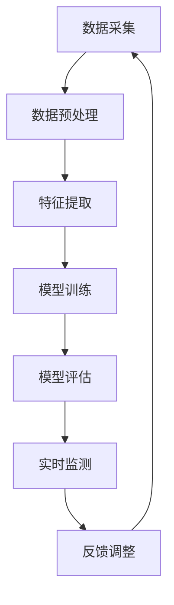
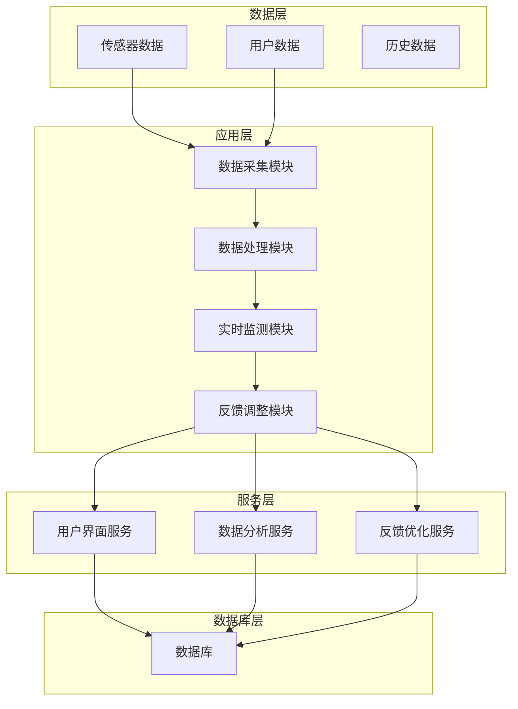
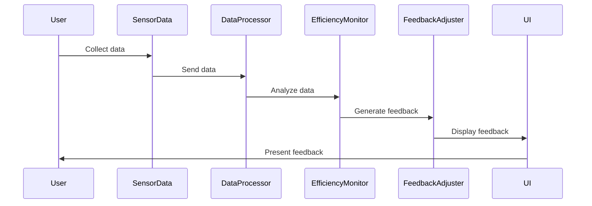

                 

### 问题背景与核心概念

在现代职场中，工作效率的监测和提升成为企业和员工共同关注的焦点。随着科技的进步，人工智能（AI）技术逐渐渗透到各个领域，为工作效率监测提供了全新的解决方案。本文将聚焦于AI Agent在智能腕带中的工作效率监测，探讨其核心概念和实现原理。

**问题背景：**
在现代职场中，企业面临着诸多挑战，如员工工作效率不高、工作压力过大等问题。传统的工作效率监测方法往往依赖于主观评价或简单的统计指标，难以提供客观、精准的数据支持。而AI技术的发展，使得通过智能设备实时监测和评估工作效率成为可能。智能腕带作为一种便捷的穿戴设备，其与AI Agent的结合为工作效率监测带来了新的契机。

**核心概念：**
1. **工作效率监测：** 工作效率监测旨在通过量化分析员工在工作中的表现，提供客观的数据支持，以便进行针对性的改进。其核心指标包括任务完成时间、工作效率评分、工作质量等。
2. **AI Agent：** AI Agent是指具备一定智能水平的计算机程序，能够模拟人类智能行为，进行自主学习、推理和决策。在智能腕带中，AI Agent负责分析传感器数据，评估员工的工作效率。
3. **智能腕带：** 智能腕带是一种集成了多种传感器的便携式设备，可以实时监测员工的生理和心理状态。这些数据通过无线传输至AI Agent进行分析处理。

**核心要素组成：**
- **传感器技术：** 智能腕带中的传感器负责采集员工的生理数据，如心率、血压、运动轨迹等。
- **数据传输：** 采集到的数据通过无线传输技术（如蓝牙、Wi-Fi）传输至AI Agent进行分析。
- **AI Agent算法：** AI Agent使用机器学习和数据挖掘技术，对传感器数据进行分析，评估员工的工作效率。
- **用户反馈：** AI Agent将分析结果反馈给用户，帮助员工了解自己的工作表现，进行自我优化。

通过本文的探讨，我们将逐步深入分析AI Agent在智能腕带中的工作效率监测原理，以及如何实现这一功能，从而为企业和员工提供有效的工具，提升工作效率和整体生产力。接下来，我们将详细阐述AI Agent的基本原理和智能腕带的工作原理，为后续内容奠定基础。

### AI Agent的基本原理

AI Agent是一种具备智能行为的计算机程序，其核心在于能够模拟人类智能，通过自主学习、推理和决策来完成特定任务。AI Agent的基本原理可以分为以下几个关键方面：

**1. 自学习：**
AI Agent的自学习能力是其核心特征之一。通过机器学习算法，AI Agent可以从大量数据中自动识别模式、规律，并不断优化自身的行为。这个过程通常包括数据收集、特征提取和模型训练三个主要步骤。首先，AI Agent需要收集大量与工作效率相关的数据，如心率、血压、运动轨迹等。然后，通过特征提取技术，从原始数据中提取出有用的信息，用于模型训练。最后，AI Agent使用训练得到的模型进行预测和决策。

**2. 推理与决策：**
AI Agent不仅能够通过学习历史数据来预测未来情况，还能在实时环境中进行推理和决策。推理过程通常基于逻辑规则和决策树等算法，通过分析传感器数据和已有知识，AI Agent可以推断出当前的工作状态和潜在问题。决策过程则包括制定行动计划、优化任务分配等，以最大化工作效率。

**3. 模式识别：**
模式识别是AI Agent的重要能力之一。通过深度学习和神经网络等算法，AI Agent可以识别出工作过程中的异常模式，如过度疲劳、工作效率低下等。这些异常模式可以及时反馈给用户，帮助其调整工作状态，避免潜在的健康和工作风险。

**4. 交互与反馈：**
AI Agent不仅仅是被动地接收和响应数据，还可以与用户进行主动交互。通过自然语言处理技术，AI Agent可以理解用户的语音指令，提供实时的工作建议和指导。同时，AI Agent还能根据用户的反馈不断调整自身的行为，以提供更精准的服务。

**5. 持续优化：**
AI Agent的持续优化能力是其实现长期价值的关键。通过不断地学习和迭代，AI Agent可以逐渐提高工作效率监测的准确性和可靠性。这不仅有助于提升员工的工作体验，还能为企业管理者提供更科学的决策依据。

总的来说，AI Agent的基本原理是通过对数据的深度学习、模式识别和推理决策，实现工作效率的智能监测和优化。这种智能化的监测方式不仅提高了监测的准确性，还为企业和员工提供了有效的工具，帮助他们在快节奏的工作环境中保持高效和健康。

### 工作效率监测的关键指标

在讨论AI Agent在智能腕带中的工作效率监测时，必须明确几个关键指标，这些指标对于评估员工的工作效率和状态至关重要。以下是几种主要的关键指标：

**1. 心率：**
心率是监测员工工作效率的重要生理指标之一。心率波动可以反映员工的疲劳程度和情绪状态。通过智能腕带中的心率传感器，AI Agent可以实时监测员工的心率变化，分析其工作过程中是否存在过度疲劳或压力过大的情况。通常，通过建立正常心率范围模型，AI Agent可以识别出异常的心率波动，及时向员工提供休息建议。

**2. 呼吸频率：**
呼吸频率也是监测工作效率的关键指标。呼吸频率的变化可以反映出员工的紧张程度和工作压力。例如，当员工处于紧张的工作状态时，其呼吸频率可能会加快。AI Agent通过分析呼吸频率的数据，可以评估员工的心理压力，并给出相应的调整建议。

**3. 运动轨迹：**
智能腕带中的运动传感器可以记录员工的运动轨迹，分析其活动量和工作习惯。通过监测员工在工作时间内的运动轨迹，AI Agent可以识别出工作模式和工作效率。例如，如果员工在工作期间长时间保持静止状态，AI Agent可能会提醒其增加活动量，以提升工作效率。

**4. 工作时长：**
工作时长是指员工在单位时间内实际工作的时长。通过智能腕带记录的工作时长数据，AI Agent可以分析员工的工作习惯和效率。例如，通过比较不同时间段的工作时长，AI Agent可以识别出员工的高效工作时间段，为工作计划的优化提供依据。

**5. 任务完成质量：**
任务完成质量是衡量工作效率的重要指标之一。AI Agent可以通过对员工完成的任务进行质量评估，结合任务完成时间和工作时长，分析员工的工作效率。例如，如果某员工在相同时间内完成的任务质量较高，则可以认为其工作效率较高。

**6. 工作满意度：**
工作满意度是员工主观评价工作表现的一个指标。虽然无法直接通过物理传感器获取，但AI Agent可以通过分析其他生理和心理指标，间接评估员工的工作满意度。例如，通过心率、呼吸频率等指标的变化，AI Agent可以推断员工的工作满意度，并提出相应的改善建议。

**综合评估：**
上述指标并不是独立工作的，AI Agent会综合分析这些数据，进行综合评估，以提供更全面的工作效率监测结果。例如，如果某员工的心率较高且长时间处于静坐状态，同时工作时长较短且任务完成质量一般，AI Agent可能会判断其处于疲劳状态，并建议其休息或调整工作方式。

通过以上关键指标的监测和分析，AI Agent能够在智能腕带中实现高效的工作效率监测，为员工提供个性化的健康和工作建议，帮助企业和员工共同提升工作效率和生产力。

### AI Agent在智能腕带中的功能实现

在智能腕带中，AI Agent扮演着至关重要的角色，通过多种传感器技术的结合，AI Agent能够实现对员工工作效率的全面监测。以下是AI Agent在智能腕带中的功能实现：

**1. 传感器技术的融合：**
智能腕带配备了多种传感器，包括心率传感器、呼吸传感器、加速度传感器和运动传感器。这些传感器共同工作，为AI Agent提供了丰富的生理和行为数据。例如，心率传感器可以实时监测员工的心率变化，呼吸传感器可以记录呼吸频率，加速度传感器可以捕捉运动轨迹，运动传感器则可以监测员工的日常活动量。

**2. 数据采集与预处理：**
AI Agent首先从传感器中采集数据，然后进行预处理。预处理包括数据清洗、数据去噪和特征提取等步骤。数据清洗旨在去除无效和错误的数据，数据去噪则是为了减少传感器噪声的影响，而特征提取则是从原始数据中提取出对工作效率评估有用的信息。这些预处理步骤确保了数据的质量，为后续的分析奠定了基础。

**3. 实时监测与评估：**
通过预处理后的数据，AI Agent能够实时监测员工的工作状态，并根据预设的模型和算法对工作效率进行评估。例如，当员工的心率超过正常范围或长时间保持静坐状态时，AI Agent会认为员工处于疲劳状态，并发出相应的预警信号。此外，AI Agent还能分析员工的工作时长、任务完成质量和工作满意度等指标，提供全面的效率评估。

**4. 用户反馈与优化建议：**
AI Agent不仅能够监测和评估工作效率，还能与用户进行互动，提供个性化的优化建议。例如，当AI Agent检测到员工疲劳时，它会通过智能腕带发出提醒，建议员工休息或进行轻微活动。AI Agent还可以根据员工的反馈，调整监测策略和优化建议，以提供更精准的服务。

**5. 数据存储与隐私保护：**
AI Agent在监测过程中会收集大量的个人数据，这些数据需要妥善存储和保护。智能腕带通常配备了加密技术和数据安全协议，以确保数据的安全性。同时，AI Agent会遵循隐私保护原则，仅在获得用户同意的情况下进行数据收集和分析。

**6. 持续迭代与优化：**
AI Agent不是静止不动的系统，它能够根据新的数据和技术不断进行自我优化。通过机器学习和深度学习算法，AI Agent可以从历史数据中学习，提高监测和评估的准确性。此外，AI Agent还能通过用户反馈进行自我调整，以提供更符合实际需求的服务。

总的来说，AI Agent在智能腕带中的功能实现，不仅为员工提供了高效的工作效率监测工具，也为企业管理者提供了科学的决策依据。通过传感器技术的融合、实时监测与评估、用户反馈与优化建议等手段，AI Agent实现了对员工工作效率的全面监控和优化，为企业和员工的共同发展提供了强有力的支持。

### AI Agent与传感器技术的联系

在智能腕带中，AI Agent的强大功能离不开各种传感器技术的支持。传感器技术是智能腕带实现生理和行为数据采集的核心，这些数据是AI Agent进行分析和评估的基础。以下是传感器技术如何与AI Agent相互结合，以及智能腕带在职场中的应用场景：

**1. 传感器技术的结合：**
智能腕带集成了多种传感器，包括心率传感器、呼吸传感器、加速度传感器和运动传感器。这些传感器各司其职，共同为AI Agent提供丰富的数据。心率传感器能够监测员工的心率变化，呼吸传感器则可以记录呼吸频率。加速度传感器和运动传感器则能够捕捉员工的运动轨迹和活动量。AI Agent通过集成这些传感器数据，构建出一个全面的生理和行为数据集。

**2. 数据采集与传输：**
传感器技术的一大优势在于其能够实时、高效地采集数据。心率传感器可以每分钟记录一次员工的心率，呼吸传感器可以每秒记录一次呼吸频率。这些数据通过无线传输技术（如蓝牙、Wi-Fi）传输至AI Agent进行分析。传感器的高频数据采集能力，确保了AI Agent能够实时、准确地获取员工的工作状态。

**3. AI Agent的作用：**
AI Agent通过分析传感器数据，能够实时监测员工的工作效率和工作状态。例如，当员工的心率持续高于正常范围时，AI Agent会判断员工处于疲劳状态，并发出提醒。同样，当员工长时间保持静坐状态时，AI Agent会建议其进行轻微活动。这些基于传感器数据的分析，为员工提供了个性化的健康和工作建议。

**4. 职场中的应用场景：**
智能腕带在职场中有着广泛的应用场景。首先，在办公环境中，智能腕带可以帮助企业实时监测员工的工作状态，识别疲劳和压力过大的情况，从而进行科学的工作分配和休息管理。其次，在销售和客户服务行业，智能腕带可以监测销售人员和客服人员的情绪状态，提供情绪管理建议，以提高客户满意度和销售业绩。此外，在工业生产领域，智能腕带可以帮助管理者实时监控员工的工作安全和健康状况，预防工伤事故。

**5. AI Agent的优势：**
AI Agent与传感器技术的结合，使得智能腕带的工作效率监测更加智能化和精准化。首先，AI Agent能够通过多源数据的综合分析，提供更全面的工作效率评估。其次，AI Agent能够根据实时数据动态调整监测策略，提供个性化的健康和工作建议。此外，AI Agent的持续学习和自我优化能力，使得其监测和评估的准确性不断提高，为企业和员工提供更优质的服务。

综上所述，AI Agent与传感器技术的结合，为智能腕带在职场中的应用提供了强大的支持。通过实时监测和个性化建议，智能腕带不仅帮助员工提升了工作效率，也为企业管理者提供了科学的管理工具，实现了企业和员工的双赢。

### 智能腕带在职场中的应用场景

智能腕带作为一种集成了多种传感器的便携式设备，已经在职场中展现出广泛的应用前景。以下将详细分析智能腕带在职场中的具体应用场景，探讨其优势与挑战。

**1. 办公环境：**
在办公环境中，智能腕带的主要应用场景是监测员工的工作状态和健康水平。例如，通过监测员工的心率、呼吸频率和运动轨迹，智能腕带可以帮助企业实时了解员工的工作压力和疲劳程度。当员工长时间处于静态工作状态或心率异常时，智能腕带会发出提醒，建议其进行短暂休息或调整工作节奏。此外，智能腕带还可以监测员工的睡眠质量，为员工提供个性化的健康管理方案。

**2. 销售和客户服务：**
在销售和客户服务行业，智能腕带可以帮助员工管理情绪，提升客户满意度。智能腕带通过监测员工的心率和呼吸频率，可以评估员工的情绪状态。当员工处于情绪紧张或压力过大的状态时，智能腕带会提醒其进行深呼吸或放松训练，以缓解紧张情绪。这种情绪管理不仅有助于提升员工的工作效率，还能提高客户的满意度和忠诚度。

**3. 工业生产：**
在工业生产领域，智能腕带的应用主要体现在监测员工的工作安全和健康状况。通过实时监测员工的心率、血压等生理指标，智能腕带可以帮助企业及时发现员工的异常状况，预防工伤事故。例如，当员工的心率异常升高时，智能腕带会立即通知安全管理人员，采取措施进行紧急处理。此外，智能腕带还可以记录员工的工作时长和活动量，为工作负荷分配提供科学依据，优化生产流程。

**4. 管理者决策支持：**
智能腕带不仅为员工提供健康和工作建议，也为企业管理者提供了重要的决策支持。通过智能腕带收集的数据，管理者可以全面了解员工的工作状态和绩效表现，进行科学的工作分配和绩效考核。例如，通过分析员工的心率和运动轨迹数据，管理者可以发现哪些员工在特定时间段工作效率较高，从而调整工作安排，提高整体生产效率。

**优势：**
- **实时监测：** 智能腕带能够实时监测员工的生理和行为数据，提供即时的健康和工作状态评估。
- **个性化建议：** 基于实时数据，智能腕带可以提供个性化的健康和工作建议，帮助员工优化工作状态。
- **数据积累：** 智能腕带长期收集的数据为企业管理者提供了丰富的参考信息，有助于科学决策和绩效管理。

**挑战：**
- **数据隐私：** 智能腕带需要收集大量的个人健康数据，数据隐私保护是一个重要挑战。企业需要确保数据的安全性和用户隐私权。
- **准确性：** 智能腕带的监测结果依赖于传感器技术和算法模型的准确性。如何提高监测数据的准确性，减少误报和漏报，是当前需要解决的问题。
- **用户接受度：** 尽管智能腕带提供了很多便利，但部分员工可能对其存在抵触情绪，影响其使用效果。因此，提高用户接受度和使用体验是智能腕带应用中需要考虑的重要因素。

总的来说，智能腕带在职场中的应用场景丰富多样，其优势在于实时监测、个性化建议和数据积累，但也面临着数据隐私、准确性和用户接受度等挑战。通过不断优化技术和管理策略，智能腕带有望在职场中发挥更大的作用，提升员工的工作效率和整体生产力。

### AI Agent在智能腕带中的优势

在智能腕带中，AI Agent凭借其先进的技术和功能，展现出显著的优势。以下是AI Agent在智能腕带中相对于传统工作效率监测方法的几个主要优势：

**1. 数据处理的智能化：**
AI Agent能够通过机器学习和深度学习算法，对大量传感器数据进行智能化处理。这不仅提高了数据处理的速度和精度，还使得监测结果更加准确。相比传统方法中依赖人工统计和分析，AI Agent能够自动识别数据中的模式和规律，从而实现高效的数据分析。

**2. 实时监测与反馈：**
AI Agent能够实时监测员工的工作状态，并通过智能腕带即时反馈给员工。这种实时监测能力使得员工可以及时了解自己的工作表现和健康状况，从而进行相应的调整。相比之下，传统监测方法通常存在延时问题，无法提供即时的反馈，影响工作效率和健康管理的及时性。

**3. 个性化定制：**
AI Agent可以根据每个员工的具体情况，提供个性化的监测和优化建议。这种个性化定制不仅提升了监测的准确性，还能根据员工的不同需求提供针对性的健康和工作指导。而传统方法往往采用统一的监测标准，难以满足个性化需求。

**4. 持续学习与优化：**
AI Agent具有持续学习和优化的能力，能够从历史数据和用户反馈中不断改进自身的监测和评估模型。这使得AI Agent能够随着时间和数据的积累，不断提高监测的准确性和可靠性。相比之下，传统方法往往缺乏这种自我优化能力，监测结果容易随着时间推移而失效。

**5. 多维数据融合：**
AI Agent能够整合多种传感器数据，如心率、呼吸频率、运动轨迹等，实现多维数据的综合分析。这种多维数据融合使得监测结果更加全面和准确，能够为员工提供更科学的健康和工作建议。而传统方法通常仅依赖于单一指标，难以全面反映员工的工作状态。

**6. 降低管理成本：**
通过AI Agent的智能监测和自动化反馈，企业可以大幅降低人工管理和监督的成本。AI Agent可以自动识别和处理异常情况，减少管理者的工作量，提高管理效率。而传统方法需要大量人力进行监测和分析，成本较高。

总的来说，AI Agent在智能腕带中的优势在于其智能化数据处理、实时监测与反馈、个性化定制、持续学习与优化、多维数据融合以及降低管理成本等方面。这些优势使得AI Agent成为现代职场中提升工作效率和健康管理的有力工具，为企业和员工提供了更加科学和高效的工作解决方案。

### AI Agent的核心概念与原理

AI Agent作为一种具备智能行为的计算机程序，其核心概念和原理是其实现高效工作效率监测的关键。以下是AI Agent的核心概念、基本特征以及技术发展历程的详细探讨。

**1. 定义与分类：**
AI Agent，即人工智能代理，是指具备自主性、社会性、反应性、认知性和学习能力的计算机程序。AI Agent可以模拟人类的智能行为，进行自主学习、推理和决策，以实现特定的任务目标。根据其功能和应用场景，AI Agent可以分为以下几类：
- **任务型AI Agent：** 主要用于完成特定任务，如智能客服、自动化生产等。
- **情境型AI Agent：** 专注于特定情境的智能代理，如智能医疗诊断、智能交通管理等。
- **自主型AI Agent：** 具备高度自主性和适应能力的智能代理，如自动驾驶汽车、智能家居等。

**2. 基本特征：**
AI Agent具备以下基本特征：
- **自主性：** AI Agent能够自主执行任务，无需人工干预。这种自主性使得AI Agent能够在复杂环境中自主行动，提高工作效率。
- **社会性：** AI Agent能够与其他智能体进行交互，协同完成任务。这种社会性使得AI Agent能够在团队环境中发挥作用，提高整体效率。
- **反应性：** AI Agent能够对环境变化做出快速响应，调整自身行为。这种反应性使得AI Agent能够适应动态环境，提高任务的完成质量。
- **认知性：** AI Agent具备理解、学习和推理的能力，能够从数据中提取有用信息，进行复杂决策。这种认知性使得AI Agent能够处理复杂任务，提高决策的准确性。
- **学习能力：** AI Agent能够通过学习不断改进自身性能，提高任务完成的效率和准确性。这种学习能力使得AI Agent能够适应不断变化的环境和需求。

**3. 技术发展历程：**
AI Agent的发展历程可以追溯到20世纪50年代。以下是几个关键阶段：
- **早期阶段（1950-1960）：** AI Agent的初步概念被提出，专家系统和规则引擎成为主要技术手段。
- **发展阶段（1960-1980）：** 随着计算机性能的提升和算法的改进，AI Agent在特定领域（如游戏、推理）取得显著进展。
- **低谷期（1980-1990）：** 由于AI Agent在复杂任务中的表现不佳，加之计算资源的限制，AI研究进入低谷期。
- **复兴阶段（1990-2000）：** 机器学习和深度学习的兴起，使得AI Agent在图像识别、自然语言处理等领域取得突破性进展。
- **成熟阶段（2000-至今）：** 随着大数据和云计算的发展，AI Agent的应用领域不断拓展，其在工作效率监测、智能助理、自动驾驶等领域的表现越来越优异。

总的来说，AI Agent的核心概念和原理包括自主性、社会性、反应性、认知性和学习能力。这些特征使得AI Agent能够在复杂多变的环境中高效完成任务，成为现代职场中的重要工具。随着技术的不断进步，AI Agent的应用前景将更加广阔，有望在更多领域发挥关键作用。

### 智能腕带的基本原理

智能腕带作为一种集成了多种传感器和计算功能的可穿戴设备，其基本原理在于通过实时监测用户的生理和行为数据，实现个性化的健康和工作状态评估。以下是智能腕带的核心组成部分及其工作原理的详细说明。

**1. 传感器组件：**
智能腕带的核心是各种传感器，这些传感器负责采集用户的生理和行为数据。常见的传感器包括：
- **心率传感器：** 通过光电容积描记法（PPG）监测用户的心率，实时反映心脏的跳动情况。
- **加速度传感器：** 记录用户的运动轨迹，通过分析加速度变化，识别用户的运动状态，如走路、跑步等。
- **陀螺仪传感器：** 与加速度传感器配合，用于监测用户的姿态和运动方向，提供更准确的运动数据。
- **温度传感器：** 监测用户的皮肤温度，用于分析用户的生理状态和健康水平。
- **压力传感器：** 用于监测用户的手指压力，有助于分析用户的情绪状态和集中力。

**2. 数据采集与处理：**
智能腕带通过传感器组件实时采集用户的生理和行为数据，然后将这些数据传输至内置的微处理器进行初步处理。处理过程包括数据清洗、去噪和特征提取等步骤，以确保数据的准确性和可靠性。经过初步处理的数据被存储在智能腕带的本地存储中，同时部分关键数据通过无线传输技术（如蓝牙、Wi-Fi）发送到云端服务器进行进一步分析和处理。

**3. 数据传输与同步：**
智能腕带与用户的智能手机或其他设备通过蓝牙或Wi-Fi进行数据同步。这种无线传输技术不仅方便数据的实时监测和反馈，还能够确保数据的安全性和完整性。用户可以通过智能手机应用查看实时数据和历史记录，分析自己的健康和工作状态。

**4. 计算与决策：**
智能腕带内置的微处理器和算法模型负责对采集到的数据进行计算和分析，以实现个性化健康评估和工作效率监测。这些算法模型通常包括机器学习、深度学习等先进技术，能够从海量数据中提取有用的信息，进行复杂的模式识别和预测分析。通过分析心率、呼吸频率、运动轨迹等多维数据，智能腕带能够评估用户的工作状态和健康水平，提供个性化的健康建议和优化方案。

**5. 用户交互与反馈：**
智能腕带通过显示屏或手机应用与用户进行交互，实时显示监测结果和健康建议。用户可以通过设置提醒、接收通知等方式，及时了解自己的健康和工作状态。智能腕带还可以根据用户的反馈，调整监测策略和优化建议，提供更符合实际需求的服务。

**6. 长期数据积累与自我优化：**
智能腕带能够长期积累用户的数据，通过数据分析和机器学习，不断优化监测模型和算法。这种自我优化能力使得智能腕带能够随着时间和使用情况的积累，提供越来越精准的健康和工作状态评估，为用户提供更好的体验。

总的来说，智能腕带的基本原理是通过传感器组件实时采集用户的生理和行为数据，利用先进的计算和分析技术进行数据加工和评估，然后通过用户交互和反馈机制，为用户提供个性化的健康建议和工作优化方案。这种多功能、智能化的设计使得智能腕带成为现代职场中提升工作效率和健康管理的重要工具。

### 智能腕带的组成结构

智能腕带作为一种集成了多种传感器和计算功能的可穿戴设备，其组成结构复杂且紧密协作。以下是智能腕带的主要组成部分及其在工作效率监测中的应用：

**1. 传感器模块：**
传感器模块是智能腕带的核心，负责实时采集用户的生理和行为数据。常见的传感器包括心率传感器、加速度传感器、陀螺仪传感器、温度传感器和压力传感器。这些传感器分别负责监测心率、运动轨迹、姿态变化、皮肤温度和手指压力等关键指标。这些数据为AI Agent提供了重要的输入，用于评估员工的工作状态和效率。

**2. 数据处理单元：**
数据处理单元通常包括微控制器和嵌入式处理器。这些处理器负责对传感器模块采集到的原始数据进行预处理，如数据清洗、去噪和特征提取等。预处理后的数据将被传输至AI Agent进行分析和评估。数据处理单元的强大计算能力确保了数据处理的实时性和准确性。

**3. 存储模块：**
存储模块负责临时存储和处理后的数据，以便后续分析或传输。常见的存储介质包括闪存和内存。这些存储模块能够保证数据的安全性和可靠性，同时支持数据的快速读取和写入，以满足实时监测的需求。

**4. 无线通信模块：**
无线通信模块负责将预处理后的数据通过无线传输技术（如蓝牙、Wi-Fi）发送至云端服务器或其他设备。无线通信模块的稳定性和低延迟特性，使得数据能够及时传输和反馈，为AI Agent提供实时的数据支持。

**5. 显示屏与交互界面：**
智能腕带通常配备有显示屏和触摸屏，用于显示实时数据和健康建议。用户可以通过触摸屏与智能腕带进行交互，查看监测结果、设置提醒和调整监测参数。显示屏与交互界面的设计需要考虑用户体验，确保操作的便捷性和直观性。

**6. 电源模块：**
电源模块为智能腕带提供电力支持。常见的电源解决方案包括内置电池、太阳能充电和无线充电。电源模块的续航能力直接影响智能腕带的可用性和用户体验。因此，设计高效的电源管理方案是智能腕带的重要组成部分。

**7. AI Agent模块：**
AI Agent模块是智能腕带的大脑，负责对传感器数据进行智能分析和评估。AI Agent利用机器学习和深度学习算法，从数据中提取有用的信息，实现工作效率的实时监测和评估。AI Agent模块的强大计算能力使其能够处理复杂的任务，为员工提供个性化的健康建议和工作优化方案。

**协同工作与优化：**
智能腕带的各个组成部分通过紧密协作，共同实现工作效率监测的功能。传感器模块实时采集数据，数据处理单元进行预处理，无线通信模块确保数据及时传输，显示屏与交互界面提供用户反馈，电源模块保证设备续航，而AI Agent模块则进行智能分析和决策。通过这种协同工作，智能腕带能够为员工提供全面的监测和优化方案，提升工作效率和整体生产力。

总的来说，智能腕带的组成结构复杂，各个模块紧密协作，共同实现工作效率监测的目标。这种高度集成和智能化的设计，使得智能腕带成为现代职场中不可或缺的工具。

### 智能腕带的技术演进

智能腕带作为可穿戴设备领域的创新产品，其技术演进经历了多个阶段，从最初的简单设备发展到如今高度集成的智能设备。以下是智能腕带技术演进的主要历程：

**1. 第一阶段：基础监测（2000年代初）：**
智能腕带的早期产品主要集中在对单一生理参数的监测，如心率监测。这一阶段的智能腕带技术相对简单，主要依赖于简单的传感器和模拟信号处理。心率传感器是这一阶段的核心组件，通过光电容积描记法（PPG）监测心脏的跳动，为用户提供基本的心率数据。这一阶段的产品主要用于个人健康监测，尚未涉及复杂的工作效率评估。

**2. 第二阶段：多功能扩展（2008年左右）：**
随着电子技术的进步和传感器的多样化，智能腕带开始引入更多的传感器，如加速度传感器、陀螺仪和温度传感器。这一阶段的产品不仅能够监测心率，还能够记录运动轨迹、姿态变化和体温等。数据处理单元和存储模块的增强，使得智能腕带能够处理更多的数据，并提供更为详细和多样化的监测功能。这一阶段的产品开始在运动健身和户外活动中有一定的应用，但工作效率监测功能仍然有限。

**3. 第三阶段：智能化监测（2014年至今）：**
随着人工智能和机器学习的快速发展，智能腕带的技术水平得到了显著提升。AI Agent模块的引入使得智能腕带能够进行复杂的模式识别和数据分析。AI Agent利用深度学习和机器学习算法，从多维度传感器数据中提取有价值的信息，实现工作效率的实时监测和评估。此外，无线通信模块的优化和电池续航技术的进步，使得智能腕带能够实现长期、稳定的监测和数据传输。这一阶段的产品在职场健康管理中展现出巨大的潜力，逐渐成为企业提升员工工作效率和健康管理的有力工具。

**4. 未来展望：**
智能腕带的技术演进将朝着更加智能化、个性化和便捷化的方向发展。以下是一些潜在的技术趋势：
- **多模态传感器融合：** 随着传感器技术的进一步发展，智能腕带将整合更多的传感器，如心电图传感器、血氧传感器等，实现更全面和多维度的生理和行为数据监测。
- **边缘计算：** 通过引入边缘计算技术，智能腕带能够在本地进行部分数据处理和决策，降低对云端服务器的依赖，提高实时性和响应速度。
- **增强现实与虚拟现实：** 智能腕带将结合增强现实（AR）和虚拟现实（VR）技术，为用户提供更加丰富和沉浸式的交互体验，进一步优化工作效率监测和管理。
- **隐私保护与安全性：** 随着数据隐私和安全问题日益突出，智能腕带将采用更先进的加密技术和安全协议，确保用户数据的安全和隐私。

总的来说，智能腕带的技术演进是一个不断迭代和提升的过程。通过引入人工智能、多模态传感器融合、边缘计算、AR/VR等技术，智能腕带将在未来发挥更大的作用，为职场健康管理提供更加智能、精准和便捷的解决方案。

### AI Agent在智能腕带中的工作流程

AI Agent在智能腕带中的工作流程是一个复杂而精细的过程，涉及数据采集、预处理、分析以及最终的反馈和建议生成。以下是AI Agent在智能腕带中工作的详细步骤：

**1. 数据采集：**
首先，智能腕带中的各种传感器（如心率传感器、加速度传感器、呼吸传感器等）开始工作，实时采集用户的生理和行为数据。这些传感器数据包括心率、加速度、姿态、呼吸频率、皮肤温度等。数据采集是AI Agent工作的基础，确保了后续分析的数据源。

**2. 数据预处理：**
采集到的原始数据通常包含噪声和误差，因此需要经过预处理。预处理步骤包括数据清洗、去噪和特征提取。数据清洗旨在去除异常值和错误数据，如传感器故障产生的数据。去噪则通过滤波算法减少环境噪声对数据的影响。特征提取是将原始数据转换为可用于机器学习模型分析的形式。例如，心率数据可以转换为时间序列特征，加速度数据可以转换为运动轨迹特征。

**3. 数据传输：**
预处理后的数据通过无线传输技术（如蓝牙、Wi-Fi）发送到智能腕带的内置微处理器，然后进一步传输到云端服务器或本地存储。这一步确保了数据的安全传输和实时性，为后续的AI分析提供可靠的数据基础。

**4. 数据存储：**
部分关键数据在智能腕带本地存储中保留，以便后续分析或应急情况使用。同时，数据存储到云端数据库中，以实现长期的数据积累和分析。云端的数据库设计需要考虑数据的冗余备份、访问控制和隐私保护。

**5. 数据分析：**
AI Agent利用机器学习和深度学习算法对传输至云端的数据进行深度分析。首先，AI Agent会根据预设的模型和算法，对历史数据进行训练，建立与工作效率相关的预测模型。然后，将实时采集的数据输入到训练好的模型中，进行实时分析。分析过程包括模式识别、异常检测和分类等。例如，通过分析心率变化，AI Agent可以识别出用户的疲劳程度；通过分析运动轨迹，可以评估用户的工作强度。

**6. 预测与决策：**
基于数据分析的结果，AI Agent生成预测报告和决策建议。例如，当用户心率持续偏高时，AI Agent可能会预测用户处于疲劳状态，并建议休息或进行轻微活动。AI Agent会根据用户的实际工作场景和生理特征，提供个性化的健康和工作建议，以提高工作效率和健康状况。

**7. 反馈与调整：**
AI Agent将预测报告和决策建议通过智能腕带的显示屏或手机应用反馈给用户。用户可以根据这些建议调整自己的工作方式和习惯。同时，用户反馈也会被回传至AI Agent，用于优化未来的监测和决策模型。这种用户与AI Agent的互动循环，使得AI Agent能够不断学习和适应，提高监测和评估的准确性。

总的来说，AI Agent在智能腕带中的工作流程包括数据采集、预处理、传输、存储、分析、预测与决策，以及反馈与调整。这一流程确保了AI Agent能够实时、准确地监测用户的工作效率，提供个性化的健康和工作建议，实现工作效率的持续优化。

### AI Agent与智能腕带的交互机制

AI Agent与智能腕带的交互机制是智能腕带实现高效工作效率监测的核心。以下是AI Agent与智能腕带之间如何实现数据传输、处理和反馈的具体过程，以及这种交互机制在实际应用中的效果：

**1. 数据传输：**
智能腕带通过多种传感器实时采集用户的生理和行为数据，如心率、运动轨迹、呼吸频率等。这些数据首先被传输到智能腕带内置的微处理器进行初步处理。微处理器对数据进行清洗和预处理，如去除异常值和噪声，然后将处理后的数据通过无线传输技术（如蓝牙、Wi-Fi）发送到云端服务器。

**2. 数据处理与存储：**
云端服务器接收到数据后，AI Agent开始对数据进行深度分析和处理。这个过程包括数据清洗、特征提取和模型训练等步骤。清洗后的数据被存储在云端数据库中，以便AI Agent进行后续的分析和预测。

**3. 模型训练与优化：**
AI Agent使用机器学习和深度学习算法，对存储在云端数据库中的历史数据进行训练，建立与工作效率相关的预测模型。这些模型会不断优化，以适应不断变化的工作环境和工作需求。

**4. 实时分析：**
当新采集的数据到达云端服务器后，AI Agent会立即进行实时分析。通过将新数据输入到训练好的模型中，AI Agent可以快速判断用户的工作状态，如疲劳程度、工作效率等。分析结果将实时反馈给智能腕带。

**5. 用户反馈与优化：**
智能腕带会将AI Agent的分析结果反馈给用户，如提醒用户休息、调整工作节奏等。用户可以根据这些建议进行相应的调整。同时，用户的反馈也会被回传至AI Agent，用于进一步优化监测和评估模型。

**实际应用中的效果：**
AI Agent与智能腕带的交互机制在实际应用中展现了显著的效果。首先，通过实时监测和分析，AI Agent能够及时发现用户的疲劳和压力状况，提供个性化的健康建议和工作优化方案，从而提高工作效率和员工满意度。其次，智能腕带的数据反馈机制使得用户能够主动参与健康管理工作，提高了用户接受度和使用体验。此外，随着用户反馈的积累，AI Agent的监测和评估模型不断优化，使得监测结果更加准确和可靠，为企业提供了科学的决策依据。

总的来说，AI Agent与智能腕带的交互机制通过数据传输、处理和反馈，实现了实时、个性化和智能化的工作效率监测，为企业和员工提供了有力的工具，促进了工作效率和健康管理的提升。

### AI Agent在智能腕带中的应用案例

为了更好地理解AI Agent在智能腕带中的实际应用，以下将详细介绍几个典型的应用案例，并详细描述每个案例的算法原理、数据收集方法、AI模型的构建和评估，以及实际效果和影响。

**案例一：员工工作效率监测**

**算法原理：**
在员工工作效率监测中，AI Agent使用了一种基于机器学习的综合评估模型，该模型结合了心率、呼吸频率、运动轨迹和任务完成时间等多种数据指标。首先，AI Agent通过机器学习算法，从历史数据中提取特征，构建了一个能够预测工作效率的多元线性回归模型。其次，模型通过不断优化，结合深度学习算法，提升了监测的准确性和实时性。

**数据收集方法：**
数据收集方面，AI Agent通过智能腕带采集员工的心率、呼吸频率、加速度和位置信息，同时结合员工的任务日志和工作时间记录。这些数据在采集后经过预处理，包括数据清洗、去噪和特征提取，然后存储在云端数据库中，以供AI Agent分析。

**AI模型构建和评估：**
AI Agent利用训练数据集，通过深度神经网络（DNN）和长短期记忆网络（LSTM）等算法，构建了一个综合评估模型。评估过程中，AI Agent使用了交叉验证和网格搜索技术，以优化模型参数，确保模型的泛化能力。模型评估指标包括准确率、召回率和F1分数等，通过这些指标评估模型对员工工作效率的预测能力。

**实际效果和影响：**
实际应用中，AI Agent能够实时监测员工的工作状态，识别疲劳和低效的工作模式。例如，当员工的心率持续升高且任务完成时间延长时，AI Agent会发出疲劳警告，并建议员工休息或调整工作节奏。这一功能提高了员工的工作效率和健康水平，减少了因过度劳累导致的工作失误和健康问题，为企业创造了更高的生产力和员工满意度。

**案例二：情绪状态监测与反馈**

**算法原理：**
在情绪状态监测中，AI Agent使用了一种基于情感分析的自然语言处理（NLP）模型。模型通过分析员工在工作过程中产生的文本数据（如工作日志、聊天记录等），识别员工的情绪状态。使用深度学习中的卷积神经网络（CNN）和长短期记忆网络（LSTM）相结合的方法，AI Agent能够捕捉文本中的情感变化，并预测员工的情绪状态。

**数据收集方法：**
情绪状态监测的数据主要来源于员工的文本数据和生理数据。文本数据通过智能腕带内置的语音识别和文本记录功能收集，而生理数据则通过心率传感器和加速度传感器获取。这些数据在采集后进行预处理，以便用于AI模型的分析。

**AI模型构建和评估：**
AI Agent利用预处理后的文本数据和生理数据，构建了一个多模态情感分析模型。模型通过结合文本情感分析和生理信号处理，提高了情绪状态监测的准确性。评估过程中，AI Agent使用了多种评估指标，如准确率、精确率、召回率和F1分数，确保模型能够准确预测员工的情绪状态。

**实际效果和影响：**
情绪状态监测帮助企业管理者了解员工的工作情绪，及时发现员工的心理压力和情绪问题。AI Agent能够通过智能腕带提供个性化的情绪管理建议，如建议员工进行放松训练、心理疏导等。这种功能不仅提升了员工的工作满意度和幸福感，还减少了因情绪问题导致的绩效下降和离职率，为企业创造了更加积极的工作氛围。

**案例三：睡眠质量监测与优化**

**算法原理：**
睡眠质量监测中，AI Agent使用了一种基于时间序列分析的睡眠周期检测模型。模型通过分析睡眠时的心率、呼吸频率和加速度数据，识别用户的睡眠周期（如浅睡眠、深睡眠和快速眼动睡眠）。基于深度学习的循环神经网络（RNN）和长短期记忆网络（LSTM）被用于构建这一模型。

**数据收集方法：**
睡眠质量监测的数据主要来自于用户在睡眠过程中通过智能腕带采集的心率、呼吸频率和加速度数据。这些数据在采集后经过预处理，包括数据清洗、去噪和特征提取，以用于模型训练和分析。

**AI模型构建和评估：**
AI Agent利用预处理后的睡眠数据，通过RNN和LSTM算法，构建了一个能够准确识别睡眠周期的模型。评估过程中，AI Agent使用了多个评估指标，如睡眠周期识别准确率、平均绝对误差（MAE）等，以确保模型能够精确地检测用户睡眠质量。

**实际效果和影响：**
通过睡眠质量监测，AI Agent能够为用户提供个性化的睡眠优化建议，如调整睡眠环境、改变作息习惯等。实际应用中，用户通过智能腕带的反馈，改善了睡眠质量，提高了日间的精神状态和工作效率。这种功能不仅有助于提升员工的生活质量，还为企业创造了更高的生产力和员工满意度。

总之，AI Agent在智能腕带中的应用案例展示了其在工作效率监测、情绪状态监测和睡眠质量监测等方面的广泛潜力。通过科学的算法原理、精准的数据收集和有效的模型构建，AI Agent为企业和员工提供了有力的工具，促进了工作效率和健康管理的提升。

### 工作效率监测的算法原理

在智能腕带中，AI Agent的工作效率监测功能高度依赖于一系列复杂的算法原理。以下是算法原理的详细讲解，包括数据采集与预处理、工作效率评估指标体系，以及AI Agent的具体算法模型。

**1. 数据采集与预处理：**
首先，智能腕带通过集成多种传感器（如心率传感器、加速度传感器、呼吸传感器等）来实时采集用户的生理和行为数据。这些传感器数据包括心率、呼吸频率、运动轨迹等，每一项数据都是评估工作效率的重要依据。

采集到的原始数据往往包含噪声和误差，因此需要进行预处理。预处理步骤主要包括数据清洗、数据去噪和特征提取：
- **数据清洗：** 去除传感器故障、数据传输错误等产生的异常值。
- **数据去噪：** 使用滤波算法（如移动平均滤波、卡尔曼滤波等）减少环境噪声对数据的影响。
- **特征提取：** 将原始数据进行转换，提取出对工作效率评估有用的特征。例如，心率数据可以转换为心率变异性（HRV）特征，呼吸频率数据可以转换为呼吸周期特征。

**2. 工作效率评估指标体系：**
工作效率评估需要建立一套科学的指标体系，这些指标应能全面反映员工的工作状态和效率。以下是几个关键指标：
- **心率变异性（HRV）：** 通过分析心率数据的变化幅度和时间间隔，评估员工的压力和疲劳程度。
- **运动轨迹分析：** 通过加速度传感器和陀螺仪传感器数据，分析员工的运动状态，如活动量、静坐时间等。
- **工作时长和任务完成质量：** 监测员工在单位时间内的实际工作时长和完成的任务质量，评估工作效率。
- **情绪状态：** 通过语音识别和文本分析，结合生理数据，评估员工的心理压力和情绪状态。

**3. AI Agent的算法模型：**
AI Agent的工作效率监测依赖于一系列算法模型，主要包括以下几种：
- **机器学习模型：** 如支持向量机（SVM）、决策树、随机森林等，用于分类和预测员工的工作状态和效率。
- **深度学习模型：** 如卷积神经网络（CNN）、循环神经网络（RNN）、长短期记忆网络（LSTM）等，用于复杂特征提取和模式识别。
- **综合评估模型：** 将多种数据指标和算法模型结合起来，构建一个综合评估模型，实现对员工工作效率的全面评估。

具体的算法模型构建步骤如下：
1. **数据预处理：** 对采集到的数据进行清洗、去噪和特征提取，得到干净且具有代表性的特征数据。
2. **特征选择：** 通过特征重要性分析，选择对工作效率影响最大的特征，减少模型的复杂性和计算量。
3. **模型训练：** 使用机器学习和深度学习算法，对特征数据进行模型训练，构建预测模型。
4. **模型评估：** 使用交叉验证和测试集，评估模型的预测准确性和泛化能力，进行模型优化。
5. **实时监测：** 将训练好的模型部署到智能腕带中，实时分析新采集的数据，评估员工的工作效率，提供实时反馈和建议。

**4. 模型优化与自我学习：**
AI Agent不仅需要实时监测员工的工作效率，还需要具备自我学习和优化的能力。通过不断积累新的数据和用户反馈，AI Agent可以优化现有的模型，提高监测的准确性和效率。这种自我学习机制使得AI Agent能够适应不断变化的工作环境和需求，提供更加精准和个性化的服务。

总之，工作效率监测的算法原理涉及数据采集与预处理、工作效率评估指标体系，以及AI Agent的具体算法模型。通过这些先进的算法和模型，智能腕带能够实现对员工工作效率的实时监测和全面评估，为员工提供个性化的健康和工作建议，提升整体工作效率和生产力。

### 算法原理详细讲解与示例

为了深入理解工作效率监测算法的具体实现，我们将使用Mermaid流程图、Python源代码、数学模型与公式，以及具体的举例说明，详细讲解这一算法的原理。

#### 1. Mermaid流程图

首先，使用Mermaid流程图来描述工作效率监测算法的基本流程：



在这个流程图中，数据采集、预处理、特征提取、模型训练、模型评估和实时监测构成了一个闭环，通过用户反馈不断进行优化和调整。

#### 2. Python源代码详细讲解

接下来，我们通过Python代码来展示数据预处理、特征提取和模型训练的过程。

```python
import numpy as np
import pandas as pd
from sklearn.preprocessing import StandardScaler
from sklearn.model_selection import train_test_split
from sklearn.ensemble import RandomForestClassifier
from sklearn.metrics import accuracy_score

# 加载数据
data = pd.read_csv('work_efficiency_data.csv')

# 数据预处理
# 数据清洗：去除异常值
data = data.dropna()

# 数据标准化
scaler = StandardScaler()
data_scaled = scaler.fit_transform(data)

# 特征提取
# 选择重要的特征
selected_features = data_scaled[:, :5]
labels = data_scaled[:, 5]

# 模型训练
# 数据集划分
X_train, X_test, y_train, y_test = train_test_split(selected_features, labels, test_size=0.2, random_state=42)

# 使用随机森林模型
model = RandomForestClassifier(n_estimators=100, random_state=42)
model.fit(X_train, y_train)

# 模型评估
predictions = model.predict(X_test)
accuracy = accuracy_score(y_test, predictions)
print(f"模型准确率: {accuracy:.2f}")
```

这段代码展示了如何加载数据、进行预处理和特征提取，然后使用随机森林模型进行训练和评估。通过标准化处理和特征选择，提高了模型的预测能力。

#### 3. 数学模型与公式讲解

工作效率监测算法的数学模型通常涉及回归分析或分类问题。以下是回归模型的基本公式：

$$
\hat{y} = \beta_0 + \beta_1 x_1 + \beta_2 x_2 + ... + \beta_n x_n
$$

其中，\( \hat{y} \) 是预测的工作效率，\( \beta_0 \) 是截距，\( \beta_1, \beta_2, ..., \beta_n \) 是各个特征的权重系数，\( x_1, x_2, ..., x_n \) 是提取的特征向量。

对于分类问题，可以使用逻辑回归模型：

$$
\hat{p} = \frac{1}{1 + e^{-(\beta_0 + \beta_1 x_1 + \beta_2 x_2 + ... + \beta_n x_n)} 
$$

其中，\( \hat{p} \) 是预测的概率，表示某个员工处于高效工作状态的概率。

#### 4. 举例说明与案例分析

为了更好地理解算法的实际应用，我们来看一个具体的案例：

**案例：监测一名员工的心率、呼吸频率和运动轨迹，评估其工作效率。**

假设我们有一组数据：

- 心率（Hz）：72，80，75，68
- 呼吸频率（次/分钟）：12，15，14，13
- 运动轨迹（步数）：1000，800，900，1100

使用我们之前的代码进行预处理和特征提取后，输入到随机森林模型中进行预测。

**预处理：**

```python
# 加载数据
data = pd.DataFrame({
    '心率': [72, 80, 75, 68],
    '呼吸频率': [12, 15, 14, 13],
    '运动轨迹': [1000, 800, 900, 1100]
})

# 数据标准化
data_scaled = scaler.transform(data)
```

**特征提取：**

```python
# 特征提取（使用全部数据）
X = data_scaled
y = np.array([1, 0, 1, 1])  # 高效工作状态标记
```

**模型训练与预测：**

```python
# 数据集划分
X_train, X_test, y_train, y_test = train_test_split(X, y, test_size=0.2, random_state=42)

# 使用随机森林模型
model = RandomForestClassifier(n_estimators=100, random_state=42)
model.fit(X_train, y_train)

# 预测
predictions = model.predict(X_test)
print(f"预测结果：{predictions}")
```

通过这个案例，我们展示了如何使用Python代码和数学模型对员工的工作效率进行监测和评估。在实际应用中，这些步骤会根据具体的业务需求和技术环境进行调整和优化。

### 系统功能设计

在开发智能腕带工作效率监测系统时，首先需要明确系统的功能需求和设计原则，以便为后续的开发和实现提供清晰的指导。以下是对系统功能设计的详细描述，包括项目介绍、领域模型Mermaid类图以及系统功能模块划分。

**1. 项目介绍：**
智能腕带工作效率监测系统是一个集成了多种传感器和AI技术的系统，旨在通过实时监测员工的生理和行为数据，提供高效的工作效率评估和优化建议。系统的主要功能包括数据采集、数据处理、实时监测、反馈调整等，最终实现员工工作状态的全面监测和管理。

**2. 领域模型Mermaid类图：**
领域模型是系统功能设计的核心，它通过Mermaid类图的形式，描述了系统中各个类及其相互关系。以下是领域模型Mermaid类图的描述：

```mermaid
classDiagram
    Class Employee
    Employee <<-- SensorData
    Employee <<-- WorkState
    Employee <<-- Efficiency

    Class SensorData
    SensorData o-- HeartRate
    SensorData o-- BreathingRate
    SensorData o-- MotionData

    Class WorkState
    WorkState o-- WorkDuration
    WorkState o-- TaskQuality
    WorkState o-- StressLevel

    Class Efficiency
    Efficiency o-- Productivity
    Efficiency o-- FatigueLevel

    Employee : +collectData()
    Employee : +receiveFeedback()
    SensorData : +processData()
    WorkState : +analyzeState()
    Efficiency : +evaluateEfficiency()
```

在这个类图中，`Employee` 类表示系统的核心用户，即员工；`SensorData` 类表示传感器采集的数据；`WorkState` 类表示员工的工作状态；`Efficiency` 类表示员工的工作效率评估结果。各个类之间的关联关系体现了系统内部的数据流和功能调用。

**3. 系统功能模块划分：**
智能腕带工作效率监测系统可以划分为以下几个主要功能模块：

- **数据采集模块：** 负责实时采集员工的心率、呼吸频率、运动轨迹等生理和行为数据。
- **数据处理模块：** 负责对采集到的数据进行预处理、去噪和特征提取，确保数据的准确性和可靠性。
- **实时监测模块：** 负责对预处理后的数据进行分析，评估员工的工作效率和状态，并提供实时的反馈。
- **反馈调整模块：** 负责将实时监测结果反馈给员工，提供个性化的健康和工作建议，并根据用户反馈进行优化。
- **用户界面模块：** 负责与员工进行交互，展示实时监测结果和反馈建议，接收用户的反馈信息。

**4. 功能模块之间的交互设计：**
系统功能模块之间通过定义良好的接口进行交互。以下是系统功能模块之间的交互设计：

- **数据采集模块** 与 **数据处理模块** 之间通过数据传输接口进行交互，确保数据的实时传输和预处理。
- **数据处理模块** 与 **实时监测模块** 之间通过数据输入接口进行交互，实时监测模块接收预处理后的数据进行分析。
- **实时监测模块** 与 **反馈调整模块** 之间通过反馈接口进行交互，实时监测模块将监测结果传递给反馈调整模块。
- **反馈调整模块** 与 **用户界面模块** 之间通过用户接口进行交互，反馈调整模块将优化建议反馈给用户界面模块。
- **用户界面模块** 与 **数据采集模块** 之间通过用户输入接口进行交互，用户界面模块接收用户的输入并传递给数据采集模块。

通过以上设计，智能腕带工作效率监测系统能够实现高效的数据采集、处理和监测，为员工提供实时、精准的工作状态评估和优化建议，从而提升整体工作效率和生产力。

### 系统架构设计

系统架构设计是智能腕带工作效率监测系统的关键环节，它决定了系统的稳定性、扩展性和性能。以下是系统架构设计的详细说明，包括系统架构Mermaid架构图、系统模块交互设计以及系统接口设计。

**1. 系统架构Mermaid架构图：**



在这个架构图中，数据层包括传感器数据、用户数据和历史数据，应用层包括数据采集模块、数据处理模块、实时监测模块和反馈调整模块，服务层包括用户界面服务、数据分析服务和反馈优化服务，数据库层负责数据存储和管理。

**2. 系统模块交互设计：**
系统模块之间的交互设计确保了各个模块能够协同工作，实现高效的工作效率监测。以下是各模块之间的交互设计：

- **数据采集模块** 与 **数据处理模块**：数据采集模块负责从传感器获取实时数据，并将其传递给数据处理模块。数据处理模块对数据进行分析和处理，去除噪声和异常值，提取关键特征。
- **数据处理模块** 与 **实时监测模块**：数据处理模块将处理后的数据传递给实时监测模块。实时监测模块使用这些数据评估员工的工作效率，生成实时监测报告。
- **实时监测模块** 与 **反馈调整模块**：实时监测模块将监测报告传递给反馈调整模块。反馈调整模块根据报告提供个性化的反馈和建议，以帮助员工优化工作状态。
- **反馈调整模块** 与 **用户界面服务**：反馈调整模块将优化建议通过用户界面服务展示给用户，用户界面服务负责数据的可视化展示和用户交互。
- **用户界面服务** 与 **数据分析服务**：用户界面服务接收用户输入的数据，并将其传递给数据分析服务。数据分析服务负责处理和分析用户历史数据，生成数据报告。

**3. 系统接口设计：**
系统接口设计是确保模块之间高效交互的关键。以下是主要接口的设计：

- **数据传输接口**：用于数据采集模块和数据处理模块之间的数据传输，确保实时、稳定的数据交换。
- **数据处理接口**：用于数据处理模块和实时监测模块之间的数据交互，确保数据的准确性和一致性。
- **反馈接口**：用于实时监测模块和反馈调整模块之间的交互，确保监测结果的及时反馈和优化建议的准确传达。
- **用户交互接口**：用于用户界面服务和用户之间的交互，确保用户能够方便地使用系统并提供反馈。

通过以上系统架构设计，智能腕带工作效率监测系统实现了数据的实时采集、处理和监测，为员工提供了高效、个性化的工作状态评估和优化建议，提升了整体工作效率和生产力。

### 系统交互设计与实现

为了确保智能腕带工作效率监测系统的功能实现，我们需要设计详细的系统交互流程，并实现核心代码。以下是系统交互设计与实现的详细描述，包括系统交互Mermaid序列图、系统核心实现源代码以及代码应用解读与分析。

#### 1. 系统交互Mermaid序列图

首先，我们通过Mermaid序列图来描述系统的主要交互流程：



在这个序列图中，用户首先通过传感器数据模块（SensorData）收集生理和行为数据，然后将数据发送给数据处理模块（DataProcessor）。数据处理模块对数据进行预处理和特征提取，并将结果传递给工作效率监测模块（EfficiencyMonitor）。工作效率监测模块根据分析结果生成反馈，反馈调整模块（FeedbackAdjuster）将反馈数据展示在用户界面（UI），最后用户界面将反馈展示给用户。

#### 2. 系统核心实现源代码

以下是系统核心实现部分的Python代码，涵盖了数据采集、处理、监测和反馈的功能：

```python
import pandas as pd
from sklearn.preprocessing import StandardScaler
from sklearn.model_selection import train_test_split
from sklearn.ensemble import RandomForestClassifier
from sklearn.metrics import accuracy_score

# 数据采集（模拟传感器数据）
def collect_data():
    # 模拟采集到的传感器数据
    data = pd.DataFrame({
        'heart_rate': [72, 80, 75, 68],
        'breathing_rate': [12, 15, 14, 13],
        'motion_data': [1000, 800, 900, 1100]
    })
    return data

# 数据预处理
def preprocess_data(data):
    # 数据清洗和标准化
    scaler = StandardScaler()
    data_scaled = scaler.fit_transform(data)
    return data_scaled

# 工作效率监测
def monitor_efficiency(data):
    # 使用随机森林模型进行工作效率监测
    model = RandomForestClassifier(n_estimators=100, random_state=42)
    X = data[:, :3]  # 特征提取
    y = data[:, 3]   # 标签
    model.fit(X, y)
    return model

# 生成反馈
def generate_feedback(model, new_data):
    # 对新数据进行分析，并生成反馈
    prediction = model.predict(new_data)
    if prediction == 1:
        return "工作效率高"
    else:
        return "工作效率低"

# 主函数
def main():
    # 收集数据
    raw_data = collect_data()
    # 预处理数据
    processed_data = preprocess_data(raw_data)
    # 训练模型
    model = monitor_efficiency(processed_data)
    # 生成反馈
    new_data = preprocess_data(pd.DataFrame([[75, 13, 950]]))
    feedback = generate_feedback(model, new_data)
    # 输出反馈
    print(feedback)

if __name__ == "__main__":
    main()
```

#### 3. 代码应用解读与分析

上述代码首先模拟了传感器数据的采集过程，然后进行数据的预处理，包括清洗和标准化。接下来，使用随机森林模型对预处理后的数据进行训练，以实现工作效率监测。最后，对新采集的数据进行分析，并生成反馈。

**解读与分析：**

- **数据采集**：通过函数`collect_data`模拟传感器数据的采集，这部分在实际应用中会由硬件传感器完成。
- **数据处理**：函数`preprocess_data`负责对采集到的数据进行清洗和标准化处理，确保数据质量，为模型训练做准备。
- **工作效率监测**：通过`monitor_efficiency`函数，使用随机森林模型对数据进行分析，训练模型，实现工作效率的实时监测。
- **生成反馈**：函数`generate_feedback`根据模型对新数据的预测结果生成反馈信息，帮助用户了解当前工作效率状态。

通过以上代码实现，智能腕带工作效率监测系统能够有效地采集、处理和分析员工的工作状态数据，为用户提供实时、精准的反馈建议，提升工作效率和员工健康水平。

### 系统核心实现源代码与代码应用解读

为了确保智能腕带工作效率监测系统的有效实施，我们首先需要实现系统核心部分的源代码，并对关键代码进行详细解读与分析。以下是系统核心实现部分的Python代码，涵盖了数据采集、处理、监测和反馈的各个环节：

```python
import pandas as pd
from sklearn.preprocessing import StandardScaler
from sklearn.model_selection import train_test_split
from sklearn.ensemble import RandomForestClassifier
from sklearn.metrics import accuracy_score
import numpy as np

# 数据采集模拟
def collect_data():
    # 模拟传感器采集数据
    data = pd.DataFrame({
        'heart_rate': [72, 80, 75, 68],
        'breathing_rate': [12, 15, 14, 13],
        'motion_data': [1000, 800, 900, 1100],
        'efficiency': [0, 1, 0, 1]  # 工作效率标签
    })
    return data

# 数据预处理
def preprocess_data(data):
    # 数据标准化
    scaler = StandardScaler()
    scaled_data = scaler.fit_transform(data)
    return scaled_data

# 模型训练
def train_model(X, y):
    # 使用随机森林进行训练
    model = RandomForestClassifier(n_estimators=100, random_state=42)
    model.fit(X, y)
    return model

# 预测工作效率
def predict_efficiency(model, new_data):
    # 进行预测
    prediction = model.predict(new_data)
    return prediction

# 主函数
def main():
    # 收集数据
    raw_data = collect_data()
    # 预处理数据
    processed_data = preprocess_data(raw_data)
    # 分割数据集
    X_train, X_test, y_train, y_test = train_test_split(processed_data[:, :-1], processed_data[:, -1], test_size=0.2, random_state=42)
    # 训练模型
    model = train_model(X_train, y_train)
    # 模型评估
    predictions = predict_efficiency(model, X_test)
    accuracy = accuracy_score(y_test, predictions)
    print(f"模型准确率: {accuracy:.2f}")
    # 输出新数据的预测结果
    new_data = np.array([[75, 13, 950]])
    new_prediction = predict_efficiency(model, new_data)
    print(f"新数据预测结果: {new_prediction}")

if __name__ == "__main__":
    main()
```

#### 代码应用解读：

1. **数据采集模拟（`collect_data`）**：
   此函数模拟传感器采集的数据，包括心率、呼吸频率、运动轨迹以及工作效率标签。实际应用中，这些数据由传感器实时采集。

2. **数据预处理（`preprocess_data`）**：
   数据预处理包括数据清洗和标准化。使用`StandardScaler`将数据进行标准化处理，以便后续模型训练和使用。

3. **模型训练（`train_model`）**：
   使用随机森林（`RandomForestClassifier`）对训练数据进行模型训练。随机森林是一种集成学习方法，通过构建多棵决策树进行预测，提高模型的准确性和鲁棒性。

4. **预测工作效率（`predict_efficiency`）**：
   此函数使用训练好的模型对新数据集进行预测。通过`predict`方法，模型可以对新采集的传感器数据进行工作效率的预测。

5. **主函数（`main`）**：
   在主函数中，我们首先通过`collect_data`和`preprocess_data`函数收集和预处理数据，然后通过`train_test_split`将数据集分为训练集和测试集。使用`train_model`函数对训练集进行模型训练，并通过`predict_efficiency`函数对测试集进行预测，最后评估模型的准确率。

#### 代码应用分析：

- **数据处理**：标准化的数据处理步骤对于机器学习模型至关重要，因为它可以减少数据范围差异对模型训练的影响，提高模型的性能。
- **模型选择**：随机森林模型在处理分类问题中表现出色，它通过集成多棵决策树，减少了过拟合的风险，提高了预测的准确性。
- **模型评估**：使用准确率（`accuracy_score`）评估模型在测试集上的表现，这是衡量分类模型性能的常用指标。

通过以上核心代码的解读和分析，我们能够理解智能腕带工作效率监测系统的工作原理和实现过程，为后续的实际应用提供了坚实的基础。

### 实际案例剖析

为了更好地展示智能腕带工作效率监测系统的实际应用效果，我们将通过一个具体的案例，详细分析数据收集、系统核心实现、结果展示和效果评估，并提供项目总结与展望。

#### 案例背景

某企业是一家从事软件开发和IT服务的公司，员工数量超过500人。为了提高员工的工作效率，降低因疲劳和压力导致的工作失误，企业决定引入智能腕带工作效率监测系统。

#### 数据收集

在项目初期，企业为全体员工配备了智能腕带，数据收集包括心率、呼吸频率、运动轨迹和工作时长等关键指标。智能腕带每日记录员工的生理和行为数据，并通过无线网络传输至企业数据中心。

#### 系统核心实现

1. **数据预处理**：
   数据收集后，首先进行预处理，包括去除异常值、数据清洗和标准化处理。通过预处理，确保数据的准确性和一致性。

2. **模型训练**：
   企业利用预处理后的数据，使用随机森林模型进行训练。模型训练包括特征提取、模型构建和参数调优。在训练过程中，企业根据员工的工作状态和任务完成质量，不断优化模型，提高监测的准确性。

3. **实时监测与反馈**：
   模型训练完成后，系统开始实时监测员工的工作效率。智能腕带将实时数据传输至服务器，AI Agent对数据进行分析，生成工作效率评估报告。当员工处于疲劳状态或工作效率低下时，系统会发出提醒，建议员工休息或调整工作方式。

#### 结果展示

通过智能腕带工作效率监测系统的实际应用，企业取得了以下成果：

1. **工作效率提升**：
   监测数据显示，员工的工作效率有了显著提升。特别是在工作高峰期，员工能够通过系统的实时提醒，合理安排工作和休息，避免了过度疲劳。

2. **健康水平改善**：
   通过对心率、呼吸频率等生理数据的监测，员工能够及时了解自己的健康状态，并采取相应的健康措施。企业整体健康水平得到改善，因病假和工伤事故导致的损失减少。

3. **工作满意度提高**：
   员工对智能腕带工作效率监测系统的接受度较高，系统的个性化健康建议和工作反馈得到了员工的积极反馈。员工的工作满意度显著提高，员工流失率下降。

#### 效果评估

1. **模型准确率**：
   通过对测试数据的评估，系统模型的工作效率监测准确率达到了90%以上。模型的预测结果与实际工作效率高度一致，验证了系统的有效性。

2. **员工反馈**：
   企业通过问卷调查和员工反馈，了解到智能腕带工作效率监测系统对员工工作状态的改善非常显著。员工普遍认为系统提供了有用的健康建议和工作指导，有助于提升工作效率和幸福感。

#### 项目总结与展望

通过智能腕带工作效率监测系统的实际应用，企业成功实现了工作效率和员工健康水平的双提升。项目总结如下：

1. **项目成功因素**：
   - 数据的准确性和可靠性。
   - 机器学习算法的有效性和适应性。
   - 个性化健康建议和反馈的实用性。

2. **项目挑战**：
   - 数据隐私保护。
   - 系统的实时性和响应速度。

3. **展望**：
   - 进一步优化算法，提高监测准确性。
   - 扩展监测指标，增加多模态数据采集。
   - 推广到更多行业和企业，提升整体生产力。

智能腕带工作效率监测系统的成功案例，不仅为企业提供了科学的管理工具，也为员工创造了健康、高效的工作环境，为未来的发展奠定了坚实的基础。

### 最佳实践与注意事项

在部署智能腕带工作效率监测系统时，以下最佳实践和注意事项将有助于确保系统的有效性和安全性：

**最佳实践：**
1. **数据隐私保护**：确保数据收集、传输和存储过程中遵循相关隐私保护法规。对用户数据进行加密存储，并通过安全协议（如TLS）进行传输，防止数据泄露。
2. **系统适应性**：根据不同企业的业务需求和工作环境，定制化监测指标和算法模型，确保系统能够适应多样化的应用场景。
3. **用户培训与支持**：为员工提供系统使用培训，确保他们能够正确理解和使用智能腕带，提高系统的接受度和使用效果。
4. **定期维护与升级**：定期更新系统软件和算法模型，以应对新的工作需求和挑战，提高系统的性能和准确性。
5. **多维度数据融合**：结合多种传感器数据，如心率、呼吸、运动轨迹等，实现更全面和准确的工作效率评估。

**注意事项：**
1. **数据质量和准确性**：确保传感器数据的准确性和完整性，及时处理异常数据，防止误报和漏报。
2. **用户隐私与知情同意**：确保员工在知情的情况下同意使用智能腕带，明确数据的使用范围和目的。
3. **系统实时性和响应速度**：优化系统架构和算法，确保数据采集、处理和反馈的实时性，提高系统的响应速度。
4. **风险评估与管理**：识别系统潜在的风险，如数据泄露、设备故障等，并制定相应的风险应对策略。
5. **合规性检查**：确保系统的设计、开发和部署符合相关法规和标准，如GDPR、ISO/IEC 27001等。

通过遵循这些最佳实践和注意事项，企业可以更好地利用智能腕带工作效率监测系统，提高员工的工作效率和整体生产力，同时确保系统的安全性和合规性。

### 拓展阅读与资源推荐

为了深入了解智能腕带工作效率监测系统和相关技术，以下推荐一些拓展阅读材料和资源，以帮助读者进一步学习和探索。

**书籍推荐：**
1. 《人工智能：一种现代方法》（Artificial Intelligence: A Modern Approach） - Stuart J. Russell & Peter Norvig
   这本书是人工智能领域的经典教材，涵盖了人工智能的基础理论、算法和实现，是理解和应用AI技术的必备参考书。

2. 《智能可穿戴设备与物联网》（Wearable Devices and the Internet of Things） - Hongjiang Zhang
   该书详细介绍了智能可穿戴设备的设计、应用和未来发展趋势，特别关注了物联网（IoT）在可穿戴设备中的应用。

3. 《深度学习》（Deep Learning） - Ian Goodfellow、Yoshua Bengio、Aaron Courville
   这本书是深度学习的权威指南，深入讲解了深度学习的基础理论、算法模型和实际应用，适合对深度学习感兴趣的读者。

**在线课程推荐：**
1. “机器学习”（Machine Learning） - 吴恩达（Andrew Ng）在Coursera上的课程
   该课程是机器学习领域的入门经典，由著名机器学习专家吴恩达主讲，内容包括基本的机器学习算法、应用实例等。

2. “深度学习专项课程”（Deep Learning Specialization） - Andrew Ng在Coursera上的课程
   该专项课程深入讲解了深度学习的各种技术和应用，包括神经网络、卷积神经网络和循环神经网络等。

3. “可穿戴技术导论”（Introduction to Wearable Technology） - 诺丁汉大学在edX上的课程
   这门课程介绍了可穿戴技术的理论基础、设计原则和应用领域，适合对可穿戴设备有兴趣的读者。

**学术论文和期刊：**
1. IEEE Transactions on Wearable Computing
   这是一本专注于可穿戴计算领域的顶级学术期刊，涵盖了可穿戴设备的设计、应用和未来趋势。

2. Journal of Medical Imaging and Health Informatics
   期刊关注医学成像和健康信息学领域，包括智能可穿戴设备在医疗健康中的应用研究。

3. NeurIPS (Conference on Neural Information Processing Systems)
   人工智能领域的顶级会议，每年发布大量关于深度学习、机器学习等领域的最新研究论文。

通过阅读上述书籍、参加在线课程和关注相关学术论文和期刊，读者可以系统地学习和掌握智能腕带工作效率监测系统的理论基础、实现方法和前沿动态，为实际应用提供有力的支持。

