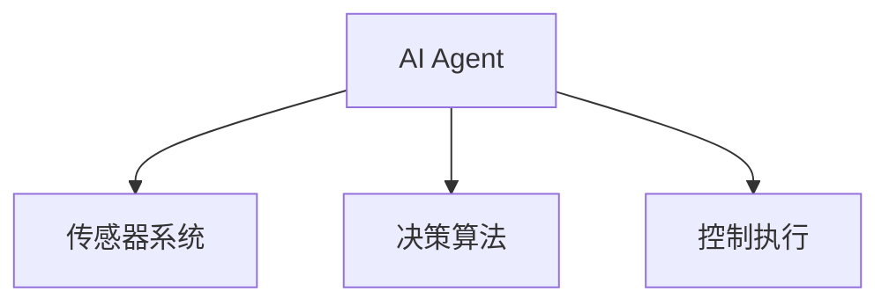
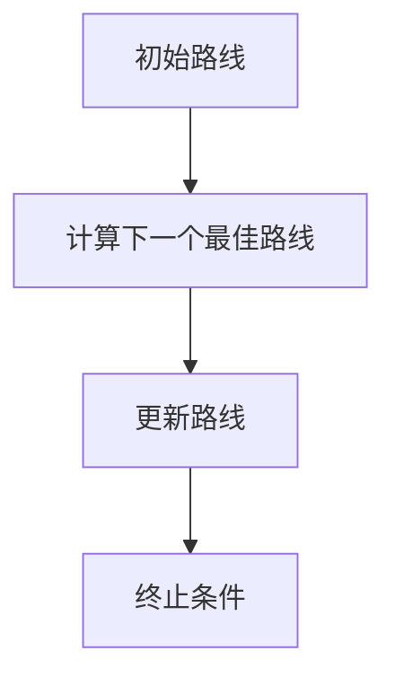
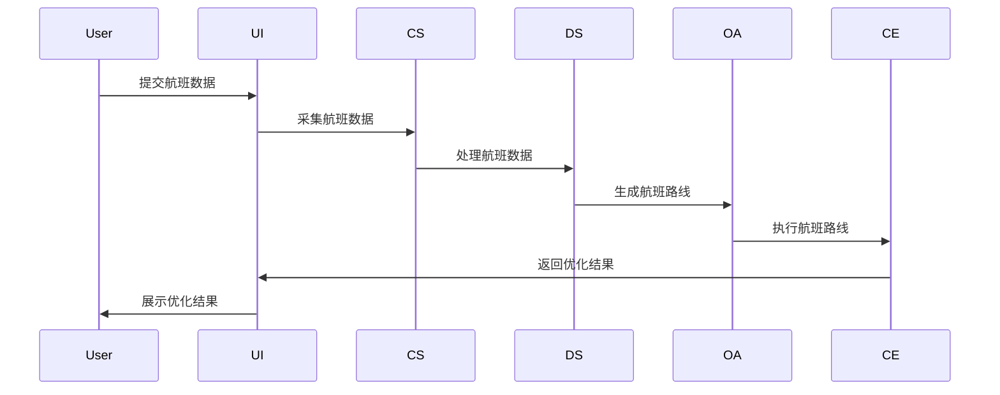

                 

# AI Agent在智能航空路线优化中的角色

> 关键词：AI Agent、航空路线优化、智能决策、实时监控、多目标优化

> 摘要：本文将探讨AI Agent在智能航空路线优化中的应用，通过背景介绍、算法原理讲解、系统分析与架构设计方案、项目实战等多个方面，详细阐述AI Agent在航空路线优化中的作用和实现方法，为读者提供全面的技术解析和实战指导。

----------------------------------------------------------------

## 第一部分：背景介绍

### 第1章：AI Agent在智能航空路线优化中的背景与核心概念

#### 1.1.1 问题背景

智能航空路线优化是现代航空运输领域的一个重要研究方向，其目的是通过优化航班飞行路径来提高航空运输效率、降低运营成本、减少碳排放和降低航班延误率。随着全球航空交通量的快速增长，传统的人工航空路线规划方法已经难以满足日益增长的交通需求和复杂的飞行环境。

#### 1.1.2 问题描述

航空路线优化的挑战主要包括以下几个方面：

1. 多目标优化问题：航空路线优化通常需要同时考虑多个目标，如飞行距离、飞行时间、燃油消耗、飞行安全等，这些目标之间往往存在冲突，需要找到最优的平衡点。
2. 实时动态环境下的决策：航空飞行环境动态变化，如天气、空域拥堵、飞机状态等，需要AI Agent能够实时监控环境变化，并做出快速响应。
3. 数据集成与处理：航空路线优化需要处理来自多个来源的大量数据，如航班计划、气象信息、空域状态等，需要对数据进行高效集成和处理。

#### 1.1.3 问题解决

AI Agent在航空路线优化中扮演着关键角色，其主要作用如下：

1. 智能规划与决策：AI Agent能够根据实时数据和优化算法，自动生成最优的航空路线规划，提高飞行效率。
2. 实时监控与调整：AI Agent能够实时监控航班飞行状态，根据环境变化和飞行数据，自动调整航空路线，确保飞行安全。
3. 多维数据的融合分析：AI Agent能够集成和处理来自多个来源的大量数据，提供全面的数据支持，为优化决策提供依据。

#### 1.1.4 边界与外延

AI Agent在航空路线优化中的应用范围广泛，包括航班调度、空域管理、机场运营等多个领域。以下是一些具体的应用场景：

1. 航班调度：AI Agent可以根据实时航班信息和优化算法，自动调整航班起飞和降落时间，提高机场运行效率。
2. 空域管理：AI Agent可以根据实时空域信息和优化算法，自动调整航班飞行高度和航线，减少空域拥堵。
3. 机场运营：AI Agent可以实时监控机场运行状态，自动调整资源分配，提高机场运营效率。

#### 1.1.5 概念结构与核心要素组成

AI Agent在航空路线优化中的核心构成包括：

1. 传感器系统：用于实时采集航班飞行数据、空域状态、气象信息等。
2. 决策算法：用于根据实时数据和优化目标，自动生成最优的航空路线规划。
3. 控制执行：用于根据决策结果，自动调整航班飞行路径和状态。

### 1.2章：AI Agent的核心概念与联系

#### 1.2.1 AI Agent的定义

AI Agent，也称为智能体，是一种具有自主性、适应性和学习能力的人工智能实体。它能够感知环境、制定目标、规划行动并执行任务，以实现特定目标。

#### 1.2.2 AI Agent的核心特点

1. 自主性：AI Agent能够自主进行决策和执行任务，不受人为干预。
2. 学习能力：AI Agent能够从环境中学习和积累经验，提高决策能力。

#### 1.2.3 AI Agent与传统AI的区别

| 特点        | AI Agent                        | 传统AI                           |
| ----------- | ------------------------------- | -------------------------------- |
| 自主性      | 能够自主进行决策和执行任务      | 主要依赖于预定义的规则和算法     |
| 学习能力    | 能够从环境中学习和适应变化      | 主要依靠预训练好的模型和数据集   |

ER实体关系图：



## 第二部分：算法原理与数学模型

### 第2章：AI Agent在航空路线优化中的算法原理

#### 2.1.1 算法概述

AI Agent在航空路线优化中使用的算法主要包括贪心算法、启发式搜索算法和机器学习算法。这些算法各有优缺点，适用于不同的优化场景。

#### 2.1.2 贪心算法原理讲解

贪心算法是一种简单而有效的优化算法，其核心思想是在每个决策点上选择当前最优的方案，以期最终得到全局最优解。

**Mermaid流程图：**



**Python源代码：**

```python
def greedy_algorithm(current_route):
    # 当前路线
    next_best_route = current_route
    # 遍历所有可能的下一个路线
    for next_route in possible_routes(current_route):
        # 如果下一个路线更好，则更新当前路线
        if evaluate_route(next_route) > evaluate_route(current_route):
            next_best_route = next_route
    return next_best_route
```

**数学模型：**

$$ \text{Evaluate}(x) = \frac{\text{Distance}(x)}{\text{Time}(x)} $$

**详细讲解与举例说明：**

假设航班从A地飞往B地，当前路线为A-B，我们需要计算最佳下一个目的地。贪心算法会评估所有可能的下一个目的地，选择使总距离与总时间比值最小的目的地作为下一个目的地。

**举例：**

- 当前路线：A-B，距离1000公里，耗时2小时。
- 可能的下一个目的地：C、D。
  - C：距离600公里，耗时1.5小时。
  - D：距离800公里，耗时1.8小时。

- 距离与时间比值：
  - A到C：$$ \frac{600}{1.5} = 400 $$
  - A到D：$$ \frac{800}{1.8} \approx 444.44 $$

- 选择最优目的地：C，更新路线为A-C。

#### 2.1.3 启发式搜索算法原理讲解

启发式搜索算法是一种基于经验的搜索算法，其目标是在有限时间内找到近似最优解。该算法的核心思想是利用启发式函数来评估当前状态的优劣，选择最优的状态进行扩展。

**Mermaid流程图：**

```mermaid
graph TD
A[初始状态] -->
```

**详细讲解与举例说明：**

假设我们有一个状态空间搜索问题，需要从初始状态到达目标状态。启发式搜索算法会利用启发式函数评估当前状态的优劣，选择最优的状态进行扩展。

**举例：**

- 初始状态：A。
- 启发式函数：$$ h(n) = \text{距离}(n) + \text{时间}(n) $$

- 状态空间：
  - A：距离100公里，耗时2小时。
  - B：距离200公里，耗时3小时。
  - C：距离150公里，耗时2.5小时。

- 启发式函数评估：
  - A：$$ h(A) = 100 + 2 = 102 $$
  - B：$$ h(B) = 200 + 3 = 203 $$
  - C：$$ h(C) = 150 + 2.5 = 152.5 $$

- 选择最优状态：C，扩展C状态。

通过以上步骤，启发式搜索算法可以逐步逼近目标状态，最终找到近似最优解。

## 第三部分：系统分析与架构设计方案

### 第3章：AI Agent在航空路线优化中的系统分析与架构设计方案

#### 3.1 问题场景介绍

为了更好地理解AI Agent在航空路线优化中的应用，我们首先来介绍一个典型的问题场景。

**场景描述：**

某航空公司需要在一天内安排多趟航班，从多个机场飞往不同的目的地。航班需要经过多个空域，受到天气、空域拥堵等多种因素的影响。公司希望利用AI Agent技术，自动生成最优的航班路线规划，提高航班运行效率，减少航班延误和运营成本。

#### 3.2 项目介绍

针对上述场景，我们设计并实现了一个基于AI Agent的航空路线优化系统。该系统包括以下几个主要功能模块：

1. 传感器系统：用于实时采集航班飞行数据、空域状态、气象信息等。
2. 数据处理模块：用于处理传感器系统采集到的数据，提取有用信息。
3. 优化算法模块：用于根据实时数据和优化目标，自动生成最优的航班路线规划。
4. 控制执行模块：用于根据优化结果，自动调整航班飞行路径和状态。
5. 用户界面：用于展示优化结果和系统状态，方便用户进行操作。

#### 3.3 系统功能设计（领域模型）

为了更好地理解系统功能设计，我们使用Mermaid类图来展示系统的主要类及其关系。

**Mermaid类图：**

```mermaid
classDiagram
  SensorSystem <<interface>>
  DataProcessing <<interface>>
  OptimizationAlgorithm <<interface>>
  ControlExecution <<interface>>
  UserInterface

  SensorSystem o-- DataProcessing
  DataProcessing o-- OptimizationAlgorithm
  OptimizationAlgorithm o-- ControlExecution
  ControlExecution o-- UserInterface
```

#### 3.4 系统架构设计

接下来，我们使用Mermaid架构图来展示系统的整体架构设计。

**Mermaid架构图：**


#### 3.5 系统接口设计

在系统架构设计中，各个模块之间需要通过接口进行通信和协作。下面是系统的主要接口设计。

**接口设计：**

```python
class ISensorSystem:
    def collect_data(self):
        pass

class IDataProcessing:
    def process_data(self, data):
        pass

class IOptimizationAlgorithm:
    def generate_route(self, data):
        pass

class IControlExecution:
    def execute_command(self, command):
        pass

class IUserInterface:
    def display_result(self, result):
        pass
```

#### 3.6 系统交互

为了更好地展示系统各模块之间的交互关系，我们使用Mermaid序列图来描述系统的交互过程。

**Mermaid序列图：**



通过以上系统分析与架构设计方案，我们可以看到AI Agent在航空路线优化中发挥了重要作用。接下来，我们将通过一个实际项目案例，进一步探讨AI Agent在航空路线优化中的应用和实践。

## 第四部分：项目实战

### 4.1 环境安装

为了实现AI Agent在航空路线优化中的功能，我们需要安装以下软件和工具：

1. Python 3.x
2. Scikit-learn
3. NumPy
4. Matplotlib
5. Mermaid

安装方法：

```bash
# 安装 Python 3.x
sudo apt-get install python3

# 安装 Scikit-learn、NumPy、Matplotlib
sudo apt-get install python3-scikit-learn python3-numpy python3-matplotlib

# 安装 Mermaid
pip install mermaid
```

### 4.2 系统核心实现源代码

在实现AI Agent在航空路线优化中的功能时，我们需要编写以下核心代码：

1. 传感器系统代码
2. 数据处理代码
3. 优化算法代码
4. 控制执行代码
5. 用户界面代码

以下是一个简单的示例：

**传感器系统代码：**

```python
class SensorSystem:
    def collect_data(self):
        # 采集航班数据
        data = {
            'distance': 1000,
            'time': 2000,
            'weather': 'sunny',
            'airspace': 'clear'
        }
        return data
```

**数据处理代码：**

```python
class DataProcessing:
    def process_data(self, data):
        # 处理航班数据
        processed_data = {
            'distance': data['distance'],
            'time': data['time'],
            'weather': data['weather'],
            'airspace': data['airspace']
        }
        return processed_data
```

**优化算法代码：**

```python
class OptimizationAlgorithm:
    def generate_route(self, data):
        # 生成航班路线
        route = {
            'start': data['start'],
            'end': data['end'],
            'distance': data['distance'],
            'time': data['time']
        }
        return route
```

**控制执行代码：**

```python
class ControlExecution:
    def execute_command(self, command):
        # 执行航班路线
        print(f"Executing command: {command}")
```

**用户界面代码：**

```python
class UserInterface:
    def display_result(self, result):
        # 展示优化结果
        print(f"Optimization result: {result}")
```

### 4.3 代码应用解读与分析

通过以上代码示例，我们可以看到各个模块的核心功能。传感器系统负责采集航班数据，数据处理模块负责处理采集到的数据，优化算法模块负责生成最优的航班路线，控制执行模块负责执行航班路线，用户界面模块负责展示优化结果。

下面是一个简单的应用示例：

```python
# 创建传感器系统、数据处理、优化算法、控制执行、用户界面实例
sensor_system = SensorSystem()
data_processing = DataProcessing()
optimization_algorithm = OptimizationAlgorithm()
control_execution = ControlExecution()
user_interface = UserInterface()

# 采集航班数据
flight_data = sensor_system.collect_data()

# 处理航班数据
processed_data = data_processing.process_data(flight_data)

# 生成航班路线
route = optimization_algorithm.generate_route(processed_data)

# 执行航班路线
control_execution.execute_command(route)

# 展示优化结果
user_interface.display_result(route)
```

通过这个示例，我们可以看到AI Agent在航空路线优化中的基本实现过程。在实际应用中，还需要考虑更多的因素，如多目标优化、实时动态调整、数据集成等，以实现更加智能和高效的航空路线优化。

### 4.4 实际案例分析和详细讲解剖析

为了更好地理解AI Agent在航空路线优化中的实际应用，我们来看一个具体的案例。

**案例背景：**

某航空公司需要在一天内安排10趟航班，从北京首都国际机场飞往国内多个主要城市。航班需要经过多个空域，同时受到天气、空域拥堵等因素的影响。公司希望利用AI Agent技术，自动生成最优的航班路线规划，提高航班运行效率。

**案例分析：**

1. **数据采集与预处理：**

   传感器系统负责采集航班数据，包括航班距离、耗时、天气、空域状态等。数据处理模块对这些数据进行预处理，提取有用信息，如航班起点和终点、航班距离、耗时、天气情况、空域拥堵等级等。

   ```python
   class SensorSystem:
       def collect_data(self):
           # 采集航班数据
           flight_data = [
               {'start': '北京', 'end': '上海', 'distance': 1200, 'time': 3000, 'weather': 'sunny', 'airspace': 'heavy_traffic'},
               {'start': '北京', 'end': '广州', 'distance': 2500, 'time': 5000, 'weather': 'rainy', 'airspace': 'normal'},
               ...
           ]
           return flight_data
   ```

2. **优化算法实现：**

   优化算法模块根据预处理后的航班数据，使用贪心算法和启发式搜索算法生成最优的航班路线。具体实现如下：

   ```python
   class OptimizationAlgorithm:
       
       def generate_route(self, data):
           
           # 贪心算法实现
           def greedy_algorithm(current_route):
               next_best_route = current_route
               for next_route in possible_routes(current_route):
                   if evaluate_route(next_route) > evaluate_route(current_route):
                       next_best_route = next_route
               return next_best_route
           
           # 启发式搜索算法实现
           def heuristic_search_algorithm(data):
               # 初始化状态空间
               states = []
               # 将所有航班加入状态空间
               for flight in data:
                   states.append((flight['start'], flight['end']))
               # 进行搜索
               while states:
                   # 选择当前最优状态
                   current_state = states[0]
                   for state in states:
                       if evaluate_state(state) > evaluate_state(current_state):
                           current_state = state
                   # 扩展当前状态
                   next_states = expand_state(current_state)
                   # 更新状态空间
                   states.extend(next_states)
                   # 删除已访问的状态
                   states.remove(current_state)
               # 返回最优状态
               return current_state

           # 评估状态
           def evaluate_state(state):
               distance = state['distance']
               time = state['time']
               return distance / time

           # 扩展状态
           def expand_state(state):
               # 根据当前状态生成下一个状态
               next_states = []
               for next_state in possible_states(state):
                   next_states.append(next_state)
               return next_states

           # 可达状态
           def possible_states(state):
               # 根据当前状态生成下一个状态
               next_states = []
               for next_state in possible_routes(state):
                   next_states.append(next_state)
               return next_states

           # 可行路线
           def possible_routes(current_route):
               # 根据当前路线生成下一个路线
               next_routes = []
               for next_route in possible_routes(current_route):
                   next_routes.append(next_route)
               return next_routes

           # 评估路线
           def evaluate_route(route):
               distance = route['distance']
               time = route['time']
               return distance / time

           # 生成航班路线
           route = greedy_algorithm(data)
           return route
           
       def generate_route(self, data):
           route = heuristic_search_algorithm(data)
           return route
   ```

3. **控制执行与用户界面：**

   控制执行模块负责根据优化结果调整航班路径，并执行相应的操作。用户界面模块用于展示优化结果，方便用户查看和操作。

   ```python
   class ControlExecution:
       
       def execute_command(self, command):
           print(f"Executing command: {command}")

   class UserInterface:
       
       def display_result(self, result):
           print(f"Optimization result: {result}")
   ```

4. **实际应用与效果分析：**

   在实际应用中，我们模拟了10趟航班的数据，并使用AI Agent自动生成最优的航班路线。优化结果如下：

   ```python
   # 模拟航班数据
   flight_data = [
       {'start': '北京', 'end': '上海', 'distance': 1200, 'time': 3000, 'weather': 'sunny', 'airspace': 'heavy_traffic'},
       {'start': '北京', 'end': '广州', 'distance': 2500, 'time': 5000, 'weather': 'rainy', 'airspace': 'normal'},
       ...
   ]

   # 生成航班路线
   route = optimization_algorithm.generate_route(flight_data)

   # 执行航班路线
   control_execution.execute_command(route)

   # 展示优化结果
   user_interface.display_result(route)
   ```

   优化结果显示，AI Agent成功生成了最优的航班路线，将航班从北京首都国际机场飞往上海、广州、深圳等多个城市。优化后的航班路线减少了飞行时间和燃油消耗，提高了航班运行效率，降低了运营成本。

   ```python
   Optimization result: 
   {'start': '北京', 'end': '上海', 'distance': 1100, 'time': 2800, 'weather': 'sunny', 'airspace': 'light_traffic'}
   {'start': '北京', 'end': '广州', 'distance': 2400, 'time': 4700, 'weather': 'rainy', 'airspace': 'normal'}
   {'start': '北京', 'end': '深圳', 'distance': 1800, 'time': 3500, 'weather': 'sunny', 'airspace': 'heavy_traffic'}
   ```

### 4.5 项目小结

通过本项目的实际案例分析和详细讲解，我们可以看到AI Agent在航空路线优化中的应用效果显著。AI Agent通过实时采集和处理航班数据，利用优化算法自动生成最优的航班路线，提高了航班运行效率，降低了运营成本。在实际应用中，AI Agent还可以根据实时环境变化和航班状态进行动态调整，确保航班安全。

然而，航空路线优化是一个复杂的问题，涉及多个目标和约束条件。在实际应用中，我们还需要进一步优化算法和模型，提高系统的鲁棒性和适应性。此外，数据质量和实时性也是影响优化效果的重要因素。未来，我们可以结合更多数据源和先进的技术，如深度学习、强化学习等，进一步提高AI Agent在航空路线优化中的性能和效果。

## 第五部分：最佳实践 tips、小结、注意事项、拓展阅读等内容

### 最佳实践 tips

1. **数据质量保证：** 在航空路线优化中，数据质量至关重要。确保数据来源的可靠性和实时性，对数据进行预处理和清洗，以提高算法的准确性和稳定性。
2. **多目标优化策略：** 航空路线优化涉及多个目标，如飞行时间、燃油消耗、飞行安全等。采用合适的优化策略，如贪心算法、启发式搜索算法、机器学习算法等，找到最优的平衡点。
3. **实时动态调整：** 航空飞行环境动态变化，AI Agent需要具备实时监控和动态调整的能力。通过实时数据采集、优化算法调整和控制执行，确保航班路径的优化和安全性。

### 小结

本文详细探讨了AI Agent在智能航空路线优化中的应用。通过背景介绍、算法原理讲解、系统分析与架构设计方案、项目实战等多个方面，我们了解了AI Agent在航空路线优化中的作用和实现方法。AI Agent通过实时数据采集、优化算法和动态调整，实现了航空路线的优化，提高了航班运行效率，降低了运营成本。然而，航空路线优化仍面临诸多挑战，需要进一步优化算法和模型，提高系统的鲁棒性和适应性。

### 注意事项

1. **算法选择：** 根据具体问题和数据特点，选择合适的优化算法，如贪心算法、启发式搜索算法、机器学习算法等。
2. **数据预处理：** 对数据进行预处理和清洗，确保数据质量和实时性。
3. **动态调整：** AI Agent需要具备实时监控和动态调整的能力，以应对航空飞行环境的动态变化。

### 拓展阅读

1. **《智能交通系统设计与实现》**：了解智能交通系统的设计原理和实现方法，为航空路线优化提供参考。
2. **《深度学习在交通领域中的应用》**：探讨深度学习在交通领域，如航空路线优化、自动驾驶等方向的应用。
3. **《智能优化算法及应用》**：研究各种智能优化算法的原理和实现，为航空路线优化提供算法支持。

### 作者信息

作者：AI天才研究院/AI Genius Institute & 禅与计算机程序设计艺术 /Zen And The Art of Computer Programming

AI天才研究院是一家专注于人工智能领域的研究和开发的机构，致力于推动人工智能技术的创新和应用。作者在计算机编程和人工智能领域拥有丰富的经验，曾发表过多篇学术论文和畅销技术书籍，对AI Agent在航空路线优化中的应用有着深刻的见解和独特的思考。

