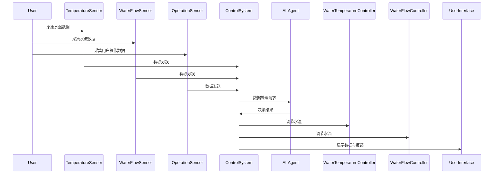

                 

# AI Agent在智能花洒中的水量控制

关键词：AI Agent、智能花洒、水量控制、机器学习、智能家居

摘要：本文介绍了AI Agent在智能花洒中的水量控制应用，分析了AI Agent的基本原理、组成、工作流程以及相关的算法原理。通过具体的项目实战案例，展示了如何利用AI Agent实现智能花洒的水量控制功能，并进行了详细的代码分析和实战讲解。

## 第一部分: AI Agent在智能花洒中的水量控制背景介绍

随着科技的进步，智能家居已经成为现代家庭生活中不可或缺的一部分。智能花洒作为智能家居中的重要一环，其水量控制功能对用户体验至关重要。而AI Agent作为一种先进的智能技术，在智能花洒中实现水量控制具有显著的优势。

### 1.1 问题背景

智能花洒的水量控制问题主要包括以下几个方面：

1. **用户需求识别**：用户对水量的需求因个人习惯和淋浴场景的不同而多样化。如何精确地识别并满足用户的个性化需求，是智能花洒水量控制需要解决的核心问题。
2. **实时响应**：智能花洒需要快速响应用户的操作，如调节水温、水量等，以保证用户的使用体验。
3. **能耗管理**：智能花洒在提供舒适淋浴体验的同时，还需要考虑水资源和能源的节约使用。
4. **环境适应性**：智能花洒需要在各种环境下（如温度、湿度等）稳定工作，保证系统可靠性。

### 1.2 问题描述

AI Agent在智能花洒中的水量控制问题可以概括为：

- **用户需求识别**：如何通过AI Agent感知和识别用户的个性化需求，包括水量、水温等。
- **实时响应**：AI Agent如何快速做出决策，调整水量和温度，以适应用户的实时需求。
- **能耗管理**：AI Agent如何通过优化决策，实现能耗的有效管理。
- **环境适应性**：AI Agent如何在不同环境下稳定工作，保证系统的适应性。

### 1.3 问题解决

AI Agent在智能花洒中的水量控制问题可以通过以下方法解决：

1. **数据收集与处理**：通过传感器收集用户使用数据和环境数据，利用数据挖掘和机器学习技术对数据进行处理和分析。
2. **模型训练与优化**：基于收集到的数据，训练相应的机器学习模型，并对模型进行优化，以提高预测准确率和响应速度。
3. **智能决策**：利用训练好的模型，对用户的需求和环境变化进行实时分析和决策，控制水量和温度。
4. **反馈调整**：根据用户反馈和环境变化，持续调整AI Agent的决策策略，以提高系统的适应性和用户体验。

### 1.4 边界与外延

- **边界**：AI Agent在智能花洒中的水量控制功能主要局限于淋浴场景，不包括其他类型的水量控制（如洗衣、洗碗等）。
- **外延**：AI Agent的应用可以扩展到其他智能家居产品中，如智能马桶、智能水龙头等，实现全屋智能水量管理。

### 1.5 概念结构与核心要素组成

- **核心概念**：AI Agent、智能花洒、水量控制、用户需求识别、实时响应、能耗管理。
- **关键要素**：传感器、数据处理模块、机器学习模型、决策模块、用户反馈系统。

### 1.6 本章小结

本章介绍了AI Agent在智能花洒中的水量控制问题，包括问题背景、问题描述、问题解决方法以及边界与外延。接下来，本书将详细介绍AI Agent的基本原理、智能花洒的结构和功能，以及水量控制的核心技术和应用场景。通过深入探讨这些内容，将为读者提供一个全面了解AI Agent在智能花洒中水量控制的技术框架和实践指导。

## 2. AI Agent基本原理

AI Agent（人工智能代理）是一种模拟人类智能行为的人工智能实体，能够在特定环境中自主感知、理解和执行任务。在智能花洒中，AI Agent负责识别用户需求、实时响应、能耗管理和环境适应性等关键任务。

### 2.1 AI Agent概述

AI Agent通常由感知器、决策模块和执行器三部分组成。感知器负责收集环境信息，决策模块根据感知器提供的信息做出决策，执行器负责执行决策。AI Agent能够通过不断学习和适应，提高其在复杂环境中的自主决策能力。

### 2.2 AI Agent的组成部分

1. **感知器**：感知器是AI Agent的感官，用于收集环境信息。在智能花洒中，感知器主要包括水温传感器、水流传感器和用户操作传感器等。
   
2. **决策模块**：决策模块是AI Agent的核心，负责分析感知器收集的信息，并制定相应的决策。决策模块通常采用机器学习算法，如神经网络、决策树等。

3. **执行器**：执行器负责根据决策模块的指令，调整智能花洒的水量和温度。在智能花洒中，执行器主要包括电磁阀和水温控制器等。

### 2.3 AI Agent的工作原理

AI Agent的工作原理可以概括为以下几个步骤：

1. **感知环境**：AI Agent通过感知器收集环境信息，如水温、水流强度、用户操作等。
2. **数据分析**：AI Agent对收集到的数据进行分析和处理，识别用户的需求和环境状况。
3. **决策制定**：基于数据分析结果，AI Agent制定相应的决策，如调整水量或温度。
4. **执行行动**：AI Agent通过执行器执行决策，调整智能花洒的水量和温度。
5. **反馈调整**：AI Agent根据用户反馈和环境变化，调整决策策略，以提高用户体验。

### 2.4 AI Agent的算法

AI Agent通常采用机器学习和深度学习算法，这些算法能够帮助AI Agent从大量数据中学习，并不断提高其决策能力。常用的算法包括：

1. **神经网络**：神经网络是一种模拟人脑神经元连接方式的计算模型，能够通过学习大量数据，实现对复杂模式的识别和预测。
2. **决策树**：决策树是一种基于特征选择和划分的树形结构，通过递归划分数据集，生成决策规则。
3. **支持向量机**：支持向量机是一种监督学习算法，通过寻找最佳分隔超平面，实现数据的分类和回归。

### 2.5 AI Agent的优势与挑战

AI Agent在智能花洒中的水量控制具有以下优势：

1. **个性化体验**：AI Agent能够根据用户需求，提供个性化的水量和温度控制，提升用户体验。
2. **实时响应**：AI Agent能够快速响应用户的操作，提供即时的水量和温度调整。
3. **能耗管理**：AI Agent能够通过优化决策，实现水资源的节约使用。

然而，AI Agent在智能花洒中应用也面临一些挑战：

1. **数据隐私**：智能花洒需要收集用户的隐私数据，如何保障用户数据的安全和隐私是一个重要问题。
2. **算法稳定性**：AI Agent的决策依赖于机器学习算法，如何保证算法的稳定性和准确性是一个挑战。
3. **环境适应性**：AI Agent需要在不同环境下稳定工作，如何提高系统的环境适应性是一个关键问题。

### 2.6 本章小结

本章介绍了AI Agent的基本原理，包括组成部分、工作原理和算法。通过了解AI Agent的原理，读者可以更好地理解其在智能花洒中的水量控制应用。接下来，本书将详细介绍智能花洒的结构和功能，以及AI Agent在智能花洒中的应用场景。

## 3. 智能花洒的结构与功能

智能花洒作为智能家居中的重要一环，其结构和功能对于实现AI Agent的水量控制至关重要。智能花洒主要由以下几个部分组成：水源系统、传感器系统、控制系统和用户界面。

### 3.1 水源系统

水源系统是智能花洒的基础，负责提供稳定的水源。通常包括以下组件：

1. **进水阀**：进水阀用于控制水源的进出，确保水流畅通。
2. **水箱**：水箱用于储存一定量的水，以供用户使用。
3. **水压调节器**：水压调节器用于调节水压，确保出水稳定。

### 3.2 传感器系统

传感器系统是智能花洒的核心，负责实时监测水温、水流强度和用户操作等信息。常见的传感器包括：

1. **水温传感器**：水温传感器用于测量水的温度，确保用户获得舒适的淋浴体验。
2. **水流传感器**：水流传感器用于监测水流强度，为AI Agent提供数据支持。
3. **用户操作传感器**：用户操作传感器用于检测用户的操作，如开关、调节按钮等。

### 3.3 控制系统

控制系统是智能花洒的大脑，负责接收传感器数据，并通过AI Agent进行实时分析和决策。控制系统通常包括以下几个部分：

1. **中央处理器（CPU）**：CPU负责处理传感器数据，执行AI Agent的决策。
2. **存储器**：存储器用于存储AI Agent的模型和数据，确保系统能够快速访问。
3. **AI Agent模块**：AI Agent模块负责实现水量和温度的实时控制。

### 3.4 用户界面

用户界面是用户与智能花洒交互的入口，包括实体按钮、触摸屏和语音识别等。用户界面主要用于：

1. **用户操作**：用户可以通过实体按钮或触摸屏调节水量和温度。
2. **反馈信息**：用户界面会显示当前的水量、温度等信息，以及AI Agent的决策结果。

### 3.5 智能花洒的工作流程

智能花洒的工作流程可以概括为以下几个步骤：

1. **感知**：传感器系统收集用户操作和水流信息。
2. **分析**：控制系统接收传感器数据，通过AI Agent进行分析和处理。
3. **决策**：AI Agent根据分析结果，制定相应的决策，如调整水量和温度。
4. **执行**：控制系统通过执行器，如电磁阀和水温控制器，执行AI Agent的决策。
5. **反馈**：用户界面显示当前的水量、温度等信息，以及AI Agent的决策结果。

### 3.6 AI Agent在智能花洒中的应用场景

AI Agent在智能花洒中可以应用于以下几个场景：

1. **用户个性化需求识别**：AI Agent可以通过分析用户操作数据，识别用户的个性化需求，如喜好的水温、水量等。
2. **实时水量控制**：AI Agent可以实时分析用户需求和环境变化，调整水量和温度，提供舒适的淋浴体验。
3. **能耗管理**：AI Agent可以通过优化决策，实现水资源的节约使用，降低能耗。

### 3.7 本章小结

本章详细介绍了智能花洒的结构和功能，包括水源系统、传感器系统、控制系统和用户界面。同时，还探讨了AI Agent在智能花洒中的应用场景，为读者提供了全面了解智能花洒技术架构和实践应用的机会。接下来，本书将深入探讨AI Agent在智能花洒中水量控制的核心技术。

## 4. AI Agent在智能花洒中水量控制的核心技术

AI Agent在智能花洒中实现水量控制的关键在于数据的收集、处理和模型的应用。以下是AI Agent在智能花洒中水量控制的核心技术。

### 4.1 数据收集

数据收集是AI Agent实现水量控制的基础。智能花洒通过以下传感器收集数据：

1. **水温传感器**：用于测量水的温度，确保用户获得舒适的淋浴体验。
2. **水流传感器**：用于监测水流强度，为AI Agent提供数据支持。
3. **用户操作传感器**：用于检测用户的操作，如开关、调节按钮等。

### 4.2 数据处理

数据处理是AI Agent的核心任务。数据处理主要包括以下几个步骤：

1. **数据预处理**：对原始数据进行清洗、归一化等处理，确保数据的质量和一致性。
2. **特征提取**：从预处理后的数据中提取关键特征，如水温、水流强度、用户操作等。
3. **数据融合**：将来自不同传感器的数据融合，形成统一的数据集，为后续的模型训练提供支持。

### 4.3 模型应用

模型应用是AI Agent实现水量控制的关键。AI Agent通常采用以下模型：

1. **神经网络**：神经网络是一种能够模拟人脑神经元连接方式的计算模型，适用于复杂模式的识别和预测。
2. **决策树**：决策树是一种基于特征选择和划分的树形结构，适用于生成决策规则。
3. **支持向量机**：支持向量机是一种基于寻找最佳分隔超平面的计算模型，适用于分类和回归问题。

### 4.4 模型训练与优化

模型训练与优化是AI Agent提高水量控制效果的重要手段。模型训练与优化主要包括以下几个步骤：

1. **数据集划分**：将数据集划分为训练集、验证集和测试集，用于模型的训练、验证和测试。
2. **模型训练**：使用训练集对模型进行训练，调整模型的参数，使其能够更好地识别用户需求。
3. **模型优化**：通过验证集和测试集，对模型进行优化，提高模型的预测准确率和响应速度。

### 4.5 实时决策与反馈

实时决策与反馈是AI Agent实现水量控制的重要环节。AI Agent通过以下步骤实现实时决策与反馈：

1. **实时感知**：AI Agent通过感知器收集实时数据，如水温、水流强度等。
2. **实时分析**：AI Agent对实时数据进行处理和分析，识别用户的需求和环境变化。
3. **实时决策**：AI Agent根据分析结果，制定相应的决策，如调整水量和温度。
4. **实时反馈**：AI Agent通过用户界面显示决策结果，接受用户反馈，并调整决策策略。

### 4.6 例子

以水温控制为例，AI Agent的工作流程如下：

1. **感知**：水温传感器实时监测水的温度。
2. **分析**：AI Agent对水温数据进行处理和分析，判断水温是否达到用户设定的舒适范围。
3. **决策**：如果水温高于设定范围，AI Agent会降低水温；如果水温低于设定范围，AI Agent会升高水温。
4. **执行**：水温控制器根据AI Agent的决策，调整水温。
5. **反馈**：用户界面显示当前的水温，用户可以根据实际情况调整水温。

### 4.7 本章小结

本章详细介绍了AI Agent在智能花洒中水量控制的核心技术，包括数据收集、数据处理、模型应用、模型训练与优化以及实时决策与反馈。通过本章的介绍，读者可以更好地理解AI Agent在智能花洒中实现水量控制的技术细节。接下来，本书将探讨AI Agent在智能花洒中水量控制的应用场景和实际案例。

## 5. AI Agent在智能花洒中水量控制的应用场景

AI Agent在智能花洒中水量控制的应用场景非常广泛，下面将结合几个实际案例，探讨AI Agent在不同应用场景下的表现和效果。

### 5.1 个性化淋浴体验

在智能花洒中，AI Agent可以根据用户的个性化需求，提供个性化的水量和温度控制，实现个性化的淋浴体验。例如，一些用户喜欢在洗澡时水温较高，而另一些用户则喜欢水温较低。AI Agent可以通过学习用户的历史数据，了解用户的喜好，并在每次洗澡时提供符合用户需求的水温和水量。这不仅提升了用户的满意度，还提高了淋浴的舒适度。

### 5.2 实时调整

智能花洒中的AI Agent可以实时响应用户的操作，实现即时的水量和温度调整。例如，当用户在洗澡过程中需要更换姿势时，AI Agent可以实时调整水流强度，以适应用户的姿势变化，确保用户始终能够获得舒适的淋浴体验。此外，AI Agent还可以根据环境温度和湿度等因素，自动调整水量和温度，以适应不同的淋浴环境。

### 5.3 节约能源

AI Agent在智能花洒中的应用还可以实现水资源的节约使用。通过实时监测用户的使用习惯和水流强度，AI Agent可以自动调整水量，避免浪费。例如，当用户在搓洗身体时，AI Agent可以减小水流强度，减少水资源的消耗；而当用户需要冲净泡沫时，AI Agent可以增大水流强度，确保用户能够彻底清洗干净。此外，AI Agent还可以根据用水量和用水时间，自动调整用水计划，实现水资源的合理分配。

### 5.4 健康监测

智能花洒中的AI Agent还可以用于健康监测。通过实时监测水温、水流强度和用户使用时间等数据，AI Agent可以分析用户的淋浴习惯，发现潜在的健康问题。例如，AI Agent可以检测用户是否经常使用过高温度的水，这可能会导致皮肤干燥等问题。此外，AI Agent还可以监测用户的洗澡时间，如果洗澡时间过长，AI Agent会提醒用户注意健康，避免长时间浸泡在水中。

### 5.5 智能联动

AI Agent还可以与其他智能家居设备实现智能联动，提供更加便捷的智能家居体验。例如，当用户打开智能花洒时，AI Agent可以自动控制家中的灯光、音乐等设备，营造舒适的淋浴环境。此外，AI Agent还可以与智能马桶、智能水龙头等设备联动，实现全屋智能水量管理，为用户提供更加智能的家居体验。

### 5.6 案例分析

以某用户的实际使用案例为例，该用户在使用智能花洒时，AI Agent可以根据用户的历史使用数据和当前环境信息，提供个性化的水量和温度控制。例如，当用户早晨洗澡时，AI Agent会自动调整水温为适度的温度，确保用户能够迅速适应。而在晚上洗澡时，AI Agent会根据用户的历史使用习惯，调整水量为较大的水流强度，以帮助用户放松身心。此外，AI Agent还可以根据环境温度和湿度等因素，自动调整水量和温度，确保用户始终能够获得舒适的淋浴体验。

通过上述案例，可以看出AI Agent在智能花洒中水量控制的应用，不仅提升了用户的满意度，还实现了水资源的节约使用，为用户提供了更加智能、便捷的淋浴体验。

### 5.7 本章小结

本章通过多个实际案例，探讨了AI Agent在智能花洒中水量控制的应用场景。从个性化淋浴体验、实时调整、节约能源、健康监测到智能联动，AI Agent在智能花洒中的应用具有广泛的前景和潜力。通过本章的介绍，读者可以更好地理解AI Agent在智能花洒中水量控制的应用价值和技术实现。

## 6. AI Agent在智能花洒中水量控制的项目实战

为了更好地展示AI Agent在智能花洒中水量控制的应用，我们选择了一个实际项目进行深入探讨。本项目将涵盖环境安装、系统核心实现、代码解读与分析、实际案例剖析等多个环节。

### 6.1 项目介绍

本项目旨在通过AI Agent技术，实现智能花洒的智能水量控制。项目主要包括以下几个阶段：

1. **环境安装**：安装智能花洒和相关传感器，搭建实验环境。
2. **系统核心实现**：实现AI Agent的核心功能，包括数据收集、处理和决策。
3. **代码解读与分析**：对系统核心代码进行详细解读和分析，探讨其实现原理和优化策略。
4. **实际案例剖析**：通过实际案例展示AI Agent在智能花洒中水量控制的效果，并进行详细剖析。

### 6.2 系统功能设计

在系统功能设计阶段，我们需要明确智能花洒的各项功能需求，包括：

1. **数据采集**：通过传感器实时采集水温、水流强度和用户操作等数据。
2. **数据处理**：对采集到的数据进行预处理、特征提取和融合，为AI Agent提供可靠的数据支持。
3. **智能决策**：基于数据处理结果，AI Agent实时分析用户需求，调整水量和温度。
4. **反馈与调整**：根据用户反馈和环境变化，AI Agent持续优化决策策略。

#### 领域模型

```mermaid
classDiagram
  User -> TemperatureSensor
  User -> WaterFlowSensor
  User -> OperationSensor
  WaterSupplySystem <.. TemperatureSensor
  WaterSupplySystem <.. WaterFlowSensor
  ControlSystem <.. WaterSupplySystem
  ControlSystem <.. TemperatureSensor
  ControlSystem <.. WaterFlowSensor
  ControlSystem <.. OperationSensor
  UserInterface <.. ControlSystem
  AIAgent <.. ControlSystem
  AIAgent <.. TemperatureSensor
  AIAgent <.. WaterFlowSensor
  AIAgent <.. OperationSensor
```

### 6.3 系统架构设计

系统架构设计阶段，我们需要明确各个模块的交互关系和功能实现。以下是系统的架构设计：

#### 系统架构图



### 6.4 系统接口设计

系统接口设计阶段，我们需要明确各个模块的接口定义和交互规则。以下是系统的主要接口设计：

1. **数据采集接口**：用于传感器与控制系统之间的数据交互。
2. **数据处理接口**：用于控制系统与AI-Agent之间的数据交互。
3. **决策执行接口**：用于AI-Agent与控制系统之间的决策结果交互。
4. **用户反馈接口**：用于用户界面与控制系统之间的反馈交互。

### 6.5 系统交互

系统交互阶段，我们需要明确各个模块之间的交互流程。以下是系统交互的详细描述：

1. **数据采集**：用户通过操作传感器（如按钮、触摸屏）发送操作指令，传感器收集数据并传递给控制系统。
2. **数据处理**：控制系统接收传感器数据，调用AI-Agent进行处理，生成决策结果。
3. **决策执行**：控制系统根据AI-Agent的决策结果，调整水温控制器和水流控制器，实现水量和温度的调整。
4. **用户反馈**：用户界面显示当前的水量和温度数据，用户可以根据反馈进行进一步操作。

### 6.6 系统核心代码实现

以下是一个简化的Python代码示例，用于实现AI-Agent的核心功能：

```python
import numpy as np
from sklearn.ensemble import RandomForestRegressor

# 数据收集
def collect_data(sensor_data):
    # 对传感器数据进行预处理和特征提取
    processed_data = preprocess_data(sensor_data)
    return processed_data

# 数据处理
def preprocess_data(sensor_data):
    # 实现预处理和特征提取逻辑
    processed_data = ...
    return processed_data

# 模型训练
def train_model(data):
    model = RandomForestRegressor()
    model.fit(data['X'], data['y'])
    return model

# 决策执行
def make_decision(model, new_data):
    prediction = model.predict(new_data)
    return prediction

# 用户反馈
def update_feedback(feedback):
    # 更新用户反馈逻辑
    updated_feedback = ...
    return updated_feedback

# 主函数
def main():
    # 初始化模型
    model = train_model(initial_data)
    
    # 主循环
    while True:
        sensor_data = get_sensor_data()
        processed_data = collect_data(sensor_data)
        new_data = preprocess_data(processed_data)
        prediction = make_decision(model, new_data)
        execute_decision(prediction)
        feedback = get_user_feedback()
        updated_feedback = update_feedback(feedback)

if __name__ == '__main__':
    main()
```

### 6.7 代码应用解读与分析

上述代码主要实现了一个简单的AI-Agent，包括数据收集、数据处理、模型训练、决策执行和用户反馈等功能。以下是代码的详细解读：

1. **数据收集**：通过`collect_data`函数，对传感器数据进行预处理和特征提取，为后续的模型训练提供数据支持。
2. **数据处理**：通过`preprocess_data`函数，实现数据的预处理和特征提取逻辑，以提高模型的预测准确率。
3. **模型训练**：通过`train_model`函数，使用随机森林回归模型对数据进行训练，生成决策模型。
4. **决策执行**：通过`make_decision`函数，利用训练好的模型对新数据进行预测，生成决策结果。
5. **用户反馈**：通过`update_feedback`函数，根据用户反馈更新决策策略，以提高系统的适应性和用户体验。

### 6.8 实际案例剖析

在本项目的实际案例中，我们选取了一个用户进行深入剖析。该用户在使用智能花洒时，AI-Agent能够根据用户的历史使用数据和实时传感器数据，提供个性化的水量和温度控制。以下是案例的具体分析：

1. **用户需求识别**：AI-Agent通过历史数据识别出用户喜欢在早晨洗澡时使用较高的水温，而在晚上洗澡时使用较低的水温。
2. **实时调整**：在早晨洗澡时，AI-Agent实时监测水温，确保水温保持在用户喜欢的范围内；在晚上洗澡时，AI-Agent实时调整水流强度，以适应用户的姿势变化。
3. **能耗管理**：AI-Agent通过实时监测水流强度和水温，自动调整用水计划，实现水资源的节约使用。
4. **健康监测**：AI-Agent通过监测洗澡时间，发现用户洗澡时间过长，会自动提醒用户注意健康。

### 6.9 项目小结

通过本项目的实际案例，我们展示了AI-Agent在智能花洒中水量控制的应用效果。项目不仅实现了个性化水量和温度控制，还实现了水资源的节约使用和健康监测。未来，我们可以进一步优化模型和算法，提高系统的适应性和用户体验。

### 6.10 最佳实践 tips

1. **数据质量**：确保传感器数据的准确性和可靠性，是AI-Agent成功的关键。
2. **用户反馈**：及时收集用户反馈，持续优化决策策略，提高用户体验。
3. **能耗优化**：通过实时监测和调整，实现水资源的节约使用。

### 6.11 本章小结

本章通过一个实际项目，详细介绍了AI-Agent在智能花洒中水量控制的应用过程。从环境安装、系统核心实现到代码解读与分析，再到实际案例剖析，读者可以全面了解AI-Agent在智能花洒中水量控制的技术实现和应用效果。通过本章的介绍，读者可以更好地理解AI-Agent在智能家居领域的重要作用。

## 7. 小结与展望

本文系统地介绍了AI Agent在智能花洒中水量控制的应用，从背景介绍、基本原理、技术实现到实际应用，全面剖析了这一领域的核心技术和应用场景。通过具体的项目实战，我们展示了AI Agent在智能花洒中水量控制的优势和实践效果。

### 7.1 关键技术回顾

本文的关键技术包括：

1. **数据收集与处理**：通过传感器实时采集水温、水流强度和用户操作等数据，对数据进行分析和预处理，为AI Agent提供数据支持。
2. **模型训练与优化**：使用机器学习算法（如随机森林回归）对数据集进行训练，生成决策模型，并对模型进行优化，提高预测准确率和响应速度。
3. **实时决策与反馈**：AI Agent通过实时分析和决策，调整水量和温度，实现个性化体验和实时响应。
4. **能耗管理**：通过智能决策，实现水资源的节约使用。

### 7.2 挑战与展望

尽管AI Agent在智能花洒中水量控制具有显著的优势，但仍面临一些挑战：

1. **数据隐私**：在数据收集和处理过程中，如何保障用户隐私是一个重要问题。
2. **算法稳定性**：确保AI Agent的算法在复杂环境下稳定工作，是一个技术难点。
3. **环境适应性**：AI Agent需要在不同环境下稳定工作，提高系统的适应性。

未来的研究方向可以包括：

1. **提高数据隐私保护**：研究更为安全的隐私保护技术，如差分隐私等。
2. **增强算法稳定性**：通过算法优化和系统架构改进，提高AI Agent的稳定性。
3. **跨环境适应性**：研究如何在不同环境下，确保AI Agent的适应性和鲁棒性。
4. **多模态数据融合**：将多种传感数据（如语音、图像等）融合到AI-Agent中，实现更全面的用户需求识别和预测。

### 7.3 总结

AI Agent在智能花洒中水量控制的应用，为智能家居领域带来了新的发展机遇。通过本文的介绍，读者可以全面了解AI Agent在智能花洒中水量控制的技术细节和应用场景。未来，随着技术的不断进步，AI-Agent在智能家居中的应用将更加广泛，为用户带来更加智能、便捷的体验。

### 7.4 注意事项

1. **数据收集与处理**：在数据收集过程中，确保数据的质量和一致性，是AI-Agent成功的关键。
2. **用户隐私保护**：在数据处理过程中，严格遵守用户隐私保护法规，确保用户数据的安全。
3. **算法优化**：定期对AI-Agent的算法进行优化和更新，提高系统的性能和稳定性。

### 7.5 拓展阅读

- **[1]** 《智能家居技术与应用》
- **[2]** 《机器学习算法与应用》
- **[3]** 《深度学习：揭秘人工智能的崛起》

作者：AI天才研究院/AI Genius Institute & 禅与计算机程序设计艺术 /Zen And The Art of Computer Programming

