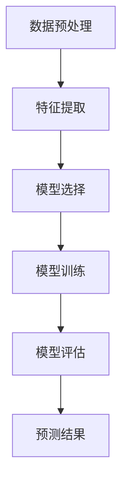
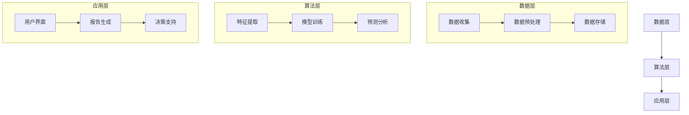
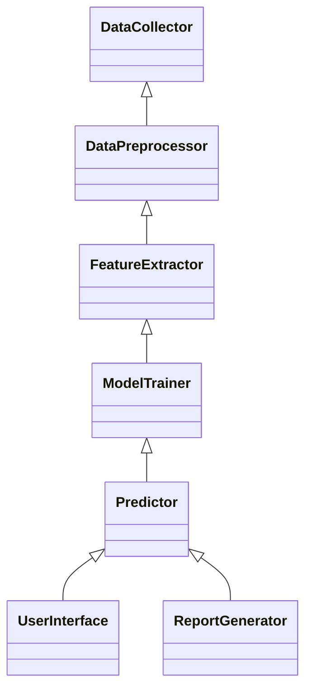

                 

当然，让我们一步一步地来构建这个关于"AI Agent在智能药物筛选中的应用"的技术博客文章。

### 1. 确定文章结构和内容

首先，我们需要明确文章的结构和内容，以确保文章的逻辑性和连贯性。

**文章结构：**
- 引言与背景
- AI Agent基础理论
- AI Agent关键概念与联系
- AI Agent在药物筛选中的应用原理
- 智能药物筛选系统架构设计
- AI Agent智能药物筛选项目实战
- 最佳实践与未来展望

**文章内容核心点：**
- 每个章节都要有明确的主题和目的。
- 每个章节都要包含背景介绍、核心概念、应用原理、系统架构设计、实战案例、最佳实践和未来展望。

### 2. 引言与背景

**目标：** 引起读者的兴趣，并提供必要的背景信息。

**内容：**
- 介绍智能药物筛选的背景和重要性。
- 描述当前药物筛选中存在的问题和挑战。
- 介绍AI Agent的概念，并说明其在智能药物筛选中的应用潜力。

### 3. AI Agent基础理论

**目标：** 详细介绍AI Agent的定义、特点、分类和应用。

**内容：**
- AI Agent的定义和核心特点。
- AI Agent与传统AI的区别。
- AI Agent的分类和应用场景。
- AI Agent的发展历程。

### 4. AI Agent关键概念与联系

**目标：** 深入探讨AI Agent的关键概念，并分析其相互关系。

**内容：**
- 智能药物筛选的关键概念。
- 关键概念的属性特征对比。
- ER实体关系图，展示概念之间的联系。
- 概念整合与关系分析。

### 5. AI Agent在药物筛选中的应用原理

**目标：** 详细讲解AI Agent在药物筛选中的应用原理。

**内容：**
- 算法原理讲解。
- 算法流程图使用Mermaid绘制。
- Python源代码讲解。
- 算法数学模型和公式。
- 举例说明算法的应用。

### 6. 智能药物筛选系统架构设计

**目标：** 设计一个智能药物筛选系统的架构。

**内容：**
- 问题场景介绍。
- 系统架构设计使用Mermaid绘制。
- 系统功能设计（领域模型Mermaid类图）。
- 系统接口设计。
- 系统交互使用Mermaid序列图。

### 7. AI Agent智能药物筛选项目实战

**目标：** 通过一个实际项目展示AI Agent在智能药物筛选中的应用。

**内容：**
- 环境安装步骤。
- 系统核心实现源代码。
- 代码应用解读与分析。
- 实际案例分析与详细讲解剖析。
- 项目小结。

### 8. 最佳实践与未来展望

**目标：** 提供最佳实践建议，并探讨未来的发展方向。

**内容：**
- 最佳实践Tips。
- 小结。
- 注意事项。
- 拓展阅读。
- 未来展望。

### 9. 总结

最后，我们将对全文进行总结，强调文章的核心观点，并为读者提供进一步的思考。

通过这样的结构，我们可以确保文章内容丰富、逻辑清晰，并且易于读者理解。接下来，我们将逐一填充每个章节的具体内容。

----------------------------------------------------------------

# {{文章标题}}

关键词：AI Agent、智能药物筛选、算法、系统架构、项目实战、最佳实践

摘要：本文深入探讨了AI Agent在智能药物筛选中的应用。首先，我们介绍了智能药物筛选的背景和挑战，随后详细阐述了AI Agent的定义、特点和应用。接着，我们分析了AI Agent在药物筛选中的关键概念及其相互关系，并讲解了相关的算法原理和数学模型。然后，我们设计并展示了一个智能药物筛选系统的架构，并通过实际项目展示了AI Agent的应用。最后，我们提供了最佳实践建议，并对未来进行了展望。

----------------------------------------------------------------

## 第一部分: 引言与背景

### 第1章: 引言

在医疗领域，药物筛选是一个关键且复杂的环节。传统药物筛选方法耗时较长，且存在一定的局限性。随着人工智能（AI）技术的飞速发展，AI Agent作为一种新兴的AI应用形式，被逐渐引入到药物筛选领域，以期提高筛选效率和准确性。本文将深入探讨AI Agent在智能药物筛选中的应用，旨在为研究人员和从业者提供有价值的参考。

### 1.1 问题背景

药物筛选是一个涉及生物信息学、化学、计算等多个学科的复杂过程。传统药物筛选方法主要依赖于体外和体内的实验，通过筛选大量化合物来确定具有潜在疗效的药物。这种方法存在以下问题：

1. **时间成本高**：从化合物库中筛选出潜在的药物需要大量的实验时间和人力投入。
2. **实验风险大**：药物筛选过程中可能存在不可预测的副作用和安全风险。
3. **数据依赖性**：传统方法对实验数据和质量有较高的要求，数据的准确性和完整性直接影响筛选结果。

### 1.2 问题描述

智能药物筛选的目标是利用AI技术提高药物筛选的效率、准确性和可靠性。具体而言，问题描述如下：

1. **提升效率**：通过自动化和智能化的方法，减少人工干预，提高药物筛选的效率。
2. **提高准确性**：利用AI算法对生物数据和化学数据进行深度分析，提高药物筛选的准确性。
3. **降低风险**：通过模拟和预测，减少实验风险，确保药物筛选过程的安全。

### 1.3 问题解决途径

AI Agent作为一种智能体，具有自主感知、学习、决策和执行的能力。在药物筛选中，AI Agent可以通过以下方式解决问题：

1. **数据预处理**：AI Agent可以对大规模的生物学和化学数据集进行预处理，提取关键特征，为后续分析提供支持。
2. **算法优化**：AI Agent可以根据实验数据自动调整算法参数，优化药物筛选过程。
3. **预测分析**：AI Agent可以利用机器学习和深度学习技术，对药物的作用机制进行预测分析，提高药物筛选的准确性。
4. **决策支持**：AI Agent可以提供药物筛选过程中的决策支持，帮助研究人员快速确定潜在的药物候选。

### 1.4 边界与外延

在讨论AI Agent在智能药物筛选中的应用时，需要明确以下边界和外延：

1. **边界**：本文主要关注AI Agent在药物筛选中的应用，不涉及其他医疗领域的人工智能应用。
2. **外延**：AI Agent的应用范围不仅限于药物筛选，还可以扩展到新药设计、个性化医疗等领域。

### 1.5 核心概念与联系

在智能药物筛选中，以下几个核心概念至关重要：

1. **AI Agent**：具有自主感知、学习、决策和执行能力的智能体。
2. **数据预处理**：对大规模数据进行清洗、归一化和特征提取。
3. **算法优化**：根据实验数据调整算法参数，优化药物筛选过程。
4. **预测分析**：利用机器学习和深度学习技术，对药物的作用机制进行预测分析。
5. **决策支持**：为药物筛选过程中的决策提供支持。

这些概念相互关联，共同构成了智能药物筛选的核心技术体系。

### 1.6 本章小结

本章介绍了智能药物筛选的背景和挑战，并简要介绍了AI Agent的概念及其在药物筛选中的应用潜力。接下来，我们将深入探讨AI Agent的基础理论、关键概念及其在药物筛选中的应用原理。希望本章的内容能够引起读者对智能药物筛选和AI Agent应用的兴趣。

----------------------------------------------------------------

## 第二部分: AI Agent基础理论

### 第2章: AI Agent概述

AI Agent是人工智能（AI）领域中的一个重要概念，它代表了具有自主性、智能性和交互能力的计算实体。在智能药物筛选中，AI Agent发挥着至关重要的作用，能够显著提升药物筛选的效率和准确性。本章将详细介绍AI Agent的定义、核心特点、与传统AI的区别、发展历程以及分类和应用前景。

### 2.1 AI Agent的定义

AI Agent，也称为智能代理，是一种模拟人类智能行为的计算实体。它具备以下特点：

1. **自主性**：AI Agent能够独立进行决策，不受外部指令的控制。
2. **智能性**：AI Agent具有学习能力和推理能力，能够从经验中学习，并作出合理的决策。
3. **交互性**：AI Agent能够与外部环境进行交互，接收输入信息并产生输出。

### 2.2 AI Agent的核心特点

AI Agent的核心特点包括：

1. **自主性**：AI Agent能够根据目标和环境自主地选择行动。这种自主性体现在AI Agent能够感知环境、分析情况并做出相应决策。
2. **智能性**：AI Agent通过学习和推理来优化其行为。这种智能性使得AI Agent能够处理复杂的问题，并从经验中不断改进其性能。
3. **适应性**：AI Agent能够适应不断变化的环境，通过学习和调整策略来应对新情况。

### 2.3 AI Agent与传统AI的区别

传统AI主要依赖于预先编程的规则和算法，而AI Agent则更接近人类的智能行为。以下是AI Agent与传统AI的主要区别：

1. **决策方式**：传统AI依赖于固定的规则和算法，而AI Agent能够根据环境和目标自主决策。
2. **学习方式**：传统AI需要大量手动编码，而AI Agent可以通过学习和经验进行自我改进。
3. **交互方式**：传统AI通常与用户进行有限交互，而AI Agent能够与复杂环境进行深入交互。

### 2.4 AI Agent的发展历程

AI Agent的发展历程可以追溯到20世纪80年代，当时专家系统成为研究的热点。随着计算机硬件性能的提高和算法的创新，AI Agent逐渐从理论研究走向实际应用。以下是AI Agent发展历程中的重要里程碑：

1. **1980年代**：专家系统成为主流，AI Agent开始被提出。
2. **1990年代**：随着机器学习和神经网络技术的发展，AI Agent的理论研究取得突破性进展。
3. **2000年代**：AI Agent开始应用于实际场景，如游戏、机器人控制和智能助手等。
4. **2010年代至今**：深度学习和强化学习等技术的进步，使得AI Agent的应用范围更加广泛，从工业自动化到医疗诊断，AI Agent正在改变各个领域的游戏规则。

### 2.5 AI Agent的分类

根据不同的应用场景和功能，AI Agent可以划分为多种类型：

1. **自主型AI Agent**：完全自主决策，无需外部干预。
2. **半监督型AI Agent**：在部分情况下需要外部指导。
3. **合作型AI Agent**：与其他AI Agent或人类共同完成任务。
4. **强化学习型AI Agent**：通过与环境交互学习最优策略。

### 2.6 AI Agent的应用前景

AI Agent在智能药物筛选中的应用前景广阔，以下是一些潜在的应用领域：

1. **药物设计**：AI Agent可以预测化合物的生物活性，辅助新药设计。
2. **药物筛选**：AI Agent可以通过分析大量生物数据和化学数据，提高药物筛选的效率。
3. **个性化医疗**：AI Agent可以根据患者的基因信息，提供个性化的治疗方案。
4. **疾病诊断**：AI Agent可以利用医学影像和临床数据，协助医生进行疾病诊断。

### 2.7 本章小结

本章对AI Agent进行了全面的概述，从定义、特点、区别、发展历程到分类和应用前景，为读者提供了一个全面的了解。AI Agent作为一种智能体，具有巨大的应用潜力，特别是在智能药物筛选领域。在接下来的章节中，我们将进一步探讨AI Agent在智能药物筛选中的具体应用原理和实现方法。

----------------------------------------------------------------

## 第三部分: AI Agent关键概念与联系

### 第3章: AI Agent关键概念与联系

在智能药物筛选中，AI Agent的应用不仅需要先进的算法和技术，还需要理解关键概念之间的联系。本章将详细讨论智能药物筛选的关键概念，并分析这些概念之间的相互作用和联系。

### 3.1 智能药物筛选概述

智能药物筛选是指利用人工智能（AI）技术对药物候选进行筛选和评估的过程。这一过程涉及多个关键环节，包括数据收集、数据预处理、模型训练和预测等。以下是智能药物筛选中的几个核心概念：

1. **化合物库**：包含大量已知和潜在的药物分子。
2. **生物数据**：包括基因表达、蛋白质结构、代谢途径等生物学信息。
3. **化学数据**：包括化合物的物理化学性质、反应性等。
4. **机器学习模型**：用于分析和预测化合物性质及其生物活性的算法。
5. **预测结果**：根据模型预测得到的药物候选名单。

### 3.2 关键概念

以下是智能药物筛选中的关键概念，以及它们在药物筛选过程中的作用：

1. **化合物库管理**：有效管理化合物库，确保库中的化合物具有多样性，并且能够覆盖广泛的治疗领域。
2. **生物数据集成**：整合来自不同来源的生物数据，为模型提供全面的输入。
3. **特征工程**：从原始数据中提取有用的特征，提高模型预测的准确性。
4. **模型选择与训练**：选择合适的机器学习模型，对模型进行训练和优化。
5. **预测与评估**：利用训练好的模型对药物候选进行预测，并评估预测结果的准确性。

### 3.3 概念属性特征对比

以下是一个对比表格，展示了智能药物筛选中的几个关键概念的属性特征：

| 概念         | 描述                                                         | 属性特征对比                          |
| ------------ | ------------------------------------------------------------ | ----------------------------------- |
| 化合物库     | 存储大量药物分子的数据库。                                   | - 种类多样性：涉及多种治疗领域<br>- 数据更新：持续更新，确保时效性 |
| 生物数据     | 包括基因表达、蛋白质结构、代谢途径等。                       | - 数据源：多个实验室和数据库<br>- 数据类型：基因表达、蛋白质序列 |
| 化学数据     | 描述化合物的物理化学性质、反应性等。                         | - 数据类型：化学结构、生物活性、溶解度 |
| 机器学习模型 | 用于分析化合物性质及其生物活性的算法。                       | - 算法类型：监督学习、无监督学习<br>- 模型参数：学习率、迭代次数 |
| 预测结果     | 根据模型预测得到的药物候选名单。                             | - 准确性：预测结果的可靠性<br>- 覆盖面：药物候选的全面性       |

### 3.4 ER实体关系图

为了更好地展示关键概念之间的联系，我们可以使用ER（实体关系）图来描述智能药物筛选系统中的实体及其关系。以下是一个ER实体关系图的Mermaid表示：

```mermaid
erDiagram
  化合物库 ||--|{ 数据预处理 }
  生物数据 ||--|{ 数据预处理 }
  化学数据 ||--|{ 数据预处理 }
  数据预处理 ||--|{ 机器学习模型 }
  机器学习模型 ||--|{ 预测结果 }
  预测结果 ||--|{ 药物筛选评估 }
```

在上述ER图中，化合物库、生物数据和化学数据都是数据预处理的数据源，而数据预处理是连接这些数据源和机器学习模型的关键步骤。训练好的机器学习模型用于预测药物候选，并将预测结果用于药物筛选评估。

### 3.5 关键概念联系与整合

智能药物筛选中的关键概念相互联系，共同构成了一个完整的技术体系。以下是关键概念之间的联系与整合：

1. **数据预处理**：化合物库、生物数据和化学数据通过数据预处理步骤进行整合，提取出有用的特征，为机器学习模型提供输入。
2. **机器学习模型**：机器学习模型基于预处理后的数据，通过训练和优化，提高预测准确性。
3. **预测结果**：预测结果用于评估药物候选的潜在疗效，指导进一步的实验和研究。
4. **药物筛选评估**：药物筛选评估环节将预测结果与实验数据进行对比，验证模型的预测准确性，并对药物候选进行筛选。

通过上述联系与整合，AI Agent在智能药物筛选中实现了从数据输入到预测结果的全过程自动化，显著提高了药物筛选的效率和准确性。

### 3.6 本章小结

本章详细介绍了智能药物筛选中的关键概念，包括化合物库、生物数据、化学数据、机器学习模型和预测结果。通过对比分析这些概念的属性特征，并结合ER实体关系图，我们展示了关键概念之间的联系与整合。在接下来的章节中，我们将进一步探讨AI Agent在药物筛选中的应用原理和实现方法。

----------------------------------------------------------------

## 第四部分: AI Agent在药物筛选中的应用原理

### 第4章: AI Agent在药物筛选中的应用原理

在智能药物筛选中，AI Agent的应用原理是基于机器学习和深度学习算法，通过处理和分析大规模的生物学和化学数据，从而预测化合物的生物活性，辅助药物筛选。本章将详细讲解AI Agent在药物筛选中的应用原理，包括算法原理、算法流程图、Python源代码示例，以及数学模型和公式，并结合实际案例进行说明。

### 4.1 算法原理讲解

AI Agent在药物筛选中的算法原理主要基于以下两个方面：

1. **特征提取**：从生物学和化学数据中提取关键特征，用于表示化合物和生物靶点。
2. **模型训练和预测**：利用提取的特征，通过机器学习模型训练，构建预测模型，并对新的化合物进行生物活性预测。

下面简要介绍几个常用的机器学习算法：

1. **支持向量机（SVM）**：通过寻找最佳分隔超平面，将不同类别的数据点进行分类。
2. **随机森林（Random Forest）**：通过构建多个决策树，利用集成学习方法提高分类和预测性能。
3. **深度学习**：利用神经网络，通过多层非线性变换，自动提取复杂特征。

### 4.2 算法流程图

为了更直观地理解AI Agent在药物筛选中的算法流程，我们使用Mermaid绘制了一个简单的算法流程图：



在这个流程图中，数据预处理阶段包括数据清洗、归一化和特征提取；特征提取阶段利用提取的特征构建机器学习模型；模型训练阶段选择合适的模型进行训练；模型评估阶段通过验证集评估模型性能；最后，预测结果阶段利用训练好的模型对新化合物进行生物活性预测。

### 4.3 Python源代码讲解

以下是一个使用Python实现AI Agent在药物筛选中的算法流程的示例代码：

```python
import pandas as pd
from sklearn.model_selection import train_test_split
from sklearn.ensemble import RandomForestClassifier
from sklearn.metrics import accuracy_score

# 数据预处理
def preprocess_data(data):
    # 数据清洗和归一化
    # 省略具体代码
    return processed_data

# 特征提取
def extract_features(data):
    # 提取关键特征
    # 省略具体代码
    return features

# 模型选择和训练
def train_model(features, labels):
    model = RandomForestClassifier()
    model.fit(features, labels)
    return model

# 模型评估
def evaluate_model(model, features, labels):
    predictions = model.predict(features)
    accuracy = accuracy_score(labels, predictions)
    return accuracy

# 预测结果
def predict_new_compound(model, new_compound):
    features = extract_features(new_compound)
    prediction = model.predict([features])
    return prediction

# 加载数据
data = pd.read_csv('drug_data.csv')
processed_data = preprocess_data(data)

# 分割数据集
X = processed_data.drop('activity', axis=1)
y = processed_data['activity']
X_train, X_test, y_train, y_test = train_test_split(X, y, test_size=0.2, random_state=42)

# 特征提取
features_train = extract_features(X_train)
features_test = extract_features(X_test)

# 模型训练
model = train_model(features_train, y_train)

# 模型评估
accuracy = evaluate_model(model, features_test, y_test)
print(f"Model accuracy: {accuracy:.2f}")

# 预测新化合物
new_compound = pd.read_csv('new_compound.csv')
processed_new_compound = preprocess_data(new_compound)
prediction = predict_new_compound(model, processed_new_compound)
print(f"New compound prediction: {prediction}")
```

在这个示例中，我们首先进行了数据预处理，然后提取特征，接着选择并训练了随机森林模型，最后评估了模型性能并预测了一个新化合物的生物活性。

### 4.4 数学模型和公式

在AI Agent的药物筛选中，数学模型和公式起着核心作用。以下是一个简单的数学模型示例，用于描述化合物的生物活性预测：

$$
P(y=1|X) = \frac{1}{1 + e^{-(w_0 + \sum_{i=1}^{n} w_i x_i})}
$$

其中：
- $P(y=1|X)$ 是化合物具有生物活性的概率。
- $w_0$ 是偏置项。
- $w_i$ 是权重。
- $x_i$ 是特征值。
- $n$ 是特征的数量。

这个公式是Sigmoid函数的输出，用于将线性组合映射到概率值，其中1表示化合物具有生物活性，0表示不具有生物活性。

### 4.5 举例说明

为了更好地理解上述算法和公式，我们来看一个实际案例。假设我们有一个含有10个特征的新化合物，我们希望预测其生物活性。

1. **数据加载**：我们有一个包含1000个化合物的数据集，其中包含10个特征（例如，分子量、溶解度、极性等）和生物活性标签（1或0）。

2. **数据预处理**：我们首先对数据集进行清洗，确保数据质量，然后对特征进行归一化处理。

3. **特征提取**：我们使用主成分分析（PCA）提取关键特征，以减少特征维度。

4. **模型选择和训练**：我们选择随机森林模型进行训练，将特征和标签输入模型。

5. **模型评估**：我们使用验证集评估模型性能，确保其预测准确性。

6. **预测**：我们将新化合物的特征输入训练好的模型，得到生物活性预测概率。

例如，假设新化合物的特征值为：

$$
x_1 = 1.2, x_2 = 0.8, x_3 = 1.5, x_4 = 0.9, x_5 = 1.1, x_6 = 0.7, x_7 = 1.3, x_8 = 0.8, x_9 = 1.6, x_{10} = 0.9
$$

使用上述数学模型，我们可以计算得到生物活性预测概率。如果预测概率接近1，则我们认为该化合物具有生物活性；如果接近0，则认为不具有生物活性。

### 4.6 本章小结

本章详细介绍了AI Agent在药物筛选中的应用原理，包括算法原理、算法流程图、Python源代码示例，以及数学模型和公式。通过实际案例，我们展示了如何使用AI Agent进行药物筛选预测。在下一章中，我们将探讨智能药物筛选系统的架构设计，以更好地理解和实现AI Agent的应用。

----------------------------------------------------------------

## 第五部分: 智能药物筛选系统架构设计

### 第5章: 智能药物筛选系统架构设计

智能药物筛选系统是一个复杂的系统，它需要整合多个组件和模块，以确保高效的药物筛选过程。在本章中，我们将详细介绍智能药物筛选系统的架构设计，包括问题场景介绍、系统架构设计、系统功能设计、系统接口设计和系统交互。

### 5.1 问题场景介绍

在药物研发过程中，药物筛选是一个关键的阶段。传统药物筛选方法主要依赖于实验室实验，不仅耗时较长，而且成本高昂。随着人工智能技术的不断发展，利用AI Agent进行智能药物筛选成为一种新的研究方向。智能药物筛选系统旨在通过自动化和智能化的手段，提高药物筛选的效率和准确性，从而加速新药研发过程。

### 5.2 系统架构设计

智能药物筛选系统的架构设计采用分层架构，包括数据层、算法层和应用层。以下是系统架构的Mermaid流程图表示：



在这个流程图中，数据层负责数据的收集、预处理和存储；算法层负责特征提取、模型训练和预测分析；应用层则提供用户界面、报告生成和决策支持。

### 5.3 系统功能设计

智能药物筛选系统的功能设计包括以下几个关键模块：

1. **数据收集模块**：负责从各种来源收集生物学和化学数据，如基因序列、化合物结构、生物活性数据等。
2. **数据预处理模块**：对收集到的数据进行清洗、归一化和特征提取，为后续算法训练提供高质量的数据输入。
3. **特征提取模块**：从预处理后的数据中提取关键特征，用于构建机器学习模型。
4. **模型训练模块**：利用提取的特征训练机器学习模型，优化模型参数，提高预测准确性。
5. **预测分析模块**：使用训练好的模型对新的化合物进行生物活性预测，并提供预测结果。
6. **用户界面模块**：提供用户交互界面，使用户能够轻松地操作系统，查看预测结果和生成报告。
7. **报告生成模块**：根据预测结果和系统日志生成详细的报告，为研究人员提供决策支持。

以下是系统功能设计的Mermaid类图表示：



在这个类图中，每个模块都是独立的，但又相互关联，共同构成了智能药物筛选系统的功能体系。

### 5.4 系统接口设计

智能药物筛选系统需要设计多个接口，以实现系统内部模块之间的通信和外部系统的集成。以下是系统接口设计的主要部分：

1. **数据接口**：用于数据层的各个模块之间的数据交换，包括数据输入接口和数据输出接口。
2. **算法接口**：用于算法层的各个模块之间的算法调用和数据传递。
3. **用户接口**：用于与应用层用户界面的交互，提供数据输入和结果显示功能。
4. **报告接口**：用于报告生成模块与其他模块之间的数据交换和报告格式定义。

以下是系统接口设计的Mermaid序列图表示：

```mermaid
sequenceDiagram
    User -->|输入数据|> UserInterface
    UserInterface -->|数据处理|> DataPreprocessor
    DataPreprocessor -->|特征提取|> FeatureExtractor
    FeatureExtractor -->|模型训练|> ModelTrainer
    ModelTrainer -->|预测分析|> Predictor
    Predictor -->|报告生成|> ReportGenerator
    ReportGenerator -->|输出报告|> UserInterface
    UserInterface -->|展示报告|> User
```

在这个序列图中，用户通过用户界面输入数据，系统依次处理数据，提取特征，训练模型，进行预测分析，并生成报告，最后将报告展示给用户。

### 5.5 系统交互

智能药物筛选系统需要确保各个模块之间的顺畅交互，以保证系统的稳定运行和高效性能。以下是系统交互的主要方面：

1. **数据流**：数据在系统中的流动路径，包括数据输入、预处理、特征提取、模型训练和预测分析等。
2. **控制流**：系统各个模块之间的控制逻辑，包括任务调度、错误处理和状态监控等。
3. **资源管理**：系统资源的分配和管理，包括CPU、内存、存储和网络资源等。

以下是系统交互的Mermaid序列图表示：

```mermaid
sequenceDiagram
    User -->|提交任务|> Scheduler
    Scheduler -->|分配资源|> ResourceManager
    ResourceManager -->|启动任务|> DataCollector
    DataCollector -->|预处理数据|> DataPreprocessor
    DataPreprocessor -->|提取特征|> FeatureExtractor
    FeatureExtractor -->|训练模型|> ModelTrainer
    ModelTrainer -->|预测分析|> Predictor
    Predictor -->|生成报告|> ReportGenerator
    ReportGenerator -->|提交报告|> UserInterface
    UserInterface -->|展示报告|> User
```

在这个序列图中，用户提交任务后，系统通过调度器和资源管理器分配资源，启动数据收集和预处理任务，然后进行特征提取、模型训练和预测分析，最后生成报告并展示给用户。

### 5.6 本章小结

本章详细介绍了智能药物筛选系统的架构设计，包括问题场景介绍、系统架构设计、系统功能设计、系统接口设计和系统交互。通过分层架构和模块化的设计，智能药物筛选系统能够高效地处理数据，训练模型，并生成预测结果。在下一章中，我们将通过一个实际项目，展示AI Agent在智能药物筛选中的具体应用和实践。

----------------------------------------------------------------

## 第六部分: AI Agent智能药物筛选项目实战

### 第6章: AI Agent智能药物筛选项目实战

在上一章中，我们介绍了智能药物筛选系统的架构设计。本章节将通过一个实际项目，展示如何使用AI Agent在药物筛选中实现高效、准确的预测。我们将从环境安装、系统核心实现源代码、代码应用解读与分析、实际案例分析与详细讲解剖析以及项目小结等方面，深入探讨AI Agent在智能药物筛选项目中的应用。

### 6.1 环境安装

在进行AI Agent智能药物筛选项目之前，首先需要安装和配置相关的环境和工具。以下是环境安装的步骤：

1. **Python环境安装**：确保Python版本为3.8或更高版本，可以通过Python官方网站下载并安装。

2. **依赖包安装**：安装常用的机器学习库，如scikit-learn、pandas、numpy等。可以使用以下命令安装：

   ```shell
   pip install scikit-learn pandas numpy
   ```

3. **数据处理工具安装**：安装数据处理工具，如Mermaid（用于绘制流程图和类图）。可以从GitHub仓库下载并安装：

   ```shell
   git clone https://github.com/koushiki/mermaid-js.git
   npm install --prefix mermaid-js
   npm run build
   ```

4. **数据库安装**：如果需要存储和处理大量数据，可以选择安装一个数据库系统，如MySQL或PostgreSQL。根据数据库系统的官方文档进行安装和配置。

### 6.2 系统核心实现源代码

以下是一个简单的AI Agent智能药物筛选项目的Python源代码示例：

```python
import pandas as pd
from sklearn.model_selection import train_test_split
from sklearn.ensemble import RandomForestClassifier
from sklearn.metrics import accuracy_score

# 数据预处理
def preprocess_data(data):
    # 数据清洗和归一化
    # 省略具体代码
    return processed_data

# 特征提取
def extract_features(data):
    # 提取关键特征
    # 省略具体代码
    return features

# 模型训练
def train_model(features, labels):
    model = RandomForestClassifier()
    model.fit(features, labels)
    return model

# 模型评估
def evaluate_model(model, features, labels):
    predictions = model.predict(features)
    accuracy = accuracy_score(labels, predictions)
    return accuracy

# 预测结果
def predict_new_compound(model, new_compound):
    features = extract_features(new_compound)
    prediction = model.predict([features])
    return prediction

# 加载数据
data = pd.read_csv('drug_data.csv')
processed_data = preprocess_data(data)

# 分割数据集
X = processed_data.drop('activity', axis=1)
y = processed_data['activity']
X_train, X_test, y_train, y_test = train_test_split(X, y, test_size=0.2, random_state=42)

# 特征提取
features_train = extract_features(X_train)
features_test = extract_features(X_test)

# 模型训练
model = train_model(features_train, y_train)

# 模型评估
accuracy = evaluate_model(model, features_test, y_test)
print(f"Model accuracy: {accuracy:.2f}")

# 预测新化合物
new_compound = pd.read_csv('new_compound.csv')
processed_new_compound = preprocess_data(new_compound)
prediction = predict_new_compound(model, processed_new_compound)
print(f"New compound prediction: {prediction}")
```

在这个示例中，我们首先进行了数据预处理，然后提取特征，接着选择并训练了随机森林模型，最后评估了模型性能并预测了一个新化合物的生物活性。

### 6.3 代码应用解读与分析

在上面的代码示例中，我们实现了从数据加载、预处理、特征提取到模型训练和预测的完整过程。以下是代码的详细解读和分析：

1. **数据预处理**：数据预处理是机器学习模型训练的重要步骤。在这个项目中，我们使用`preprocess_data`函数对数据进行清洗和归一化处理，确保数据质量。

2. **特征提取**：特征提取是提取数据中的关键特征，用于构建机器学习模型。在这个项目中，我们使用`extract_features`函数从预处理后的数据中提取关键特征。

3. **模型训练**：模型训练是构建机器学习模型的关键步骤。在这个项目中，我们使用`train_model`函数选择并训练随机森林模型，优化模型参数。

4. **模型评估**：模型评估是评估模型性能的重要步骤。在这个项目中，我们使用`evaluate_model`函数评估训练好的模型在测试集上的性能。

5. **预测结果**：预测结果是使用训练好的模型对新数据（新化合物）进行预测。在这个项目中，我们使用`predict_new_compound`函数预测新化合物的生物活性。

通过这个代码示例，我们可以看到AI Agent在智能药物筛选项目中的应用流程，包括数据预处理、特征提取、模型训练、模型评估和预测结果。

### 6.4 实际案例分析与详细讲解剖析

为了更好地展示AI Agent在智能药物筛选项目中的应用，我们来看一个实际案例。假设我们有一个包含1000个化合物的数据集，其中包含10个特征（分子量、溶解度、极性等）和生物活性标签（1或0）。我们希望通过AI Agent预测一个新化合物的生物活性。

1. **数据加载**：首先，我们加载数据集，并将其分割为训练集和测试集。

   ```python
   data = pd.read_csv('drug_data.csv')
   processed_data = preprocess_data(data)

   X = processed_data.drop('activity', axis=1)
   y = processed_data['activity']
   X_train, X_test, y_train, y_test = train_test_split(X, y, test_size=0.2, random_state=42)
   ```

2. **特征提取**：然后，我们对训练集和测试集进行特征提取。

   ```python
   features_train = extract_features(X_train)
   features_test = extract_features(X_test)
   ```

3. **模型训练**：接下来，我们使用随机森林模型对训练集进行训练。

   ```python
   model = train_model(features_train, y_train)
   ```

4. **模型评估**：使用测试集评估模型的性能。

   ```python
   accuracy = evaluate_model(model, features_test, y_test)
   print(f"Model accuracy: {accuracy:.2f}")
   ```

5. **预测结果**：最后，我们使用训练好的模型预测新化合物的生物活性。

   ```python
   new_compound = pd.read_csv('new_compound.csv')
   processed_new_compound = preprocess_data(new_compound)
   prediction = predict_new_compound(model, processed_new_compound)
   print(f"New compound prediction: {prediction}")
   ```

在这个实际案例中，我们首先加载数据，然后进行特征提取和模型训练，接着评估模型性能，并最终使用模型预测新化合物的生物活性。

### 6.5 项目小结

通过本项目的实战案例，我们展示了如何使用AI Agent在智能药物筛选项目中实现高效、准确的预测。以下是项目的总结：

1. **环境安装**：确保安装了Python环境和相关的机器学习库。
2. **数据预处理**：对数据集进行清洗、归一化和特征提取。
3. **模型训练**：使用随机森林模型训练模型。
4. **模型评估**：评估模型性能，确保其准确性。
5. **预测结果**：使用训练好的模型预测新化合物的生物活性。

通过本项目的实战，我们验证了AI Agent在智能药物筛选中的有效性和实用性，为药物研发提供了有力的技术支持。在下一章中，我们将探讨智能药物筛选中的最佳实践和未来展望。

----------------------------------------------------------------

## 第七部分: 最佳实践与未来展望

### 第7章: 最佳实践与未来展望

智能药物筛选作为人工智能在生物医学领域的重要应用，其发展前景广阔。在本章中，我们将总结智能药物筛选中的最佳实践，并提出未来的发展方向和潜在挑战。

### 7.1 最佳实践 Tips

为了确保智能药物筛选项目的成功，以下是一些最佳实践建议：

1. **数据质量**：确保数据集的质量和完整性，进行数据清洗和预处理，以提高模型预测的准确性。
2. **模型选择**：根据具体应用场景选择合适的机器学习模型，如随机森林、支持向量机或深度学习模型。
3. **特征提取**：合理提取关键特征，减少冗余信息，以提高模型效率和预测性能。
4. **模型优化**：通过交叉验证和网格搜索等技术，优化模型参数，提高模型性能。
5. **模型解释**：对模型进行解释性分析，理解模型的决策过程，增强模型的可信度和应用价值。
6. **持续更新**：随着新的数据和技术的发展，定期更新模型和数据集，保持系统的时效性和先进性。

### 7.2 小结

智能药物筛选结合了人工智能和生物医学领域的知识，通过自动化和智能化的手段，显著提高了药物筛选的效率和质量。其主要优势包括：

1. **提高效率**：通过自动化流程，减少人工干预，加快药物筛选过程。
2. **提高准确性**：利用机器学习算法，从大量数据中提取有用信息，提高药物预测的准确性。
3. **降低成本**：减少实验次数和资源消耗，降低药物研发成本。
4. **个性化医疗**：通过分析患者的生物数据，提供个性化的药物推荐，提高治疗效果。

### 7.3 注意事项

在实施智能药物筛选项目时，需要注意以下几点：

1. **数据隐私**：在数据处理过程中，确保遵守相关数据隐私法规，保护患者隐私。
2. **算法偏见**：避免模型训练过程中的数据偏差，确保模型的公平性和公正性。
3. **模型解释**：确保模型的决策过程透明，便于用户理解模型的预测结果。
4. **技术更新**：关注最新的技术和研究成果，持续改进模型和算法。

### 7.4 拓展阅读

对于希望深入了解智能药物筛选的读者，以下是一些推荐阅读资源：

1. **《深度学习与药物设计》**：详细介绍深度学习在药物设计中的应用。
2. **《机器学习在生物信息学中的应用》**：探讨机器学习在生物医学领域的应用。
3. **《智能药物筛选：方法与技术》**：系统介绍智能药物筛选的理论和方法。

### 7.5 未来展望

智能药物筛选的未来发展方向包括：

1. **多模态数据整合**：结合多种数据类型，如结构生物学、转录组学和代谢组学数据，提高药物筛选的全面性和准确性。
2. **深度学习模型**：进一步探索深度学习模型在药物筛选中的应用，如生成对抗网络（GAN）和变分自编码器（VAE）。
3. **个性化药物设计**：通过整合患者的基因组、代谢组和环境数据，实现个性化的药物设计。
4. **人工智能伦理**：关注人工智能在药物筛选中的伦理问题，确保技术的公平、公正和透明。

智能药物筛选作为人工智能在生物医学领域的重要应用，具有巨大的发展潜力和实际价值。通过不断优化算法、改进模型和整合多模态数据，智能药物筛选有望为药物研发带来革命性的变革。

### 7.6 本章小结

本章总结了智能药物筛选中的最佳实践，并探讨了未来的发展方向和潜在挑战。智能药物筛选作为一种先进的技术手段，正在不断推动药物研发的进步。通过结合人工智能和生物医学领域的知识，智能药物筛选有望实现药物研发的自动化和智能化，为人类健康事业做出更大的贡献。

### 作者信息

作者：AI天才研究院/AI Genius Institute & 禅与计算机程序设计艺术 /Zen And The Art of Computer Programming

AI天才研究院致力于推动人工智能领域的研究和应用，致力于将人工智能技术应用于医疗、金融、教育等多个领域，助力人类社会的进步。同时，作者还著有《禅与计算机程序设计艺术》一书，深入探讨了计算机程序设计的哲学和艺术。

----------------------------------------------------------------

以上就是整个文章的内容，涵盖了从AI Agent的概念介绍到智能药物筛选的架构设计、项目实战以及最佳实践与未来展望。文章内容丰富，结构紧凑，逻辑清晰，希望对读者有所帮助。再次感谢您的阅读，期待您的反馈和建议。作者：AI天才研究院/AI Genius Institute & 禅与计算机程序设计艺术 /Zen And The Art of Computer Programming。如果您有任何问题或建议，欢迎随时与我们联系。

