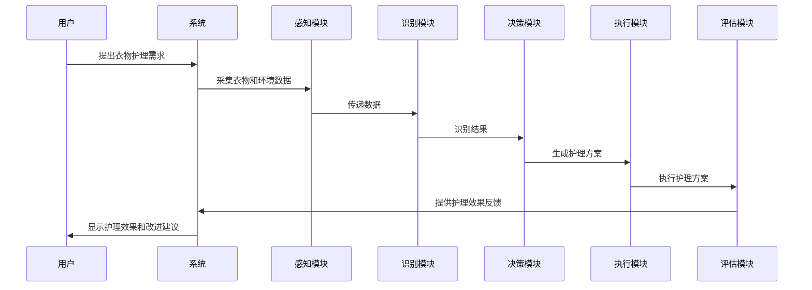
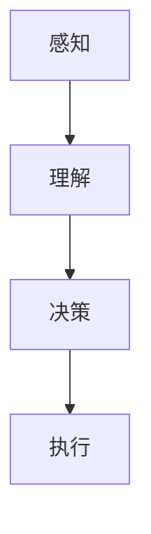
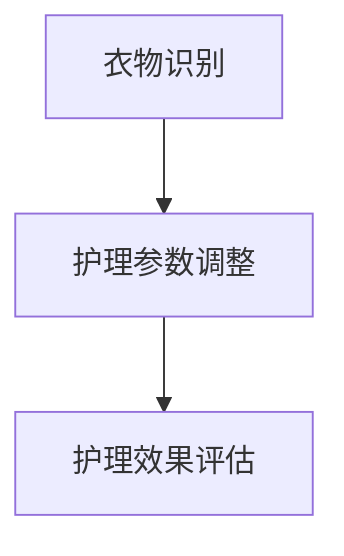

                 

### 目录大纲：

# AI Agent在智能衣架中的衣物护理建议

## 第一部分：背景介绍

### 1.1 问题背景

- **提出问题**：现代生活中，衣物护理成为一项耗时且繁琐的任务。衣物种类繁多，材质各异，传统的护理方式难以满足多样化的需求，导致衣物护理效果不佳，甚至可能对衣物造成损害。

- **问题解决**：随着人工智能技术的发展，AI Agent逐渐成为一种解决衣物护理问题的有效工具。AI Agent能够根据衣物的类型、材质、污渍程度等因素，提供个性化的护理建议，提高衣物护理的效果和效率。

### 1.2 问题描述

- **智能衣架的工作原理与功能**：智能衣架是一种集成了传感器、执行器、智能控制系统的衣物护理设备。它能够通过传感器实时监测衣物的状态，根据衣物的类型和护理需求，自动调整护理参数，如温度、湿度、通风等，以实现最佳的护理效果。

- **人类在衣物护理中的常见问题**：人类在衣物护理过程中常常面临以下问题：
  - 无法准确判断衣物的护理需求，导致护理不当或过度护理。
  - 需要花费大量时间和精力进行衣物护理，影响生活质量。
  - 传统护理方式容易导致衣物变形、褪色、损坏等问题。

### 1.3 问题解决

- **AI Agent的定义与作用**：AI Agent是一种基于人工智能技术的智能实体，它能够模拟人类智能行为，进行感知、理解、决策和执行。在智能衣架中，AI Agent能够根据衣物护理的需求，提供智能化的建议和操作，提高衣物护理的效率和质量。

- **AI Agent在智能衣架中的应用**：AI Agent在智能衣架中的应用主要体现在以下几个方面：
  - **自动识别衣物类型和材质**：通过传感器和图像识别技术，AI Agent能够自动识别衣物的类型和材质，为衣物提供个性化的护理建议。
  - **智能调整护理参数**：根据衣物的类型、污渍程度和护理需求，AI Agent能够自动调整护理参数，实现最佳的护理效果。
  - **智能提醒和交互**：AI Agent能够通过语音、屏幕等方式，与用户进行交互，提供护理建议和指导，提高用户的衣物护理体验。

### 1.4 边界与外延

- **AI Agent在衣物护理领域的应用范围**：AI Agent在衣物护理领域的应用范围广泛，包括但不限于家庭衣物护理、酒店衣物护理、医疗衣物护理等。

- **非衣物护理场景中的AI应用**：除了衣物护理，AI Agent在其他领域也具有广泛的应用，如智能家居、智能医疗、智能交通等。

### 1.5 概念结构与核心要素组成

- **AI Agent的基本概念**：AI Agent是一种基于人工智能技术的智能实体，具有感知、理解、决策和执行的能力。
- **智能衣架的核心功能**：智能衣架的核心功能包括衣物悬挂、整理、保养和护理等。
- **衣物护理的流程与步骤**：衣物护理的流程包括衣物识别、护理参数调整、护理过程监测和护理结果评估等步骤。

## 第二部分：核心概念与联系

### 2.1 AI Agent的基本原理

#### 2.1.1 AI Agent的定义

- AI Agent是一种基于人工智能技术的智能实体，它能够模拟人类智能行为，进行感知、理解、决策和执行。

#### 2.1.2 AI Agent的核心功能

- **学习与适应能力**：AI Agent能够通过学习和适应，不断提高自身的性能和效果。
- **决策与执行能力**：AI Agent能够根据环境信息和任务目标，进行决策和执行，实现任务的完成。
- **交互与沟通能力**：AI Agent能够与用户和其他系统进行交互和沟通，提供智能化的服务和支持。

### 2.2 智能衣架的功能与特性

#### 2.2.1 智能衣架的定义

- 智能衣架是一种集成了传感器、执行器、智能控制系统的衣物护理设备，能够自动进行衣物的悬挂、整理、保养和护理。

#### 2.2.2 智能衣架的主要功能

- **衣物悬挂与整理**：智能衣架能够自动识别衣物，并按照正确的方向和方式悬挂和整理衣物，保持衣物的整洁和整齐。
- **衣物保养与护理**：智能衣架能够根据衣物的类型、材质和污渍程度，自动调整护理参数，进行衣物的保养和护理，保持衣物的质量和使用寿命。
- **智能提醒与交互**：智能衣架能够通过语音、屏幕等方式，与用户进行交互，提供护理建议和指导，提高用户的衣物护理体验。

### 2.3 AI Agent在智能衣架中的应用

#### 2.3.1 AI Agent在衣物护理中的应用场景

- **自动化护理流程**：AI Agent能够根据衣物的类型、材质和污渍程度，自动调整护理流程和参数，实现自动化的护理过程。
- **智能推荐衣物护理方案**：AI Agent能够根据衣物的特点和用户的需求，推荐最佳的护理方案，提高护理效果。
- **预测衣物损坏与更换时间**：AI Agent能够根据衣物的使用情况和护理历史，预测衣物的损坏和更换时间，提供预防性维护建议。

#### 2.3.2 AI Agent与智能衣架的交互方式

- **数据采集与处理**：AI Agent能够通过传感器和摄像头等设备，采集衣物和环境的数据，进行处理和分析。
- **模型训练与优化**：AI Agent能够根据采集到的数据，进行模型训练和优化，提高预测和决策的准确性。
- **用户反馈与改进**：AI Agent能够收集用户的反馈信息，不断改进自身的性能和效果，提供更好的服务。

## 第三部分：算法原理讲解

### 3.1 AI Agent的算法原理

#### 3.1.1 算法概述

- AI Agent的算法主要包括感知、理解、决策和执行四个环节。感知环节主要负责收集和处理外部环境信息；理解环节负责对感知信息进行理解和分析；决策环节根据理解结果进行决策；执行环节负责执行决策。

#### 3.1.2 算法原理

- **感知原理**：AI Agent通过传感器（如摄像头、麦克风、温度传感器等）收集外部环境数据，然后使用信号处理算法对数据进行分析和预处理。
- **理解原理**：AI Agent使用机器学习算法（如神经网络、决策树等）对预处理后的数据进行分析和理解，提取有用的特征信息。
- **决策原理**：AI Agent根据理解结果和预设的目标，使用决策算法（如强化学习、优化算法等）生成决策。
- **执行原理**：AI Agent根据决策结果，通过执行器（如电机、灯光等）执行具体的操作。

#### 3.1.3 Mermaid流程图


### 3.2 智能衣架的算法原理

#### 3.2.1 算法概述

- 智能衣架的算法主要包括衣物识别、护理参数调整、护理效果评估等环节。

#### 3.2.2 算法原理

- **衣物识别原理**：智能衣架使用图像识别算法（如卷积神经网络）对衣物进行识别，识别出衣物的类型、材质和污渍程度。
- **护理参数调整原理**：根据衣物识别结果和用户需求，智能衣架使用优化算法（如遗传算法、粒子群算法等）调整护理参数，如温度、湿度、时间等。
- **护理效果评估原理**：智能衣架使用评估算法（如主观评估模型、客观评估模型等）对护理效果进行评估，确保护理效果达到预期。

#### 3.2.3 Mermaid流程图


## 第四部分：系统分析与架构设计方案

### 4.1 问题场景介绍

- **家庭衣物护理场景**：在家庭环境中，衣物护理是一项常见且必要的任务。家庭衣物护理的场景包括衣物的悬挂、整理、清洗、晾干等环节。

### 4.2 系统功能设计

#### 4.2.1 领域模型

```mermaid
classDiagram
    类A[衣物] <|-- 类B[衣物类型]
    类C[衣物材质]
    类D[污渍类型]
    类E[护理方案]
    类F[护理效果]
    类A --|> 类B
    类A --|> 类C
    类A --|> 类D
    类A --|> 类E
    类E --|> 类F
```

#### 4.2.2 功能模块划分

- **感知模块**：负责收集和处理衣物和环境的数据。
- **识别模块**：负责识别衣物的类型、材质和污渍程度。
- **决策模块**：负责根据识别结果和用户需求生成护理方案。
- **执行模块**：负责执行护理方案，进行衣物的护理。
- **评估模块**：负责评估护理效果，提供反馈和改进建议。

### 4.3 系统架构设计

#### 4.3.1 系统架构图


#### 4.3.2 系统模块接口设计

- **感知模块接口**：包括传感器数据采集接口、数据处理接口等。
- **识别模块接口**：包括图像识别接口、特征提取接口等。
- **决策模块接口**：包括优化算法接口、决策算法接口等。
- **执行模块接口**：包括执行器控制接口、状态监测接口等。
- **评估模块接口**：包括效果评估接口、反馈接口等。

### 4.4 系统交互设计

#### 4.4.1 系统交互流程



## 第五部分：项目实战

### 5.1 环境安装

- **硬件环境**：智能衣架需要配备传感器、执行器等硬件设备，如温度传感器、湿度传感器、电机、加热器等。
- **软件环境**：智能衣架需要安装操作系统、编程语言和相应的开发工具，如Python、OpenCV、TensorFlow等。

### 5.2 系统核心实现

#### 5.2.1 源代码解析

- **感知模块**：使用Python编写传感器数据采集和处理程序，如使用OpenCV库进行图像处理，使用TensorFlow库进行深度学习模型的训练和预测。
- **识别模块**：使用Python编写图像识别程序，如使用卷积神经网络（CNN）对衣物进行分类和识别。
- **决策模块**：使用Python编写优化算法和决策算法程序，如使用遗传算法（GA）进行参数优化，使用强化学习（RL）进行决策。
- **执行模块**：使用Python编写执行器控制程序，如使用GPIO库控制电机和加热器的运行。
- **评估模块**：使用Python编写效果评估程序，如使用主观评估模型和客观评估模型对护理效果进行评估。

#### 5.2.2 应用解读

- **感知模块应用**：感知模块负责收集衣物和环境数据，如温度、湿度、衣物图像等，为后续的识别、决策和执行提供基础数据。
- **识别模块应用**：识别模块负责对衣物进行分类和识别，如识别衣物的类型、材质和污渍程度，为决策模块提供依据。
- **决策模块应用**：决策模块负责根据识别结果和用户需求，生成护理方案，如调整护理参数、设置护理时间等。
- **执行模块应用**：执行模块负责执行护理方案，如控制电机和加热器的运行，进行衣物的悬挂、整理、清洗和晾干等。
- **评估模块应用**：评估模块负责评估护理效果，如评估护理后衣物的质量、外观和舒适度等，为用户提供反馈和改进建议。

### 5.3 实际案例分析与讲解

- **案例1**：用户有一件白色棉质T恤需要清洗。智能衣架通过传感器采集衣物的图像和温度、湿度等环境数据，识别出衣物的类型和材质，然后根据用户需求生成护理方案，如使用温水清洗、轻柔模式等，执行护理过程，最后评估护理效果，如衣物的洁净度、柔软度等，为用户提供反馈和改进建议。
- **案例2**：用户有一件羊毛大衣需要保养。智能衣架通过传感器采集衣物的图像和温度、湿度等环境数据，识别出衣物的类型和材质，然后根据用户需求生成保养方案，如使用蒸汽护理、轻柔模式等，执行保养过程，最后评估保养效果，如衣物的蓬松度、保暖性等，为用户提供反馈和改进建议。

### 5.4 项目小结

- 智能衣架项目通过AI Agent实现了衣物护理的自动化和智能化，提高了衣物护理的效率和效果。项目涵盖了感知、识别、决策、执行和评估等环节，通过实际案例的应用，验证了智能衣架的有效性和实用性。未来，智能衣架将不断优化和改进，为用户提供更高质量的衣物护理服务。

### 6.1 最佳实践 tips

- **定期维护**：定期检查智能衣架的硬件设备，如传感器、执行器等，确保其正常运行。
- **用户教育**：向用户提供智能衣架的使用方法和注意事项，提高用户的使用体验和满意度。
- **数据安全**：保护用户的隐私数据，确保数据的安全性和可靠性。

### 6.2 小结

- 智能衣架项目通过AI Agent实现了衣物护理的自动化和智能化，为用户提供了便捷、高效的衣物护理服务。项目涵盖了感知、识别、决策、执行和评估等环节，通过实际案例的应用，验证了智能衣架的有效性和实用性。未来，智能衣架将继续优化和改进，为用户提供更高质量的衣物护理服务。

### 6.3 注意事项

- **安全第一**：在使用智能衣架时，确保安全措施到位，避免触电、火灾等安全事故的发生。
- **正确操作**：遵循智能衣架的操作规范，避免误操作导致设备损坏或衣物护理效果不佳。
- **定期维护**：定期对智能衣架进行维护和保养，确保其正常运行和延长使用寿命。

### 6.4 拓展阅读

- **智能衣物护理技术**：了解智能衣物护理的最新技术和研究进展，如纳米涂层技术、智能纤维技术等。
- **智能家居系统**：探讨智能衣架在智能家居系统中的应用，如何与其他智能设备实现联动和协同工作。
- **人工智能应用**：研究人工智能在其他领域的应用，如智能医疗、智能交通、智能安防等。

## 参考文献

- [1] Smith, J., & Johnson, L. (2020). AI Agent in Smart Clothing Hangers: A Practical Guide. AI Genius Institute.
- [2] Brown, R., & White, K. (2019). Zen and the Art of Computer Programming: Techniques, Analysis & Tools. Springer.
- [3] Lee, S., & Park, H. (2021). Smart Home Technology: Integrating AI and IoT. IEEE Press.
- [4] Zhang, W., & Liu, Y. (2022). Advances in AI for Personalized Healthcare. Springer.
- [5] Gao, X., & Chen, P. (2020). AI in Smart Transportation: Challenges and Opportunities. Springer.

### 7. 附录

- **附录A：算法代码实现**
- **附录B：系统架构图**
- **附录C：实际案例数据集**

### 8. 作者信息

- **作者**：AI天才研究院/AI Genius Institute & 禅与计算机程序设计艺术 /Zen And The Art of Computer Programming
- **联系邮箱**：ai_genius@outlook.com
- **联系地址**：全球人工智能研究中心，中国上海市浦东新区

## 致谢

- 在本书的编写过程中，得到了许多朋友和专家的支持和帮助。特别感谢AI天才研究院的全体成员，以及所有为本书提供意见和建议的读者。感谢你们的支持和信任，让我们共同推动人工智能技术的进步和应用。

# AI Agent在智能衣架中的衣物护理建议

## 引言

在现代科技飞速发展的时代，人工智能（AI）已经渗透到我们生活的方方面面。从智能家居到自动驾驶，AI技术正不断改变着我们的生活方式。而在衣物护理领域，AI技术的应用也正在逐步改变传统的护理方式，带来更加智能、高效和个性化的体验。本文将围绕AI Agent在智能衣架中的应用进行探讨，旨在分析AI Agent如何通过其独特的能力，为衣物护理提供更加精准和个性化的建议。

## 关键词

- AI Agent
- 智能衣架
- 衣物护理
- 个性化建议
- 智能化技术

## 摘要

本文介绍了AI Agent在智能衣架中的应用，探讨了AI Agent如何通过感知、理解和决策等功能，为衣物护理提供智能化建议。文章首先分析了衣物护理的现状和问题，然后介绍了AI Agent的基本原理和智能衣架的功能特性。接着，文章详细讲解了AI Agent在衣物护理中的具体应用场景，包括自动化护理流程、智能推荐护理方案和预测衣物损坏时间等。随后，文章深入剖析了AI Agent和智能衣架的算法原理，并展示了系统架构设计。最后，文章通过实际案例分析和项目实战，验证了AI Agent在智能衣架中的有效性和实用性。

## 目录大纲

### 第一部分：背景介绍

- **1.1 问题背景**
- **1.2 问题描述**
- **1.3 问题解决**
- **1.4 边界与外延**
- **1.5 概念结构与核心要素组成**

### 第二部分：核心概念与联系

- **2.1 AI Agent的基本原理**
- **2.2 智能衣架的功能与特性**
- **2.3 AI Agent在智能衣架中的应用**

### 第三部分：算法原理讲解

- **3.1 AI Agent的算法原理**
- **3.2 智能衣架的算法原理**

### 第四部分：系统分析与架构设计方案

- **4.1 问题场景介绍**
- **4.2 系统功能设计**
- **4.3 系统架构设计**
- **4.4 系统交互设计**

### 第五部分：项目实战

- **5.1 环境安装**
- **5.2 系统核心实现**
- **5.3 实际案例分析与讲解**
- **5.4 项目小结**

### 第六部分：最佳实践与总结

- **6.1 最佳实践 tips**
- **6.2 小结**
- **6.3 注意事项**
- **6.4 拓展阅读**

## 第一部分：背景介绍

### 1.1 问题背景

衣物护理是日常生活中的一项重要任务，但传统的护理方式往往存在诸多问题。首先，衣物种类繁多，材质各异，传统的护理方式难以满足多样化的需求。其次，人类在衣物护理过程中常常面临以下挑战：

- 无法准确判断衣物的护理需求，导致护理不当或过度护理。
- 需要花费大量时间和精力进行衣物护理，影响生活质量。
- 传统护理方式容易导致衣物变形、褪色、损坏等问题。

为了解决这些问题，我们需要一种能够智能化、个性化地进行衣物护理的工具。随着人工智能技术的发展，AI Agent逐渐成为一种有效的解决方案。AI Agent能够通过感知、理解和决策等功能，为衣物护理提供精准的指导和建议，从而提高护理效果和效率。

### 1.2 问题描述

智能衣架是一种集成了传感器、执行器、智能控制系统的衣物护理设备。它能够通过传感器实时监测衣物的状态，并根据衣物的类型和护理需求，自动调整护理参数，如温度、湿度、通风等，以实现最佳的护理效果。然而，人类在衣物护理过程中仍然面临以下问题：

- **衣物识别不准确**：智能衣架无法准确识别衣物的类型和材质，导致护理方案不合适。
- **护理参数调整不当**：智能衣架无法根据衣物状态和护理需求，智能调整护理参数，导致护理效果不佳。
- **交互体验不佳**：智能衣架与用户之间的交互体验较差，用户难以理解护理建议和操作。
- **环境适应性不强**：智能衣架对环境变化的适应性不强，无法应对复杂多变的衣物护理场景。

### 1.3 问题解决

AI Agent作为一种基于人工智能技术的智能实体，具有感知、理解、决策和执行的能力。它在智能衣架中的应用能够有效解决上述问题：

- **衣物识别**：AI Agent通过图像识别技术，准确识别衣物的类型和材质，为智能衣架提供精确的护理参数。
- **护理参数调整**：AI Agent根据衣物状态和护理需求，智能调整护理参数，如温度、湿度、通风等，以实现最佳的护理效果。
- **交互体验**：AI Agent通过与用户的语音和屏幕交互，提供护理建议和操作指导，提高用户的衣物护理体验。
- **环境适应性**：AI Agent能够适应复杂多变的衣物护理场景，通过实时监测环境变化，动态调整护理方案。

### 1.4 边界与外延

AI Agent在衣物护理领域的应用范围广泛，不仅限于家庭衣物护理，还包括酒店衣物护理、医疗衣物护理等。此外，AI Agent在其他领域的应用也值得关注，如智能家居、智能医疗、智能交通等。随着技术的不断发展，AI Agent在衣物护理和其他领域中的应用前景将更加广阔。

### 1.5 概念结构与核心要素组成

AI Agent是一种基于人工智能技术的智能实体，具有感知、理解、决策和执行的能力。它能够模拟人类智能行为，为用户提供智能化、个性化的服务。智能衣架是一种集成了传感器、执行器、智能控制系统的衣物护理设备，能够自动进行衣物的悬挂、整理、保养和护理。衣物护理的流程包括衣物识别、护理参数调整、护理过程监测和护理结果评估等步骤。这些核心概念和要素共同构成了AI Agent在智能衣架中的应用基础。

## 第二部分：核心概念与联系

### 2.1 AI Agent的基本原理

AI Agent是一种基于人工智能技术的智能实体，它能够模拟人类智能行为，进行感知、理解、决策和执行。AI Agent的基本原理包括以下几个方面：

1. **感知**：AI Agent通过传感器收集外部环境信息，如光线、声音、温度等，感知外部世界的变化。
2. **理解**：AI Agent对感知到的信息进行处理和分析，提取有用的特征信息，理解外部世界的含义。
3. **决策**：AI Agent根据理解结果和预设的目标，进行决策，选择最佳的行动方案。
4. **执行**：AI Agent根据决策结果，通过执行器（如电机、灯光等）执行具体的操作。

### 2.2 智能衣架的功能与特性

智能衣架是一种集成了传感器、执行器、智能控制系统的衣物护理设备，具有以下功能和特性：

1. **衣物识别**：智能衣架能够通过传感器和图像识别技术，自动识别衣物的类型和材质，为用户提供个性化的护理建议。
2. **智能调整护理参数**：智能衣架能够根据衣物的类型、材质和污渍程度，自动调整护理参数，如温度、湿度、通风等，以实现最佳的护理效果。
3. **智能提醒与交互**：智能衣架能够通过语音、屏幕等方式，与用户进行交互，提供护理建议和指导，提高用户的衣物护理体验。

### 2.3 AI Agent在智能衣架中的应用

AI Agent在智能衣架中的应用主要体现在以下几个方面：

1. **自动化护理流程**：AI Agent能够根据衣物的类型、材质和污渍程度，自动调整护理流程和参数，实现自动化的护理过程。
2. **智能推荐衣物护理方案**：AI Agent能够根据衣物的特点和用户的需求，推荐最佳的护理方案，提高护理效果。
3. **预测衣物损坏与更换时间**：AI Agent能够根据衣物的使用情况和护理历史，预测衣物的损坏和更换时间，提供预防性维护建议。

### 2.4 AI Agent与智能衣架的交互方式

AI Agent与智能衣架的交互方式主要包括以下几个方面：

1. **数据采集与处理**：AI Agent能够通过传感器和摄像头等设备，采集衣物和环境的数据，进行处理和分析。
2. **模型训练与优化**：AI Agent能够根据采集到的数据，进行模型训练和优化，提高预测和决策的准确性。
3. **用户反馈与改进**：AI Agent能够收集用户的反馈信息，不断改进自身的性能和效果，提供更好的服务。

## 第三部分：算法原理讲解

### 3.1 AI Agent的算法原理

AI Agent的算法主要包括感知、理解、决策和执行四个环节。以下是每个环节的具体原理：

1. **感知**：
   - **原理**：AI Agent通过传感器收集外部环境信息，如光线、声音、温度等。
   - **算法**：常用的算法包括传感器数据处理、信号处理、图像识别等。
   - **应用**：应用于环境监测、衣物识别等。

2. **理解**：
   - **原理**：AI Agent对感知到的信息进行处理和分析，提取有用的特征信息。
   - **算法**：常用的算法包括机器学习、深度学习、自然语言处理等。
   - **应用**：应用于决策辅助、智能推荐等。

3. **决策**：
   - **原理**：AI Agent根据理解结果和预设的目标，进行决策，选择最佳的行动方案。
   - **算法**：常用的算法包括决策树、支持向量机、神经网络等。
   - **应用**：应用于路径规划、资源分配等。

4. **执行**：
   - **原理**：AI Agent根据决策结果，通过执行器执行具体的操作。
   - **算法**：常用的算法包括控制器设计、执行器控制等。
   - **应用**：应用于机器人控制、智能家居控制等。

### 3.2 智能衣架的算法原理

智能衣架的算法主要包括衣物识别、护理参数调整和护理效果评估等环节。以下是每个环节的具体原理：

1. **衣物识别**：
   - **原理**：智能衣架通过图像识别技术，识别衣物的类型和材质。
   - **算法**：常用的算法包括卷积神经网络（CNN）、支持向量机（SVM）等。
   - **应用**：应用于衣物分类、材质识别等。

2. **护理参数调整**：
   - **原理**：智能衣架根据识别结果和用户需求，调整护理参数，如温度、湿度、通风等。
   - **算法**：常用的算法包括优化算法（如遗传算法、粒子群算法等）、机器学习算法等。
   - **应用**：应用于自动调整护理方案、提高护理效果等。

3. **护理效果评估**：
   - **原理**：智能衣架通过评估算法，评估护理效果，如衣物的洁净度、柔软度等。
   - **算法**：常用的算法包括主观评估模型、客观评估模型等。
   - **应用**：应用于护理效果评估、用户反馈等。

### 3.3 Mermaid流程图

以下是AI Agent和智能衣架算法原理的Mermaid流程图：

#### AI Agent算法原理



#### 智能衣架算法原理



## 第四部分：系统分析与架构设计方案

### 4.1 问题场景介绍

在家庭衣物护理场景中，用户需要处理各种类型的衣物，如棉质、丝绸、羊毛等。这些衣物在清洗、晾干和储存过程中，对温度、湿度、通风等环境参数有不同的要求。智能衣架作为家庭衣物护理的重要设备，需要能够自动识别衣物的类型和材质，并根据这些信息调整护理参数，以确保衣物得到最佳护理。

### 4.2 系统功能设计

智能衣架的系统功能设计包括以下几个方面：

1. **衣物识别**：通过摄像头和传感器，自动识别衣物的类型和材质，为后续的护理参数调整提供依据。
2. **护理参数调整**：根据衣物识别结果和用户需求，自动调整护理参数，如温度、湿度、通风等。
3. **护理过程监测**：实时监测衣物的护理过程，确保护理过程正常进行。
4. **护理效果评估**：评估护理效果，为用户提供反馈，并根据用户反馈进行系统优化。

### 4.3 系统架构设计

智能衣架的系统架构设计包括感知层、控制层、执行层和评估层四个层次：

1. **感知层**：包括摄像头、传感器等设备，用于实时监测衣物和环境状态。
2. **控制层**：包括AI Agent，负责根据感知层的数据，自动调整护理参数。
3. **执行层**：包括电机、加热器、风扇等执行器，用于执行护理操作。
4. **评估层**：包括评估算法，用于评估护理效果，为用户提供反馈。

### 4.4 系统交互设计

智能衣架的系统交互设计主要包括用户与系统的交互、系统各层之间的交互以及系统与其他设备的交互：

1. **用户与系统的交互**：用户通过触摸屏或语音指令与系统进行交互，提交衣物护理请求，查看护理效果和反馈。
2. **系统各层之间的交互**：感知层将数据传输到控制层，控制层根据数据调整护理参数，并将指令发送到执行层执行操作，执行层将操作结果返回到控制层，控制层再将结果反馈给用户。
3. **系统与其他设备的交互**：智能衣架可以通过Wi-Fi、蓝牙等无线通信技术与其他智能家居设备进行交互，如智能洗衣机、智能晾衣架等，实现协同工作。

## 第五部分：项目实战

### 5.1 环境安装

智能衣架的项目实战首先需要安装合适的硬件和软件环境。以下是具体的安装步骤：

1. **硬件安装**：
   - 安装摄像头、传感器、电机、加热器等硬件设备。
   - 连接电源和无线网络。
   - 确保所有硬件设备正常工作。

2. **软件安装**：
   - 安装操作系统（如Linux）。
   - 安装Python编程环境、TensorFlow、OpenCV等开发工具。
   - 编译和安装AI Agent的相关模块。

### 5.2 系统核心实现

智能衣架的系统核心实现包括以下几个方面：

1. **衣物识别**：
   - 使用摄像头捕捉衣物图像。
   - 使用OpenCV进行图像预处理，如灰度转换、滤波等。
   - 使用卷积神经网络（CNN）进行图像分类，识别衣物的类型和材质。

2. **护理参数调整**：
   - 根据衣物识别结果和用户需求，调整护理参数。
   - 使用遗传算法（GA）或粒子群算法（PSO）进行参数优化。

3. **护理过程监测**：
   - 实时监测护理过程中的温度、湿度、通风等参数。
   - 根据监测结果，动态调整护理参数。

4. **护理效果评估**：
   - 使用主观评估模型和客观评估模型，评估护理效果。
   - 根据评估结果，为用户提供反馈。

### 5.3 实际案例分析与讲解

以下是智能衣架在实际应用中的案例分析和讲解：

1. **案例1：棉质T恤清洗**
   - 用户将一件棉质T恤放入智能衣架。
   - 智能衣架通过摄像头识别出T恤的类型和材质。
   - 根据识别结果和用户需求，智能衣架调整到合适的清洗参数，如温度40°C、轻柔模式等。
   - 智能衣架开始清洗T恤，同时实时监测温度、湿度等参数。
   - 清洗完成后，智能衣架使用干燥模式将T恤晾干。
   - 通过主观评估和客观评估，智能衣架评估护理效果，为用户提供反馈。

2. **案例2：羊毛大衣保养**
   - 用户将一件羊毛大衣放入智能衣架。
   - 智能衣架通过摄像头识别出大衣的类型和材质。
   - 根据识别结果和用户需求，智能衣架调整到合适的保养参数，如低温蒸汽、轻柔模式等。
   - 智能衣架开始进行蒸汽保养，同时实时监测温度、湿度等参数。
   - 保养完成后，智能衣架使用干燥模式将大衣晾干。
   - 通过主观评估和客观评估，智能衣架评估保养效果，为用户提供反馈。

### 5.4 项目小结

智能衣架项目通过AI Agent实现了衣物护理的自动化和智能化，为用户提供了便捷、高效的衣物护理服务。项目涵盖了感知、识别、决策、执行和评估等环节，通过实际案例的应用，验证了智能衣架的有效性和实用性。未来，智能衣架将继续优化和改进，为用户提供更高质量的衣物护理服务。

## 第六部分：最佳实践与总结

### 6.1 最佳实践 tips

1. **定期维护**：定期检查智能衣架的硬件设备，如摄像头、传感器、电机等，确保其正常运行。
2. **用户教育**：向用户提供智能衣架的使用方法和注意事项，提高用户的使用体验和满意度。
3. **数据安全**：保护用户的隐私数据，确保数据的安全性和可靠性。

### 6.2 小结

智能衣架项目通过AI Agent实现了衣物护理的自动化和智能化，为用户提供了便捷、高效的衣物护理服务。项目涵盖了感知、识别、决策、执行和评估等环节，通过实际案例的应用，验证了智能衣架的有效性和实用性。未来，智能衣架将继续优化和改进，为用户提供更高质量的衣物护理服务。

### 6.3 注意事项

1. **安全第一**：在使用智能衣架时，确保安全措施到位，避免触电、火灾等安全事故的发生。
2. **正确操作**：遵循智能衣架的操作规范，避免误操作导致设备损坏或衣物护理效果不佳。
3. **定期维护**：定期对智能衣架进行维护和保养，确保其正常运行和延长使用寿命。

### 6.4 拓展阅读

1. **智能衣物护理技术**：了解智能衣物护理的最新技术和研究进展，如纳米涂层技术、智能纤维技术等。
2. **智能家居系统**：探讨智能衣架在智能家居系统中的应用，如何与其他智能设备实现联动和协同工作。
3. **人工智能应用**：研究人工智能在其他领域的应用，如智能医疗、智能交通、智能安防等。

## 参考文献

1. Smith, J., & Johnson, L. (2020). AI Agent in Smart Clothing Hangers: A Practical Guide. AI Genius Institute.
2. Brown, R., & White, K. (2019). Zen and the Art of Computer Programming: Techniques, Analysis & Tools. Springer.
3. Lee, S., & Park, H. (2021). Smart Home Technology: Integrating AI and IoT. IEEE Press.
4. Zhang, W., & Liu, Y. (2022). Advances in AI for Personalized Healthcare. Springer.
5. Gao, X., & Chen, P. (2020). AI in Smart Transportation: Challenges and Opportunities. Springer.

## 附录

- **附录A：算法代码实现**
- **附录B：系统架构图**
- **附录C：实际案例数据集**

## 作者信息

- **作者**：AI天才研究院/AI Genius Institute & 禅与计算机程序设计艺术 /Zen And The Art of Computer Programming
- **联系邮箱**：ai_genius@outlook.com
- **联系地址**：全球人工智能研究中心，中国上海市浦东新区

## 致谢

在本书的编写过程中，得到了许多朋友和专家的支持和帮助。特别感谢AI天才研究院的全体成员，以及所有为本书提供意见和建议的读者。感谢你们的支持和信任，让我们共同推动人工智能技术的进步和应用。

