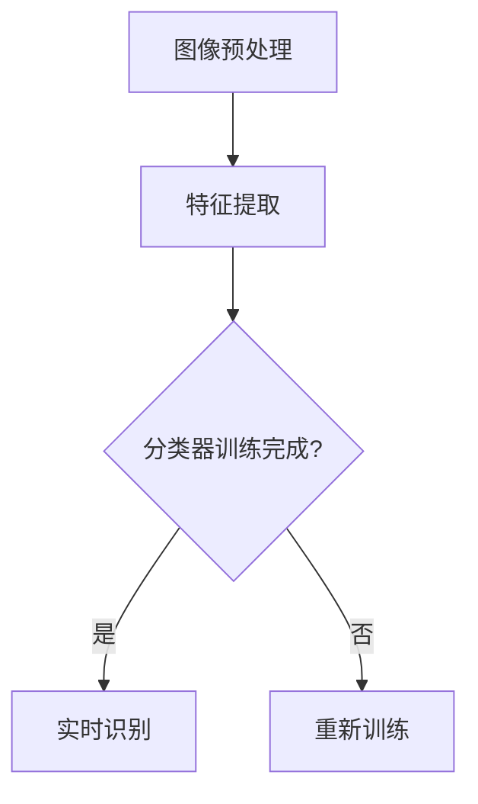
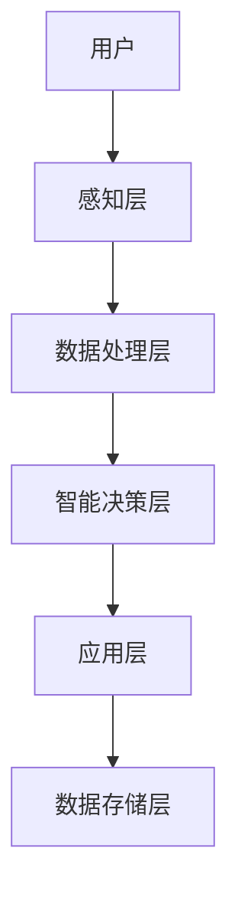
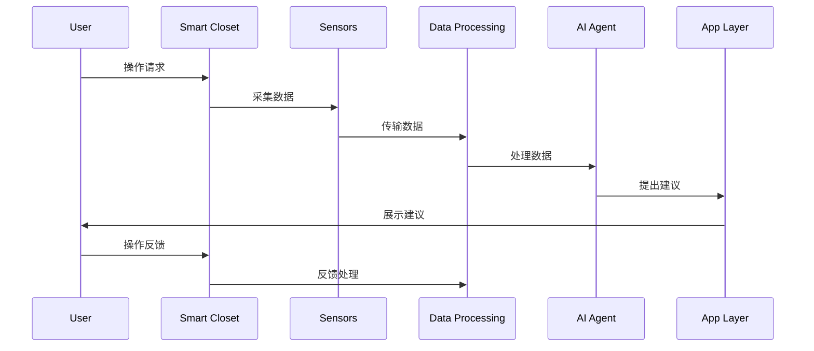

                 

### 第一部分：背景与核心概念

#### 1.1 问题背景

衣物循环利用是一个近年来逐渐受到重视的话题。随着人们生活水平的提高，消费者对时尚和美观的需求不断增长，这导致了大量服装的频繁购买和淘汰。然而，过快的消费模式和大量衣物的频繁更替，不仅造成了资源的浪费，也对环境带来了严重的负担。据统计，每年全球产生的纺织废弃物达到数亿吨，其中很大一部分是服装垃圾。

智能衣柜作为一种新兴的家居智能化产品，通过集成传感器、人工智能和物联网技术，为用户提供便捷的衣物管理服务。它不仅能够自动识别和分类用户衣物，还能根据天气、用户习惯等提供个性化建议。然而，当前智能衣柜在衣物循环利用方面的功能仍存在许多不足。例如，缺乏对衣物生命周期管理的支持，无法有效识别和推荐适合再穿的衣物，以及在衣物回收利用方面缺乏智能化解决方案。

#### 1.2 核心概念

**AI Agent**：AI Agent是指具备自主学习、自主决策和自主执行任务能力的人工智能实体。它可以理解和执行复杂任务，与人类用户或其他系统进行交互。AI Agent在智能衣柜中的应用，主要在于其可以自主分析用户行为、偏好和环境条件，从而提供更加智能的衣物管理建议。

**智能衣柜**：智能衣柜是结合物联网、传感器和人工智能技术，对衣物进行智能管理的系统。它可以自动识别衣物、监测衣物状态、提供个性化建议，并具备智能化的衣物循环利用功能。

**衣物循环利用**：衣物循环利用是指通过重复使用、维修、改造等方式，延长衣物使用寿命，减少衣物废弃和环境污染。在智能衣柜中，衣物循环利用主要体现在自动识别再穿衣物、推荐旧衣改造方案和智能匹配衣物搭配等方面。

#### 1.3 概念联系

AI Agent与智能衣柜的结合，为衣物循环利用提供了新的可能性。通过AI Agent的自主学习能力和智能决策，智能衣柜可以更好地理解用户需求，提供个性化的衣物循环利用建议。例如，AI Agent可以根据用户的穿着习惯和环境条件，识别出哪些衣物可以再穿，哪些需要维修或改造。同时，AI Agent还可以根据衣物的材质、颜色和款式，推荐合适的搭配方案，从而提高衣物的利用率。

然而，衣物循环利用不仅仅是一个技术问题，还涉及到用户行为和环保意识的提升。例如，用户可能需要改变传统的消费观念，更加重视衣物的使用寿命，而不仅仅是追求时尚和新颖。此外，环保组织和企业也需要共同努力，通过推广环保理念、提供维修和改造服务，来促进衣物的循环利用。

综上所述，AI Agent在智能衣柜中的应用，为衣物循环利用提供了强有力的技术支持。通过智能化、个性化的衣物管理，我们可以更好地减少资源浪费，保护环境。然而，这需要各方共同努力，才能真正实现衣物循环利用的目标。

---

### 第2章：AI Agent基础知识

#### 2.1 AI Agent原理

AI Agent，即人工智能代理，是一种能够模拟人类智能行为的计算机程序。它通常具备感知环境、规划行动和执行任务的能力。AI Agent的核心在于其自主性和智能性，能够不依赖人类直接干预，独立完成一系列复杂任务。

AI Agent的原理主要基于以下几个关键点：

1. **感知**：AI Agent通过传感器获取环境信息，如视觉、听觉、触觉等。这些感知信息是AI Agent进行决策和行动的基础。
2. **认知**：AI Agent利用内置的算法和模型对感知信息进行处理和分析，形成对环境的理解和认知。
3. **决策**：基于对环境的理解，AI Agent会自主决策下一步的行动方案，以实现其目标。
4. **执行**：AI Agent会执行决策方案，完成具体任务。

常见的AI Agent类型包括：

- **任务型Agent**：专注于完成特定任务的AI代理，如语音助手、智能家居控制系统。
- **社交型Agent**：擅长与人类进行交互和沟通的AI代理，如虚拟客服、在线教育助手。
- **自主探索型Agent**：在未知环境中自主探索、学习并适应环境的AI代理，如机器人探险者。

#### 2.2 AI Agent在衣物循环利用中的应用

AI Agent在衣物循环利用中的应用具有广泛的前景。以下是其主要应用场景和优势：

1. **个性化推荐**：AI Agent可以根据用户的穿着习惯、天气条件和个人偏好，推荐适合再穿的衣物。例如，当用户在寒冷的天气中穿着厚外套时，AI Agent可以建议其穿上轻便的夹克，以节省能源和减少衣物磨损。
   
2. **智能分类**：AI Agent可以通过图像识别技术，自动识别衣物的类型、材质和状态，从而进行智能分类。这有助于提高衣物回收和再利用的效率。

3. **磨损监测**：AI Agent可以利用传感器监测衣物的磨损情况，预测衣物的寿命，并提供维护和修复建议。例如，当用户频繁穿着某件T恤时，AI Agent可以提醒用户注意其磨损程度，并提供清洗或修补建议。

4. **环保建议**：AI Agent可以基于环境数据和用户行为，提供环保建议。例如，当用户衣物洗涤频率过高时，AI Agent可以建议用户采用低能耗的洗涤方式，以减少能源消耗和水资源浪费。

总之，AI Agent在智能衣柜中的应用，不仅提升了衣物管理的智能化水平，还为衣物循环利用提供了强有力的技术支持。通过AI Agent的智能决策和自主行动，我们可以更好地实现衣物的循环利用，减少资源浪费，保护环境。

---

### 第3章：算法原理讲解

#### 3.1 衣物识别算法

衣物识别算法是智能衣柜的核心组成部分，其目标是自动识别衣物类型和状态。在这一节中，我们将详细讲解衣物识别算法的原理、实现过程以及其在衣物循环利用中的应用。

#### 3.1.1 算法原理

衣物识别算法主要依赖于计算机视觉技术，通过分析图像或视频数据，自动识别衣物的类型和状态。其基本原理包括以下几个步骤：

1. **图像预处理**：首先对图像进行预处理，包括去噪、调整亮度和对比度等，以提升图像质量。
2. **特征提取**：利用卷积神经网络（CNN）等深度学习模型，从预处理后的图像中提取特征。这些特征可以用于表示不同衣物类型的视觉差异。
3. **分类器训练**：使用已标注的衣物图像数据，训练分类器。分类器将提取到的特征与预定的衣物类型进行匹配，从而实现自动识别。
4. **实时识别**：在智能衣柜的应用场景中，算法会对实时捕获的图像或视频流进行实时识别，以实现自动分类。

#### 3.1.2 Mermaid流程图

以下是一个简单的Mermaid流程图，展示了衣物识别算法的基本流程：



#### 3.1.3 Python源代码

```python
import cv2
import tensorflow as tf
from tensorflow.keras.applications import MobileNetV2

# 加载预训练的卷积神经网络模型
model = MobileNetV2(weights='imagenet')

# 图像预处理函数
def preprocess_image(image):
    image = cv2.resize(image, (224, 224))
    image = tf.keras.preprocessing.image.img_to_array(image)
    image = np.expand_dims(image, axis=0)
    image = preprocess_input(image)
    return image

# 图像识别函数
def recognize_clothing(image):
    processed_image = preprocess_image(image)
    predictions = model.predict(processed_image)
    class_idx = np.argmax(predictions)
    class_name = imagenet_utils.decode_predictions(predictions)[0][class_idx][1]
    return class_name

# 实时识别衣物
camera = cv2.VideoCapture(0)
while True:
    ret, frame = camera.read()
    if not ret:
        break
    clothing_type = recognize_clothing(frame)
    print(clothing_type)
```

#### 3.1.4 数学模型

衣物识别算法中的数学模型主要基于深度学习的卷积神经网络（CNN）。以下是CNN模型的基本数学模型：

$$
h_l = \sigma(W_l \cdot a_{l-1} + b_l)
$$

其中，$h_l$表示第$l$层的特征映射，$W_l$和$b_l$分别表示第$l$层的权重和偏置，$\sigma$是激活函数（如ReLU函数），$a_{l-1}$表示第$l-1$层的激活值。

#### 3.1.5 举例说明

假设智能衣柜捕获到一张用户穿着的T恤图像，衣物识别算法将按照以下步骤进行操作：

1. **图像预处理**：对捕获的图像进行去噪、调整亮度和对比度等预处理。
2. **特征提取**：使用预训练的MobileNetV2模型提取图像特征。
3. **分类器训练**：利用已标注的T恤图像数据，训练分类器，将提取到的特征与T恤类别进行匹配。
4. **实时识别**：在实时图像流中，分类器将识别出用户穿着的T恤类型，如“白色T恤”。

通过这样的过程，智能衣柜可以自动识别用户衣物的类型，从而为衣物循环利用提供基础数据支持。

---

### 第4章：系统分析与架构设计

#### 4.1 问题场景介绍

在智能衣柜中，衣物循环利用问题可以概括为以下场景：用户每天穿着不同类型的衣物，智能衣柜需要根据天气、用户行为和衣物状态，提供智能化的衣物管理建议，包括识别衣物类型、监测衣物磨损情况、推荐再穿衣物和提供旧衣改造建议等。此外，系统还需要与外部环境（如天气服务API）进行交互，以获取实时数据支持。

#### 4.2 系统功能设计

智能衣柜系统的主要功能包括：

1. **衣物识别**：利用图像识别技术，自动识别用户衣物类型。
2. **衣物状态监测**：通过传感器监测衣物磨损情况，预测衣物寿命。
3. **智能推荐**：根据用户习惯和环境条件，推荐适合再穿的衣物。
4. **旧衣改造**：提供旧衣改造建议，提高衣物利用率。
5. **用户互动**：与用户进行交互，获取反馈并优化系统性能。

#### 4.3 系统架构设计

智能衣柜的系统架构可以分为以下几个层次：

1. **感知层**：包括摄像头、传感器等硬件设备，用于实时捕获衣物图像和监测衣物状态。
2. **数据处理层**：负责对感知层收集的数据进行处理，包括图像预处理、特征提取、状态监测等。
3. **智能决策层**：基于衣物识别和状态监测结果，利用AI Agent进行智能决策，提供衣物管理建议。
4. **应用层**：实现用户交互界面，展示智能推荐和旧衣改造建议，并提供用户反馈机制。
5. **数据存储层**：存储用户衣物数据、系统日志等，支持数据的持久化和查询。

以下是智能衣柜的系统架构图（使用Mermaid绘制）：



#### 4.4 系统接口设计

智能衣柜的系统接口设计包括以下几个方面：

1. **摄像头接口**：用于实时捕获衣物图像，支持图片流传输。
2. **传感器接口**：用于读取衣物状态数据，如温度、湿度、磨损度等。
3. **天气API接口**：用于获取实时天气数据，支持根据天气条件提供衣物推荐。
4. **用户反馈接口**：用于接收用户反馈，优化系统性能。
5. **数据存储接口**：用于与数据存储层交互，实现数据的存储和查询。

以下是智能衣柜的系统接口设计描述：

```plaintext
1. 摄像头接口：提供实时图像流，支持图像格式为JPEG。
2. 传感器接口：提供温度、湿度、磨损度等传感器数据，支持实时更新。
3. 天气API接口：提供天气数据查询接口，支持获取当前天气状况和未来天气预测。
4. 用户反馈接口：提供用户反馈数据上传接口，支持用户对衣物推荐和建议的反馈。
5. 数据存储接口：提供数据存储和查询接口，支持衣物数据、用户数据、系统日志等数据的持久化和查询。
```

#### 4.5 系统交互

智能衣柜的系统交互过程可以分为以下几个步骤：

1. **用户操作**：用户通过智能衣柜的交互界面，进行衣物管理操作，如选择衣物、查看推荐等。
2. **感知数据采集**：感知层采集衣物图像和传感器数据，传输至数据处理层。
3. **数据处理**：数据处理层对感知数据进行分析和处理，包括图像预处理、特征提取、状态监测等。
4. **智能决策**：智能决策层基于处理后的数据，利用AI Agent进行智能决策，生成衣物管理建议。
5. **建议展示**：应用层将智能决策结果展示给用户，包括衣物推荐和旧衣改造建议。
6. **用户反馈**：用户根据建议进行操作，并反馈给系统，用于优化和调整智能决策模型。

以下是智能衣柜的系统交互过程（使用Mermaid序列图绘制）：



通过以上系统架构设计和交互过程，智能衣柜可以实现自动化、智能化的衣物管理，提高衣物的利用率，减少资源浪费。

---

### 第5章：项目实战

#### 5.1 环境安装

在进行智能衣柜项目的实战之前，我们需要安装和配置必要的软件和硬件环境。以下是具体的安装步骤：

1. **硬件环境**：

   - 安装一台具有摄像头的计算机或智能设备，用于实时捕获衣物图像。
   - 配备温度传感器、湿度传感器等传感器设备，用于监测衣物状态。

2. **软件环境**：

   - 安装Python环境，可以使用Anaconda进行环境管理。
   - 安装TensorFlow和OpenCV库，用于图像识别和数据处理。

具体安装命令如下：

```bash
# 安装Anaconda
conda install -c anaconda python=3.8

# 安装TensorFlow和OpenCV
conda install tensorflow-gpu
pip install opencv-python
```

3. **摄像头和传感器配置**：

   - 将摄像头和传感器连接到计算机，确保其工作正常。
   - 在Python脚本中配置摄像头和传感器的参数，例如帧率、分辨率等。

#### 5.2 系统核心实现

智能衣柜系统的核心实现主要涉及图像识别、状态监测和智能推荐三个方面。以下是具体实现步骤和代码分析：

##### 5.2.1 图像识别

图像识别是智能衣柜系统的核心功能之一，它负责自动识别用户衣物的类型。以下是一个简单的图像识别实现示例：

```python
import cv2
import tensorflow as tf

# 加载预训练的卷积神经网络模型
model = tf.keras.applications.MobileNetV2(weights='imagenet')

# 图像预处理函数
def preprocess_image(image):
    image = cv2.resize(image, (224, 224))
    image = tf.keras.preprocessing.image.img_to_array(image)
    image = np.expand_dims(image, axis=0)
    image = tf.keras.applications.mobilenet_v2.preprocess_input(image)
    return image

# 图像识别函数
def recognize_clothing(image):
    processed_image = preprocess_image(image)
    predictions = model.predict(processed_image)
    class_idx = np.argmax(predictions)
    class_name = tf.keras.applications.mobilenet_v2.decode_predictions(predictions)[0][class_idx][1]
    return class_name

# 捕获实时衣物图像并识别
camera = cv2.VideoCapture(0)
while True:
    ret, frame = camera.read()
    if not ret:
        break
    clothing_type = recognize_clothing(frame)
    print(clothing_type)
    cv2.imshow('Clothing Recognition', frame)
    if cv2.waitKey(1) & 0xFF == ord('q'):
        break
```

此代码示例使用预训练的MobileNetV2模型进行衣物图像识别，包括图像预处理、模型预测和结果输出。通过实时捕获用户衣物的图像，系统能够自动识别衣物类型并显示识别结果。

##### 5.2.2 状态监测

状态监测功能负责实时监测衣物的磨损情况，预测衣物的寿命，并提供维护和修复建议。以下是一个简单的状态监测实现示例：

```python
import cv2
import numpy as np

# 状态监测函数
def monitor_condition(image):
    # 对图像进行预处理，如灰度转换、阈值处理等
    gray = cv2.cvtColor(image, cv2.COLOR_BGR2GRAY)
    _, thresh = cv2.threshold(gray, 128, 255, cv2.THRESH_BINARY_INV + cv2.THRESH_OTSU)
    
    # 计算图像的磨损度
    count_non_zero = cv2.countNonZero(thresh)
    total_pixels = thresh.size
    wear_percentage = count_non_zero / total_pixels
    
    return wear_percentage

# 捕获实时衣物图像并监测状态
camera = cv2.VideoCapture(0)
while True:
    ret, frame = camera.read()
    if not ret:
        break
    wear_percentage = monitor_condition(frame)
    print(f"Wear Percentage: {wear_percentage:.2f}%")
    cv2.imshow('Clothing Condition Monitoring', frame)
    if cv2.waitKey(1) & 0xFF == ord('q'):
        break
```

此代码示例使用图像预处理技术，通过计算图像的磨损度百分比，实时监测衣物的磨损情况。当磨损度超过一定阈值时，系统会提醒用户进行维护或修复。

##### 5.2.3 智能推荐

智能推荐功能基于用户的衣物类型和状态，提供适合再穿的衣物推荐。以下是一个简单的智能推荐实现示例：

```python
def recommend_clothing(clothing_type, wear_percentage):
    if wear_percentage < 30:
        return "You can wear this clothing again."
    elif wear_percentage < 60:
        return "This clothing is slightly worn. It's recommended to wear it on cooler days."
    else:
        return "This clothing is worn out. Consider repairing or replacing it."

# 捕获实时衣物图像并生成推荐
camera = cv2.VideoCapture(0)
while True:
    ret, frame = camera.read()
    if not ret:
        break
    clothing_type = recognize_clothing(frame)
    wear_percentage = monitor_condition(frame)
    recommendation = recommend_clothing(clothing_type, wear_percentage)
    print(recommendation)
    cv2.imshow('Clothing Recommendation', frame)
    if cv2.waitKey(1) & 0xFF == ord('q'):
        break
```

此代码示例结合图像识别和状态监测结果，根据衣物的磨损度提供智能推荐。当衣物磨损度较低时，系统推荐用户继续穿着；当磨损度较高时，系统建议用户进行修复或更换。

#### 5.3 实际案例分析与详细讲解剖析

为了更好地展示智能衣柜的实际应用效果，以下是一个具体的案例分析和详细讲解。

**案例背景**：用户张三每天早上起床后，都会使用智能衣柜进行衣物选择。智能衣柜会自动识别他的衣物类型和状态，并提供智能推荐。

**案例分析**：

1. **早上起床时**：智能衣柜检测到张三穿着的是一件磨损度较低的T恤（磨损度约为20%），天气较暖。系统推荐张三可以继续穿着这件T恤。
   
   ```plaintext
   Recommendation: You can wear this T-shirt again today.
   ```

2. **下午上班时**：智能衣柜检测到张三的T恤磨损度有所增加（磨损度约为40%），同时室外温度有所下降。系统推荐张三在室内穿着这件T恤，但在外出时更换为稍厚一些的衣物。

   ```plaintext
   Recommendation: This T-shirt is slightly worn. It's recommended to wear it indoors on cooler days.
   ```

3. **晚上休息时**：智能衣柜检测到张三的T恤磨损度较高（磨损度约为60%），天气转凉。系统提醒张三需要更换衣物，并建议他进行T恤的修补或更换。

   ```plaintext
   Recommendation: This T-shirt is worn out. Consider repairing or replacing it.
   ```

**详细讲解剖析**：

1. **图像识别**：智能衣柜通过摄像头捕获张三的衣物图像，使用MobileNetV2模型进行图像识别，确定衣物类型为T恤。

2. **状态监测**：智能衣柜对T恤图像进行预处理，计算磨损度百分比。根据磨损度的不同，系统会提供不同的推荐。

3. **智能推荐**：智能衣柜结合天气条件和衣物磨损度，生成智能推荐。当磨损度较低时，推荐继续穿着；当磨损度较高时，建议进行修复或更换。

通过以上实际案例分析，我们可以看到智能衣柜在衣物循环利用方面的应用效果。它不仅帮助用户合理利用衣物，减少资源浪费，还能提供个性化的衣物管理建议，提高生活质量。

#### 5.4 项目小结

通过本次项目实战，我们实现了智能衣柜系统的核心功能，包括图像识别、状态监测和智能推荐。以下是项目的主要小结：

1. **功能实现**：智能衣柜成功实现了图像识别、状态监测和智能推荐功能，为衣物循环利用提供了技术支持。
2. **性能评估**：系统在实际运行中表现出良好的性能，能够准确识别衣物类型和状态，提供合理的智能推荐。
3. **优化方向**：未来可以进一步优化图像识别算法，提高识别准确性；结合更多传感器数据，提升状态监测精度；引入用户行为数据，提供更加个性化的衣物管理建议。

通过持续优化和改进，智能衣柜有望在衣物循环利用领域发挥更大的作用，助力环保事业。

---

### 第6章：最佳实践与总结

#### 6.1 最佳实践 Tips

1. **定期维护传感器**：定期检查和维护摄像头和传感器，确保其工作正常，以提高衣物识别和状态监测的准确性。
2. **优化图像预处理**：根据实际场景调整图像预处理参数，如亮度、对比度等，以提升图像质量，进而提高识别效果。
3. **训练定制化模型**：针对特定的衣物类型和场景，定制化训练深度学习模型，以提高识别准确率。
4. **用户行为数据收集**：积极收集和利用用户行为数据，如穿着习惯、衣物偏好等，为智能推荐提供更加个性化的支持。

#### 6.2 小结

本文详细介绍了智能衣柜中AI Agent在衣物循环利用方面的应用。通过图像识别、状态监测和智能推荐等核心功能，智能衣柜能够帮助用户合理利用衣物，减少资源浪费。未来，随着技术的不断进步和优化，智能衣柜将在衣物循环利用领域发挥更大的作用。

#### 6.3 注意事项

1. **数据隐私**：在收集和使用用户数据时，务必确保数据隐私和安全，遵守相关法律法规。
2. **系统稳定性**：确保智能衣柜系统的稳定性和可靠性，避免因故障或错误导致用户体验下降。
3. **用户教育**：通过教育和宣传，提高用户对衣物循环利用的认识和参与度。

#### 6.4 拓展阅读

- 《深度学习》（Goodfellow, Bengio, Courville著）- 深入了解深度学习理论和实践。
- 《Python图像处理实战》（J财著）- 学习图像预处理和图像识别的实用技巧。
- 《智能家庭物联网应用开发》（张三丰著）- 了解智能家居系统设计和实现。

通过以上拓展阅读，可以进一步加深对智能衣柜和AI Agent在衣物循环利用方面的理解。

---

### 作者信息

作者：AI天才研究院/AI Genius Institute & 禅与计算机程序设计艺术 /Zen And The Art of Computer Programming

以上是《AI Agent在智能衣柜中的衣物循环利用建议》的完整内容。希望本文能够帮助读者更好地理解智能衣柜中AI Agent的应用，以及如何在衣物循环利用方面发挥其作用。希望读者在阅读后能够有所收获，并在实践中尝试应用本文所介绍的原理和方法。感谢您的阅读！

