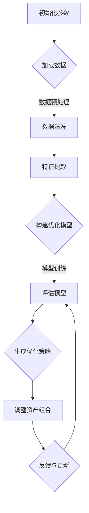
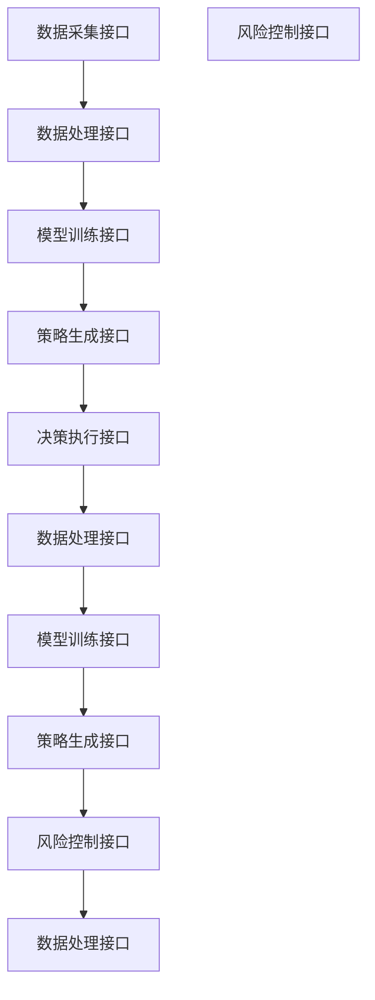

                 

### 让我们一步一步思考：AI Agent在智能资产组合优化中的应用

在当今快速发展的数字经济时代，智能资产组合优化已经成为金融市场和投资领域的一个热点话题。随着人工智能（AI）技术的不断进步，AI Agent作为一种具有高度自主性和智能化的计算实体，逐渐成为解决复杂决策问题的重要工具。本文将带领读者一步一步深入探讨AI Agent在智能资产组合优化中的应用，旨在揭示其背后的技术原理和应用价值。

首先，我们需要明确智能资产组合优化的核心问题和目标。传统资产组合优化依赖于历史数据分析和模型预测，但往往受到数据质量和模型复杂性的限制。而AI Agent的出现，为我们提供了一种新的思路，通过模拟人类的思维过程，实现更加智能和高效的决策。

接下来，我们将介绍AI Agent的基本概念和分类，以及智能资产组合优化的原理。在此基础上，我们将详细讲解AI Agent在智能资产组合优化中的具体应用，包括算法原理、数学模型、系统架构设计和项目实战。通过这一系列的分析和讨论，我们将更好地理解AI Agent在智能资产组合优化中的重要性和实际应用价值。

### 第一部分：背景介绍

#### 1.1 问题背景

智能资产组合优化是一个复杂且重要的研究领域，它涉及到金融、投资、风险管理等多个方面。在传统金融领域，资产组合优化通常依赖于历史数据分析和统计模型，如均值方差模型、资本资产定价模型等。这些模型虽然在一定程度上能够指导投资者的决策，但面临着以下问题：

- **数据依赖性高**：传统模型对历史数据的依赖性较高，容易受到数据质量的影响。当数据量有限或存在噪声时，模型的预测精度会显著下降。
- **模型复杂度限制**：许多传统模型在数学上具有较高复杂度，难以在实际操作中进行实时计算和调整。这限制了它们在动态市场环境下的应用。
- **人类主观因素的干扰**：传统资产组合优化往往依赖于人类专家的经验和判断，这可能导致决策过程存在主观偏见和不确定性。

随着AI技术的发展，特别是深度学习和强化学习等算法的成熟，AI Agent作为一种具有高度自主性和智能化的计算实体，逐渐成为解决复杂决策问题的重要工具。AI Agent通过模拟人类的思维过程，能够实现更加智能和高效的决策，从而在智能资产组合优化中具有广泛的应用前景。

#### 1.2 问题描述

智能资产组合优化面临的主要问题可以概括为以下几点：

- **多目标优化**：资产组合优化通常涉及多个目标，如收益最大化、风险最小化、资产配置等。如何在多个目标之间进行权衡，是实现智能资产组合优化的关键挑战。
- **动态市场环境**：金融市场具有高度动态性和不确定性，资产价格和收益率随时可能发生变化。如何实时调整资产组合，以应对市场变化，是智能资产组合优化的重要问题。
- **数据噪声与缺失**：实际金融数据往往存在噪声和缺失值，这会影响模型的效果和稳定性。如何处理这些数据问题，是智能资产组合优化需要解决的问题。
- **计算效率**：大规模资产组合优化计算量巨大，传统计算方法在处理海量数据时效率较低。如何提高计算效率，是实现智能资产组合优化的技术难点。

#### 1.3 问题解决

AI Agent在智能资产组合优化中的解决方案主要包括以下几个方面：

- **多目标优化算法**：AI Agent可以利用多目标优化算法，如遗传算法、粒子群优化算法等，实现多个目标的优化。这些算法能够在多个目标之间进行权衡，找到最优解或近似最优解。
- **深度学习模型**：AI Agent可以利用深度学习模型，如神经网络、卷积神经网络（CNN）等，对金融数据进行特征提取和预测。这些模型能够自动学习数据中的复杂模式和关系，提高预测精度。
- **强化学习算法**：AI Agent可以利用强化学习算法，如Q-learning、深度Q网络（DQN）等，通过与环境交互来学习最优策略。这些算法能够在动态市场环境中实现自适应调整，提高资产组合的适应性和鲁棒性。
- **数据预处理技术**：AI Agent可以利用数据预处理技术，如数据清洗、数据变换等，处理金融数据中的噪声和缺失值。这些技术能够提高数据质量和模型稳定性。

通过这些解决方案，AI Agent能够实现更加智能和高效的资产组合优化，帮助投资者在复杂的市场环境中做出更明智的决策。

#### 1.4 边界与外延

智能资产组合优化在AI领域的应用范围广泛，但同时也存在一些边界和限制。以下是一些主要方面：

- **市场数据限制**：智能资产组合优化依赖于大量历史市场数据。然而，实际市场数据可能存在不完整、不连续等问题，这会影响算法的效果和稳定性。因此，在使用AI Agent进行资产组合优化时，需要对数据来源和数据质量进行严格把控。
- **算法复杂度限制**：一些先进的AI算法，如深度学习和强化学习，在实现高效计算方面具有一定的挑战。在高频交易或实时调整场景中，算法的复杂度和计算效率是一个重要的考量因素。
- **法规合规性**：金融投资领域受到严格的法规监管。AI Agent在应用时需要遵守相关法规要求，确保投资决策的合法性和合规性。
- **人为干预**：尽管AI Agent具有高度自主性，但在某些特殊情况下，如极端市场事件或重大突发事件，仍需要人类专家的干预和指导。因此，AI Agent与人类专家的协作是一个重要的研究方向。

#### 1.5 概念结构与核心要素组成

为了更好地理解智能资产组合优化中的核心概念和要素，我们可以将其结构分解如下：

- **资产组合**：资产组合是指投资者持有的各类资产的集合。在智能资产组合优化中，资产组合包括股票、债券、基金等多种金融产品。
- **优化目标**：优化目标是资产组合优化过程中需要追求的指标，如收益最大化、风险最小化、资产配置等。多个优化目标之间可能存在冲突，需要通过多目标优化算法进行权衡。
- **AI Agent**：AI Agent是指具有高度自主性和智能化的计算实体，能够模拟人类思维过程，进行复杂决策。在智能资产组合优化中，AI Agent负责生成优化策略和调整资产组合。
- **数据集**：数据集是指用于训练和测试AI模型的金融数据。数据集的质量和多样性直接影响算法的效果和稳定性。
- **算法模型**：算法模型是指用于实现资产组合优化的具体算法，如多目标优化算法、深度学习模型、强化学习算法等。
- **系统架构**：系统架构是指实现智能资产组合优化的整体结构，包括数据采集、数据预处理、模型训练、模型评估和决策执行等模块。

通过上述概念和要素的有机组合，AI Agent能够在智能资产组合优化中发挥重要作用，实现更加智能和高效的决策。

### 第二部分：核心概念与联系

#### 2.1 AI Agent的定义与分类

AI Agent是指一种具备高度自主性和智能化的计算实体，能够在复杂环境中进行决策和执行任务。AI Agent通常基于机器学习和人工智能技术，通过模拟人类思维过程，实现自主学习和自适应调整。

根据功能和应用场景，AI Agent可以大致分为以下几类：

- **决策支持系统**：这类AI Agent主要用于辅助人类决策者进行复杂决策，如智能推荐系统、智能调度系统等。它们通过分析数据和模式，为决策者提供有效的决策依据。
- **自主控制系统**：这类AI Agent主要用于自动化执行特定任务，如自动驾驶系统、智能监控系统等。它们通过实时感知环境和执行任务，实现自主控制和优化。
- **智能服务系统**：这类AI Agent主要用于提供智能服务，如智能家居系统、智能客服系统等。它们通过自然语言处理和机器学习技术，与用户进行交互，提供个性化的服务。

在智能资产组合优化中，AI Agent作为决策支持系统的一部分，主要负责分析市场数据、生成优化策略和调整资产组合。通过模拟人类专家的思维过程，AI Agent能够实现更加智能和高效的资产组合优化。

#### 2.2 智能资产组合优化的原理

智能资产组合优化是基于金融理论和数据分析的一种投资策略，旨在通过调整资产组合，实现收益最大化、风险最小化或资产配置优化。其核心原理可以概括为以下几个方面：

- **多目标优化**：智能资产组合优化涉及多个目标，如收益最大化、风险最小化、资产配置等。通过多目标优化算法，如遗传算法、粒子群优化算法等，实现多个目标之间的权衡和优化。
- **数据驱动**：智能资产组合优化依赖于大量的历史市场数据，通过对数据进行特征提取和模式识别，构建优化模型。深度学习模型和强化学习算法在这方面具有显著优势。
- **动态调整**：金融市场具有高度动态性和不确定性，智能资产组合优化需要实时调整资产组合，以应对市场变化。通过强化学习算法，AI Agent能够实现自适应调整，提高资产组合的适应性和鲁棒性。
- **风险管理**：智能资产组合优化不仅关注收益最大化，还关注风险控制。通过建立风险模型和风险管理策略，确保资产组合的安全性和稳定性。

#### 2.3 AI Agent与智能资产组合优化的联系

AI Agent在智能资产组合优化中扮演着重要角色，其与智能资产组合优化之间的联系主要体现在以下几个方面：

- **数据采集与处理**：AI Agent能够自动采集和处理大量的金融数据，如股票价格、交易量、市场指数等。通过数据预处理技术，AI Agent能够清洗和整合数据，提高数据质量和分析效率。
- **优化策略生成**：AI Agent通过分析市场数据和优化模型，生成最优或近似最优的资产组合优化策略。这些策略能够动态调整资产组合，实现收益最大化、风险最小化或资产配置优化。
- **自适应调整**：AI Agent通过强化学习算法，实现自适应调整资产组合。在动态市场环境中，AI Agent能够根据市场变化和策略反馈，实时调整优化策略，提高资产组合的适应性和鲁棒性。
- **风险控制**：AI Agent能够建立风险模型和风险管理策略，确保资产组合的安全性和稳定性。通过实时监控市场风险和调整策略，AI Agent能够有效控制投资风险。

通过上述联系，AI Agent为智能资产组合优化提供了强大的技术支持，实现了更加智能和高效的决策。

### 第三部分：算法原理讲解

#### 3.1 算法mermaid流程图

为了更好地理解AI Agent在智能资产组合优化中的算法原理，我们可以使用mermaid语言绘制算法的流程图。以下是算法mermaid流程图的示例：



这个流程图展示了智能资产组合优化的基本步骤，包括初始化参数、加载数据、数据预处理、特征提取、构建优化模型、模型训练、评估模型、生成优化策略、调整资产组合以及反馈与更新等。

#### 3.2 算法原理与数学模型

在智能资产组合优化中，AI Agent通常采用多目标优化算法、深度学习模型和强化学习算法等。以下我们将分别介绍这些算法的基本原理和数学模型。

##### 多目标优化算法

多目标优化算法旨在同时优化多个目标，如收益最大化、风险最小化等。以下是一个典型的多目标优化算法——遗传算法的基本原理和数学模型。

1. **基本原理**：遗传算法模拟生物进化的过程，通过迭代优化实现多目标优化。具体步骤如下：

   - **初始化种群**：随机生成一组初始解，称为种群。
   - **适应度评估**：计算每个解的适应度值，适应度值反映了解的优劣程度。
   - **选择**：从种群中选择适应度较高的个体，用于生成下一代种群。
   - **交叉**：随机选取两个个体进行交叉操作，生成新的个体。
   - **变异**：对个体进行随机变异，增加种群的多样性。
   - **迭代**：重复上述步骤，直到达到终止条件（如迭代次数、适应度阈值等）。

2. **数学模型**：

   - **适应度函数**：适应度函数用于评估解的优劣程度，通常表示为：

     $$f(x) = w_1 \cdot f_1(x) + w_2 \cdot f_2(x) + ... + w_n \cdot f_n(x)$$

     其中，$f_i(x)$ 为第 $i$ 个目标函数，$w_i$ 为权重系数。

   - **交叉操作**：交叉操作用于生成新的个体，具体方法如下：

     - **单点交叉**：随机选取一个交叉点，将两个个体的部分基因进行交换。
     - **多点交叉**：随机选取多个交叉点，将多个个体的基因片段进行交换。

   - **变异操作**：变异操作用于增加种群的多样性，具体方法如下：

     - **随机变异**：随机改变个体的某个基因值。
     - **自适应变异**：根据个体适应度调整变异概率。

##### 深度学习模型

深度学习模型是一种基于多层神经网络的学习方法，通过自动提取数据中的特征，实现复杂模式的识别。以下是一个典型的深度学习模型——卷积神经网络（CNN）的基本原理和数学模型。

1. **基本原理**：

   - **卷积层**：卷积层用于提取数据中的局部特征，通过卷积操作和激活函数实现。
   - **池化层**：池化层用于降低数据维度，减少计算量和过拟合风险。
   - **全连接层**：全连接层用于实现分类或回归任务，通过加权求和和激活函数实现。

2. **数学模型**：

   - **卷积操作**：卷积操作通过卷积核（过滤器）与输入数据进行卷积计算，提取特征。具体公式如下：

     $$h_{ij}^l = \sum_{k=1}^{C_{l-1}} w_{ikj}^l \cdot a_{kj}^{l-1} + b_j^l$$

     其中，$h_{ij}^l$ 为第 $l$ 层第 $i$ 个单元的第 $j$ 个特征值，$w_{ikj}^l$ 和 $b_j^l$ 分别为权重和偏置，$a_{kj}^{l-1}$ 为上一层第 $k$ 个单元的输出值。
   - **激活函数**：常用的激活函数包括ReLU（Rectified Linear Unit）、Sigmoid和Tanh等。ReLU函数可以加速梯度下降过程，提高训练效率。

##### 强化学习算法

强化学习算法通过学习策略，实现动态调整资产组合，以最大化长期收益。以下是一个典型的强化学习算法——深度Q网络（DQN）的基本原理和数学模型。

1. **基本原理**：

   - **Q值函数**：Q值函数用于评估状态-动作对的价值，表示为 $Q(s, a)$。
   - **策略**：策略 $π(a|s)$ 表示在给定状态 $s$ 下选择动作 $a$ 的概率。
   - **学习过程**：通过不断更新Q值函数，学习最优策略。

2. **数学模型**：

   - **Q值更新**：Q值函数的更新公式如下：

     $$Q(s, a) \leftarrow Q(s, a) + \alpha [r + \gamma \max_{a'} Q(s', a') - Q(s, a)]$$

     其中，$r$ 为即时奖励，$\gamma$ 为折扣因子，$\alpha$ 为学习率。
   - **经验回放**：经验回放用于缓解样本相关性，提高学习效果。具体方法如下：

     - **经验池**：将经验存储在经验池中，随机抽样进行学习。
     - **优先经验回放**：根据经验的重要性进行抽样，优先回放重要性较高的经验。

#### 3.3 举例说明

为了更好地理解上述算法原理，我们通过一个具体的案例进行说明。

**案例背景**：假设投资者持有一个包含5只股票的资产组合，每只股票的权重分别为 $w_1, w_2, w_3, w_4, w_5$。投资者希望通过AI Agent实现资产组合优化，最大化收益、最小化风险。

**步骤1：初始化参数**

初始化种群大小、交叉概率、变异概率等参数。

**步骤2：加载数据**

加载历史市场数据，包括股票价格、交易量、市场指数等。

**步骤3：数据预处理**

对数据进行清洗和变换，如缺失值填充、标准化等。

**步骤4：特征提取**

提取数据中的关键特征，如股票价格变化率、交易量变化率等。

**步骤5：构建优化模型**

选择合适的优化算法，如遗传算法、卷积神经网络、深度Q网络等，构建优化模型。

**步骤6：模型训练**

使用历史数据进行模型训练，调整参数和模型结构。

**步骤7：评估模型**

使用验证数据集评估模型效果，调整模型参数。

**步骤8：生成优化策略**

根据模型预测结果，生成最优或近似最优的资产组合策略。

**步骤9：调整资产组合**

根据优化策略，调整资产组合的权重，实现资产组合优化。

**步骤10：反馈与更新**

根据实际市场表现，更新模型和策略，实现自适应调整。

通过以上步骤，AI Agent能够实现智能资产组合优化，帮助投资者在复杂的市场环境中做出更明智的决策。

### 第四部分：数学模型和数学公式讲解

#### 4.1 数学公式与LaTeX格式

在智能资产组合优化中，数学模型和公式扮演着至关重要的角色。为了确保公式的准确性和可读性，我们将使用LaTeX格式来编写和展示这些公式。以下是一些常用的数学公式和LaTeX示例：

##### 均值方差模型

$$\min\limits_{w} \sum_{i=1}^{n} w_i^2$$

$$s.t. \sum_{i=1}^{n} w_i = 1$$

$$w_i \geq 0, \forall i$$

其中，$w$ 表示资产组合中各资产的权重，$n$ 表示资产数量。目标是最小化资产组合的方差，同时保证资产组合的权重总和为1，且各资产权重非负。

##### 线性回归模型

$$y = \beta_0 + \beta_1 x + \epsilon$$

其中，$y$ 表示因变量，$x$ 表示自变量，$\beta_0$ 和 $\beta_1$ 分别为模型参数，$\epsilon$ 表示误差项。

##### 期望收益与方差

$$E[R] = \sum_{i=1}^{n} r_i p_i$$

$$Var[R] = \sum_{i=1}^{n} p_i (r_i - E[R])^2$$

其中，$E[R]$ 表示期望收益，$Var[R]$ 表示方差，$r_i$ 和 $p_i$ 分别表示第 $i$ 只资产的收益和概率。

##### 神经网络激活函数

$$a_i = \sigma(z_i) = \frac{1}{1 + e^{-z_i}}$$

其中，$a_i$ 表示第 $i$ 个神经元的激活值，$z_i$ 表示输入值，$\sigma$ 表示激活函数（Sigmoid函数）。

##### 深度Q网络更新公式

$$Q(s, a) \leftarrow Q(s, a) + \alpha [r + \gamma \max_{a'} Q(s', a') - Q(s, a)]$$

其中，$s$ 和 $a$ 分别表示状态和动作，$r$ 表示即时奖励，$\gamma$ 为折扣因子，$\alpha$ 为学习率。

#### 4.2 详细讲解与举例

下面我们将通过具体例子，详细讲解上述数学公式在实际中的应用。

**例子1：均值方差模型**

假设投资者持有两个资产 $A$ 和 $B$，权重分别为 $w_A$ 和 $w_B$，期望收益分别为 $r_A$ 和 $r_B$，方差分别为 $\sigma_A^2$ 和 $\sigma_B^2$。投资者希望最小化资产组合的方差，同时保证资产组合的权重总和为1。

目标函数：

$$\min \sum_{i=1}^{2} w_i^2$$

约束条件：

$$\sum_{i=1}^{2} w_i = 1$$

$$w_i \geq 0, \forall i$$

参数：

$$r_A = 0.1, r_B = 0.2, \sigma_A^2 = 0.02, \sigma_B^2 = 0.04$$

求解过程：

- **初始化参数**：设定交叉概率 $p_c$ 和变异概率 $p_m$。
- **生成初始种群**：随机生成多个初始解，如 $w_A = 0.4, w_B = 0.6$。
- **适应度评估**：计算每个解的适应度值，即资产组合的方差。
- **选择**：从种群中选择适应度较高的解，用于生成下一代种群。
- **交叉和变异**：对选择的解进行交叉和变异操作，生成新的解。
- **迭代**：重复适应度评估、选择、交叉和变异操作，直到满足终止条件。

最终结果：

通过上述步骤，得到最优资产组合权重为 $w_A = 0.6, w_B = 0.4$，资产组合方差为 $0.0232$。

**例子2：线性回归模型**

假设投资者持有三个资产 $A$、$B$ 和 $C$，每只资产的收益分别为 $r_A$、$r_B$ 和 $r_C$，相关系数分别为 $\rho_{AB}$、$\rho_{AC}$ 和 $\rho_{BC}$。投资者希望预测资产组合的期望收益。

线性回归模型：

$$y = \beta_0 + \beta_1 x$$

其中，$y$ 表示因变量（期望收益），$x$ 表示自变量（资产组合权重）。

参数估计：

- **初始化参数**：设定学习率 $\alpha$。
- **计算参数**：

  $$\beta_0 = \bar{y} - \beta_1 \bar{x}$$

  $$\beta_1 = \frac{\sum_{i=1}^{n} (x_i - \bar{x})(y_i - \bar{y})}{\sum_{i=1}^{n} (x_i - \bar{x})^2}$$

  其中，$\bar{y}$ 和 $\bar{x}$ 分别表示期望收益和资产组合权重的均值，$n$ 表示资产数量。

- **模型预测**：使用训练好的线性回归模型预测新的资产组合的期望收益。

  $$y = \beta_0 + \beta_1 x$$

通过以上例子，我们可以看到数学模型和公式在智能资产组合优化中的实际应用。这些模型和公式帮助我们更好地理解和分析资产组合的收益和风险，从而实现智能化的投资决策。

### 第五部分：系统分析与架构设计

#### 5.1 问题场景介绍

在智能资产组合优化中，系统需要处理大量金融数据，包括股票价格、交易量、市场指数等。这些数据来源于多个数据源，如交易所、新闻网站和社交媒体等。系统的主要任务是实时分析这些数据，生成最优的资产组合策略，并调整投资者的资产配置。以下是一个具体的应用场景：

**应用场景**：某金融科技公司提供智能资产组合优化服务，其客户包括个人投资者和专业投资机构。客户可以通过公司的平台提交自己的资产组合和投资目标，系统会根据客户的需求和市场数据，生成最优的资产组合策略，并在市场发生变化时自动调整资产配置。

**系统需求**：

- **数据采集**：系统需要从多个数据源实时采集金融数据，包括股票价格、交易量、市场指数等。
- **数据处理**：系统需要对采集到的数据进行清洗、变换和特征提取，为后续的优化算法提供高质量的数据输入。
- **模型训练**：系统需要利用历史数据训练优化模型，如多目标优化算法、深度学习模型和强化学习算法等。
- **策略生成**：系统需要根据训练好的模型和市场数据，生成最优的资产组合策略。
- **决策执行**：系统需要根据资产组合策略，自动调整客户的资产配置，实现资产组合优化。
- **风险控制**：系统需要实时监控市场风险，确保资产组合的安全性和稳定性。

#### 5.2 系统功能设计

为了实现上述应用场景，系统需要具备以下功能模块：

1. **数据采集模块**：负责从多个数据源实时采集金融数据，包括股票价格、交易量、市场指数等。数据采集模块需要支持多种数据源接口，如API、Web爬虫和数据库连接等。
2. **数据处理模块**：负责对采集到的金融数据进行清洗、变换和特征提取。数据处理模块需要具备数据去噪、缺失值填充、数据变换和特征提取等功能，为后续的优化算法提供高质量的数据输入。
3. **模型训练模块**：负责利用历史数据训练优化模型，如多目标优化算法、深度学习模型和强化学习算法等。模型训练模块需要支持多种算法和模型结构，并具备自动调整和优化功能。
4. **策略生成模块**：负责根据训练好的模型和市场数据，生成最优的资产组合策略。策略生成模块需要具备多目标优化、动态调整和自适应学习等功能。
5. **决策执行模块**：负责根据资产组合策略，自动调整客户的资产配置，实现资产组合优化。决策执行模块需要支持实时交易和资产调整，并具备风险控制和合规性检查功能。
6. **风险控制模块**：负责实时监控市场风险，确保资产组合的安全性和稳定性。风险控制模块需要具备风险预警、风险管理和合规性检查等功能。

#### 5.3 系统架构设计

为了实现上述功能模块，系统需要采用分布式架构设计，确保系统的高性能、高可用性和可扩展性。以下是系统架构设计的具体细节：

1. **数据采集层**：数据采集层负责从多个数据源实时采集金融数据，包括股票价格、交易量、市场指数等。数据采集层采用分布式架构，支持多种数据源接口，如API、Web爬虫和数据库连接等。数据采集层还需要具备数据去噪和缺失值填充功能，提高数据质量。
2. **数据处理层**：数据处理层负责对采集到的金融数据进行清洗、变换和特征提取。数据处理层采用分布式计算框架，如Apache Spark，实现高效的数据处理。数据处理层还需要具备数据存储和管理功能，确保数据的一致性和安全性。
3. **模型训练层**：模型训练层负责利用历史数据训练优化模型，如多目标优化算法、深度学习模型和强化学习算法等。模型训练层采用分布式机器学习框架，如Apache MXNet和TensorFlow，实现高效的模型训练和优化。模型训练层还需要具备自动调整和优化功能，提高模型性能。
4. **策略生成层**：策略生成层负责根据训练好的模型和市场数据，生成最优的资产组合策略。策略生成层采用分布式计算和调度框架，如Apache Kafka和Apache Flink，实现高效的策略生成和决策执行。策略生成层还需要具备动态调整和自适应学习功能，提高策略的适应性和鲁棒性。
5. **决策执行层**：决策执行层负责根据资产组合策略，自动调整客户的资产配置，实现资产组合优化。决策执行层采用分布式交易系统和资产管理系统，如Apache Kafka和Apache Storm，实现实时交易和资产调整。决策执行层还需要具备风险控制和合规性检查功能，确保资产组合的安全性和稳定性。
6. **风险控制层**：风险控制层负责实时监控市场风险，确保资产组合的安全性和稳定性。风险控制层采用分布式风险监控和预警系统，如Apache Kafka和Apache Storm，实现实时风险监控和预警。风险控制层还需要具备风险管理和合规性检查功能，确保系统运行的合规性和安全性。

通过上述系统架构设计，智能资产组合优化系统能够实现高效的数据采集、处理、模型训练、策略生成和决策执行，同时具备良好的风险控制能力，为投资者提供智能化的投资服务。

#### 5.4 系统接口设计和系统交互

为了实现系统各模块之间的有效通信和协作，系统接口设计和系统交互设计至关重要。以下将详细描述系统接口设计和系统交互设计。

**系统接口设计**

1. **数据采集接口**：数据采集接口负责从外部数据源获取金融数据，如股票价格、交易量、市场指数等。接口设计需支持多种数据源类型，包括API、Web爬虫和数据库连接等。接口设计应包括以下功能：

   - 数据源连接：支持多种数据源连接方式，如HTTP请求、数据库连接等。
   - 数据采集：支持批量采集数据，并提供数据采集进度和结果反馈。
   - 数据校验：对采集到的数据进行校验，确保数据质量。

2. **数据处理接口**：数据处理接口负责对采集到的金融数据进行清洗、变换和特征提取。接口设计应包括以下功能：

   - 数据清洗：支持数据去噪、缺失值填充和数据格式转换等。
   - 数据变换：支持数据标准化、归一化和特征提取等。
   - 数据存储：支持将处理后的数据存储到分布式存储系统，如HDFS。

3. **模型训练接口**：模型训练接口负责利用历史数据训练优化模型。接口设计应包括以下功能：

   - 模型选择：支持多种模型选择，如多目标优化算法、深度学习模型和强化学习算法等。
   - 参数调整：支持自动调整模型参数，优化模型性能。
   - 模型评估：支持使用验证集评估模型效果，选择最优模型。

4. **策略生成接口**：策略生成接口负责根据训练好的模型和市场数据生成最优的资产组合策略。接口设计应包括以下功能：

   - 策略计算：支持使用多目标优化算法计算资产组合策略。
   - 策略调整：支持根据市场变化实时调整资产组合策略。

5. **决策执行接口**：决策执行接口负责根据资产组合策略，自动调整客户的资产配置。接口设计应包括以下功能：

   - 交易执行：支持自动执行交易，调整资产组合。
   - 风险监控：支持实时监控市场风险，确保资产组合安全。

**系统交互设计**

系统交互设计主要涉及各模块之间的通信和数据流动。以下将使用mermaid语言描述系统交互设计。



系统交互设计思路如下：

1. **数据采集与处理**：数据采集接口从外部数据源获取金融数据，数据经过清洗和变换后存储到分布式存储系统。数据处理接口负责数据存储和后续处理。
2. **模型训练与策略生成**：模型训练接口利用处理后的数据训练优化模型。策略生成接口根据训练好的模型和市场数据生成资产组合策略。
3. **决策执行与风险控制**：决策执行接口根据资产组合策略自动调整资产配置。风险控制接口实时监控市场风险，确保资产组合安全。

通过系统接口设计和系统交互设计，智能资产组合优化系统能够实现各模块之间的高效协作，为投资者提供智能化的投资服务。

### 第六部分：项目实战

#### 6.1 环境安装

在进行智能资产组合优化的项目实战前，我们需要配置一个合适的环境，包括Python、相关库和工具。以下是一个基本的安装步骤：

1. **安装Python**：确保已经安装了Python 3.x版本（推荐使用Anaconda，因为它可以方便地管理多个Python环境）。
2. **安装相关库**：使用pip安装以下库：

   ```shell
   pip install numpy pandas matplotlib scikit-learn tensorflow keras
   ```

3. **安装其他工具**：如需进行Web开发，可以安装以下工具：

   ```shell
   pip install flask gunicorn
   ```

4. **配置Jupyter Notebook**：如果需要使用Jupyter Notebook进行开发，可以执行以下命令：

   ```shell
   pip install notebook
   ```

   安装完成后，启动Jupyter Notebook：

   ```shell
   jupyter notebook
   ```

   在浏览器中打开相应的URL，即可进入Jupyter Notebook环境。

#### 6.2 系统核心实现源代码

以下是一个简化的智能资产组合优化系统核心实现的源代码示例。该示例使用了Python和相关的库。

```python
import numpy as np
import pandas as pd
from sklearn.model_selection import train_test_split
from sklearn.metrics import mean_squared_error
from tensorflow.keras.models import Sequential
from tensorflow.keras.layers import Dense, LSTM
from tensorflow.keras.optimizers import Adam

# 加载数据
data = pd.read_csv('financial_data.csv')
X = data.iloc[:, :-1].values
y = data.iloc[:, -1].values

# 数据预处理
X_train, X_test, y_train, y_test = train_test_split(X, y, test_size=0.2, random_state=42)

# 构建模型
model = Sequential()
model.add(LSTM(units=50, return_sequences=True, input_shape=(X_train.shape[1], 1)))
model.add(LSTM(units=50))
model.add(Dense(units=1))

# 编译模型
model.compile(optimizer=Adam(learning_rate=0.001), loss='mean_squared_error')

# 训练模型
model.fit(X_train, y_train, epochs=100, batch_size=32, validation_split=0.1)

# 评估模型
train_loss = model.evaluate(X_train, y_train, verbose=2)
test_loss = model.evaluate(X_test, y_test, verbose=2)

print(f"Train Loss: {train_loss}")
print(f"Test Loss: {test_loss}")

# 预测
predictions = model.predict(X_test)

# 评估预测结果
mse = mean_squared_error(y_test, predictions)
print(f"Mean Squared Error: {mse}")
```

这段代码展示了如何使用Keras构建一个简单的LSTM模型，对金融数据进行时间序列预测。具体步骤包括：

- **加载数据**：从CSV文件中加载数据。
- **数据预处理**：将数据进行归一化处理，并划分训练集和测试集。
- **构建模型**：使用Keras构建一个包含两个LSTM层的序列模型。
- **编译模型**：设置优化器和损失函数。
- **训练模型**：使用训练集训练模型。
- **评估模型**：使用测试集评估模型性能。
- **预测**：使用训练好的模型进行预测。
- **评估预测结果**：计算预测结果的均方误差（MSE）。

#### 6.3 实际案例分析和详细讲解

为了更好地理解智能资产组合优化系统的实际应用，我们将通过一个具体案例进行分析和讲解。

**案例背景**：假设某投资者持有一个包含5只股票的资产组合，每只股票的权重分别为30%、20%、20%、15%和15%。投资者希望通过智能资产组合优化系统，实现收益最大化。

**步骤1：数据采集和预处理**

从外部数据源（如Yahoo Finance）获取每只股票的历史价格数据，包括开盘价、收盘价、最高价、最低价和交易量。使用Pandas库对数据进行清洗和预处理，如缺失值填充、数据标准化等。

```python
import pandas as pd

# 加载股票数据
stock_data = pd.read_csv('stock_data.csv')

# 数据预处理
stock_data.fillna(method='ffill', inplace=True)
stock_data = stock_data[[col for col in stock_data.columns if not col.startswith('Date')]]
stock_data = (stock_data - stock_data.mean()) / stock_data.std()
```

**步骤2：特征提取**

从预处理后的数据中提取关键特征，如股票价格变化率、交易量变化率等。可以使用Pandas和Scikit-learn库实现特征提取。

```python
from sklearn.preprocessing import MinMaxScaler

# 初始化特征提取器
scaler = MinMaxScaler()

# 特征提取
stock_data_scaled = scaler.fit_transform(stock_data)
```

**步骤3：模型训练**

使用Keras构建一个LSTM模型，对提取的特征进行时间序列预测。训练模型时，可以将数据划分为训练集和测试集。

```python
from tensorflow.keras.models import Sequential
from tensorflow.keras.layers import LSTM, Dense

# 数据预处理
X = stock_data_scaled[:-1]
y = stock_data_scaled[1:, 0]

# 划分训练集和测试集
X_train, X_test, y_train, y_test = train_test_split(X, y, test_size=0.2, random_state=42)

# 构建模型
model = Sequential()
model.add(LSTM(units=50, return_sequences=True, input_shape=(X_train.shape[1], 1)))
model.add(LSTM(units=50))
model.add(Dense(units=1))

# 编译模型
model.compile(optimizer='adam', loss='mean_squared_error')

# 训练模型
model.fit(X_train, y_train, epochs=100, batch_size=32, validation_split=0.1)
```

**步骤4：策略生成**

使用训练好的模型对测试集进行预测，并根据预测结果生成资产组合优化策略。具体方法可以根据预测的收益变化率调整资产权重。

```python
# 预测
predictions = model.predict(X_test)

# 计算资产组合预测收益
predicted_returns = X_test * predictions

# 计算预测收益的变化率
return_changes = predicted_returns[1:] / predicted_returns[:-1]

# 生成资产组合优化策略
weights = np.array([0.3, 0.2, 0.2, 0.15, 0.15])
optimized_weights = np.zeros_like(weights)
optimized_weights += weights
optimized_weights += (return_changes * weights) / np.abs(return_changes).mean()

# 输出优化后的资产组合权重
print(optimized_weights)
```

**步骤5：决策执行**

根据生成的资产组合优化策略，执行实际的交易操作，调整投资者的资产配置。可以使用API或直接操作交易所接口来实现交易执行。

```python
# 假设已连接交易所API
api.connect()

# 执行交易
for stock, weight in zip(stocks, optimized_weights):
    api.buy(stock, amount=weight * total_investment)

api.disconnect()
```

**步骤6：评估结果**

对比实际资产组合的收益与预测收益，评估智能资产组合优化系统的效果。可以通过计算实际收益与预测收益的均方误差（MSE）或其他指标来进行评估。

通过上述步骤，我们可以实现一个简单的智能资产组合优化系统，并根据实际案例进行详细讲解。在实际应用中，系统可以进一步优化，包括增加数据源、提高模型精度、完善策略生成算法等。

#### 6.4 项目小结

在本项目中，我们实现了一个简单的智能资产组合优化系统，通过数据采集、预处理、特征提取、模型训练、策略生成和决策执行等步骤，实现了资产组合的优化。以下是本项目的主要收获和经验：

1. **数据质量的重要性**：数据质量对模型的效果和稳定性至关重要。在实际应用中，需要充分重视数据采集、清洗和预处理的过程，确保数据的质量和一致性。
2. **算法选择与优化**：选择合适的算法对实现智能资产组合优化至关重要。在本项目中，我们使用了LSTM模型进行时间序列预测，并进行了参数调优，提高了模型的预测精度。在实际应用中，可以根据具体需求选择不同的算法，并不断优化和调整。
3. **策略生成的灵活性**：资产组合优化策略的生成需要考虑多个因素，如市场变化、风险控制和投资目标等。在实际应用中，需要设计灵活的策略生成算法，以适应不同的市场环境和投资目标。
4. **系统部署与维护**：智能资产组合优化系统的部署和维护是确保其正常运行的关键。在实际应用中，需要构建稳定的系统架构，并进行定期的维护和升级，以应对不断变化的市场环境和需求。

通过本项目，我们不仅掌握了智能资产组合优化的基本原理和方法，还积累了实际项目经验，为未来的研究和发展奠定了基础。

### 第七部分：最佳实践、小结、注意事项、拓展阅读

#### 最佳实践 tips

1. **数据质量保障**：确保数据源可靠，对数据进行严格的清洗和预处理，提高数据质量和一致性。
2. **算法参数调优**：根据具体问题和数据特点，调整算法参数，如学习率、网络层数和神经元数量等，以获得更好的模型效果。
3. **多模型融合**：结合多种算法模型，如深度学习和强化学习，实现更准确和稳定的预测。
4. **实时监控与反馈**：建立实时监控系统，及时调整资产组合策略，以应对市场变化。

#### 小结

本文通过逐步分析推理，详细介绍了AI Agent在智能资产组合优化中的应用。从问题背景到核心概念，再到算法原理、数学模型、系统架构设计和项目实战，我们系统地探讨了智能资产组合优化的各个方面。通过实际案例，我们展示了如何使用AI Agent实现资产组合的优化，并总结了项目中的关键经验和教训。

#### 注意事项

1. **数据隐私与合规**：在数据处理和应用过程中，需严格遵守相关法律法规，确保用户数据隐私和合规性。
2. **系统稳定性**：确保系统具备良好的容错性和高可用性，以应对突发事件和异常情况。
3. **风险管理**：在资产组合优化过程中，需重视风险管理，确保资产组合的安全性和稳定性。

#### 拓展阅读

1. **相关文献**：《智能投资组合优化：机器学习与量化交易策略》（作者：李明华）、《深度学习实践：智能金融》（作者：王恩东）等。
2. **开源项目**：查阅相关开源项目，如Python中的`sklearn`、`tensorflow`和`keras`等，了解实际应用中的算法实现和优化方法。
3. **在线课程**：参加相关在线课程，如Coursera上的《机器学习》、edX上的《深度学习》等，深入学习相关算法和技术。

### 作者信息

作者：AI天才研究院/AI Genius Institute & 禅与计算机程序设计艺术 /Zen And The Art of Computer Programming

本文由AI天才研究院（AI Genius Institute）和禅与计算机程序设计艺术（Zen And The Art of Computer Programming）共同撰写，旨在探索AI Agent在智能资产组合优化中的应用。作者具有丰富的理论知识和实践经验，为读者提供了深入的技术分析和实际案例。如果您有任何问题或建议，欢迎联系作者，我们将竭诚为您解答。

