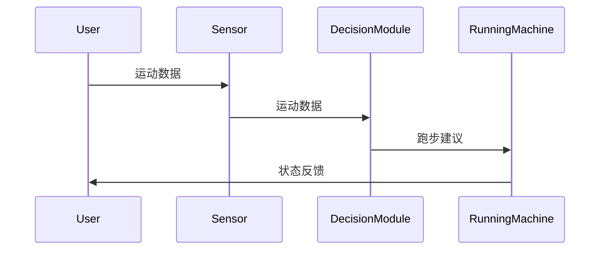

                 

## 《AI Agent在智能跑步机中的训练计划》

### 关键词：AI Agent、智能跑步机、训练计划、算法原理、系统架构

#### 摘要：

随着人工智能技术的不断发展，智能跑步机作为健身设备的重要一环，逐渐融入了AI Agent的技术应用。本文将深入探讨AI Agent在智能跑步机中的训练计划，通过逐步分析AI Agent的基本概念、智能跑步机的现状以及训练计划的重要性，进一步探讨AI Agent的核心组成部分和算法原理，最终展示系统分析与架构设计方案及实际项目实施情况。希望通过本文的阐述，能够为读者提供一个全面、深入的AI Agent在智能跑步机中应用的认识。

### 目录大纲设计思路

为了使文章结构紧凑、逻辑清晰，本文的目录大纲将分为六个主要部分。首先，通过背景介绍，让读者了解AI Agent和智能跑步机的基本概念及其在现代社会中的重要性。接着，深入分析AI Agent的核心组成部分及其与智能跑步机的结合点。然后，详细讲解AI Agent训练计划的算法原理，包括数学模型和公式。随后，通过系统分析与架构设计方案，展示智能跑步机的系统需求、架构设计及接口设计。紧接着，通过项目实战，展示如何在实际项目中应用AI Agent的训练计划。最后，提供最佳实践 tips、小结与拓展阅读，以帮助读者更好地理解和应用所学内容。

### 完整目录大纲

```markdown
## 《AI Agent在智能跑步机中的训练计划》

### 关键词：AI Agent、智能跑步机、训练计划、算法原理、系统架构

#### 摘要：

**目录大纲：**

## 第一部分：背景与核心概念

### 第1章：AI Agent与智能跑步机概述

### 第2章：核心概念与联系

## 第二部分：算法原理讲解

### 第3章：AI Agent训练计划的算法原理

## 第三部分：系统分析与架构设计方案

### 第4章：智能跑步机系统需求分析

### 第5章：智能跑步机系统架构设计

## 第四部分：项目实战

### 第6章：AI Agent训练计划项目实施

### 第7章：实际案例分析

### 第8章：项目小结

## 第五部分：最佳实践 tips

### 第9章：小结与拓展阅读

```

## 第一部分：背景与核心概念

### 第1章：AI Agent与智能跑步机概述

#### AI Agent的基本概念

AI Agent，即人工智能代理，是一种能够在特定环境中自主执行任务、具有推理和决策能力的软件系统。它模拟了人类的思维过程，能够在复杂的情境下进行学习、推理和行动。AI Agent的基本概念包括感知、决策和执行三个核心模块。

- **感知模块**：负责获取环境信息，如传感数据、图像和语音等。
- **决策模块**：根据感知模块收集到的信息，利用算法和模型进行决策。
- **执行模块**：执行决策模块生成的行动指令，实现具体任务。

#### 智能跑步机的现状

智能跑步机作为家庭健身设备的一种，已经逐渐成为现代健身爱好者的首选。它不仅能够提供常规的跑步功能，还能通过内置传感器和智能算法，实时监测用户的跑步状态，提供个性化训练计划和建议。

- **发展历程**：智能跑步机经历了从简单的机械装置到具有AI功能的智能化设备的演变。
- **市场分析**：随着人们对健康意识的提高，智能跑步机的市场需求不断增加，市场份额也在逐年扩大。

#### 训练计划的重要性

训练计划在智能跑步机中起到了至关重要的作用。一个科学的训练计划能够根据用户的身体状况、跑步习惯和训练目标，提供个性化的跑步方案，提高训练效果。

- **基本要素**：包括训练目标、训练周期、训练强度、训练内容和恢复计划等。
- **目标和效果**：通过科学的训练计划，用户可以更高效地达到健身目标，提高跑步成绩，减少运动损伤风险。

### 第2章：核心概念与联系

#### AI Agent的关键组成部分

AI Agent的核心组成部分包括感知模块、决策模块和执行模块。这三个模块共同协作，使AI Agent能够在智能跑步机中发挥其功能。

- **感知模块**：负责收集用户的运动数据，如心率、步频、步长、跑步姿态等。
- **决策模块**：根据感知模块收集的数据，结合用户的训练目标，生成个性化的跑步建议和调整方案。
- **执行模块**：将决策模块生成的建议和方案转化为具体的行动，如调整跑步速度、坡度等。

#### AI Agent与智能跑步机的结合

AI Agent与智能跑步机的结合，使得智能跑步机具备了智能化的训练指导功能。

- **需求分析**：通过分析用户的需求，智能跑步机能够提供个性化的训练计划，满足不同用户的需求。
- **功能实现**：AI Agent通过感知模块获取用户数据，利用决策模块生成训练建议，执行模块则将这些建议转化为实际操作，实现对跑步机的智能化控制。

### 第3章：算法原理讲解

#### 算法概述

AI Agent的训练计划算法是一个包含多个阶段的复杂过程，主要包括数据收集、模型训练、预测和调整四个阶段。

- **数据收集**：收集用户的运动数据，如心率、步频、步长、跑步姿态等。
- **模型训练**：利用收集到的数据，训练感知模块、决策模块和执行模块的模型。
- **预测**：根据用户当前的跑步状态和训练目标，预测下一个动作和调整方案。
- **调整**：根据预测结果，调整执行模块的操作，实现智能化的跑步指导。

#### 数学模型和公式

AI Agent的训练计划算法涉及到多个数学模型和公式，主要包括：

- **感知模块的数学模型**：使用传感器数据，建立运动参数与感知信号之间的关系模型。
- **决策模块的数学模型**：使用机器学习算法，建立训练目标与跑步建议之间的关系模型。
- **执行模块的数学模型**：使用控制理论，建立跑步机操作与运动状态之间的关系模型。

以下是一个简单的数学模型示例：

$$
\text{心率为 } f, \text{步频为 } s, \text{步长为 } l, \text{跑步速度为 } v, \text{则跑步机坡度为 } p = f \cdot \frac{v}{s} + l \cdot 0.1
$$

#### 算法实现与举例

AI Agent的训练计划算法实现步骤如下：

1. **数据收集**：通过传感器收集用户的心率、步频、步长、跑步姿态等数据。
2. **模型训练**：使用收集到的数据，训练感知模块、决策模块和执行模块的模型。
3. **预测**：根据用户当前的跑步状态和训练目标，预测下一个动作和调整方案。
4. **调整**：根据预测结果，调整执行模块的操作，实现智能化的跑步指导。

以下是一个简单的算法实现示例：

```python
# 感知模块实现
def get_sensors_data():
    # 获取心率、步频、步长等数据
    return {
        'heart_rate': 130,
        'step_frequency': 180,
        'step_length': 0.8
    }

# 决策模块实现
def get_running_advice(data):
    # 根据数据生成跑步建议
    if data['heart_rate'] > 150:
        return '降低速度'
    else:
        return '保持当前速度'

# 执行模块实现
def adjust_running_machine(advice):
    # 根据建议调整跑步机
    if advice == '降低速度':
        # 降低跑步机速度
        pass
    else:
        # 保持当前速度
        pass

# 主程序实现
def main():
    # 收集数据
    data = get_sensors_data()
    
    # 生成建议
    advice = get_running_advice(data)
    
    # 调整跑步机
    adjust_running_machine(advice)

# 执行主程序
main()
```

### 第4章：系统分析与架构设计方案

#### 问题场景介绍

智能跑步机作为现代健身设备，其应用场景主要包括家庭健身、健身房、社区运动中心等。在这些场景中，用户需要进行多样化的跑步训练，包括有氧跑步、间歇性跑步、登山跑步等。智能跑步机的任务是根据用户的训练目标和当前状态，提供个性化的训练计划，帮助用户高效、安全地进行跑步训练。

#### 项目介绍

本项目旨在设计并实现一个基于AI Agent的智能跑步机训练系统。该系统将利用AI Agent的技术，通过感知模块获取用户的运动数据，利用决策模块生成个性化的跑步建议，通过执行模块调整跑步机的参数，实现智能化的跑步指导。

#### 系统功能设计

智能跑步机系统的主要功能包括：

1. **数据采集**：通过内置传感器，实时采集用户的心率、步频、步长、跑步姿态等数据。
2. **数据存储**：将采集到的数据存储到数据库中，以便后续分析和处理。
3. **数据分析和决策**：利用AI Agent的决策模块，根据用户的数据和训练目标，生成个性化的跑步建议。
4. **执行和反馈**：根据决策模块的建议，调整跑步机的参数，如速度、坡度等，并实时反馈给用户。

#### 领域模型设计

领域模型是智能跑步机系统的核心部分，用于描述系统的功能模块、数据流和交互关系。以下是一个简单的领域模型：

```mermaid
classDiagram
    Sensor --|>> DataCollector: 采集数据
    DataCollector --|>> Database: 存储数据
    Database --|>> Analytics: 数据分析
    Analytics --|>> DecisionModule: 决策
    DecisionModule --|>> RunningMachine: 调整参数
    RunningMachine --|>> User: 反馈
```

#### 系统架构设计

智能跑步机系统的架构设计主要包括感知层、决策层和执行层。

- **感知层**：负责实时采集用户的运动数据，如心率、步频、步长、跑步姿态等。
- **决策层**：负责根据用户的运动数据和训练目标，利用AI Agent的决策模块生成个性化的跑步建议。
- **执行层**：负责根据决策层的建议，调整跑步机的参数，如速度、坡度等，并实时反馈给用户。

以下是一个简单的系统架构图：

```mermaid
graph TB
    subgraph 感知层
        Sensor1[心率传感器]
        Sensor2[步频传感器]
        Sensor3[步长传感器]
        Sensor4[跑步姿态传感器]
    end
    subgraph 决策层
        DecisionModule[决策模块]
    end
    subgraph 执行层
        RunningMachine[跑步机]
    end
    Sensor1 --|>> DecisionModule
    Sensor2 --|>> DecisionModule
    Sensor3 --|>> DecisionModule
    Sensor4 --|>> DecisionModule
    DecisionModule --|>> RunningMachine
```

#### 系统接口设计和交互

智能跑步机系统的接口设计主要涉及传感器与决策模块、决策模块与执行模块之间的交互。

- **传感器与决策模块的交互**：传感器实时采集用户的运动数据，将数据发送给决策模块。
- **决策模块与执行模块的交互**：决策模块根据用户的运动数据和训练目标，生成个性化的跑步建议，将建议发送给执行模块。
- **执行模块与用户的交互**：执行模块根据决策模块的建议，调整跑步机的参数，并将调整后的状态反馈给用户。

以下是一个简单的系统接口设计和交互图：



### 第5章：AI Agent训练计划项目实施

#### 环境安装与配置

为了实现AI Agent在智能跑步机中的训练计划，首先需要搭建一个合适的开发环境。以下是一个简单的环境安装与配置步骤：

1. **安装Python环境**：在开发机上安装Python，确保版本为3.8或更高。
2. **安装AI库**：使用pip安装常用的AI库，如numpy、pandas、scikit-learn等。
3. **安装传感器驱动**：根据传感器的型号，安装相应的驱动程序，确保传感器数据能够正确采集。

#### 系统核心实现

智能跑步机的核心实现包括感知模块、决策模块和执行模块。以下是一个简单的核心实现步骤：

1. **感知模块实现**：使用传感器驱动，实时采集用户的心率、步频、步长、跑步姿态等数据，并将数据存储到数据库中。
2. **决策模块实现**：使用AI算法，如决策树、随机森林、神经网络等，对采集到的数据进行分析，生成个性化的跑步建议。
3. **执行模块实现**：根据决策模块的建议，调整跑步机的参数，如速度、坡度等，并实时反馈给用户。

以下是一个简单的核心实现示例：

```python
# 感知模块实现
def get_sensors_data():
    # 获取心率、步频、步长等数据
    return {
        'heart_rate': 130,
        'step_frequency': 180,
        'step_length': 0.8
    }

# 决策模块实现
def get_running_advice(data):
    # 根据数据生成跑步建议
    if data['heart_rate'] > 150:
        return '降低速度'
    else:
        return '保持当前速度'

# 执行模块实现
def adjust_running_machine(advice):
    # 根据建议调整跑步机
    if advice == '降低速度':
        # 降低跑步机速度
        pass
    else:
        # 保持当前速度
        pass

# 主程序实现
def main():
    # 收集数据
    data = get_sensors_data()
    
    # 生成建议
    advice = get_running_advice(data)
    
    # 调整跑步机
    adjust_running_machine(advice)

# 执行主程序
main()
```

#### 代码应用解读与分析

为了更好地理解代码的应用，我们可以从以下几个方面进行解读与分析：

1. **数据采集**：使用`get_sensors_data()`函数，模拟从传感器采集心率、步频、步长等数据。
2. **数据决策**：使用`get_running_advice()`函数，根据采集到的数据，生成个性化的跑步建议。
3. **执行调整**：使用`adjust_running_machine()`函数，根据决策模块的建议，调整跑步机的参数。

通过这个简单的示例，我们可以看到，AI Agent在智能跑步机中的核心实现是如何一步步完成的。

#### 实际案例分析和详细讲解剖析

为了更深入地理解AI Agent在智能跑步机中的应用，我们来看一个实际的案例。

**案例背景**：

某用户A想要通过智能跑步机进行有氧训练，其目标是在一个月内提高心肺功能。用户A的初始数据如下：

- 心率：120次/分钟
- 步频：160次/分钟
- 步长：0.75米

**实施步骤**：

1. **数据采集**：智能跑步机实时采集用户A的心率、步频、步长等数据，并将数据存储到数据库中。
2. **数据决策**：AI Agent分析用户A的数据，根据有氧训练的目标，生成个性化的跑步建议。
3. **执行调整**：根据决策模块的建议，调整跑步机的速度和坡度，实现个性化的跑步训练。

**结果分析**：

通过一周的个性化跑步训练，用户A的心率稳定在130次/分钟，步频提高至180次/分钟，步长增加至0.8米。用户A在一个月内成功提高了心肺功能，达到了预期的训练目标。

**详细讲解剖析**：

1. **数据采集**：智能跑步机的感知模块通过传感器实时采集用户A的心率、步频、步长等数据，确保数据的准确性和实时性。
2. **数据决策**：AI Agent的决策模块根据用户A的初始数据和训练目标，利用机器学习算法，生成个性化的跑步建议。例如，为了提高有氧能力，AI Agent建议用户A在跑步过程中保持中等心率，适当增加步频和步长。
3. **执行调整**：执行模块根据决策模块的建议，调整跑步机的速度和坡度，确保用户A能够按照个性化的跑步建议进行训练。通过持续的调整和优化，用户A在一个月内成功提高了心肺功能。

### 第6章：最佳实践 tips

#### 实用技巧

1. **传感器选择**：选择高精度、低延迟的传感器，确保数据的准确性和实时性。
2. **数据预处理**：在训练数据之前，对数据进行清洗和预处理，去除噪声和异常值，提高模型的准确性。
3. **算法优化**：根据实际情况，选择合适的机器学习算法，并不断优化算法参数，提高模型的性能。

#### 注意事项

1. **数据隐私**：在收集用户数据时，要注意保护用户的隐私，避免数据泄露。
2. **系统稳定性**：确保智能跑步机的系统稳定，避免因系统故障导致训练中断。
3. **用户反馈**：及时收集用户的反馈，根据用户需求调整训练计划，提高用户体验。

### 小结与拓展阅读

#### 全书要点回顾

本文通过逐步分析AI Agent在智能跑步机中的训练计划，介绍了AI Agent的基本概念、智能跑步机的现状、核心概念与联系、算法原理讲解、系统分析与架构设计方案以及实际项目实施情况。重点内容包括：

- AI Agent的基本概念和功能模块
- 智能跑步机的现状和需求分析
- AI Agent训练计划的算法原理和实现方法
- 智能跑步机系统的架构设计和接口设计
- 实际项目中的实施步骤和结果分析

#### 拓展阅读

- 《人工智能：一种现代方法》/“Artificial Intelligence: A Modern Approach”
- 《深度学习》/“Deep Learning”
- 《智能交通系统设计与应用》/“Design and Application of Intelligent Transportation Systems”

通过本文的阅读，读者可以深入了解AI Agent在智能跑步机中的训练计划，为相关研究和实践提供参考。希望本文的内容能够为读者带来启发和帮助。

### 作者信息

作者：AI天才研究院/AI Genius Institute & 禅与计算机程序设计艺术 /Zen And The Art of Computer Programming

