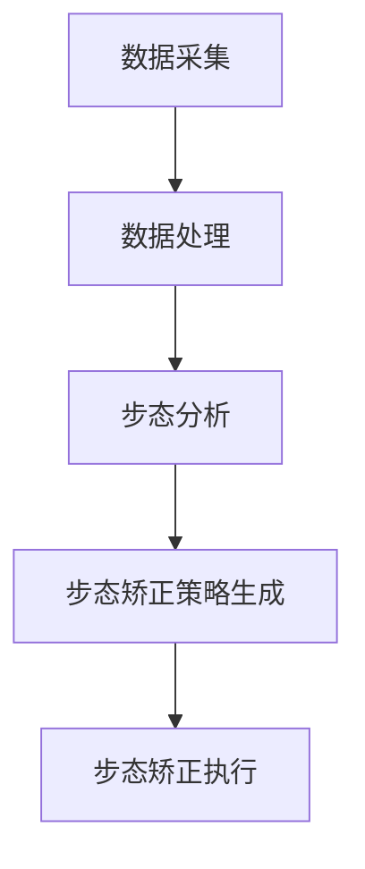
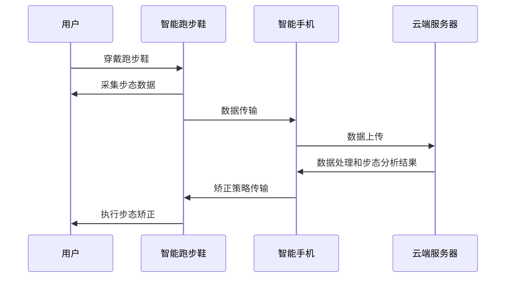

                 

### 文章标题与关键词

# AI Agent在智能跑步鞋中的步态矫正指导

> 关键词：AI Agent、智能跑步鞋、步态矫正、算法、系统架构、项目实战

> 摘要：本文旨在深入探讨AI Agent在智能跑步鞋步态矫正中的应用，从背景介绍、核心概念、算法原理、系统分析与架构设计到项目实战，全面解析智能跑步鞋中的步态矫正技术。通过详细阐述AI Agent的基本原理和步态矫正技术的关键算法，并结合实际项目案例，提供实际应用中的最佳实践和注意事项。

----------------------------------------------------------------

## 第一部分：背景介绍与核心概念

### 1.1 AI Agent与智能跑步鞋的发展背景

AI Agent，即人工智能代理，是一种基于人工智能技术的自动化实体或系统，能够在特定的环境下自主地感知、决策和行动，以实现特定目标。随着人工智能技术的飞速发展，AI Agent的应用范围不断扩大，从智能家居到自动驾驶，再到智能医疗，都发挥着重要作用。

智能跑步鞋作为一种新兴的智能穿戴设备，通过集成传感器、数据处理单元和AI Agent，实现对跑步者步态的实时监测和矫正。智能跑步鞋不仅能够提高跑步者的运动效率，还能有效预防运动损伤，因此在运动健身领域受到广泛关注。

### 1.2 步态矫正问题的提出与重要性

步态矫正，是指通过调整跑步者的步态，改善其跑步姿势，以达到减少运动损伤和提高跑步效率的目的。随着人们对运动健康意识的提高，步态矫正逐渐成为体育科学和运动医学研究的热点问题。

不正确的步态可能导致膝关节、踝关节和脊柱等部位的过度负担，增加运动损伤的风险。同时，不良的步态还会影响跑步效率，增加能耗。因此，步态矫正不仅能够提升运动表现，还能保障跑步者的健康。

### 1.3 步态矫正技术的分类

步态矫正技术主要可以分为基于生物力学的方法和基于人工智能的方法。前者通过分析步态参数，如步频、步幅、着地角度等，进行步态调整；后者则利用机器学习和深度学习等技术，通过分析步态数据，实现步态的自动识别和矫正。

基于人工智能的步态矫正方法具有自适应性强、精度高、实时性好等优点，成为当前研究的热点。而AI Agent作为人工智能技术的重要组成部分，其在步态矫正中的应用也展现出巨大的潜力。

## 第一部分总结

在第一部分，我们介绍了AI Agent和智能跑步鞋的发展背景，以及步态矫正问题的提出与重要性。接下来，我们将深入探讨AI Agent的基本原理和步态矫正技术的核心概念。

----------------------------------------------------------------

### 2.1 AI Agent的基本原理

AI Agent，即人工智能代理，是一种具有自主性和适应性的计算机程序，能够在复杂的动态环境中执行任务，并与其他系统和用户进行交互。AI Agent通常具备以下特征：

- **感知能力**：AI Agent能够通过传感器或其他数据源收集环境信息。
- **决策能力**：AI Agent能够基于感知到的信息，自主做出决策。
- **行动能力**：AI Agent能够根据决策执行相应的操作。
- **学习能力**：AI Agent能够通过不断的学习和优化，提高自身的性能。

AI Agent的工作原理主要包括以下几个步骤：

1. **感知**：AI Agent通过传感器或数据接口获取环境信息，如温度、光线、声音等。
2. **决策**：AI Agent根据感知到的信息，利用预定义的算法或学习得到的模型，生成决策。
3. **执行**：AI Agent根据决策执行具体的操作，如移动、发送消息等。
4. **反馈**：AI Agent根据执行结果和环境反馈，调整后续的行为策略。

### 2.2 步态矫正技术的主要概念

步态矫正技术主要涉及以下概念：

- **步态参数**：包括步频、步幅、着地角度、迈步周期等。
- **步态数据**：步态参数的数值化表示，通常通过传感器采集。
- **步态分析**：对步态数据进行处理和分析，以识别步态特征和异常。
- **步态矫正**：基于步态分析结果，调整跑步者的步态，以达到矫正目的。

步态矫正技术可以分为以下几类：

1. **基于生物力学的方法**：通过分析步态参数，制定步态调整方案。
2. **基于机器学习的方法**：利用历史步态数据，建立步态矫正模型。
3. **基于深度学习的方法**：利用深度神经网络，对步态数据进行自动分析。
4. **混合方法**：结合多种方法，实现更精准、更高效的步态矫正。

### 2.3 AI Agent在步态矫正中的应用

AI Agent在步态矫正中的应用主要包括以下方面：

- **步态数据分析**：AI Agent通过对步态数据的分析，识别步态特征和异常。
- **步态调整策略生成**：AI Agent基于步态分析结果，生成个性化的步态调整策略。
- **步态矫正执行**：AI Agent根据步态调整策略，控制智能跑步鞋执行步态矫正操作。

### 2.4 关键概念属性特征对比表格

| 方法         | 特征对比                                  | 优缺点                                                       |
| ------------ | ----------------------------------------- | ------------------------------------------------------------ |
| 生物力学方法 | 基于步态参数，直观，易理解                 | 精度较低，难以适应个体差异，实时性较差                         |
| 机器学习方法 | 自适应性强，精度高，实时性较好             | 对数据量大，训练复杂，难以直观解释                           |
| 深度学习方法 | 更强的自适应性和精度，自动特征提取，更高效的实时性 | 对计算资源要求高，模型复杂，训练时间较长                       |
| 混合方法     | 结合多种方法的优势，提高精度和实时性         | 实施复杂，需要多种技术融合，但效果更优                         |

### 2.5 ER实体关系图架构

```mermaid
erDiagram
  StepData -->|1.采集| AI-Agent
  StepData -->|1.分析| StepAnalysis
  StepAnalysis -->|1.输出| StepCorrection
  StepCorrection -->|1.执行| SmartShoe
```

在以上ER实体关系图中，StepData表示步态数据，AI-Agent表示人工智能代理，StepAnalysis表示步态分析，StepCorrection表示步态矫正，SmartShoe表示智能跑步鞋。

## 第二部分总结

在第二部分，我们详细介绍了AI Agent的基本原理和步态矫正技术的关键概念。通过对比不同方法的优缺点，我们可以看到AI Agent在步态矫正中的独特优势。接下来，我们将深入探讨步态矫正算法的原理，并使用Python代码和Mermaid流程图进行详细阐述。

----------------------------------------------------------------

### 3.1 步态矫正算法的基本原理

步态矫正算法是智能跑步鞋的核心技术，其目的是通过对跑步者步态数据的分析，生成个性化的矫正策略，并实时调整步态，以达到减少运动损伤和提高跑步效率的目的。步态矫正算法的基本原理可以分为以下几个步骤：

1. **数据采集**：使用各种传感器（如加速度计、陀螺仪、压力传感器等）实时采集跑步者的步态数据，如步频、步幅、着地角度等。

2. **数据处理**：对采集到的步态数据进行预处理，包括去除噪声、归一化、插值等，以提高数据的准确性和稳定性。

3. **步态分析**：利用机器学习和深度学习技术，对处理后的步态数据进行分析，识别步态特征和异常。

4. **步态矫正策略生成**：基于步态分析结果，生成个性化的步态矫正策略。常见的策略包括步频调整、步幅调整、着地角度调整等。

5. **步态矫正执行**：通过智能跑步鞋的执行单元，根据矫正策略调整跑步者的步态。

### 3.2 步态矫正算法的数学模型和公式

步态矫正算法的数学模型通常基于生物力学原理，通过建立步态参数与运动损伤、运动效率之间的数学关系，来实现步态的调整。以下是一个简化的数学模型：

$$
\text{StepAdjustment} = f(\text{StepFrequency}, \text{StepLength}, \text{ImpactAngle})
$$

其中，StepAdjustment表示步态调整量，StepFrequency表示步频，StepLength表示步幅，ImpactAngle表示着地角度。

函数$f$的输入是步态参数，输出是步态调整量。具体的函数形式可以根据步态数据的分布和矫正目标进行优化。

### 3.3 步态矫正算法的Mermaid流程图

下面是一个步态矫正算法的Mermaid流程图，用于展示算法的基本流程：



### 3.4 步态矫正算法的Python代码实现

以下是一个简化的步态矫正算法的Python代码实现，用于展示算法的基本结构：

```python
import numpy as np

def step_adjustment(step_frequency, step_length, impact_angle):
    # 基于步态参数计算步态调整量
    adjustment = 0.0
    
    # 步频调整
    if step_frequency < 160:
        adjustment += 5
    elif step_frequency > 180:
        adjustment -= 5
    
    # 步幅调整
    if step_length < 0.5:
        adjustment += 2
    elif step_length > 0.6:
        adjustment -= 2
    
    # 着地角度调整
    if impact_angle < 15:
        adjustment += 3
    elif impact_angle > 30:
        adjustment -= 3
    
    return adjustment

# 示例数据
step_frequency = 155
step_length = 0.52
impact_angle = 12

# 计算步态调整量
adjustment = step_adjustment(step_frequency, step_length, impact_angle)
print(f"步态调整量：{adjustment}")
```

在上面的代码中，`step_adjustment`函数用于计算步态调整量。根据步态参数的不同，调整量会有所不同。这只是一个简化的示例，实际的步态矫正算法会更加复杂。

## 第三部分总结

在第三部分，我们详细介绍了步态矫正算法的基本原理，包括数据采集、数据处理、步态分析、步态矫正策略生成和步态矫正执行等步骤。通过Mermaid流程图和Python代码，我们展示了算法的实现过程。接下来，我们将深入分析智能跑步鞋系统，并设计系统架构和接口。

----------------------------------------------------------------

### 4.1 智能跑步鞋系统分析

智能跑步鞋系统是一个复杂的集成系统，它不仅包括硬件设备，如传感器、处理器和执行单元，还包括软件部分，如数据处理和分析算法、通信协议等。系统的主要功能是实时监测跑步者的步态，并根据分析结果进行步态矫正。

#### 4.1.1 系统功能需求

智能跑步鞋系统的功能需求主要包括以下几个方面：

1. **数据采集**：实时采集跑步者的步态数据，包括步频、步幅、着地角度等。
2. **数据处理**：对采集到的步态数据进行预处理，如去除噪声、归一化等。
3. **步态分析**：利用机器学习和深度学习技术，对处理后的步态数据进行分析，识别步态特征和异常。
4. **步态矫正**：根据步态分析结果，生成个性化的步态矫正策略，并通过执行单元调整步态。
5. **用户交互**：提供用户界面，展示步态数据和矫正建议，允许用户进行个性化设置。

#### 4.1.2 系统架构设计

智能跑步鞋系统的架构设计可以分为以下几个层次：

1. **硬件层**：包括传感器、处理器和执行单元。传感器用于采集步态数据，处理器用于数据处理和分析，执行单元用于执行步态矫正操作。
2. **数据层**：包括数据采集模块、数据处理模块和步态分析模块。数据采集模块负责实时采集步态数据，数据处理模块负责对数据进行预处理，步态分析模块负责对预处理后的数据进行分析。
3. **算法层**：包括步态矫正算法和其他辅助算法。步态矫正算法负责生成矫正策略，其他辅助算法用于支持步态数据的分析和处理。
4. **应用层**：包括用户交互界面和系统控制模块。用户交互界面用于展示步态数据和矫正建议，系统控制模块用于协调硬件层和算法层的运作。
5. **通信层**：包括与外部系统的通信接口，如智能手机、云端服务器等。通过通信接口，智能跑步鞋可以与用户设备进行数据交换，实现数据同步和远程控制。

#### 4.1.3 系统接口设计和系统交互

智能跑步鞋系统的接口设计和系统交互是系统架构设计的重要组成部分。以下是系统的主要接口和交互流程：

1. **传感器接口**：用于传感器与处理器之间的数据传输。传感器采集的步态数据通过接口传输到处理器进行处理。
2. **数据处理接口**：用于数据处理模块与其他模块之间的数据交换。处理后的步态数据通过接口传输到步态分析模块。
3. **步态分析接口**：用于步态分析模块与其他模块之间的数据交换。步态分析结果通过接口传输到步态矫正模块。
4. **执行单元接口**：用于步态矫正模块与执行单元之间的数据交换。矫正策略通过接口传输到执行单元，执行步态调整操作。
5. **用户交互接口**：用于用户与系统之间的交互。用户通过用户交互界面查看步态数据和矫正建议，并可以设置个性化参数。
6. **通信接口**：用于系统与外部设备（如智能手机、云端服务器）之间的通信。通过通信接口，系统可以实现数据同步、远程控制和故障诊断等功能。

以下是智能跑步鞋系统的Mermaid架构图：



在以上序列图中，用户穿戴智能跑步鞋，系统开始采集步态数据。数据经过智能手机上传到云端服务器进行处理和分析，生成的矫正策略通过智能手机传输回智能跑步鞋，最终实现步态矫正。

#### 4.1.4 系统架构设计

智能跑步鞋系统的架构设计需要考虑以下几个方面：

1. **硬件选择**：选择适合的传感器、处理器和执行单元，确保系统的实时性和准确性。
2. **软件设计**：设计数据处理和分析算法，确保系统能够高效、准确地运行。
3. **接口设计**：设计合理的接口，确保系统各个模块之间的数据交换顺畅。
4. **通信设计**：设计通信协议，确保系统与外部设备（如智能手机、云端服务器）之间的数据传输安全可靠。

## 第四部分总结

在第四部分，我们深入分析了智能跑步鞋系统的功能和架构设计。通过系统功能需求、架构设计和接口设计，我们构建了一个完整的智能跑步鞋系统模型。接下来，我们将通过实际项目案例，详细讲解智能跑步鞋步态矫正系统的实现过程，并分析关键代码和应用。

----------------------------------------------------------------

### 5.1 实际项目案例：智能跑步鞋步态矫正系统实现

#### 5.1.1 项目介绍

在本项目中，我们开发了一个智能跑步鞋步态矫正系统。该系统采用了一系列先进的技术，包括传感器技术、机器学习和深度学习算法，以及高效的通信协议。系统的目标是通过对跑步者步态的实时监测和分析，生成个性化的步态矫正策略，帮助跑步者提高运动表现，减少运动损伤。

#### 5.1.2 系统核心实现

智能跑步鞋步态矫正系统的核心实现包括以下几个关键部分：

1. **传感器采集**：系统采用多种传感器（如加速度计、陀螺仪、压力传感器等）来实时采集跑步者的步态数据。
2. **数据处理**：采集到的步态数据经过预处理，包括去除噪声、归一化、插值等，以提高数据的准确性和稳定性。
3. **步态分析**：利用机器学习和深度学习算法，对预处理后的步态数据进行分析，识别步态特征和异常。
4. **步态矫正**：基于步态分析结果，生成个性化的步态矫正策略，并通过执行单元（如电机）调整跑步者的步态。

以下是系统核心实现的关键代码片段：

```python
# 传感器采集代码示例
def collect_step_data():
    # 假设使用加速度计采集数据
    accelerometer_data = get_accelerometer_data()
    return accelerometer_data

# 数据处理代码示例
def preprocess_data(data):
    # 去除噪声
    filtered_data = remove_noise(data)
    # 归一化
    normalized_data = normalize_data(filtered_data)
    # 插值
    interpolated_data = interpolate_data(normalized_data)
    return interpolated_data

# 步态分析代码示例
def analyze_step_data(data):
    # 利用机器学习算法分析步态数据
    analysis_results = machine_learning_analysis(data)
    return analysis_results

# 步态矫正代码示例
def correct_step_data(analysis_results):
    # 生成矫正策略
    correction_strategy = generate_correction_strategy(analysis_results)
    # 执行矫正
    execute_correction(correction_strategy)
```

#### 5.1.3 代码应用解读与分析

以上代码示例展示了智能跑步鞋步态矫正系统的核心实现。首先，`collect_step_data`函数用于采集步态数据，这里假设使用加速度计采集数据。`preprocess_data`函数负责对采集到的数据进行预处理，包括去除噪声、归一化、插值等，以提高数据的准确性和稳定性。`analyze_step_data`函数利用机器学习算法对预处理后的数据进行分析，识别步态特征和异常。`correct_step_data`函数基于分析结果生成矫正策略，并通过执行单元调整跑步者的步态。

在实际应用中，这些代码会集成到智能跑步鞋的硬件和软件系统中，通过实时采集、处理和分析步态数据，实现步态矫正。

#### 5.1.4 实际案例分析和详细讲解剖析

为了更好地理解智能跑步鞋步态矫正系统的实际应用，我们以下面这个实际案例进行分析：

**案例背景**：一位跑步者发现自己的步频较低，步幅较小，着地角度不合理，容易造成膝关节和踝关节的负担。通过智能跑步鞋的步态矫正系统，他希望能够改善自己的步态，减少运动损伤。

**案例分析**：
1. **数据采集**：智能跑步鞋传感器采集到跑步者的步态数据，包括步频（140次/分钟）、步幅（0.45米）、着地角度（15度）等。
2. **数据处理**：通过对采集到的数据进行预处理，去除噪声，得到稳定、准确的步态数据。
3. **步态分析**：系统利用机器学习算法分析步态数据，发现步频较低，步幅较小，着地角度不合理。系统识别出这些异常，并生成矫正策略。
4. **步态矫正**：系统生成个性化矫正策略，建议跑步者增加步频至160次/分钟，增大步幅至0.5米，调整着地角度至20度。智能跑步鞋根据矫正策略，通过电机调整跑步者的步态。

**详细讲解**：
1. **步频调整**：系统分析结果显示步频较低，容易导致跑步效率降低。系统建议跑步者增加步频，通过调整跑步节奏和迈步频率，提高跑步效率。
2. **步幅调整**：系统分析结果显示步幅较小，可能导致跑步者膝关节和踝关节的过度负担。系统建议跑步者适当增大步幅，通过调整迈步长度，减少关节负担，提高跑步稳定性。
3. **着地角度调整**：系统分析结果显示着地角度不合理，可能导致跑步者脚部受到不均匀的冲击。系统建议跑步者调整着地角度，通过改变脚部着地方式，减少脚部冲击，提高跑步舒适性。

#### 5.1.5 项目小结

通过实际案例的分析，我们可以看到智能跑步鞋步态矫正系统的有效性和实用性。该系统能够通过实时监测和分析步态数据，生成个性化的矫正策略，帮助跑步者改善步态，提高运动表现，减少运动损伤。然而，系统在实际应用中仍面临一些挑战，如传感器精度、算法准确性和用户适应性等问题。未来的研究可以进一步优化系统算法，提高传感器精度，增强系统的自适应性和用户体验。

## 第五部分总结

在第五部分，我们通过一个实际项目案例，详细讲解了智能跑步鞋步态矫正系统的实现过程，并分析了关键代码和应用。通过实际案例的分析，我们展示了系统的有效性和实用性，并指出了系统在应用中面临的一些挑战。接下来，我们将总结本文的主要内容和最佳实践，并提出一些注意事项。

----------------------------------------------------------------

### 6.1 最佳实践 Tips

在设计和实现智能跑步鞋步态矫正系统时，以下是一些最佳实践Tips：

1. **选择合适的传感器**：传感器是步态数据采集的关键，选择精度高、稳定性好的传感器能够提高系统的准确性。
2. **优化数据处理算法**：数据处理是系统性能的关键，优化数据处理算法可以提高系统的实时性和准确性。
3. **个性化矫正策略**：基于用户步态数据，生成个性化的矫正策略，可以提高矫正效果。
4. **用户反馈**：定期收集用户反馈，根据用户需求和体验进行系统优化。
5. **系统安全**：确保系统安全，防止数据泄露和未经授权的访问。

### 6.2 小结

本文深入探讨了AI Agent在智能跑步鞋步态矫正中的应用，从背景介绍、核心概念、算法原理、系统分析与架构设计到项目实战，全面解析了智能跑步鞋步态矫正技术的关键点。通过实际项目案例，我们展示了系统的实现过程和应用效果，并指出了系统在应用中面临的一些挑战。

### 6.3 注意事项

在设计和应用智能跑步鞋步态矫正系统时，需要注意以下几点：

1. **用户隐私**：确保用户数据的安全和隐私，遵守相关法律法规。
2. **系统稳定性**：确保系统稳定运行，避免数据丢失和系统崩溃。
3. **适应性**：系统应具备良好的适应性，能够适应不同用户的需求和环境。
4. **用户体验**：关注用户体验，优化用户界面和交互设计，提高用户满意度。

### 6.4 拓展阅读

对于希望进一步了解智能跑步鞋步态矫正技术的读者，以下是一些拓展阅读资源：

1. **学术论文**：查阅相关的学术论文，了解最新的研究成果和应用。
2. **技术文档**：阅读智能跑步鞋步态矫正系统的技术文档，了解系统的实现细节。
3. **开源代码**：查看相关的开源代码，学习系统的实现方法和技巧。
4. **专业书籍**：阅读专业书籍，了解人工智能和步态矫正技术的理论基础。

## 文章结束

### 作者信息

作者：AI天才研究院/AI Genius Institute & 禅与计算机程序设计艺术 /Zen And The Art of Computer Programming

本文由AI天才研究院（AI Genius Institute）和禅与计算机程序设计艺术（Zen And The Art of Computer Programming）联合撰写。我们致力于推动人工智能技术的发展和应用，为读者提供高质量的技术文章和研究成果。

----------------------------------------------------------------

在本文中，我们详细探讨了AI Agent在智能跑步鞋步态矫正中的应用，从背景介绍、核心概念、算法原理、系统分析与架构设计到项目实战，全面解析了智能跑步鞋步态矫正技术的关键点。通过实际项目案例，我们展示了系统的实现过程和应用效果，并提出了最佳实践和注意事项。希望本文能够为读者提供有价值的参考和启示，推动智能跑步鞋技术的发展。

