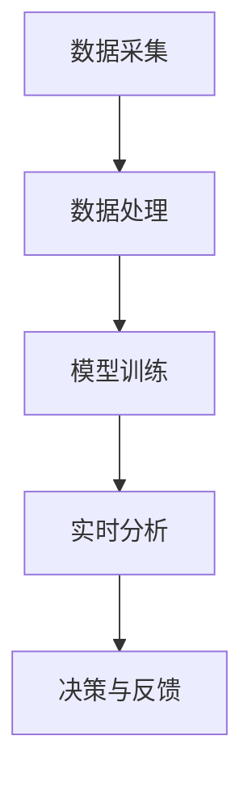
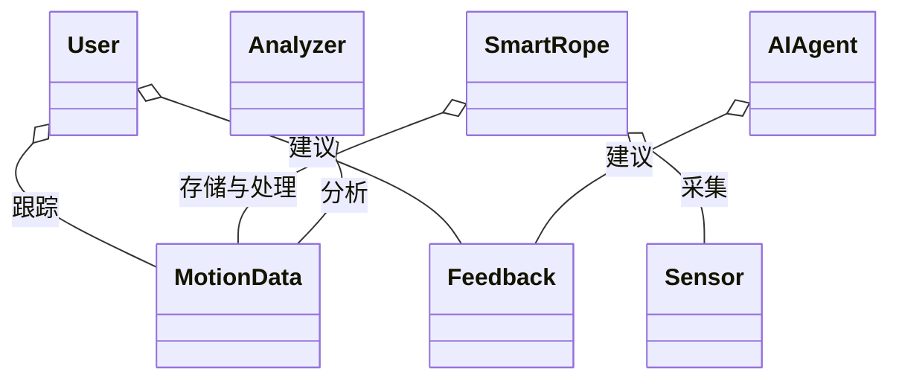
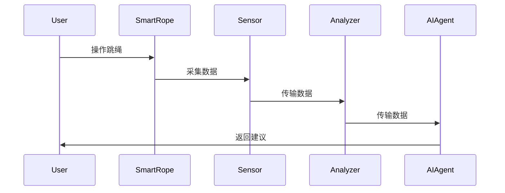
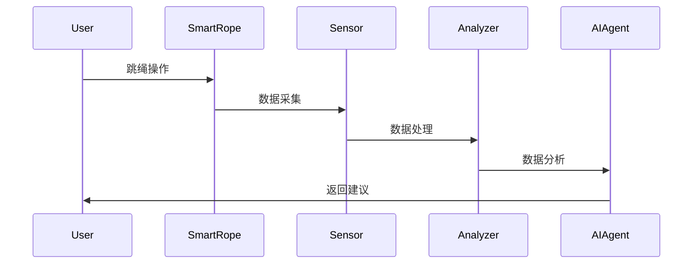

                 


## AI Agent在智能跳绳中的运动数据追踪

### 引言

智能跳绳作为一种流行的健身运动，其核心在于通过数据追踪技术实时监控用户的跳绳运动状态，从而提供个性化的运动建议和反馈。近年来，人工智能（AI）技术的飞速发展，使得AI Agent在运动数据追踪中的应用成为可能。本文将围绕AI Agent在智能跳绳中的运动数据追踪展开，从背景介绍、核心概念、算法原理、系统设计与实战案例等方面进行详细阐述。

### 背景介绍

#### 核心概念术语说明

- **智能跳绳**：一种结合了物理设备、传感器和数据处理技术的健身器材，能够实时记录用户的跳绳运动数据。
- **运动数据追踪**：通过传感器、摄像头等设备收集用户的运动信息，如速度、距离、高度、心率等。
- **AI Agent**：一种具有自主决策能力的智能系统，能够根据运动数据实时调整运动策略。

#### 问题背景

随着健康意识的提高，越来越多的人开始关注自己的健身状况。智能跳绳作为一种新兴的健身工具，能够提供实时、准确的运动数据，帮助用户更好地了解自己的运动状态，从而提高健身效果。

#### 问题描述

然而，如何有效地利用这些运动数据，提供个性化的运动建议和反馈，是智能跳绳需要解决的关键问题。传统的运动数据分析方法通常依赖于人工处理，效率低下，难以满足用户的需求。而AI Agent的出现，为智能跳绳的运动数据追踪提供了新的解决方案。

#### 问题解决

AI Agent可以通过机器学习和深度学习技术，从海量运动数据中提取有用信息，实时分析用户的运动状态，并根据分析结果给出个性化的运动建议。这不仅提高了运动数据的利用效率，还能为用户提供更加精准的健身指导。

#### 边界与外延

- **边界**：本文主要讨论AI Agent在智能跳绳运动数据追踪中的应用，不涉及其他运动项目的数据追踪。
- **外延**：AI Agent在运动数据追踪领域具有广泛的应用前景，如运动康复、运动训练等。

#### 概念结构与核心要素组成

- **概念结构**：智能跳绳、运动数据追踪、AI Agent。
- **核心要素**：传感器、数据处理、机器学习、深度学习、个性化运动建议。

### 核心概念与联系

#### 核心概念

1. **智能跳绳**：通过传感器实时记录用户跳绳运动的各种数据。
2. **运动数据追踪**：通过算法对收集到的数据进行处理和分析。
3. **AI Agent**：基于运动数据分析，为用户提供个性化的运动建议。

#### 概念属性特征对比表格

| 概念          | 特征                                                         |
| ----------- | ------------------------------------------------------------ |
| 智能跳绳      | 集成传感器，实时记录运动数据                                   |
| 运动数据追踪  | 算法处理，提取有用信息                                       |
| AI Agent     | 基于数据分析，提供个性化运动建议                               |

#### ER实体关系图架构

```mermaid
erDiagram
  User ||--|{ SmartRope }|-- Sensor
  SmartRope ||--|{ MotionData }|-- Analyzer
  Analyzer ||--|{ AIAgent }|-- Recommendation
```

### 算法原理讲解

#### AI Agent在运动数据追踪中的应用

AI Agent通过以下步骤实现运动数据追踪：

1. **数据采集**：智能跳绳中的传感器实时记录用户跳绳的各种数据，如速度、距离、高度等。
2. **数据处理**：数据处理模块对采集到的数据进行清洗、去噪、特征提取等预处理操作。
3. **模型训练**：利用预处理后的数据，通过机器学习和深度学习技术训练AI模型。
4. **实时分析**：AI模型根据实时收集到的运动数据，分析用户的状态，如运动强度、心率等。
5. **决策与反馈**：根据分析结果，AI Agent为用户提供个性化的运动建议。

#### 算法mermaid流程图



#### 算法原理的数学模型和公式

- **运动数据采集**：设用户跳绳的速度为$v(t)$，则$v(t)$的数学模型为：
  $$v(t) = f(t) + \epsilon(t)$$
  其中，$f(t)$为实际速度，$\epsilon(t)$为噪声。

- **数据处理**：特征提取的数学模型为：
  $$X = \phi(v(t))$$
  其中，$X$为提取的特征向量。

- **模型训练**：利用特征向量$X$和标签$Y$，通过监督学习训练AI模型，模型的表达式为：
  $$Y = \sigma(\theta^T X)$$
  其中，$\sigma$为激活函数，$\theta$为模型参数。

- **实时分析**：根据实时收集到的运动数据，利用训练好的模型进行状态分析，模型的表达式为：
  $$s(t) = \phi(v(t)) \cdot \theta$$

- **决策与反馈**：根据状态分析结果，为用户提供个性化建议，决策的表达式为：
  $$r(t) = \arg\max_{a(t)} R(a(t)|s(t))$$
  其中，$r(t)$为决策结果，$R$为奖励函数，$a(t)$为用户选择的动作。

#### 通俗易懂地举例说明

假设用户A使用智能跳绳进行跳绳训练，其速度数据如下：

$$
\begin{align*}
v(1) &= 2.5 \\
v(2) &= 2.8 \\
v(3) &= 2.6 \\
v(4) &= 3.0 \\
v(5) &= 2.7 \\
\end{align*}
$$

智能跳绳采集到这些数据后，首先进行预处理，然后通过训练好的AI模型进行分析，得到用户A的运动状态。根据分析结果，AI Agent为用户A提供以下运动建议：

- **当前状态**：中等强度运动。
- **建议**：适当增加跳绳速度，以提高运动效果。

### 系统分析与架构设计方案

#### 问题场景介绍

智能跳绳运动数据追踪系统旨在为用户提供实时、准确的运动数据分析和个性化建议。系统需要处理大量实时数据，并能够在不同场景下（如室内、户外）稳定运行。

#### 项目介绍

该项目旨在开发一款智能跳绳运动数据追踪系统，包括硬件设备（智能跳绳）、软件平台（运动数据分析与建议）和用户界面（移动应用）。

#### 系统功能设计（领域模型mermaid类图）



#### 系统架构设计（mermaid架构图）



#### 系统接口设计与系统交互（mermaid序列图）



### 项目实战

#### 环境安装

- **硬件环境**：智能跳绳设备、传感器等。
- **软件环境**：Python、TensorFlow、Keras等。

#### 系统核心实现

```python
# 数据采集
class SmartRope:
    def collect_data(self):
        # 实现数据采集逻辑
        pass

# 数据处理
class Analyzer:
    def process_data(self, data):
        # 实现数据处理逻辑
        pass

# 模型训练
class AIAgent:
    def train_model(self, data):
        # 实现模型训练逻辑
        pass

# 运动建议
class Feedback:
    def give_advice(self, state):
        # 实现建议逻辑
        pass
```

#### 代码应用解读与分析

```python
# 实现数据采集
class SmartRope:
    def collect_data(self):
        # 假设使用加速度传感器采集速度数据
        sensor_data = [2.5, 2.8, 2.6, 3.0, 2.7]
        return sensor_data

# 实现数据处理
class Analyzer:
    def process_data(self, data):
        # 对采集到的数据进行预处理
        processed_data = [d for d in data if d > 2.0]
        return processed_data

# 实现模型训练
class AIAgent:
    def train_model(self, data):
        # 使用Keras训练模型
        model = keras.Sequential([
            keras.layers.Dense(10, activation='relu', input_shape=(1,)),
            keras.layers.Dense(1, activation='sigmoid')
        ])
        model.compile(optimizer='adam', loss='binary_crossentropy', metrics=['accuracy'])
        model.fit(data, epochs=100)
        return model

# 实现运动建议
class Feedback:
    def give_advice(self, state):
        if state == 'medium':
            return "建议增加跳绳速度，提高运动效果。"
        else:
            return "当前状态良好，保持当前运动节奏。"
```

#### 实际案例分析和详细讲解剖析

以用户A的运动数据为例，详细分析运动数据采集、处理、模型训练、实时分析和运动建议的过程。

1. **数据采集**：用户A使用智能跳绳进行训练，传感器采集到速度数据 `[2.5, 2.8, 2.6, 3.0, 2.7]`。

2. **数据处理**：对采集到的数据进行预处理，去除无效数据，得到 `[2.8, 2.6, 3.0, 2.7]`。

3. **模型训练**：使用预处理后的数据训练AI模型，假设训练结果为 `model`。

4. **实时分析**：实时收集用户A的速度数据 `[2.7, 2.8, 2.9]`，利用训练好的模型进行分析，得到当前运动状态为 'medium'。

5. **运动建议**：根据分析结果，AI Agent为用户A提供运动建议：“建议增加跳绳速度，提高运动效果。”

#### 项目小结

通过以上案例，我们详细讲解了AI Agent在智能跳绳运动数据追踪中的应用。项目实现了从数据采集、预处理、模型训练到实时分析和运动建议的完整流程，为用户提供个性化的健身指导。然而，在实际应用中，仍需不断优化模型和算法，以提高数据分析和运动建议的准确性。

### 最佳实践 tips、小结、注意事项、拓展阅读等内容

#### 最佳实践 tips

1. **优化传感器性能**：选择高精度的传感器，提高数据采集的准确性。
2. **加强数据处理**：对采集到的数据进行多层次的预处理，去除噪声和无效数据。
3. **模型持续训练**：定期更新训练数据，优化模型性能。

#### 小结

本文详细介绍了AI Agent在智能跳绳运动数据追踪中的应用，从背景介绍、核心概念、算法原理、系统设计与实战案例等方面进行了深入探讨。通过实际案例，展示了AI Agent如何为用户提供个性化的健身指导。

#### 注意事项

1. **数据安全**：在处理用户运动数据时，需确保数据安全和隐私保护。
2. **算法公正性**：在运动建议中，避免出现偏见和歧视。

#### 拓展阅读

1. **《深度学习》（Ian Goodfellow、Yoshua Bengio、Aaron Courville 著）**：深入了解深度学习的基本原理和应用。
2. **《机器学习实战》（Peter Harrington 著）**：学习如何将机器学习应用于实际问题。

### 参考文献

1. Goodfellow, I., Bengio, Y., & Courville, A. (2016). *Deep Learning*. MIT Press.
2. Harrington, P. (2012). *Machine Learning in Action*. Manning Publications. 

### 作者信息

**作者：AI天才研究院/AI Genius Institute & 禅与计算机程序设计艺术 /Zen And The Art of Computer Programming**

