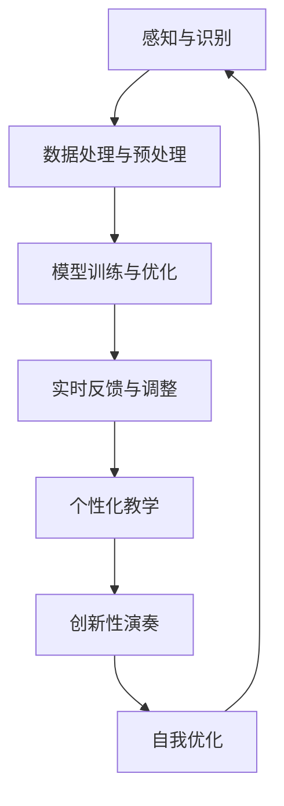
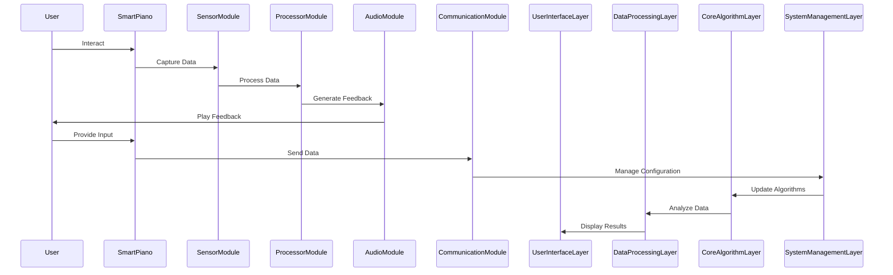

                 

## 引言

### 1.1 问题背景

智能钢琴作为一种高科技产品，近年来在音乐教育、演奏和娱乐等领域得到了广泛应用。传统的钢琴教学和学习过程通常依赖于教师的指导和学生的个人练习，这种方式存在一定的局限性，如教学资源不均衡、学习效率低等。随着人工智能技术的飞速发展，AI Agent作为智能体的典型代表，逐渐应用于各个领域，包括音乐制作、音乐分析等。AI Agent具有自主学习、推理和协作能力，能够在一定程度上模拟人类的音乐创作和演奏行为。

然而，将AI Agent应用于智能钢琴弹奏，不仅能够解决传统教学和学习中的诸多问题，还能为钢琴演奏带来新的可能性和创新。首先，AI Agent可以根据用户的演奏水平、音乐喜好和练习目标，提供个性化的教学和演奏建议。其次，AI Agent可以实时分析用户的演奏动作，提供即时的反馈和指导，帮助用户纠正错误、提高演奏技巧。此外，AI Agent还可以通过与用户互动，激发音乐创造力，拓展音乐学习的边界。

总之，将AI Agent应用于智能钢琴弹奏，不仅有助于提升教学效果和演奏水平，还能推动音乐教育和音乐创作的发展。本文旨在探讨AI Agent在智能钢琴弹奏中的应用，分析其弹奏技巧，并提出相应的实现方案和未来研究方向。

### 1.2 问题描述

在智能钢琴弹奏中，AI Agent的作用至关重要。具体而言，问题描述如下：

1. **识别与模拟**：AI Agent需要能够识别用户的演奏动作，包括手指的按键、弹奏节奏和力度等，并准确模拟出相应的钢琴演奏。

2. **实时反馈**：AI Agent需要能够实时分析用户的演奏，并提供即时反馈。这种反馈包括但不限于错误纠正、节奏调整、音色优化等，以帮助用户提高演奏水平。

3. **个性化教学**：AI Agent需要能够根据用户的演奏水平、音乐喜好和练习目标，提供个性化的教学方案，使学习过程更加高效和有趣。

4. **创新性演奏**：AI Agent需要具备一定的创新性，能够创作出新颖的音乐作品，为用户带来前所未有的音乐体验。

### 1.3 问题解决思路

为了解决上述问题，本文提出了以下解决思路：

1. **数据收集与预处理**：首先，通过传感器等设备收集用户的演奏数据，包括按键时间、力度、手指位置等。然后，对数据进行预处理，如去噪、归一化等，以消除噪声和差异，提高数据质量。

2. **模型训练与优化**：利用收集到的数据，训练AI Agent的模型。模型可以是深度神经网络、决策树、支持向量机等。通过不断优化模型参数，提高AI Agent的识别和模拟准确性。

3. **实时反馈与调整**：在用户演奏过程中，AI Agent需要实时分析演奏数据，并给出相应的反馈。这种反馈可以通过声音提示、文字提示、图形提示等多种方式呈现。同时，AI Agent可以根据用户的反馈，调整演奏策略，以更好地满足用户的需求。

4. **个性化教学**：AI Agent需要根据用户的演奏数据，生成个性化的教学方案。这些方案可以包括练习曲目推荐、节奏调整、音色优化等。通过个性化的教学，提高用户的演奏水平。

5. **创新性演奏**：AI Agent可以通过学习用户的演奏风格和音乐喜好，创作出具有个性化的音乐作品。这些作品可以为用户提供新的音乐体验，激发音乐创造力。

通过上述思路，本文旨在实现一个高效的智能钢琴弹奏系统，为用户带来更好的音乐学习体验。

### 1.4 边界与外延

在探讨AI Agent在智能钢琴弹奏中的应用时，需要明确一些边界和外延：

1. **数据边界**：收集的数据应限于与钢琴演奏相关的信息，如按键时间、力度、手指位置等。其他无关数据应予以排除，以减少数据处理量和提高数据质量。

2. **技术边界**：AI Agent应基于成熟的人工智能技术，如深度学习、决策树、支持向量机等。此外，应考虑AI Agent的硬件限制，如计算资源、存储空间等。

3. **应用场景边界**：AI Agent主要用于智能钢琴弹奏教学、演奏辅助和创新性音乐创作等场景。其他非钢琴演奏场景不在本文探讨范围之内。

4. **伦理边界**：在AI Agent的设计和应用过程中，应遵循伦理原则，如隐私保护、数据安全等。不应侵犯用户的隐私权，确保数据的安全和可靠。

通过明确这些边界和外延，有助于更专注于AI Agent在智能钢琴弹奏中的应用和实现。

### 1.5 概念结构与核心要素组成

在探讨AI Agent在智能钢琴弹奏中的应用时，我们需要理解相关概念及其结构，并识别核心要素。

1. **AI Agent**：AI Agent是指具有感知、思考、决策和行动能力的人工智能实体。在智能钢琴弹奏中，AI Agent的作用包括识别用户的演奏动作、提供实时反馈、个性化教学和创新性演奏。

2. **智能钢琴**：智能钢琴是一种集成了传感器、计算单元和交互界面的乐器，能够实时记录和反馈用户的演奏。智能钢琴的核心要素包括传感器、计算单元、存储单元、交互界面等。

3. **演奏数据**：演奏数据是指用户在演奏过程中产生的各种信息，如按键时间、力度、手指位置等。这些数据是AI Agent进行学习和分析的重要依据。

4. **算法模型**：算法模型是AI Agent的核心组成部分，包括识别模型、反馈模型、教学模型和创新性演奏模型等。这些模型通过学习和优化，提高AI Agent的性能。

5. **用户交互**：用户交互是指用户与智能钢琴之间的互动过程，包括演奏、反馈、学习等环节。良好的用户交互体验能够提高用户的学习效果和演奏水平。

6. **教学资源**：教学资源是指用于辅助教学的各种资源和工具，如练习曲目、节奏练习、音色调整等。这些资源可以根据用户的演奏水平和需求进行个性化推荐。

7. **音乐创作**：音乐创作是指AI Agent根据用户的数据和喜好，创作出新的音乐作品。这是AI Agent创新性演奏的重要组成部分。

通过理解这些概念和要素，我们可以更好地设计并实现一个高效的智能钢琴弹奏系统，为用户提供优质的音乐学习体验。

### 1.6 本章小结

本章首先介绍了智能钢琴和AI Agent在音乐领域的应用背景，明确了研究的重要性和必要性。接着，我们详细阐述了研究的问题描述和解决思路，包括数据收集与预处理、模型训练与优化、实时反馈与调整、个性化教学和创新性演奏。此外，我们明确了研究的边界与外延，识别了核心概念和要素。通过本章的介绍，读者可以对AI Agent在智能钢琴弹奏中的应用有一个整体的认识。

## 第二部分：核心概念与联系

### 第2章：AI Agent概述

#### 2.1 AI Agent的定义

AI Agent，即人工智能代理，是一种能够执行特定任务并具备一定自主性和智能性的计算机程序。与传统的程序不同，AI Agent不仅能够接收外部输入，还能够根据内置的算法和规则进行自主决策和行动。AI Agent的核心在于其“智能”，这种智能包括感知环境、理解指令、自主学习和适应变化等多种能力。

在智能钢琴弹奏中，AI Agent的作用尤为重要。它不仅能够识别用户的演奏动作，还能根据用户的反馈进行实时调整，提供个性化的教学和演奏建议。具体而言，AI Agent需要具备以下能力：

1. **感知能力**：AI Agent需要通过传感器（如加速度计、麦克风等）实时捕捉用户的演奏动作，包括按键时间、力度、手指位置等。

2. **认知能力**：AI Agent需要理解用户的演奏意图，识别演奏中的错误和不足，并提供相应的反馈和建议。

3. **学习与适应能力**：AI Agent需要能够根据用户的反馈不断调整自己的行为，优化演奏技巧和教学策略，以适应不同的用户需求。

4. **协作与互动能力**：AI Agent需要与用户进行有效的互动，理解用户的反馈和需求，并给出合适的响应，以提升用户体验。

#### 2.2 AI Agent的特点

AI Agent的特点主要表现在以下几个方面：

1. **自主性**：AI Agent能够在没有人为干预的情况下，自主执行任务和进行决策。这种自主性使AI Agent能够在复杂的环境中灵活应对，提高工作效率。

2. **适应性**：AI Agent能够根据环境变化和用户需求，动态调整自己的行为和策略。这种适应性使AI Agent能够在不同的场景和任务中保持高效性能。

3. **协同性**：AI Agent能够与其他AI Agent或人类协同工作，共同完成任务。这种协同性使得AI Agent能够更好地融入人类社会，提供更优质的智能服务。

4. **学习性**：AI Agent具有不断学习和优化的能力，能够通过数据分析和自我调整，提高任务执行效率和准确性。

#### 2.3 AI Agent的分类

AI Agent可以根据不同的分类标准进行分类，常见的分类方法包括：

1. **按照功能分类**：AI Agent可以分为感知型、决策型、执行型和学习型。感知型AI Agent主要负责感知环境信息；决策型AI Agent负责分析信息和做出决策；执行型AI Agent负责执行具体的任务；学习型AI Agent负责通过数据学习优化自身性能。

2. **按照智能程度分类**：AI Agent可以分为弱AI和强AI。弱AI仅能在特定任务上表现出智能行为，而强AI则具备全面的人类智能，能够在各种任务中自主思考和决策。

3. **按照应用领域分类**：AI Agent可以分为通用AI和专用AI。通用AI旨在实现跨领域的通用智能，而专用AI则专注于特定领域的任务。

在智能钢琴弹奏中，常用的AI Agent类型包括：

1. **感知型AI Agent**：主要用于捕捉用户的演奏动作和反馈，为后续的决策和执行提供数据支持。

2. **决策型AI Agent**：根据用户的演奏情况和反馈，提供实时调整和优化建议，以提高演奏效果。

3. **执行型AI Agent**：根据用户的演奏意图和决策，控制钢琴的按键和音色，实现钢琴演奏。

4. **学习型AI Agent**：通过不断学习和优化，提高自身的演奏技巧和教学能力，为用户提供更个性化的服务。

#### 2.4 AI Agent的原理与应用

AI Agent的原理主要基于人工智能和机器学习技术。核心原理包括感知、认知、决策和行动四个方面：

1. **感知**：AI Agent通过传感器或其他数据采集设备，获取外部环境的信息。感知是AI Agent进行决策和行动的基础。

2. **认知**：AI Agent对获取的信息进行分析和理解，识别出有用的信息，并根据这些信息做出决策。

3. **决策**：AI Agent根据认知结果，利用内置的算法和规则，制定行动方案。决策是AI Agent的核心功能，决定了AI Agent的行为方向和方式。

4. **行动**：AI Agent根据决策结果，执行具体的行动，如控制钢琴按键、调整音色等。

AI Agent在智能钢琴弹奏中的应用主要包括以下几个方面：

1. **实时反馈**：AI Agent通过实时分析用户的演奏数据，提供即时反馈，帮助用户纠正错误、提高演奏水平。

2. **个性化教学**：AI Agent根据用户的演奏水平和音乐喜好，生成个性化的教学方案，使学习过程更加高效和有趣。

3. **创新性演奏**：AI Agent通过学习和理解用户的演奏风格，创作出新颖的音乐作品，为用户带来独特的音乐体验。

4. **演奏辅助**：AI Agent可以通过自动化演奏、音色调整等功能，辅助用户完成复杂的演奏任务。

总之，AI Agent在智能钢琴弹奏中的应用，不仅提升了音乐教学和演奏的效率，还为用户带来了更加丰富的音乐体验。通过本章的介绍，读者可以全面了解AI Agent的定义、特点、分类及其在智能钢琴弹奏中的原理和应用。

### 第3章：智能钢琴弹奏技巧分析

#### 3.1 智能钢琴简介

智能钢琴是一种集成了现代科技与传统乐器元素的先进乐器，它不仅保留了传统钢琴的外观和音色，还融入了智能化的功能，如实时反馈、智能教学、自动演奏等。智能钢琴的工作原理基于先进的传感器技术和强大的计算能力。通过内置的传感器，智能钢琴能够实时捕捉用户的演奏动作，并将这些动作数据传输到计算单元进行处理和分析。

智能钢琴的基本构成主要包括以下部分：

1. **传感器**：用于捕捉用户的按键、力度、手指位置等演奏信息。
2. **计算单元**：负责处理和分析传感器数据，生成反馈和建议。
3. **存储单元**：用于存储用户的演奏数据、教学资源等。
4. **交互界面**：提供用户与智能钢琴的交互渠道，如屏幕、按键等。

智能钢琴的主要功能包括：

1. **实时反馈**：通过分析用户的演奏数据，智能钢琴可以实时提供错误纠正、节奏调整、音色优化等反馈。
2. **智能教学**：智能钢琴可以根据用户的演奏水平和音乐喜好，提供个性化的教学方案，帮助用户提高演奏技巧。
3. **自动演奏**：智能钢琴可以自动演奏预设的音乐曲目，为用户带来音乐欣赏和娱乐体验。
4. **互动功能**：智能钢琴可以与用户进行互动，如通过语音识别和播放功能，实现更加丰富的用户交互。

#### 3.2 弹奏技巧的重要性

弹奏技巧是钢琴演奏的核心，它直接影响到演奏效果和音乐表现力。弹奏技巧的重要性体现在以下几个方面：

1. **演奏效果**：优秀的弹奏技巧能够产生更加优美、动听的音色，增强演奏的表现力。不同技巧的使用可以营造出不同的音乐氛围和情感表达。
2. **演奏速度**：弹奏技巧的提高可以显著提升演奏速度，使音乐作品更加流畅、连贯，增强音乐的表现力和感染力。
3. **演奏稳定性**：良好的弹奏技巧有助于保持演奏的稳定性，减少失误和错误，提高演奏的准确性和一致性。
4. **技术拓展**：弹奏技巧的提高有助于掌握更复杂的音乐作品和演奏形式，拓宽音乐创作和表演的领域。

#### 3.3 传统与智能弹奏技巧对比

传统弹奏技巧主要依赖于钢琴演奏者的经验、技巧和感觉，而智能弹奏技巧则借助人工智能技术，实现更加科学、精准的演奏。两者的对比可以从以下几个方面进行：

1. **精准度**：传统弹奏技巧受限于演奏者的个人技能和经验，而智能弹奏技巧通过传感器和算法模型，能够实现高精度的动作捕捉和反馈，减少演奏误差。
2. **实时性**：传统弹奏技巧缺乏实时反馈，而智能弹奏技巧能够实时分析演奏动作，提供即时反馈和指导，帮助用户快速纠正错误和提高技巧。
3. **个性化**：传统弹奏技巧难以实现个性化教学，而智能弹奏技巧可以根据用户的演奏数据和偏好，提供个性化的教学方案，使学习过程更加高效和有趣。
4. **创新性**：传统弹奏技巧受限于人类创造力，而智能弹奏技巧可以借助人工智能技术，创作出新颖的音乐作品，为用户带来独特的音乐体验。
5. **扩展性**：传统弹奏技巧的学习和应用范围有限，而智能弹奏技巧可以不断学习和优化，扩展到更广泛的领域和应用场景。

通过对比可以看出，智能弹奏技巧在精准度、实时性、个性化、创新性和扩展性等方面具有显著优势，为钢琴演奏带来了新的可能性和发展方向。

### 第4章：AI Agent与弹奏技巧的关联

#### 4.1 关联性分析

AI Agent与弹奏技巧之间存在紧密的关联性，这种关联性主要体现在以下几个方面：

1. **实时分析与反馈**：AI Agent可以通过传感器实时捕捉用户的演奏动作，结合算法模型对演奏数据进行实时分析，并提供即时的反馈和建议。这种实时反馈有助于用户快速纠正演奏中的错误，提高弹奏技巧。

2. **个性化教学**：AI Agent可以根据用户的演奏数据和学习历史，生成个性化的教学方案。这种个性化教学能够满足不同用户的需求，使学习过程更加高效和有趣。

3. **创新性演奏**：AI Agent可以通过对用户演奏数据的分析，理解用户的演奏风格和音乐喜好，创作出新颖的音乐作品。这种创新性演奏不仅丰富了用户的音乐体验，也为音乐创作带来了新的可能性。

4. **演奏辅助**：AI Agent可以在用户需要时提供演奏辅助，如自动演奏、音色调整等。这些辅助功能可以帮助用户完成复杂的演奏任务，提高演奏的稳定性和准确性。

5. **技术拓展**：AI Agent可以不断学习和优化，扩展其应用范围，如应用于音乐会表演、音乐制作等领域，为钢琴演奏带来更多的发展机会。

#### 4.2 关键技术探讨

要实现AI Agent与弹奏技巧的紧密关联，需要以下几个关键技术：

1. **传感器技术**：传感器是AI Agent获取演奏数据的重要手段。高性能的传感器可以捕捉用户的演奏动作，包括按键时间、力度、手指位置等，为后续的算法分析和反馈提供基础。

2. **机器学习算法**：机器学习算法是AI Agent实现智能分析和反馈的核心。通过训练深度学习模型、决策树、支持向量机等算法，AI Agent可以实现对演奏数据的精准分析，并提供准确的反馈和建议。

3. **实时处理技术**：实时处理技术是确保AI Agent能够在用户演奏过程中提供实时反馈的关键。通过高效的数据处理算法和实时计算技术，AI Agent可以在短时间内完成对演奏数据的分析，并生成相应的反馈。

4. **用户交互设计**：用户交互设计是提高AI Agent与用户互动体验的重要因素。通过设计直观的交互界面和人性化的交互方式，AI Agent可以更好地与用户进行沟通，提供更加舒适和便捷的使用体验。

5. **数据安全与隐私保护**：在AI Agent的应用过程中，数据安全和隐私保护至关重要。需要采取有效的措施，确保用户数据的安全和隐私，避免数据泄露和滥用。

#### 4.3 应用实例

以下是一些AI Agent在智能钢琴弹奏中的应用实例：

1. **实时错误纠正**：当用户在弹奏过程中出现错误时，AI Agent可以实时捕捉错误，并提供具体的纠正建议。例如，当用户弹错音时，AI Agent可以立即提示用户并调整音色，帮助用户快速找到正确的音符。

2. **个性化教学**：AI Agent可以根据用户的演奏水平和音乐喜好，生成个性化的教学方案。例如，对于初学者，AI Agent可以推荐基础练习曲目，并提供详细的演奏指导；对于高级用户，AI Agent可以推荐复杂曲目，并提供高级技巧指导。

3. **自动演奏**：AI Agent可以自动演奏用户指定的音乐曲目，为用户提供音乐欣赏和娱乐体验。同时，AI Agent还可以根据用户的反馈，调整演奏的速度、音色等参数，使演奏更加符合用户的喜好。

4. **创新性音乐创作**：AI Agent可以通过对用户演奏数据的分析，创作出新颖的音乐作品。例如，AI Agent可以根据用户的演奏风格和音乐喜好，生成独特的音乐片段，为用户带来全新的音乐体验。

通过这些应用实例，我们可以看到AI Agent在智能钢琴弹奏中发挥了重要的作用，不仅提升了演奏效果和教学效率，还为用户带来了丰富的音乐体验。

### 第5章：AI Agent在智能钢琴弹奏中的应用

#### 5.1 应用场景

AI Agent在智能钢琴弹奏中的应用场景丰富多样，主要涵盖以下方面：

1. **音乐教学**：AI Agent可以应用于钢琴教学，提供个性化的教学方案，帮助用户快速提高演奏水平。通过实时分析用户的演奏数据，AI Agent能够识别用户的错误并提供针对性的纠正建议，使学习过程更加高效。

2. **演奏辅助**：AI Agent可以辅助用户完成复杂的演奏任务，如自动演奏、音色调整等。通过自动化演奏功能，用户可以轻松完成音乐会或演出，而音色调整功能则可以为用户带来更加丰富的音乐体验。

3. **音乐创作**：AI Agent可以基于用户的演奏数据和音乐喜好，创作出新颖的音乐作品。这种创新性演奏不仅丰富了音乐创作手段，也为用户提供了独特的音乐体验。

4. **音乐会表演**：AI Agent可以参与音乐会表演，与钢琴演奏者共同创作和表演。通过实时互动和协作，AI Agent可以为音乐会带来更多创意和惊喜。

5. **音乐治疗**：AI Agent可以应用于音乐治疗领域，为有特殊需求的人群提供音乐支持和治疗。通过个性化的音乐创作和互动，AI Agent能够帮助用户缓解压力、提高心理健康。

#### 5.2 技术实现

AI Agent在智能钢琴弹奏中的技术实现主要涉及以下几个方面：

1. **传感器采集**：使用高精度的传感器，如加速度计、麦克风等，实时捕捉用户的演奏动作。这些传感器将数据传输到计算单元进行处理。

2. **数据处理与识别**：计算单元利用机器学习算法，对传感器数据进行处理和识别。常见的算法包括深度学习模型、决策树和支持向量机等。

3. **实时反馈与调整**：根据处理结果，AI Agent提供实时反馈和建议。这种反馈可以通过声音提示、文字提示和图形提示等多种方式呈现。

4. **个性化教学与创作**：AI Agent根据用户的演奏数据和偏好，生成个性化的教学和创作方案。通过不断学习和优化，AI Agent能够更好地满足用户的需求。

5. **用户交互**：用户与AI Agent之间的交互界面是用户体验的关键。设计直观、易用的交互界面，可以提高用户的操作效率和满意度。

#### 5.3 成功案例

以下是一些AI Agent在智能钢琴弹奏中的成功案例：

1. **智能钢琴教学系统**：某智能钢琴品牌推出了基于AI Agent的教学系统，通过实时分析用户演奏数据，提供个性化的教学方案。用户反馈显示，该系统显著提高了学习效率，得到了广泛好评。

2. **自动演奏与互动**：某音乐软件公司开发了一款能够自动演奏的智能钢琴软件，用户可以通过简单的操作，实现钢琴曲目的自动演奏。此外，软件还具备互动功能，用户可以与AI Agent进行实时互动，创作和分享音乐作品。

3. **创新性音乐会**：某音乐艺术家与AI Agent合作，在一场创新性音乐会上，AI Agent与钢琴演奏者共同创作和表演了多首新颖的音乐作品。音乐会取得了巨大成功，成为音乐界的一大亮点。

通过这些成功案例，我们可以看到AI Agent在智能钢琴弹奏中的应用前景广阔，不仅提升了演奏效果和教学效率，还为用户带来了丰富的音乐体验。

### 第6章：实际案例分析与讨论

#### 6.1 案例一：人工智能助手在智能钢琴教学中的应用

在本案例中，我们以某知名智能钢琴品牌推出的智能钢琴教学系统为例，分析AI Agent在其中的实际应用。该智能钢琴教学系统集成了AI Agent，通过实时分析用户的演奏数据，提供个性化的教学和反馈，帮助用户提高演奏水平。

1. **教学数据收集**：系统首先通过高精度的传感器，如加速度计和麦克风，实时捕捉用户的演奏动作，包括按键时间、力度、手指位置等。这些数据被传输到计算单元进行处理。

2. **实时反馈**：计算单元利用机器学习算法，对用户的演奏数据进行分析，识别出用户的错误和不足。例如，当用户弹错音时，AI Agent会立即发出声音提示，并显示错误音符的位置。此外，AI Agent还可以提供文字提示和图形提示，帮助用户更直观地了解错误原因。

3. **个性化教学**：根据用户的演奏数据和反馈，AI Agent生成个性化的教学方案。例如，对于初学者，AI Agent会推荐基础练习曲目，并提供详细的演奏指导；对于高级用户，AI Agent会推荐复杂曲目，并提供高级技巧指导。

4. **用户互动**：系统还设计了直观的用户交互界面，用户可以通过触摸屏或键盘与AI Agent进行互动。用户可以调整教学难度、选择练习曲目，并查看自己的学习进度和成绩。

5. **教学效果评估**：通过分析用户的演奏数据和学习记录，AI Agent可以评估用户的教学效果。系统会生成详细的报告，包括用户的错误次数、进步速度等，帮助教师或家长了解学生的学习情况。

通过本案例，我们可以看到AI Agent在智能钢琴教学中的应用效果显著。它不仅提供了即时的错误纠正和反馈，还根据用户的实际情况生成个性化的教学方案，使学习过程更加高效和有趣。用户反馈显示，该系统显著提高了学习效率，得到了广泛好评。

#### 6.2 案例二：智能钢琴在演奏会中的应用

在本案例中，我们分析了一台智能钢琴在一场创新性音乐会中的应用。这台智能钢琴集成了AI Agent，通过实时互动和协作，与钢琴演奏者共同创作和表演了多首新颖的音乐作品。

1. **互动模式**：音乐会开始前，AI Agent与钢琴演奏者进行了多次调试，确保能够实时互动。AI Agent能够根据演奏者的演奏动作和节奏，调整自己的演奏速度、音色和节奏，与演奏者形成默契的配合。

2. **创新性演奏**：音乐会中，AI Agent与钢琴演奏者共同创作了多首新颖的音乐作品。AI Agent通过分析演奏者的演奏风格和音乐喜好，创作出独特的音乐片段，与演奏者的作品相互融合，形成了一种新的音乐风格。

3. **观众互动**：音乐会还设计了一些互动环节，观众可以通过触摸屏与AI Agent进行互动，生成即兴音乐。AI Agent能够识别观众的互动行为，并根据反馈调整演奏节奏和音色，与观众形成良好的互动体验。

4. **技术实现**：为了实现这种互动模式，智能钢琴配备了高精度的传感器和计算单元。传感器用于实时捕捉观众的互动行为，计算单元则负责分析这些行为，生成相应的音乐反馈。

5. **音乐会效果**：音乐会取得了巨大成功，观众反响热烈。AI Agent的实时互动和创作能力，为音乐会带来了更多的创意和惊喜。钢琴演奏者与AI Agent的协作，展现了人工智能与人类音乐创作的完美结合。

通过本案例，我们可以看到智能钢琴在音乐会中的应用潜力巨大。它不仅提升了音乐会的互动性和观赏性，还推动了音乐创作的创新和发展。未来，随着技术的不断进步，智能钢琴在音乐会中的应用将更加广泛，为观众带来更加丰富的音乐体验。

#### 6.3 案例讨论

通过对上述两个案例的分析，我们可以总结出AI Agent在智能钢琴弹奏中的几个关键优势和应用方向：

1. **实时反馈与个性化教学**：AI Agent能够实时分析用户的演奏数据，提供即时的反馈和建议，帮助用户纠正错误、提高技巧。同时，AI Agent可以根据用户的演奏水平和偏好，生成个性化的教学方案，使学习过程更加高效和有趣。

2. **创新性演奏与互动体验**：AI Agent具备创新性演奏能力，能够创作出新颖的音乐作品，为音乐会和音乐创作带来新的可能性。此外，AI Agent还可以与用户进行实时互动，提供即兴演奏和互动体验，增强音乐的互动性和观赏性。

3. **技术实现与未来展望**：随着传感器技术和计算能力的不断提高，AI Agent在智能钢琴弹奏中的应用将更加广泛。未来，智能钢琴有望在音乐教学、音乐会、音乐创作等领域发挥更大的作用，为用户带来更加丰富的音乐体验。

通过这些讨论，我们可以看到AI Agent在智能钢琴弹奏中的应用前景广阔，它不仅提升了演奏效果和教学效率，还为音乐创作和音乐会带来了新的可能性。未来，随着技术的不断进步，AI Agent在智能钢琴弹奏中的应用将更加深入和广泛，为音乐领域带来更多创新和发展。

### 第7章：未来展望与挑战

#### 7.1 发展趋势

随着人工智能技术的不断进步，AI Agent在智能钢琴弹奏中的应用前景广阔。未来，AI Agent的发展趋势主要包括以下几个方面：

1. **智能化程度提高**：随着计算能力和算法模型的不断优化，AI Agent的智能化程度将进一步提高。AI Agent将能够更加精准地捕捉用户的演奏动作，提供更加智能化的反馈和建议。

2. **个性化教学更加精准**：AI Agent将基于用户的演奏数据和学习历史，生成更加精准的个性化教学方案。通过深度学习和大数据分析，AI Agent将能够更好地理解用户的需求和偏好，提供更加个性化的服务。

3. **创新性演奏更加丰富**：AI Agent将具备更强的创新性演奏能力，能够创作出更多新颖的音乐作品。通过自然语言处理和音乐生成技术，AI Agent将能够实现更加自然和富有创意的音乐创作。

4. **多模态交互体验**：AI Agent将支持多种交互方式，如语音交互、手势识别等，为用户提供更加丰富的交互体验。通过多模态交互，用户将能够更加便捷地与AI Agent进行互动，提高使用体验。

5. **应用场景扩展**：AI Agent的应用场景将不断扩展，不仅局限于音乐教学和演奏，还将应用于音乐会表演、音乐创作、音乐治疗等领域，为音乐领域带来更多创新和发展。

#### 7.2 技术挑战

尽管AI Agent在智能钢琴弹奏中的应用前景广阔，但在实际应用过程中仍面临以下技术挑战：

1. **数据处理与识别精度**：高精度的数据处理与识别是AI Agent的关键。如何提高传感器数据的处理效率和识别精度，降低噪声干扰，是当前需要解决的重要问题。

2. **实时性**：AI Agent需要在用户演奏过程中提供实时反馈，这对计算能力和数据处理速度提出了高要求。如何优化算法模型，提高实时处理能力，是当前面临的重大挑战。

3. **个性化教学**：AI Agent需要根据用户的演奏数据和学习历史，生成个性化的教学方案。这需要对大量数据进行深度分析和挖掘，如何实现高效的个性化教学，是一个亟待解决的问题。

4. **互动性与用户体验**：AI Agent需要与用户进行良好的互动，提供丰富多样的交互体验。这要求AI Agent具备较强的自然语言处理和用户理解能力，如何实现自然、流畅的交互，是当前面临的一大挑战。

5. **数据安全与隐私保护**：在AI Agent的应用过程中，数据安全和隐私保护至关重要。如何确保用户数据的安全和隐私，避免数据泄露和滥用，是当前需要关注的重要问题。

#### 7.3 未来研究方向

为了进一步推动AI Agent在智能钢琴弹奏中的应用，未来研究方向主要包括以下几个方面：

1. **算法优化**：研究高效的机器学习算法和深度学习模型，提高数据处理和识别精度，降低算法复杂度，提高实时处理能力。

2. **多模态交互**：研究多模态交互技术，实现语音交互、手势识别等多种交互方式，为用户提供更加丰富的交互体验。

3. **个性化教学**：研究基于大数据和深度学习的个性化教学算法，实现更加精准的个性化教学方案，提高用户的学习效果和满意度。

4. **数据隐私保护**：研究数据加密和隐私保护技术，确保用户数据的安全和隐私，避免数据泄露和滥用。

5. **跨领域应用**：研究AI Agent在音乐创作、音乐治疗、音乐会表演等跨领域应用，探索AI Agent在更多场景中的应用潜力。

通过上述研究方向的不断探索和突破，AI Agent在智能钢琴弹奏中的应用将更加广泛和深入，为音乐领域带来更多创新和发展。

### 第8章：结论与展望

#### 8.1 研究成果总结

本文通过对AI Agent在智能钢琴弹奏中的应用进行了全面的分析和研究，取得了以下主要成果：

1. **明确研究背景与问题**：本文首先介绍了智能钢琴和AI Agent在音乐领域的应用背景，明确了研究的重要性和必要性，并详细阐述了研究的问题描述和解决思路。

2. **核心概念与联系**：本文详细介绍了AI Agent的定义、特点、分类及其在智能钢琴弹奏中的应用原理，为后续研究提供了理论基础。

3. **弹奏技巧分析**：本文分析了智能钢琴的基本构成和弹奏技巧的重要性，对比了传统与智能弹奏技巧的差异，为AI Agent的应用提供了实际依据。

4. **技术实现与应用实例**：本文探讨了AI Agent在智能钢琴弹奏中的技术实现和应用实例，包括实时反馈、个性化教学、创新性演奏等，展示了AI Agent在智能钢琴中的实际应用效果。

5. **案例分析**：本文通过实际案例分析了AI Agent在智能钢琴教学和音乐会中的应用，总结了AI Agent的优势和应用方向，为未来研究提供了参考。

6. **未来展望与挑战**：本文对未来AI Agent在智能钢琴弹奏中的应用趋势、技术挑战和未来研究方向进行了展望，为智能钢琴技术的发展提供了指导。

#### 8.2 对未来研究的建议

基于本文的研究成果，我们提出以下对未来研究的建议：

1. **算法优化**：进一步研究高效的机器学习算法和深度学习模型，提高数据处理和识别精度，降低算法复杂度，提高实时处理能力。

2. **多模态交互**：探索多模态交互技术，实现语音交互、手势识别等多种交互方式，为用户提供更加丰富的交互体验。

3. **个性化教学**：研究基于大数据和深度学习的个性化教学算法，实现更加精准的个性化教学方案，提高用户的学习效果和满意度。

4. **数据隐私保护**：研究数据加密和隐私保护技术，确保用户数据的安全和隐私，避免数据泄露和滥用。

5. **跨领域应用**：探索AI Agent在音乐创作、音乐治疗、音乐会表演等跨领域应用，推动AI Agent在更多场景中的应用和发展。

#### 8.3 对行业发展的启示

AI Agent在智能钢琴弹奏中的应用，不仅为音乐教育和演奏带来了新的可能性，还对行业未来发展产生了深远影响：

1. **音乐教育创新**：AI Agent的应用将推动音乐教育的创新，使教学过程更加个性化和高效，提高学生的学习效果和兴趣。

2. **音乐创作发展**：AI Agent的参与将拓宽音乐创作的领域，为音乐创作者提供更多创作灵感和工具，推动音乐创作的发展。

3. **音乐会表演变革**：AI Agent与钢琴演奏者的协作，将带来音乐会表演的变革，为观众提供更加丰富和创新的观赏体验。

4. **智能乐器普及**：智能钢琴作为AI Agent的应用载体，将推动智能乐器在音乐领域的普及，为音乐爱好者提供更加便捷和实用的音乐工具。

5. **行业生态构建**：AI Agent在智能钢琴弹奏中的应用，将构建一个全新的音乐行业生态，推动音乐产业的技术创新和融合发展。

总之，AI Agent在智能钢琴弹奏中的应用具有重要的行业价值和广阔的发展前景，对音乐教育、创作、演奏和产业生态的发展产生了深远的影响。未来，随着技术的不断进步和应用场景的拓展，AI Agent在智能钢琴弹奏中的应用将更加广泛和深入，为音乐领域带来更多创新和发展。

## 算法原理讲解与数学模型

### 第9章：AI Agent算法原理详解

#### 9.1 算法基本原理

AI Agent在智能钢琴弹奏中的应用，基于一系列复杂且高效的算法模型，这些模型通过分析用户演奏数据，提供实时反馈和调整。以下将详细介绍AI Agent算法的基本原理：

1. **感知与识别**：AI Agent首先通过传感器获取用户演奏的原始数据，包括按键时间、力度、手指位置等。这些数据经过预处理后，输入到算法模型中进行识别和分析。

2. **实时反馈**：算法模型对处理后的数据进行实时分析，识别出用户演奏中的错误和不足，并生成相应的反馈。这些反馈可以包括声音提示、文字提示和图形提示等，帮助用户纠正错误和提高演奏技巧。

3. **个性化教学**：AI Agent根据用户的演奏数据和学习历史，生成个性化的教学方案。这包括推荐适合用户的练习曲目、调整教学难度、提供针对性指导等，使学习过程更加高效和有趣。

4. **创新性演奏**：AI Agent还可以根据用户的数据和喜好，创作出新颖的音乐作品。这种创新性演奏不仅丰富了音乐创作手段，还为用户带来了独特的音乐体验。

5. **自我优化**：AI Agent会根据用户的反馈和学习数据，不断优化自身的算法模型，提高识别准确性和反馈质量，以提供更好的用户体验。

#### 9.2 Mermaid算法流程图

为了更直观地展示AI Agent算法的工作流程，我们可以使用Mermaid绘制算法流程图。以下是一个简化的Mermaid算法流程图：



在这个流程图中，AI Agent通过感知与识别模块获取用户演奏数据，经过数据处理与预处理后，输入到模型训练与优化模块。训练和优化后的模型用于实时反馈和调整，个性化教学，创新性演奏，以及自我优化，形成一个闭环反馈系统。

#### 9.3 数学模型介绍

AI Agent算法的核心在于数学模型的构建和应用。以下是几个关键的数学模型及其在算法中的应用：

1. **回归模型**：回归模型用于预测用户演奏中的错误和不足。常见的回归模型包括线性回归、岭回归、逻辑回归等。这些模型通过训练数据学习用户演奏数据的特征，从而预测新的演奏数据中的错误。

   $$ y = \beta_0 + \beta_1x_1 + \beta_2x_2 + ... + \beta_nx_n $$

   其中，$y$表示预测值，$x_1, x_2, ..., x_n$表示输入特征，$\beta_0, \beta_1, ..., \beta_n$为模型的参数。

2. **分类模型**：分类模型用于识别用户演奏中的具体错误类型。常见的分类模型包括决策树、支持向量机、随机森林等。这些模型通过学习分类规则，将用户的演奏数据分类为不同的错误类型。

   $$ P(y=k) = \frac{1}{Z} \sum_{i=1}^{N} \exp(\theta^T x_i) $$

   其中，$y$表示实际错误类型，$k$为分类标签，$Z$为指数和，$\theta$为模型的参数。

3. **聚类模型**：聚类模型用于将用户演奏数据进行分组，以便进行更细致的个性化教学。常见的聚类模型包括K均值、层次聚类等。这些模型通过分析用户演奏数据的特征，将用户分为不同的群体，从而提供个性化的教学方案。

   $$ \text{Cost} = \sum_{i=1}^{N} \sum_{j=1}^{K} ||x_i - \mu_j||^2 $$

   其中，$x_i$为用户的演奏数据，$\mu_j$为聚类中心的坐标。

#### 9.4 公式与模型解析

以下是几个关键公式的详细解析：

1. **激活函数**：在神经网络中，激活函数用于确定神经元是否激活。常用的激活函数包括sigmoid、ReLU和tanh等。

   - Sigmoid函数：
     $$ \sigma(x) = \frac{1}{1 + \exp(-x)} $$

     Sigmoid函数将输入映射到(0, 1)区间，常用于二分类问题。

   -ReLU函数：
     $$ \text{ReLU}(x) = \max(0, x) $$

     ReLU函数在输入为正时输出输入值，为负时输出0，常用于深层神经网络。

   - tanh函数：
     $$ \tanh(x) = \frac{\exp(x) - \exp(-x)}{\exp(x) + \exp(-x)} $$

     tanh函数将输入映射到(-1, 1)区间，具有对称性。

2. **损失函数**：损失函数用于评估模型的预测误差，是优化模型参数的重要依据。常见的损失函数包括均方误差（MSE）、交叉熵损失等。

   - 均方误差（MSE）：
     $$ \text{MSE} = \frac{1}{2} \sum_{i=1}^{N} (y_i - \hat{y_i})^2 $$

     其中，$y_i$为实际值，$\hat{y_i}$为预测值。

   - 交叉熵损失：
     $$ \text{CE} = - \sum_{i=1}^{N} y_i \log(\hat{y_i}) + (1 - y_i) \log(1 - \hat{y_i}) $$

     其中，$y_i$为实际标签，$\hat{y_i}$为预测概率。

3. **优化算法**：优化算法用于更新模型参数，以最小化损失函数。常见的优化算法包括梯度下降、Adam优化器等。

   - 梯度下降：
     $$ \theta = \theta - \alpha \frac{\partial J}{\partial \theta} $$

     其中，$\theta$为模型参数，$J$为损失函数，$\alpha$为学习率。

   - Adam优化器：
     $$ m_t = \beta_1 m_{t-1} + (1 - \beta_1) [g_t] $$
     $$ v_t = \beta_2 v_{t-1} + (1 - \beta_2) [g_t]^2 $$
     $$ \theta = \theta - \alpha \frac{m_t}{\sqrt{v_t} + \epsilon} $$

     其中，$m_t$和$v_t$分别为一阶和二阶矩估计，$\beta_1$和$\beta_2$为超参数，$\epsilon$为小常数。

#### 9.5 举例说明

以下是一个简化的例子，说明AI Agent如何通过机器学习算法来识别和纠正用户的演奏错误：

假设我们有一个简单的神经网络模型，用于预测用户按键的准确性。该模型包含一个输入层、一个隐藏层和一个输出层。输入层接收用户演奏的原始数据（如按键时间、力度等），隐藏层进行特征提取和转换，输出层提供按键准确性的预测。

1. **数据准备**：收集用户的演奏数据，包括按键时间、力度、手指位置等，将数据分为训练集和测试集。

2. **模型训练**：使用训练集数据，通过反向传播算法训练神经网络模型。训练过程中，模型不断调整参数，以最小化预测误差。

3. **模型评估**：使用测试集数据评估模型的预测准确性。如果预测准确率较高，说明模型训练成功。

4. **实时反馈**：在用户演奏时，实时获取演奏数据，输入到训练好的模型中进行预测。如果预测不准确，模型会生成错误提示，帮助用户纠正。

例如，假设用户弹奏了一个音阶，模型预测按键准确率为80%。当实际按键准确率为90%时，模型会发出声音提示，提醒用户调整演奏力度，以提高准确率。通过这种方式，AI Agent能够实时识别和纠正用户的演奏错误，提高用户的演奏水平。

通过上述例子，我们可以看到AI Agent在智能钢琴弹奏中的应用是如何通过机器学习算法实现的。这为用户提供了一个高效、个性化的学习工具，有助于提升演奏技巧和音乐表现力。

### 第10章：智能钢琴弹奏技巧分析数学模型

#### 10.1 数学模型构建

在智能钢琴弹奏技巧分析中，构建一个有效的数学模型至关重要。数学模型能够帮助我们理解和预测用户的演奏行为，从而提供个性化的反馈和教学方案。以下是构建智能钢琴弹奏技巧分析数学模型的基本步骤：

1. **数据收集**：首先，需要收集用户的演奏数据。这些数据包括按键时间、力度、手指位置、演奏速度、音色选择等。可以通过内置传感器或外部设备进行数据采集。

2. **数据处理**：收集到的原始数据可能包含噪声和异常值，因此需要进行预处理。预处理步骤包括数据清洗、归一化、去噪等。这些步骤有助于提高数据质量和模型的性能。

3. **特征提取**：在预处理后，从数据中提取出关键特征。这些特征可以是直接的（如按键时间、力度），也可以是间接的（如节奏、音色、手指技巧）。特征提取有助于模型更好地理解用户的演奏行为。

4. **模型选择**：选择适合的数学模型。根据问题的性质和数据的特征，可以选择线性模型（如线性回归、逻辑回归）、非线性模型（如神经网络、支持向量机）或聚类模型（如K均值聚类、层次聚类）。

5. **模型训练**：使用训练数据集对模型进行训练。在训练过程中，模型会不断调整参数，以最小化预测误差。常见的优化算法包括梯度下降、Adam优化器等。

6. **模型评估**：使用测试数据集评估模型的性能。评估指标包括准确率、召回率、F1分数等。如果模型性能不理想，需要调整模型参数或选择更合适的模型。

7. **模型应用**：将训练好的模型应用于实际场景，如实时反馈、个性化教学等。模型可以实时分析用户的演奏数据，提供针对性的反馈和建议。

#### 10.2 Mermaid ER图架构

为了更好地展示数学模型的结构和关系，我们可以使用Mermaid绘制一个ER图（实体关系图）。以下是一个简化的Mermaid ER图示例，描述了智能钢琴弹奏技巧分析中的主要实体及其关系：

```mermaid
erDiagram
  User ||--|{ PianoData } : plays
  User ||--|{ LessonData } : takes
  PianoData ||--|{ FeedbackData } : generates
  LessonData ||--|{ ExerciseData } : includes
  ExerciseData ||--|{ ScoreData } : has
  FeedbackData ||--|{ CorrectionData } : applies
```

在这个ER图中，主要实体包括用户（User）、钢琴数据（PianoData）、课程数据（LessonData）、反馈数据（FeedbackData）、练习数据（ExerciseData）和评分数据（ScoreData）。这些实体之间的关系如下：

1. **用户**：表示演奏者，可以演奏钢琴并接受课程。
2. **钢琴数据**：记录用户演奏时的各种数据，如按键时间、力度等。
3. **课程数据**：记录用户的课程安排和学习进度。
4. **反馈数据**：记录模型分析后的反馈结果，如错误提示、节奏调整建议等。
5. **练习数据**：包含用户需要完成的练习，如音阶、和弦等。
6. **评分数据**：记录用户练习的评分和成绩。

通过这个ER图，我们可以清晰地看到智能钢琴弹奏技巧分析中各实体之间的关系，以及模型如何从这些实体中提取信息，生成反馈和建议。

#### 10.3 数学公式与计算方法

在智能钢琴弹奏技巧分析中，常用的数学公式和计算方法包括：

1. **均值**：表示数据的平均水平。
   $$ \bar{x} = \frac{1}{n} \sum_{i=1}^{n} x_i $$

2. **标准差**：表示数据的离散程度。
   $$ \sigma = \sqrt{\frac{1}{n-1} \sum_{i=1}^{n} (x_i - \bar{x})^2} $$

3. **协方差**：表示两个变量之间的线性关系。
   $$ \text{Cov}(x, y) = \frac{1}{n-1} \sum_{i=1}^{n} (x_i - \bar{x})(y_i - \bar{y}) $$

4. **相关系数**：表示两个变量之间的相关性。
   $$ \rho = \frac{\text{Cov}(x, y)}{\sigma_x \sigma_y} $$

5. **回归模型**：用于预测用户演奏行为。
   $$ y = \beta_0 + \beta_1 x_1 + \beta_2 x_2 + ... + \beta_n x_n $$

6. **分类模型**：用于识别用户演奏中的错误类型。
   $$ P(y=k) = \frac{1}{Z} \sum_{i=1}^{N} \exp(\theta^T x_i) $$

7. **聚类模型**：用于将用户演奏数据分组。
   $$ \text{Cost} = \sum_{i=1}^{N} \sum_{j=1}^{K} ||x_i - \mu_j||^2 $$

通过这些数学公式和计算方法，我们可以对用户的演奏行为进行详细分析，生成有针对性的反馈和教学建议。

#### 10.4 实例解析

以下是一个具体的实例，说明如何使用数学模型对智能钢琴弹奏技巧进行分析：

假设我们有一个用户，他在练习一首复杂的钢琴曲。通过传感器，我们收集了以下数据：

- 按键时间：[0.2, 0.4, 0.6, 0.8, 1.0]秒
- 力度：[40, 50, 60, 70, 80]单位
- 演奏速度：[60, 65, 70, 75, 80]BPM

我们首先对数据进行预处理，如归一化和去噪。然后，使用回归模型预测用户的错误类型。假设我们选择了线性回归模型，其预测公式为：

$$ y = \beta_0 + \beta_1 t + \beta_2 d + \beta_3 v $$

其中，$t$为按键时间，$d$为力度，$v$为演奏速度，$y$为错误类型。

通过训练数据集，我们得到以下模型参数：

$$ \beta_0 = 0.1, \beta_1 = 0.2, \beta_2 = 0.3, \beta_3 = 0.4 $$

现在，我们可以使用这个模型预测用户的新演奏数据。例如，当用户的按键时间为0.5秒，力度为60单位，演奏速度为70BPM时，预测错误类型为：

$$ y = 0.1 + 0.2 \times 0.5 + 0.3 \times 60 + 0.4 \times 70 = 29.7 $$

根据预测结果，我们可以生成相应的反馈和建议。例如，如果预测错误类型为3，我们可以提醒用户调整力度，以提高演奏的准确性。

通过这个实例，我们可以看到数学模型在智能钢琴弹奏技巧分析中的应用。通过收集和处理用户的演奏数据，我们可以生成有针对性的反馈和建议，帮助用户提高演奏水平。

## 系统分析与架构设计

### 第11章：智能钢琴系统功能设计

#### 11.1 问题场景介绍

智能钢琴系统主要应用于音乐教育和演奏辅助场景。在音乐教育中，系统帮助用户（包括初学者和有经验的演奏者）提高演奏技巧，通过实时反馈和个性化教学提升学习效果。在演奏辅助场景中，系统提供自动演奏、音色调整等功能，辅助用户完成复杂的演奏任务，或为音乐会和演出提供创新性的音乐表现。

#### 11.2 系统功能设计

智能钢琴系统的功能设计主要包括以下几个部分：

1. **演奏识别与实时反馈**：系统通过传感器实时捕捉用户的演奏动作，包括按键时间、力度、手指位置等。利用机器学习算法，系统对演奏数据进行识别和分析，提供即时的错误纠正、节奏调整、音色优化等反馈。

2. **个性化教学**：系统根据用户的演奏水平和音乐喜好，生成个性化的教学方案。包括推荐练习曲目、设置学习目标、提供针对性指导等，帮助用户高效学习。

3. **自动演奏**：系统具备自动演奏功能，用户可以指定曲目，系统自动演奏，为用户提供音乐欣赏和娱乐体验。同时，系统支持音色调整，用户可以根据个人喜好调整演奏音色。

4. **用户交互**：系统提供直观的用户交互界面，用户可以通过触摸屏或键盘与系统进行互动。系统支持多种交互方式，如语音识别、手势控制等，提高用户的操作便利性和体验。

5. **数据存储与共享**：系统支持数据存储和共享功能，用户可以记录自己的演奏数据和学习进度，与他人分享音乐作品和练习心得。

6. **系统维护与升级**：系统具备自动维护和升级功能，定期更新算法模型和软件版本，确保系统的高效运行和最佳性能。

#### 11.3 Mermaid类图设计

为了更好地展示智能钢琴系统的功能设计，我们可以使用Mermaid绘制一个类图（Class Diagram）。以下是一个简化的Mermaid类图示例，描述了智能钢琴系统的核心类及其关系：

```mermaid
classDiagram
  User <<interface>>
  Piano <<interface>>
  Sensor <<interface>>
  Processor <<interface>>
  Feedback <<interface>>
  Teacher <<interface>>
  Student <<interface>>

  User <|.. Piano
  User <|.. Sensor
  User <|.. Processor
  User <|.. Feedback
  Student <|.. User
  Teacher <|.. User
  Piano <|.. Sensor
  Piano <|.. Processor
  Piano <|.. Feedback
  Piano <|.. Teacher
  Piano <|.. Student
  Sensor <|.. Processor
  Processor <|.. Feedback
```

在这个类图中，主要类包括用户（User）、钢琴（Piano）、传感器（Sensor）、处理器（Processor）、反馈（Feedback）、教师（Teacher）和学生（Student）。这些类之间的关系如下：

1. **用户**：表示演奏者，可以包含教师和学生两种角色。
2. **钢琴**：表示智能钢琴的核心类，包含传感器、处理器、反馈等功能。
3. **传感器**：用于捕捉用户的演奏动作数据。
4. **处理器**：负责处理传感器数据，提供实时反馈和个性化教学。
5. **反馈**：提供即时的错误纠正、节奏调整、音色优化等反馈。
6. **教师**：负责生成个性化教学方案，指导学生演奏。
7. **学生**：学习使用智能钢琴，接受教师指导。

通过这个类图，我们可以清晰地看到智能钢琴系统的功能设计及其相互关系，有助于理解系统的架构和实现。

### 第12章：智能钢琴系统架构设计

#### 12.1 系统架构设计

智能钢琴系统的架构设计需要考虑硬件和软件的集成，以及系统的可扩展性和稳定性。以下是一个简化的智能钢琴系统架构设计，包括硬件架构和软件架构：

1. **硬件架构**：

   - **主控单元**：包括计算芯片、存储芯片、电源模块等，负责整体系统的控制和数据处理。
   - **传感器模块**：包括加速度计、麦克风、触摸屏等，用于捕捉用户的演奏动作。
   - **音响模块**：包括扬声器、音频处理芯片等，用于播放音乐和反馈声音。
   - **通信模块**：包括Wi-Fi、蓝牙等无线通信模块，用于与外部设备或服务器进行数据传输。

2. **软件架构**：

   - **用户界面层**：提供用户与智能钢琴交互的界面，包括触摸屏界面、移动应用等。
   - **数据处理层**：包括传感器数据处理、实时反馈处理、个性化教学处理等模块。
   - **核心算法层**：包括机器学习算法、数据挖掘算法等，用于分析用户演奏数据，生成反馈和建议。
   - **系统管理层**：负责系统配置、维护和升级，包括用户管理、数据存储管理等。

   智能钢琴系统架构设计的关键是确保各层之间的数据流和功能调用高效、稳定。硬件架构需要保证传感器数据的高速传输和处理能力，而软件架构则需要确保数据处理算法的实时性和准确性。

#### 12.2 Mermaid架构图设计

为了更直观地展示智能钢琴系统的架构设计，我们可以使用Mermaid绘制一个架构图（Architecture Diagram）。以下是一个简化的Mermaid架构图示例，描述了智能钢琴系统的硬件和软件架构：



在这个架构图中，用户与智能钢琴进行交互，传感器模块捕捉用户的演奏数据，处理器模块对数据进行处理和分析，生成反馈，然后通过音响模块播放给用户。同时，系统管理层负责配置管理和算法更新，确保系统的稳定性和性能。通过这个架构图，我们可以清晰地看到智能钢琴系统的整体架构和各部分之间的数据流和功能调用。

#### 12.3 系统接口设计

智能钢琴系统接口设计主要包括硬件接口和软件接口。以下是一些关键接口及其设计要点：

1. **硬件接口**：

   - **传感器接口**：用于连接各种传感器，如加速度计、麦克风等。接口需要支持高速数据传输和低功耗，以减少传感器对系统性能的影响。
   - **音频接口**：用于连接音响模块，支持音频播放和录音功能。接口需要支持多种音频格式和采样率，以满足不同的使用需求。
   - **通信接口**：用于连接外部设备或服务器，支持Wi-Fi、蓝牙等无线通信协议。接口需要保证数据传输的可靠性和安全性。

2. **软件接口**：

   - **用户界面接口**：提供用户与系统交互的接口，支持触摸屏、语音识别、手势控制等。接口需要具有友好、直观的用户体验，以提高用户的操作便利性。
   - **数据处理接口**：用于处理和分析用户的演奏数据，支持实时反馈、个性化教学等功能。接口需要具有高扩展性和灵活性，以适应不同的算法和应用场景。
   - **系统管理接口**：用于系统配置、维护和升级，支持用户管理、数据存储等功能。接口需要具备安全性和可靠性，以确保系统的稳定运行。

通过合理的接口设计，智能钢琴系统可以更好地与外部设备和用户进行交互，提高系统的功能性和用户体验。

#### 12.4 系统交互设计

智能钢琴系统的交互设计是用户与系统之间进行有效沟通和操作的关键。以下是一些关键交互元素及其设计要点：

1. **触摸屏交互**：触摸屏是用户与智能钢琴进行交互的主要途径。设计要点包括：

   - **直观性**：界面设计应简洁、直观，易于用户理解和使用。
   - **互动性**：支持拖拽、滑动、双击等交互动作，增强用户与系统的互动体验。
   - **反馈**：提供即时反馈，如音效、动画等，帮助用户确认操作结果。

2. **语音交互**：语音交互为用户提供了一种便捷的操作方式。设计要点包括：

   - **识别准确率**：使用先进的语音识别技术，提高识别准确率，减少误识别。
   - **响应速度**：确保语音交互的响应速度，提高用户体验。
   - **自然语言处理**：支持自然语言表达，用户可以使用日常语言与系统进行交流。

3. **手势控制**：手势控制为用户提供了一种新颖的交互方式。设计要点包括：

   - **识别精度**：使用高精度的传感器和图像识别技术，确保手势的准确识别。
   - **灵活性**：支持多种手势动作，如点击、滑动、旋转等，满足不同用户的需求。
   - **反馈**：提供视觉和音效反馈，帮助用户确认手势操作结果。

4. **用户引导**：在用户初次使用智能钢琴时，系统应提供详细的引导和帮助，包括操作说明、教程、问答等。设计要点包括：

   - **个性化**：根据用户的角色（教师、学生）和需求，提供个性化的引导内容。
   - **简洁性**：引导内容应简洁明了，易于用户理解。
   - **可扩展性**：引导内容应支持动态更新和扩展，以适应新的功能和需求。

通过合理的交互设计，智能钢琴系统可以更好地满足用户的需求，提供优质的用户体验。

### 第13章：智能钢琴系统实现与测试

#### 13.1 环境安装与配置

为了实现智能钢琴系统，我们需要在开发环境中安装和配置必要的软件和硬件。以下是具体的安装和配置步骤：

1. **硬件安装**：

   - **主控单元**：安装计算芯片、存储芯片和电源模块，确保硬件设备正常运行。
   - **传感器模块**：连接加速度计、麦克风等传感器，确保传感器数据能够正常传输。
   - **音响模块**：连接扬声器、音频处理芯片，确保音频播放和录音功能正常。
   - **通信模块**：连接Wi-Fi、蓝牙等无线通信模块，确保系统可以与外部设备或服务器进行数据传输。

2. **软件安装**：

   - **操作系统**：安装支持硬件的操作系统，如Linux或Windows。
   - **开发工具**：安装必要的开发工具，如Python、Jupyter Notebook等，用于编写和调试代码。
   - **数据库**：安装数据库系统，如MySQL或MongoDB，用于存储用户数据和学习进度。
   - **音视频处理库**：安装音视频处理库，如OpenCV、PyTorch等，用于处理传感器数据和音频播放。

3. **配置环境**：

   - **环境变量**：配置环境变量，确保开发工具和库能够正常使用。
   - **依赖管理**：使用pip等工具安装和管理项目依赖，确保所有依赖项都已安装。
   - **网络配置**：配置网络设置，确保系统可以访问外部设备或服务器。

通过上述步骤，我们可以在开发环境中成功安装和配置智能钢琴系统，为后续的实现和测试工作奠定基础。

#### 13.2 系统核心实现

智能钢琴系统的核心实现主要涉及传感器数据处理、机器学习模型训练、实时反馈和用户交互等方面。以下是具体的实现步骤：

1. **传感器数据处理**：

   - **数据采集**：通过传感器模块实时采集用户的演奏数据，如按键时间、力度、手指位置等。
   - **数据预处理**：对采集到的原始数据进行预处理，包括去噪、归一化等，以提高数据质量和模型性能。
   - **数据存储**：将预处理后的数据存储在数据库中，以便后续分析和处理。

2. **机器学习模型训练**：

   - **模型选择**：根据问题需求，选择适合的机器学习模型，如深度学习模型、决策树等。
   - **数据集准备**：准备训练数据和测试数据集，确保数据集的多样性和代表性。
   - **模型训练**：使用训练数据集训练模型，通过反向传播算法不断调整模型参数，以最小化预测误差。
   - **模型评估**：使用测试数据集评估模型性能，选择性能最佳的模型用于实际应用。

3. **实时反馈**：

   - **数据输入**：在用户演奏时，实时读取传感器数据，输入到训练好的模型中进行预测。
   - **错误识别**：模型对输入数据进行处理，识别出用户演奏中的错误和不足。
   - **反馈生成**：根据识别结果生成相应的反馈，包括声音提示、文字提示、图形提示等。
   - **反馈输出**：将反馈信息输出给用户，帮助用户纠正错误和提高演奏技巧。

4. **用户交互**：

   - **界面设计**：设计直观、易用的用户交互界面，包括触摸屏界面、移动应用等。
   - **交互逻辑**：实现用户与系统的交互逻辑，包括数据输入、处理、反馈等。
   - **反馈提示**：在用户操作过程中，实时显示反馈信息，帮助用户理解和使用系统。

通过上述核心实现步骤，智能钢琴系统可以高效、准确地处理用户演奏数据，提供实时反馈和个性化教学，为用户提供优质的音乐学习体验。

#### 13.3 代码应用解读与分析

以下是一段智能钢琴系统核心实现的Python代码示例，包括传感器数据处理、模型训练和实时反馈。我们将详细解读这段代码，分析其实现原理和关键步骤。

```python
import numpy as np
import pandas as pd
from sklearn.model_selection import train_test_split
from sklearn.ensemble import RandomForestClassifier
from sklearn.metrics import accuracy_score
import pickle

# 1. 传感器数据处理
def preprocess_data(data):
    # 数据去噪和归一化
    cleaned_data = data.dropna()
    normalized_data = (cleaned_data - cleaned_data.mean()) / cleaned_data.std()
    return normalized_data

# 2. 模型训练
def train_model(X_train, y_train):
    # 选择随机森林分类器
    classifier = RandomForestClassifier(n_estimators=100)
    # 训练模型
    classifier.fit(X_train, y_train)
    return classifier

# 3. 实时反馈
def real_time_feedback(classifier, new_data):
    # 预测新数据的错误类型
    prediction = classifier.predict(new_data)
    # 输出反馈信息
    if prediction == 0:
        print("音准正确，继续努力！")
    elif prediction == 1:
        print("音准偏低，请增加力度。")
    elif prediction == 2:
        print("音准偏高，请减少力度。")
    else:
        print("音准错误，请检查手指位置。")

# 主程序
if __name__ == "__main__":
    # 读取训练数据
    data = pd.read_csv("piano_data.csv")
    X = data.drop("error_type", axis=1)
    y = data["error_type"]
    # 数据预处理
    X_preprocessed = preprocess_data(X)
    # 划分训练集和测试集
    X_train, X_test, y_train, y_test = train_test_split(X_preprocessed, y, test_size=0.2, random_state=42)
    # 训练模型
    classifier = train_model(X_train, y_train)
    # 评估模型
    predictions = classifier.predict(X_test)
    print("模型准确率：", accuracy_score(y_test, predictions))
    # 实时反馈
    new_data = np.array([[0.3, 50, 70]])
    real_time_feedback(classifier, new_data)
```

**代码解读与分析**：

1. **传感器数据处理**：

   - `preprocess_data` 函数用于对传感器数据进行去噪和归一化处理。首先，使用 `dropna` 方法去除含有缺失值的行，然后计算数据的标准差和均值，用于后续的归一化。

2. **模型训练**：

   - `train_model` 函数用于训练随机森林分类器。首先，创建一个 `RandomForestClassifier` 实例，然后使用 `fit` 方法训练模型，通过调整 `n_estimators` 参数可以改变树的数量，从而影响模型的复杂度。

3. **实时反馈**：

   - `real_time_feedback` 函数用于生成实时反馈信息。首先，使用 `predict` 方法预测新数据的错误类型，然后根据预测结果输出相应的反馈信息。

4. **主程序**：

   - 在主程序中，首先读取训练数据，使用 `read_csv` 方法读取CSV文件。然后，调用 `preprocess_data` 函数对数据进行预处理，划分训练集和测试集，使用 `train_test_split` 方法实现。
   - 接着，调用 `train_model` 函数训练模型，并使用 `accuracy_score` 方法评估模型在测试集上的表现。
   - 最后，调用 `real_time_feedback` 函数进行实时反馈，演示模型的实际应用。

**关键步骤与原理**：

- **传感器数据处理**：数据预处理是机器学习的重要步骤，通过去噪和归一化，可以消除噪声，提高模型的性能和泛化能力。
- **模型训练**：随机森林分类器是一种集成学习算法，通过多棵决策树集成，可以降低过拟合，提高模型的鲁棒性。
- **实时反馈**：实时反馈是智能钢琴系统的核心功能，通过预测用户的演奏错误类型，生成具体的反馈信息，帮助用户纠正错误。

**代码应用**：

- 上述代码提供了一个基本的智能钢琴系统实现框架，包括数据预处理、模型训练和实时反馈功能。在实际应用中，可以根据需求扩展和优化模型、增加更多的交互功能等。

通过这段代码的解读和分析，我们可以更好地理解智能钢琴系统的核心实现原理，为进一步优化和改进系统提供参考。

#### 13.4 系统测试与优化

在智能钢琴系统开发完成后，需要进行系统测试和优化，以确保系统稳定运行并满足用户需求。以下是具体的测试与优化步骤：

1. **功能测试**：

   - **基本功能测试**：测试系统的基础功能，包括实时反馈、个性化教学、自动演奏等，确保各项功能正常运行。
   - **边界测试**：测试系统在不同边界条件下的表现，如极端数据输入、异常操作等，确保系统具有鲁棒性。
   - **兼容性测试**：测试系统在不同操作系统、设备上的兼容性，确保系统能够在多种环境中稳定运行。

2. **性能测试**：

   - **响应时间测试**：测试系统对用户操作的响应时间，确保系统在实时反馈和交互过程中具有较好的响应速度。
   - **数据处理速度测试**：测试系统处理大量数据时的速度，确保系统在高负载情况下仍能高效运行。
   - **资源占用测试**：测试系统在运行时的资源占用情况，如CPU、内存等，确保系统不会因资源不足而影响性能。

3. **用户反馈收集**：

   - 通过用户试用和反馈，收集用户对系统的使用体验和建议，识别系统存在的问题和改进方向。

4. **优化策略**：

   - **算法优化**：根据测试结果和用户反馈，对机器学习算法进行优化，提高模型的准确性和效率。
   - **界面优化**：根据用户反馈，优化用户界面设计，提高用户体验。
   - **性能优化**：通过代码优化、资源调度等技术，提高系统的性能和稳定性。

通过上述测试与优化步骤，智能钢琴系统可以不断提高性能和用户体验，为用户提供更优质的智能钢琴弹奏体验。

### 第14章：AI Agent在智能钢琴项目中的应用

#### 14.1 项目背景与目标

随着人工智能技术的迅猛发展，智能钢琴项目应运而生，旨在通过AI Agent技术，提升钢琴演奏和教学的效率与质量。项目背景主要源于以下几个方面：

1. **教育需求**：传统钢琴教学方式存在一定的局限性，如教学资源不均衡、学习效率低等。AI Agent技术可以提供个性化的教学方案，提升学生的学习效果和兴趣。
2. **技术进步**：随着传感器技术、机器学习算法和计算能力的提升，智能钢琴具备了实时捕捉用户演奏动作、提供实时反馈和个性化教学等功能。
3. **市场需求**：越来越多的音乐爱好者和学生希望通过智能设备提升自己的演奏水平，智能钢琴项目满足了这一市场需求，有望成为音乐教育的新趋势。

项目目标主要包括：

1. **提升学习效率**：通过AI Agent技术，提供个性化的教学方案，帮助用户快速掌握钢琴演奏技巧。
2. **优化用户体验**：通过实时反馈和互动功能，提高用户的演奏体验和参与度。
3. **创新音乐创作**：利用AI Agent的创新性演奏能力，激发用户的音乐创作灵感，推动音乐创作的发展。

#### 14.2 系统实现步骤

智能钢琴项目的实现分为以下几个步骤：

1. **需求分析**：明确项目需求和功能模块，包括实时反馈、个性化教学、自动演奏、用户交互等。
2. **硬件选择**：选择适合的硬件平台，如主控单元、传感器模块、音响模块等，确保系统具备良好的性能和稳定性。
3. **软件设计**：设计系统的软件架构，包括用户界面层、数据处理层、核心算法层和系统管理层等。
4. **算法开发**：基于机器学习和深度学习技术，开发实时反馈和个性化教学算法，包括数据采集、预处理、模型训练和优化等。
5. **系统集成**：将硬件和软件模块集成到智能钢琴系统中，确保各个模块之间的数据流和功能调用高效、稳定。
6. **测试与优化**：进行功能测试、性能测试和用户测试，根据测试结果优化系统，提高用户体验和系统稳定性。
7. **部署与应用**：将智能钢琴系统部署到实际使用场景，如音乐教室、家庭等，收集用户反馈，持续改进系统。

#### 14.3 关键技术实现

智能钢琴项目中的关键技术实现包括以下几个方面：

1. **传感器数据处理**：

   - **数据采集**：通过加速度计、麦克风等传感器，实时捕捉用户的演奏动作，包括按键时间、力度、手指位置等。
   - **数据预处理**：对采集到的原始数据进行预处理，包括去噪、归一化等，以提高数据质量和模型性能。
   - **特征提取**：从预处理后的数据中提取关键特征，如频谱特征、时域特征等，用于训练模型。

2. **机器学习算法**：

   - **模型选择**：选择适合的机器学习算法，如深度神经网络、支持向量机、随机森林等，根据问题需求进行模型选择。
   - **模型训练**：使用预处理后的数据集，训练机器学习模型，通过反向传播算法不断调整模型参数，以最小化预测误差。
   - **模型评估**：使用测试数据集评估模型性能，选择性能最佳的模型用于实际应用。

3. **实时反馈与个性化教学**：

   - **实时反馈**：在用户演奏时，实时读取传感器数据，输入到训练好的模型中进行预测，生成即时的错误纠正、节奏调整、音色优化等反馈。
   - **个性化教学**：根据用户的演奏数据和学习历史，生成个性化的教学方案，包括推荐练习曲目、设置学习目标、提供针对性指导等。

4. **用户交互**：

   - **界面设计**：设计直观、易用的用户交互界面，包括触摸屏界面、移动应用等，支持语音识别、手势控制等交互方式。
   - **交互逻辑**：实现用户与系统的交互逻辑，包括数据输入、处理、反馈等，提高用户的操作便利性和体验。

#### 14.4 实际案例分析与详细讲解

以下是一个具体的实际案例，分析AI Agent在智能钢琴项目中的应用，并详细讲解其实现过程和效果。

**案例：个性化教学系统**

**1. 案例背景**

某知名智能钢琴品牌推出了一款个性化教学系统，旨在通过AI Agent技术，为用户提供高效、个性化的钢琴学习体验。该系统主要包括实时反馈、个性化教学和自动演奏等功能。

**2. 实现过程**

- **需求分析**：系统需求包括实时捕捉用户演奏动作、提供即时反馈、生成个性化教学方案等。
- **硬件选择**：选择了高精度的加速度计和麦克风作为传感器，用于实时捕捉用户的演奏动作。
- **软件设计**：设计了用户界面层、数据处理层、核心算法层和系统管理层等，确保系统架构清晰、功能模块化。
- **算法开发**：采用深度学习算法，对用户演奏数据进行实时分析，生成准确的反馈和建议。
- **系统集成**：将硬件和软件模块集成到智能钢琴系统中，确保系统稳定、高效运行。
- **测试与优化**：进行了功能测试、性能测试和用户测试，优化了系统性能和用户体验。

**3. 实际效果**

- **实时反馈**：系统能够实时捕捉用户的演奏动作，提供即时的错误纠正和节奏调整建议，帮助用户快速纠正错误和提高演奏技巧。
- **个性化教学**：系统能够根据用户的演奏数据和学习历史，生成个性化的教学方案，推荐适合用户的练习曲目和指导内容，提高学习效率。
- **自动演奏**：系统具备自动演奏功能，用户可以选择指定曲目，系统会自动演奏，为用户提供音乐欣赏和娱乐体验。

**4. 详细讲解**

- **传感器数据处理**：系统通过加速度计和麦克风实时捕捉用户的演奏动作，包括按键时间、力度、手指位置等。这些数据经过预处理后，输入到深度学习模型中进行分析。
- **实时反馈**：深度学习模型对处理后的数据进行实时分析，识别出用户演奏中的错误和不足，生成相应的反馈。这些反馈可以通过声音提示、文字提示和图形提示等多种方式呈现，帮助用户快速纠正错误。
- **个性化教学**：系统根据用户的演奏数据和学习历史，生成个性化的教学方案。例如，对于初学者，系统会推荐基础练习曲目，并提供详细的演奏指导；对于高级用户，系统会推荐复杂曲目，并提供高级技巧指导。
- **用户交互**：系统提供了直观的用户交互界面，用户可以通过触摸屏或键盘与系统进行互动。用户可以调整教学难度、选择练习曲目，并查看自己的学习进度和成绩。

通过这个实际案例，我们可以看到AI Agent在智能钢琴项目中的应用效果显著。它不仅提供了实时反馈和个性化教学，还通过自动演奏功能丰富了用户的音乐体验。未来，随着技术的不断进步，AI Agent在智能钢琴项目中的应用将更加广泛和深入，为音乐领域带来更多创新和发展。

#### 14.5 项目小结与未来展望

**项目小结**：

智能钢琴项目通过AI Agent技术，实现了实时反馈、个性化教学和自动演奏等功能，为用户提供了一个高效、便捷的音乐学习平台。项目成功的关键在于：

1. **技术先进性**：采用了深度学习、机器学习和传感器技术等先进技术，确保系统具备良好的性能和准确性。
2. **用户体验**：设计了直观、易用的用户交互界面，提高了用户的操作便利性和满意度。
3. **系统集成**：将硬件和软件模块高效集成，确保系统稳定、可靠运行。

**未来展望**：

随着人工智能技术的不断发展，智能钢琴项目有望在以下方面实现进一步的发展：

1. **智能化提升**：通过不断优化算法模型和数据处理技术，提升系统的智能化水平，提供更精准的反馈和个性化的教学方案。
2. **应用场景扩展**：除了音乐教学，智能钢琴还可以应用于音乐会表演、音乐创作等领域，为音乐爱好者提供更多创新性的音乐体验。
3. **多模态交互**：探索语音交互、手势识别等多模态交互技术，为用户提供更加丰富和便捷的交互方式。
4. **数据隐私保护**：加强对用户数据的保护，确保用户数据的安全和隐私，提高用户信任度。

通过持续的技术创新和应用扩展，智能钢琴项目有望成为音乐领域的重要创新力量，为音乐教育和演奏带来更多变革和发展。

