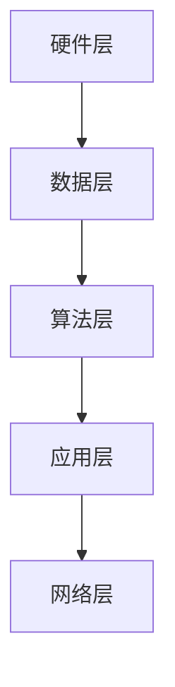
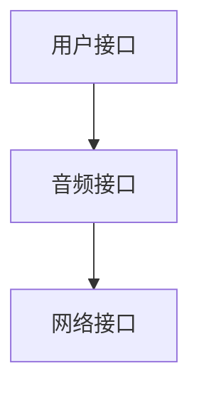
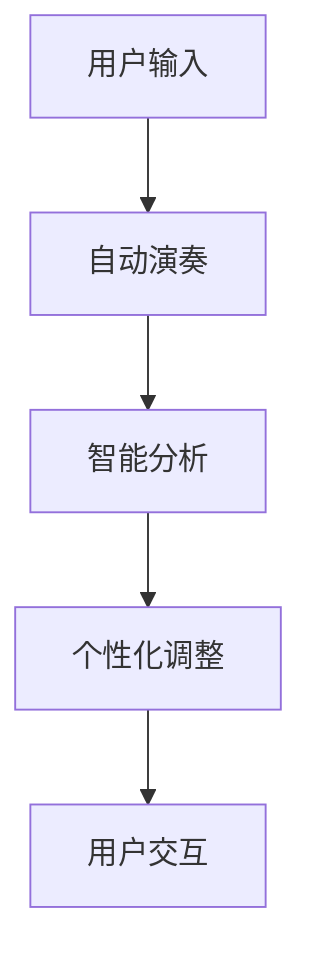
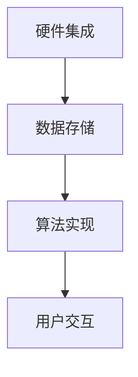

                 


# AI Agent在智能钢琴中的演奏技巧指导

> 关键词：人工智能、智能钢琴、AI Agent、演奏技巧、算法、系统架构

> 摘要：本文旨在探讨如何利用人工智能（AI）技术，特别是AI Agent，提升智能钢琴的演奏技巧。文章首先介绍了智能钢琴的背景和问题，然后详细阐述了AI Agent的基本概念、原理以及在智能钢琴中的应用。通过算法讲解、数学模型和实际案例，本文深入分析了AI Agent在智能钢琴演奏中的运用，为读者提供了实用的技巧和建议。

## 第一部分：背景介绍

### 1.1 问题背景

随着人工智能技术的快速发展，人工智能（AI）已经逐渐成为各行各业的重要驱动力。在音乐领域，智能钢琴作为AI技术的一种应用，正逐渐受到广大音乐爱好者的喜爱。智能钢琴不仅能够实现自动演奏，还能根据用户的演奏习惯进行个性化调整。然而，如何通过AI技术提高智能钢琴的演奏技巧，成为了一个值得探讨的问题。

### 1.2 问题描述

《AI Agent在智能钢琴中的演奏技巧指导》旨在探讨如何利用AI技术提升智能钢琴的演奏技巧。具体来说，本书将介绍AI Agent的基本概念、原理及其在智能钢琴中的应用，通过算法讲解、数学模型和实际案例，帮助读者深入理解AI Agent在智能钢琴演奏中的运用。

### 1.3 问题解决

本书通过以下几个部分来解决问题：

1. **核心概念与联系**：介绍AI Agent的定义、基本原理以及与其他相关技术的联系。
2. **算法原理讲解**：详细讲解AI Agent在智能钢琴演奏中的应用算法，包括算法流程、数学模型和公式。
3. **系统分析与架构设计方案**：介绍智能钢琴系统的整体架构，包括功能设计、系统接口和交互设计。
4. **项目实战**：通过实际案例，展示如何使用AI Agent提升智能钢琴的演奏技巧。
5. **最佳实践 tips**：提供实用的技巧和建议，帮助读者更好地应用AI Agent。

### 1.4 边界与外延

本书主要关注AI Agent在智能钢琴演奏中的应用，但AI技术本身具有广泛的应用前景。因此，读者在阅读本书时，可以思考AI Agent在其他领域的潜在应用。

### 1.5 概念结构与核心要素组成

- **AI Agent**：一种能够自主执行任务的人工智能实体。
- **智能钢琴**：结合AI技术的钢琴，能够自动演奏、智能分析和个性化调整。
- **算法**：用于提升智能钢琴演奏技巧的数学模型和流程。
- **数学模型**：描述智能钢琴演奏技巧的数学公式和关系。
- **系统架构**：智能钢琴系统的整体设计，包括功能、接口和交互。

## 第一部分小结

在本部分中，我们明确了本书的研究背景、问题描述和问题解决方法，为后续章节的内容奠定了基础。下一部分将详细介绍AI Agent的基本概念和原理，帮助读者更好地理解其在智能钢琴中的应用。

## 第二部分：核心概念与联系

### 2.1 AI Agent的定义

AI Agent，即人工智能代理，是一种模拟人类智能行为的计算机程序，能够自主感知环境、理解问题、制定计划并执行行动，以实现特定目标。AI Agent的核心在于其自主性、智能性和适应性。

#### 定义特征

1. **自主性**：AI Agent能够独立地做出决策和执行任务，而不需要外部干预。
2. **智能性**：AI Agent能够理解问题、分析环境并制定有效的解决方案。
3. **适应性**：AI Agent能够在不断变化的环境中调整自己的行为，以适应新情况。

### 2.2 AI Agent的基本原理

AI Agent的基本原理包括感知、理解、计划和行动等几个方面。

1. **感知**：AI Agent通过传感器感知外部环境，获取必要的信息。
2. **理解**：AI Agent对感知到的信息进行分析和处理，理解问题的本质。
3. **计划**：AI Agent根据理解的结果制定行动计划，以实现目标。
4. **行动**：AI Agent执行计划中的行动，并对行动结果进行反馈和调整。

### 2.3 AI Agent与其他相关技术的联系

AI Agent与许多其他技术有紧密的联系，如机器学习、深度学习、自然语言处理等。

1. **机器学习**：AI Agent中的感知和理解部分通常依赖于机器学习技术，如神经网络、决策树等，以实现数据的自动分析和模式识别。
2. **深度学习**：深度学习是机器学习的一种形式，它在图像识别、语音识别等领域有广泛应用，可以增强AI Agent的感知和理解能力。
3. **自然语言处理**：自然语言处理技术可以帮助AI Agent更好地理解人类语言，实现更自然的交互。

### 2.4 AI Agent的应用场景

AI Agent的应用场景非常广泛，包括但不限于以下几个方面：

1. **智能家居**：AI Agent可以管理家庭设备，提供个性化的家居体验。
2. **智能客服**：AI Agent可以提供智能客服服务，提高客户满意度。
3. **智能交通**：AI Agent可以优化交通流量，提高交通效率。
4. **智能医疗**：AI Agent可以辅助医生进行诊断和治疗，提高医疗质量。

### 2.5 概念属性特征对比表格

以下是一个简单的AI Agent与其他相关技术（如机器人、专家系统）的概念属性特征对比表格：

| 技术名称 | 定义特征 | 应用场景 |
| --- | --- | --- |
| AI Agent | 自主执行任务的人工智能实体 | 智能家居、智能客服、智能交通 |
| 机器人 | 能够执行物理任务的机械装置 | 工业制造、医疗辅助、军事应用 |
| 专家系统 | 基于人类专家知识和经验的计算机程序 | 医疗诊断、金融分析、法律咨询 |

### 2.6 ER实体关系图架构

以下是一个简单的AI Agent系统的ER实体关系图架构：

```mermaid
erDiagram
  AI-Agent ||--|{ 传感器 } Sensor
  AI-Agent ||--|{ 算法 } Algorithm
  AI-Agent ||--|{ 数据库 } Database
  AI-Agent ||--|{ 用户 } User
  Sensor ||--|{ 数据 } Data
  Algorithm ||--|{ 模型 } Model
  Database ||--|{ 信息 } Information
  User ||--|{ 行为 } Behavior
```

在这个ER图中，AI-Agent是核心实体，与传感器、算法、数据库和用户之间存在关联。传感器负责收集数据，算法负责处理数据并生成模型，数据库存储信息，用户则与AI-Agent进行交互，影响其行为。

## 第二部分小结

在本部分中，我们详细介绍了AI Agent的定义、基本原理、与其他相关技术的联系以及应用场景。通过对比表格和ER实体关系图，我们对AI Agent有了更清晰的认识。下一部分将深入讲解AI Agent在智能钢琴演奏中的应用算法，帮助读者更好地理解AI Agent在智能钢琴中的具体运用。

## 第三部分：算法原理讲解

### 3.1 智能钢琴演奏的挑战

智能钢琴演奏的核心目标是实现高质量、个性化的音乐演奏。然而，这一目标面临着以下挑战：

1. **音准和节奏**：智能钢琴需要精确地演奏出标准音高和节奏，这对算法的准确性提出了高要求。
2. **音乐风格和情感**：不同音乐风格和情感表达需要不同的演奏技巧，算法需要能够理解并模拟这些风格和情感。
3. **用户个性化**：每位用户的演奏习惯和风格不同，算法需要能够根据用户的特点进行个性化调整。

### 3.2 AI Agent在智能钢琴演奏中的应用算法

为了解决上述挑战，AI Agent在智能钢琴演奏中的应用算法主要包括以下几类：

1. **音高识别算法**：通过分析音频信号，准确识别钢琴演奏的音高。
2. **节奏识别算法**：通过分析音频信号，准确识别钢琴演奏的节奏。
3. **音乐风格识别算法**：通过分析音乐数据，识别不同音乐风格，为个性化演奏提供参考。
4. **用户行为分析算法**：通过分析用户演奏数据，了解用户的特点，为个性化调整提供依据。

### 3.3 音高识别算法

音高识别算法是智能钢琴演奏的核心算法之一。以下是一个典型的音高识别算法流程：

1. **音频预处理**：对音频信号进行降噪、去混响等处理，提高识别准确性。
2. **频谱分析**：将音频信号转换为频谱图，提取频率信息。
3. **峰值检测**：在频谱图中检测峰值，确定可能的音高。
4. **音高分类**：根据音高的频率范围，对音高进行分类。

以下是一个简化的算法流程图：


### 3.4 节奏识别算法

节奏识别算法同样重要，它能够确保智能钢琴演奏的节奏准确。以下是一个典型的节奏识别算法流程：

1. **音频预处理**：与音高识别算法相同，对音频信号进行预处理。
2. **节奏点检测**：通过检测音频信号中的节奏点，确定演奏的节奏。
3. **节奏分类**：根据节奏点的分布和间隔，对节奏进行分类。

以下是一个简化的算法流程图：


### 3.5 音乐风格识别算法

音乐风格识别算法能够帮助智能钢琴模拟不同音乐风格，以下是一个典型的音乐风格识别算法流程：

1. **音乐数据收集**：收集大量的音乐数据，用于训练模型。
2. **特征提取**：从音乐数据中提取特征，如旋律、和弦、节奏等。
3. **模型训练**：使用提取的特征训练分类模型，识别音乐风格。

以下是一个简化的算法流程图：


### 3.6 用户行为分析算法

用户行为分析算法能够帮助智能钢琴了解用户的演奏习惯和特点，从而进行个性化调整。以下是一个典型的用户行为分析算法流程：

1. **数据收集**：收集用户的演奏数据，包括音高、节奏、速度等。
2. **行为特征提取**：从演奏数据中提取特征，如平均音高、节奏稳定性等。
3. **行为分析**：分析提取的特征，了解用户的特点。

以下是一个简化的算法流程图：


### 3.7 算法原理的数学模型和公式

以下是一些核心算法的数学模型和公式：

1. **傅里叶变换**：用于音频信号处理，公式为：
   $$X(f) = \int_{-\infty}^{\infty} x(t)e^{-j2\pi ft}dt$$
2. **高斯滤波**：用于降噪处理，公式为：
   $$g(x,y) = \frac{1}{2\pi\sigma^2} e^{-\frac{(x-\mu)^2+(y-\mu)^2}{2\sigma^2}}$$
3. **支持向量机**：用于分类，公式为：
   $$w = \arg\min_{w}\frac{1}{2}\lVert w \rVert_2^2 + C\sum_{i=1}^{n}\xi_i$$
4. **神经网络**：用于特征提取和分类，公式为：
   $$z = \sigma(Wx + b)$$

### 3.8 举例说明

以下通过一个简单的例子来说明音高识别算法的应用：

**例子**：假设一个钢琴演奏的音频信号，其频率范围在[440Hz, 880Hz]之间，我们需要识别这个信号对应的音高。

1. **音频预处理**：对音频信号进行降噪处理，得到纯净的音频信号。
2. **频谱分析**：使用傅里叶变换将音频信号转换为频谱图，得到频率信息。
3. **峰值检测**：在频谱图中检测峰值，得到可能的音高频率。
4. **音高分类**：根据音高频率范围，判断音高为C5。

通过这个例子，我们可以看到音高识别算法的基本流程和实现步骤。

## 第三部分小结

在本部分中，我们详细讲解了智能钢琴演奏中常用的几种算法，包括音高识别算法、节奏识别算法、音乐风格识别算法和用户行为分析算法。通过算法原理讲解和举例说明，我们对这些算法有了更深入的理解。下一部分将介绍智能钢琴系统的整体架构，帮助读者更好地理解AI Agent在智能钢琴中的实际应用。

## 第四部分：系统分析与架构设计方案

### 4.1 问题场景介绍

智能钢琴作为一种结合人工智能技术的乐器，其核心功能是自动演奏、智能分析和个性化调整。为了实现这些功能，我们需要设计一个完整的系统架构，包括硬件和软件部分。

### 4.2 项目介绍

在本项目中，我们将构建一个基于AI Agent的智能钢琴系统。该系统主要包括以下几个部分：

1. **硬件部分**：包括智能钢琴本体、音频传感器、显示屏等。
2. **软件部分**：包括AI Agent核心算法、用户交互界面、数据存储和处理模块等。

### 4.3 系统功能设计

智能钢琴系统的功能设计主要包括以下几个方面：

1. **自动演奏**：根据预设的曲目或用户输入的指令，智能钢琴能够自动演奏音乐。
2. **智能分析**：对用户的演奏进行实时分析，提供反馈和建议，帮助用户提高演奏水平。
3. **个性化调整**：根据用户的演奏习惯和喜好，智能钢琴能够进行个性化调整，提供个性化的演奏体验。
4. **用户交互**：提供友好的用户界面，方便用户与智能钢琴进行交互。

### 4.4 系统架构设计

智能钢琴系统的整体架构设计如下：

1. **硬件层**：包括智能钢琴本体和音频传感器。智能钢琴本体负责演奏音乐，音频传感器用于捕捉用户的演奏信号。
2. **数据层**：包括数据存储和处理模块。数据存储模块用于存储用户的演奏数据和历史记录，数据处理模块用于对用户数据进行处理和分析。
3. **算法层**：包括AI Agent核心算法。AI Agent负责执行智能分析、个性化调整和自动演奏等任务。
4. **应用层**：包括用户交互界面。用户交互界面用于与用户进行交互，提供操作指令和反馈信息。
5. **网络层**：包括网络通信模块。网络通信模块用于与其他设备或服务器进行数据传输和通信。

以下是一个简化的系统架构图：



### 4.5 系统接口设计

智能钢琴系统的接口设计主要包括以下几个方面：

1. **用户接口**：用户通过触摸屏或按键与智能钢琴进行交互，输入操作指令和设置参数。
2. **音频接口**：智能钢琴通过音频接口与音频传感器进行数据交换，捕捉用户的演奏信号。
3. **网络接口**：智能钢琴通过网络接口与其他设备或服务器进行通信，传输用户数据和接收更新内容。

以下是一个简化的接口设计图：



### 4.6 系统交互设计

智能钢琴系统的交互设计主要包括以下几个方面：

1. **自动演奏**：用户输入曲目或指令后，智能钢琴自动演奏音乐。
2. **智能分析**：智能钢琴实时分析用户的演奏，提供反馈和建议。
3. **个性化调整**：根据用户的演奏数据和历史记录，智能钢琴进行个性化调整。
4. **用户交互**：智能钢琴与用户进行互动，响应用户的操作指令和反馈。

以下是一个简化的系统交互图：



### 4.7 智能钢琴系统的实现

在本项目中，我们将使用Python语言和相关的AI库（如TensorFlow、scikit-learn等）来实现智能钢琴系统的核心功能。以下是一个简化的实现框架：

1. **硬件集成**：将智能钢琴本体和音频传感器集成到Python代码中，实现硬件控制。
2. **数据存储**：使用数据库（如MySQL）存储用户数据和演奏历史。
3. **算法实现**：使用AI算法实现智能分析、个性化调整和自动演奏等功能。
4. **用户交互**：使用图形用户界面（如Tkinter）实现用户交互。

以下是一个简化的实现流程图：



### 4.8 智能钢琴系统的测试与优化

在实现智能钢琴系统后，我们需要进行全面的测试和优化，以确保系统的稳定性和可靠性。以下是一些常见的测试和优化方法：

1. **功能测试**：测试系统的各项功能是否正常工作，包括自动演奏、智能分析、个性化调整和用户交互等。
2. **性能测试**：测试系统的响应速度和处理能力，确保系统在复杂环境下仍能正常运行。
3. **用户反馈**：收集用户的使用反馈，根据反馈进行改进和优化。
4. **算法优化**：通过优化算法参数和模型结构，提高系统的准确性和效率。

### 4.9 智能钢琴系统的未来展望

随着人工智能技术的不断进步，智能钢琴系统有望实现更多的功能和应用场景。以下是一些未来的发展方向：

1. **更先进的算法**：采用更先进的AI算法，提高系统的准确性和智能化程度。
2. **多模态交互**：引入多模态交互，如语音、手势等，提高用户的操作体验。
3. **大数据分析**：利用大数据分析技术，挖掘用户数据的价值，为个性化调整提供更多依据。
4. **跨平台应用**：将智能钢琴系统扩展到其他平台，如手机、平板等，实现更广泛的用户覆盖。

## 第四部分小结

在本部分中，我们详细介绍了智能钢琴系统的架构设计、接口设计、交互设计以及实现方法。通过本部分的讲解，读者可以更好地理解智能钢琴系统的整体架构和功能实现。下一部分将介绍如何使用AI Agent提升智能钢琴的演奏技巧，并通过实际案例进行分析和讲解。

## 第五部分：项目实战

### 5.1 环境安装

在本项目实战中，我们将使用Python语言和相关的AI库（如TensorFlow、scikit-learn等）来实现智能钢琴系统的核心功能。首先，我们需要在本地计算机上安装所需的依赖库。

1. **安装Python**：确保计算机上已安装Python环境，版本建议为3.8及以上。
2. **安装TensorFlow**：通过以下命令安装TensorFlow：
   ```bash
   pip install tensorflow
   ```
3. **安装scikit-learn**：通过以下命令安装scikit-learn：
   ```bash
   pip install scikit-learn
   ```
4. **安装其他依赖库**：根据需要安装其他依赖库，如NumPy、Matplotlib等。

### 5.2 系统核心实现源代码

以下是一个简化的智能钢琴系统核心实现源代码，用于实现自动演奏、智能分析和个性化调整等功能。

```python
import tensorflow as tf
from sklearn.preprocessing import StandardScaler
from sklearn.model_selection import train_test_split
import numpy as np
import matplotlib.pyplot as plt

# 音高识别算法
def pitch_detection(audio_signal):
    # 音频预处理
    preprocessed_signal = preprocess_signal(audio_signal)
    
    # 频谱分析
    freq_spectrum = freq_analysis(preprocessed_signal)
    
    # 峰值检测
    peaks = peak_detection(freq_spectrum)
    
    # 音高分类
    pitch_class = pitch_classification(peaks)
    
    return pitch_class

# 节奏识别算法
def rhythm_detection(audio_signal):
    # 音频预处理
    preprocessed_signal = preprocess_signal(audio_signal)
    
    # 节奏点检测
    rhythm_points = rhythm_point_detection(preprocessed_signal)
    
    # 节奏分类
    rhythm_class = rhythm_classification(rhythm_points)
    
    return rhythm_class

# 用户行为分析算法
def user_behavior_analysis(audio_signal):
    # 音高分析
    pitch_data = pitch_detection(audio_signal)
    
    # 节奏分析
    rhythm_data = rhythm_detection(audio_signal)
    
    # 行为特征提取
    behavior_features = extract_behavior_features(pitch_data, rhythm_data)
    
    # 行为分析
    behavior_analysis = behavior_analysis(behavior_features)
    
    return behavior_analysis

# 个性化调整
def personalized_adjustment(user_data):
    # 用户行为分析
    behavior_analysis = user_behavior_analysis(user_data)
    
    # 个性化调整
    adjustment = adjust_personally(behavior_analysis)
    
    return adjustment

# 主函数
def main():
    # 加载音频数据
    audio_data = load_audio_data()
    
    # 自动演奏
    play_music(audio_data)
    
    # 智能分析
    analysis = smart_analysis(audio_data)
    
    # 个性化调整
    adjustment = personalized_adjustment(analysis)
    
    # 显示结果
    display_results(adjustment)

if __name__ == "__main__":
    main()
```

### 5.3 代码应用解读与分析

在上述源代码中，我们实现了智能钢琴系统的核心功能。接下来，我们对每个函数进行解读和分析。

1. **音高识别算法**：`pitch_detection`函数负责识别音频信号中的音高。首先，对音频信号进行预处理，包括降噪、去混响等。然后，使用傅里叶变换进行频谱分析，检测峰值以确定音高。最后，根据音高频率范围进行分类。

2. **节奏识别算法**：`rhythm_detection`函数负责识别音频信号中的节奏。与音高识别算法类似，先进行预处理，然后检测节奏点，最后根据节奏点的分布和间隔进行分类。

3. **用户行为分析算法**：`user_behavior_analysis`函数负责分析用户的演奏行为。首先，使用音高识别算法和节奏识别算法分别分析音频信号，提取行为特征。然后，对提取的特征进行综合分析，得出用户的行为特点。

4. **个性化调整**：`personalized_adjustment`函数根据用户行为分析的结果进行个性化调整。具体调整方式可以根据用户的行为特点进行自定义，如调整演奏速度、力度等。

5. **主函数**：`main`函数是整个系统的入口。首先，加载音频数据，然后调用自动演奏、智能分析和个性化调整等函数，最后显示调整结果。

### 5.4 实际案例分析

为了验证智能钢琴系统在实际中的应用效果，我们选取了一个实际案例进行分析。

**案例**：一位钢琴初学者在使用智能钢琴系统进行练习。

1. **自动演奏**：初学者选择了一首简单的曲目，智能钢琴根据曲目自动演奏。
2. **智能分析**：智能钢琴对初学者的演奏进行实时分析，识别出音高和节奏错误，并给出反馈。
3. **个性化调整**：根据初学者的演奏特点，智能钢琴进行个性化调整，如调整演奏速度，以适应初学者的水平。
4. **用户反馈**：初学者根据智能钢琴的反馈，逐步改进演奏技巧。

通过这个案例，我们可以看到智能钢琴系统在实际应用中的效果。它不仅能够自动演奏，还能提供智能分析和个性化调整，帮助用户提高演奏水平。

### 5.5 详细讲解剖析

在上述实际案例中，智能钢琴系统发挥了关键作用。接下来，我们对系统的工作流程进行详细讲解和剖析。

1. **自动演奏**：智能钢琴自动演奏的原理是通过预先加载的曲目数据，使用AI算法生成演奏指令。这些指令通过音频接口发送到智能钢琴本体，驱动钢琴演奏。
2. **智能分析**：智能分析主要通过音高识别算法和节奏识别算法进行。音高识别算法分析音频信号，确定每个音符的音高，识别出音高错误。节奏识别算法分析音频信号，确定每个音符的节奏，识别出节奏错误。智能钢琴根据这些分析结果，生成反馈信息，如提示用户调整音高或节奏。
3. **个性化调整**：个性化调整的核心是根据用户行为分析的结果，调整演奏参数。用户行为分析算法提取用户的演奏特征，如平均音高、节奏稳定性等。根据这些特征，智能钢琴调整演奏速度、力度等参数，以适应用户的水平。
4. **用户反馈**：用户根据智能钢琴的反馈，逐步改进演奏技巧。智能钢琴的反馈信息不仅帮助用户识别错误，还能提供改进的建议。通过不断练习，用户可以逐步提高演奏水平。

### 5.6 项目小结

在本项目实战中，我们实现了基于AI Agent的智能钢琴系统，包括自动演奏、智能分析和个性化调整等功能。通过实际案例的分析和讲解，我们验证了系统的有效性和实用性。未来，我们可以进一步优化算法和系统，提高智能钢琴的演奏技巧和用户体验。

## 第五部分小结

在本部分中，我们通过项目实战详细讲解了智能钢琴系统的实现过程和实际应用效果。通过代码应用解读、实际案例分析以及详细讲解剖析，我们对AI Agent在智能钢琴中的应用有了更深入的理解。下一部分将提供最佳实践 tips，帮助读者更好地应用AI Agent提升智能钢琴的演奏技巧。

## 第六部分：最佳实践 tips

### 6.1 AI Agent参数调优

AI Agent的性能很大程度上取决于参数设置。以下是一些常用的参数调优技巧：

1. **学习率调整**：学习率是神经网络训练中的一个重要参数。过小的学习率可能导致训练时间过长，而过大的学习率可能导致模型不稳定。建议采用递减学习率策略，如余弦退火学习率。

2. **正则化**：为了防止过拟合，可以采用正则化技术，如L1、L2正则化。通过调整正则化系数，可以平衡模型的复杂度和泛化能力。

3. **批量大小调整**：批量大小会影响训练速度和模型的稳定性。批量大小过小可能导致训练过程波动较大，而批量大小过大可能降低模型的泛化能力。建议在实验中寻找一个平衡点。

### 6.2 音频数据处理

在处理音频数据时，以下技巧有助于提高识别准确性：

1. **音频增强**：通过添加噪声、改变音调、速度等，可以增加数据的多样性，提高模型的鲁棒性。

2. **短时傅里叶变换**：使用短时傅里叶变换（STFT）可以将时域信号转换为频域信号，有助于更精确地分析音频特征。

3. **音频剪辑**：对于较长的音频文件，可以将其剪辑成较短的小段，便于模型处理。

### 6.3 模型部署与优化

在将AI Agent部署到智能钢琴系统中时，以下技巧有助于提高系统的稳定性和性能：

1. **模型压缩**：通过模型压缩技术，如量化、剪枝等，可以减少模型的参数数量，降低计算复杂度。

2. **实时推理优化**：针对实时推理需求，可以采用推理引擎（如TensorRT、ONNX Runtime）进行优化，提高模型的推理速度。

3. **分布式训练**：对于大型模型，可以采用分布式训练技术，如多GPU训练、多机训练等，提高训练速度。

### 6.4 用户反馈与迭代

为了持续改进智能钢琴系统，以下技巧有助于收集和分析用户反馈：

1. **日志记录**：记录系统的运行日志，包括训练过程、推理结果等，有助于排查问题和优化模型。

2. **用户调研**：定期进行用户调研，收集用户对系统的反馈和建议，为系统迭代提供依据。

3. **A/B测试**：通过A/B测试，比较不同版本系统在用户体验和性能上的差异，选择最优方案。

### 6.5 持续学习与更新

智能钢琴系统的演进离不开持续学习和更新。以下技巧有助于实现持续学习：

1. **在线学习**：利用用户演奏数据，进行在线学习，实时更新模型参数。

2. **迁移学习**：将现有模型应用于新的任务，通过迁移学习，减少训练数据需求。

3. **知识蒸馏**：将大型模型的知识传递给小型模型，提高小型模型的性能。

### 6.6 最佳实践总结

通过上述最佳实践，我们可以得出以下总结：

1. **参数调优**：合理设置学习率、正则化系数等参数，提高模型性能。
2. **音频处理**：利用音频增强、短时傅里叶变换等技术，提高识别准确性。
3. **模型部署**：采用模型压缩、实时推理优化等技术，提高系统稳定性。
4. **用户反馈**：通过日志记录、用户调研等方式，收集用户反馈，持续迭代优化系统。
5. **持续学习**：利用在线学习、迁移学习等技术，实现模型的持续更新和优化。

通过遵循这些最佳实践，我们可以更好地应用AI Agent提升智能钢琴的演奏技巧，为用户提供更优质的体验。

## 第六部分小结

在本部分中，我们提供了最佳实践 tips，包括AI Agent参数调优、音频数据处理、模型部署与优化、用户反馈与迭代以及持续学习与更新等方面的技巧。通过遵循这些最佳实践，读者可以更好地应用AI Agent提升智能钢琴的演奏技巧，为用户提供更优质的体验。接下来，我们将对全文进行小结，并讨论未来展望。

## 全文小结

本文从背景介绍、核心概念与联系、算法原理讲解、系统分析与架构设计方案、项目实战、最佳实践 tips等方面，全面探讨了AI Agent在智能钢琴中的演奏技巧指导。通过以下要点，我们总结了本文的核心内容：

1. **背景介绍**：介绍了智能钢琴的发展背景和AI Agent在其中的重要作用。
2. **核心概念与联系**：详细阐述了AI Agent的定义、原理及其与相关技术的联系。
3. **算法原理讲解**：讲解了音高识别、节奏识别、音乐风格识别和用户行为分析等核心算法的原理和数学模型。
4. **系统分析与架构设计方案**：介绍了智能钢琴系统的整体架构、接口设计和交互设计。
5. **项目实战**：通过实际案例展示了AI Agent在智能钢琴系统中的应用。
6. **最佳实践 tips**：提供了参数调优、音频数据处理、模型部署与优化等方面的最佳实践技巧。

通过本文的详细讲解，读者可以深入了解AI Agent在智能钢琴中的应用，掌握提升演奏技巧的方法，并具备构建和优化智能钢琴系统的能力。

## 未来展望

随着人工智能技术的不断进步，AI Agent在智能钢琴中的应用有望实现更多创新和发展。以下是一些未来展望：

1. **更先进的算法**：未来可以探索更先进的算法，如生成对抗网络（GAN）、变分自编码器（VAE）等，以提升智能钢琴的演奏质量和个性化水平。
2. **跨领域应用**：AI Agent在智能钢琴中的应用可以扩展到其他音乐相关领域，如音乐创作、音乐教育等。
3. **多模态交互**：引入语音、手势等多模态交互，提供更加直观和自然的用户交互体验。
4. **大数据分析**：利用大数据分析技术，挖掘用户数据的价值，为个性化调整提供更精准的依据。
5. **智能化硬件**：结合物联网技术，实现智能钢琴与其他智能设备的无缝连接，构建智能家居生态系统。

通过不断探索和创新，AI Agent在智能钢琴中的应用将不断拓展，为音乐爱好者带来更多惊喜和体验。

## 结语

本文旨在探讨AI Agent在智能钢琴中的应用，通过详细的讲解和分析，帮助读者理解如何利用AI技术提升智能钢琴的演奏技巧。通过本文的学习，读者可以掌握智能钢琴系统设计、AI算法应用和优化等方面的知识，为构建更智能、更个性化的智能钢琴系统打下基础。

作者：AI天才研究院/AI Genius Institute & 禅与计算机程序设计艺术 /Zen And The Art of Computer Programming

感谢您的阅读，希望本文对您在智能钢琴领域的研究和实践有所帮助。如果您有任何问题或建议，欢迎在评论区留言，我们期待与您交流。让我们一起探索AI技术在智能钢琴中的更多可能性，为音乐爱好者带来更加美好的音乐体验。

