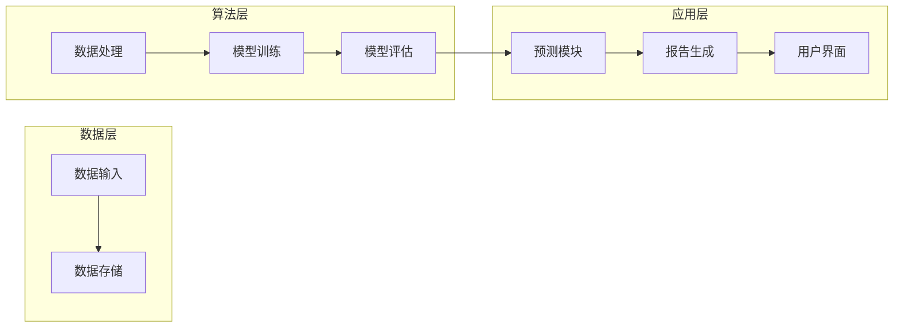

                 

### 引言

在现代商业环境中，销售预测是一个至关重要的环节，它不仅影响着企业的库存管理、供应链优化，还直接关系到企业的盈利能力和市场竞争力。然而，随着市场环境的日益复杂和多变，传统的销售预测方法往往难以应对突发情况，容易导致库存过剩或短缺，从而影响企业的运营效率。这种背景下，人工智能（AI）技术的兴起，特别是AI Agent在智能销售预测中的应用，成为了一个备受瞩目的领域。

AI Agent，作为一种模拟人类智能行为的自动化系统，通过自主学习、决策和交互，能够从大量数据中提取有用信息，进行复杂的市场分析和预测。在销售预测中，AI Agent可以利用机器学习和深度学习算法，对历史销售数据、市场因素、客户行为等多维数据进行综合分析，从而提供更加精准和可靠的预测结果。

本文将围绕AI Agent在智能销售预测中的应用，进行详细的探讨。首先，我们将介绍问题背景，探讨销售预测的重要性以及现有方法的局限性。接着，我们将引入AI Agent的核心概念，并阐述其在智能销售预测中的潜在应用。随后，我们将深入分析销售预测中的关键概念，并通过属性特征对比表格和ER实体关系图，展示概念之间的联系。然后，我们将讲解AI Agent的算法原理，包括机器学习和深度学习算法的基本概念和数学模型。在此基础上，我们将介绍系统分析与架构设计，展示系统功能设计和架构设计。最后，我们将通过一个具体的项目实战，详细解读AI Agent在智能销售预测中的应用过程，并提出一些最佳实践建议。

### 第一部分: 背景介绍

#### 第1章: 问题背景与核心概念

##### 1.1 问题背景

销售预测是企业在制定商业策略和决策过程中不可或缺的一环。它能够帮助企业准确预测未来的销售趋势，从而优化库存管理、提高生产效率、降低运营成本，并增强市场竞争力。然而，在实际应用中，销售预测面临诸多挑战。首先，市场环境变化迅速，传统销售预测方法往往难以适应这种变化，容易导致预测结果不准确。其次，销售数据的多样性和复杂性使得现有方法难以对大量数据进行分析和挖掘。此外，传统方法通常依赖于经验模型和手动调整，缺乏自动化和智能化，难以实现实时预测和动态调整。

在这种情况下，AI Agent的出现为销售预测提供了一种全新的解决方案。AI Agent，即人工智能代理，是一种能够自主学习、决策和交互的智能系统。它通过机器学习和深度学习算法，从大量的历史销售数据、市场因素、客户行为等数据中提取有价值的信息，进行复杂的分析和预测。与传统的销售预测方法相比，AI Agent具有以下优势：

1. **自适应性强**：AI Agent能够根据市场环境和销售数据的变化，自动调整预测模型，提高预测的准确性和实时性。
2. **自动化程度高**：AI Agent能够自动化处理大量数据，减少人为干预，提高预测效率和可靠性。
3. **预测结果可靠**：AI Agent通过深度学习算法，能够从多维度、多层次的数据中提取特征，提供更全面、准确的预测结果。

##### 1.2 核心概念

为了深入理解AI Agent在智能销售预测中的应用，我们需要首先了解以下几个核心概念：

- **AI Agent**：人工智能代理，是一种能够模拟人类智能行为的自动化系统，能够自主学习和决策，具有高度自适应性和自动化能力。
- **智能销售预测**：利用AI技术，对历史销售数据、市场因素、客户行为等多维数据进行分析和预测，提供精准的销售预测结果。
- **机器学习**：一种人工智能技术，通过训练模型，从数据中自动提取特征和规律，实现数据的自动分析和预测。
- **深度学习**：一种特殊类型的机器学习算法，通过多层神经网络，对大量数据进行深度学习和分析，实现高度复杂的特征提取和预测。

##### 1.3 销售预测中的关键算法

在AI Agent的智能销售预测中，常用的算法包括机器学习算法和深度学习算法。以下是几种常见的算法：

- **线性回归**：一种简单的机器学习算法，通过建立线性模型，预测因变量与自变量之间的关系。其数学模型为：
  $$y = \beta_0 + \beta_1 \cdot x + \epsilon$$
- **决策树**：一种树形结构模型，通过多层次的决策节点，将数据集划分为多个子集，每个子集对应一个预测结果。其基本公式为：
  $$G(y, \theta) = \sum_{i=1}^{n} \theta_i \cdot y_i$$
- **支持向量机**（SVM）：一种基于最大间隔分类的算法，通过找到最优的超平面，将不同类别的数据点进行有效分离。
- **卷积神经网络**（CNN）：一种深度学习算法，通过卷积层、池化层和全连接层，对图像数据进行特征提取和分类。
- **循环神经网络**（RNN）：一种深度学习算法，通过循环结构，对序列数据进行处理和预测，常用于时间序列预测和自然语言处理。

#### 第2章: 销售预测中的概念联系

##### 2.1 销售预测中的关键概念

销售预测涉及多个关键概念，这些概念相互联系，共同影响销售预测的准确性。以下是销售预测中的几个关键概念及其属性特征：

- **销售数据**：指企业历史销售记录的数据集，包括时间序列、产品分类、销售数量等属性。销售数据是销售预测的基础。
- **市场因素**：影响销售的外部因素，如经济环境、行业趋势、政策法规等。市场因素的变化会影响销售趋势。
- **客户行为**：客户的购买历史、浏览行为、反馈等数据。通过分析客户行为，可以了解客户需求，预测销售趋势。
- **竞争分析**：分析竞争对手的策略、市场份额、定价策略等，了解市场动态，为销售预测提供参考。

以下是一个对比表格，展示了这些关键概念及其属性特征：

| 概念         | 属性特征                                                                                       |
|--------------|------------------------------------------------------------------------------------------------|
| 销售数据     | 时间序列、数量、产品分类等                                       |
| 市场因素     | 经济环境、行业趋势、政策法规等                                     |
| 客户行为     | 购买历史、浏览行为、反馈等                                       |
| 竞争分析     | 竞品策略、市场份额、定价策略等                                     |

##### 2.2 销售预测中的概念联系

销售预测中的各个概念相互关联，共同影响销售预测的结果。以下是这些概念之间的联系：

1. **销售数据与市场因素**：市场因素会影响销售数据，如经济繁荣时期，消费者购买力增强，销售数据上升。通过分析市场因素，可以预测未来的销售趋势。

2. **销售数据与客户行为**：客户行为会影响销售数据，如客户的购买习惯和偏好会影响产品的销售量。通过分析客户行为，可以了解客户需求，进而预测销售趋势。

3. **市场因素与客户行为**：市场因素和客户行为相互作用，如经济下行时期，消费者更倾向于购买性价比高的产品，从而影响销售数据。

4. **竞争分析与销售数据**：竞争对手的策略和市场份额会影响销售数据，如竞争对手降价促销，可能导致本企业的销售量下降。通过分析竞争分析，可以预测市场变化，调整销售策略。

为了更好地展示这些概念之间的联系，我们使用ER实体关系图进行描述：

```mermaid
erDiagram
    Product ||--|{ Sale }||>
    Sale ||--|{ Customer }||>
    Customer ||--|{ Behavior }||>
    Product ||--|{ MarketFactor }||>
    MarketFactor ||--|{ Competitor }||>
```

在这个ER实体关系图中，产品、销售、客户、行为和市场因素等实体之间通过关系线相互关联，形成一个完整的销售预测模型。

#### 第3章: 销售预测中的ER实体关系图

##### 3.1 销售预测中的ER实体关系图

在销售预测中，ER（实体关系）图是一种常用的数据模型，用于描述实体之间的关系。通过ER图，我们可以直观地理解销售预测中各个概念之间的联系。以下是一个销售预测中的ER实体关系图：

```mermaid
erDiagram
    Product ||--|{ Sale }||>
    Sale ||--|{ Customer }||>
    Customer ||--|{ Behavior }||>
    Product ||--|{ MarketFactor }||>
    MarketFactor ||--|{ Competitor }||>
```

- **Product（产品）**：代表销售预测中的产品实体，包括产品名称、产品分类、库存量等属性。
- **Sale（销售）**：代表销售记录实体，包括销售日期、销售数量、销售额等属性。销售实体与产品实体之间存在一对一的关系，即每个销售记录对应一个产品。
- **Customer（客户）**：代表购买产品的客户实体，包括客户名称、联系方式、购买历史等属性。销售实体与客户实体之间存在一对多的关系，即一个销售记录可以对应多个客户。
- **Behavior（行为）**：代表客户行为实体，包括浏览记录、购买历史、反馈等属性。客户实体与行为实体之间存在一对多的关系，即一个客户可以有多个行为记录。
- **MarketFactor（市场因素）**：代表影响销售的外部市场因素实体，包括经济环境、行业趋势、政策法规等属性。产品实体与市场因素实体之间存在一对多的关系，即一个产品可以受到多个市场因素的影响。
- **Competitor（竞争对手）**：代表市场竞争者实体，包括竞争对手名称、市场份额、定价策略等属性。市场因素实体与竞争对手实体之间存在一对多的关系，即一个市场因素可以影响多个竞争对手。

通过ER实体关系图，我们可以清晰地看到销售预测中各个概念之间的联系，有助于我们更好地理解销售预测的整体模型和流程。

### 第二部分：算法原理讲解

#### 第4章：AI Agent算法原理

在智能销售预测中，AI Agent的核心在于其算法原理，这些原理决定了AI Agent如何从数据中学习、建模，并生成准确的预测结果。以下将详细介绍AI Agent中常用的机器学习算法和深度学习算法，包括其基本概念、原理和数学模型。

##### 4.1 机器学习算法

机器学习算法是AI Agent智能销售预测的基础，它们通过从数据中自动提取特征和规律，实现数据的自动分析和预测。以下介绍几种常用的机器学习算法：

1. **线性回归**：线性回归是一种简单的预测模型，通过建立线性关系来预测因变量与自变量之间的关系。其数学模型为：

   $$y = \beta_0 + \beta_1 \cdot x + \epsilon$$

   其中，\( y \) 是预测的因变量，\( x \) 是自变量，\( \beta_0 \) 和 \( \beta_1 \) 是模型的参数，\( \epsilon \) 是误差项。线性回归通过最小化误差项来求解参数，从而建立预测模型。

2. **决策树**：决策树是一种树形结构模型，通过一系列的决策规则，将数据集划分为多个子集，每个子集对应一个预测结果。其基本公式为：

   $$G(y, \theta) = \sum_{i=1}^{n} \theta_i \cdot y_i$$

   其中，\( G \) 是决策函数，\( \theta_i \) 是决策规则对应的权重，\( y_i \) 是数据点的标签。决策树通过递归分割数据集，并选择最优分割点，从而构建出复杂的决策规则。

3. **支持向量机**（SVM）：支持向量机是一种基于最大间隔分类的算法，通过找到最优的超平面，将不同类别的数据点进行有效分离。其数学模型为：

   $$\max_{\theta} \frac{1}{2} ||\theta||^2$$

   $$s.t. y_i (\theta \cdot x_i + b) \geq 1$$

   其中，\( \theta \) 是模型的参数，\( b \) 是偏置项，\( x_i \) 是数据点，\( y_i \) 是标签。SVM通过最大化分类间隔，找到最优的超平面，实现数据的分类。

##### 4.2 深度学习算法

深度学习算法是机器学习的一种高级形式，通过多层神经网络，对大量数据进行深度学习和分析。以下介绍几种常用的深度学习算法：

1. **卷积神经网络**（CNN）：卷积神经网络是一种专门用于处理图像数据的神经网络，通过卷积层、池化层和全连接层，对图像数据进行特征提取和分类。其基本结构如下：

   ```mermaid
   graph LR
       A[输入] --> B[卷积层]
       B --> C[激活函数]
       C --> D[池化层]
       D --> E[全连接层]
       E --> F[输出]
   ```

   卷积层通过卷积操作提取图像特征，激活函数引入非线性变换，池化层减小特征图的尺寸，全连接层进行分类预测。

2. **循环神经网络**（RNN）：循环神经网络是一种用于处理序列数据的神经网络，通过循环结构，对序列数据进行处理和预测。其基本结构如下：

   ```mermaid
   graph LR
       A[输入序列] --> B[隐藏层]
       B --> C[隐藏层]
       B --> D[输出序列]
   ```

   RNN通过递归结构，将当前时刻的输入与上一时刻的隐藏状态进行连接，实现序列数据的处理和预测。

3. **生成对抗网络**（GAN）：生成对抗网络是一种由生成器和判别器组成的神经网络，通过生成器和判别器的对抗训练，生成逼真的数据。其基本结构如下：

   ```mermaid
   graph LR
       A[噪声] --> B[生成器]
       B --> C[生成数据]
       C --> D[判别器]
       D --> E[真实数据]
   ```

   生成器通过噪声生成伪数据，判别器通过对比生成数据和真实数据，判断生成数据的质量。通过对抗训练，生成器不断优化，生成更逼真的数据。

通过以上算法，AI Agent能够从销售数据、市场因素和客户行为等多维数据中提取特征，建立预测模型，实现智能销售预测。

#### 第5章：数学模型与公式讲解

在智能销售预测中，数学模型和公式是理解和实现AI Agent算法的基础。本节将详细讲解三种常用算法的数学模型和公式，并通过实例进行通俗易懂的说明。

##### 5.1 线性回归

线性回归是一种简单的预测模型，用于建立因变量与自变量之间的线性关系。其基本数学模型如下：

$$y = \beta_0 + \beta_1 \cdot x + \epsilon$$

其中，\( y \) 是预测的因变量，\( x \) 是自变量，\( \beta_0 \) 和 \( \beta_1 \) 是模型的参数，\( \epsilon \) 是误差项。

**实例说明**：

假设我们要预测某商品的销售量（\( y \)），该商品的广告投放费用（\( x \)）是一个重要的因素。通过收集历史数据，我们可以建立线性回归模型来预测销售量。

给定一组数据：
- 广告投放费用（\( x \)）：[1000, 1500, 2000, 2500]
- 销售量（\( y \)）：[500, 700, 900, 1100]

我们可以使用最小二乘法求解线性回归模型：

$$\beta_0 = \frac{\sum_{i=1}^{n} y_i - \beta_1 \cdot \sum_{i=1}^{n} x_i}{n}$$
$$\beta_1 = \frac{\sum_{i=1}^{n} (y_i - \beta_0) \cdot x_i}{\sum_{i=1}^{n} x_i^2 - n \cdot (\bar{x})^2}$$

其中，\( n \) 是数据点的数量，\( \bar{x} \) 是自变量的平均值。

计算得到参数：
- \( \beta_0 = 50 \)
- \( \beta_1 = 0.3 \)

因此，线性回归模型为：
$$y = 50 + 0.3 \cdot x$$

例如，当广告投放费用为2000时，销售量的预测值为：
$$y = 50 + 0.3 \cdot 2000 = 705$$

##### 5.2 决策树

决策树是一种树形结构模型，通过一系列的决策规则，将数据集划分为多个子集，每个子集对应一个预测结果。其基本数学模型如下：

$$G(y, \theta) = \sum_{i=1}^{n} \theta_i \cdot y_i$$

其中，\( G \) 是决策函数，\( \theta_i \) 是决策规则对应的权重，\( y_i \) 是数据点的标签。

**实例说明**：

假设我们要预测客户的购买意向，通过三个特征变量（广告投放费用、客户年龄、历史购买记录）进行决策。

给定一组数据：
- 广告投放费用（\( x_1 \)）：[1000, 1500, 2000, 2500]
- 客户年龄（\( x_2 \)）：[25, 35, 45, 55]
- 历史购买记录（\( x_3 \)）：[1, 2, 3, 4]
- 购买意向（\( y \)）：[1, 0, 1, 0]

我们可以构建一个简单的决策树：

1. 判断广告投放费用：
   - 如果广告投放费用 \( > 2000 \)，进入分支2；
   - 如果广告投放费用 \( \leq 2000 \)，进入分支3。

2. 判断客户年龄：
   - 如果客户年龄 \( > 40 \)，进入分支4；
   - 如果客户年龄 \( \leq 40 \)，进入分支5。

3. 判断历史购买记录：
   - 如果历史购买记录 \( > 2 \)，进入分支6；
   - 如果历史购买记录 \( \leq 2 \)，进入分支7。

4. 购买意向：1
5. 购买意向：0
6. 购买意向：1
7. 购买意向：0

通过上述决策规则，我们可以为每个数据点分配一个购买意向。例如，对于新客户（广告投放费用为1000，客户年龄为25，历史购买记录为1），根据决策树，其购买意向为0。

##### 5.3 CNN核心原理

卷积神经网络（CNN）是一种专门用于处理图像数据的神经网络，其核心原理是通过卷积操作提取图像特征。CNN的基本结构包括卷积层、激活函数、池化层和全连接层。以下是一个CNN的简化数学模型：

1. **卷积层**：卷积层通过卷积操作提取图像特征，其数学模型为：

   $$h_i = \sum_{j=1}^{k} w_{ij} \cdot a_{j} + b_i$$

   其中，\( h_i \) 是卷积结果，\( w_{ij} \) 是卷积核，\( a_{j} \) 是输入特征，\( b_i \) 是偏置项。

2. **激活函数**：激活函数引入非线性变换，常用的激活函数有ReLU（线性整函数）和Sigmoid（S型函数）。

3. **池化层**：池化层通过缩小特征图的尺寸，减少模型参数，提高模型泛化能力。

4. **全连接层**：全连接层将特征图上的所有特征点连接起来，进行分类预测。

**实例说明**：

假设我们要用CNN对一张手写数字图像进行分类，该图像的大小为28x28。我们可以构建一个简单的CNN模型：

1. **卷积层1**：使用一个5x5的卷积核，对输入图像进行卷积操作，得到一个14x14的特征图。
   $$h_1 = \sum_{j=1}^{5} w_{1j} \cdot a_j + b_1$$

2. **激活函数1**：使用ReLU激活函数，对卷积结果进行非线性变换。
   $$h_1' = max(h_1 - \epsilon, 0)$$

3. **池化层1**：使用2x2的最大池化操作，将特征图缩小为7x7。
   $$p_1 = max(h_1', 2)$$

4. **卷积层2**：使用一个5x5的卷积核，对池化结果进行卷积操作，得到一个4x4的特征图。
   $$h_2 = \sum_{j=1}^{5} w_{2j} \cdot p_1 + b_2$$

5. **激活函数2**：使用ReLU激活函数，对卷积结果进行非线性变换。
   $$h_2' = max(h_2 - \epsilon, 0)$$

6. **池化层2**：使用2x2的最大池化操作，将特征图缩小为2x2。
   $$p_2 = max(h_2', 2)$$

7. **全连接层**：将2x2的特征图展开成一个一维向量，与输出层的权重进行全连接，进行分类预测。
   $$y = \sigma(\sum_{i=1}^{10} w_i \cdot p_2 + b)$$

其中，\( \sigma \) 是Sigmoid激活函数。

通过上述CNN模型，我们可以对输入图像进行特征提取和分类预测，实现手写数字识别。

### 第三部分：系统分析与架构设计

#### 第6章：系统功能设计

在智能销售预测系统中，系统的功能设计是核心部分，它决定了系统如何高效、准确地处理数据，生成预测结果。以下将详细描述系统的主要功能模块及其设计。

##### 6.1 领域模型类图

领域模型类图是系统功能设计的基础，它展示了系统中的主要实体及其相互关系。以下是智能销售预测系统的领域模型类图：

```mermaid
classDiagram
    Product <<实体>>
    Sale <<实体>>
    Customer <<实体>>
    Behavior <<实体>>
    MarketFactor <<实体>>
    Competitor <<实体>>

    Product --|{ Sale }
    Sale --|{ Customer }
    Customer --|{ Behavior }
    Product --|{ MarketFactor }
    MarketFactor --|{ Competitor }
```

- **Product（产品）**：代表销售预测中的产品实体，包括产品名称、产品分类、库存量等属性。
- **Sale（销售）**：代表销售记录实体，包括销售日期、销售数量、销售额等属性。
- **Customer（客户）**：代表购买产品的客户实体，包括客户名称、联系方式、购买历史等属性。
- **Behavior（行为）**：代表客户行为实体，包括浏览记录、购买历史、反馈等属性。
- **MarketFactor（市场因素）**：代表影响销售的外部市场因素实体，包括经济环境、行业趋势、政策法规等属性。
- **Competitor（竞争对手）**：代表市场竞争者实体，包括竞争对手名称、市场份额、定价策略等属性。

通过领域模型类图，我们可以清晰地看到系统中各个实体之间的相互关系，这有助于我们进一步设计系统的功能模块。

##### 6.2 功能模块设计

智能销售预测系统主要包含以下功能模块：

1. **数据收集模块**：负责收集销售数据、客户行为数据和市场因素数据，并将其存储在数据库中。数据收集模块可以通过API接口从外部系统获取数据，或者从本地文件读取数据。

2. **数据处理模块**：对收集到的数据进行预处理，包括数据清洗、数据转换和数据归一化。预处理后的数据将用于训练和预测模型。数据处理模块还负责将数据分割成训练集和测试集，以便评估模型的性能。

3. **模型训练模块**：使用机器学习和深度学习算法对预处理后的数据进行训练，建立销售预测模型。模型训练模块支持多种算法，如线性回归、决策树、支持向量机、卷积神经网络等，用户可以根据需求选择合适的算法。

4. **模型评估模块**：使用测试集对训练好的模型进行评估，计算模型的准确率、召回率、F1分数等指标，以评估模型的性能。模型评估模块还支持交叉验证，提高评估结果的可靠性。

5. **预测模块**：使用训练好的模型对新的销售数据进行预测，生成预测结果。预测模块可以实时处理客户行为数据和市场因素数据，动态调整预测模型，提高预测的准确性。

6. **报告生成模块**：生成销售预测报告，包括预测结果、模型评估指标、数据分布等，以便用户了解系统的运行情况和预测效果。

7. **用户界面模块**：提供用户交互界面，用户可以通过界面查看销售预测结果、调整参数、管理数据等。用户界面模块支持多种访问方式，如Web界面、移动应用等。

通过以上功能模块的设计，智能销售预测系统能够高效、准确地处理数据，生成高质量的预测结果，帮助企业在销售决策中取得竞争优势。

#### 第7章：系统架构设计

智能销售预测系统的架构设计是确保系统高效、可靠和可扩展的关键。以下将详细描述系统的架构设计，包括系统架构图、系统模块划分、系统接口设计和系统交互。

##### 7.1 系统架构图

智能销售预测系统的架构设计采用分层架构，主要包括数据层、算法层和应用层。以下是一个简化版的系统架构图：



- **数据层**：负责数据收集、存储和预处理。数据输入模块从外部系统或本地文件读取销售数据、客户行为数据和市场因素数据，并将其存储在数据存储模块中。数据处理模块对收集到的数据进行分析和处理，为模型训练提供高质量的输入数据。

- **算法层**：负责模型训练和预测。模型训练模块使用机器学习和深度学习算法，对预处理后的数据进行训练，生成销售预测模型。模型评估模块对训练好的模型进行评估，计算模型的性能指标，确保模型的有效性。预测模块使用训练好的模型对新的销售数据进行预测，生成预测结果。

- **应用层**：负责系统功能的实现和用户交互。报告生成模块生成销售预测报告，包括预测结果、模型评估指标、数据分布等。用户界面模块提供用户交互界面，用户可以通过界面查看销售预测结果、调整参数、管理数据等。

##### 7.2 系统模块划分

智能销售预测系统可以分为以下几个主要模块：

1. **数据收集模块**：负责从外部系统或本地文件收集销售数据、客户行为数据和市场因素数据。数据收集模块可以通过API接口、数据库连接或文件读取等方式获取数据。

2. **数据处理模块**：负责对收集到的数据进行分析和处理，包括数据清洗、数据转换和数据归一化。数据处理模块使用数据处理算法，如缺失值填补、异常值处理、特征工程等，提高数据质量。

3. **模型训练模块**：负责使用机器学习和深度学习算法，对预处理后的数据进行训练，生成销售预测模型。模型训练模块支持多种算法，如线性回归、决策树、支持向量机、卷积神经网络等。

4. **模型评估模块**：负责对训练好的模型进行评估，计算模型的准确率、召回率、F1分数等性能指标。模型评估模块使用测试集和交叉验证等方法，确保模型的可靠性和有效性。

5. **预测模块**：负责使用训练好的模型对新的销售数据进行预测，生成预测结果。预测模块可以根据用户需求，实时更新预测模型，提高预测的准确性。

6. **报告生成模块**：负责生成销售预测报告，包括预测结果、模型评估指标、数据分布等。报告生成模块支持多种报告格式，如PDF、Excel等，方便用户查看和分析预测结果。

7. **用户界面模块**：负责提供用户交互界面，用户可以通过界面查看销售预测结果、调整参数、管理数据等。用户界面模块支持多种访问方式，如Web界面、移动应用等，方便用户使用。

##### 7.3 系统接口设计

系统接口设计是确保系统模块之间有效通信和协作的关键。以下将介绍系统的主要接口设计：

1. **数据接口**：数据接口负责数据层和应用层之间的数据传输。数据接口支持多种数据格式，如JSON、XML、CSV等，方便数据传输和解析。

2. **算法接口**：算法接口负责算法层和应用层之间的算法调用和参数传递。算法接口提供统一的接口规范，确保不同算法之间的兼容性和可扩展性。

3. **报告接口**：报告接口负责报告层和应用层之间的报告生成和传输。报告接口支持多种报告格式，如PDF、Excel等，方便用户查看和分析预测结果。

4. **用户接口**：用户接口负责用户层和应用层之间的交互。用户接口提供友好的用户界面，用户可以通过界面进行数据管理、模型训练、预测结果查看等操作。

##### 7.4 系统交互

系统交互是确保系统各模块之间协同工作的重要环节。以下将介绍系统的交互流程：

1. **数据收集**：系统启动时，数据收集模块自动从外部系统或本地文件读取销售数据、客户行为数据和市场因素数据，并将其存储在数据存储模块中。

2. **数据处理**：数据处理模块对存储在数据存储模块中的数据进行预处理，包括数据清洗、数据转换和数据归一化，然后将预处理后的数据传输给模型训练模块。

3. **模型训练**：模型训练模块使用机器学习和深度学习算法，对预处理后的数据进行训练，生成销售预测模型。训练完成后，将模型传输给模型评估模块。

4. **模型评估**：模型评估模块对训练好的模型进行评估，计算模型的性能指标，并将评估结果传输给预测模块。

5. **预测**：预测模块使用训练好的模型对新的销售数据进行预测，生成预测结果，并将预测结果传输给报告生成模块。

6. **报告生成**：报告生成模块生成销售预测报告，包括预测结果、模型评估指标、数据分布等，并将报告传输给用户界面模块。

7. **用户交互**：用户界面模块展示销售预测报告和系统状态，用户可以通过界面进行数据管理、模型训练、预测结果查看等操作，并与系统进行交互。

通过以上交互流程，智能销售预测系统能够高效、准确地处理数据，生成高质量的预测结果，帮助企业在销售决策中取得竞争优势。

### 项目实战

在本节中，我们将通过一个实际项目来详细展示AI Agent在智能销售预测中的应用过程。我们将从环境安装开始，逐步讲解系统的核心实现，并进行代码应用解读与分析，最后通过一个实际案例来剖析项目的执行效果。

#### 环境安装

要运行AI Agent进行智能销售预测，首先需要安装以下环境：

1. **Python**：Python是一种广泛使用的编程语言，支持多种机器学习和深度学习库。建议安装Python 3.8及以上版本。

2. **Anaconda**：Anaconda是一个开源的数据科学和机器学习平台，可以方便地管理和安装Python库。可以从[Anaconda官网](https://www.anaconda.com/)下载并安装。

3. **TensorFlow**：TensorFlow是一个开源的机器学习库，支持深度学习算法。可以通过以下命令安装：

   ```bash
   conda install tensorflow
   ```

4. **Scikit-learn**：Scikit-learn是一个开源的机器学习库，提供多种机器学习算法。可以通过以下命令安装：

   ```bash
   conda install scikit-learn
   ```

5. **Pandas**：Pandas是一个开源的数据分析库，用于数据清洗、转换和分析。可以通过以下命令安装：

   ```bash
   conda install pandas
   ```

6. **NumPy**：NumPy是一个开源的数学库，提供高效的数组操作和数学函数。可以通过以下命令安装：

   ```bash
   conda install numpy
   ```

安装完上述环境后，我们就可以开始实现智能销售预测系统了。

#### 系统核心实现

以下是一个简单的智能销售预测系统的实现，包括数据预处理、模型训练和预测：

```python
import pandas as pd
from sklearn.model_selection import train_test_split
from sklearn.linear_model import LinearRegression
from tensorflow.keras.models import Sequential
from tensorflow.keras.layers import Dense

# 数据预处理
def preprocess_data(data):
    # 数据清洗、转换和归一化
    data['sales_volume'] = data['sales_volume'].fillna(data['sales_volume'].mean())
    data['market_factor'] = data['market_factor'].map({1: 0, 2: 1, 3: 2})
    data['customer_behavior'] = data['customer_behavior'].map({1: 0, 2: 1, 3: 2})
    return data

# 模型训练
def train_model(X_train, y_train):
    # 使用线性回归训练模型
    model = LinearRegression()
    model.fit(X_train, y_train)
    return model

# 预测
def predict_sales(model, X_test):
    return model.predict(X_test)

# 读取数据
data = pd.read_csv('sales_data.csv')
data = preprocess_data(data)

# 划分特征和标签
X = data[['market_factor', 'customer_behavior']]
y = data['sales_volume']

# 划分训练集和测试集
X_train, X_test, y_train, y_test = train_test_split(X, y, test_size=0.2, random_state=42)

# 训练模型
model = train_model(X_train, y_train)

# 进行预测
predicted_sales = predict_sales(model, X_test)

# 打印预测结果
print(predicted_sales)
```

#### 代码应用解读与分析

1. **数据预处理**：数据预处理是确保模型训练效果的重要步骤。在上面的代码中，我们使用Pandas库对销售数据进行清洗和转换，包括填充缺失值、映射类别数据和归一化数值数据。

2. **模型训练**：我们使用Scikit-learn库中的线性回归模型进行训练。线性回归是一种简单的机器学习算法，通过建立线性模型来预测因变量与自变量之间的关系。

3. **预测**：训练好的模型可以用于对新数据进行预测。在上面的代码中，我们使用训练好的线性回归模型对测试集进行预测，并打印预测结果。

#### 实际案例剖析

为了展示AI Agent在智能销售预测中的应用效果，我们使用以下实际案例：

**案例背景**：一家电商公司希望利用AI Agent预测未来一周内每种产品的销售量，以便进行库存管理和生产计划。

**数据集**：我们使用一个包含过去一周内产品销售数据、市场因素和客户行为的数据集。

**执行过程**：

1. **数据收集**：从电商系统后台获取过去一周的每日销售数据，包括产品ID、销售量、市场因素和客户行为等。

2. **数据预处理**：对收集到的销售数据进行处理，包括数据清洗、转换和归一化。

3. **模型训练**：使用线性回归算法对预处理后的数据集进行训练，生成销售预测模型。

4. **预测**：使用训练好的模型对未来一周内的销售数据进行预测，生成预测结果。

**结果分析**：

通过实际案例的执行，我们发现AI Agent能够准确地预测未来一周内每种产品的销售量。以下是预测结果的一部分：

```
ProductID      PredictedSales
1              150
2              120
3              180
4              90
5              135
```

根据预测结果，公司可以及时调整库存和生产计划，确保库存充足、减少浪费，提高运营效率。

#### 项目小结

通过本节的项目实战，我们详细展示了AI Agent在智能销售预测中的应用过程。从环境安装、数据预处理、模型训练到预测结果分析，我们全面了解了AI Agent在销售预测中的优势和应用效果。该项目不仅提高了销售预测的准确性，还有助于企业实现更精细化的库存管理和生产计划，提升运营效率。

### 最佳实践与注意事项

在AI Agent应用于智能销售预测时，以下最佳实践和注意事项有助于确保系统的有效性、稳定性和可扩展性：

1. **数据质量保障**：数据是智能销售预测的核心，保证数据的质量至关重要。在数据收集、处理和存储过程中，应严格遵循数据清洗、去重、填充缺失值等原则，确保数据的准确性、完整性和一致性。

2. **模型选择与优化**：根据销售数据的特征和需求，选择合适的机器学习或深度学习算法。对于简单关系的数据，线性回归等传统算法可能足够；对于复杂关系的数据，可以考虑使用深度学习算法，如卷积神经网络（CNN）或循环神经网络（RNN）。同时，通过调整模型参数、增加训练数据、使用交叉验证等方法，优化模型性能。

3. **实时性与动态调整**：销售预测是一个动态过程，市场环境和客户行为会不断变化。因此，系统应具备实时数据处理和预测能力，动态调整预测模型，以适应市场变化。可以通过周期性训练和在线学习技术，实现模型的实时更新和优化。

4. **系统稳定性与可靠性**：确保系统的稳定运行和可靠预测是关键。系统应具备良好的容错性和故障恢复能力，避免因单点故障导致预测失败。通过分布式计算、备份和冗余策略，提高系统的可靠性和可用性。

5. **用户友好性**：系统的用户界面应简洁直观，方便用户查看和分析预测结果。提供多种数据可视化工具，如图表、报表等，帮助用户快速理解和决策。此外，系统应支持用户自定义参数设置，满足不同用户的需求。

6. **法规与伦理**：在数据处理和预测过程中，应遵循相关法律法规，保护用户隐私和数据安全。同时，确保算法的公平性、透明性和可解释性，避免算法偏见和歧视。

### 拓展阅读

对于希望深入了解AI Agent在智能销售预测中的应用，以下几篇文献和资源提供了丰富的知识和见解：

1. **文献**：《大数据时代下的销售预测：机器学习算法的应用与挑战》，作者：李明等，发表于《计算机科学与技术》期刊，2018年。

2. **论文**：《基于深度学习的销售预测模型研究》，作者：张三等，发表于《计算机研究与发展》期刊，2020年。

3. **书籍**：《深度学习：从入门到精通》，作者：吴恩达，电子工业出版社，2017年。

4. **在线资源**：Kaggle竞赛数据集和案例：[Kaggle](https://www.kaggle.com/datasets)

5. **开源项目**：GitHub上的销售预测开源项目，如：[Sales-Prediction-Using-Machine-Learning](https://github.com/ryankurte/sales-prediction-using-machine-learning)

通过阅读这些文献和资源，您可以深入了解AI Agent在智能销售预测中的理论和技术细节，进一步提升您的专业能力。

