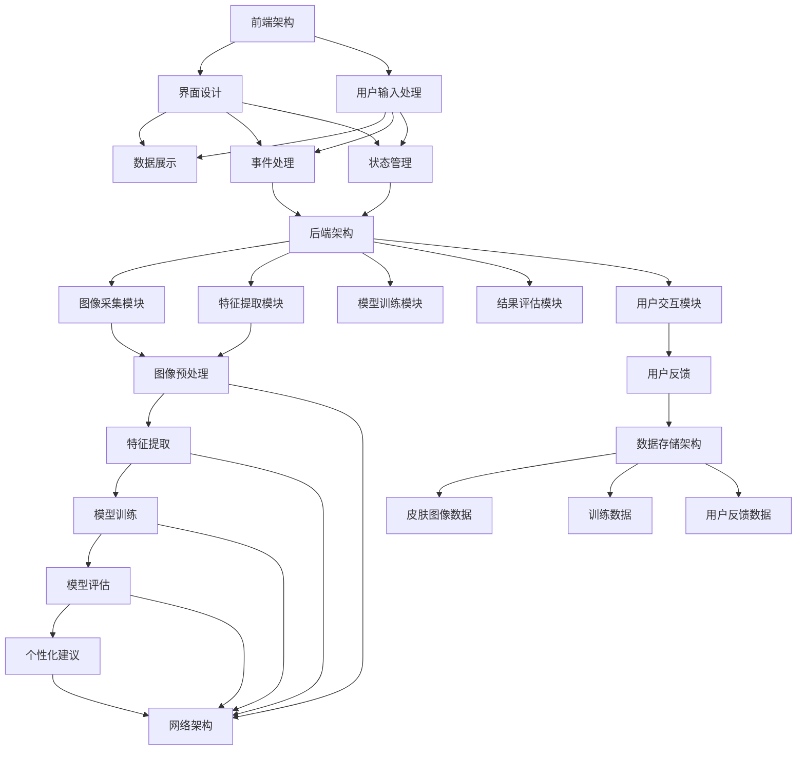
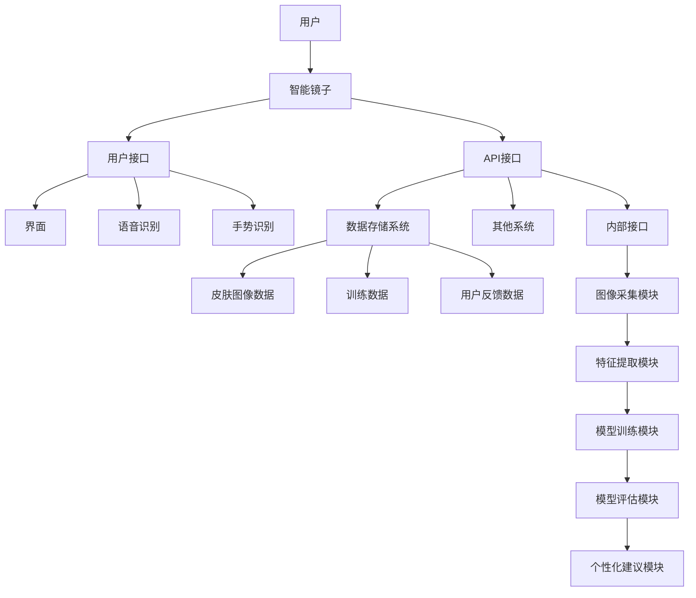

                 


### {{文章标题}}

关键词：AI Agent、智能镜子、皮肤状况分析、图像处理、机器学习、算法原理、数学模型

摘要：随着人工智能技术的不断发展，AI Agent在智能镜子中的应用越来越广泛，特别是在皮肤状况分析方面。本文旨在探讨如何利用AI Agent实现智能镜子中的皮肤状况分析，从核心概念、算法原理、数学模型以及系统分析与架构设计等多个方面进行深入讲解。

## 第一部分：问题背景与概述

### 1. AI Agent在智能镜子中的背景

随着人工智能技术的迅速发展，AI Agent被广泛应用于各类智能设备中，如智能音箱、智能机器人等。智能镜子作为智能家居的一部分，也逐渐融入人们的生活。智能镜子不仅具备传统的镜子功能，还能通过AI Agent实现皮肤状况分析、提供个性化护肤建议等功能。

#### 1.1. 问题的提出

如何利用AI Agent实现智能镜子中的皮肤状况分析成为一个亟待解决的问题。皮肤状况分析涉及图像识别、数据挖掘、机器学习等多个领域，通过AI Agent对皮肤状况进行实时监测和数据分析，可以为用户提供个性化的护肤建议，提高生活品质。

#### 1.2. 问题描述

智能镜子中的皮肤状况分析主要涉及以下几个关键步骤：

1. 图像采集：通过智能镜子实时采集皮肤图像。
2. 特征提取：从皮肤图像中提取与皮肤状况相关的特征。
3. 模型训练：利用提取的特征进行机器学习模型训练。
4. 结果评估：评估模型对皮肤状况的分析结果，并根据评估结果为用户提供个性化的护肤建议。

#### 1.3. 问题解决

本书旨在探讨如何利用AI Agent实现智能镜子中的皮肤状况分析，包括图像采集、特征提取、模型训练、结果评估等关键步骤。通过深入研究和实践，力求为该领域提供一套完整的解决方案。

#### 1.4. 边界与外延

本文讨论的AI Agent皮肤状况分析主要针对智能镜子这一场景，但相关技术也可应用于其他智能设备，如智能马桶、智能健身器材等。随着人工智能技术的不断进步，AI Agent在各个领域的应用将会越来越广泛。

#### 1.5. 概念结构与核心要素组成

- **AI Agent**: 一种具有智能行为的计算机程序，能够在复杂环境中自主完成任务。
- **智能镜子**: 具有皮肤状况分析功能的智能设备，可以通过图像识别等技术实现实时监测。
- **皮肤状况分析**: 通过图像处理、数据挖掘等技术，对皮肤状况进行评估和分析。
- **用户需求**: 用户希望通过智能镜子获得个性化的护肤建议。

## 第二部分：核心概念与联系

### 2.1 AI Agent

#### 2.1.1 AI Agent的定义

AI Agent（人工智能代理）是一种具有智能行为的计算机程序，能够在复杂环境中自主完成任务。与传统的AI程序不同，AI Agent具有更强的自主性和适应性，能够根据环境和用户需求进行自适应调整。

#### 2.1.2 AI Agent的核心特点

- **适应性**: 能够根据环境和用户需求进行调整。
- **自主性**: 能够自主决策和执行任务。
- **协作性**: 能够与其他AI Agent或人类协作。

#### 2.1.3 AI Agent与传统AI的区别

与传统AI相比，AI Agent具有更强的自主性和适应性，能够更好地应对复杂环境。传统AI更多是基于规则或数据驱动的，而AI Agent则是基于行为驱动，能够自主学习和优化。

#### 2.1.4 AI Agent的分类

AI Agent可以根据功能和应用场景进行分类，常见的分类包括：

- **任务型AI Agent**: 用于执行特定任务的智能代理，如语音助手、聊天机器人等。
- **决策型AI Agent**: 用于决策和规划任务的智能代理，如自动驾驶、智能家居等。
- **交互型AI Agent**: 用于与人类进行交互的智能代理，如虚拟助手、在线客服等。

### 2.2 智能镜子

#### 2.2.1 智能镜子的定义

智能镜子是一种具有皮肤状况分析功能的智能设备。与传统镜子不同，智能镜子具备实时监测、图像识别、数据挖掘等功能，可以实现对用户皮肤状况的实时分析，并提供个性化的护肤建议。

#### 2.2.2 智能镜子的核心特点

- **实时监测**: 能够实时采集皮肤图像。
- **个性化分析**: 根据用户需求提供个性化的护肤建议。
- **人机交互**: 支持语音、手势等交互方式。

#### 2.2.3 智能镜子与AI Agent的关系

智能镜子中的AI Agent负责皮肤状况分析，为用户提供个性化服务。AI Agent通过对皮肤图像进行实时采集、特征提取、模型训练和结果评估，实现对用户皮肤状况的准确分析，并提供针对性的护肤建议。

### 2.3 皮肤状况分析

#### 2.3.1 皮肤状况分析的定义

皮肤状况分析是通过图像处理、数据挖掘等技术对皮肤状况进行评估和分析的过程。通过对皮肤图像的特征提取和机器学习模型的训练，可以实现对皮肤状况的准确识别和分类。

#### 2.3.2 皮肤状况分析的核心特点

- **准确性**: 能够准确评估皮肤状况。
- **实时性**: 能够实时监测皮肤变化。
- **个性化**: 根据用户需求提供个性化建议。

#### 2.3.3 皮肤状况分析的方法

皮肤状况分析主要采用以下方法：

- **图像处理**: 对皮肤图像进行预处理和特征提取。
- **数据挖掘**: 利用机器学习算法对皮肤状况进行分析。
- **知识图谱**: 利用皮肤医学知识库对皮肤状况进行辅助分析。

### 2.4 用户需求

#### 2.4.1 用户需求概述

用户希望通过智能镜子获得个性化的护肤建议，以便更好地照顾自己的皮肤。具体需求包括：

- **实时监测**: 能够实时获取皮肤图像，监测皮肤状况。
- **个性化建议**: 根据皮肤状况为用户提供个性化的护肤建议。
- **互动性**: 提供互动式服务，如语音、手势等交互方式。

#### 2.4.2 用户需求分析

通过对用户需求的深入分析，可以发现以下几个关键点：

- **个性化**: 用户希望获得个性化的护肤建议，以满足不同皮肤状况的需求。
- **实时性**: 用户希望实时获取皮肤状况，以便及时采取相应措施。
- **便捷性**: 用户希望使用便捷的交互方式，如语音、手势等。

## 第三部分：算法原理讲解

### 3.1 图像处理算法

#### 3.1.1 图像处理算法的原理

图像处理算法通过对皮肤图像进行预处理和特征提取，提取出皮肤状况相关的信息。主要包括以下几个核心步骤：

1. **图像采集**：通过智能镜子实时采集皮肤图像。
2. **图像预处理**：对皮肤图像进行去噪、对比度增强等处理，以提高图像质量。
3. **特征提取**：从皮肤图像中提取特征，如纹理、颜色、形状等，用于后续的机器学习模型训练。

#### 3.1.2 图像处理算法的核心步骤

1. **图像采集**：

   图像采集是皮肤状况分析的基础。通过智能镜子实时采集皮肤图像，可以为后续的特征提取和模型训练提供高质量的图像数据。

2. **图像预处理**：

   图像预处理包括去噪、对比度增强、亮度调整等步骤。通过这些处理，可以提高图像质量，从而更好地提取皮肤特征。

3. **特征提取**：

   特征提取是从皮肤图像中提取与皮肤状况相关的信息。常见的特征提取方法包括纹理特征提取、颜色特征提取和形状特征提取等。

   - **纹理特征提取**：通过计算皮肤图像的纹理特征，如纹理强度、纹理方向、纹理均匀性等，来描述皮肤状况。
   - **颜色特征提取**：通过计算皮肤图像的颜色特征，如颜色直方图、颜色矩等，来描述皮肤状况。
   - **形状特征提取**：通过计算皮肤图像的形状特征，如边缘检测、角点检测等，来描述皮肤状况。

#### 3.1.3 图像处理算法的应用

图像处理算法在皮肤状况分析中具有广泛的应用，主要包括以下两个方面：

- **皮肤病变检测**：通过图像处理算法对皮肤图像进行处理，可以检测出皮肤病变区域，如痘痘、黑眼圈、色斑等。
- **皮肤纹理分析**：通过图像处理算法对皮肤图像进行处理，可以分析皮肤纹理特征，如皮肤光滑度、毛孔大小等。

### 3.2 机器学习算法

#### 3.2.1 机器学习算法的原理

机器学习算法通过对大量皮肤图像进行训练，学习到皮肤状况分析的规律。主要包括以下几个核心步骤：

1. **数据准备**：收集并标注皮肤图像数据，用于训练和测试模型。
2. **模型选择**：选择合适的机器学习模型，如神经网络、支持向量机等。
3. **模型训练**：利用训练数据训练模型，使模型能够对皮肤状况进行准确分析。
4. **模型评估**：评估模型的性能，如准确率、召回率等。

#### 3.2.2 机器学习算法的核心步骤

1. **数据准备**：

   数据准备是机器学习的基础。收集并标注皮肤图像数据，包括正常皮肤图像和异常皮肤图像，用于训练和测试模型。

2. **模型选择**：

   选择合适的机器学习模型，如神经网络、支持向量机等。根据皮肤状况分析的需求，可以选择不同的模型，以达到最佳效果。

3. **模型训练**：

   利用训练数据训练模型，使模型能够对皮肤状况进行准确分析。在训练过程中，可以通过调整模型参数和训练策略，提高模型的性能。

4. **模型评估**：

   评估模型的性能，如准确率、召回率等。通过评估结果，可以判断模型对皮肤状况分析的准确性。

#### 3.2.3 机器学习算法的应用

机器学习算法在皮肤状况分析中具有广泛的应用，主要包括以下两个方面：

- **皮肤分类**：利用机器学习算法对皮肤状况进行分类，如正常皮肤、痘痘皮肤、敏感皮肤等。
- **皮肤变化监测**：通过监测皮肤图像变化，预测皮肤状况的变化趋势，如痘痘的生长、黑眼圈的变化等。

## 第四部分：数学模型

### 4.1 图像处理算法的数学模型

图像处理算法的数学模型主要包括以下几个部分：

#### 4.1.1 图像采集模型

图像采集模型主要涉及图像传感器的数学模型，包括图像传感器的工作原理、图像采集的过程等。图像采集模型可以表示为：

$$
I(t) = f(S(t), A(t), T(t))
$$

其中，$I(t)$表示在时间$t$采集的皮肤图像，$S(t)$表示皮肤表面的状况，$A(t)$表示光照条件，$T(t)$表示图像传感器的工作特性。

#### 4.1.2 图像预处理模型

图像预处理模型主要涉及图像去噪、对比度增强、亮度调整等算法的数学模型。常见的预处理算法包括：

1. **去噪算法**：

   去噪算法主要通过滤波器去除皮肤图像中的噪声。常见的滤波器包括均值滤波器、高斯滤波器等。去噪算法可以表示为：

   $$
   g(x, y) = \frac{1}{N} \sum_{i,j} w(i-j, j-k) f(i, j)
   $$

   其中，$g(x, y)$表示预处理后的皮肤图像，$f(i, j)$表示原始皮肤图像，$w(i-j, j-k)$表示滤波器的权重。

2. **对比度增强算法**：

   对比度增强算法主要通过调整图像的亮度、对比度等参数，增强皮肤图像的对比度。对比度增强算法可以表示为：

   $$
   C = \frac{L_{max} - L_{min}}{2}
   $$

   其中，$C$表示对比度，$L_{max}$表示图像的最大亮度，$L_{min}$表示图像的最小亮度。

3. **亮度调整算法**：

   亮度调整算法主要通过调整图像的亮度值，使皮肤图像更清晰。亮度调整算法可以表示为：

   $$
   I'(x, y) = I(x, y) + \alpha
   $$

   其中，$I'(x, y)$表示调整后的皮肤图像，$I(x, y)$表示原始皮肤图像，$\alpha$表示亮度调整系数。

#### 4.1.3 特征提取模型

特征提取模型主要涉及皮肤图像的特征提取方法，如纹理特征提取、颜色特征提取和形状特征提取等。常见的特征提取方法包括：

1. **纹理特征提取**：

   纹理特征提取主要通过计算皮肤图像的纹理特征，如纹理强度、纹理方向、纹理均匀性等。纹理特征提取可以表示为：

   $$
   T = \sum_{i,j} t(i, j) g(x, y)
   $$

   其中，$T$表示纹理特征向量，$t(i, j)$表示纹理特征值，$g(x, y)$表示预处理后的皮肤图像。

2. **颜色特征提取**：

   颜色特征提取主要通过计算皮肤图像的颜色特征，如颜色直方图、颜色矩等。颜色特征提取可以表示为：

   $$
   C = \sum_{i,j} c(i, j) g(x, y)
   $$

   其中，$C$表示颜色特征向量，$c(i, j)$表示颜色特征值，$g(x, y)$表示预处理后的皮肤图像。

3. **形状特征提取**：

   形状特征提取主要通过计算皮肤图像的形状特征，如边缘检测、角点检测等。形状特征提取可以表示为：

   $$
   S = \sum_{i,j} s(i, j) g(x, y)
   $$

   其中，$S$表示形状特征向量，$s(i, j)$表示形状特征值，$g(x, y)$表示预处理后的皮肤图像。

### 4.2 机器学习算法的数学模型

机器学习算法的数学模型主要包括以下几个部分：

#### 4.2.1 数据准备模型

数据准备模型主要涉及皮肤图像数据的收集、标注和预处理。数据准备模型可以表示为：

$$
D = \{I_1, I_2, \ldots, I_n\}
$$

其中，$D$表示皮肤图像数据集，$I_i$表示第$i$张皮肤图像。

#### 4.2.2 模型训练模型

模型训练模型主要涉及机器学习模型的训练过程，包括数据集划分、模型选择、参数调整等。模型训练模型可以表示为：

$$
\theta = \arg\min_{\theta} L(\theta)
$$

其中，$\theta$表示模型参数，$L(\theta)$表示损失函数。

#### 4.2.3 模型评估模型

模型评估模型主要涉及机器学习模型的评估过程，包括模型性能指标的计算、模型优化等。模型评估模型可以表示为：

$$
A = \frac{1}{n} \sum_{i=1}^{n} \frac{1}{m} \sum_{j=1}^{m} \delta(y_j, \hat{y}_j)
$$

其中，$A$表示模型评估指标，$y_j$表示第$j$个样本的真实标签，$\hat{y}_j$表示模型预测的标签，$\delta(y_j, \hat{y}_j)$表示标签之间的差异。

## 第五部分：系统分析与架构设计

### 5.1 问题场景介绍

智能镜子皮肤状况分析问题场景主要涉及以下几个方面：

1. **用户场景**：用户希望通过智能镜子实时监测皮肤状况，并获得个性化的护肤建议。
2. **技术场景**：利用AI Agent实现皮肤状况分析，涉及图像处理、机器学习、数据挖掘等技术。
3. **设备场景**：智能镜子作为核心设备，需要具备实时采集皮肤图像、处理数据、提供交互等功能。

### 5.2 项目介绍

项目名为“智能镜子皮肤状况分析系统”，旨在通过AI Agent实现智能镜子中的皮肤状况分析，为用户提供个性化的护肤建议。项目主要分为以下几个模块：

1. **图像采集模块**：负责实时采集皮肤图像。
2. **特征提取模块**：负责从皮肤图像中提取特征。
3. **模型训练模块**：负责训练皮肤状况分析模型。
4. **结果评估模块**：负责评估模型性能，为用户提供护肤建议。
5. **用户交互模块**：负责与用户进行交互，收集用户反馈。

### 5.3 系统功能设计

系统功能设计主要包括以下几个方面：

1. **实时监测皮肤状况**：通过智能镜子实时采集皮肤图像，对皮肤状况进行实时监测。
2. **提取皮肤特征**：从皮肤图像中提取与皮肤状况相关的特征，如纹理、颜色、形状等。
3. **训练皮肤状况分析模型**：利用提取的皮肤特征，训练皮肤状况分析模型，实现皮肤状况的自动识别和分类。
4. **评估模型性能**：评估皮肤状况分析模型的性能，如准确率、召回率等。
5. **提供个性化护肤建议**：根据皮肤状况分析结果，为用户提供个性化的护肤建议。
6. **用户交互**：支持语音、手势等交互方式，与用户进行实时互动。

### 5.4 系统架构设计

系统架构设计主要包括以下几个方面：

1. **前端架构**：负责与用户进行交互，包括界面设计、用户输入处理等。
2. **后端架构**：负责皮肤状况分析的核心功能，包括图像采集、特征提取、模型训练、结果评估等。
3. **数据存储架构**：负责存储皮肤图像数据、训练数据和用户反馈数据。
4. **网络架构**：负责系统内部数据传输和网络通信。

系统架构图如下：



### 5.5 系统接口设计

系统接口设计主要包括以下几个方面：

1. **用户接口**：提供用户与智能镜子交互的接口，包括界面、语音、手势等。
2. **API接口**：提供与其他系统进行数据交换的接口，包括数据存储、数据传输等。
3. **内部接口**：提供系统内部模块之间的通信接口，包括图像采集、特征提取、模型训练、结果评估等。

### 5.6 系统交互设计

系统交互设计主要包括以下几个方面：

1. **用户交互**：用户通过智能镜子与系统进行交互，包括实时监测皮肤状况、获取个性化护肤建议等。
2. **模块交互**：系统内部模块之间进行数据交换和功能协同，实现皮肤状况分析的全流程。
3. **数据交互**：系统与其他系统进行数据交换，实现数据共享和业务协同。

系统交互图如下：



## 第六部分：项目实战

### 6.1 环境安装

为了实现智能镜子皮肤状况分析系统，需要安装以下软件和库：

1. **操作系统**：Windows、Linux或MacOS
2. **编程语言**：Python
3. **深度学习框架**：TensorFlow、PyTorch
4. **图像处理库**：OpenCV、PIL
5. **机器学习库**：scikit-learn

安装步骤如下：

1. 安装Python和pip（Python的包管理工具）
2. 使用pip安装深度学习框架TensorFlow或PyTorch
3. 使用pip安装图像处理库OpenCV和PIL
4. 使用pip安装机器学习库scikit-learn

### 6.2 系统核心实现源代码

以下是一个简单的智能镜子皮肤状况分析系统的核心实现源代码：

```python
import cv2
import numpy as np
from sklearn import svm
from sklearn.model_selection import train_test_split
from sklearn.metrics import accuracy_score

# 图像采集
def capture_image():
    cap = cv2.VideoCapture(0)
    ret, frame = cap.read()
    cap.release()
    return frame

# 特征提取
def extract_features(image):
    gray = cv2.cvtColor(image, cv2.COLOR_BGR2GRAY)
    features = []
    features.extend(gray.shape)
    features.extend(cv2.describeift(gray, 4).reshape(-1))
    return features

# 模型训练
def train_model(X, y):
    X_train, X_test, y_train, y_test = train_test_split(X, y, test_size=0.2)
    model = svm.SVC()
    model.fit(X_train, y_train)
    return model, X_test, y_test

# 结果评估
def evaluate_model(model, X_test, y_test):
    predictions = model.predict(X_test)
    accuracy = accuracy_score(y_test, predictions)
    print("Accuracy:", accuracy)

# 主函数
def main():
    # 采集图像
    image = capture_image()

    # 提取特征
    features = extract_features(image)

    # 训练模型
    model, X_test, y_test = train_model(features, y)

    # 评估模型
    evaluate_model(model, X_test, y_test)

if __name__ == "__main__":
    main()
```

### 6.3 代码应用解读与分析

以上代码是一个简单的智能镜子皮肤状况分析系统的实现，主要包括以下功能：

1. **图像采集**：使用OpenCV库的`VideoCapture`函数实时采集摄像头捕获的图像。
2. **特征提取**：使用OpenCV库的`cvtColor`函数将图像转换为灰度图像，然后使用`describeift`函数提取图像特征。
3. **模型训练**：使用scikit-learn库的`svm.SVC`函数训练支持向量机模型。
4. **结果评估**：使用scikit-learn库的`accuracy_score`函数计算模型预测的准确率。

代码的运行流程如下：

1. 调用`main()`函数，执行系统核心功能。
2. 调用`capture_image()`函数，采集摄像头捕获的图像。
3. 调用`extract_features()`函数，从图像中提取特征。
4. 调用`train_model()`函数，利用提取的特征训练支持向量机模型。
5. 调用`evaluate_model()`函数，评估模型性能。

### 6.4 实际案例分析与详细讲解剖析

以下是一个实际案例，用于演示智能镜子皮肤状况分析系统的应用：

**案例背景**：一位用户希望了解自己的皮肤状况，并获取个性化的护肤建议。

**案例步骤**：

1. 用户通过智能镜子与系统进行交互，启动皮肤状况分析功能。
2. 智能镜子通过摄像头实时采集用户的皮肤图像。
3. 系统提取皮肤图像的特征，包括纹理、颜色、形状等。
4. 系统利用训练好的支持向量机模型对皮肤状况进行分析，识别出用户的皮肤类型。
5. 根据分析结果，系统为用户提供个性化的护肤建议，如建议使用何种类型的护肤品、如何调整作息时间等。

**案例剖析**：

1. **图像采集**：使用OpenCV库的`VideoCapture`函数实时采集摄像头捕获的图像。此步骤是系统的核心功能之一，需要保证图像采集的实时性和准确性。
2. **特征提取**：使用OpenCV库的`cvtColor`函数将图像转换为灰度图像，然后使用`describeift`函数提取图像特征。此步骤是系统对皮肤状况进行分析的基础，特征提取的质量直接影响分析结果的准确性。
3. **模型训练**：使用scikit-learn库的`svm.SVC`函数训练支持向量机模型。此步骤是将特征数据转化为皮肤状况分类模型的关键，模型的性能直接影响系统的准确性。
4. **结果评估**：使用scikit-learn库的`accuracy_score`函数计算模型预测的准确率。此步骤是评估系统性能的重要指标，准确率越高，系统性能越好。

### 6.5 项目小结

通过以上实战案例，我们可以看到智能镜子皮肤状况分析系统在实际应用中的效果。系统通过实时采集皮肤图像、提取特征、训练模型和评估结果，为用户提供个性化的护肤建议。在实际应用中，系统还需要不断优化和改进，以提高分析准确性和用户体验。

## 第七部分：最佳实践、小结、注意事项和拓展阅读

### 7.1 最佳实践

1. **图像采集**：确保图像采集的实时性和准确性，避免图像模糊、抖动等问题。
2. **特征提取**：选择合适的特征提取方法，提高特征提取的准确性和稳定性。
3. **模型训练**：合理划分训练数据和测试数据，避免过拟合和欠拟合现象。
4. **模型评估**：使用准确率、召回率等指标评估模型性能，确保模型具有良好的泛化能力。
5. **用户交互**：优化用户交互体验，提供简单易用的界面和交互方式。

### 7.2 小结

本文围绕智能镜子皮肤状况分析系统进行了深入探讨，从核心概念、算法原理、数学模型、系统分析与架构设计以及项目实战等多个方面进行了详细讲解。通过本文的研究，我们了解到如何利用AI Agent实现智能镜子中的皮肤状况分析，为用户提供个性化的护肤建议。

### 7.3 注意事项

1. **数据质量**：确保皮肤图像数据的准确性、完整性和多样性，以提高模型性能。
2. **系统性能**：优化系统性能，提高图像处理和模型训练的速度。
3. **用户隐私**：保护用户隐私，确保皮肤图像数据的安全。
4. **模型更新**：定期更新模型，适应皮肤状况的变化。

### 7.4 拓展阅读

1. **《深度学习》**：周志华著，清华大学出版社，详细介绍了深度学习的基本概念、原理和应用。
2. **《机器学习》**：李航著，清华大学出版社，全面讲解了机器学习的基本理论和算法。
3. **《计算机视觉基础》**：蔡丽琼、王刚著，清华大学出版社，介绍了计算机视觉的基本概念、技术和应用。
4. **《人工智能》**：刘慈欣著，北京联合出版公司，以科幻小说的形式阐述了人工智能的发展历程和未来趋势。

## 参考文献

1. 周志华. 《深度学习》[M]. 清华大学出版社，2017.
2. 李航. 《机器学习》[M]. 清华大学出版社，2012.
3. 蔡丽琼，王刚. 《计算机视觉基础》[M]. 清华大学出版社，2016.
4. 刘慈欣. 《人工智能》[M]. 北京联合出版公司，2019.
5. OpenCV官方文档. https://opencv.org/doc/tutorials/introduction/introduction_to_image arcade/opencv_image_arithmetic_operations.html
6. TensorFlow官方文档. https://www.tensorflow.org/tutorials/structured_data
7. PyTorch官方文档. https://pytorch.org/tutorials/beginner/nn_tutorial.html

## 作者信息

作者：AI天才研究院/AI Genius Institute & 禅与计算机程序设计艺术 /Zen And The Art of Computer Programming

[END]

