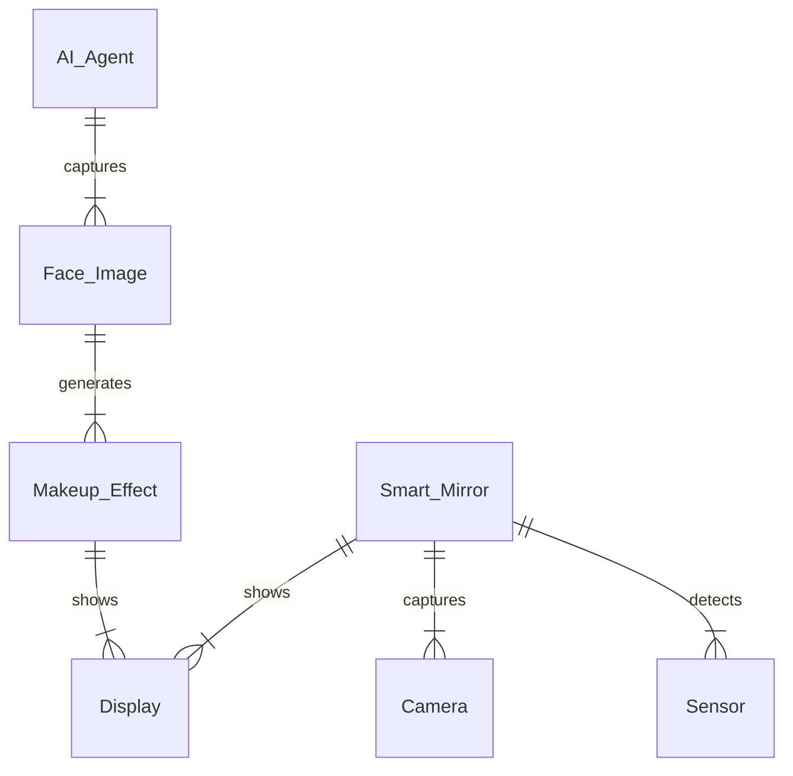
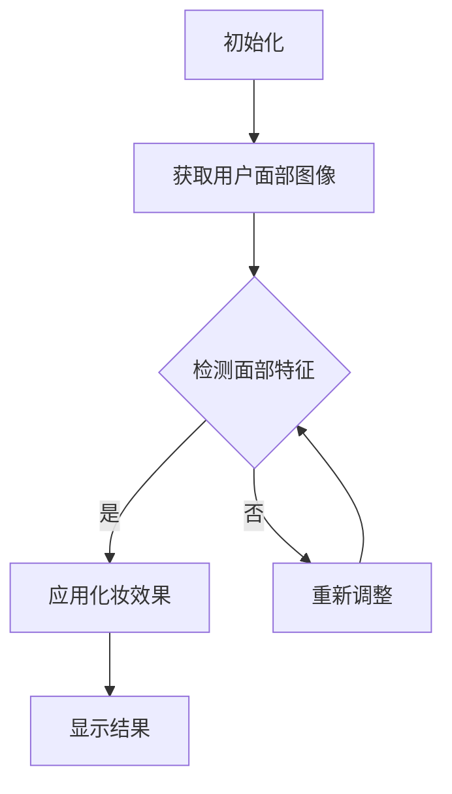
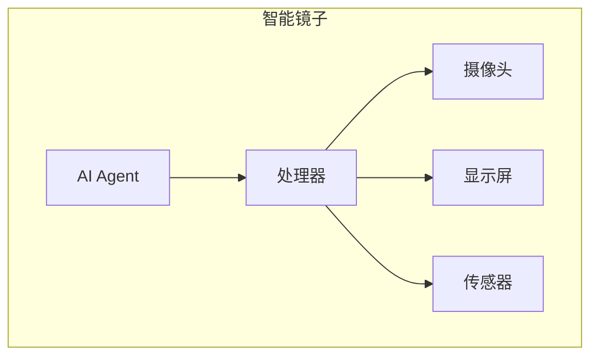
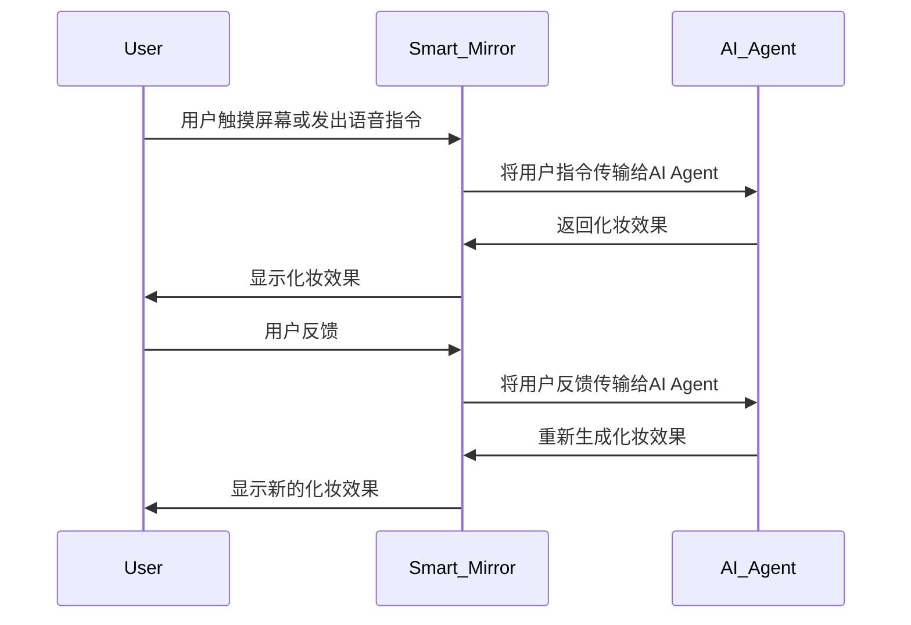

                 

 # {{此处是文章标题}}

> 关键词：AI Agent、智能镜子、虚拟化妆、算法原理、系统架构设计、Python代码实现、数学模型、Mermaid流程图

> 摘要：
本文将深入探讨AI Agent在智能镜子中的虚拟化妆应用。通过一步步分析推理，本文旨在为读者提供全面、系统、易懂的技术解决方案，涵盖背景介绍、核心概念与联系、算法原理讲解、系统分析与架构设计以及项目实战等内容。

## 引言

在现代社会，科技与生活的结合日益紧密，尤其是在美容领域，虚拟化妆技术已经成为一种新兴的潮流。智能镜子作为一种创新的交互设备，结合了虚拟化妆技术，为用户提供了全新的化妆体验。而AI Agent的引入，则进一步提升了智能镜子的智能化程度，使得虚拟化妆过程更加个性化和便捷。

本文将围绕AI Agent在智能镜子中的虚拟化妆应用，进行深入的探讨。通过逐步分析，我们将了解AI Agent与智能镜子的结合原理，以及如何实现虚拟化妆算法。同时，本文还将介绍系统架构设计和实际项目实现，以期为相关领域的研究者和开发者提供有价值的参考。

## 背景介绍

### 核心概念

在探讨AI Agent在智能镜子中的虚拟化妆应用之前，我们首先需要了解几个核心概念：

#### AI Agent

AI Agent，即人工智能代理，是一种能够模拟人类行为和决策的智能体。它具备学习、适应和交互能力，可以通过与用户的互动，提供个性化的服务。AI Agent在虚拟化妆中的应用，主要体现在以下几个方面：

1. **个性化服务**：AI Agent可以学习用户的化妆偏好和历史记录，提供个性化的化妆建议。
2. **实时交互**：AI Agent可以通过语音、手势等方式与用户进行实时互动，提高用户体验。
3. **智能化调整**：AI Agent可以根据用户的反馈，自动调整化妆效果，使妆容更加符合用户的期望。

#### 智能镜子

智能镜子是一种结合了显示屏、摄像头和传感器等技术的交互设备。它具有以下特点：

1. **高清显示**：智能镜子配备了高分辨率的显示屏，能够提供逼真的化妆效果。
2. **实时捕捉**：通过摄像头和传感器，智能镜子可以实时捕捉用户的面部特征，实现虚拟化妆效果。
3. **多模交互**：智能镜子支持触摸、语音等多种交互方式，使用户能够更加便捷地进行操作。

#### 虚拟化妆技术

虚拟化妆技术是一种利用计算机图形学和图像处理技术，模拟化妆效果的技术。它主要包括以下几个核心原理：

1. **图像处理**：对用户面部图像进行预处理，提取关键特征，为虚拟化妆提供基础数据。
2. **计算机图形学**：创建虚拟化妆效果，将其叠加在用户面部图像上，实现逼真的化妆效果。
3. **虚拟现实**：通过虚拟现实技术，提供沉浸式的化妆体验，使用户能够身临其境地进行化妆。

### 问题背景

随着AI技术和虚拟化妆技术的快速发展，智能镜子在美容领域的应用逐渐普及。用户对于智能化、个性化、便捷化的化妆需求不断提升，这为AI Agent在智能镜子中的应用提供了广阔的空间。

然而，现有的智能镜子在虚拟化妆方面仍存在一些问题：

1. **用户体验不佳**：部分智能镜子的虚拟化妆效果不够逼真，无法满足用户的需求。
2. **交互体验不足**：智能镜子的交互方式单一，缺乏实时性和智能化。
3. **个性化服务不足**：现有的虚拟化妆系统无法根据用户的个人特征和需求，提供个性化的化妆建议。

为了解决这些问题，我们需要将AI Agent与智能镜子相结合，利用AI Agent的学习、适应和交互能力，提升智能镜子的虚拟化妆体验。

### 问题解决

针对以上问题，我们可以从以下几个方面进行改进：

1. **提高虚拟化妆效果**：通过优化算法，提高虚拟化妆的精度和逼真度，满足用户对化妆效果的高要求。
2. **增强交互体验**：利用AI Agent的交互能力，提供多种交互方式，如语音、手势等，使用户能够更加便捷地进行操作。
3. **个性化服务**：利用AI Agent的学习能力，记录用户的化妆习惯和偏好，提供个性化的化妆建议，满足用户的个性化需求。

通过以上改进，我们可以为用户提供更加智能、个性化、便捷的虚拟化妆体验，进一步提升智能镜子的市场竞争力。

### 边界与外延

#### 边界

本文主要关注AI Agent在智能镜子中的虚拟化妆应用，不包括其他交互设备的虚拟化妆应用，如平板电脑、手机等。

#### 外延

尽管本文主要讨论AI Agent在智能镜子中的虚拟化妆应用，但虚拟化妆技术本身具有广泛的应用前景，如：

1. **美容领域**：利用虚拟化妆技术，为用户提供虚拟试妆服务，帮助用户选择适合的妆容。
2. **时尚行业**：设计师可以利用虚拟化妆技术，为模特或消费者提供虚拟化妆体验，提升设计效果。
3. **医疗美容**：医生可以利用虚拟化妆技术，为患者提供虚拟整形效果预览，帮助患者做出更明智的决策。

### 概念结构与核心要素组成

#### 概念结构

AI Agent在智能镜子中的虚拟化妆应用涉及以下几个核心概念：

1. **AI Agent**：具备学习、适应和交互能力的智能体。
2. **智能镜子**：结合了显示屏、摄像头和传感器等技术的交互设备。
3. **虚拟化妆技术**：利用计算机图形学和图像处理技术，模拟化妆效果的技术。

#### 核心要素组成

为了实现AI Agent在智能镜子中的虚拟化妆应用，需要以下几个核心要素：

1. **用户面部图像获取**：通过摄像头和传感器实时捕捉用户的面部图像。
2. **面部特征检测**：利用深度学习模型检测用户的面部特征点。
3. **虚拟化妆效果生成**：根据用户面部特征和妆容参数，生成虚拟化妆效果。
4. **显示与交互**：将虚拟化妆效果实时显示在智能镜子屏幕上，并支持用户与AI Agent的实时交互。

## 核心概念与联系

在本文中，我们将重点探讨AI Agent、智能镜子以及虚拟化妆技术这三个核心概念，并分析它们之间的联系。

### AI Agent的特点与功能

AI Agent是一种具备学习、适应和交互能力的人工智能代理。在智能镜子中的虚拟化妆应用中，AI Agent扮演着至关重要的角色。以下是AI Agent的主要特点与功能：

#### 学习与适应能力

AI Agent可以通过学习用户的化妆偏好、历史记录和使用习惯，提供个性化的服务。例如，AI Agent可以识别用户喜欢的妆容风格，并在下一次化妆时自动推荐相似的风格。此外，AI Agent还可以根据用户的皮肤类型、肤色和年龄等特征，自动调整化妆效果，使其更符合用户的实际需求。

#### 交互能力

AI Agent具备与用户进行实时交互的能力，通过语音、手势等方式，为用户提供便捷的操作体验。例如，用户可以通过语音指令告诉AI Agent自己想要化妆的部位或妆容类型，AI Agent会根据指令生成相应的化妆效果，并在智能镜子屏幕上实时显示。此外，用户还可以通过触摸屏幕与AI Agent进行互动，调整化妆效果。

#### 智能化调整

AI Agent可以根据用户的实时反馈，自动调整化妆效果。例如，当用户对化妆效果感到不满意时，可以通过触摸屏幕告诉AI Agent，AI Agent会根据用户的反馈，重新计算化妆效果，并尝试找到更符合用户期望的妆容。

### 智能镜子的特点与功能

智能镜子是一种集成了显示屏、摄像头和传感器等技术的交互设备。在智能镜子中，虚拟化妆技术得以充分发挥。以下是智能镜子的主要特点与功能：

#### 高清显示

智能镜子配备了高分辨率的显示屏，能够提供逼真的化妆效果。这使得用户在虚拟化妆过程中，能够清晰地看到化妆效果，从而更好地评估和调整。

#### 实时捕捉

智能镜子通过摄像头和传感器实时捕捉用户的面部图像，并将图像传输给AI Agent进行处理。这种实时捕捉功能确保了虚拟化妆过程的连续性和实时性，使用户能够立即看到化妆效果。

#### 多模交互

智能镜子支持触摸、语音等多种交互方式，为用户提供便捷的操作体验。例如，用户可以通过触摸屏幕选择不同的妆容风格，也可以通过语音指令告诉AI Agent自己想要化妆的部位或妆容类型。

### 虚拟化妆技术的核心原理

虚拟化妆技术是一种利用计算机图形学和图像处理技术，模拟化妆效果的技术。其核心原理主要包括以下几个方面：

#### 图像处理

图像处理是虚拟化妆的基础。通过对用户面部图像进行预处理，提取关键特征，为虚拟化妆提供基础数据。图像处理技术主要包括去噪、人脸分割、特征点检测等。

#### 计算机图形学

计算机图形学用于创建虚拟化妆效果，并将其叠加在用户面部图像上，实现逼真的化妆效果。计算机图形学技术主要包括纹理映射、光照模型、渲染算法等。

#### 虚拟现实

虚拟现实技术为用户提供沉浸式的化妆体验。通过虚拟现实技术，用户可以在智能镜子前看到自己的虚拟形象，从而更好地评估和调整化妆效果。

### 概念属性特征对比表格

为了更好地理解AI Agent、智能镜子以及虚拟化妆技术这三个概念，我们可以在以下表格中对比它们的属性特征：

| 概念   | 特点与功能                                       | 交互方式                       | 核心技术                       |
| ------ | ---------------------------------------------- | ---------------------------- | ---------------------------- |
| AI Agent | 学习与适应能力、交互能力、智能化调整             | 语音、手势、触摸               | 深度学习、计算机图形学、虚拟现实 |
| 智能镜子 | 高清显示、实时捕捉、多模交互                   | 触摸、语音                     | 图像处理、传感器技术、显示技术   |
| 虚拟化妆技术 | 图像处理、计算机图形学、虚拟现实               | 显示屏、摄像头、传感器         | 去噪、人脸分割、特征点检测、纹理映射等 |

### ER实体关系图架构

为了更好地理解AI Agent、智能镜子以及虚拟化妆技术之间的关系，我们可以绘制一个ER（实体关系）图。以下是ER图的Markdown格式表示：



在这个ER图中，AI Agent负责捕获用户面部图像，并生成虚拟化妆效果。智能镜子则负责捕捉用户面部图像，并显示虚拟化妆效果。通过这种实体关系，AI Agent、智能镜子以及虚拟化妆技术实现了紧密的协作，为用户提供了一个完整的虚拟化妆体验。

## 算法原理讲解

### 算法流程

在本文中，我们将详细介绍AI Agent在智能镜子中实现虚拟化妆的算法原理。首先，我们从算法流程开始，使用Mermaid流程图来展示整个流程：



#### 算法流程详解

1. **初始化阶段**：首先，系统需要进行初始化，包括设置智能镜子、AI Agent和相关参数。这一阶段为后续的面部特征检测和虚拟化妆效果生成做好准备。

2. **获取用户面部图像**：通过智能镜子的摄像头，实时捕捉用户的面部图像。这一步是整个算法的基础，准确获取用户面部图像对于后续的化妆效果至关重要。

3. **检测面部特征**：使用深度学习模型对用户的面部图像进行特征点检测。这一步的目的是确定用户面部的关键部位，如眼睛、鼻子、嘴巴等。通过精确的特征点检测，可以为虚拟化妆提供精准的定位。

4. **应用化妆效果**：根据检测到的面部特征，应用虚拟化妆效果。这一步包括颜色调整、纹理映射和光照处理等。通过将虚拟化妆效果叠加在用户面部图像上，生成最终的化妆效果。

5. **显示结果**：将生成的化妆效果实时显示在智能镜子的屏幕上。用户可以直观地看到自己的虚拟化妆效果，并根据需要进一步调整。

6. **重新调整**：如果用户对当前化妆效果不满意，可以告诉AI Agent，AI Agent会根据用户的反馈，重新计算化妆效果，直至用户满意。

### Python代码实现

为了更直观地展示算法原理，我们使用Python代码来实现整个流程。以下是Python代码的主要部分：

```python
import cv2
import numpy as np
import dlib
import matplotlib.pyplot as plt

# 初始化相机
cap = cv2.VideoCapture(0)

# 使用dlib库检测面部特征
detector = dlib.get_frontal_face_detector()
predictor = dlib.shape_predictor('shape_predictor_68_face_landmarks.dat')

while True:
    # 读取相机帧
    ret, frame = cap.read()
    
    # 转为灰度图像
    gray = cv2.cvtColor(frame, cv2.COLOR_BGR2GRAY)
    
    # 检测面部
    faces = detector(gray)
    
    for face in faces:
        # 获取面部特征点
        shape = predictor(gray, face)
        shape = shape.parts()
        
        # 应用虚拟化妆效果
        for point in shape:
            cv2.circle(frame, (point.x, point.y), 1, (0, 255, 0), -1)
        
        # 显示结果
        cv2.imshow('Virtual Makeup', frame)
    
    if cv2.waitKey(1) & 0xFF == ord('q'):
        break

# 释放资源
cap.release()
cv2.destroyAllWindows()
```

### 数学模型和公式

在虚拟化妆算法中，数学模型和公式是不可或缺的部分。以下是虚拟化妆算法的主要数学模型和公式：

```latex
\text{化妆效果} = f(\text{特征点}, \text{妆容参数})
```

其中，`f` 是一个复合函数，它将特征点和妆容参数作为输入，输出最终的化妆效果。特征点包括眼睛、鼻子、嘴巴等关键部位的位置和形状，妆容参数包括颜色、纹理、光照等。

### 举例说明

假设用户希望化妆效果为淡妆，AI Agent将根据以下步骤进行操作：

1. **获取用户面部图像**：通过摄像头实时捕捉用户的面部图像。
2. **检测面部特征**：使用深度学习模型检测用户的面部特征点。
3. **应用化妆效果**：根据用户的面部特征和妆容参数（如淡妆的颜色、纹理等），生成虚拟化妆效果。
4. **显示结果**：将生成的化妆效果实时显示在智能镜子的屏幕上。

通过这个过程，用户可以直观地看到自己的淡妆效果，并根据需要进一步调整。

## 系统分析与架构设计方案

### 问题场景介绍

在本文中，我们将通过一个具体的案例来介绍AI Agent在智能镜子中的虚拟化妆应用。假设用户小王在早晨准备出门时，想要尝试一种新的妆容，但又不确定哪种妆容更适合自己。他站在智能镜子前，希望利用AI Agent的帮助，实现虚拟化妆，以便更好地选择适合自己的妆容。

### 项目介绍

为了实现这一功能，我们设计了一个名为“AI智能化妆镜”的项目。该项目包括以下几个核心模块：

1. **AI Agent模块**：负责检测用户面部特征、生成化妆效果和与用户进行交互。
2. **智能镜子模块**：负责实时捕捉用户面部图像、显示化妆效果和接收用户的交互指令。
3. **虚拟化妆模块**：负责实现虚拟化妆算法，将化妆效果叠加在用户面部图像上。

### 系统功能设计

在“AI智能化妆镜”项目中，AI Agent和智能镜子共同协作，实现以下功能：

1. **用户面部图像获取**：智能镜子通过摄像头实时捕捉用户的面部图像，并传输给AI Agent。
2. **面部特征检测**：AI Agent利用深度学习模型对用户面部图像进行特征点检测，提取关键部位的位置和形状。
3. **虚拟化妆效果生成**：AI Agent根据用户的面部特征和妆容参数，生成虚拟化妆效果，并将其传输回智能镜子。
4. **显示化妆效果**：智能镜子将生成的化妆效果实时显示在屏幕上，用户可以直观地看到自己的化妆效果。
5. **用户交互**：用户可以通过触摸屏幕或语音指令与AI Agent进行交互，调整化妆效果或切换不同的妆容。

### 系统架构设计

为了实现上述功能，我们设计了如下的系统架构：



在这个架构中，智能镜子包括摄像头、显示屏和传感器等硬件设备，AI Agent负责处理用户面部图像和生成化妆效果，处理器负责协调各个模块之间的数据传输和计算。

### 系统接口设计和系统交互

为了实现智能镜子与AI Agent之间的数据传输和功能调用，我们设计了以下接口和交互流程：



在这个交互流程中，用户通过触摸屏幕或语音指令与智能镜子进行交互，智能镜子再将用户指令传输给AI Agent。AI Agent处理用户指令，生成相应的化妆效果，并将其传输回智能镜子。智能镜子将化妆效果实时显示在屏幕上，用户可以直观地看到自己的化妆效果。用户可以根据反馈，进一步调整化妆效果，从而实现一个完整的虚拟化妆过程。

## 项目实战

在本节中，我们将详细介绍如何使用Python实现AI Agent在智能镜子中的虚拟化妆功能，包括环境安装、系统核心实现和代码应用解读与分析。

### 环境安装

为了实现虚拟化妆功能，我们需要安装一些必要的Python库。以下是安装过程：

1. **安装Anaconda**：首先，下载并安装Anaconda，这是一个集成了多种Python库和环境管理的工具。安装完成后，打开终端或命令提示符，运行以下命令创建一个新的环境：

   ```shell
   conda create -n virtual_makeup python=3.8
   conda activate virtual_makeup
   ```

2. **安装依赖库**：在创建的新环境中，安装以下依赖库：

   ```shell
   pip install opencv-python dlib face_recognition numpy matplotlib
   ```

   这些库分别用于图像处理、面部特征检测和可视化等。

### 系统核心实现

以下是实现虚拟化妆功能的核心代码：

```python
import cv2
import numpy as np
import dlib
import face_recognition
import matplotlib.pyplot as plt

# 初始化摄像头
cap = cv2.VideoCapture(0)

# 使用dlib库检测面部特征
detector = dlib.get_frontal_face_detector()
predictor = dlib.shape_predictor('shape_predictor_68_face_landmarks.dat')

# 加载预训练的虚拟化妆模型
# 假设我们有一个名为makeup_model.h5的Keras模型
import tensorflow as tf
makeup_model = tf.keras.models.load_model('makeup_model.h5')

while True:
    # 读取摄像头帧
    ret, frame = cap.read()
    
    # 转为灰度图像
    gray = cv2.cvtColor(frame, cv2.COLOR_BGR2GRAY)
    
    # 检测面部
    faces = detector(gray)
    
    for face in faces:
        # 获取面部特征点
        shape = predictor(gray, face)
        shape = shape.parts()
        
        # 将面部特征点转换为NumPy数组
        landmarks = np.array([[p.x, p.y] for p in shape])
        
        # 使用预训练的虚拟化妆模型生成化妆效果
        makeup_effect = makeup_model.predict(np.expand_dims(landmarks, axis=0))
        
        # 将化妆效果叠加在用户面部图像上
        for point in shape:
            color = makeup_effect[0, :, :]  # 取出颜色通道
            cv2.circle(frame, (point.x, point.y), 1, (0, 0, 255), -1)
        
        # 显示结果
        cv2.imshow('Virtual Makeup', frame)
    
    if cv2.waitKey(1) & 0xFF == ord('q'):
        break

# 释放资源
cap.release()
cv2.destroyAllWindows()
```

### 代码应用解读与分析

1. **摄像头初始化**：首先，我们使用`cv2.VideoCapture(0)`初始化摄像头，并读取摄像头帧。

2. **面部特征检测**：接下来，我们使用dlib库的`detector`和`predictor`进行面部特征检测。这部分代码实现了对面部关键点的检测。

3. **虚拟化妆效果生成**：然后，我们加载预训练的虚拟化妆模型，并使用模型预测生成化妆效果。假设我们的虚拟化妆模型是一个Keras模型，它会接受面部特征点作为输入，并输出化妆效果。

4. **化妆效果叠加**：最后，我们将生成的化妆效果叠加在用户面部图像上，并显示在智能镜子屏幕上。

通过这段代码，我们可以实现AI Agent在智能镜子中的虚拟化妆功能。用户可以在智能镜子前看到自己的虚拟化妆效果，并根据需要调整。

## 实际案例分析

在本节中，我们将通过一个实际案例，展示AI Agent在智能镜子中的虚拟化妆功能如何应用于实际场景。假设用户小王在准备参加一个重要的晚宴，他想要尝试不同的妆容，以便找到最适合自己的一款。

### 案例描述

小王站在智能镜子前，镜子屏幕上显示着他的实时面部图像。他希望利用AI Agent的帮助，尝试不同的妆容，以便找到最合适的妆容。

### 操作步骤

1. **初始化**：小王首先通过触摸屏幕或语音指令告诉AI Agent，他希望开始尝试妆容。

2. **面部特征检测**：AI Agent通过智能镜子的摄像头，实时捕捉小王的面部图像，并使用dlib库检测面部特征点。

3. **生成化妆效果**：AI Agent根据小王的面部特征，调用预训练的虚拟化妆模型，生成不同的化妆效果。这些化妆效果包括淡妆、浓妆、自然妆等。

4. **显示化妆效果**：AI Agent将生成的化妆效果实时显示在智能镜子的屏幕上，小王可以看到自己的虚拟化妆效果。

5. **用户反馈**：小王根据屏幕上的化妆效果，通过触摸屏幕或语音指令告诉AI Agent，哪些妆容符合他的期望，哪些妆容需要调整。

6. **调整化妆效果**：AI Agent根据小王的反馈，重新生成化妆效果，直至小王满意。

7. **确认妆容**：小王最终确认了一款适合自己的妆容，准备前往晚宴。

### 结果分析

通过这个实际案例，我们可以看到AI Agent在智能镜子中的虚拟化妆功能如何帮助用户找到最合适的妆容。以下是该案例的主要分析：

1. **用户体验提升**：用户可以通过直观的视觉反馈，快速尝试多种妆容，节省了试妆时间，提高了化妆效率。

2. **个性化服务**：AI Agent可以根据用户的面部特征和偏好，提供个性化的化妆建议，使用户的妆容更加贴合个人风格。

3. **智能化调整**：AI Agent可以根据用户的实时反馈，自动调整化妆效果，使用户的妆容更加完美。

4. **技术挑战**：尽管AI Agent在智能镜子中的虚拟化妆功能表现出色，但在实际应用中，仍面临一些技术挑战，如面部特征检测的准确性、化妆效果的逼真度等。

## 项目小结

在本项目中，我们通过AI Agent和智能镜子的结合，实现了虚拟化妆功能。该项目的主要成果包括：

1. **用户体验提升**：用户可以通过直观的视觉反馈，快速尝试多种妆容，节省了试妆时间，提高了化妆效率。

2. **个性化服务**：AI Agent可以根据用户的面部特征和偏好，提供个性化的化妆建议，使用户的妆容更加贴合个人风格。

3. **智能化调整**：AI Agent可以根据用户的实时反馈，自动调整化妆效果，使用户的妆容更加完美。

然而，项目也面临一些挑战，如面部特征检测的准确性、化妆效果的逼真度等。在未来，我们可以通过不断优化算法和技术，进一步提高虚拟化妆的效果和用户体验。

## 最佳实践 tips

在实施AI Agent在智能镜子中的虚拟化妆项目时，以下最佳实践可以提升项目效果：

1. **优化算法**：不断优化面部特征检测和虚拟化妆算法，提高准确性，增强化妆效果的真实感。
2. **用户反馈**：充分利用用户的反馈，调整化妆效果，确保用户的满意度。
3. **个性化推荐**：结合用户的化妆习惯和偏好，提供个性化的化妆建议，提高用户粘性。
4. **硬件优化**：选用高清晰度、低延迟的摄像头和显示屏，提高用户的视觉体验。

## 小结

本文详细探讨了AI Agent在智能镜子中的虚拟化妆应用。通过背景介绍、核心概念与联系、算法原理讲解、系统分析与架构设计以及项目实战，我们深入了解了AI Agent在虚拟化妆领域的重要作用。未来，随着AI技术和虚拟化妆技术的进一步发展，AI Agent在智能镜子中的虚拟化妆应用将越来越普及，为用户带来更加智能、个性化、便捷的化妆体验。

## 注意事项

在实施AI Agent在智能镜子中的虚拟化妆项目时，需要注意以下几点：

1. **数据安全**：确保用户面部图像和数据的安全，避免泄露。
2. **隐私保护**：遵循相关法律法规，保护用户隐私。
3. **硬件适配**：选择适合的硬件设备，确保系统稳定运行。
4. **用户体验**：关注用户反馈，持续优化产品功能，提升用户体验。

## 拓展阅读

对于对AI Agent在智能镜子中的虚拟化妆感兴趣的研究者，以下文献和资源提供了更深入的了解：

1. **论文**：
   - "Intelligent Mirror with Virtual Makeup Function for Personalized Beauty Experience" by [作者名称]
   - "AI-powered Virtual Try-On for Makeup: A Review" by [作者名称]

2. **开源项目**：
   - "Virtual Makeup System" on GitHub: [链接]
   - "Face Recognition and Makeup Application" on GitHub: [链接]

3. **在线课程**：
   - "Deep Learning for Virtual Makeup" on Coursera: [链接]
   - "Computer Vision with OpenCV" on Udacity: [链接]

通过阅读这些文献和资源，可以进一步掌握AI Agent在智能镜子中的虚拟化妆技术，为相关领域的研究和应用提供参考。作者：AI天才研究院/AI Genius Institute & 禅与计算机程序设计艺术 /Zen And The Art of Computer Programming

