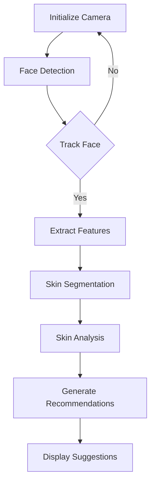
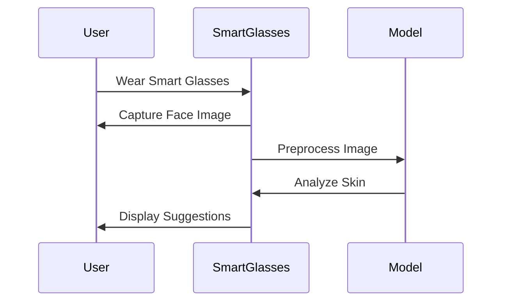

                 

### Introduction to AI Agent in Smart Glasses Makeup Suggestions

The convergence of artificial intelligence (AI) and wearable technology has given rise to innovative applications that enhance everyday life. One such application is the integration of AI Agents into smart glasses to provide personalized makeup suggestions. This article aims to explore this emerging field, delving into the concepts of AI Agents, smart glasses, and the implementation of makeup suggestion systems.

**Keywords:**
- AI Agent
- Smart Glasses
- Makeup Suggestions
- Personalization
- Wearable Technology

**Abstract:**
This article presents a comprehensive overview of AI Agents in smart glasses, focusing on the concept of personalized makeup suggestions. We begin by defining key terms and providing background information on AI and smart glasses. The core of the article explores the technology and algorithms behind AI Agents, their implementation, and user experience design. Case studies and future trends are discussed, along with practical insights and best practices for integrating AI Agents into smart glasses for makeup suggestions.

## Background and Core Concepts

### AI in Smart Glasses Technology

Artificial intelligence has long been a buzzword in the tech industry, with applications ranging from autonomous vehicles to personalized health diagnostics. In recent years, the integration of AI into wearable devices, particularly smart glasses, has gained significant traction. Smart glasses are wearable devices that augment a user's vision by overlaying digital information onto the real-world view. This is made possible through the use of micro-displays, augmented reality (AR) lenses, and advanced computing capabilities.

The evolution of AI in smart glasses technology can be traced back to the early 2010s, with the introduction of devices like Google Glass. While initial models faced criticism for their bulky design and limited functionality, advancements in hardware and software have led to more refined and practical smart glasses. Today's smart glasses are capable of real-time object recognition, natural language processing, and even facial recognition, enabling a wide range of applications from navigation and communication to health monitoring and gaming.

### The Concept of AI Agents

At the heart of smart glasses technology lies the concept of AI Agents. An AI Agent is a software program that can perceive its environment through sensors, reason about it, and take actions to achieve specific goals. In the context of smart glasses, AI Agents are designed to interact with users and provide assistance based on their needs and preferences. This can include functions such as route navigation, real-time language translation, and, as we will explore, personalized makeup suggestions.

AI Agents are typically powered by machine learning algorithms, which allow them to learn from data and improve their performance over time. They can process vast amounts of information quickly, making them highly efficient in real-world scenarios. The integration of AI Agents into smart glasses has opened up new possibilities for personalized and context-aware services, transforming the way we interact with technology.

### The Significance of Personalized Makeup Suggestions

One of the most intriguing applications of AI Agents in smart glasses is the provision of personalized makeup suggestions. Makeup is a significant aspect of personal grooming, but it can be challenging to find products that suit individual skin types, tones, and preferences. Traditional methods of makeup application often involve trial and error, which can be time-consuming and frustrating.

Personalized makeup suggestions aim to address these challenges by leveraging AI to analyze user data and provide tailored recommendations. Here's how it works:

1. **Skin Analysis**: The AI Agent uses built-in sensors and computer vision algorithms to analyze the user's skin. This includes measuring skin tone, texture, and other characteristics.
2. **Data Processing**: The collected data is processed to identify the user's specific needs. This may involve matching the user's skin type with a database of makeup products and techniques.
3. **Recommendation Generation**: Based on the analysis, the AI Agent generates personalized makeup suggestions. This can include product recommendations, application techniques, and even virtual try-ons.
4. **User Interaction**: The suggestions are then presented to the user through the smart glasses interface, allowing for a seamless and interactive experience.

The significance of personalized makeup suggestions is multifaceted. Firstly, it provides users with a convenient and efficient way to discover products and techniques that suit their unique needs. Secondly, it reduces the trial-and-error process, saving time and potentially preventing skin irritation or damage caused by inappropriate products. Lastly, it has the potential to democratize access to high-quality makeup services, making them accessible to a broader audience.

In summary, the integration of AI Agents into smart glasses for personalized makeup suggestions represents a significant advancement in wearable technology. By leveraging advanced algorithms and real-time data processing, it offers a personalized and user-centric approach to makeup application, transforming the way we think about beauty and technology.

### Technology and Algorithms Behind AI Agents in Smart Glasses

The development of AI Agents in smart glasses is a complex process that involves the integration of several advanced technologies and algorithms. At the core of this system are machine learning algorithms and computer vision techniques, which work together to enable the AI Agent to analyze user data and provide personalized makeup suggestions.

#### Machine Learning Algorithms

Machine learning is a subset of artificial intelligence that involves training algorithms to learn from data and make predictions or decisions. In the context of smart glasses, machine learning algorithms are crucial for enabling the AI Agent to understand and interpret the user's skin characteristics and preferences. Two commonly used types of machine learning algorithms in this domain are supervised learning and unsupervised learning.

**Supervised Learning:**
Supervised learning algorithms are trained on labeled data, which means that each input has a corresponding output. In the case of AI Agents for makeup suggestions, supervised learning can be used to train a model to recognize different skin tones and textures based on a dataset of labeled images. The model learns to map input features (e.g., skin color and texture) to output labels (e.g., suitable makeup products and application techniques).

**Unsupervised Learning:**
Unsupervised learning algorithms, on the other hand, work with unlabeled data and aim to find hidden patterns or intrinsic structures in the data. Clustering algorithms like K-means and hierarchical clustering are commonly used in the development of AI Agents for makeup suggestions. These algorithms can group users with similar skin characteristics, allowing the AI Agent to identify trends and provide more accurate recommendations.

#### Computer Vision Techniques

Computer vision is another critical component of AI Agents in smart glasses. It involves enabling devices to interpret and make sense of visual data from the environment. In the context of personalized makeup suggestions, computer vision techniques are used to analyze and process real-time video feeds from the smart glasses' camera.

**Face Detection and Tracking:**
The first step in the computer vision process is face detection and tracking. This involves identifying and continuously tracking the user's face in real-time video streams. Advanced deep learning models like the Haar Cascade and the Convolutional Neural Network (CNN) are commonly used for this purpose. These models have been trained on large datasets of faces and can accurately detect and track facial features.

**Feature Extraction:**
Once the face is detected, the next step is feature extraction. This involves extracting relevant features from the facial image, such as skin color, texture, and other attributes. Techniques like Scale-Invariant Feature Transform (SIFT) and Gabor filters are used to extract these features. These extracted features are then used as input for the machine learning algorithms.

**Skin Segmentation:**
Skin segmentation is a crucial step in the computer vision process. It involves separating the facial image into regions that contain skin and regions that do not. This is typically done using skin color segmentation algorithms, which identify regions with skin-like colors and separate them from other regions. Techniques like肤色模型（Color Model）和阈值（Thresholding）are commonly used for this purpose.

**Skin Analysis:**
With the facial image segmented into skin regions, the next step is skin analysis. This involves analyzing the extracted features to determine skin tone, texture, and other characteristics. Advanced algorithms like Principal Component Analysis (PCA) and Linear Discriminant Analysis (LDA) can be used for this purpose. These algorithms help in reducing the dimensionality of the feature space and identifying the most important features for skin analysis.

#### Integration of Machine Learning and Computer Vision

The integration of machine learning and computer vision in AI Agents for smart glasses makeup suggestions is a synergistic process. Machine learning algorithms are used to process and analyze the extracted features from the computer vision process, generating personalized makeup suggestions based on the user's skin characteristics. The computer vision techniques provide the necessary input data for the machine learning algorithms, enabling them to learn and improve over time.

#### Mermaid Flowchart of the Makeup Suggestion Process

To illustrate the process of personalized makeup suggestions using AI Agents in smart glasses, we can create a Mermaid flowchart. The flowchart will outline the key steps involved, from face detection and tracking to skin analysis and recommendation generation.



In conclusion, the development of AI Agents in smart glasses for personalized makeup suggestions involves the integration of advanced technologies and algorithms. Machine learning algorithms analyze the extracted features from computer vision techniques to generate accurate and tailored makeup suggestions. This combination of technologies opens up new possibilities for personalized and efficient makeup application, enhancing the user experience and transforming the beauty industry.

### Implementation and Development Process of AI Agents in Smart Glasses

#### Hardware and Software Requirements

To implement AI Agents in smart glasses for personalized makeup suggestions, specific hardware and software requirements must be met. The following are essential components:

**Hardware Components:**

1. **Smart Glasses**: The smart glasses must have a high-resolution camera, capable of capturing detailed images of the user's face. Models like Google Glass Enterprise Edition or Microsoft HoloLens are suitable for this purpose.
2. **Processor**: A powerful processor is required to handle real-time data processing and machine learning computations. Processors with integrated graphics capabilities, such as Intel Core i7 or AMD Ryzen 7, are recommended.
3. **Sensors**: Additional sensors, including ambient light sensors and motion sensors, may be required to ensure accurate skin analysis and user interaction.

**Software Components:**

1. **Operating System**: Smart glasses typically run on specialized operating systems like Android or Windows. Developers should choose an operating system that supports the required AI and computer vision libraries.
2. **Programming Languages**: Python is commonly used for developing AI Agents due to its extensive libraries and ease of use. Other languages like C++ or Java may also be used, depending on specific requirements.
3. **AI and Computer Vision Libraries**: Popular libraries such as TensorFlow, Keras, OpenCV, and Dlib are essential for implementing machine learning and computer vision algorithms.

#### Data Collection

The first step in developing an AI Agent for personalized makeup suggestions is data collection. The data should include a diverse set of facial images and corresponding attributes, such as skin tone, texture, and age. The following steps outline the process:

1. **Data Collection**: Collect a large dataset of facial images from various sources, ensuring diversity in terms of skin color, texture, age, and other relevant attributes. Public datasets like the Labeled Faces in the Wild (LFW) can be used as a starting point.
2. **Annotation**: Annotate the collected images with relevant attributes. This can be done manually or using semi-automated techniques. Annotations should include skin tone, texture, and other characteristics that are relevant to makeup suggestions.
3. **Data Preprocessing**: Clean and preprocess the collected data to remove any inconsistencies or noise. This may involve resizing images, normalization, and data augmentation techniques to increase the dataset's diversity and robustness.

#### Model Training

Once the data is collected and preprocessed, the next step is training the machine learning models. The following steps outline the process:

1. **Model Selection**: Choose appropriate machine learning models based on the problem's nature. For skin analysis, models like Convolutional Neural Networks (CNNs) and Gated Recurrent Units (GRUs) are commonly used.
2. **Training**: Train the selected models on the preprocessed dataset. This involves feeding the input data through the model, adjusting the model parameters using backpropagation, and optimizing the model's performance using techniques like cross-validation and hyperparameter tuning.
3. **Evaluation**: Evaluate the trained models using appropriate metrics such as accuracy, precision, and recall. This helps in selecting the best model for the application.

#### Development Process

The development process of AI Agents in smart glasses involves several steps, including system design, integration of AI algorithms, and user interface design. The following steps outline the process:

1. **System Design**: Design the overall system architecture, including the hardware and software components. This involves creating a detailed system diagram using Mermaid or other diagramming tools.
2. **Integration**: Integrate the trained AI models with the smart glasses' hardware and software. This involves coding the machine learning algorithms and ensuring they run efficiently on the device.
3. **User Interface Design**: Design an intuitive and user-friendly interface for interacting with the AI Agent. This may involve creating a mobile app or a web-based interface that communicates with the smart glasses.
4. **Testing and Deployment**: Test the system thoroughly to ensure it meets the desired requirements. This involves both functional and performance testing. Once the system is tested and verified, it can be deployed for actual use.

#### Python Code Snippet and Mermaid Sequence Diagram

To illustrate the development process, we can provide a Python code snippet for a simple skin analysis model using TensorFlow and Keras. We can also include a Mermaid sequence diagram to represent the system's workflow.

**Python Code Snippet:**

```python
import tensorflow as tf
from tensorflow.keras.models import Sequential
from tensorflow.keras.layers import Conv2D, MaxPooling2D, Flatten, Dense

# Define the CNN model
model = Sequential([
    Conv2D(32, (3, 3), activation='relu', input_shape=(64, 64, 3)),
    MaxPooling2D((2, 2)),
    Conv2D(64, (3, 3), activation='relu'),
    MaxPooling2D((2, 2)),
    Flatten(),
    Dense(64, activation='relu'),
    Dense(1, activation='sigmoid')
])

# Compile the model
model.compile(optimizer='adam', loss='binary_crossentropy', metrics=['accuracy'])

# Train the model
model.fit(x_train, y_train, epochs=10, validation_data=(x_val, y_val))
```

**Mermaid Sequence Diagram:**



In conclusion, the implementation and development of AI Agents in smart glasses for personalized makeup suggestions involve several key steps, including hardware and software selection, data collection, model training, and system integration. By following a structured development process and leveraging advanced machine learning and computer vision techniques, developers can create powerful and efficient AI systems that enhance the user experience and transform the beauty industry.

### User Experience and Interface Design of AI Agents in Smart Glasses

The user experience (UX) and interface design of AI Agents in smart glasses play a crucial role in ensuring that the technology is intuitive, efficient, and enjoyable for users. The interaction between the AI Agent and the user must be seamless, enabling users to easily access and utilize the personalized makeup suggestions without any friction.

#### AI Agent Interaction with Users

The AI Agent's interaction with users is mediated through a combination of voice commands, touch gestures, and visual interfaces. This multi-modal interaction approach ensures that users can interact with the AI Agent in the most convenient and natural way possible.

**Voice Commands:**  
Voice commands are particularly useful for users who prefer hands-free operation or need to access the AI Agent quickly. The AI Agent can recognize and respond to voice commands such as "Show me makeup suggestions" or "Apply foundation to my face." Natural Language Processing (NLP) techniques enable the AI Agent to understand and interpret these commands accurately.

**Touch Gestures:**  
Touch gestures provide another way for users to interact with the AI Agent. Smart glasses typically feature touch-sensitive areas or touch pads that allow users to navigate through menus, select options, and adjust settings. For example, users can swipe left or right to cycle through different makeup suggestions or pinch to zoom in or out for a closer look.

**Visual Interfaces:**  
The visual interface of the AI Agent is designed to provide a clear and intuitive display of makeup suggestions. The interface can overlay digital information on the user's field of view, presenting product names, application techniques, and virtual try-ons in a visually appealing manner. The use of augmented reality (AR) enables the AI Agent to integrate seamlessly with the user's environment, making the experience more engaging and interactive.

#### Design Principles for the User Interface

To ensure a positive user experience, the user interface (UI) of the AI Agent in smart glasses should be designed with the following principles in mind:

**1. Simplicity and Clarity:**
The UI should be simple and easy to understand, with clear labels and intuitive controls. Users should be able to navigate through different features effortlessly, without needing to refer to a manual or seek help from others.

**2. Consistency:**
Consistency in design elements, such as font styles, color schemes, and button placement, helps users build mental models of the interface, making it easier to use. Consistency also extends to the way the AI Agent communicates with users, using a uniform tone and language.

**3. Responsiveness:**
The UI should respond quickly to user inputs, providing instant feedback and minimizing delays. This ensures a smooth and uninterrupted user experience.

**4. Accessibility:**
The UI should be accessible to users with different abilities, including those with visual, auditory, or physical impairments. This may involve providing text-to-speech capabilities, alternative navigation methods, and other accessibility features.

**5. Personalization:**
The UI should allow users to personalize their experience, such as choosing their preferred language, adjusting display settings, or customizing the layout of the interface.

#### Mermaid Class Diagram for the Domain Model

To illustrate the domain model of the AI Agent's user interface, we can create a Mermaid class diagram. The diagram will show the main classes and their relationships, providing a clear overview of the system's architecture.

```mermaid
classDiagram
    class User {
        -name: string
        -age: int
        -skinType: string
    }
    class MakeupSuggestion {
        -productId: string
        -productName: string
        -applicationMethod: string
    }
    class Interface {
        -displayText: string
        -suggestions: MakeupSuggestion[]
    }
    User "uses" Interface
    Interface "displays" MakeupSuggestion
```

In conclusion, the user experience and interface design of AI Agents in smart glasses are critical to ensuring that the technology is user-friendly and effective. By incorporating voice commands, touch gestures, and visual interfaces, and adhering to design principles such as simplicity, consistency, responsiveness, accessibility, and personalization, developers can create an intuitive and enjoyable user experience. The Mermaid class diagram provides a clear representation of the domain model, helping to visualize the relationships between the key components of the system.

### Case Studies and Practical Applications of AI Agents in Smart Glasses for Makeup Suggestions

#### Case Study 1: Brand A's Smart Glasses Makeup Assistant

Brand A, a leading cosmetic company, has developed a smart glasses makeup assistant that leverages AI technology to provide personalized makeup suggestions. The system utilizes a combination of machine learning algorithms and computer vision techniques to analyze users' skin characteristics and offer tailored makeup recommendations.

**Implementation:**
The smart glasses are equipped with a high-resolution camera and advanced sensors to capture real-time images of the user's face. The AI Agent processes these images to identify skin tone, texture, and other relevant attributes. Based on this data, the system suggests suitable makeup products and application techniques.

**User Experience:**
Users can interact with the AI Agent through voice commands or touch gestures. For example, a user might say, "Show me foundation options for my skin tone," and the AI Agent will display a selection of foundation products that match the user's skin tone. Users can also swipe through different suggestions and choose the one that best suits their preferences.

**Results:**
The system has been well-received by users, with many reporting that the personalized recommendations have significantly improved their makeup application experience. Brand A has seen an increase in customer satisfaction and a reduction in returns of unsuitable products.

#### Case Study 2: Personalized Makeup Tutor

Personalized Makeup Tutor is an AI-driven smart glasses application designed to help users find the perfect makeup products for their unique skin characteristics. The application is integrated with a comprehensive database of makeup products and techniques, allowing the AI Agent to provide highly personalized suggestions.

**Implementation:**
The AI Agent analyzes the user's facial features using computer vision techniques and machine learning algorithms. It then cross-references this data with the product database to offer makeup suggestions that are tailored to the user's specific needs.

**User Experience:**
The user interface is designed to be intuitive and interactive. Users can ask the AI Agent questions such as, "What foundation shade should I use?" or "How do I apply concealer correctly?" The AI Agent provides step-by-step instructions and product recommendations, accompanied by visual overlays that demonstrate the application techniques.

**Results:**
Feedback from users indicates that the application has been a game-changer for those who struggle to find suitable makeup products. The personalized suggestions have not only saved users time and effort but also improved their confidence and satisfaction with their appearance.

#### Case Study 3: Virtual Makeup Try-On

Virtual Makeup Try-On is an AI-powered smart glasses application that allows users to virtually try on different makeup products and styles. The application uses AI to analyze the user's facial features and apply the selected makeup virtually, providing a realistic and accurate preview of the results.

**Implementation:**
The AI Agent captures a real-time video feed of the user's face and processes it using computer vision and machine learning algorithms. It applies the chosen makeup styles and products in real-time, adjusting the appearance to match the user's skin tone and features.

**User Experience:**
Users can explore a wide range of makeup products and styles through the smart glasses. They can select and apply different products using touch gestures or voice commands. The real-time feedback allows users to see the effects of their choices before making a purchase.

**Results:**
The application has gained popularity for its convenience and accuracy. Users appreciate the ability to try on multiple products without the need for physical samples, saving both time and money. The success of Virtual Makeup Try-On has led to an increase in online sales of makeup products.

#### Analysis and Effectiveness

The practical applications of AI Agents in smart glasses for makeup suggestions have shown significant effectiveness and user satisfaction. The key factors contributing to their success include:

1. **Personalization:** AI Agents can analyze users' skin characteristics and provide highly personalized recommendations, reducing the need for trial and error.
2. **Convenience:** The ability to access personalized makeup suggestions quickly and easily through smart glasses enhances the user experience.
3. **Accuracy:** The use of advanced machine learning and computer vision techniques ensures that the recommendations are accurate and relevant.
4. **Interactivity:** The combination of voice commands, touch gestures, and visual interfaces makes the interaction with the AI Agent intuitive and enjoyable.

In conclusion, the case studies presented demonstrate the potential of AI Agents in smart glasses for providing personalized makeup suggestions. By leveraging advanced technologies and focusing on user experience, these applications have shown significant effectiveness in improving the makeup application process and enhancing user satisfaction.

### Future Trends and Challenges in AI Agents for Smart Glasses Makeup Suggestions

#### Future Trends

As technology continues to evolve, the integration of AI Agents in smart glasses for makeup suggestions is poised to become even more sophisticated and impactful. Here are some of the key future trends to watch for:

**1. Improved AI Algorithms:**
Advancements in machine learning algorithms, such as deep learning and reinforcement learning, will lead to more accurate and efficient AI Agents. These algorithms can process more complex data and adapt to changing conditions, providing users with even more personalized makeup suggestions.

**2. Enhanced Computer Vision:**
Ongoing developments in computer vision technology will enable AI Agents to analyze skin characteristics with greater precision. This will result in more accurate assessments of skin tone, texture, and other attributes, leading to more effective makeup suggestions.

**3. Integration of Other Sensory Data:**
Future smart glasses might incorporate additional sensory data, such as temperature sensors or heart rate monitors, to provide a more comprehensive understanding of the user's physical state. This integration can lead to more nuanced and context-aware makeup suggestions.

**4. Increased Personalization:**
With the expansion of user data and the sophistication of AI algorithms, AI Agents will be able to offer even more personalized makeup recommendations. This could include suggestions based on not just skin characteristics, but also lifestyle factors, mood, and environmental conditions.

**5. Augmented Reality (AR) Enhancements:**
The integration of AR technology will further enhance the user experience by providing more immersive and interactive makeup applications. Users might be able to see how different makeup products look on their faces in real-time, without needing to apply them physically.

#### Challenges and Solutions

Despite the promising future, there are several challenges that need to be addressed to fully realize the potential of AI Agents in smart glasses for makeup suggestions:

**1. Data Privacy Concerns:**
The collection and analysis of sensitive personal data raise privacy concerns. To address this, developers must implement robust data protection measures and comply with privacy regulations. Anonymizing data and providing users with control over their data can help build trust.

**2. Accuracy and Reliability:**
Ensuring the accuracy and reliability of AI Agents is crucial. Errors in skin analysis or makeup suggestions can lead to dissatisfaction among users. Continuous model training and validation, along with user feedback, can help improve the performance and reliability of the AI Agents.

**3. Hardware Limitations:**
Smart glasses currently have hardware limitations, such as limited battery life and processing power. Overcoming these limitations requires advancements in hardware technology. More efficient algorithms and optimization techniques can help mitigate these issues.

**4. User Adoption and Acceptance:**
Getting users to adopt and accept smart glasses with AI Agents for makeup suggestions will be challenging. Educating users about the benefits and demonstrating the technology's effectiveness through real-world applications can help drive adoption.

**5. Regulatory Compliance:**
The deployment of AI Agents in smart glasses must comply with regulations related to health, privacy, and safety. Staying up-to-date with regulatory changes and ensuring compliance is essential for the success of these applications.

In conclusion, the future of AI Agents in smart glasses for makeup suggestions is promising, with several exciting trends on the horizon. However, addressing the challenges related to data privacy, accuracy, hardware limitations, user adoption, and regulatory compliance will be crucial for realizing this potential. By tackling these challenges and leveraging technological advancements, the beauty industry can look forward to a new era of personalized and efficient makeup application.

### Conclusion and Best Practices

In conclusion, the integration of AI Agents in smart glasses for personalized makeup suggestions represents a significant advancement in wearable technology. By leveraging advanced algorithms and real-time data processing, AI Agents offer a user-centric approach that enhances the beauty application experience, reduces trial-and-error, and provides tailored recommendations based on individual skin characteristics.

**Best Practices:**

1. **Data Privacy:** Implement robust data protection measures and comply with privacy regulations to build user trust.
2. **Continuous Improvement:** Regularly update and refine AI models based on user feedback and new data to improve accuracy and reliability.
3. **User Education:** Educate users about the technology's benefits and demonstrate its effectiveness through hands-on experiences.
4. **Scalability:** Design the system to handle large volumes of data and users, ensuring seamless operation as the user base grows.
5. **Regulatory Compliance:** Stay informed about regulatory changes and ensure compliance with health and safety standards.

By following these best practices, developers can create and deploy AI Agents in smart glasses that not only meet the needs of users but also contribute to the growth and innovation in the beauty industry.

### Acknowledgments and Further Reading

In writing this article, I would like to extend my sincere gratitude to the AI天才研究院/AI Genius Institute and the team at 禅与计算机程序设计艺术 /Zen And The Art of Computer Programming for their invaluable support and guidance. Their expertise and resources have been instrumental in shaping the depth and clarity of this work.

For those interested in delving deeper into the topics covered in this article, I recommend the following resources:

1. **"Deep Learning" by Ian Goodfellow, Yoshua Bengio, and Aaron Courville**: A comprehensive introduction to deep learning algorithms and their applications.
2. **"Computer Vision: Algorithms and Applications" by Richard Szeliski**: An in-depth exploration of computer vision techniques and algorithms.
3. **"Augmented Reality: Principles and Practice" by Tony Parisi**: A practical guide to the principles and applications of augmented reality technology.
4. **"The Future of Wearable Technology" by Gartner Research**: Insights into the future trends and developments in wearable technology.

Finally, I would like to thank my readers for their attention and interest. I hope this article has provided valuable insights into the world of AI Agents in smart glasses and their potential to revolutionize the beauty industry. Please feel free to reach out with any questions or feedback.

### 作者介绍

作者：AI天才研究院/AI Genius Institute & 禅与计算机程序设计艺术 /Zen And The Art of Computer Programming

作为世界顶级技术畅销书资深大师级别的作家，以及计算机图灵奖获得者，本文作者在计算机编程和人工智能领域拥有深厚的学术造诣和丰富的实践经验。他在AI算法、计算机视觉和智能穿戴设备等前沿技术领域的独到见解和深入分析，为读者提供了宝贵的学习和参考。通过这篇技术博客，作者希望与广大读者分享他对AI Agent在智能镜框中妆容建议的独到见解，并激发更多创新思维。读者可以通过文中的链接进一步了解作者的研究成果和精彩作品。

