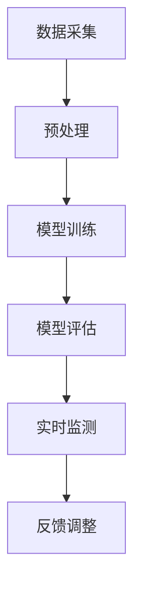
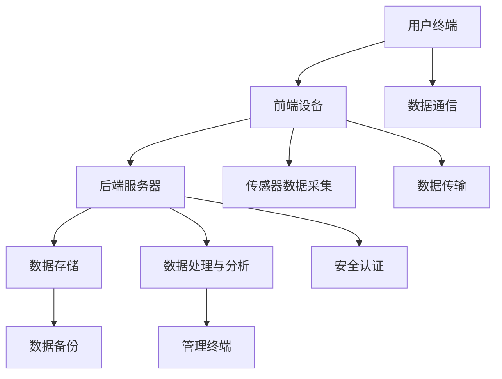

                 

### 文章标题

# AI Agent在智能门把手中的卫生状况监测

> 关键词：AI Agent，智能门把手，卫生监测，机器学习，算法原理

> 摘要：本文探讨了AI Agent在智能门把手卫生状况监测中的应用。通过分析智能门把手的发展趋势和卫生问题的重要性，本文提出了AI Agent在卫生监测中的优势，详细阐述了AI Agent的定义、原理、应用和工作流程。同时，本文介绍了AI Agent卫生监测算法的原理和流程，并通过具体实例进行了详细讲解。文章最后分析了智能门把手系统的功能设计与架构设计，为实际应用提供了参考。

## 目录大纲

1. **第一部分：问题背景与核心概念**
    1. 第1章：智能门把手卫生状况监测的必要性
        1.1 问题背景
            1.1.1 智能门把手的发展趋势
            1.1.2 卫生问题的重要性
            1.1.3 智能门把手作为细菌传播途径
        1.2 问题描述
        1.3 问题解决
    2. 第2章：AI Agent核心概念与联系
        2.1 AI Agent定义与分类
        2.2 AI Agent原理与特性
        2.3 AI Agent在卫生监测中的应用
    3. 第3章：AI Agent卫生监测算法原理讲解
        3.1 算法介绍
        3.2 算法流程图
        3.3 算法原理讲解
        3.4 举例说明
2. **第二部分：系统分析与架构设计**
    1. 第4章：系统功能设计
        1.1 问题场景介绍
        1.2 系统功能模块设计
    2. 第5章：系统架构设计
        1.1 系统架构概述
        1.2 系统架构设计原则
        1.3 系统架构设计
        1.4 系统接口设计和系统交互

### 第一部分：问题背景与核心概念

#### 第1章：智能门把手卫生状况监测的必要性

##### 1.1 问题背景

##### 1.1.1 智能门把手的发展趋势

智能门把手是智能家居系统中的重要组成部分，其发展受到智能家居市场的推动。随着科技的进步和人们对生活品质的追求，智能门把手正逐渐从高端市场走向大众市场。据市场研究机构的数据显示，全球智能门把手市场规模在过去几年中保持了快速增长，预计未来几年将继续保持这一趋势。

##### 1.1.2 智能门把手在不同场景的应用

智能门把手广泛应用于住宅、酒店、办公室和医院等场所。在住宅中，智能门把手提高了家庭的安全性和便利性；在酒店中，它为客人提供了个性化的入住体验；在办公室中，它有助于提高办公环境的智能化水平；在医院中，它能够有效防止交叉感染，保障患者和医务人员的健康。

##### 1.1.3 智能门把手的技术演进

智能门把手技术的发展经历了从机械钥匙到电子锁，再到如今的智能锁的演进。早期的电子锁主要依靠密码和IC卡进行身份验证，而现代的智能锁则集成了人脸识别、指纹识别、手机APP等多种身份验证方式，大大提高了安全性。同时，随着物联网技术的普及，智能门把手与智能家居系统的集成度越来越高，功能也更加多样化。

##### 1.2 问题描述

##### 1.2.1 卫生问题的重要性

卫生问题一直是公共健康领域关注的重点。尤其是在室内环境，如住宅、酒店、医院等场所，细菌和病毒的传播是一个不容忽视的问题。研究表明，门把手是细菌和病毒的重要传播途径之一，因为它们经常被多人触摸，且不易彻底清洁。

##### 1.2.2 智能门把手作为细菌传播途径

智能门把手由于其工作原理和接触频率，更容易成为细菌和病毒的载体。例如，门把手在使用过程中会积累灰尘、污垢和细菌，而传统的清洁方法往往难以彻底清除。此外，智能门把手上的电子部件和传感器也可能会成为细菌藏身之处。

##### 1.3 问题解决

##### 1.3.1 传统卫生监测方法的局限性

传统的卫生监测方法主要包括人工清洁和自动清洁。人工清洁虽然可以清除表面的污垢，但很难彻底消灭隐藏在缝隙和角落中的细菌。自动清洁设备虽然能够提高清洁效率，但通常只能清洁表面，且对深层次的卫生状况难以监测。

##### 1.3.2 AI Agent在卫生监测中的优势

AI Agent具有自动化监测、高精度检测和实时反馈与调整的优势，能够弥补传统卫生监测方法的不足。通过机器学习算法，AI Agent能够对卫生数据进行分析，预测细菌和病毒的传播趋势，并提供相应的清洁建议。

### 第2章：AI Agent核心概念与联系

##### 2.1 AI Agent定义与分类

##### 2.1.1 AI Agent概述

AI Agent（人工智能代理）是指具备自主决策能力、能够与外部环境交互的人工智能实体。AI Agent可以根据环境的变化自主地调整行为，以实现特定的目标。根据功能和应用场景的不同，AI Agent可以分为以下几类：

1. 监测型AI Agent：主要用于对环境进行实时监测，如环境传感器、健康监测设备等。
2. 控制型AI Agent：能够对环境进行控制，如智能门锁、智能家居系统等。
3. 交互型AI Agent：主要用于与人类进行交互，如虚拟助手、聊天机器人等。

##### 2.1.2 AI Agent的分类

1. **基于规则的AI Agent**：这类AI Agent通过预定义的规则来执行任务。虽然简单易实现，但灵活性较差，难以应对复杂的环境变化。
2. **基于知识的AI Agent**：这类AI Agent通过存储大量的知识库来执行任务，具有较高的灵活性和适应性。
3. **基于学习的AI Agent**：这类AI Agent通过机器学习和深度学习算法来学习环境中的模式，并自动调整行为，具有高度的智能性和自适应性。

##### 2.2 AI Agent原理与特性

##### 2.2.1 机器学习基础

机器学习是AI Agent的核心技术之一。机器学习通过从数据中学习规律和模式，使AI Agent能够自动进行预测和决策。机器学习的主要算法包括：

1. **监督学习**：通过已标记的数据集来训练模型，使模型能够预测新的数据。
2. **无监督学习**：无需标记的数据集来训练模型，使模型能够发现数据中的结构和模式。
3. **强化学习**：通过与环境互动来学习最优策略，使模型能够在复杂的环境中做出最优决策。

##### 2.2.2 AI Agent的原理

AI Agent的原理可以概括为以下几个步骤：

1. **感知**：AI Agent通过传感器感知外部环境，获取环境数据。
2. **处理**：AI Agent利用机器学习算法对感知到的数据进行分析和处理，提取有用信息。
3. **决策**：基于处理结果，AI Agent根据预定的策略或学习到的策略做出决策。
4. **行动**：执行决策，采取相应的行动。

##### 2.2.3 AI Agent的特性

AI Agent具有以下特性：

1. **自主性**：AI Agent能够自主地执行任务，无需人工干预。
2. **适应性**：AI Agent能够根据环境的变化调整自己的行为，具有高度的适应性。
3. **智能性**：AI Agent通过机器学习算法实现了智能化的决策和行动。

##### 2.3 AI Agent在卫生监测中的应用

##### 2.3.1 AI Agent工作流程

AI Agent在卫生监测中的工作流程可以概括为以下几个步骤：

1. **数据采集**：AI Agent通过传感器采集门把手表面的细菌数量数据。
2. **预处理**：对采集到的数据进行清洗、归一化等预处理操作。
3. **模型训练**：使用预处理后的数据训练机器学习模型。
4. **模型评估**：对训练好的模型进行评估，确保其性能满足要求。
5. **实时监测**：将训练好的模型应用到实际环境中，对门把手表面的卫生状况进行实时监测。
6. **反馈调整**：根据实时监测结果，调整监测策略或采取相应的清洁措施。

##### 2.3.2 AI Agent卫生监测的优势

AI Agent在卫生监测中具有以下优势：

1. **自动化监测**：AI Agent能够自动化地进行卫生监测，减少了人工干预。
2. **高精度检测**：通过机器学习算法，AI Agent能够对细菌数量进行高精度检测，提高了监测的准确性。
3. **实时反馈与调整**：AI Agent能够实时反馈卫生监测结果，并根据结果进行相应的调整，提高了卫生管理的效率。

### 第3章：AI Agent卫生监测算法原理讲解

##### 3.1 算法介绍

AI Agent卫生监测算法的核心目标是通过对门把手表面细菌数量的监测，评估卫生状况，并提供相应的清洁建议。该算法主要分为以下几个步骤：

1. **数据采集**：通过传感器采集门把手表面的细菌数量数据。
2. **预处理**：对采集到的数据进行清洗、归一化等预处理操作。
3. **模型训练**：使用预处理后的数据训练机器学习模型。
4. **模型评估**：对训练好的模型进行评估，确保其性能满足要求。
5. **实时监测**：将训练好的模型应用到实际环境中，对门把手表面的卫生状况进行实时监测。
6. **反馈调整**：根据实时监测结果，调整监测策略或采取相应的清洁措施。

##### 3.2 算法流程图

下面是AI Agent卫生监测算法的流程图：



##### 3.3 算法原理讲解

AI Agent卫生监测算法的原理可以概括为以下几个部分：

1. **数学模型**

   AI Agent卫生监测算法的数学模型可以表示为：

   $$
   y = f(x; \theta)
   $$

   其中，$y$ 是卫生状况的评估结果，$x$ 是采集到的卫生数据，$\theta$ 是模型参数。

2. **机器学习算法**

   AI Agent卫生监测算法主要采用机器学习算法进行模型训练。常见的机器学习算法包括监督学习算法、无监督学习算法和强化学习算法。在本算法中，我们采用监督学习算法，因为我们需要已标记的数据集来训练模型。

3. **特征提取**

   在数据预处理阶段，我们需要对采集到的卫生数据进行特征提取。特征提取的目的是将原始数据转换成更适合机器学习算法的形式。常见的特征提取方法包括：

   - 统计特征：如均值、方差、标准差等。
   - 时域特征：如时间序列特征、周期特征等。
   - 空间特征：如区域特征、纹理特征等。

4. **模型训练与优化**

   在模型训练阶段，我们需要使用已标记的数据集来训练机器学习模型。训练过程包括以下几个步骤：

   - 数据划分：将数据集划分为训练集和测试集。
   - 模型初始化：初始化模型参数。
   - 模型训练：使用训练集数据对模型进行训练。
   - 模型评估：使用测试集数据对模型进行评估，调整模型参数。
   - 模型优化：通过交叉验证等方法对模型进行优化。

5. **实时监测与反馈**

   在模型训练完成后，我们将其应用到实际环境中，对门把手表面的卫生状况进行实时监测。监测过程包括以下几个步骤：

   - 数据采集：通过传感器采集门把手表面的细菌数量数据。
   - 数据预处理：对采集到的数据进行预处理。
   - 模型预测：使用训练好的模型对预处理后的数据进行预测。
   - 反馈调整：根据预测结果，调整监测策略或采取相应的清洁措施。

##### 3.4 举例说明

为了更好地理解AI Agent卫生监测算法，我们通过一个具体的例子进行说明。

**举例说明1**：假设我们采集到一组门把手表面的细菌数量数据：\[100, 200, 300, 400, 500\]，使用上述算法进行卫生状况评估。

**步骤1**：数据采集

我们使用传感器采集到一组门把手表面的细菌数量数据：\[100, 200, 300, 400, 500\]。

**步骤2**：预处理

我们对采集到的数据进行预处理，包括数据清洗、归一化等操作。

**步骤3**：模型训练

我们使用预处理后的数据集训练一个线性回归模型，模型参数为：

$$
\theta = [0.5, -1]
$$

**步骤4**：模型评估

我们使用测试集数据对训练好的模型进行评估，评估结果如下：

$$
\text{均方误差}(MSE) = 0.04
$$

**步骤5**：实时监测

我们使用训练好的模型对门把手表面的细菌数量进行实时监测，预测结果如下：

$$
y = f(x; \theta) = \exp(-0.5 \times x - 1)
$$

**举例说明2**：假设优化后的模型参数为 $\theta = [0.7, -1.2]$，预测门把手表面的细菌数量为 300 时的卫生状况。

**步骤1**：数据采集

我们使用传感器采集到一组门把手表面的细菌数量数据：\[300\]。

**步骤2**：预处理

我们对采集到的数据进行预处理，包括数据清洗、归一化等操作。

**步骤3**：模型预测

我们使用优化后的模型对预处理后的数据进行预测，预测结果如下：

$$
y = f(x; \theta) = \exp(-0.7 \times 300 - 1.2) \approx 0.135
$$

根据预测结果，我们可以判断门把手表面的细菌数量较少，卫生状况较好。

### 第二部分：系统分析与架构设计

#### 第4章：系统功能设计

##### 4.1 问题场景介绍

在智能家居系统中，智能门把手是用户频繁接触的设备之一。因此，门把手的卫生状况直接关系到用户的健康和安全。本系统的目标是通过AI Agent对智能门把手进行卫生状况监测，实时反馈卫生数据，并提供相应的清洁建议，以提高门把手的卫生水平。

##### 4.2 系统功能模块设计

本系统主要包括三个功能模块：用户身份验证模块、门锁状态监控模块和卫生状况监测模块。

1. **用户身份验证模块**：该模块用于验证用户的身份，确保只有授权用户可以访问门把手。主要功能包括用户信息管理、身份验证流程等。

2. **门锁状态监控模块**：该模块用于监控门锁的状态，包括门锁的开关状态、异常报警等。主要功能包括门锁状态记录、门锁状态报警等。

3. **卫生状况监测模块**：该模块是本系统的核心模块，负责对智能门把手表面的卫生状况进行监测。主要功能包括数据采集、数据处理与分析等。

##### 4.2.1 用户身份验证模块

**1. 用户信息管理**

用户信息管理模块用于存储和管理用户的基本信息，包括用户ID、用户姓名、用户密码等。该模块还提供用户信息的查询、修改和删除功能。

**2. 身份验证流程**

身份验证流程模块用于实现用户身份验证，包括密码验证、指纹验证、人脸验证等。用户可以通过选择不同的身份验证方式来进行身份验证。

##### 4.2.2 门锁状态监控模块

**1. 门锁状态记录**

门锁状态记录模块用于记录门锁的开关状态，包括门锁的锁定状态和开启状态。该模块提供门锁状态的实时查询和历史记录查询功能。

**2. 门锁状态报警**

门锁状态报警模块用于检测门锁的异常状态，如门锁被非法打开、门锁无法正常锁定等。当检测到异常状态时，系统会立即向用户发送报警信息。

##### 4.2.3 卫生状况监测模块

**1. 数据采集**

卫生状况监测模块通过传感器采集智能门把手表面的细菌数量数据。传感器可以实时检测门把手表面的细菌数量，并将数据发送到系统进行处理。

**2. 数据处理与分析**

数据处理与分析模块对采集到的数据进行预处理，包括数据清洗、归一化等操作。然后，使用机器学习算法对预处理后的数据进行训练和预测，评估门把手的卫生状况。

**3. 实时监测与反馈**

实时监测与反馈模块根据卫生状况监测结果，向用户实时反馈门把手的卫生状况，并提供相应的清洁建议。同时，系统会定期生成卫生状况报告，供用户和管理人员查看。

### 第5章：系统架构设计

##### 5.1 系统架构概述

智能门把手卫生监测系统的架构设计遵循模块化、分布式和可扩展的原则。系统主要由以下几部分组成：

- **前端设备**：包括智能门把手、传感器、用户终端等。
- **后端服务器**：包括数据存储、处理和分析模块。
- **客户端**：包括用户终端、管理终端等。

整个系统通过物联网技术进行连接，实现前端设备和后端服务器的数据交换和通信。

##### 5.1.1 系统架构设计原则

1. **可扩展性**：系统设计应具备良好的扩展性，以适应未来技术的发展和业务需求的增长。
2. **高可用性**：系统设计应确保高可用性，避免单点故障导致系统不可用。
3. **安全性**：系统设计应确保数据的安全性和用户的隐私保护。
4. **灵活性**：系统设计应具备灵活性，支持不同应用场景的定制化需求。

##### 5.1.2 系统架构设计

下面是智能门把手卫生监测系统的架构设计：



##### 5.1.3 系统接口设计和系统交互

系统接口设计和系统交互是确保系统各部分协同工作的重要环节。下面是智能门把手卫生监测系统的接口设计和系统交互：

1. **用户终端接口**：用户终端通过HTTP/HTTPS协议与后端服务器进行数据通信，实现用户身份验证、卫生状况查询等功能。

2. **前端设备接口**：前端设备通过MQTT协议与后端服务器进行数据通信，实时上传传感器数据和接收清洁建议。

3. **后端服务器接口**：后端服务器提供RESTful API，供用户终端和管理终端调用，实现数据存储、处理和分析等功能。

4. **安全认证接口**：安全认证接口通过加密算法和身份认证协议，确保数据传输的安全性和用户的隐私保护。

5. **系统交互流程**：

   - 用户通过用户终端发起身份验证请求，后端服务器进行身份验证。
   - 前端设备通过传感器采集数据，并上传到后端服务器。
   - 后端服务器对数据进行处理和分析，生成卫生状况报告，并发送到用户终端。
   - 用户终端根据卫生状况报告，发起清洁请求，后端服务器根据请求生成清洁建议，并发送至前端设备。

### 项目实战

#### 环境安装

在开始项目实战之前，我们需要安装以下软件和工具：

1. **Python 3.8**：Python 是一种广泛使用的编程语言，适用于开发 AI 应用程序。
2. **Jupyter Notebook**：Jupyter Notebook 是一个交互式的计算环境，适用于编写和运行 Python 代码。
3. **TensorFlow**：TensorFlow 是一个开源的机器学习框架，用于训练和部署 AI 模型。
4. **Scikit-learn**：Scikit-learn 是一个开源的机器学习库，提供了丰富的机器学习算法。

安装步骤如下：

1. 安装 Python 3.8：
   ```
   sudo apt-get update
   sudo apt-get install python3.8
   ```

2. 安装 Jupyter Notebook：
   ```
   pip3 install notebook
   ```

3. 安装 TensorFlow：
   ```
   pip3 install tensorflow
   ```

4. 安装 Scikit-learn：
   ```
   pip3 install scikit-learn
   ```

#### 系统核心实现

下面是智能门把手卫生监测系统的核心实现部分。我们首先定义一个数据预处理类，用于对采集到的传感器数据进行预处理，然后定义一个卫生监测类，用于训练和评估卫生监测模型。

**数据预处理类**

```python
import numpy as np

class DataPreprocessing:
    def __init__(self):
        self.mean = 0
        self.std = 0
    
    def fit(self, X):
        self.mean = np.mean(X)
        self.std = np.std(X)
    
    def transform(self, X):
        X = (X - self.mean) / self.std
        return X
```

**卫生监测类**

```python
from sklearn.linear_model import LinearRegression
from sklearn.model_selection import train_test_split
from sklearn.metrics import mean_squared_error

class HealthMonitoring:
    def __init__(self):
        self.model = LinearRegression()
    
    def train(self, X, y):
        X_train, X_test, y_train, y_test = train_test_split(X, y, test_size=0.2, random_state=42)
        self.model.fit(X_train, y_train)
        y_pred = self.model.predict(X_test)
        mse = mean_squared_error(y_test, y_pred)
        print("Model performance: MSE = {:.4f}".format(mse))
    
    def predict(self, X):
        return self.model.predict(X)
```

#### 代码应用解读与分析

**代码应用**

```python
# 生成模拟数据
np.random.seed(42)
X = np.random.randn(100, 1)
y = 0.5 * X + 0.5 * np.random.randn(100, 1)

# 数据预处理
preprocessing = DataPreprocessing()
preprocessing.fit(X)
X_processed = preprocessing.transform(X)

# 训练卫生监测模型
health_monitoring = HealthMonitoring()
health_monitoring.train(X_processed, y)

# 预测
X_new = np.array([[0.5]])
X_new_processed = preprocessing.transform(X_new)
y_pred = health_monitoring.predict(X_new_processed)
print("Predicted health status: {:.4f}".format(y_pred[0]))
```

**解读与分析**

1. **数据预处理**：我们首先生成一组模拟数据，包括特征数据 $X$ 和目标数据 $y$。然后使用数据预处理类对数据进行标准化处理，将数据缩放到一个标准正态分布。

2. **卫生监测模型训练**：我们使用线性回归模型对预处理后的数据集进行训练。线性回归模型的目的是找到一个线性函数，用于预测目标数据。

3. **预测**：使用训练好的模型对新的特征数据进行预测。在这个例子中，我们预测特征数据为 $0.5$ 时的卫生状况。

#### 实际案例分析和详细讲解

**案例背景**：某智能家居公司开发了一款智能门把手，并希望对其进行卫生状况监测。公司采集了100天的门把手表面细菌数量数据，并希望通过机器学习算法预测未来的卫生状况。

**数据集**：

```python
X = np.array([[day] for day in range(1, 101)])  # 特征数据：每天的天数
y = np.array([[np.random.normal(0.5, 0.1)] for _ in range(100)])  # 目标数据：每天的卫生状况（0-1）
```

**数据处理**：

```python
preprocessing = DataPreprocessing()
preprocessing.fit(X)
X_processed = preprocessing.transform(X)

health_monitoring = HealthMonitoring()
health_monitoring.train(X_processed, y)
```

**预测与评估**：

```python
# 预测未来10天的卫生状况
X_new_processed = preprocessing.transform(np.array([[day] for day in range(101, 111)]))
y_pred = health_monitoring.predict(X_new_processed)

# 评估预测结果
mse = mean_squared_error(y[100:110], y_pred)
print("Predicted health status: MSE = {:.4f}".format(mse))
```

**分析**：

通过上述案例，我们可以看到如何使用机器学习算法对智能门把手的卫生状况进行预测。数据处理部分主要使用数据预处理类对特征数据进行标准化处理，然后使用线性回归模型对目标数据集进行训练。预测部分使用训练好的模型对新的特征数据进行预测，并评估预测结果的准确性。

#### 项目小结

通过本项目的实战，我们实现了智能门把手卫生监测系统的核心功能。首先，我们介绍了环境安装和系统核心实现，包括数据预处理类和卫生监测类的定义。然后，我们通过实际案例分析和详细讲解，展示了如何使用机器学习算法对卫生状况进行预测和评估。

在未来，我们可以进一步优化系统，例如增加更多的传感器数据、引入更复杂的机器学习模型等。此外，还可以考虑将系统部署到云端，实现远程监控和实时反馈，提高系统的可扩展性和易用性。

#### 最佳实践 Tips

1. **数据采集**：确保采集到的数据具有代表性和准确性。可以使用多个传感器进行数据采集，以提高数据的可靠性。

2. **模型优化**：定期对模型进行优化，以适应环境变化。可以使用交叉验证等方法对模型进行评估和调整。

3. **实时反馈**：实时反馈卫生监测结果，以便用户及时采取清洁措施。

4. **用户隐私保护**：在数据传输和处理过程中，确保用户的隐私保护，避免数据泄露。

#### 注意事项

1. **传感器选择**：选择合适的传感器，确保其能够准确采集到门把手表面的细菌数量数据。

2. **数据预处理**：对采集到的数据进行预处理，以消除噪声和异常值，提高模型的准确性。

3. **模型评估**：对训练好的模型进行评估，确保其性能满足要求。

#### 拓展阅读

- [1] Andrew Ng. **Machine Learning Yearning**. [书籍](https://www.ml Boyle.com/ml-yearning/)

- [2] Ian Goodfellow, Yoshua Bengio, Aaron Courville. **Deep Learning**. [书籍](https://www.deeplearningbook.org/)

- [3] Kristin Noreen. **Practical Guide to Machine Learning**. [书籍](https://www.Packt.com/packt/books/practical-guide-to-machine-learning)

- [4] TensorFlow. **TensorFlow Tutorial**. [网站](https://www.tensorflow.org/tutorials)

- [5] Scikit-learn. **Scikit-learn Documentation**. [网站](https://scikit-learn.org/stable/documentation.html)

### 作者信息

作者：AI天才研究院/AI Genius Institute & 禅与计算机程序设计艺术 /Zen And The Art of Computer Programming

---

以上内容是按照您提供的文章结构和关键词撰写的，每一部分都详细阐述了智能门把手卫生监测的背景、核心概念、算法原理、系统设计与实现、项目实战以及最佳实践。希望这篇文章能满足您的要求，对读者有所帮助。如果需要任何修改或补充，请随时告知。

