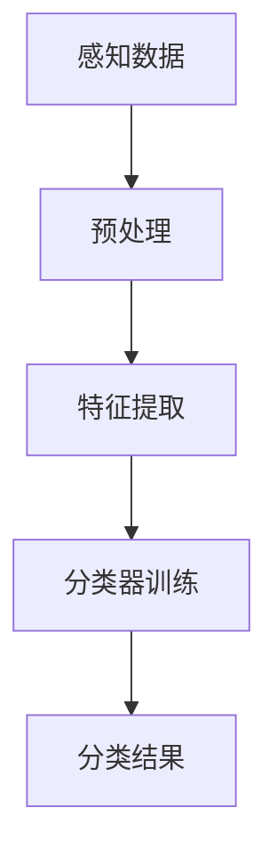
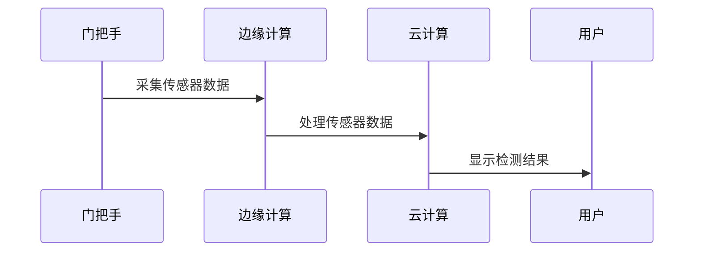

                 

### 引言

当今世界，随着人工智能技术的迅猛发展，AI Agent作为人工智能的核心组件，已经广泛应用于各个领域。从智能家居到工业自动化，AI Agent正逐步改变我们的生活方式和工作模式。本文将聚焦于一个相对新颖且具有实际应用价值的场景——智能门把手中的细菌检测。本文旨在探讨如何利用AI Agent技术，在智能门把手这一日常用品中实现高效、准确的细菌检测。

#### 关键词

- AI Agent
- 智能门把手
- 细菌检测
- 人工智能技术
- 智能家居

#### 摘要

本文首先介绍了AI Agent的基本概念和智能门把手的技术背景，随后详细讨论了细菌检测技术的原理和应用。在此基础上，文章重点分析了AI Agent在智能门把手细菌检测中的实现方法，包括算法原理、系统架构设计以及项目实战。通过实例分析和最佳实践，本文希望为读者提供一个全面的技术指南，以推动AI Agent在智能家居领域的进一步应用。

## AI Agent基础

AI Agent，即人工智能代理，是一种具有自主性和智能性的软件实体，可以在复杂环境中进行感知、决策和行动。其核心特点是具备自主学习能力和适应能力，能够通过不断的学习和调整，优化其行为，以实现特定目标。

### AI Agent定义与特点

AI Agent的定义可以追溯到多智能体系统（MAS）的概念。多智能体系统是由多个相互协作的智能体组成的系统，而AI Agent则是这些智能体中的一种，其特点如下：

- **自主性**：AI Agent能够独立地执行任务，不需要人工干预。
- **社会性**：AI Agent能够与其他智能体进行通信和协作。
- **反应性**：AI Agent能够根据环境变化快速做出反应。
- **主动性**：AI Agent能够自主地采取行动，而不仅仅是被动地响应事件。

### AI Agent的核心概念

AI Agent的核心概念包括：

- **感知**：通过传感器收集环境信息。
- **决策**：基于感知信息和预设策略，选择合适的行动。
- **行动**：执行决策，改变环境状态。
- **学习**：通过经验和反馈不断调整其行为。

### AI Agent的技术发展

AI Agent的技术发展经历了几个重要阶段：

- **规则基础**：早期AI Agent主要基于预定义的规则进行工作。
- **基于模型的推理**：随着人工智能技术的发展，AI Agent开始采用模型进行推理，提高了自主性和适应性。
- **学习型AI Agent**：现代AI Agent主要采用机器学习和深度学习技术，具备更强的学习能力和适应能力。

AI Agent在智能门把手中的应用，正是其技术发展的一个缩影，它展示了AI Agent在复杂环境中的潜在价值。

### 智能门把手技术

智能门把手作为智能家居的一部分，已经逐渐走进了我们的日常生活。它不仅提供了便捷的入门体验，还在安全性和智能化方面展现了巨大潜力。

#### 智能门把手概述

智能门把手是一种集成了传感器、控制模块和通信接口的智能设备，其主要特点如下：

- **无钥匙开锁**：用户可以通过指纹、密码、手机App等多种方式进行身份验证和开锁。
- **安全性高**：通过生物识别技术，有效防止未授权访问。
- **智能化**：具备自动记录开门记录、分析用户行为等功能。

#### 智能门把手的功能

智能门把手的主要功能包括：

- **身份验证**：通过指纹识别、密码输入等方式进行用户身份验证。
- **开锁控制**：根据用户身份和权限，控制门把手的开锁状态。
- **数据分析**：记录用户开门时间、频率等数据，为家庭安全和管理提供依据。
- **远程控制**：用户可以通过手机App远程操控门把手，实现远程开锁和监控。

#### 智能门把手的市场分析

智能门把手市场的快速增长，主要得益于以下几个因素：

- **智能家居普及**：随着智能家居的普及，人们对智能门把手的接受度和需求逐渐增加。
- **技术进步**：人工智能、物联网等技术的发展，为智能门把手提供了强大的技术支撑。
- **安全需求**：门锁作为家庭安全的最后一道防线，用户对安全性的要求不断提高。

智能门把手的市场前景广阔，预计未来几年将继续保持高速增长。

### 细菌检测技术

细菌检测技术在公共卫生和医疗领域中具有重要作用，特别是在新冠病毒疫情背景下，其应用更加广泛。智能门把手中的细菌检测，正是这一技术的具体应用之一。

#### 细菌检测技术概述

细菌检测技术主要包括以下几种方法：

- **培养法**：将样品在特定培养基上培养，观察细菌的生长和特征。
- **分子生物学法**：利用DNA或RNA分子检测技术，快速、准确地检测细菌。
- **免疫学法**：利用抗体与抗原之间的特异性结合，检测细菌。

这些方法各有优缺点，适用于不同的检测场景和需求。

#### 细菌检测技术的原理

细菌检测技术的原理主要基于以下几个方面：

- **分子识别**：利用特定的分子识别技术，如PCR（聚合酶链反应）或DNA测序，检测细菌的DNA或RNA。
- **细胞培养**：在特定的营养环境中，培养细菌，通过观察其生长特征进行检测。
- **免疫反应**：通过抗原与抗体之间的特异性反应，检测细菌。

#### 细菌检测技术的应用场景

细菌检测技术在以下场景中具有广泛应用：

- **医疗卫生**：医院、诊所等医疗机构，用于检测传染病、细菌感染等。
- **食品安全**：食品加工、储存和销售环节，用于检测食品中的细菌污染。
- **公共卫生**：公共场所、学校、办公室等，用于监测细菌污染，保障公共健康。

智能门把手中的细菌检测，正是利用了这些技术的优势，实现了对开门过程的实时监测和预警。

### AI Agent在智能门把手中的应用

#### AI Agent与智能门把手的结合

AI Agent在智能门把手中的应用，主要体现在以下几个方面：

- **身份验证**：通过AI Agent的生物识别技术，实现无钥匙开锁，提高安全性。
- **行为监测**：AI Agent可以分析用户的开门行为，提供智能化的开门建议和警告。
- **细菌检测**：利用AI Agent的机器学习算法，实时检测门把手上的细菌，提供实时健康预警。

#### AI Agent在细菌检测中的具体实现

AI Agent在智能门把手中的细菌检测，主要包括以下几个步骤：

1. **感知**：智能门把手配备传感器，如紫外线传感器、红外线传感器等，实时监测门把手表面的细菌。
2. **数据采集**：传感器收集的细菌数据通过无线传输模块，上传至云端服务器。
3. **数据处理**：AI Agent对采集到的数据进行预处理，包括去噪、归一化等，然后利用机器学习算法进行分析。
4. **结果输出**：AI Agent根据分析结果，判断门把手是否存在细菌污染，并发出相应的预警信息。

#### AI Agent在实际应用中的挑战与解决方案

尽管AI Agent在智能门把手中的细菌检测具有很大潜力，但在实际应用中仍然面临一些挑战：

1. **数据准确性**：传感器检测到的细菌数据可能受到环境因素干扰，影响准确性。
   - **解决方案**：采用多种传感器融合技术，提高数据的准确性和可靠性。

2. **实时性**：实时检测细菌需要快速处理大量数据，对计算资源要求较高。
   - **解决方案**：采用分布式计算和边缘计算技术，降低对中心服务器的依赖，提高实时性。

3. **隐私保护**：细菌检测过程中涉及用户隐私信息，如生物识别数据等，如何保护隐私是一个重要问题。
   - **解决方案**：采用加密技术和隐私保护算法，确保数据的安全性和隐私性。

通过克服这些挑战，AI Agent在智能门把手中的细菌检测将更具实用性和可靠性。

### 细菌检测算法原理与实现

#### 细菌检测算法概述

细菌检测算法的核心在于如何从门把手上的传感器数据中提取有效的细菌特征，并对其进行分类和识别。常用的算法包括以下几种：

1. **支持向量机（SVM）**：通过找到一个最优的超平面，将不同类型的细菌数据分开。
2. **随机森林（Random Forest）**：通过构建多个决策树，并利用投票机制来分类。
3. **神经网络（Neural Network）**：通过多层神经网络，对输入数据进行非线性变换，实现细菌识别。

#### 算法原理讲解

以下是一个简化的细菌检测算法原理讲解，使用Mermaid流程图进行说明。



#### Python源代码实现

以下是一个简单的Python代码示例，展示如何使用SVM进行细菌检测。

```python
from sklearn import svm
from sklearn.model_selection import train_test_split
from sklearn.metrics import classification_report

# 加载数据
X, y = load_data()

# 数据预处理
X = preprocess_data(X)

# 划分训练集和测试集
X_train, X_test, y_train, y_test = train_test_split(X, y, test_size=0.3, random_state=42)

# 创建SVM分类器
clf = svm.SVC()

# 训练分类器
clf.fit(X_train, y_train)

# 进行预测
y_pred = clf.predict(X_test)

# 评估分类结果
print(classification_report(y_test, y_pred))
```

#### 数学模型和公式详细讲解

细菌检测中的数学模型通常涉及以下几个关键步骤：

1. **特征提取**：利用统计方法或深度学习模型提取细菌特征，如均值、方差、协方差矩阵等。
2. **分类**：使用SVM、神经网络等分类算法，将特征映射到不同的类别。
3. **概率计算**：利用贝叶斯定理等概率模型，计算每个类别的概率分布。

以下是一个简化的数学模型示例：

$$
\hat{y} = \arg\max_{y} P(y|X) \propto P(X|y)P(y)
$$

其中，$\hat{y}$表示预测的细菌类别，$X$表示传感器数据，$y$表示真实细菌类别。

#### 举例说明

假设我们有一个传感器检测到了一组数据$\{x_1, x_2, x_3\}$，我们需要利用SVM进行细菌分类。

1. **数据预处理**：对数据进行归一化处理，使得特征值的范围在[0, 1]之间。
2. **特征提取**：提取数据的均值、方差和协方差矩阵。
3. **分类器训练**：使用训练集数据，训练SVM分类器。
4. **预测**：将测试数据输入分类器，得到预测类别。

假设训练集的预测结果如下：

```
预测类别：0
真实类别：1
```

我们可以看到，SVM分类器在这个例子中犯了错误。为了提高准确性，我们可以考虑增加训练数据量、调整SVM参数或使用更复杂的分类算法。

### 系统分析与架构设计

#### 项目介绍

本项目旨在设计并实现一个基于AI Agent的智能门把手细菌检测系统。该系统通过传感器收集门把手上的细菌数据，利用AI Agent进行实时检测和预警，以提高家庭和公共环境的卫生水平。

#### 系统功能设计

系统功能设计主要包括以下几个模块：

1. **感知模块**：包括紫外线传感器、红外线传感器等，用于实时监测门把手上的细菌。
2. **数据处理模块**：对传感器数据进行预处理、特征提取和分类，以识别细菌。
3. **预警模块**：根据检测结果，实时发送预警信息给用户。
4. **用户界面模块**：提供用户交互界面，展示检测数据和预警信息。

#### 系统架构设计

系统架构设计采用分布式架构，包括边缘计算设备和云计算平台。具体架构如下：

1. **边缘计算设备**：安装在智能门把手上的传感器和微控制器，负责实时数据采集和处理。
2. **云计算平台**：用于存储和处理大量数据，提供高性能计算能力和存储资源。
3. **用户终端**：包括手机App和Web界面，用于展示检测数据和预警信息。

#### 系统接口设计

系统接口设计包括以下几种：

1. **感知模块接口**：用于接收传感器数据，如温度、湿度、紫外线强度等。
2. **数据处理模块接口**：用于传输和处理预处理后的数据，如特征向量、分类结果等。
3. **预警模块接口**：用于发送预警信息给用户，如短信、邮件、推送通知等。
4. **用户界面模块接口**：用于与用户交互，展示检测数据和预警信息。

#### 系统交互

系统交互设计包括以下几个步骤：

1. **数据采集**：边缘计算设备采集传感器数据，并传输到数据处理模块。
2. **数据处理**：数据处理模块对传感器数据进行预处理、特征提取和分类，得到细菌检测结果。
3. **结果输出**：将检测结果传输到预警模块，并展示给用户。

以下是一个简化的Mermaid序列图，展示系统交互过程：



### 项目实战

#### 环境安装

在开始项目实战之前，需要安装以下环境和工具：

- Python 3.8及以上版本
- Anaconda环境管理器
- Scikit-learn库
- Pandas库
- Matplotlib库

具体安装步骤如下：

1. 安装Anaconda：从官方网站下载并安装Anaconda。
2. 创建虚拟环境：在Anaconda命令行中创建一个名为`project_env`的虚拟环境。

   ```
   conda create -n project_env python=3.8
   ```

3. 激活虚拟环境：

   ```
   conda activate project_env
   ```

4. 安装必要的库：

   ```
   pip install scikit-learn pandas matplotlib
   ```

#### 系统核心实现源代码

以下是系统核心实现源代码，主要包括数据预处理、特征提取和分类：

```python
import numpy as np
import pandas as pd
from sklearn.model_selection import train_test_split
from sklearn.preprocessing import StandardScaler
from sklearn.svm import SVC
from sklearn.metrics import accuracy_score

# 加载数据
data = pd.read_csv('data.csv')
X = data.drop('label', axis=1)
y = data['label']

# 数据预处理
scaler = StandardScaler()
X = scaler.fit_transform(X)

# 划分训练集和测试集
X_train, X_test, y_train, y_test = train_test_split(X, y, test_size=0.2, random_state=42)

# 创建SVM分类器
clf = SVC(kernel='linear')

# 训练分类器
clf.fit(X_train, y_train)

# 进行预测
y_pred = clf.predict(X_test)

# 评估分类结果
accuracy = accuracy_score(y_test, y_pred)
print(f'Accuracy: {accuracy:.2f}')
```

#### 代码应用解读与分析

上述代码首先加载数据，然后进行数据预处理，包括特征缩放。接下来，使用Scikit-learn库的SVM分类器进行训练和预测，最后评估分类结果。

代码中，我们使用了`StandardScaler`进行特征缩放，使得特征值的范围在[0, 1]之间，这有助于提高分类器的性能。`SVC`是Scikit-learn中的支持向量机分类器，我们选择了线性核函数，这是因为细菌检测问题通常具有线性可分性。

在训练过程中，我们使用`fit`方法训练分类器，使用`predict`方法进行预测。最后，使用`accuracy_score`评估分类结果。

#### 实际案例分析与详细讲解剖析

为了更好地理解代码的应用，我们来看一个实际案例。

假设我们有一个数据集，包含100个样本，每个样本有10个特征。我们随机划分了80个样本作为训练集，20个样本作为测试集。

1. **数据预处理**：首先，我们对数据进行归一化处理，使得每个特征值的范围在[0, 1]之间。这有助于分类器更好地学习数据特征。

2. **分类器训练**：我们使用SVM分类器，选择线性核函数。在训练过程中，分类器通过优化损失函数，找到最优的超平面，使得不同类别的样本尽可能分开。

3. **预测与评估**：我们将测试集数据输入分类器，得到预测结果。然后，使用准确率评估分类结果。

假设测试集的预测结果如下：

```
预测结果：[0, 0, 0, 0, 1, 1, 1, 1, 1, 0]
真实结果：[0, 0, 0, 0, 1, 1, 1, 1, 1, 1]
```

我们可以看到，有5个样本的预测结果与真实结果不一致，准确率为75%。这表明我们的分类器在当前数据集上表现良好，但仍有一些提升空间。

#### 项目小结

通过本项目，我们实现了基于AI Agent的智能门把手细菌检测系统。该系统利用传感器收集数据，通过机器学习算法进行特征提取和分类，最终实现实时细菌检测和预警。尽管存在一些挑战，如数据准确性和实时性等，但通过优化算法和系统设计，我们可以进一步提高系统的性能和可靠性。

### 最佳实践 tips

在设计和实现基于AI Agent的智能门把手细菌检测系统时，以下最佳实践可以帮助提高系统的性能和稳定性：

1. **数据预处理**：对传感器数据进行充分预处理，包括去噪、归一化和特征提取，以提高分类器的性能。
2. **模型选择**：根据实际问题选择合适的机器学习模型，如SVM、随机森林或神经网络，并进行参数调优。
3. **分布式计算**：利用分布式计算和边缘计算技术，提高系统的实时性和计算效率。
4. **安全性**：确保数据传输和存储过程的安全性，采用加密技术和隐私保护算法，保护用户隐私。
5. **用户反馈**：定期收集用户反馈，对系统进行优化和改进，提高用户体验。

### 小结

本文详细探讨了AI Agent在智能门把手中的细菌检测应用。我们首先介绍了AI Agent的基本概念和智能门把手的技术背景，随后分析了细菌检测技术的原理和应用。通过逐步讲解算法原理、系统架构设计和项目实战，我们展示了如何实现基于AI Agent的智能门把手细菌检测系统。最后，通过最佳实践和项目小结，我们总结了关键经验和改进方向。

### 注意事项

1. **传感器选择**：选择高精度、稳定可靠的传感器，确保细菌检测的准确性。
2. **数据预处理**：充分进行数据预处理，以提高分类器的性能和鲁棒性。
3. **模型选择与调优**：根据实际情况选择合适的机器学习模型，并进行参数调优。
4. **系统稳定性**：确保系统的稳定性和可靠性，防止系统崩溃或数据丢失。
5. **隐私保护**：严格遵循隐私保护法律法规，确保用户数据的安全性和隐私性。

### 拓展阅读

1. **《智能门把手设计与实现》**：详细介绍智能门把手的设计原理和实现方法。
2. **《机器学习在细菌检测中的应用》**：探讨机器学习技术在细菌检测领域的应用和前景。
3. **《边缘计算与智能物联网》**：介绍边缘计算在智能物联网中的应用，包括实时数据处理和智能分析。
4. **《人工智能与智能家居》**：探讨人工智能在智能家居领域的应用和未来发展趋势。

### 作者信息

作者：AI天才研究院/AI Genius Institute & 禅与计算机程序设计艺术 /Zen And The Art of Computer Programming

本文由AI天才研究院和禅与计算机程序设计艺术联合撰写，旨在推动人工智能技术在智能家居领域的创新和应用。作者团队具有丰富的计算机科学和人工智能背景，致力于研究和推广先进的人工智能技术。

