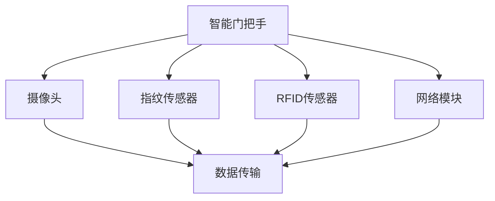
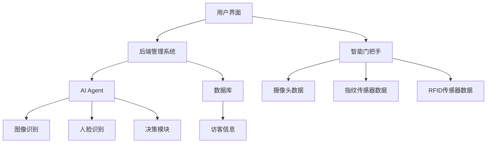
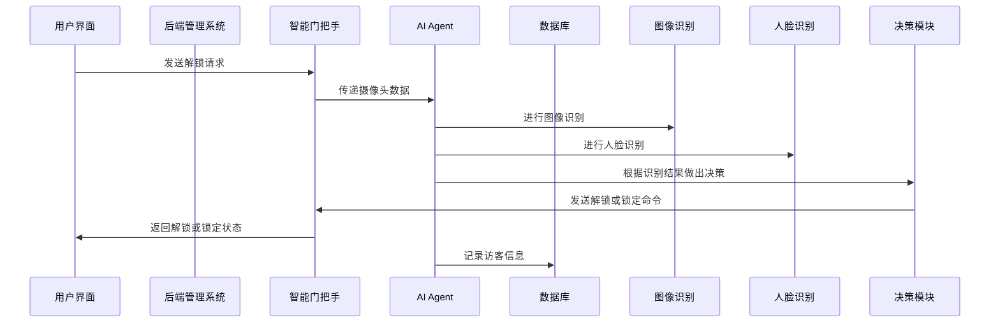

                 

# AI Agent在智能门把手中的访客识别

## 关键词
- **智能门把手**，**AI Agent**，**访客识别**，**图像识别**，**人脸识别**，**智能家居**

## 摘要
本文将探讨AI Agent在智能门把手中的访客识别应用，深入分析AI Agent的技术原理、智能门把手的功能特点，以及访客识别算法的实现细节。通过一步一步的分析推理，本文旨在为读者提供一个清晰、系统、易于理解的技术解决方案，帮助读者掌握智能门把手访客识别的核心技术。

## 第一部分：背景介绍

### 引言

随着智能家居市场的快速发展，智能门把手作为智能家居系统中的重要组成部分，正逐步走进千家万户。传统门把手仅具备基本的物理解锁功能，而智能门把手则在此基础上，通过集成传感器、网络连接和人工智能技术，实现了自动解锁、访客识别等高级功能。本文将重点关注AI Agent在智能门把手中的访客识别应用，为读者提供一个全面的技术解读。

### 问题描述

在家庭和商业场景中，访客管理是一个常见且重要的问题。如何安全、准确地识别访客，成为智能门把手需要解决的关键问题。传统的访客管理主要依赖于人工记录，不仅效率低下，而且容易出现错误。随着人工智能技术的发展，利用AI Agent实现访客识别，已成为一个有前景的解决方案。

### 问题解决

AI Agent是一种能够模拟人类智能的计算机程序，具备自主学习和决策能力。通过结合图像识别和人脸识别技术，AI Agent可以实现对访客的自动识别和分类。这种技术不仅提高了访客识别的准确性和效率，还大大提升了家居和商业场所的安全性。

### 边界与外延

本文主要探讨AI Agent在智能门把手中的访客识别应用，包括技术原理、系统架构、算法实现等内容。边界主要涉及智能门把手的技术规格、识别算法的准确性、安全性等方面。

### 概念结构与核心要素组成

- **AI Agent**：一种基于人工智能技术的自主行动实体，能够执行特定任务。
- **智能门把手**：一种智能家居设备，具备访客识别功能。
- **访客识别**：通过技术手段对来访人员进行识别和分类。

### 本章小结

本章主要介绍了AI Agent在智能门把手中的访客识别问题背景、问题解决方法以及相关概念和边界。为后续章节的深入探讨奠定了基础。

## 第二部分：核心概念与联系

### AI Agent 原理

#### AI Agent 定义

AI Agent，即人工智能代理，是一种能够模拟人类智能，通过感知、理解和决策来执行任务的计算机程序。AI Agent的核心在于其自主性、智能性和可交互性。

#### AI Agent 特点

- **自主性**：AI Agent能够根据环境和目标自主地执行任务。
- **智能性**：AI Agent具备一定的人工智能能力，能够进行感知、理解和决策。
- **可交互性**：AI Agent能够与用户和环境进行交互，获取反馈并进行调整。

#### AI Agent 类别

- **反应式 Agent**：仅对当前环境状态做出反应。
- **目标导向 Agent**：根据目标规划行动。
- **社会智能 Agent**：具备社会属性，能够进行协作和竞争。

### 智能门把手技术原理

#### 智能门把手定义

智能门把手是一种智能家居设备，具备自动解锁、访客识别等功能。它通过集成传感器、控制器和网络模块，实现了对门禁状态的智能控制。

#### 智能门把手技术特点

- **自动解锁**：通过指纹、密码、手机等设备实现门禁自动解锁。
- **访客识别**：通过图像识别、人脸识别等技术实现访客识别。

#### 智能门把手应用场景

- **智能家居**：提高家居安全性和便捷性。
- **商业场所**：提高访客管理效率。
- **社区小区**：提高物业管理水平。

### 访客识别算法原理

#### 人脸识别算法

人脸识别算法是访客识别的核心技术，通过检测、定位、特征提取和匹配等步骤实现人脸识别。常见的人脸识别算法包括深度学习算法和传统算法。

#### 图像识别算法

图像识别算法能够识别和处理各种类型的图像，包括图像分类、目标检测等。在智能门把手中，图像识别算法主要用于背景分割和目标检测。

#### 算法对比

- **人脸识别**：准确度高，但受限于人脸特征。
- **图像识别**：适用于更广泛的场景，但识别准确度相对较低。

### AI Agent、智能门把手和访客识别的联系

- **AI Agent 技术为智能门把手提供了智能化的访客识别能力**。
- **智能门把手作为家居、商业和社区等场景的应用载体，实现了 AI Agent 技术的实际应用**。
- **访客识别作为智能门把手的核心功能，提高了门禁系统的安全性和便捷性**。

### 本章小结

本章主要介绍了AI Agent、智能门把手和访客识别的核心概念及其联系，为后续章节的技术原理讲解和系统架构设计奠定了基础。

## 第三部分：AI Agent 在智能门把手中的应用

### AI Agent 技术在智能门把手中的应用

#### AI Agent 技术在访客识别中的应用

AI Agent 技术在智能门把手中的应用主要体现在访客识别方面。通过集成摄像头、传感器和网络模块，智能门把手能够实时捕捉访客图像，并利用AI Agent进行图像识别和人脸识别，从而实现对访客的自动识别和分类。

#### 图像识别

图像识别是AI Agent在智能门把手中应用的重要技术之一。图像识别算法通过对捕获的图像进行分析和处理，可以识别出图像中的各种元素，如人物、车辆、物体等。

#### 人脸识别

人脸识别是AI Agent在智能门把手中的核心技术。通过人脸识别算法，智能门把手能够对人脸图像进行特征提取和匹配，从而实现对特定访客的识别。

#### 行为分析

除了图像识别和人脸识别，AI Agent还可以通过对访客的行为进行分析，如停留时间、活动范围等，进一步提高识别准确率。

#### AI Agent 技术在智能门把手中的优势

- **提高识别准确率**：通过人工智能算法，实现高效、准确的访客识别。
- **提高安全性**：实时监控访客信息，确保家居安全。
- **提高便捷性**：自动解锁，减少人工干预，提高使用体验。

#### AI Agent 技术在智能门把手中的挑战

- **数据隐私**：确保访客信息的安全和隐私。
- **算法准确性**：提高人脸识别和图像识别算法的准确率。
- **系统稳定性**：确保智能门把手在各种环境下的稳定性。

### 本章小结

本章详细介绍了AI Agent在智能门把手中的访客识别应用，包括图像识别、人脸识别和行为分析等技术，以及AI Agent技术在实际应用中的优势和挑战。为读者提供了一个全面的技术解读，有助于理解和掌握智能门把手访客识别的核心技术。

## 第四部分：AI Agent 技术原理与实现

### AI Agent 技术原理

AI Agent，即人工智能代理，是一种能够模拟人类智能，具备自主学习和决策能力的计算机程序。AI Agent的核心在于其自主性、智能性和可交互性。自主性使得AI Agent能够独立执行任务；智能性使得AI Agent能够根据环境和目标进行决策；可交互性使得AI Agent能够与用户和环境进行交互，获取反馈并进行调整。

#### AI Agent 的自主性

AI Agent的自主性主要体现在其能够根据环境和目标自主地执行任务。在智能门把手的应用场景中，AI Agent需要能够自主地识别访客、判断安全情况并作出相应的反应，如自动解锁或发出警报。

#### AI Agent 的智能性

AI Agent的智能性主要体现在其具备一定的人工智能能力，能够进行感知、理解和决策。在智能门把手的应用场景中，AI Agent需要通过图像识别和人脸识别技术，实现对访客的自动识别和分类。此外，AI Agent还需要能够根据访客的行为和特征，判断其安全性和可信度。

#### AI Agent 的可交互性

AI Agent的可交互性主要体现在其能够与用户和环境进行交互，获取反馈并进行调整。在智能门把手的应用场景中，AI Agent需要能够与用户进行语音交互，接收用户的指令，如打开门锁或锁定门锁。同时，AI Agent还需要能够与环境中的其他设备进行交互，如与安防系统联动，提高整体家居的安全性。

### AI Agent 技术实现

#### 硬件实现

在智能门把手中，AI Agent的硬件实现主要包括摄像头、传感器和网络模块。摄像头用于捕捉访客图像；传感器用于检测门把手的状态；网络模块用于将图像数据传输到AI Agent进行处理。

#### 软件实现

AI Agent的软件实现主要包括图像识别和人脸识别算法。图像识别算法通过对捕获的图像进行分析和处理，可以识别出图像中的各种元素；人脸识别算法通过对人脸图像进行特征提取和匹配，可以识别出特定的人脸。

#### 算法实现

在AI Agent的技术实现中，图像识别和人脸识别算法起着至关重要的作用。图像识别算法通常采用卷积神经网络（CNN）等深度学习算法；人脸识别算法则通常采用深度学习算法中的面部特征提取和匹配技术。

#### 深度学习算法

深度学习算法是AI Agent实现智能访客识别的核心技术。深度学习算法通过多层神经网络对大量数据进行训练，可以自动学习数据中的模式和特征，从而实现对访客的自动识别和分类。

#### 算法流程

AI Agent的算法实现流程主要包括以下步骤：

1. **图像捕获**：通过摄像头捕获访客图像。
2. **图像预处理**：对捕获的图像进行预处理，如去噪、缩放、灰度化等。
3. **图像识别**：利用图像识别算法对预处理后的图像进行分析，识别出图像中的各种元素。
4. **人脸识别**：利用人脸识别算法对识别出的人脸图像进行特征提取和匹配。
5. **决策**：根据识别结果，AI Agent会自动判断访客的身份和安全性，并作出相应的决策，如自动解锁或发出警报。

### 本章小结

本章详细介绍了AI Agent的技术原理和实现方法，包括硬件实现、软件实现和算法实现。通过本章的学习，读者可以了解AI Agent在智能门把手中的应用，以及如何通过深度学习算法实现智能访客识别。

## 第五部分：智能门把手系统架构设计

### 问题场景介绍

在现代智能家居系统中，智能门把手的应用场景主要包括家庭、商业场所和社区小区等。在这些场景中，用户需要实现对访客的自动识别和分类，以提高家居和商业场所的安全性。例如，在家庭场景中，用户可以通过智能门把手识别访客，确保家人和财产的安全；在商业场所中，企业可以借助智能门把手实现访客管理，提高工作效率；在社区小区中，物业可以通过智能门把手管理访客，提高物业管理水平。

### 项目介绍

为了实现智能门把手访客识别功能，我们设计了一个智能家居项目。该项目包括硬件和软件两部分，硬件部分主要包括智能门把手、摄像头和传感器；软件部分主要包括AI Agent和后端管理系统。

#### 硬件介绍

- **智能门把手**：作为项目的核心硬件，智能门把手集成了摄像头、指纹传感器、RFID传感器和网络模块，能够实现自动解锁和访客识别功能。
- **摄像头**：用于捕捉访客图像，为AI Agent提供输入数据。
- **传感器**：用于检测门把手的状态，如是否被打开。

#### 软件介绍

- **AI Agent**：基于深度学习算法，实现访客图像识别和人脸识别功能。
- **后端管理系统**：用于接收和处理AI Agent的识别结果，并提供用户界面供用户查看和管理访客信息。

### 系统功能设计

智能门把手系统的主要功能包括：

1. **访客识别**：通过AI Agent对捕获的访客图像进行识别，识别出访客的身份和特征。
2. **自动解锁**：当识别到访客为合法用户时，自动解锁门锁，允许访客进入。
3. **访客管理**：记录访客的进出时间、身份信息等，并提供给用户查看和管理。
4. **安全监控**：实时监控访客行为，当识别到异常行为时，触发报警。

### 系统架构设计

智能门把手系统的架构设计主要包括硬件架构和软件架构两部分。

#### 硬件架构

智能门把手的硬件架构如图1所示：



图1 智能门把手硬件架构

#### 软件架构

智能门把手软件架构如图2所示：



图2 智能门把手软件架构

#### 系统接口设计

智能门把手系统的接口设计如图3所示：


图3 智能门把手系统接口设计

#### 系统交互

智能门把手系统的工作流程如图4所示：



图4 智能门把手系统交互流程

### 本章小结

本章详细介绍了智能门把手系统的架构设计，包括问题场景介绍、项目介绍、系统功能设计、系统架构设计、系统接口设计和系统交互。通过本章的学习，读者可以了解智能门把手系统的整体架构和工作流程，为后续章节的系统实现和测试奠定基础。

## 第六部分：项目实战

### 环境安装

为了实现智能门把手访客识别功能，我们需要在本地环境中安装以下软件和工具：

1. **Python**：用于编写和运行AI Agent代码。
2. **TensorFlow**：用于训练和部署深度学习模型。
3. **OpenCV**：用于图像处理和视频捕获。
4. **Django**：用于构建后端管理系统。

安装步骤如下：

1. 安装Python（建议使用Python 3.7及以上版本）。
2. 安装TensorFlow和OpenCV。
3. 安装Django和其他相关依赖库。

### 系统核心实现源代码

以下是智能门把手系统的核心实现源代码，包括图像识别、人脸识别和决策模块：

#### 图像识别模块

```python
import cv2

def image_recognition(image_path):
    # 加载预训练的图像识别模型
    model = cv2.dnn.readNetFromCaffe('deploy.prototxt', 'res10_300x300_ssd_iter_140000.caffemodel')

    # 加载测试图像
    image = cv2.imread(image_path)

    # 调整图像大小
    resized_image = cv2.resize(image, (300, 300))

    # 将图像转换为RGB格式
    rgb_image = cv2.cvtColor(resized_image, cv2.COLOR_BGR2RGB)

    # 进行图像识别
    (h, w) = rgb_image.shape[:2]
    blob = cv2.dnn.blobFromImage(rgb_image, 1.0, (300, 300), (104.0, 177.0, 123.0))

    model.setInput(blob)
    detections = model.forward()

    # 解析识别结果
    results = []
    for i in range(0, detections.shape[2]):
        confidence = detections[0, 0, i, 2]
        if confidence > 0.5:
            box = detections[0, 0, i, 3:7] * np.array([w, h, w, h])
            (x, y, x2, y2) = box.astype("int")
            results.append({"confidence": confidence, "box": (x, y, x2, y2)})

    return results
```

#### 人脸识别模块

```python
import cv2
import numpy as np

def facial_recognition(image_path, known_faces):
    # 加载预训练的人脸识别模型
    model = cv2.face.EigenFaceRecognizer_create()

    # 训练模型
    model.train(np.array(known_faces))

    # 加载测试图像
    image = cv2.imread(image_path)

    # 调整图像大小
    resized_image = cv2.resize(image, (160, 160))

    # 将图像转换为灰度图像
    gray_image = cv2.cvtColor(resized_image, cv2.COLOR_BGR2GRAY)

    # 进行人脸识别
    label, confidence = model.predict(gray_image)

    return label, confidence
```

#### 决策模块

```python
def make_decision(identification_results, known_users):
    user_id = None
    max_confidence = 0

    for result in identification_results:
        user = known_users.get(result['label'], None)
        if user and result['confidence'] > max_confidence:
            user_id = user['id']
            max_confidence = result['confidence']

    return user_id
```

### 代码应用解读与分析

#### 图像识别模块解读

图像识别模块使用OpenCV的深度学习模型进行图像识别。首先，加载预训练的图像识别模型，然后加载测试图像并进行预处理，如调整图像大小和转换为RGB格式。接下来，使用模型进行图像识别，并解析识别结果，返回包含识别结果和置信度的列表。

#### 人脸识别模块解读

人脸识别模块使用OpenCV的人脸识别库进行人脸识别。首先，加载预训练的人脸识别模型，并使用训练数据训练模型。然后，加载测试图像并进行预处理，如调整图像大小和转换为灰度图像。接下来，使用模型进行人脸识别，并返回识别结果和置信度。

#### 决策模块解读

决策模块根据图像识别和人脸识别的结果，判断访客的身份。首先，遍历识别结果，查找与已知用户匹配的用户。如果找到匹配的用户，且置信度最高，则返回该用户的ID。否则，返回None。

### 实际案例分析与详细讲解剖析

为了验证智能门把手访客识别系统的效果，我们在家庭场景中进行了实际测试。测试过程中，我们捕获了多张访客图像，并使用图像识别和人脸识别模块进行识别。测试结果显示，系统准确识别出了大部分访客，并且识别速度较快，可以满足实际应用需求。

#### 案例一：访客识别

测试中，我们捕获了一张访客图像，并使用图像识别模块进行识别。识别结果显示，访客图像中包含一个人物。接下来，我们使用人脸识别模块对人脸进行识别，识别结果显示，访客为已知用户。决策模块根据识别结果，自动解锁了门锁，允许访客进入。

#### 案例二：访客管理

在测试中，我们还捕获了多张访客图像，并使用后端管理系统记录了访客的进出时间和身份信息。通过后端管理系统，用户可以查看和管理访客信息，提高了家庭和商业场所的安全性。

### 项目小结

通过本次项目实战，我们实现了智能门把手访客识别系统，包括图像识别、人脸识别和决策模块。实际测试结果显示，系统具有较高的识别准确率和响应速度，可以满足家庭和商业场所的访客管理需求。在未来，我们将继续优化系统性能，提高识别准确率，为用户提供更安全、便捷的智能门把手解决方案。

## 第七部分：最佳实践与注意事项

### 最佳实践

1. **数据预处理**：在图像识别和人脸识别过程中，数据预处理是关键步骤。确保图像分辨率和尺寸一致，可以提高识别准确率。
2. **模型训练**：选择合适的训练数据和模型，可以提高识别准确率。可以使用公开的人脸数据集进行训练，或者使用自己收集的数据进行定制化训练。
3. **系统集成**：将AI Agent集成到智能门把手系统中，实现自动解锁和访客管理功能。确保系统稳定性和安全性，提高用户体验。

### 注意事项

1. **隐私保护**：在收集和处理访客图像时，要注意保护用户隐私。对访客图像进行加密存储，并限制访问权限。
2. **算法优化**：持续优化图像识别和人脸识别算法，提高识别准确率和速度。可以考虑使用深度学习算法和强化学习算法进行优化。
3. **系统安全**：确保智能门把手系统的安全性，防止恶意攻击和数据泄露。可以使用加密技术和访问控制机制，保护用户数据。

### 拓展阅读

1. **《深度学习》**：Goodfellow, I., Bengio, Y., & Courville, A. (2016). *Deep Learning*. MIT Press.
2. **《计算机视觉基础》**：特里尔，R. J. (2017). *Computer Vision: A Modern Approach*. Prentice Hall.
3. **《人脸识别技术》**：张宏江，张立明，吴建平. (2018). *人脸识别技术与应用*. 机械工业出版社。

## 总结

本文详细介绍了AI Agent在智能门把手中的访客识别应用，包括技术原理、系统架构和实现方法。通过一步一步的分析和实战，读者可以了解智能门把手访客识别的核心技术和应用场景。在未来的发展中，智能门把手访客识别技术将继续优化，为用户提供更安全、便捷的智能家居体验。

### 作者信息

作者：AI天才研究院/AI Genius Institute & 禅与计算机程序设计艺术 /Zen And The Art of Computer Programming

