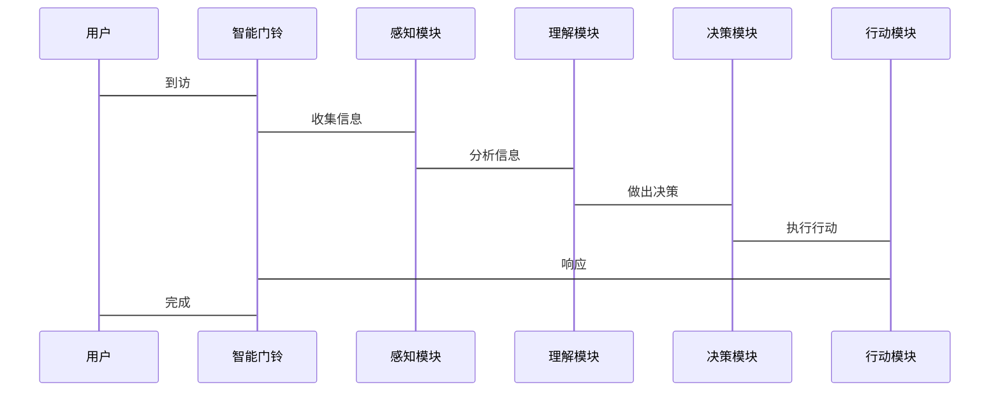

                 

# AI Agent在智能门铃中的访客情绪识别

> 关键词：人工智能，智能门铃，情绪识别，AI Agent，访客体验

> 摘要：本文探讨了AI Agent在智能门铃中访客情绪识别的技术与应用。通过介绍情绪识别的基本概念，AI Agent的架构及其工作流程，以及数据收集与处理方法，详细阐述了访客情绪识别的技术实现，并对未来发展方向进行了展望。文章还讨论了相关技术的伦理问题，旨在为智能门铃领域的研究者和开发者提供有益的参考。

## 引言

智能门铃作为智能家居的重要组成部分，已经逐渐成为现代家庭生活的一部分。随着人工智能技术的快速发展，智能门铃的功能也得到了极大的拓展。其中，AI Agent在智能门铃中的应用尤为引人注目。AI Agent，即人工智能代理，是一种具有自主推理和决策能力的智能系统，能够根据环境信息和用户需求，自动执行任务。

情绪识别是AI Agent的一个重要应用领域，通过识别访客的情绪，智能门铃可以提供更加个性化、人性化的服务。例如，当访客表现出紧张或不安的情绪时，系统可以主动提醒家庭成员注意安全；而当访客表现出友好或轻松的情绪时，系统可以播放欢迎音乐，提升访客的体验。

本文将围绕AI Agent在智能门铃中访客情绪识别的话题，详细探讨相关技术原理、实现方法、应用场景及其未来发展。

## 第1章: AI Agent概述

### 1.1 AI Agent的定义与作用

AI Agent，即人工智能代理，是一种基于人工智能技术的智能系统，它能够模拟人类智能行为，具备感知、理解、推理和决策能力。AI Agent的核心在于其自主性，即能够独立完成特定的任务，而不需要人工干预。

在智能门铃中，AI Agent的作用主要体现在以下几个方面：

1. **访客识别**：AI Agent能够通过摄像头或其他传感器，识别门铃前的访客身份。
2. **情绪识别**：AI Agent能够分析访客的表情、声音等特征，识别访客的情绪状态。
3. **行为预测**：基于情绪识别结果，AI Agent可以预测访客的行为，为家庭成员提供参考。
4. **交互响应**：根据访客的情绪和行为，AI Agent可以自动执行相应的操作，如播放音乐、发送提醒等。

### 1.2 智能门铃系统背景

智能门铃系统通常由摄像头、麦克风、扬声器、传感器和处理器等组成。其基本工作原理是：当有访客到达时，摄像头捕捉访客图像，麦克风采集访客声音，处理器对图像和声音进行分析，识别访客身份和情绪，然后根据预设规则，执行相应的操作。

智能门铃系统的出现，极大地提升了家庭安全和管理效率。例如，通过情绪识别，家庭成员可以提前了解访客的情绪状态，为迎接访客做好准备。此外，智能门铃还可以与其他智能家居设备联动，如自动打开门锁，播放欢迎音乐等，提升家庭生活的智能化水平。

### 1.3 AI Agent在智能门铃中的应用前景

随着人工智能技术的不断进步，AI Agent在智能门铃中的应用前景非常广阔。首先，情绪识别技术的提高，将使智能门铃能够更准确地识别访客的情绪，提供更加个性化的服务。其次，随着传感器技术的进步，AI Agent可以收集更多的环境信息，如温度、湿度、光照等，为情绪识别提供更丰富的数据支持。

此外，随着5G、物联网等技术的普及，智能门铃将实现更高的网络连接速度和更广泛的互联互通，使得AI Agent可以更高效地处理数据，提供更智能的服务。

总之，AI Agent在智能门铃中的应用，将极大地提升家庭安全和生活质量，为智能家居的发展提供新的动力。

## 第2章: 情绪识别基础

### 2.1 情绪识别的基本概念

情绪识别，是指通过分析个体的生理、行为、语言和表情等特征，识别个体的情绪状态。情绪识别的关键在于如何准确捕捉和解析这些特征。

情绪识别的主要类型包括：

1. **面部表情识别**：通过分析面部肌肉运动，识别个体的情绪状态。
2. **声音识别**：通过分析声音的音调、节奏、音量等特征，识别个体的情绪状态。
3. **生理信号识别**：通过分析心率、呼吸、体温等生理信号，识别个体的情绪状态。

情绪识别的应用领域非常广泛，包括但不限于：

1. **心理健康监测**：通过情绪识别，监测个体的情绪状态，为心理健康提供参考。
2. **人机交互**：通过情绪识别，实现更加自然、人性化的交互体验。
3. **智能家居**：通过情绪识别，提供更加个性化的服务，提升用户满意度。

### 2.2 情绪识别的应用领域

情绪识别技术在不同领域都有广泛应用。以下是一些典型应用场景：

1. **心理健康**：通过情绪识别，监测个体的情绪变化，为心理健康提供数据支持。例如，在精神疾病诊断、心理治疗等方面，情绪识别技术都有重要应用。
2. **人机交互**：通过情绪识别，实现人机之间的情感交流。例如，在智能客服、智能玩具等领域，情绪识别技术能够提升交互的智能化水平。
3. **市场营销**：通过情绪识别，分析消费者的情绪反应，为产品设计和营销策略提供参考。例如，在广告投放、市场调研等方面，情绪识别技术都能够发挥作用。
4. **智能家居**：通过情绪识别，提供更加智能化的服务。例如，在智能门铃、智能音箱等领域，情绪识别技术能够提升用户体验。

### 2.3 情绪识别的关键技术

情绪识别的实现需要多种技术的支持，主要包括：

1. **面部表情识别技术**：通过图像处理、机器学习等技术，分析面部肌肉运动，识别情绪状态。
2. **声音识别技术**：通过音频处理、信号分析等技术，分析声音特征，识别情绪状态。
3. **生理信号识别技术**：通过传感器、生理信号处理等技术，分析生理信号，识别情绪状态。
4. **多模态情绪识别技术**：结合多种识别技术，综合分析个体的生理、行为、语言和表情等特征，实现更准确的情绪识别。

情绪识别技术的不断进步，为智能门铃等应用场景提供了更强大的支持，使得智能门铃能够更准确地识别访客的情绪，提供更加人性化的服务。

## 第3章: AI Agent架构

### 3.1 AI Agent的结构

AI Agent通常由以下几个主要部分组成：

1. **感知模块**：用于获取外部环境信息，如图像、声音、文本等。
2. **理解模块**：用于对感知模块获取的信息进行理解和分析，如情感分析、意图识别等。
3. **决策模块**：基于理解模块的结果，进行决策和规划，如自动响应、任务调度等。
4. **行动模块**：执行决策模块生成的行动，如发送消息、控制设备等。

感知模块通常使用图像识别、语音识别等技术，理解模块使用自然语言处理、机器学习等技术，决策模块使用逻辑推理、决策树等技术，行动模块使用控制理论、接口编程等技术。

### 3.2 关键组件

AI Agent的关键组件包括：

1. **传感器**：用于感知外部环境信息，如摄像头、麦克风、温度传感器等。
2. **处理器**：用于处理和分析传感器收集的数据，如CPU、GPU等。
3. **存储器**：用于存储数据和模型，如硬盘、内存等。
4. **通信模块**：用于与其他系统或设备进行数据交换，如Wi-Fi、蓝牙等。

这些组件协同工作，使得AI Agent能够实时感知环境变化，理解分析信息，做出决策并执行行动，从而实现智能化服务。

### 3.3 AI Agent的工作流程

AI Agent的工作流程通常包括以下几个步骤：

1. **感知**：通过传感器收集外部环境信息。
2. **理解**：对感知到的信息进行分析和处理，理解其含义和意图。
3. **决策**：基于理解结果，进行决策和规划，确定下一步行动。
4. **行动**：执行决策模块生成的行动，如发送消息、控制设备等。

例如，在智能门铃中，当有访客到来时，感知模块通过摄像头和麦克风收集访客的图像和声音信息。理解模块对这些信息进行分析，识别访客的身份和情绪状态。决策模块根据理解结果，决定是否发送提醒消息给家庭成员，或者播放欢迎音乐等。行动模块则执行这些决策，实现智能响应。

AI Agent的工作流程示意图如下：

通过上述工作流程，AI Agent能够实现对访客情绪的识别和响应，提供智能化服务。

## 第4章: 访客情绪识别技术

### 4.1 图像识别在情绪识别中的应用

图像识别是情绪识别技术中的一个重要分支，它通过分析访客的面部表情、姿态等特征，识别访客的情绪状态。图像识别在情绪识别中的应用主要包括以下几个步骤：

1. **面部特征检测**：首先，使用面部特征检测算法，如Haar特征分类器，定位访客的面部区域。
2. **面部特征提取**：对定位到的面部区域进行特征提取，如使用LBP（局部二值模式）或HOG（直方图方向梯度）算法提取面部特征。
3. **情绪分类**：将提取到的面部特征输入到情绪分类模型中，如使用支持向量机（SVM）或深度学习模型（如卷积神经网络CNN）进行情绪分类。

图像识别在情绪识别中具有以下几个优势：

- **直观性**：通过分析面部表情，可以直观地识别情绪状态。
- **准确性**：随着深度学习技术的进步，图像识别的准确性得到了显著提升。
- **实时性**：图像识别技术能够实现实时处理，适用于需要快速响应的场景。

然而，图像识别技术也面临一些挑战，如不同光照、姿态变化对识别效果的影响，以及表情多样性带来的识别难度等。

### 4.2 声音识别在情绪识别中的应用

声音识别是通过分析访客的语音特征，识别其情绪状态。声音识别在情绪识别中的应用主要包括以下几个步骤：

1. **语音信号处理**：对采集到的声音信号进行预处理，如降噪、归一化等，以提高识别准确性。
2. **特征提取**：从处理后的声音信号中提取特征，如MFCC（梅尔频率倒谱系数）或PCNN（相关神经网络）等。
3. **情绪分类**：将提取到的特征输入到情绪分类模型中，如使用决策树、支持向量机等算法进行情绪分类。

声音识别在情绪识别中具有以下几个优势：

- **非侵入性**：无需直接接触访客，适用于需要远程监测的场景。
- **多样性**：能够识别不同情绪的声音特征，如语气、语调、音量等。
- **实时性**：声音识别技术可以实现实时处理，适用于需要快速响应的场景。

然而，声音识别技术也面临一些挑战，如背景噪音干扰、语音变化（如语速、语调变化）对识别效果的影响等。

### 4.3 多模态情绪识别

多模态情绪识别是将图像识别和声音识别等技术相结合，通过综合分析访客的图像和声音特征，实现更准确的情绪识别。多模态情绪识别的工作流程主要包括以下几个步骤：

1. **数据采集**：同时采集访客的图像和声音数据。
2. **数据预处理**：对图像和声音数据进行预处理，如降噪、归一化等。
3. **特征提取**：分别提取图像和声音的特征，如面部特征和MFCC特征。
4. **特征融合**：将图像和声音特征进行融合，如使用加权平均、拼接等方法。
5. **情绪分类**：将融合后的特征输入到情绪分类模型中，如使用深度学习模型进行分类。

多模态情绪识别的优势在于：

- **准确性**：结合图像和声音特征，能够更准确地识别情绪状态。
- **鲁棒性**：能够应对不同光照、姿态变化和背景噪音等挑战。
- **全面性**：能够全面分析访客的情绪状态，提供更丰富的情绪识别信息。

然而，多模态情绪识别也面临一些挑战，如数据同步、特征融合方法的选择等。

通过上述技术，智能门铃能够更准确地识别访客的情绪，为用户提供更人性化的服务。

## 第5章: 数据收集与预处理

### 5.1 数据收集

数据收集是情绪识别系统的基础，收集到的数据质量直接影响到情绪识别的准确性和可靠性。在智能门铃中，数据收集主要包括以下步骤：

1. **访客图像数据收集**：通过智能门铃的摄像头，捕捉访客的面部图像。为了保证数据质量，需要在不同的光照条件下、不同的姿态下进行数据收集，以涵盖各种可能的场景。
2. **访客声音数据收集**：通过智能门铃的麦克风，捕捉访客的声音。同样，需要在不同声音环境、不同语速和语调下收集声音数据，以全面覆盖各种情绪状态。
3. **环境数据收集**：除了访客图像和声音数据外，还需要收集一些环境数据，如温度、湿度、光照等。这些数据可以帮助情绪识别系统更好地理解访客所处的环境，提高情绪识别的准确性。

### 5.2 数据预处理

数据预处理是确保数据质量的重要步骤，主要包括以下任务：

1. **图像数据预处理**：
   - **降噪**：去除图像中的噪声，提高图像质量。
   - **归一化**：调整图像的尺寸和亮度，使其适应情绪识别模型的输入要求。
   - **面部特征提取**：使用面部特征检测算法，如Haar特征分类器，定位访客的面部区域，提取面部特征。

2. **声音数据预处理**：
   - **降噪**：去除声音中的噪声，提高声音质量。
   - **归一化**：调整声音的音量，使其适应情绪识别模型的输入要求。
   - **特征提取**：使用声音特征提取算法，如MFCC，提取声音特征。

3. **数据清洗**：去除数据中的异常值和重复值，确保数据的准确性和一致性。

4. **数据标注**：对收集到的图像和声音数据进行标注，标记出具体的情绪类别，如快乐、悲伤、愤怒等。数据标注需要人工完成，需要经验丰富的标注人员。

### 5.3 数据集构建

数据集是训练和评估情绪识别模型的基础。构建高质量的数据集需要以下步骤：

1. **数据采集**：收集大量的访客图像和声音数据，涵盖各种情绪状态和不同场景。
2. **数据预处理**：对采集到的数据进行预处理，确保数据质量。
3. **数据标注**：对预处理后的数据进行标注，标记出具体的情绪类别。
4. **数据划分**：将标注好的数据划分为训练集、验证集和测试集，分别用于模型训练、验证和测试。

通过上述步骤，构建出一个高质量的数据集，为情绪识别系统的开发和优化提供了重要基础。高质量的数据集能够提高情绪识别的准确性和鲁棒性，从而提升智能门铃的智能化水平。

## 第6章: 模型训练与评估

### 6.1 模型训练

模型训练是情绪识别系统的核心步骤，通过训练数据集，模型能够学习到情绪识别的规律和特征。模型训练主要包括以下步骤：

1. **数据预处理**：对训练数据进行预处理，包括数据归一化、数据增强等，以提高模型的泛化能力。
2. **模型选择**：选择合适的情绪识别模型，如基于深度学习的卷积神经网络（CNN）或支持向量机（SVM）等。选择模型时需要考虑模型的复杂度、训练时间、识别准确性等因素。
3. **模型初始化**：初始化模型参数，常用的初始化方法包括随机初始化、高斯初始化等。
4. **模型训练**：使用训练数据集，通过迭代优化模型参数，使得模型能够准确地识别情绪状态。训练过程中，可以使用梯度下降、随机梯度下降等优化算法，并使用交叉验证等策略来提高模型的泛化能力。

### 6.2 模型评估

模型评估是确保情绪识别系统性能的重要步骤。模型评估主要包括以下指标：

1. **准确率**：准确率是评估模型识别情绪状态准确性的指标，计算公式为：准确率 = （正确识别的情绪状态数 / 总情绪状态数）× 100%。
2. **召回率**：召回率是评估模型能否识别出所有情绪状态的指标，计算公式为：召回率 = （正确识别的情绪状态数 / 实际存在的情绪状态数）× 100%。
3. **F1值**：F1值是综合准确率和召回率的指标，计算公式为：F1值 = 2 × （准确率 × 召回率） / （准确率 + 召回率）。

此外，还可以使用混淆矩阵、ROC曲线等指标来评估模型性能。

### 6.3 超参数调优

超参数是影响模型性能的重要参数，如学习率、正则化参数等。超参数调优是模型训练过程中的一项关键任务，通过调整超参数，可以优化模型性能。超参数调优的方法包括：

1. **网格搜索**：通过遍历预设的参数组合，找到最优的超参数组合。
2. **贝叶斯优化**：基于贝叶斯理论，通过历史数据来预测新的超参数组合，实现高效的超参数搜索。
3. **随机搜索**：在预设的参数范围内，随机选择超参数组合，通过迭代优化找到最优参数。

通过模型训练与评估，情绪识别系统能够准确识别访客的情绪状态，为智能门铃提供智能化服务。

## 第7章: 部署与集成

### 7.1 部署

情绪识别系统的部署是将训练好的模型部署到实际环境中，以便实现实时情绪识别。部署过程主要包括以下几个步骤：

1. **环境配置**：在智能门铃中配置必要的硬件资源，如处理器、内存等，以满足模型运行的性能要求。
2. **模型转化**：将训练好的模型从高精度、高复杂的计算环境中转化为低精度、低复杂度的部署环境，以提高运行效率。常用的模型转化方法包括量化、剪枝等。
3. **模型部署**：将转化后的模型部署到智能门铃的处理器上，以便实现实时情绪识别。

### 7.2 集成

情绪识别系统的集成是将情绪识别功能与其他智能门铃功能（如访客身份识别、智能通知等）进行整合，实现协同工作。集成过程主要包括以下几个步骤：

1. **接口设计**：设计统一的接口，以便情绪识别模块与其他功能模块进行数据交换和协同工作。
2. **数据同步**：确保情绪识别模块与其他功能模块的数据同步，如访客图像、声音数据等。
3. **功能集成**：将情绪识别功能与其他功能模块进行集成，实现协同工作。例如，当情绪识别模块识别到访客情绪状态时，可以触发其他功能模块（如智能通知）进行相应操作。

通过部署与集成，情绪识别系统能够在智能门铃中实现实时情绪识别，为用户提供更智能化的服务。

## 第8章: 伦理考虑与隐私保护

### 8.1 伦理考虑

情绪识别技术的应用虽然在智能门铃中提供了便利和个性化服务，但也引发了一系列伦理问题。以下是一些主要的伦理考虑：

1. **隐私保护**：情绪识别技术涉及到个人情绪数据的收集和分析，这可能侵犯用户的隐私权。如何在提供便利和服务的同时，保护用户的隐私，是必须考虑的问题。
2. **偏见与歧视**：情绪识别模型可能存在偏见，例如，对某些性别、年龄或种族的访客识别准确性较低，这可能导致歧视现象。如何避免和减少这些偏见，确保公平性，是伦理考虑的重要内容。
3. **透明度**：用户需要了解情绪识别技术的原理、应用场景和潜在影响，以便做出知情的选择。情绪识别系统的设计者和提供者应确保系统的透明度，接受用户的监督和反馈。

### 8.2 隐私保护

隐私保护是情绪识别技术的重要伦理问题。以下是一些隐私保护措施：

1. **数据加密**：对收集到的情绪数据进行加密存储，确保数据在传输和存储过程中安全。
2. **匿名化处理**：在数据收集和存储过程中，对个人身份信息进行匿名化处理，仅保留与情绪识别相关的数据。
3. **用户权限管理**：用户有权控制自己的情绪数据是否被收集和使用，系统应提供简单的用户权限管理功能。
4. **合规性审查**：定期对情绪识别系统进行合规性审查，确保其符合相关法律法规和伦理标准。

通过采取上述措施，可以在一定程度上缓解情绪识别技术的隐私问题，提高用户对智能门铃的信任度。

## 第9章: 未来发展方向

### 9.1 技术进步

随着人工智能技术的不断进步，情绪识别技术也将得到进一步提升。未来的情绪识别技术可能会更准确地捕捉和解析情绪状态，例如，通过增强学习、迁移学习等技术，提高模型在复杂环境下的适应能力。此外，多模态情感计算技术的不断发展，也将为情绪识别提供更丰富的数据来源，提高识别准确性。

### 9.2 应用拓展

情绪识别技术的应用领域将不断拓展，不仅限于智能门铃，还将应用于智能客服、智能家居、医疗健康等多个领域。例如，在智能客服中，通过情绪识别，可以更好地理解用户的需求和情绪状态，提供更个性化的服务；在医疗健康领域，情绪识别技术可以用于心理健康监测，辅助诊断和治疗。

### 9.3 伦理与法规

随着情绪识别技术的广泛应用，相关的伦理和法规问题也将受到更多关注。未来，需要建立完善的伦理和法规体系，规范情绪识别技术的使用。例如，明确隐私保护标准，确保用户知情同意，加强对模型的偏见和歧视问题的监管等。

### 9.4 挑战与机遇

情绪识别技术的发展面临一系列挑战，如数据质量、模型解释性、隐私保护等。但同时，这些挑战也为技术创新提供了机遇。通过不断探索和实践，情绪识别技术将迎来更广阔的发展前景。

## 总结

AI Agent在智能门铃中访客情绪识别的技术与应用，为智能家居领域带来了新的发展方向。通过情绪识别，智能门铃能够提供更加个性化、人性化的服务，提升用户满意度。未来，随着技术的不断进步和应用领域的拓展，情绪识别技术将在更多场景中发挥重要作用，为人们的智慧生活提供更多便利。同时，我们也要重视伦理和隐私保护问题，确保情绪识别技术的健康发展。

## 作者信息

作者：AI天才研究院/AI Genius Institute & 禅与计算机程序设计艺术 /Zen And The Art of Computer Programming

