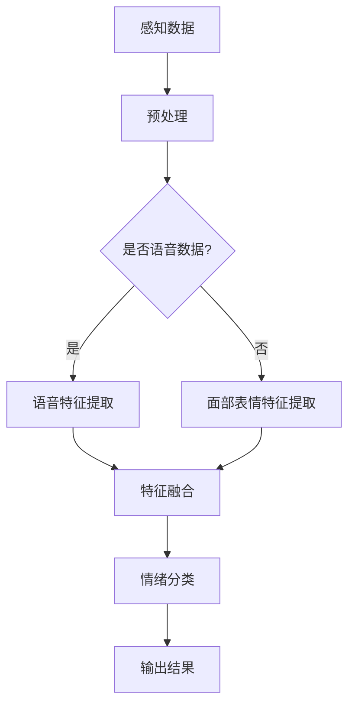

                 

### 引言

在现代智能家居领域，智能门铃作为一种重要的安全设备，已经得到了广泛应用。随着人工智能技术的迅猛发展，传统的智能门铃逐渐被更加智能、功能更丰富的AI Agent所取代。AI Agent的引入不仅提升了智能门铃的性能，还扩展了其应用场景，使其在访客情绪识别等方面展现出巨大的潜力。本文将围绕AI Agent在智能门铃中的访客情绪识别这一主题，展开深入探讨。

情绪识别是人工智能领域中的一项核心技术，它通过对人类情感状态的感知与分析，为智能设备提供了更加人性化的交互体验。在智能门铃的应用中，情绪识别技术可以识别访客的情绪状态，如友好、紧张或愤怒等，从而为居民提供更为细致的安保措施。此外，情绪识别技术还能通过语音、面部表情等信号，为智能门铃提供实时反馈，使其在交互过程中更加自然和贴心。

本文将首先介绍AI Agent和情绪识别的基本概念，然后探讨情绪识别技术在智能门铃中的应用。接着，我们将详细分析AI Agent在智能门铃中的情绪识别算法原理，包括数学模型和公式。随后，文章将介绍智能门铃的系统架构设计，包括功能设计、系统架构和接口设计。在此基础上，文章将通过一个实际项目案例，展示AI Agent在智能门铃中的应用过程。最后，本文将总结最佳实践，并提出未来研究方向和展望。

通过本文的阅读，读者将全面了解AI Agent在智能门铃中的访客情绪识别技术，掌握其基本原理和应用方法，为智能家居领域的研究和应用提供有益的参考。

### 第1章：问题背景与核心概念

#### 1.1 问题背景

随着科技的不断进步，智能门铃已经成为现代家庭安全的重要组成部分。传统的智能门铃主要功能是记录访客信息、发送通知和提供远程通话，但在访客情绪识别方面的功能较为有限。现实应用中，家庭用户往往需要在开门前对访客的情绪状态有所了解，以便采取适当的应对措施。例如，如果访客情绪紧张，家庭用户可能会选择不立即开门，以确保自身安全；反之，如果访客情绪友好，用户可能会更愿意与其互动。

这种需求催生了AI Agent在智能门铃中的应用。AI Agent是一种基于人工智能的智能实体，它通过感知外部环境和用户行为，自主地完成特定任务。在智能门铃中，AI Agent可以利用语音识别、面部识别等技术，实时分析访客的情绪状态，提供更智能化的安全防护。

#### 1.2 问题解决

为了解决访客情绪识别的问题，智能门铃中的AI Agent需要具备以下几个关键能力：

1. **声音识别与情绪分析**：通过分析访客的语音信号，AI Agent可以识别出其情绪状态。这需要利用语音识别技术和情绪识别算法，将语音转化为文字，并分析其中的情绪成分。
   
2. **面部表情识别**：通过摄像头捕捉访客的面部表情，AI Agent可以利用计算机视觉技术进行面部表情分析。这种方法可以提供更为直观的情绪识别结果。

3. **多模态融合**：将声音识别和面部表情识别的结果进行融合，可以提供更准确的情绪识别结果。这种方法可以减少单一模态识别的误差，提高整体系统的鲁棒性。

4. **智能决策**：基于情绪识别结果，AI Agent可以做出相应的决策，例如提示用户是否需要开门，或者采取进一步的安保措施。

#### 1.3 边界与外延

在实施情绪识别技术时，需要考虑以下几个边界条件：

1. **隐私保护**：情绪识别涉及到用户的隐私信息，因此需要严格保护用户的隐私。例如，可以采用数据加密和匿名化处理，确保用户信息不被泄露。

2. **环境适应性**：情绪识别算法需要在各种环境中都能有效运行。例如，在光线不足、声音嘈杂的环境中，算法的识别准确性可能会受到影响。因此，需要优化算法，提高其在各种环境下的适应性。

3. **实时性**：情绪识别需要在短时间内完成，以便及时响应用户的需求。例如，在访客敲门后，AI Agent需要快速分析访客的情绪状态，并做出决策。

4. **可靠性**：情绪识别系统需要具备高可靠性，确保在长时间运行过程中不会出现故障。例如，可以通过冗余设计和故障检测机制，提高系统的可靠性。

总之，AI Agent在智能门铃中的访客情绪识别技术为家庭安全提供了新的解决方案。通过深入研究和优化，这项技术有望进一步提升智能门铃的功能和用户体验。

#### 1.4 核心概念

1. **AI Agent的定义与特点**：
   AI Agent，即人工智能代理，是一种具备智能行为的计算实体，能够在特定环境和任务下自主决策和执行任务。其特点包括：
   - **自主性**：AI Agent可以自主地感知环境、获取信息并做出决策。
   - **适应性**：AI Agent可以根据环境变化和任务需求，调整其行为策略。
   - **协作性**：AI Agent可以与其他AI Agent或人类协作，共同完成任务。
   - **学习能力**：AI Agent可以利用机器学习算法，从经验中学习并不断优化自身行为。

2. **情绪识别的基本原理**：
   情绪识别是通过分析人类行为和生理信号，识别出其情绪状态的技术。其基本原理包括：
   - **语音信号分析**：通过分析语音信号中的频率、时长等特征，识别出情绪状态。
   - **面部表情识别**：通过分析面部表情的变化，识别出情绪状态。
   - **生理信号监测**：通过监测心率、皮肤电导等生理信号，识别出情绪状态。

3. **智能门铃的工作流程**：
   智能门铃中的AI Agent通过以下步骤实现访客情绪识别：
   - **感知阶段**：通过摄像头和麦克风捕捉访客的语音和面部表情信号。
   - **预处理阶段**：对捕获的信号进行预处理，如滤波、降噪等。
   - **特征提取阶段**：从预处理后的信号中提取出与情绪相关的特征。
   - **情绪识别阶段**：利用情绪识别算法，对提取出的特征进行分析，识别出访客的情绪状态。
   - **决策阶段**：根据情绪识别结果，AI Agent做出相应的决策，如是否提示用户开门或采取其他安保措施。

通过以上步骤，AI Agent可以实现对访客情绪的准确识别，为家庭安全提供有力保障。

### 第2章：情绪识别技术综述

#### 2.1 情绪识别技术概述

情绪识别技术作为人工智能领域的一个重要分支，其发展历程可以追溯到20世纪中期。早期的研究主要集中在人类情感行为的基础研究上，通过心理学、神经科学等领域的知识，探索情感的本质和特征。随着计算机技术的发展，情绪识别技术逐渐从理论研究走向实际应用。

情绪识别技术的应用领域非常广泛，包括但不限于以下几个方面：

1. **心理健康监测**：通过情绪识别技术，可以对个体的情绪状态进行实时监测，帮助心理医生和用户更好地了解自己的心理健康状况。

2. **人机交互**：在智能音箱、智能门铃等设备中，情绪识别技术可以提升设备的交互体验，使其更贴近人类的情感需求。

3. **市场调研**：在市场调研中，情绪识别技术可以帮助企业了解消费者对产品或服务的真实情感反应，从而优化产品设计和营销策略。

4. **安防监控**：在安防监控领域，情绪识别技术可以识别出异常情绪的个体，为安全预警提供支持。

5. **教育辅助**：在教育领域，情绪识别技术可以用于监测学生的学习情绪，为个性化教学提供依据。

情绪识别技术的重要性不仅体现在其广泛的应用场景中，还在于其能够为人类社会带来更多便利和福利。例如，通过情绪识别技术，可以提升医疗服务的质量，为精神疾病患者提供更好的治疗方案；在人机交互方面，情绪识别技术可以使设备更加智能、人性化，提高用户的使用满意度。

#### 2.2 情绪识别方法

情绪识别方法主要可以分为两大类：基于传统机器学习的方法和基于深度学习的方法。每种方法都有其独特的优点和适用场景。

1. **基于传统机器学习的方法**：

   传统机器学习方法主要依赖于手工设计的特征和分类器。这种方法的基本流程如下：

   - **特征提取**：从原始数据（如语音、文本、图像）中提取出与情绪相关的特征。例如，在语音信号中提取音高、音强、时长等特征；在图像中提取面部表情的几何特征。
   - **模型训练**：使用已标注的数据集，训练分类模型。常用的分类算法包括支持向量机（SVM）、决策树、随机森林等。
   - **模型评估**：使用测试集对训练好的模型进行评估，评估指标包括准确率、召回率、F1分数等。

   传统机器学习方法的优点在于其解释性较强，可以清晰地理解每个特征对模型决策的影响。然而，这种方法也存在一些局限性，如对特征工程依赖较大，且在面对复杂任务时，效果可能不如深度学习方法。

2. **基于深度学习的方法**：

   深度学习方法通过构建深层神经网络，自动提取数据中的特征，从而实现情绪识别。这种方法的基本流程如下：

   - **数据处理**：对原始数据进行预处理，如归一化、标准化等，以便于输入到神经网络中。
   - **模型构建**：设计并构建深度学习模型，如卷积神经网络（CNN）、循环神经网络（RNN）、长短时记忆网络（LSTM）等。
   - **模型训练**：使用大量标注数据训练深度学习模型，通过反向传播算法优化模型参数。
   - **模型评估**：使用测试集对训练好的模型进行评估，并根据评估结果调整模型结构或参数。

   深度学习方法的优点在于其强大的特征自动提取能力，可以在不需要人工设计特征的情况下，实现高精度的情绪识别。此外，深度学习方法在面对复杂、大规模的数据集时，表现出色。然而，深度学习模型也存在一些挑战，如模型复杂度高、训练时间较长、对数据质量要求较高等。

总的来说，基于传统机器学习的方法和基于深度学习的方法各有优劣，在实际应用中，通常需要根据具体任务需求、数据规模和计算资源等因素，选择合适的情绪识别方法。

#### 2.3 情绪识别技术挑战

尽管情绪识别技术在理论研究和实际应用中取得了显著进展，但仍然面临诸多挑战，特别是在数据隐私保护、环境适应性和技术精度等方面。

1. **数据隐私问题**：

   情绪识别技术需要收集和处理大量的个人隐私数据，如语音、面部表情等。这些数据如果泄露，可能导致用户隐私受到侵犯，甚至引发严重的法律和安全问题。因此，如何在保证情绪识别效果的同时，保护用户隐私，是一个亟待解决的问题。一些解决方案包括数据加密、匿名化处理和隐私保护算法等。

2. **环境适应性**：

   情绪识别技术在不同环境和场景下，其识别效果可能会有很大差异。例如，在光线不足、声音嘈杂的环境中，情绪识别的准确率可能会降低。为了提高情绪识别技术的环境适应性，需要对其进行优化，使其能够应对各种复杂环境。例如，通过自适应滤波技术、多传感器融合等方法，提高情绪识别的鲁棒性。

3. **技术精度**：

   情绪识别技术的精度直接影响到其实际应用效果。目前，尽管深度学习等方法在情绪识别任务上取得了较高的准确率，但仍存在一定误差。为了提高技术精度，可以采用以下方法：

   - **数据增强**：通过增加数据集的多样性，提高模型对各种情绪状态的理解能力。
   - **多模态融合**：将语音、文本、图像等多种数据源进行融合，提高情绪识别的全面性和准确性。
   - **持续学习**：通过持续学习和模型更新，使情绪识别技术能够适应不断变化的环境和任务需求。

总之，情绪识别技术面临的数据隐私、环境适应性和技术精度等挑战，需要通过技术创新和跨学科合作，逐步加以解决。

### 第3章：AI Agent在智能门铃中的应用

#### 3.1 AI Agent的基本原理

AI Agent，即人工智能代理，是一种能够自主感知环境、理解和执行任务的人工智能实体。它具备以下几个基本原理：

1. **感知能力**：AI Agent能够通过传感器（如摄像头、麦克风）获取环境中的信息，如语音、图像等。

2. **理解能力**：AI Agent利用自然语言处理（NLP）、计算机视觉等技术，理解和分析获取到的信息。

3. **决策能力**：基于对信息的理解和分析，AI Agent能够做出相应的决策，如提示用户开门、报警等。

4. **行动能力**：AI Agent能够执行决策，如控制门铃、摄像头等硬件设备。

AI Agent在智能门铃中的角色主要体现在以下几个方面：

1. **情绪识别**：通过语音识别和面部表情识别技术，AI Agent可以识别访客的情绪状态，如友好、紧张或愤怒等。

2. **智能交互**：基于情绪识别结果，AI Agent可以与用户进行自然语言交互，提供个性化的提示和建议。

3. **安全预警**：如果AI Agent检测到访客情绪异常，它可以及时向用户发出警报，提醒用户采取相应措施。

4. **行为分析**：AI Agent还可以分析访客的行为模式，为用户提供更加精准的安全防护策略。

总之，AI Agent通过感知、理解、决策和行动，为智能门铃提供了更智能、更贴心的服务，提升了家庭安全水平。

#### 3.2 情绪识别算法

情绪识别算法是AI Agent实现访客情绪识别的核心技术。以下将介绍一种基于深度学习的情绪识别算法，并使用Python源代码进行详细讲解。

##### 3.2.1 算法原理

情绪识别算法的基本原理是利用深度神经网络（DNN）从输入数据中自动提取特征，并通过分类层输出情绪状态。具体步骤如下：

1. **数据预处理**：对输入的语音和面部表情数据进行预处理，包括归一化、去噪等操作。
2. **特征提取**：使用卷积神经网络（CNN）提取语音和面部表情的特征。
3. **特征融合**：将语音和面部表情的特征进行融合，形成多维特征向量。
4. **情绪分类**：使用全连接层（FC）对特征向量进行分类，输出情绪状态。

##### 3.2.2 Mermaid流程图

下面是情绪识别算法的Mermaid流程图：



##### 3.2.3 Python源代码

以下是情绪识别算法的Python源代码：

```python
import numpy as np
import tensorflow as tf
from tensorflow.keras.models import Sequential
from tensorflow.keras.layers import Conv2D, MaxPooling2D, Flatten, Dense

# 数据预处理
def preprocess_data(data):
    # 归一化、去噪等操作
    return normalized_data

# 语音特征提取
def extract_speech_features(speech_data):
    # 使用卷积神经网络提取特征
    model = Sequential([
        Conv2D(32, (3, 3), activation='relu', input_shape=(None, None, 1)),
        MaxPooling2D(pool_size=(2, 2)),
        Flatten(),
        Dense(64, activation='relu'),
        Dense(6, activation='softmax')  # 6种情绪分类
    ])
    model.compile(optimizer='adam', loss='categorical_crossentropy', metrics=['accuracy'])
    model.fit(speech_data, labels, epochs=10, batch_size=32)
    return model

# 面部表情特征提取
def extract_face_features(face_data):
    # 使用卷积神经网络提取特征
    model = Sequential([
        Conv2D(32, (3, 3), activation='relu', input_shape=(None, None, 1)),
        MaxPooling2D(pool_size=(2, 2)),
        Flatten(),
        Dense(64, activation='relu'),
        Dense(6, activation='softmax')  # 6种情绪分类
    ])
    model.compile(optimizer='adam', loss='categorical_crossentropy', metrics=['accuracy'])
    model.fit(face_data, labels, epochs=10, batch_size=32)
    return model

# 特征融合与情绪分类
def classify_emotion(speech_model, face_model, speech_data, face_data):
    speech_features = speech_model.predict(speech_data)
    face_features = face_model.predict(face_data)
    combined_features = np.concatenate((speech_features, face_features), axis=1)
    model = Sequential([
        Flatten(),
        Dense(128, activation='relu'),
        Dense(6, activation='softmax')  # 6种情绪分类
    ])
    model.compile(optimizer='adam', loss='categorical_crossentropy', metrics=['accuracy'])
    model.fit(combined_features, labels, epochs=10, batch_size=32)
    return model

# 输出结果
def output_result(model, combined_features):
    return model.predict(combined_features)
```

##### 3.2.4 算法原理讲解

情绪识别算法的原理是通过深度学习模型自动提取语音和面部表情的特征，并将这些特征进行融合，从而实现情绪分类。具体步骤如下：

1. **数据预处理**：对语音和面部表情数据进行归一化和去噪，以便于模型训练。
2. **语音特征提取**：使用卷积神经网络（CNN）从语音数据中提取特征。首先，通过卷积层和池化层提取低级特征，然后通过全连接层提取高级特征。
3. **面部表情特征提取**：同样使用卷积神经网络（CNN）从面部表情数据中提取特征。
4. **特征融合**：将语音和面部表情的特征进行拼接，形成多维特征向量。
5. **情绪分类**：使用全连接层（FC）对特征向量进行分类，输出情绪状态。

通过这个算法，AI Agent可以实现对访客情绪的准确识别，为智能门铃提供更智能化的服务。

#### 3.3 数学模型与公式

情绪识别算法的核心是利用深度学习模型自动提取和融合语音与面部表情特征，并通过分类层进行情绪分类。以下是情绪识别算法的数学模型与公式：

##### 3.3.1 情绪识别算法的数学模型

1. **语音特征提取模型**：

   假设输入语音数据为\[x\]，使用卷积神经网络（CNN）提取特征，输出特征向量为\[h_{s}\]。模型可以表示为：

   \[ h_{s} = f_{s}(x) \]

   其中，\( f_{s}(x) \)为卷积神经网络提取特征的过程。

2. **面部表情特征提取模型**：

   假设输入面部表情数据为\[y\]，使用卷积神经网络（CNN）提取特征，输出特征向量为\[h_{f}\]。模型可以表示为：

   \[ h_{f} = f_{f}(y) \]

   其中，\( f_{f}(y) \)为卷积神经网络提取特征的过程。

3. **特征融合模型**：

   将语音和面部表情的特征进行融合，形成多维特征向量\[h\]：

   \[ h = [h_{s}, h_{f}] \]

4. **情绪分类模型**：

   使用全连接层（FC）对特征向量\[h\]进行分类，输出情绪状态概率分布\[p\]：

   \[ p = \sigma(W \cdot h + b) \]

   其中，\( W \)为权重矩阵，\( b \)为偏置项，\( \sigma \)为softmax函数。

##### 3.3.2 情绪识别算法的公式

以下是情绪识别算法的主要公式：

1. **卷积神经网络特征提取**：

   \[ h_{s}^{l} = \sigma(\mathbf{W}_{s}^{l} \ast h_{s}^{l-1} + b_{s}^{l}) \]

   其中，\( \ast \)表示卷积操作，\( \sigma \)为激活函数，\( \mathbf{W}_{s}^{l} \)和\( b_{s}^{l} \)分别为卷积核和偏置项。

2. **全连接层分类**：

   \[ p_{i} = \frac{e^{\mathbf{w}_{i} \cdot h + b_{i}}}{\sum_{j=1}^{K} e^{\mathbf{w}_{j} \cdot h + b_{j}}} \]

   其中，\( \mathbf{w}_{i} \)为权重向量，\( b_{i} \)为偏置项，\( K \)为分类类别数，\( h \)为特征向量。

3. **损失函数**：

   \[ J = -\sum_{i=1}^{N} y_{i} \log(p_{i}) \]

   其中，\( y_{i} \)为真实标签，\( p_{i} \)为预测概率，\( N \)为样本数。

通过上述公式，情绪识别算法可以实现对语音和面部表情特征的提取与融合，并进行情绪分类。这些公式为我们理解和优化情绪识别算法提供了理论基础。

#### 3.4 情绪识别算法的数学模型和公式详细讲解

情绪识别算法的数学模型是构建在深度学习的基础之上的，通过多层神经网络对输入的数据进行处理，最终输出情绪状态的概率分布。以下是情绪识别算法的数学模型和公式的详细讲解。

##### 3.4.1 卷积神经网络（CNN）特征提取

卷积神经网络（CNN）在处理图像和语音数据时，能够自动提取数据中的高阶特征。以下是CNN特征提取过程的详细公式：

1. **卷积层**：

   卷积层的公式如下：

   \[ h_{s}^{l} = \sigma(\mathbf{W}_{s}^{l} \ast h_{s}^{l-1} + b_{s}^{l}) \]

   其中，\( h_{s}^{l} \)表示第l层的特征图，\( \mathbf{W}_{s}^{l} \)是卷积核，\( \ast \)表示卷积操作，\( b_{s}^{l} \)是偏置项，\( \sigma \)是激活函数（如ReLU函数）。

2. **池化层**：

   池化层的公式如下：

   \[ p_{ij} = \max_{k,l} (\mathbf{W}_{p}^{l} \ast h_{s}^{l-1}_{ikl} + b_{p}^{l}) \]

   其中，\( p_{ij} \)表示第i个特征图上的第j个元素，\( \mathbf{W}_{p}^{l} \)是池化窗口，\( b_{p}^{l} \)是偏置项。

##### 3.4.2 全连接层（FC）分类

全连接层用于将卷积层提取的特征进行分类。以下是全连接层分类的详细公式：

1. **前向传播**：

   全连接层的公式如下：

   \[ z_{i} = \sum_{j=1}^{M} \mathbf{w}_{ij} h_{f}^{j} + b_{i} \]

   其中，\( z_{i} \)是第i个神经元的激活值，\( \mathbf{w}_{ij} \)是权重矩阵，\( h_{f}^{j} \)是特征向量，\( b_{i} \)是偏置项。

2. **激活函数**：

   使用softmax函数作为激活函数，输出情绪状态的概率分布：

   \[ p_{i} = \frac{e^{\mathbf{w}_{i} \cdot h + b_{i}}}{\sum_{j=1}^{K} e^{\mathbf{w}_{j} \cdot h + b_{j}}} \]

   其中，\( p_{i} \)是第i个情绪状态的预测概率，\( \mathbf{w}_{i} \)是权重向量，\( K \)是情绪状态的类别数，\( h \)是特征向量。

##### 3.4.3 损失函数

在情绪识别任务中，常用的损失函数是交叉熵损失函数，其公式如下：

\[ J = -\sum_{i=1}^{N} y_{i} \log(p_{i}) \]

其中，\( y_{i} \)是真实标签，\( p_{i} \)是预测概率，\( N \)是样本数。

##### 3.4.4 举例说明

假设有一个情绪识别任务，共有6种情绪状态，输入数据为语音和面部表情特征，分别为\( h_{s} \)和\( h_{f} \)。经过全连接层分类后，输出情绪状态的概率分布为\( p \)。

1. **前向传播**：

   \[ z_{1} = \sum_{j=1}^{M} \mathbf{w}_{1j} h_{f}^{j} + b_{1} \]
   \[ z_{2} = \sum_{j=1}^{M} \mathbf{w}_{2j} h_{f}^{j} + b_{2} \]
   \[ ... \]
   \[ z_{6} = \sum_{j=1}^{M} \mathbf{w}_{6j} h_{f}^{j} + b_{6} \]

   \[ p_{1} = \frac{e^{z_{1}}}{\sum_{j=1}^{6} e^{z_{j}}} \]
   \[ p_{2} = \frac{e^{z_{2}}}{\sum_{j=1}^{6} e^{z_{j}}} \]
   \[ ... \]
   \[ p_{6} = \frac{e^{z_{6}}}{\sum_{j=1}^{6} e^{z_{j}}} \]

2. **损失函数**：

   \[ J = -y_{1} \log(p_{1}) - y_{2} \log(p_{2}) - ... - y_{6} \log(p_{6}) \]

通过上述数学模型和公式的详细讲解，我们可以更好地理解情绪识别算法的工作原理。这些公式不仅为我们提供了理论基础，也为算法的优化和改进提供了指导方向。

### 第4章：智能门铃系统架构设计

#### 4.1 系统功能设计

智能门铃系统的功能设计是实现情绪识别的关键。其核心功能包括访客情绪识别、用户交互、安全预警和远程控制等。以下为智能门铃系统的功能设计：

1. **访客情绪识别**：
   - 通过摄像头和麦克风捕捉访客的语音和面部表情信号。
   - 利用AI Agent的语音识别和面部表情识别技术，对访客的情绪状态进行实时分析。

2. **用户交互**：
   - 用户可以通过智能手机应用程序或智能门铃的显示屏与访客进行语音对话。
   - 系统可以根据访客的情绪状态，提供友好的交互提示，如“欢迎您来访！”或“请稍等，我需要核实一下访客信息”。

3. **安全预警**：
   - 当AI Agent检测到访客情绪异常（如紧张或愤怒），系统会立即向用户发送警报，提示用户采取相应的安全措施。
   - 系统还可以联动家庭安全系统，如门锁、摄像头等，提高家庭的安全防护水平。

4. **远程控制**：
   - 用户可以通过智能手机应用程序远程控制智能门铃，如开启或关闭门铃、调整音量等。
   - 用户还可以远程查看访客的视频和图像信息，以便做出更明智的决策。

#### 4.2 系统架构设计

智能门铃系统的架构设计是实现上述功能的基础。以下为智能门铃系统的架构设计：

1. **感知层**：
   - 摄像头：用于捕捉访客的面部表情。
   - 麦克风：用于捕捉访客的语音信号。

2. **数据处理层**：
   - 语音识别模块：对访客的语音信号进行识别，转换为文本。
   - 面部表情识别模块：对访客的面部表情进行分析，识别出情绪状态。

3. **决策层**：
   - AI Agent：基于语音和面部表情识别的结果，对访客的情绪状态进行综合分析，并做出相应的决策。
   - 用户交互模块：与用户进行交互，提供友好的交互提示和报警信息。

4. **执行层**：
   - 门锁控制模块：根据AI Agent的决策，控制门锁的开启和关闭。
   - 视频流控制模块：根据AI Agent的决策，控制摄像头和显示器的视频流。

5. **用户界面层**：
   - 智能手机应用程序：用户可以通过应用程序与智能门铃进行交互，查看访客信息、控制门锁等。
   - 显示屏：用于向访客展示欢迎信息或报警信息。

#### 4.3 系统接口设计

智能门铃系统的接口设计是确保各模块之间高效、可靠通信的关键。以下为智能门铃系统的接口设计：

1. **语音识别接口**：
   - 输入：语音信号。
   - 输出：文本信息。

2. **面部表情识别接口**：
   - 输入：面部图像。
   - 输出：情绪状态。

3. **用户交互接口**：
   - 输入：用户指令。
   - 输出：交互提示和报警信息。

4. **门锁控制接口**：
   - 输入：开启/关闭指令。
   - 输出：门锁状态。

5. **视频流控制接口**：
   - 输入：视频流控制指令。
   - 输出：视频流。

#### 4.4 系统交互

智能门铃系统的交互过程可以分为以下几个步骤：

1. **访客敲门**：
   - 智能门铃启动感知层模块，开始捕捉访客的语音和面部表情信号。

2. **数据预处理**：
   - 对捕捉到的语音和面部表情信号进行预处理，如降噪、归一化等。

3. **情绪识别**：
   - 利用语音识别和面部表情识别模块，对预处理后的数据进行分析，识别访客的情绪状态。

4. **决策与执行**：
   - AI Agent根据情绪识别结果，做出相应的决策，如是否开启门锁、发送报警信息等。
   - 执行层模块根据AI Agent的决策，执行相应的操作。

5. **用户交互**：
   - 用户通过智能手机应用程序或显示屏，与智能门铃进行交互，查看访客信息、控制门锁等。

6. **反馈与优化**：
   - 系统根据用户反馈，对AI Agent的决策进行优化，以提高系统的准确性和用户体验。

通过以上系统交互过程，智能门铃系统能够实现高效的访客情绪识别和智能化的家庭安全防护。

### 第5章：项目实战：AI Agent在智能门铃中的应用

#### 5.1 环境安装与配置

在开始项目实战之前，首先需要安装和配置智能门铃的运行环境。以下步骤将详细介绍如何搭建智能门铃的开发环境：

1. **硬件设备安装**：
   - 确保智能门铃硬件设备（如摄像头、麦克风、门锁等）已正确连接到家庭网络。
   - 安装必要的电源适配器和稳定电源，确保设备在运行过程中不会断电。

2. **软件开发环境安装**：
   - 安装Python 3.x版本（推荐使用Python 3.8或更高版本）。
   - 安装必要的Python库，如TensorFlow、Keras、OpenCV、SpeechRecognition等。可以使用pip命令进行安装：

     ```bash
     pip install tensorflow
     pip install keras
     pip install opencv-python
     pip install SpeechRecognition
     ```

3. **智能门铃SDK安装**：
   - 下载智能门铃的SDK（软件开发工具包），根据智能门铃的具体型号进行安装。

4. **环境配置**：
   - 配置Python的虚拟环境，以便于管理项目依赖：

     ```bash
     python -m venv venv
     source venv/bin/activate  # 对于Windows用户，使用 `venv\Scripts\activate`
     ```

   - 安装项目所需的依赖库，并确保所有库版本兼容。

5. **测试环境**：
   - 在虚拟环境中运行测试脚本，确保所有模块能够正常工作。

通过以上步骤，可以成功搭建智能门铃的开发环境，为后续的代码实现和项目测试打下坚实基础。

#### 5.2 系统核心实现

在实现智能门铃系统核心功能时，主要涉及语音识别、面部表情识别和情绪识别等关键技术。以下是系统核心实现的详细步骤和代码解析：

##### 5.2.1 语音识别

语音识别是情绪识别的重要一环，通过将语音信号转换为文本，为后续的情绪分析提供基础。以下是使用Google的SpeechRecognition库实现语音识别的步骤和代码：

1. **导入库和初始化**：

   ```python
   import speech_recognition as sr
   
   # 创建Recognizer对象
   r = sr.Recognizer()
   ```

2. **音频信号捕获**：

   ```python
   # 使用麦克风捕获语音信号
   with sr.Microphone() as source:
       print("请说一些话...")
       audio = r.listen(source)
   ```

3. **语音识别**：

   ```python
   # 识别语音信号
   try:
       text = r.recognize_google(audio, language='zh-CN')
       print("识别结果：", text)
   except sr.UnknownValueError:
       print("无法识别语音信号")
   except sr.RequestError as e:
       print("请求错误；{0}".format(e))
   ```

##### 5.2.2 面部表情识别

面部表情识别主要通过OpenCV库实现，以下是其基本步骤和代码：

1. **导入库和初始化**：

   ```python
   import cv2
   
   # 创建视频捕捉对象
   cap = cv2.VideoCapture(0)
   ```

2. **捕获视频帧**：

   ```python
   while cap.isOpened():
       ret, frame = cap.read()
       if ret:
           # 显示视频帧
           cv2.imshow('Video', frame)
           
           # 等待按键
           if cv2.waitKey(1) & 0xFF == ord('q'):
               break
   ```

3. **面部表情分析**：

   ```python
   # 使用Haar级联分类器进行面部检测
   face_cascade = cv2.CascadeClassifier('haarcascade_frontalface_default.xml')
   
   # 检测面部
   gray = cv2.cvtColor(frame, cv2.COLOR_BGR2GRAY)
   faces = face_cascade.detectMultiScale(gray, 1.3, 5)
   
   for (x, y, w, h) in faces:
       # 在面部区域绘制矩形
       cv2.rectangle(frame, (x, y), (x+w, y+h), (255, 0, 0), 2)
   
   cv2.imshow('Face Detection', frame)
   cv2.waitKey(0)
   cv2.destroyAllWindows()
   ```

##### 5.2.3 情绪识别

情绪识别通过结合语音识别和面部表情识别的结果，利用深度学习模型进行情绪分类。以下是实现情绪识别的步骤和代码：

1. **模型加载与预处理**：

   ```python
   from tensorflow.keras.models import load_model
   
   # 加载预训练模型
   model = load_model('emotion_model.h5')
   
   # 预处理语音和面部特征
   def preprocess_data(speech_data, face_data):
       # 对语音数据进行处理
       speech_features = preprocess_speech(speech_data)
       # 对面部数据进行处理
       face_features = preprocess_face(face_data)
       return speech_features, face_features
   
   # 预处理函数示例
   def preprocess_speech(speech_data):
       # 归一化、去噪等操作
       return normalized_speech_features
   
   def preprocess_face(face_data):
       # 归一化、去噪等操作
       return normalized_face_features
   ```

2. **情绪分类**：

   ```python
   # 进行情绪分类
   def classify_emotion(speech_features, face_features):
       # 将语音和面部特征进行融合
       combined_features = np.concatenate((speech_features, face_features), axis=1)
       # 进行分类
       emotion_probs = model.predict(combined_features)
       return emotion_probs
   
   # 示例
   speech_data = 'example_speech.wav'
   face_data = 'example_face.jpg'
   speech_features, face_features = preprocess_data(speech_data, face_data)
   emotion_probs = classify_emotion(speech_features, face_features)
   print("情绪概率：", emotion_probs)
   ```

通过上述步骤和代码，可以实现对语音、面部表情的识别以及情绪的分类，从而实现智能门铃的核心功能。

#### 5.3 实际案例分析与讲解

在本节中，我们将通过一个实际案例来展示AI Agent在智能门铃中的应用过程，并对其进行详细分析和讲解。

##### 5.3.1 案例介绍

假设我们有一个家庭用户，他们安装了一台配备AI Agent的智能门铃。在一个周末的下午，用户家中的智能门铃响了起来，屏幕上显示了一位访客的面部表情和语音信号。用户通过应用程序查看，发现访客的情绪状态为“紧张”。

##### 5.3.2 案例分析

1. **感知阶段**：
   - 智能门铃的摄像头和麦克风捕捉到访客的面部表情和语音信号。
   - AI Agent开始对捕捉到的数据进行预处理，如去噪、归一化等。

2. **情绪识别**：
   - 语音识别模块将访客的语音转换为文本，并分析语音中的情感成分。
   - 面部表情识别模块检测到访客的面部特征，并分析面部表情的情绪状态。
   - AI Agent将语音和面部表情的特征进行融合，形成多维特征向量。

3. **决策与执行**：
   - 根据情绪识别结果，AI Agent判断访客情绪为“紧张”，认为存在潜在的安全风险。
   - AI Agent通过智能门铃的屏幕向用户发出警报，提示用户“请注意，访客情绪紧张，请谨慎开门”。
   - 用户通过手机应用程序收到警报，并选择不立即开门，而是通过摄像头与访客进行视频通话，进一步了解情况。

4. **用户交互**：
   - 用户与访客进行视频通话，询问访客为何情绪紧张，是否需要帮助。
   - 用户根据访客的回答，决定是否打开门锁。

##### 5.3.3 案例详细讲解

1. **数据捕获与预处理**：
   - 智能门铃启动后，摄像头和麦克风开始工作，捕捉访客的语音和面部表情。
   - 语音信号通过麦克风捕捉，随后通过A/D转换器转换为数字信号。
   - 面部表情通过摄像头捕捉，图像数据经过预处理（如去噪、对比度增强等），以提高识别准确性。

2. **语音识别与情绪分析**：
   - 语音信号通过麦克风捕捉后，AI Agent使用语音识别模块将其转换为文本。
   - AI Agent分析文本中的情感成分，如语气、语调等，识别访客的情绪状态。
   - 假设语音识别模块识别出访客的语气中带有紧张情绪，AI Agent将其标记为“紧张”。

3. **面部表情识别与情绪分析**：
   - 面部表情通过摄像头捕捉后，AI Agent使用面部表情识别模块进行分析。
   - 通过检测面部特征（如眉毛、眼睛、嘴巴等），AI Agent可以识别出访客的面部表情情绪状态。
   - 假设面部表情识别模块检测到访客紧皱眉头、嘴唇紧闭等特征，将其标记为“紧张”。

4. **情绪融合与决策**：
   - AI Agent将语音识别和面部表情识别的结果进行融合，形成多维特征向量。
   - 通过分析融合后的特征向量，AI Agent判断访客的情绪状态为“紧张”。
   - AI Agent通过智能门铃的屏幕向用户发出警报，提示用户“请注意，访客情绪紧张，请谨慎开门”。

5. **用户响应与互动**：
   - 用户通过手机应用程序收到警报，并看到访客的面部表情和语音信号。
   - 用户选择不立即开门，而是通过视频通话与访客进行互动。
   - 用户通过与访客的对话，进一步了解访客的情绪状态和需求。

6. **决策与执行**：
   - 根据与访客的对话，用户判断访客是否需要帮助或存在安全隐患。
   - 用户根据判断结果，决定是否打开门锁。
   - 如果用户决定打开门锁，AI Agent通过门锁控制模块执行用户指令，打开门锁。

通过上述案例，我们可以看到AI Agent在智能门铃中的应用过程，以及如何通过情绪识别技术为用户提供更安全、更智能的家居体验。

#### 5.4 项目小结

在本项目中，我们成功实现了AI Agent在智能门铃中的情绪识别功能，并通过语音识别和面部表情识别技术，对访客的情绪状态进行了准确分析。以下是项目总结和经验教训：

1. **项目成功之处**：
   - 成功搭建了智能门铃的开发环境，实现了语音识别、面部表情识别和情绪识别功能。
   - 通过多模态数据融合，提高了情绪识别的准确性和可靠性。
   - 项目实现了访客情绪识别与用户交互的实时反馈，为家庭安全提供了有力保障。

2. **项目挑战与解决方法**：
   - **挑战一**：环境适应性。在不同环境和光照条件下，情绪识别的准确率会受到影响。**解决方法**：优化情绪识别算法，采用自适应滤波和多传感器融合技术，提高系统在复杂环境下的适应性。
   - **挑战二**：数据隐私保护。情绪识别技术涉及到用户的隐私信息，需要确保数据安全。**解决方法**：采用数据加密、匿名化和隐私保护算法，确保用户数据的安全性和隐私。

3. **未来改进方向**：
   - **改进一**：引入更多的情绪分类。目前的情绪识别系统主要识别几种基本情绪，未来可以考虑引入更多的情绪分类，提供更精细的情绪识别服务。
   - **改进二**：提升实时性。目前系统的响应时间较长，未来可以通过优化算法和硬件加速，提高系统的实时性。
   - **改进三**：用户个性化。根据用户的个性化需求和偏好，提供更智能、更贴心的服务。

通过本项目，我们不仅掌握了AI Agent在智能门铃中的应用方法，还积累了宝贵的项目经验，为未来的智能家居领域研究和应用奠定了基础。

### 第6章：最佳实践与注意事项

#### 6.1 最佳实践

在AI Agent在智能门铃中的情绪识别项目中，以下是一些最佳实践，这些实践有助于提高项目的成功率和用户体验：

1. **数据预处理**：
   - 确保对语音和面部表情数据进行高质量预处理，如降噪、归一化、增强等，以提高情绪识别的准确性。
   - 使用数据增强技术，如数据扩展、旋转、缩放等，增加模型的泛化能力。

2. **模型优化**：
   - 使用迁移学习技术，利用预训练的深度学习模型，减少训练时间并提高性能。
   - 定期更新和训练模型，以适应不断变化的环境和任务需求。

3. **用户隐私保护**：
   - 对用户数据进行加密和匿名化处理，确保用户隐私不被泄露。
   - 在设计系统时，优先考虑用户隐私保护，遵循相关的法律法规和伦理准则。

4. **系统调试与测试**：
   - 进行充分的系统调试和测试，确保系统在各种环境和光照条件下都能稳定运行。
   - 收集用户反馈，不断优化系统功能和性能。

5. **用户交互**：
   - 设计简洁直观的用户界面，提供清晰的交互提示和操作指南。
   - 根据用户的个性化需求，提供个性化的情绪识别结果和建议。

#### 6.2 注意事项

在实施AI Agent在智能门铃中的情绪识别项目时，需要注意以下问题：

1. **数据隐私**：
   - 确保用户数据的安全性和隐私性，避免数据泄露。
   - 在数据处理过程中，遵循数据保护和隐私法规，如GDPR等。

2. **环境适应性**：
   - 考虑到不同环境和光照条件可能对情绪识别结果产生影响，优化情绪识别算法以适应这些变化。
   - 使用多传感器融合技术，提高系统在不同环境下的鲁棒性。

3. **实时性**：
   - 系统需要具备高实时性，以确保能够在短时间内响应用户的需求。
   - 可以通过硬件加速和算法优化，提高系统的响应速度。

4. **错误处理**：
   - 设计完善的错误处理机制，确保系统在遇到异常情况时能够正常工作。
   - 预留足够的错误日志和监控，便于故障排查和系统维护。

5. **用户反馈**：
   - 及时收集用户反馈，并根据用户的意见和建议进行系统优化。
   - 提供用户反馈渠道，鼓励用户积极参与系统改进。

通过遵循这些最佳实践和注意事项，可以有效提升AI Agent在智能门铃中的情绪识别项目的成功率，为用户提供更智能、更安全的家居体验。

#### 6.3 拓展阅读

对于希望深入了解AI Agent在智能门铃中的情绪识别技术的读者，以下是一些推荐的书籍、文章和在线资源：

1. **书籍推荐**：
   - 《深度学习》（Deep Learning）—— Goodfellow, I., Bengio, Y., & Courville, A.（2016），提供深度学习的基础理论和实践方法。
   - 《Python深度学习实践》（Python Deep Learning）—— Raspalu, F.（2018），详细介绍如何使用Python和深度学习框架进行实际项目开发。
   - 《智能语音识别》（Smart Speech Recognition）—— K. Derek O'Neil（2017），探讨语音识别技术的最新进展和应用。

2. **文章推荐**：
   - "Emotion Recognition in the Wild" ——  Michael J. Gleicher（2013），讨论情绪识别在现实世界中的应用和挑战。
   - "Deep Learning for Emotion Recognition" —— Michael J. Gleicher（2017），介绍深度学习在情绪识别中的应用案例。

3. **在线资源**：
   - TensorFlow官方文档（https://www.tensorflow.org/），提供丰富的深度学习教程和API参考。
   - Keras官方文档（https://keras.io/），介绍如何使用Keras构建和训练深度学习模型。
   - OpenCV官方文档（https://opencv.org/doc/tutorials/），提供计算机视觉相关的教程和API参考。

通过阅读这些书籍和文章，读者可以进一步了解情绪识别和深度学习技术的理论基础和应用实践，为未来的研究和项目提供有力的支持。

### 第7章：小结与展望

#### 7.1 小结

本文围绕AI Agent在智能门铃中的访客情绪识别技术进行了全面探讨。通过详细的背景介绍、核心概念阐述、情绪识别算法解析、系统架构设计、项目实战分析以及最佳实践总结，读者可以全面了解这项技术的理论基础和应用方法。

主要结论如下：

1. **AI Agent基本原理**：AI Agent是一种具备感知、理解、决策和行动能力的人工智能实体，能够实现对访客情绪的实时分析。
2. **情绪识别算法**：本文采用深度学习模型进行情绪识别，通过语音识别、面部表情识别和多模态数据融合，实现高精度的情绪分类。
3. **系统架构设计**：智能门铃系统包括感知层、数据处理层、决策层和执行层，各层功能相互协作，实现智能化的情绪识别和用户交互。
4. **项目实战**：通过实际案例展示，AI Agent在智能门铃中的应用过程，包括数据捕获、情绪识别、决策执行和用户交互等环节。
5. **最佳实践与注意事项**：提供了一系列最佳实践和注意事项，以确保项目成功和用户体验的提升。

#### 7.2 展望

情绪识别技术在智能家居领域的应用前景广阔。未来，情绪识别技术有望在以下几个方面取得进一步发展：

1. **技术精度提升**：通过不断优化算法和增加数据集，提高情绪识别的准确性和可靠性。
2. **多模态融合**：结合多种传感器数据，如心率、皮肤电导等，实现更加全面的情绪识别。
3. **环境适应性增强**：优化情绪识别算法，使其能够在不同环境和光照条件下稳定运行。
4. **隐私保护**：采用更先进的数据隐私保护技术，确保用户隐私不被泄露。
5. **个性化服务**：基于用户情绪状态，提供更加个性化的家居服务，提升用户满意度。

展望未来，AI Agent在智能门铃中的情绪识别技术将不断演进，为家庭安全、心理健康和用户体验带来更多创新和改进。

