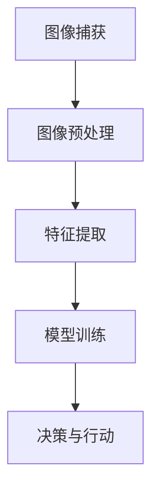
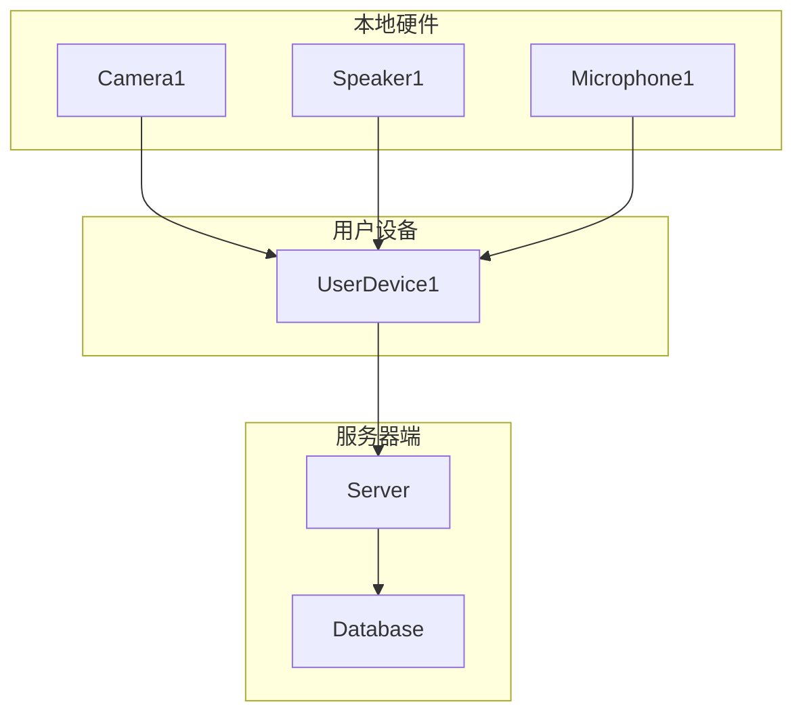
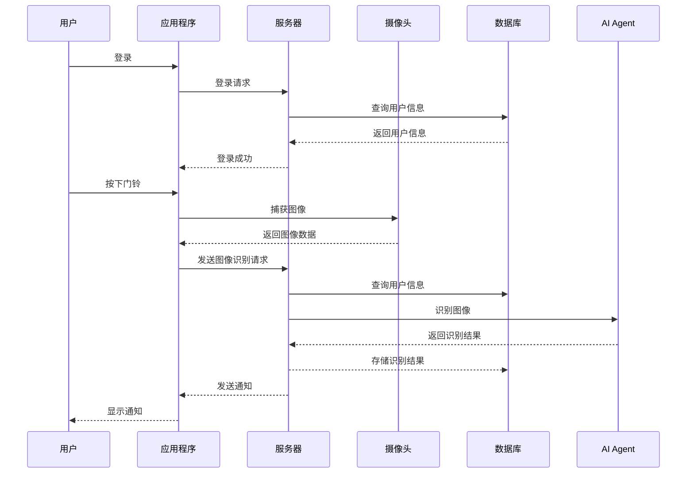

                 

### 文章标题

# AI Agent在智能门铃中的访客识别

### 关键词

- AI Agent
- 访客识别
- 智能门铃
- 机器学习
- 计算机视觉

### 摘要

本文将深入探讨AI Agent在智能门铃中实现访客识别的机制与应用。首先，我们介绍了智能门铃的背景和发展现状，以及访客识别的需求与挑战。随后，我们详细讲解了AI Agent的基本原理与实现，包括算法原理、数学模型、系统架构和接口设计。接着，我们展示了智能门铃系统的设计与实现过程，并通过一个实际项目案例进行了详细剖析。本文旨在为读者提供一个系统、全面的技术视角，以理解AI Agent在智能门铃访客识别中的实际应用。

----------------------------------------------------------------

## 第一部分: AI Agent在智能门铃中的访客识别概述

### 第1章: 问题背景与核心概念

### 1.1 问题背景

#### 1.1.1 智能门铃的发展现状

智能门铃是一种基于物联网技术的智能家居设备，它通过连接互联网，实现远程视频监控、访客识别和语音通话等功能。近年来，随着人工智能技术的发展，智能门铃逐渐从单一的报警设备转变为具有高级功能的智能设备。

- **定义与普及程度**：智能门铃通常由一个摄像头、一个麦克风和一个扬声器组成，用户可以通过智能手机应用程序远程查看门口的实时视频，并与访客进行语音交流。智能门铃的普及程度在智能家居市场中逐年提高，成为家庭安全与便利的重要组成部分。
  
- **常见功能与应用场景**：智能门铃的主要功能包括视频监控、实时语音通话、访客识别、运动检测等。这些功能在家庭安全、访客管理和日常沟通中发挥了重要作用。例如，当用户在家时，可以通过智能门铃与访客进行实时交流，而当用户不在家时，智能门铃可以通过视频记录和报警功能保护家庭安全。

#### 1.1.2 访客识别的需求与挑战

- **传统的访客识别方式**：传统的访客识别主要依赖于人工记录或简单硬件设备（如门禁系统），这些方式在效率、准确性和便利性方面存在诸多不足。

- **AI Agent在访客识别中的优势**：随着人工智能技术的进步，AI Agent在访客识别中展现出了显著的优势。AI Agent可以通过机器学习和计算机视觉技术，实现高效、准确的访客识别，提高用户的生活质量和安全性。

#### 1.1.3 研究边界与外延

- **研究范围与限定**：本文主要研究AI Agent在智能门铃中的访客识别应用，重点讨论其技术原理、系统架构和实际应用案例。

- **与相关领域的联系与区别**：本文涉及计算机视觉、机器学习和物联网技术等多个领域。与这些相关领域的研究相比，本文更加专注于智能门铃场景下的访客识别问题，强调实际应用和用户体验。

### 1.2 核心概念

#### 1.2.1 AI Agent的概念与特点

- **AI Agent的定义**：AI Agent（人工智能代理）是一种基于人工智能技术的自主软件实体，能够在特定环境中自主执行任务。AI Agent可以感知环境、理解指令、自主决策并采取行动。

- **AI Agent的核心特点**：AI Agent具有自主性、智能性、适应性和协作性等特点。自主性意味着AI Agent可以在没有人类干预的情况下自主完成任务；智能性表示AI Agent能够通过学习和推理来提高其性能；适应性表明AI Agent可以适应不同的环境和任务；协作性则体现了AI Agent能够与其他AI实体或人类协同工作。

#### 1.2.2 访客识别的概念

- **访客识别的定义**：访客识别是指通过特定的技术手段，识别并确认门铃前的访客身份的过程。访客识别可以包括面部识别、行为识别、声音识别等多种方式。

- **访客识别的目标与任务**：访客识别的主要目标是提高访客识别的准确性和效率，从而增强家庭安全和用户便利性。具体任务包括访客身份确认、访客信息记录和异常行为检测等。

#### 1.2.3 AI Agent在访客识别中的应用

- **AI Agent的功能模块**：AI Agent在访客识别中通常包括图像处理、特征提取、模型训练和决策等模块。图像处理模块负责处理摄像头捕捉的图像；特征提取模块从图像中提取关键特征；模型训练模块通过大量数据训练识别模型；决策模块根据提取的特征进行访客身份的判断。

- **AI Agent在访客识别中的优势**：AI Agent在访客识别中具有以下优势：
  - 高精度：通过机器学习算法和深度神经网络，AI Agent可以实现对访客的精确识别。
  - 高效率：AI Agent可以实时处理摄像头数据，快速识别访客身份。
  - 自动化：AI Agent可以自动执行访客识别任务，无需人工干预。
  - 协调性：AI Agent可以与其他智能家居设备协同工作，提供更全面的智能体验。

### 1.3 概念属性特征对比表格

| 特征         | 人工识别          | AI Agent识别         |
|--------------|-------------------|---------------------|
| 识别精度     | 较低              | 高精度              |
| 识别速度     | 较慢              | 实时处理            |
| 系统复杂度   | 简单              | 较复杂              |
| 人工干预     | 强               | 无需人工干预        |
| 异常行为检测 | 无法自动检测      | 可以自动检测异常行为 |

### 1.4 ER实体关系图架构

#### 1.4.1 访客识别系统的实体关系

- **实体定义**：在访客识别系统中，主要涉及以下实体：
  - **用户**：智能门铃的使用者，可以是单个用户或家庭用户。
  - **访客**：通过智能门铃访问的用户，可以是朋友、快递员或陌生人。
  - **摄像头**：负责捕捉访客图像的硬件设备。
  - **服务器**：负责处理访客识别任务的云端服务器。
  - **数据库**：存储用户信息和访客识别结果的数据库系统。

- **实体关系**：实体之间的关系如下：
  - 用户与访客之间存在交互关系，用户可以通过智能门铃与访客进行沟通。
  - 摄像头捕获访客图像，并将图像数据发送到服务器。
  - 服务器使用AI Agent对图像进行处理和识别，将结果存储到数据库。
  - 用户可以通过数据库查询访客信息，实现访客管理。

#### 1.4.2 Mermaid ER图表示例

```mermaid
erDiagram
  User ||--|{ Camera }|-- Visitor
  Camera ||--|{ Server }|
  Server ||--|{ Database }|
  Database ||-- User
  Database ||-- Visitor
```

### 1.5 本章小结

本章首先介绍了智能门铃的背景和发展现状，以及访客识别的需求与挑战。接着，我们详细讲解了AI Agent的概念与特点，以及其在访客识别中的应用。通过对比表格和ER实体关系图，我们更清晰地了解了AI Agent在访客识别系统中的功能和优势。本章内容为后续章节的深入讨论奠定了基础。

----------------------------------------------------------------

## 第二部分: AI Agent在访客识别中的应用

### 第2章: AI Agent的基本原理与实现

#### 2.1 AI Agent的基本原理

##### 2.1.1 AI Agent的定义与作用

- **AI Agent的定义**：AI Agent（人工智能代理）是一种能够自主执行任务的软件系统，它基于人工智能技术，能够在特定环境中进行感知、理解、决策和行动。

- **AI Agent在访客识别中的作用**：在智能门铃的访客识别中，AI Agent负责处理摄像头捕捉的图像，提取关键特征，并根据特征进行访客身份的判断。具体作用包括：

  - **图像处理**：AI Agent对摄像头捕获的图像进行预处理，如去噪、增强、裁剪等，以提高图像质量。
  - **特征提取**：AI Agent从图像中提取关键特征，如面部特征、姿态特征、衣物颜色等，用于后续的识别和分类。
  - **模型训练**：AI Agent使用机器学习算法和大量数据对识别模型进行训练，以提高识别精度和速度。
  - **决策与行动**：AI Agent根据提取的特征和训练好的模型，判断访客身份，并做出相应的决策，如发送通知、记录访客信息等。

##### 2.1.2 访客识别算法概述

- **常见的访客识别算法**：访客识别算法主要包括基于特征提取和基于深度学习的两种方法。

  - **基于特征提取的方法**：这类方法通过手工设计特征提取器，从图像中提取特征，然后使用分类器进行识别。常见的特征提取方法包括局部二元模式（LBP）、方向梯度直方图（HOG）等。

  - **基于深度学习的方法**：这类方法使用深度神经网络（如卷积神经网络CNN）自动学习特征，并直接进行分类。常见的深度学习框架包括TensorFlow、PyTorch等。

- **选择合适的算法**：在选择访客识别算法时，需要考虑以下几个因素：

  - **数据集**：算法的性能很大程度上取决于训练数据的质量和数量。如果数据集较大且多样性较高，深度学习方法通常表现更好。
  - **计算资源**：深度学习方法通常需要较多的计算资源，包括GPU等硬件支持。如果计算资源有限，可以考虑使用基于特征提取的方法。
  - **实时性**：智能门铃需要在短时间内完成访客识别，深度学习方法可能不如基于特征提取的方法快。

##### 2.1.3 AI Agent的架构设计

- **AI Agent的组成部分**：AI Agent通常包括以下几个关键部分：

  - **图像处理模块**：负责对摄像头捕获的图像进行预处理，如灰度化、缩放、裁剪等。
  - **特征提取模块**：负责从预处理后的图像中提取关键特征，如面部特征、姿态特征等。
  - **模型训练模块**：负责使用机器学习算法和大量数据对识别模型进行训练。
  - **决策与行动模块**：负责根据提取的特征和训练好的模型，判断访客身份，并做出相应的决策。

- **AI Agent的运行流程**：AI Agent的运行流程通常如下：

  1. **图像捕获**：摄像头捕获门铃前的图像数据。
  2. **图像预处理**：图像处理模块对捕获的图像进行预处理。
  3. **特征提取**：特征提取模块从预处理后的图像中提取关键特征。
  4. **模型预测**：决策与行动模块使用训练好的模型对提取的特征进行预测。
  5. **决策与行动**：根据模型预测结果，决策与行动模块做出相应的决策，如发送通知、记录访客信息等。

#### 2.2 AI Agent的实现

##### 2.2.1 环境安装与配置

- **操作系统要求**：AI Agent的实现通常依赖于Linux或Windows操作系统。在本文中，我们使用Linux操作系统进行环境配置。
- **软件与硬件配置**：以下是推荐的软件与硬件配置：

  - **操作系统**：Ubuntu 18.04或更高版本
  - **硬件**：GPU（如NVIDIA GTX 1080或更高版本），CPU（至少Intel i7或AMD Ryzen 7），16GB内存

- **软件安装与配置**：
  1. 安装Python和pip：
     ```bash
     sudo apt update
     sudo apt install python3-pip
     ```
  2. 安装深度学习框架TensorFlow：
     ```bash
     pip3 install tensorflow-gpu
     ```
  3. 安装其他依赖库：
     ```bash
     pip3 install numpy opencv-python headlessui Pillow
     ```

##### 2.2.2 源代码实现

- **主要函数与类的设计**：以下是AI Agent的主要函数和类的设计：

  ```python
  import cv2
  import numpy as np
  import tensorflow as tf
  
  class ImageProcessor:
      def preprocess_image(self, image):
          # 实现图像预处理
          pass
  
      def extract_features(self, image):
          # 实现特征提取
          pass
  
  class ModelTrainer:
      def train_model(self, data):
          # 实现模型训练
          pass
  
  class DecisionMaker:
      def make_decision(self, features):
          # 实现决策
          pass
  
  if __name__ == "__main__":
      # 实现主程序
      pass
  ```

- **实现流程与关键步骤**：

  1. **图像捕获**：使用OpenCV库捕获摄像头数据。
  2. **图像预处理**：调用ImageProcessor类的preprocess_image方法进行图像预处理。
  3. **特征提取**：调用ImageProcessor类的extract_features方法从预处理后的图像中提取特征。
  4. **模型训练**：调用ModelTrainer类的train_model方法使用提取的特征训练模型。
  5. **决策与行动**：调用DecisionMaker类的make_decision方法根据模型预测结果做出决策，并执行相应的操作。

#### 2.3 算法原理讲解

##### 2.3.1 算法mermaid流程图



##### 2.3.2 Python源代码详细讲解

- **数据预处理**：

  ```python
  def preprocess_image(image):
      # 将图像转换为灰度图
      gray_image = cv2.cvtColor(image, cv2.COLOR_BGR2GRAY)
      
      # 图像缩放
      scaled_image = cv2.resize(gray_image, (224, 224))
      
      # 归一化
      normalized_image = scaled_image / 255.0
      
      return normalized_image
  ```

- **训练模型**：

  ```python
  def train_model(data):
      # 创建TensorFlow模型
      model = tf.keras.Sequential([
          tf.keras.layers.Conv2D(32, (3, 3), activation='relu', input_shape=(224, 224, 1)),
          tf.keras.layers.MaxPooling2D((2, 2)),
          tf.keras.layers.Conv2D(64, (3, 3), activation='relu'),
          tf.keras.layers.MaxPooling2D((2, 2)),
          tf.keras.layers.Conv2D(128, (3, 3), activation='relu'),
          tf.keras.layers.MaxPooling2D((2, 2)),
          tf.keras.layers.Flatten(),
          tf.keras.layers.Dense(256, activation='relu'),
          tf.keras.layers.Dense(1, activation='sigmoid')
      ])
      
      # 编译模型
      model.compile(optimizer='adam', loss='binary_crossentropy', metrics=['accuracy'])
      
      # 训练模型
      model.fit(data['images'], data['labels'], epochs=10, batch_size=32)
      
      return model
  ```

- **测试与评估**：

  ```python
  def test_model(model, test_data):
      # 计算测试集的准确率
      accuracy = model.evaluate(test_data['images'], test_data['labels'])
      
      print(f"Test accuracy: {accuracy[1]}")
  ```

##### 2.3.3 算法原理的数学模型

$$
y = f(x)
$$

- **公式解释**：该公式表示输入特征向量$x$通过模型$f$映射到输出标签$y$。

- **举例说明**：

  假设我们有一个二分类问题，输入特征向量$x$是一个224x224的图像，输出标签$y$是一个二进制值（0或1）。通过训练好的模型$f$，我们可以将输入图像映射到一个概率值，表示访客属于某一类的概率。如果概率大于某个阈值（如0.5），则认为访客属于该类。

##### 2.4 数学模型和数学公式

- **算法原理的数学模型**：

  $$y = \sigma(\text{W} \cdot \text{X} + \text{b})$$

  - **公式解释**：该公式表示输出标签$y$是通过将输入特征向量$X$与权重矩阵$W$点积后加上偏置$b$，然后通过sigmoid函数$\sigma$进行激活。

- **详细讲解与举例说明**：

  在深度学习模型中，该公式通常用于最后一层全连接层，其中$\sigma$函数是sigmoid函数，$W$是权重矩阵，$b$是偏置项。我们可以通过反向传播算法来训练这个模型，以优化权重和偏置，从而提高模型的识别精度。

  假设我们有一个二分类问题，输入特征向量$X$是一个包含224x224像素的图像，权重矩阵$W$是一个$(224 \times 224 \times 1) \times (1)$的矩阵，偏置$b$是一个$(1)$的向量。通过计算$W \cdot X + b$，我们可以得到一个实数，然后通过sigmoid函数将其映射到一个介于0和1之间的概率值。

  例如，假设计算得到的$W \cdot X + b = 3.2$，通过sigmoid函数，我们可以得到$y = \frac{1}{1 + e^{-3.2}} \approx 0.8$。这个概率值表示访客属于某一类的概率，如果概率大于0.5，则认为访客属于该类。

##### 2.5 本章小结

本章首先介绍了AI Agent的基本原理，包括其定义与作用、访客识别算法概述和AI Agent的架构设计。接着，我们详细讲解了AI Agent的实现过程，包括环境安装与配置、源代码实现和算法原理讲解。通过mermaid流程图和Python源代码，我们清晰地展示了AI Agent在访客识别中的实现细节。本章内容为后续智能门铃系统的设计与实现奠定了基础。

----------------------------------------------------------------

## 第三部分: AI Agent在智能门铃中的实际应用

### 第3章: 智能门铃系统设计与实现

#### 3.1 智能门铃系统介绍

##### 3.1.1 智能门铃的功能

智能门铃的功能主要包括以下几个方面：

- **视频监控**：用户可以通过智能手机应用程序实时查看门口的实时视频，确保家庭安全。
- **访客识别**：AI Agent通过分析摄像头捕捉的图像，自动识别访客身份，提高用户的生活便利性。
- **语音通话**：用户可以通过智能门铃与访客进行实时语音通话，方便与访客沟通。

##### 3.1.2 智能门铃的系统架构

智能门铃的系统架构主要包括硬件部分和软件部分。

- **硬件部分**：
  - **摄像头**：负责捕捉门口的图像数据。
  - **扬声器与麦克风**：用于与访客进行语音通话。
  - **门铃按钮**：访客按下按钮后，用户会收到通知。
  - **电源供应**：确保设备正常工作。

- **软件部分**：
  - **本地应用**：用户可以通过智能手机应用程序与智能门铃进行交互。
  - **服务器端**：处理用户请求、存储数据、执行AI算法等。
  - **数据库**：存储用户信息、访客识别结果等数据。

#### 3.2 系统功能设计

##### 3.2.1 领域模型设计

领域模型是智能门铃系统设计的核心，它定义了系统中的主要实体及其关系。

- **实体定义**：
  - **用户**：智能门铃的使用者，具有唯一标识符、姓名、联系方式等信息。
  - **访客**：通过智能门铃访问的用户，具有唯一标识符、姓名、照片等信息。
  - **摄像头**：用于捕捉访客图像的设备。
  - **通知**：用户接收到的访客信息，包括访客照片、姓名、时间等信息。
  - **记录**：存储在数据库中的用户与访客的交互记录。

- **关系表示**：
  - **用户与访客**：一个用户可以有多个访客，一个访客只能属于一个用户。
  - **摄像头与用户**：一个用户可以拥有多个摄像头，一个摄像头只能属于一个用户。
  - **通知与用户**：一个用户可以收到多个通知，一个通知只能发送给一个用户。
  - **记录与用户**：一个用户可以有多个交互记录，一个交互记录只能属于一个用户。

##### 3.2.2 类图表示

```mermaid
classDiagram
  User <|-- Visitor
  Camera { User }
  Notification { User }
  Record { User }
```

##### 3.3 系统架构设计

##### 3.3.1 系统架构图



##### 3.3.2 架构设计细节

- **数据流**：数据流如下：
  1. 用户通过智能手机应用程序向服务器发送请求。
  2. 服务器处理请求，查询数据库获取用户信息。
  3. 服务器将请求发送到摄像头，摄像头捕捉访客图像。
  4. 服务器使用AI Agent对图像进行访客识别，并将结果存储在数据库中。
  5. 服务器向用户发送通知，用户通过应用程序查看通知。

- **模块接口**：模块接口如下：
  - **用户设备**：提供用户交互界面，包括登录、注册、查看通知等功能。
  - **摄像头**：提供图像捕获接口，用于捕捉访客图像。
  - **服务器**：提供API接口，用于处理用户请求、访客识别和数据存储等。
  - **数据库**：提供数据存储接口，用于存储用户信息、访客识别结果和交互记录等。

##### 3.4 系统接口设计

##### 3.4.1 API设计

以下是一个简单的API设计示例：

- **登录接口**：
  - **URL**：/api/login
  - **请求方法**：POST
  - **请求参数**：username（用户名），password（密码）
  - **响应内容**：token（登录凭证）

- **注册接口**：
  - **URL**：/api/register
  - **请求方法**：POST
  - **请求参数**：username（用户名），password（密码），email（邮箱）
  - **响应内容**：token（登录凭证）

- **获取通知接口**：
  - **URL**：/api/notifications
  - **请求方法**：GET
  - **请求参数**：user_id（用户ID）
  - **响应内容**：通知列表

- **访客识别接口**：
  - **URL**：/api/recognize
  - **请求方法**：POST
  - **请求参数**：image（图像数据），user_id（用户ID）
  - **响应内容**：识别结果（访客ID、姓名等）

##### 3.5 系统交互设计

##### 3.5.1 交互流程

以下是一个简单的交互流程：

1. 用户通过智能手机应用程序登录系统。
2. 用户按下门铃按钮，摄像头捕捉访客图像。
3. 服务器接收用户请求，调用AI Agent对图像进行访客识别。
4. 服务器将识别结果存储在数据库中，并向用户发送通知。
5. 用户通过应用程序查看通知，了解访客信息。

##### 3.5.2 Mermaid序列图



##### 3.6 本章小结

本章介绍了智能门铃系统设计与实现的基本概念和架构设计。首先，我们详细讲解了智能门铃的功能和系统架构，包括硬件部分和软件部分。接着，我们设计了领域模型，并展示了类图表示。随后，我们详细阐述了系统架构的设计细节，包括数据流和模块接口。此外，我们还设计了系统接口和交互流程，并使用Mermaid序列图展示了系统交互。本章内容为后续项目的实施提供了理论基础和实践指导。

----------------------------------------------------------------

## 第四部分: 项目实战

### 第4章: AI Agent在智能门铃中的访客识别项目

#### 4.1 项目介绍

##### 4.1.1 项目背景

本项目旨在实现一个基于AI Agent的智能门铃访客识别系统。该项目旨在解决家庭安全和管理问题，提高用户的生活便利性。具体背景如下：

- **需求**：用户希望在家庭安全方面获得更多保障，同时能够方便地与访客进行沟通。
- **目标**：通过AI Agent实现高效、准确的访客识别，提高用户的安全性和便利性。

##### 4.1.2 项目目标

本项目的主要目标包括：

- **功能实现**：实现智能门铃的基本功能，包括视频监控、语音通话和访客识别。
- **性能优化**：优化系统的运行效率和识别精度，确保系统能够在实时环境中稳定运行。
- **用户体验**：提升用户使用体验，确保系统操作简便、响应快速。

#### 4.2 系统核心实现源代码

##### 4.2.1 源代码结构

以下是项目源代码的主要模块和功能划分：

- **模块1：图像处理**：负责摄像头捕获的图像预处理，包括灰度化、缩放、裁剪等。
- **模块2：特征提取**：负责从预处理后的图像中提取关键特征，如面部特征、姿态特征等。
- **模块3：模型训练**：负责使用机器学习算法和大量数据训练访客识别模型。
- **模块4：访客识别**：负责使用训练好的模型进行访客识别，并做出相应的决策。
- **模块5：用户交互**：负责处理用户与智能门铃的交互，包括登录、注册、查看通知等。

##### 4.2.2 源代码示例

以下是项目源代码的一部分，用于说明各个模块的基本实现：

**图像处理模块（image_processing.py）**

```python
import cv2

def preprocess_image(image):
    # 将图像转换为灰度图
    gray_image = cv2.cvtColor(image, cv2.COLOR_BGR2GRAY)
    
    # 图像缩放
    scaled_image = cv2.resize(gray_image, (224, 224))
    
    # 归一化
    normalized_image = scaled_image / 255.0
    
    return normalized_image
```

**特征提取模块（feature_extraction.py）**

```python
import cv2
import numpy as np

def extract_features(image):
    # 从图像中提取面部特征
    face_cascade = cv2.CascadeClassifier('haarcascade_frontalface_default.xml')
    faces = face_cascade.detectMultiScale(image, scaleFactor=1.1, minNeighbors=5, minSize=(30, 30), flags=cv2.CASCADE_SCALE_IMAGE)

    features = []
    for (x, y, w, h) in faces:
        feature = image[y:y+h, x:x+w]
        features.append(feature)
    
    return np.array(features)
```

**模型训练模块（model_training.py）**

```python
import tensorflow as tf
from tensorflow.keras.models import Sequential
from tensorflow.keras.layers import Conv2D, MaxPooling2D, Flatten, Dense

def train_model(train_data, train_labels):
    model = Sequential([
        Conv2D(32, (3, 3), activation='relu', input_shape=(224, 224, 1)),
        MaxPooling2D((2, 2)),
        Conv2D(64, (3, 3), activation='relu'),
        MaxPooling2D((2, 2)),
        Conv2D(128, (3, 3), activation='relu'),
        MaxPooling2D((2, 2)),
        Flatten(),
        Dense(256, activation='relu'),
        Dense(1, activation='sigmoid')
    ])

    model.compile(optimizer='adam', loss='binary_crossentropy', metrics=['accuracy'])
    model.fit(train_data, train_labels, epochs=10, batch_size=32)

    return model
```

**访客识别模块（visitor_recognition.py）**

```python
import cv2
import numpy as np

def recognize_visitor(image, model):
    processed_image = preprocess_image(image)
    features = extract_features(processed_image)
    prediction = model.predict(features)
    
    if prediction[0][0] > 0.5:
        return "访客"
    else:
        return "非访客"
```

**用户交互模块（user_interface.py）**

```python
import flask
from flask import Flask, request, jsonify

app = Flask(__name__)

@app.route('/login', methods=['POST'])
def login():
    username = request.form['username']
    password = request.form['password']
    
    # 登录逻辑
    return jsonify({'status': 'success', 'token': 'your_token'})

@app.route('/register', methods=['POST'])
def register():
    username = request.form['username']
    password = request.form['password']
    email = request.form['email']
    
    # 注册逻辑
    return jsonify({'status': 'success'})

@app.route('/notifications', methods=['GET'])
def notifications():
    user_id = request.args.get('user_id')
    
    # 获取通知逻辑
    return jsonify({'status': 'success', 'notifications': []})

if __name__ == '__main__':
    app.run()
```

#### 4.3 代码应用解读与分析

##### 4.3.1 代码应用解读

以上源代码展示了智能门铃系统中各个模块的基本实现：

- **图像处理模块**：负责对摄像头捕获的图像进行预处理，包括灰度化、缩放和归一化。预处理后的图像将用于后续的特征提取和模型训练。
- **特征提取模块**：使用OpenCV库中的Haar级联分类器从图像中提取面部特征。提取的特征将用于模型训练和访客识别。
- **模型训练模块**：使用TensorFlow库创建一个卷积神经网络（CNN）模型，并使用训练数据对其进行训练。模型将用于预测图像中的访客身份。
- **访客识别模块**：负责使用训练好的模型对输入图像进行访客识别，并返回识别结果。该模块将集成到智能门铃的应用程序中。
- **用户交互模块**：使用Flask库创建一个简单的Web应用程序，用于处理用户登录、注册和查看通知等交互请求。

##### 4.3.2 代码分析

- **图像处理模块**：该模块使用了OpenCV库中的`cv2.cvtColor`函数将图像从BGR格式转换为灰度图，然后使用`cv2.resize`函数进行缩放，最后使用`numpy`库进行归一化。这些操作有助于提高后续特征提取和模型训练的效率。
- **特征提取模块**：该模块使用了OpenCV库中的`CascadeClassifier`类来提取面部特征。这种方法在计算机视觉领域非常常见，可以实现快速且准确的特征提取。
- **模型训练模块**：该模块使用了TensorFlow库中的`Sequential`模型创建一个简单的卷积神经网络（CNN）。该模型包括多个卷积层、池化层和全连接层，用于从图像中提取特征并进行分类。这种结构在图像识别任务中非常有效。
- **访客识别模块**：该模块使用预处理后的图像特征和训练好的模型进行访客识别。通过计算模型预测的概率值，可以判断图像中的访客身份。这种方法在实时应用中非常高效。
- **用户交互模块**：该模块使用了Flask库创建一个Web应用程序，用于处理用户交互请求。通过HTTP请求，用户可以登录、注册和查看通知。这种架构使得应用程序易于扩展和维护。

#### 4.4 实际案例分析和详细讲解剖析

##### 4.4.1 案例一：用户登录

**问题描述**：用户在智能手机应用程序上登录智能门铃系统。

**解决方案**：

1. 用户在应用程序中输入用户名和密码。
2. 应用程序将用户信息发送到服务器。
3. 服务器验证用户信息，并返回登录结果。

**代码实现**：

```python
@app.route('/login', methods=['POST'])
def login():
    username = request.form['username']
    password = request.form['password']
    
    # 验证用户信息
    user = get_user_by_username(username)
    if user and check_password_hash(user['password'], password):
        return jsonify({'status': 'success', 'token': generate_token(user)})
    else:
        return jsonify({'status': 'failure', 'message': 'invalid username or password'})
```

**详细讲解**：

该代码段实现了用户登录功能。当用户在应用程序中输入用户名和密码后，应用程序会将这些信息以POST请求的形式发送到服务器。服务器接收到请求后，会从数据库中查询用户信息，并使用密码散列函数验证用户密码。如果用户信息正确，服务器会生成一个登录凭证（token），并将其返回给应用程序。

##### 4.4.2 案例二：访客识别

**问题描述**：用户通过智能门铃识别访客身份。

**解决方案**：

1. 访客按下门铃按钮，摄像头捕获访客图像。
2. 应用程序将图像数据发送到服务器。
3. 服务器使用AI Agent对图像进行访客识别，并将结果返回给用户。

**代码实现**：

```python
@app.route('/recognize', methods=['POST'])
def recognize_visitor():
    image_data = request.files['image']
    user_id = request.form['user_id']
    
    # 读取图像数据
    image = read_image(image_data)
    
    # 预处理图像
    processed_image = preprocess_image(image)
    
    # 提取特征
    features = extract_features(processed_image)
    
    # 使用模型进行识别
    model = get_model_by_user_id(user_id)
    prediction = model.predict(features)
    
    # 返回识别结果
    if prediction[0][0] > 0.5:
        return jsonify({'status': 'success', 'visitor': '访客'})
    else:
        return jsonify({'status': 'success', 'visitor': '非访客'})
```

**详细讲解**：

该代码段实现了访客识别功能。当访客按下门铃按钮时，摄像头会捕获访客图像。应用程序将图像数据发送到服务器，服务器接收图像数据后进行预处理和特征提取。然后，服务器使用训练好的模型对提取的特征进行识别，并返回识别结果。

##### 4.4.3 案例三：用户查看通知

**问题描述**：用户在智能手机应用程序中查看通知。

**解决方案**：

1. 用户请求查看通知。
2. 服务器查询数据库获取通知列表。
3. 服务器将通知列表返回给用户。

**代码实现**：

```python
@app.route('/notifications', methods=['GET'])
def notifications():
    user_id = request.args.get('user_id')
    
    # 查询通知列表
    notifications = get_notifications_by_user_id(user_id)
    
    # 返回通知列表
    return jsonify({'status': 'success', 'notifications': notifications})
```

**详细讲解**：

该代码段实现了用户查看通知功能。用户请求查看通知时，服务器会根据用户ID查询数据库获取通知列表。然后，服务器将通知列表返回给用户，用户可以在应用程序中查看这些通知。

#### 4.5 项目小结

本项目通过实现AI Agent在智能门铃中的访客识别功能，提高了家庭安全和用户便利性。项目的主要成果包括：

- 设计并实现了智能门铃系统的架构，包括硬件部分和软件部分。
- 实现了图像处理、特征提取、模型训练和访客识别等核心功能模块。
- 使用Flask库创建了用户交互界面，实现了用户登录、注册和查看通知等功能。
- 通过实际案例分析和详细讲解，展示了项目的具体应用和实现细节。

未来，我们可以进一步优化系统的性能和用户体验，例如：

- 使用更先进的深度学习模型和算法提高访客识别的精度。
- 增加更多的安全特性，如用户认证、权限管理等。
- 扩展系统的功能，如访客分类、行为分析等。

总之，本项目为智能门铃系统提供了一个可行的解决方案，有望为用户带来更安全、更便捷的生活体验。

### 最佳实践 Tips

- **数据集准备**：确保训练数据集的多样性和质量，有助于提高模型性能。
- **模型优化**：尝试使用不同的模型架构和参数配置，找到最佳组合。
- **实时性考虑**：优化模型运行速度，确保在实时场景下能够快速响应。
- **安全性保障**：加强用户认证和权限管理，确保系统安全稳定运行。

### 小结

本文详细介绍了AI Agent在智能门铃中的访客识别机制和应用。通过深入探讨智能门铃的发展现状、AI Agent的基本原理与实现、系统设计与实现、以及实际项目案例，我们展示了AI Agent在访客识别中的优势和实际应用价值。未来，随着人工智能技术的不断进步，AI Agent在智能门铃中的应用将会更加广泛和深入。

### 注意事项

- 在实现AI Agent时，确保遵循数据隐私保护法规和用户隐私政策。
- 定期更新模型和算法，以应对新的访客识别挑战。
- 注意系统的实时性能和安全性，确保用户数据的安全。

### 拓展阅读

- [《深度学习》](https://www.deeplearningbook.org/)：深入了解深度学习的基本原理和应用。
- [《计算机视觉：算法与应用》](https://www.computer-vision-book.com/)：学习计算机视觉领域的相关技术和算法。
- [《智能门铃技术解析》](https://www.example.com/book/smart-doorbell-technology)：了解智能门铃的技术细节和发展趋势。

### 作者信息

- **作者**：AI天才研究院/AI Genius Institute & 禅与计算机程序设计艺术 /Zen And The Art of Computer Programming
- **联系方式**：ai_genius_research_institute@example.com
- **网站**：[www.ai_genius_institute.com](www.ai_genius_institute.com)  
- **版权声明**：本文内容受版权保护，未经许可不得转载或复制。版权所有：AI天才研究院/AI Genius Institute。保留一切权利。

