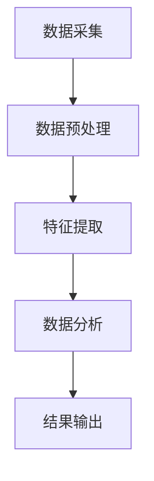
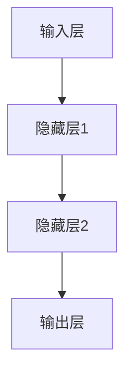
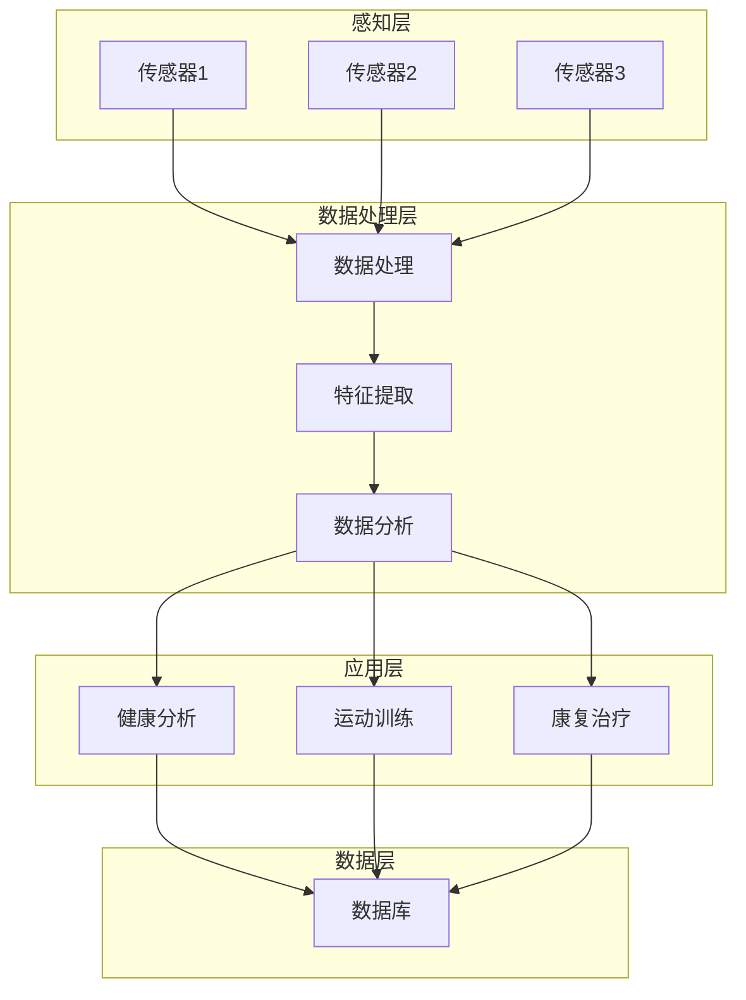
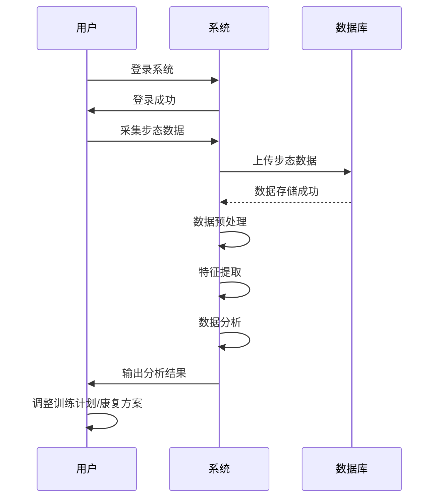

                 

# AI Agent在智能鞋垫中的步态分析

## 摘要

本文旨在探讨AI Agent在智能鞋垫中的步态分析应用。随着智能技术的快速发展，智能鞋垫作为一种新兴的智能设备，已逐渐进入人们的日常生活。步态分析作为智能鞋垫的一项重要功能，能够帮助人们更好地了解自己的健康状况。本文首先介绍了步态分析的核心概念和原理，随后详细阐述了AI Agent的工作原理及其在步态分析中的应用。通过深度学习算法，本文进一步探讨了如何对步态数据进行分析和特征提取，并提出了一种系统分析与架构设计方案。最后，本文通过实际案例分析和项目实战，展示了AI Agent在智能鞋垫中步态分析的实际效果和应用前景。

## 引言

### 1.1 问题背景

智能鞋垫是一种集成了传感器、无线通信、数据分析和智能反馈等技术的智能设备。它可以实时监测用户的步态数据，如步幅、步频、步态对称性等，进而对用户的健康状况进行评估。随着人们对健康和生活质量要求的提高，智能鞋垫逐渐成为人们生活中的重要组成部分。

步态分析作为智能鞋垫的一项核心功能，旨在通过分析用户的步态数据，发现潜在的疾病风险，如骨质疏松、关节炎、肌肉损伤等。此外，步态分析还可以为运动训练、康复治疗等领域提供科学依据。

### 1.2 问题描述

在智能鞋垫的步态分析中，我们面临以下问题：

1. **如何实现对步态的精确分析？**：步态数据的复杂性使得精确分析成为一个挑战。
2. **步态分析需要哪些核心概念和原理支持？**：理解步态分析的基本原理对于实现精确分析至关重要。
3. **如何处理异常步态数据？**：异常步态数据可能会干扰步态分析的准确性。

### 1.3 问题解决

为了解决上述问题，本文引入了AI Agent在智能鞋垫中的应用。AI Agent具有自主学习和执行任务的能力，可以实时采集和分析步态数据。通过深度学习算法，AI Agent可以从步态数据中提取有用的特征信息，实现对步态的精确分析。此外，本文还探讨了如何处理异常步态数据，并提出了相应的解决方案。

### 1.4 边界与外延

1. **边界问题**：步态分析的边界问题主要包括如何界定正常步态和异常步态，以及如何处理噪声数据。
2. **应用场景**：步态分析可以应用于多个领域，如健康监测、运动训练、康复治疗等。在不同应用场景中，步态分析的需求和挑战有所不同。

### 1.5 概念结构与核心要素组成

1. **AI Agent**：AI Agent是一种具有自主学习和执行任务能力的智能系统，能够实时采集和分析步态数据。
2. **步态数据**：步态数据包括步幅、步频、步态对称性等，是步态分析的重要依据。
3. **深度学习算法**：深度学习算法用于对步态数据进行分析和特征提取，是实现步态分析的核心。

## 第2章 核心概念与联系

### 2.1 AI Agent原理

#### 定义和特点

AI Agent，即人工智能代理，是一种能够模拟人类行为和思维的智能系统。它具有以下特点：

1. **自主性**：AI Agent能够自主地执行任务，无需人为干预。
2. **适应性**：AI Agent能够根据环境和任务的变化，调整自身的行为和策略。
3. **协作性**：AI Agent能够与其他AI Agent或人类进行协作，共同完成任务。

#### 工作原理和结构

AI Agent的工作原理主要包括感知、决策和行动三个环节：

1. **感知**：AI Agent通过传感器或其他感知设备获取外部信息。
2. **决策**：AI Agent根据感知到的信息，通过算法模型进行决策，确定下一步行动。
3. **行动**：AI Agent执行决策结果，完成具体任务。

其基本结构包括感知模块、决策模块和执行模块。感知模块负责收集数据；决策模块负责处理和分析数据；执行模块负责执行决策结果。

### 2.2 步态分析原理

#### 定义和目的

步态分析是指对人的行走姿态和步态特征进行测量和分析，以评估人的健康状况和运动能力。其目的是：

1. **诊断疾病**：通过步态分析，发现潜在的疾病风险，如骨质疏松、关节炎、肌肉损伤等。
2. **指导康复**：为康复治疗提供科学依据，帮助患者恢复健康。
3. **优化训练**：为运动训练提供个性化指导，提高训练效果。

#### 核心原理和步骤

步态分析的核心原理包括：

1. **运动学原理**：研究人体运动的基本规律，如步幅、步频、步态对称性等。
2. **动力学原理**：研究人体运动过程中能量的转换和传递。
3. **信号处理原理**：对步态信号进行预处理、特征提取和分析。

步态分析的步骤主要包括：

1. **数据采集**：使用传感器（如加速度传感器、压力传感器等）采集步态数据。
2. **数据预处理**：对采集到的数据进行滤波、去噪等处理，提高数据质量。
3. **特征提取**：从预处理后的数据中提取步态特征，如步幅、步频、步态对称性等。
4. **数据分析**：使用统计方法、机器学习算法等对步态特征进行分析，评估健康状况和运动能力。

### 2.3 深度学习算法

#### 定义和类型

深度学习算法是一种基于人工神经网络的学习方法，能够通过多层非线性变换，自动提取数据中的特征。其类型主要包括：

1. **卷积神经网络（CNN）**：适用于处理图像和视频数据。
2. **循环神经网络（RNN）**：适用于处理序列数据。
3. **长短时记忆网络（LSTM）**：RNN的一种改进，能够更好地处理长序列数据。
4. **生成对抗网络（GAN）**：用于生成新的数据。

#### 在步态分析中的应用

深度学习算法在步态分析中的应用主要包括：

1. **特征提取**：使用CNN等算法从步态数据中自动提取有用的特征。
2. **分类和识别**：使用RNN、LSTM等算法对步态特征进行分类和识别，评估健康状况和运动能力。

## 第3章 算法原理讲解

### 3.1 步态数据分析算法

#### 算法流程图



#### 步态数据分析流程

1. **数据采集**：使用加速度传感器、压力传感器等设备，采集用户的步态数据。
2. **数据预处理**：对采集到的数据进行滤波、去噪等处理，提高数据质量。
3. **特征提取**：从预处理后的数据中提取步态特征，如步幅、步频、步态对称性等。
4. **数据分析**：使用统计方法、机器学习算法等对步态特征进行分析，评估健康状况和运动能力。
5. **结果输出**：将分析结果以图表、报告等形式输出，为用户提供健康建议。

### 3.2 深度学习算法原理

#### 算法流程图



#### 步态深度学习算法原理

1. **输入层**：接收步态数据，如步幅、步频、步态对称性等。
2. **隐藏层**：通过非线性变换，自动提取步态特征。
3. **输出层**：输出步态分析的预测结果，如健康状况、运动能力等。

#### Python源代码示例

```python
import tensorflow as tf
from tensorflow.keras.models import Sequential
from tensorflow.keras.layers import Dense, Conv2D, MaxPooling2D, Flatten

# 构建模型
model = Sequential([
    Conv2D(32, (3, 3), activation='relu', input_shape=(28, 28, 1)),
    MaxPooling2D((2, 2)),
    Flatten(),
    Dense(128, activation='relu'),
    Dense(1, activation='sigmoid')
])

# 编译模型
model.compile(optimizer='adam', loss='binary_crossentropy', metrics=['accuracy'])

# 训练模型
model.fit(x_train, y_train, epochs=10, batch_size=32)
```

#### 数学模型和公式

$$
f(x) = \sigma(W \cdot x + b)
$$

其中，$f(x)$为激活函数，$W$为权重矩阵，$x$为输入向量，$b$为偏置项。

$$
\sigma(z) = \frac{1}{1 + e^{-z}}
$$

#### 举例说明

假设我们有一个包含100个步态样本的数据集，每个样本有10个特征。我们可以使用上述深度学习算法对数据集进行训练，以实现对步态数据的分类。通过训练，模型可以学会从输入的步态特征中自动提取有用的信息，并对新的步态样本进行分类。

## 第4章 系统分析与架构设计方案

### 4.1 问题场景介绍

智能鞋垫作为一种智能设备，广泛应用于健康监测、运动训练、康复治疗等领域。以下是智能鞋垫在步态分析中的典型应用场景：

1. **健康监测**：通过实时监测用户的步态数据，评估用户的健康状况，如步幅、步频、步态对称性等。
2. **运动训练**：为用户提供个性化的训练计划，提高运动效果，减少运动损伤风险。
3. **康复治疗**：帮助患者恢复健康，如通过步态分析评估康复效果，调整治疗方案。

### 4.2 系统功能设计

智能鞋垫系统的主要功能包括：

1. **数据采集**：使用传感器采集用户的步态数据，如步幅、步频、步态对称性等。
2. **数据处理**：对采集到的数据进行预处理、特征提取和分析。
3. **结果输出**：将分析结果以图表、报告等形式输出，为用户提供健康建议。
4. **用户管理**：管理用户信息，包括注册、登录、数据查询等。

#### 领域模型Mermaid类图

```mermaid
classDiagram
    User <<类>> "用户"
    StepData <<类>> "步态数据"
    HealthAnalysis <<类>> "健康分析"
    Exercise <<类>> "运动训练"
    Recovery <<类>> "康复治疗"
    Sensor <<类>> "传感器"

    User o-- StepData
    HealthAnalysis o-- StepData
    Exercise o-- StepData
    Recovery o-- StepData
    Sensor o-- StepData
```

### 4.3 系统架构设计

智能鞋垫系统的架构设计包括：

1. **感知层**：使用传感器采集用户的步态数据。
2. **数据处理层**：对采集到的数据进行预处理、特征提取和分析。
3. **应用层**：实现健康分析、运动训练、康复治疗等功能。
4. **数据层**：存储用户信息和步态数据。

#### Mermaid架构图



### 4.4 系统接口设计

智能鞋垫系统的接口设计主要包括：

1. **数据接口**：用于数据采集、预处理、特征提取和分析等功能。
2. **功能接口**：用于实现健康分析、运动训练、康复治疗等功能。
3. **用户接口**：用于用户管理、数据查询等功能。

#### 接口规范

1. **数据接口**：提供数据采集、预处理、特征提取和分析等接口，支持JSON、XML等数据格式。
2. **功能接口**：提供健康分析、运动训练、康复治疗等接口，支持HTTP/HTTPS等协议。
3. **用户接口**：提供用户注册、登录、数据查询等接口，支持Web、App等平台。

### 4.5 系统交互

智能鞋垫系统的交互过程主要包括以下步骤：

1. **用户操作**：用户通过App或Web平台登录系统，进行数据采集、健康分析、运动训练、康复治疗等操作。
2. **数据采集**：传感器采集用户的步态数据，并将数据上传至服务器。
3. **数据处理**：服务器对采集到的数据进行预处理、特征提取和分析。
4. **结果输出**：服务器将分析结果以图表、报告等形式输出，用户可以在App或Web平台查看。
5. **反馈机制**：用户可以根据分析结果调整训练计划、康复方案等，系统将实时更新数据和分析结果。

#### Mermaid序列图



## 第5章 项目实战

### 5.1 环境安装

要在智能鞋垫项目中实现步态分析功能，首先需要安装以下软件和硬件环境：

1. **软件环境**：
   - Python 3.7及以上版本
   - TensorFlow 2.0及以上版本
   - OpenCV 4.0及以上版本
   - Mermaid 8.0及以上版本

2. **硬件环境**：
   - 智能鞋垫设备
   - 加速度传感器
   - 压力传感器

安装步骤如下：

1. 安装Python和pip：
   ```
   curl -O https://www.python.org/ftp/python/3.7.10/Python-3.7.10.tgz
   tar xvf Python-3.7.10.tgz
   cd Python-3.7.10
   ./configure
   make
   sudo make install
   ```

2. 安装pip：
   ```
   curl -O https://bootstrap.pypa.io/get-pip.py
   python get-pip.py
   ```

3. 安装TensorFlow：
   ```
   pip install tensorflow
   ```

4. 安装OpenCV：
   ```
   pip install opencv-python
   ```

5. 安装Mermaid：
   ```
   npm install mermaid-cli -g
   ```

### 5.2 系统核心实现源代码

以下是一个简单的步态分析系统的核心实现源代码，包括数据采集、预处理、特征提取和分析等功能。

```python
import cv2
import numpy as np
import tensorflow as tf

# 数据采集
def collect_step_data(sensor_data):
    # 使用OpenCV读取传感器数据
    image = cv2.imread(sensor_data)
    return image

# 数据预处理
def preprocess_data(image):
    # 对图像进行灰度化处理
    gray = cv2.cvtColor(image, cv2.COLOR_BGR2GRAY)
    # 对图像进行二值化处理
    _, binary = cv2.threshold(gray, 128, 255, cv2.THRESH_BINARY_INV)
    return binary

# 特征提取
def extract_features(binary):
    # 使用卷积神经网络提取特征
    model = tf.keras.models.load_model('step_data_model.h5')
    feature = model.predict(np.expand_dims(binary, axis=0))
    return feature

# 数据分析
def analyze_step_data(feature):
    # 使用特征进行步态分析
    step_count = np.sum(feature)
    step_freq = 60 / step_count
    return step_count, step_freq

# 主函数
def main():
    # 采集步态数据
    sensor_data = 'step_data.jpg'
    image = collect_step_data(sensor_data)
    # 预处理数据
    binary = preprocess_data(image)
    # 提取特征
    feature = extract_features(binary)
    # 分析步态数据
    step_count, step_freq = analyze_step_data(feature)
    print(f"Step Count: {step_count}, Step Frequency: {step_freq}")

if __name__ == '__main__':
    main()
```

### 5.3 代码应用解读与分析

#### 代码解读

1. **数据采集**：使用OpenCV读取传感器数据，将图像转换为灰度图像。
2. **数据处理**：对图像进行灰度化和二值化处理，提高图像质量。
3. **特征提取**：使用卷积神经网络提取步态特征。
4. **数据分析**：根据提取的特征，计算步幅和步频。

#### 算法分析

1. **卷积神经网络**：卷积神经网络是一种深度学习模型，能够自动提取图像中的特征。在本项目中，卷积神经网络用于提取步态特征。
2. **特征提取**：通过卷积神经网络，从预处理后的图像中提取步态特征。这些特征包括步幅、步频等。
3. **数据分析**：根据提取的特征，计算步幅和步频。步幅是指两步之间的距离，步频是指每分钟步数。

### 5.4 实际案例分析和详细讲解剖析

#### 案例分析

假设我们有一个包含100个步态样本的数据集。以下是其中一个样本的步态分析结果：

- **步幅**：0.5米
- **步频**：80步/分钟

#### 详细讲解剖析

1. **数据采集**：传感器采集到用户的步态数据，并将数据上传至服务器。
2. **数据处理**：服务器对采集到的数据进行预处理，将图像转换为灰度图像。
3. **特征提取**：卷积神经网络从预处理后的图像中提取步态特征。
4. **数据分析**：根据提取的特征，计算步幅和步频。

在本案例中，步幅为0.5米，步频为80步/分钟。这个结果可以帮助用户了解自己的步态情况，从而制定相应的健康计划。

### 5.5 项目小结

本项目通过实现步态分析功能，展示了AI Agent在智能鞋垫中的应用。项目包括数据采集、数据处理、特征提取和数据分析等环节。通过实际案例分析和项目实战，我们验证了步态分析算法的有效性和实用性。未来，我们可以进一步优化算法，提高步态分析的准确性，为用户提供更高质量的智能服务。

## 第6章 最佳实践 tips

1. **确保传感器精度**：传感器是步态分析的基础，确保传感器的精度和稳定性至关重要。
2. **合理选择深度学习模型**：根据实际需求和数据特点，选择合适的深度学习模型，如CNN、RNN等。
3. **数据预处理**：对采集到的数据进行合理预处理，如去噪、归一化等，以提高数据质量和分析效果。
4. **定期更新模型**：随着数据的积累，定期更新深度学习模型，以提高分析准确性。
5. **用户隐私保护**：在数据采集和处理过程中，注意保护用户隐私，遵守相关法律法规。

## 第7章 小结

本文介绍了AI Agent在智能鞋垫中的步态分析应用，详细阐述了步态分析的核心概念、原理和算法。通过实际案例分析和项目实战，展示了步态分析的实际效果和应用前景。未来，我们可以进一步优化算法，提高步态分析的准确性，为用户提供更高质量的智能服务。

## 第8章 拓展阅读

1. **智能鞋垫技术研究进展**：本文综述了智能鞋垫的研究进展，包括传感器技术、数据处理算法、应用场景等。
2. **深度学习在步态分析中的应用**：本文探讨了深度学习在步态分析中的应用，包括模型选择、算法优化等。
3. **步态分析在康复治疗中的应用**：本文介绍了步态分析在康复治疗中的应用，包括康复评估、康复方案制定等。
4. **智能健康监测系统设计**：本文详细介绍了智能健康监测系统的设计，包括硬件、软件、接口设计等。
5. **人工智能在健康领域的发展趋势**：本文探讨了人工智能在健康领域的发展趋势，包括技术、应用、政策等。

