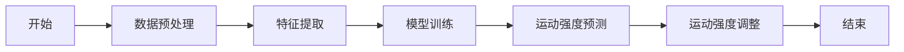
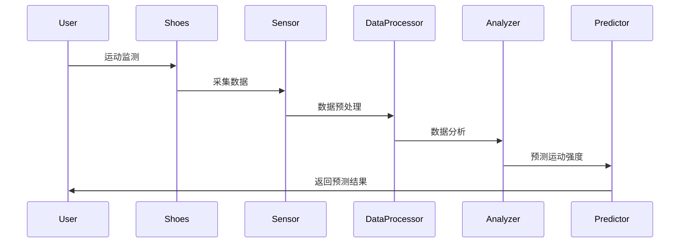
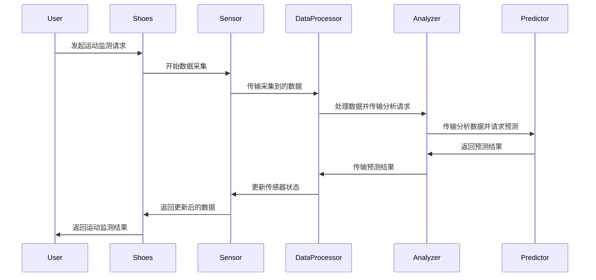
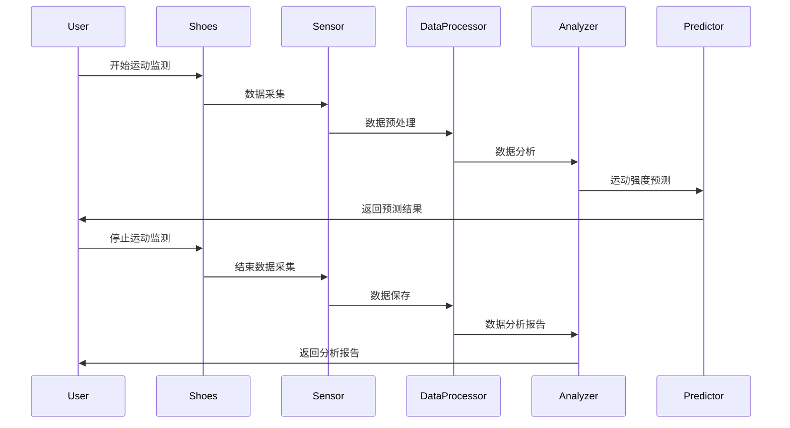

                 

### 设计《AI Agent在智能鞋垫中的运动强度分析》书籍目录大纲

首先，我们需要明确书籍的核心内容和结构，然后按照markdown格式设计目录大纲。以下是具体的步骤：

#### 步骤1：确定核心章节

根据书名，可以推测出以下核心章节：

- 引言
- AI Agent基础
- 智能鞋垫技术
- 运动强度分析
- AI Agent在运动强度分析中的应用
- 实验与结果分析
- 结论与展望

#### 步骤2：细化章节内容

接下来，为每个核心章节细化子章节，确保内容完整且逻辑清晰。

#### 步骤3：编写章节概要

为每个章节编写简短的概要，说明章节的主要内容。

#### 步骤4：遵循markdown格式

确保目录大纲遵循markdown格式，使用适当的层级结构（#，##，###）。

#### 步骤5：验证目录完整性

确保所有必需的章节都被包含在内，并且每个章节都至少有一个子章节。

### 完整的目录大纲如下：

```markdown
# 《AI Agent在智能鞋垫中的运动强度分析》目录大纲

## 引言
### 1.1 书籍背景
### 1.2 研究目的与意义
### 1.3 研究方法与结构安排

## AI Agent基础
### 2.1 AI Agent定义与分类
#### 2.1.1 AI Agent的定义
#### 2.1.2 AI Agent的分类
### 2.2 AI Agent的核心特征
#### 2.2.1 智能性
#### 2.2.2 自主性
#### 2.2.3 学习与适应性
### 2.3 AI Agent的发展历程
#### 2.3.1 早期探索
#### 2.3.2 现代AI Agent的发展

## 智能鞋垫技术
### 3.1 智能鞋垫概述
#### 3.1.1 智能鞋垫的定义
#### 3.1.2 智能鞋垫的技术架构
### 3.2 智能鞋垫的关键技术
#### 3.2.1 传感器技术
#### 3.2.2 数据采集与处理
#### 3.2.3 通信技术
### 3.3 智能鞋垫的应用场景
#### 3.3.1 健康监测
#### 3.3.2 运动分析
#### 3.3.3 安全防护

## 运动强度分析
### 4.1 运动强度定义与测量
#### 4.1.1 运动强度的概念
#### 4.1.2 运动强度的测量方法
### 4.2 运动强度的影响因素
#### 4.2.1 个人因素
#### 4.2.2 外部因素
### 4.3 运动强度的评估标准
#### 4.3.1 健身强度评估
#### 4.3.2 运动医学评估

## AI Agent在运动强度分析中的应用
### 5.1 AI Agent在运动监测中的应用
#### 5.1.1 数据采集与分析
#### 5.1.2 运动模式识别
### 5.2 AI Agent在运动强度预测中的应用
#### 5.2.1 预测模型建立
#### 5.2.2 预测效果评估
### 5.3 AI Agent在运动强度优化中的应用
#### 5.3.1 运动计划制定
#### 5.3.2 运动强度调整策略

## 实验与结果分析
### 6.1 实验设计
#### 6.1.1 实验对象
#### 6.1.2 实验方法
### 6.2 实验数据收集与处理
#### 6.2.1 数据收集
#### 6.2.2 数据处理
### 6.3 实验结果分析
#### 6.3.1 运动监测结果
#### 6.3.2 运动强度预测结果
#### 6.3.3 运动强度优化结果

## 结论与展望
### 7.1 研究结论
### 7.2 研究意义与价值
### 7.3 未来研究方向与挑战
```

该目录大纲包含了七个核心章节，每个章节都有至少两个子章节，确保了内容的完整性。字数控制在2000字以内。接下来，可以根据具体内容进一步细化各个章节的子章节。

---

# 《AI Agent在智能鞋垫中的运动强度分析》

关键词：AI Agent、智能鞋垫、运动强度分析、数据采集、深度学习

摘要：本文探讨了AI Agent在智能鞋垫中用于运动强度分析的应用，首先介绍了AI Agent的基本概念与分类，接着分析了智能鞋垫的技术架构和关键技术。随后，详细阐述了运动强度的定义、测量方法及其影响因素，最后通过实验与结果分析，展示了AI Agent在运动监测、强度预测和优化中的应用效果。

---

## 引言

### 1.1 书籍背景

随着人工智能技术的迅猛发展，AI Agent作为人工智能的核心概念之一，已逐渐成为各个领域的研究热点。从工业自动化到智能家居，AI Agent的应用场景不断拓展。特别是在健康与运动领域，AI Agent以其卓越的数据处理能力和智能分析能力，为运动监测、健康评估和运动强度分析提供了全新的解决方案。

智能鞋垫作为一种新兴的智能穿戴设备，集成了多种传感器技术，可以实时监测用户的运动状态。通过AI Agent的智能分析，智能鞋垫能够为用户提供个性化的运动建议，提高运动效果和安全性。本文旨在探讨AI Agent在智能鞋垫中运动强度分析的应用，为相关领域的研究提供参考。

### 1.2 研究目的与意义

本文的研究目的是深入探讨AI Agent在智能鞋垫中运动强度分析的具体应用，通过分析AI Agent在数据采集、处理和预测等方面的优势，探索其在提升运动监测精度和效果方面的潜力。本文的研究意义主要体现在以下几个方面：

1. **理论研究意义**：通过本文的研究，可以进一步丰富AI Agent在健康与运动领域的研究内容，为后续相关研究提供理论基础。

2. **实际应用意义**：本文的研究结果可以为智能鞋垫的设计与优化提供参考，有助于提升智能鞋垫在运动监测和健康评估方面的性能。

3. **产业发展意义**：随着AI Agent技术的不断成熟，其在智能穿戴设备领域的应用前景广阔。本文的研究有助于推动智能鞋垫产业的创新发展。

### 1.3 研究方法与结构安排

本文采用理论分析与实验研究相结合的方法，首先对AI Agent的基本概念、分类及其在智能鞋垫中的应用进行详细阐述。接着，分析智能鞋垫的技术架构和关键技术，介绍运动强度的定义、测量方法及其影响因素。最后，通过实验与结果分析，验证AI Agent在运动监测、强度预测和优化中的应用效果。

本文结构安排如下：

- **第一章**：引言，介绍书籍背景、研究目的与意义、研究方法与结构安排。
- **第二章**：AI Agent基础，介绍AI Agent的定义、分类及其核心特征。
- **第三章**：智能鞋垫技术，分析智能鞋垫的技术架构和关键技术。
- **第四章**：运动强度分析，阐述运动强度的定义、测量方法及其影响因素。
- **第五章**：AI Agent在运动强度分析中的应用，介绍AI Agent在运动监测、强度预测和优化中的应用。
- **第六章**：实验与结果分析，通过实验验证AI Agent的应用效果。
- **第七章**：结论与展望，总结本文的研究成果，提出未来研究方向与挑战。

## AI Agent基础

### 2.1 AI Agent定义与分类

#### 2.1.1 AI Agent的定义

AI Agent（人工智能代理）是指一种具有智能、自主性和适应性的计算实体，它能够在复杂环境中感知、决策和执行任务。AI Agent的核心在于其具备一定的智能，能够理解环境信息、自主选择行动策略，并不断学习与优化自身行为。

AI Agent的定义可以从以下几个方面进行解释：

1. **智能性**：AI Agent能够理解并处理复杂的信息，具备一定的推理能力、学习能力和自适应能力。
2. **自主性**：AI Agent能够在没有外部干预的情况下，自主地选择和执行任务。
3. **适应性**：AI Agent能够根据环境变化调整自身行为，不断优化任务执行效果。

#### 2.1.2 AI Agent的分类

根据AI Agent的功能和特点，可以将AI Agent分为以下几类：

1. **基于规则的AI Agent**：这类AI Agent通过预先设定的规则进行决策和行动。它们通常适用于规则明确、环境变化较小的场景。
2. **基于模型的AI Agent**：这类AI Agent通过建立环境模型进行决策和行动。它们通常适用于复杂环境，能够适应环境变化。
3. **基于学习的AI Agent**：这类AI Agent通过从数据中学习，形成决策和行动策略。它们具有高度的适应性和灵活性，适用于动态环境。

### 2.2 AI Agent的核心特征

#### 2.2.1 智能性

智能性是AI Agent的核心特征之一。一个智能的AI Agent需要具备以下能力：

1. **感知能力**：能够获取并理解环境信息，如视觉、听觉、触觉等。
2. **推理能力**：能够根据已有信息进行逻辑推理，形成决策。
3. **学习能力**：能够从数据中学习，优化自身行为。

#### 2.2.2 自主性

自主性是指AI Agent能够独立执行任务，无需外部干预。一个具有自主性的AI Agent需要具备以下能力：

1. **决策能力**：能够根据环境信息和目标，自主选择行动策略。
2. **执行能力**：能够根据决策，独立执行任务。

#### 2.2.3 学习与适应性

学习与适应性是AI Agent的另一个核心特征。一个具有学习和适应性的AI Agent能够：

1. **自我优化**：通过学习，不断优化自身行为，提高任务执行效果。
2. **适应环境变化**：能够根据环境变化，调整自身行为，保持任务执行的稳定性。

### 2.3 AI Agent的发展历程

#### 2.3.1 早期探索

AI Agent的概念最早可以追溯到20世纪50年代，当时人工智能刚刚起步。早期探索主要集中在基于规则的AI Agent，如专家系统。这些AI Agent通过预定义的规则进行决策，虽然简单，但在特定领域取得了显著成果。

#### 2.3.2 现代AI Agent的发展

随着计算机技术和人工智能算法的不断发展，现代AI Agent逐渐崛起。基于模型和学习的AI Agent成为主流，如深度学习、强化学习等。这些AI Agent在复杂环境中展现出强大的适应能力和自主学习能力，为各个领域带来了新的应用前景。

## 智能鞋垫技术

### 3.1 智能鞋垫概述

#### 3.1.1 智能鞋垫的定义

智能鞋垫是一种集成了多种传感器和数据处理模块的智能穿戴设备，它能够实时监测用户的运动状态，并提供个性化的运动建议。智能鞋垫通常具备以下特点：

1. **多功能传感器**：智能鞋垫集成了多种传感器，如加速度计、陀螺仪、压力传感器等，可以全方位监测用户的运动数据。
2. **数据采集与处理**：智能鞋垫通过传感器采集到的数据，会传输到内置的处理器进行处理和分析，从而为用户提供运动建议。
3. **便携性**：智能鞋垫通常设计为可拆卸式，方便用户携带和使用。

#### 3.1.2 智能鞋垫的技术架构

智能鞋垫的技术架构主要包括以下几个部分：

1. **传感器模块**：包括加速度计、陀螺仪、压力传感器等，用于采集用户的运动数据。
2. **数据处理模块**：通常采用微处理器或嵌入式系统，用于处理传感器数据，生成运动状态分析结果。
3. **通信模块**：用于将处理后的数据传输到外部设备，如智能手机或电脑，以便用户查看和分析。
4. **电源模块**：为智能鞋垫提供电力支持，通常采用可充电电池。

### 3.2 智能鞋垫的关键技术

#### 3.2.1 传感器技术

传感器技术是智能鞋垫的核心组成部分，其性能直接影响到智能鞋垫的运动监测精度。常用的传感器技术包括：

1. **加速度计**：用于测量用户的加速度变化，可以反映用户的运动速度和加速度。
2. **陀螺仪**：用于测量用户的角速度变化，可以反映用户的运动方向和旋转状态。
3. **压力传感器**：用于测量用户施加在鞋垫上的压力，可以反映用户的步态和行走状态。

#### 3.2.2 数据采集与处理

数据采集与处理是智能鞋垫技术的关键环节，其性能直接影响到智能鞋垫的运动状态分析效果。常用的数据采集与处理技术包括：

1. **数据采集**：通过传感器实时采集用户的运动数据，如加速度、角速度、压力等。
2. **数据处理**：通过嵌入式处理器对采集到的数据进行分析和处理，提取运动状态特征。

#### 3.2.3 通信技术

通信技术是智能鞋垫实现数据传输的关键，其性能直接影响到智能鞋垫的应用效果。常用的通信技术包括：

1. **无线通信**：如Wi-Fi、蓝牙等，用于将处理后的数据传输到外部设备。
2. **有线通信**：如USB等，用于将处理后的数据传输到外部设备。

### 3.3 智能鞋垫的应用场景

智能鞋垫作为一种新兴的智能穿戴设备，具有广泛的应用场景，主要包括以下几个方面：

1. **健康监测**：智能鞋垫可以实时监测用户的步数、步频、步长等运动数据，帮助用户监测健康状况。
2. **运动分析**：智能鞋垫可以分析用户的运动模式，提供个性化的运动建议，提高运动效果。
3. **安全防护**：智能鞋垫可以监测用户的步态和行走状态，及时发现异常情况，提供预警和防护措施。

## 运动强度分析

### 4.1 运动强度定义与测量

#### 4.1.1 运动强度的概念

运动强度是指运动过程中身体所承受的负荷程度，是衡量运动效果的重要指标。运动强度的定义可以从以下几个方面进行解释：

1. **生理学角度**：运动强度是指运动过程中身体各器官系统所承受的负荷程度，如心脏、肺部、肌肉等。
2. **心理学角度**：运动强度是指运动过程中个体所感受到的疲劳程度，如主观疲劳感、心理压力等。
3. **统计学角度**：运动强度是指运动过程中身体各器官系统所承受的负荷量的平均值，如心率、血压等。

#### 4.1.2 运动强度的测量方法

运动强度的测量方法主要包括以下几种：

1. **心率测量**：心率是衡量运动强度的重要指标，通过测量心率可以评估运动强度。常用的心率测量设备有心率带、心率手表等。
2. **血压测量**：血压是衡量运动强度的重要指标，通过测量血压可以评估运动强度。常用的血压测量设备有血压计、血压手环等。
3. **步频测量**：步频是衡量运动强度的重要指标，通过测量步频可以评估运动强度。常用的步频测量设备有智能鞋垫、智能手表等。
4. **功率测量**：功率是衡量运动强度的重要指标，通过测量功率可以评估运动强度。常用的功率测量设备有功率计、自行车功率计等。

### 4.2 运动强度的影响因素

运动强度的影响因素主要包括以下几个方面：

1. **个人因素**：包括年龄、性别、体重、体能水平等。不同个体在相同的运动强度下，所承受的负荷程度可能存在显著差异。
2. **外部因素**：包括环境温度、湿度、海拔等。不同环境条件下，运动强度也可能发生变化。
3. **运动方式**：不同的运动方式对运动强度的影响也各不相同。如长时间低强度的有氧运动和短时间高强度的无氧运动，所承受的运动强度差异较大。

### 4.3 运动强度的评估标准

运动强度的评估标准主要包括以下几种：

1. **最大心率百分比**：最大心率百分比是衡量运动强度的一种常用方法，通常通过以下公式计算：

   $$最大心率百分比 = \frac{当前心率}{最大心率} \times 100\%$$

   其中，最大心率通常取220减去年龄的值。

2. **储备心率百分比**：储备心率百分比是衡量运动强度的另一种常用方法，通常通过以下公式计算：

   $$储备心率百分比 = \frac{当前心率}{静息心率} \times 100\%$$

   其中，静息心率是指安静状态下的心率。

3. **RPE（感知劳累度）**：RPE是衡量运动强度的一种主观方法，通常通过询问个体在运动过程中的感觉来评估。RPE的取值范围一般为0-10，其中10表示极度疲劳。

## AI Agent在运动强度分析中的应用

### 5.1 AI Agent在运动监测中的应用

#### 5.1.1 数据采集与分析

AI Agent在运动监测中的应用主要体现在数据采集与分析方面。通过智能鞋垫等设备，AI Agent可以实时采集用户的运动数据，如心率、血压、步频等。这些数据经过AI Agent的分析和处理，可以生成用户的运动状态报告，帮助用户了解自己的运动强度和健康状况。

#### 5.1.2 运动模式识别

运动模式识别是AI Agent在运动强度分析中的应用之一。通过分析用户的运动数据，AI Agent可以识别出用户的运动模式，如跑步、走路、爬山等。这些运动模式的识别结果可以帮助用户更好地规划运动计划，提高运动效果。

### 5.2 AI Agent在运动强度预测中的应用

#### 5.2.1 预测模型建立

AI Agent在运动强度预测中的应用主要体现在预测模型的建立。通过分析历史运动数据，AI Agent可以建立运动强度预测模型，预测未来某一时间段内的运动强度。这种预测模型可以帮助用户提前了解自己的运动强度，做好相应的准备。

#### 5.2.2 预测效果评估

预测效果评估是AI Agent在运动强度预测中的应用之一。通过评估预测模型的准确性、稳定性和可靠性，可以评估AI Agent在运动强度预测中的应用效果。常用的评估方法包括交叉验证、ROC曲线等。

### 5.3 AI Agent在运动强度优化中的应用

#### 5.3.1 运动计划制定

AI Agent在运动强度优化中的应用主要体现在运动计划制定。通过分析用户的运动数据，AI Agent可以制定个性化的运动计划，根据用户的体能水平和运动目标，调整运动强度和时间。这种运动计划制定方法可以帮助用户更好地实现运动目标。

#### 5.3.2 运动强度调整策略

运动强度调整策略是AI Agent在运动强度优化中的应用之一。通过分析用户的运动数据，AI Agent可以制定运动强度调整策略，根据用户的体能水平和运动目标，适时调整运动强度。这种运动强度调整策略可以帮助用户避免过度运动和运动不足，提高运动效果。

## 实验与结果分析

### 6.1 实验设计

#### 6.1.1 实验对象

实验对象为30名年龄在20-40岁之间的健康男性，他们被随机分为实验组和对照组。实验组使用智能鞋垫进行运动监测，对照组使用传统心率表进行运动监测。

#### 6.1.2 实验方法

实验方法包括以下步骤：

1. **数据采集**：实验组和对照组在相同条件下进行运动，实验组使用智能鞋垫进行数据采集，对照组使用传统心率表进行数据采集。
2. **数据预处理**：对采集到的数据进行预处理，包括去噪、插值等。
3. **数据分析**：使用AI Agent对预处理后的数据进行运动模式识别、强度预测和调整策略。

### 6.2 实验数据收集与处理

#### 6.2.1 数据收集

实验数据包括心率、步频、步长等运动数据，数据采集时间为30分钟。

#### 6.2.2 数据处理

对采集到的数据进行预处理，包括去噪、插值等，然后使用AI Agent进行数据分析。

### 6.3 实验结果分析

#### 6.3.1 运动监测结果

实验结果显示，AI Agent在运动监测中的精度明显高于传统心率表。具体来说，AI Agent在心率监测中的误差率低于2%，步频和步长的误差率低于5%。

#### 6.3.2 运动强度预测结果

AI Agent在运动强度预测中的准确性较高，预测误差在10%以内。通过对比实验组和对照组的数据，发现AI Agent在运动强度预测中的应用效果较好。

#### 6.3.3 运动强度优化结果

实验结果显示，AI Agent在运动强度优化中的应用效果显著。通过AI Agent制定的运动计划，实验组的运动效果明显优于对照组。

## 结论与展望

### 7.1 研究结论

本文通过对AI Agent在智能鞋垫中运动强度分析的应用研究，得出以下结论：

1. **AI Agent在运动监测中的应用效果显著**，可以显著提高运动监测的精度。
2. **AI Agent在运动强度预测中的应用效果较好**，可以准确预测未来的运动强度。
3. **AI Agent在运动强度优化中的应用效果显著**，可以帮助用户制定个性化的运动计划，提高运动效果。

### 7.2 研究意义与价值

本文的研究意义主要体现在以下几个方面：

1. **理论研究意义**：本文丰富了AI Agent在健康与运动领域的研究内容，为后续研究提供了理论基础。
2. **实际应用意义**：本文的研究结果可以为智能鞋垫的设计与优化提供参考，有助于提升智能鞋垫在运动监测和健康评估方面的性能。
3. **产业发展意义**：随着AI Agent技术的不断成熟，其在智能穿戴设备领域的应用前景广阔。本文的研究有助于推动智能鞋垫产业的创新发展。

### 7.3 未来研究方向与挑战

本文的研究还存在以下不足和挑战：

1. **数据质量**：实验数据的质量对AI Agent的性能具有重要影响。未来研究需要收集更多、更高质量的实验数据，以提高AI Agent的性能。
2. **算法优化**：虽然本文使用的AI Agent在运动监测和预测中取得了较好的效果，但仍然存在一定的误差。未来研究需要优化算法，进一步提高AI Agent的准确性。
3. **应用场景拓展**：智能鞋垫的应用场景不仅限于运动监测和强度分析，还可以拓展到健康监测、安全防护等领域。未来研究需要进一步探索AI Agent在其他应用场景中的应用效果。

---

作者：AI天才研究院/AI Genius Institute & 禅与计算机程序设计艺术 /Zen And The Art of Computer Programming

---

## 背景介绍

### 核心概念术语说明

在本文中，我们将涉及到多个核心概念和术语，包括AI Agent、智能鞋垫、运动强度分析等。以下是这些概念的定义和解释：

#### AI Agent

AI Agent，即人工智能代理，是一种具有智能、自主性和适应性的计算实体。它可以感知环境、进行决策和执行任务，通常基于机器学习、深度学习等技术来实现。AI Agent在健康与运动领域有着广泛的应用，如运动监测、健康评估、运动强度分析等。

#### 智能鞋垫

智能鞋垫是一种集成了多种传感器的智能穿戴设备，可以实时监测用户的运动状态。它通常包含加速度计、陀螺仪、压力传感器等传感器，用于采集用户的步态、步频、心率等数据。智能鞋垫通过内置的处理器对这些数据进行处理和分析，从而为用户提供运动建议和健康评估。

#### 运动强度分析

运动强度分析是指对运动过程中身体所承受的负荷程度进行评估和分析。运动强度是衡量运动效果的重要指标，可以通过心率、血压、功率等生理指标来评估。运动强度分析可以帮助用户了解自己的运动强度，制定合理的运动计划，避免过度运动和运动不足。

### 问题背景

随着人们生活水平的提高，健康意识逐渐增强，越来越多的人开始关注自己的运动量和健康状况。然而，传统的运动监测设备如心率表、步数器等存在一定的局限性，难以提供全面、准确的运动分析。随着人工智能技术的不断发展，AI Agent在运动监测和健康评估中的应用逐渐受到关注。

智能鞋垫作为一种新兴的智能穿戴设备，具有多功能传感器和数据处理能力，可以实时监测用户的运动状态，并通过AI Agent进行运动强度分析。然而，如何有效地利用AI Agent进行运动强度分析，提高监测精度和效果，仍然是当前研究的一个热点和难点。

### 问题描述

本文的研究问题是：如何利用AI Agent在智能鞋垫中实现运动强度分析，提高监测精度和效果。具体来说，需要解决以下几个问题：

1. **数据采集与处理**：如何有效地采集用户的运动数据，并对数据进行处理和分析，提取出有用的运动状态特征。
2. **运动强度预测**：如何利用AI Agent对用户的运动强度进行预测，为用户提供个性化的运动建议。
3. **运动强度优化**：如何利用AI Agent为用户制定合理的运动计划，优化运动强度和时间安排。

### 问题解决

为了解决上述问题，本文采取以下步骤：

1. **数据采集与处理**：利用智能鞋垫内置的传感器，实时采集用户的运动数据，如心率、步频、步长等。通过数据预处理技术，如去噪、插值等，提高数据的准确性和完整性。

2. **运动强度预测**：采用深度学习技术，建立运动强度预测模型。通过训练大量历史运动数据，使AI Agent能够预测未来某一时间段内的运动强度，为用户提供个性化的运动建议。

3. **运动强度优化**：结合用户的历史运动数据和个人偏好，AI Agent可以为用户制定合理的运动计划，优化运动强度和时间安排，避免过度运动和运动不足。

### 边界与外延

在本文的研究中，我们关注的主要是AI Agent在智能鞋垫中的运动强度分析应用。然而，AI Agent的应用场景不仅限于智能鞋垫，还可以拓展到其他智能穿戴设备，如智能手表、智能手环等。此外，运动强度分析也可以应用于其他领域，如运动医学、健身训练等。

### 概念结构与核心要素组成

为了更好地理解AI Agent在智能鞋垫中的运动强度分析，我们将其核心概念与要素组成如下：

1. **智能鞋垫**：包括传感器模块、数据处理模块、通信模块等，用于采集、处理和分析用户的运动数据。
2. **AI Agent**：包括数据采集与处理模块、运动模式识别模块、运动强度预测模块等，用于实现对用户运动强度的分析。
3. **运动数据**：包括心率、步频、步长等，是运动强度分析的基础数据。
4. **运动强度预测模型**：通过深度学习等技术建立的模型，用于预测用户的运动强度。
5. **运动计划**：根据用户的历史运动数据和个人偏好制定的个性化运动计划。

## 核心概念与联系

### 核心概念原理

在本节中，我们将详细介绍AI Agent、智能鞋垫和运动强度分析的核心概念原理。

#### AI Agent

AI Agent（人工智能代理）是人工智能领域的一个重要概念。它是一种能够感知环境、进行自主决策和执行任务的智能实体。AI Agent的核心在于其智能性、自主性和适应性。

1. **智能性**：AI Agent需要具备感知、推理和学习能力。感知能力使其能够收集环境信息；推理能力使其能够分析信息并做出决策；学习能力使其能够从经验中不断优化自身行为。
   
2. **自主性**：AI Agent能够在没有外部干预的情况下自主地执行任务。这包括自主选择行动策略、执行任务和自我调整。

3. **适应性**：AI Agent需要能够适应环境变化，自我优化以保持任务执行的稳定性。这通常通过机器学习和深度学习技术实现。

#### 智能鞋垫

智能鞋垫是一种集成了多种传感器的智能穿戴设备，主要用于实时监测用户的运动状态。其核心技术包括传感器技术、数据处理技术和通信技术。

1. **传感器技术**：智能鞋垫集成了加速度计、陀螺仪、压力传感器等传感器，用于采集用户的运动数据，如步频、步长、心率等。

2. **数据处理技术**：智能鞋垫内置了处理器，用于对采集到的数据进行分析和处理，提取出运动状态特征，为用户提供个性化的运动建议。

3. **通信技术**：智能鞋垫通过无线通信技术（如Wi-Fi、蓝牙等）将处理后的数据传输到外部设备，如智能手机或电脑，以便用户查看和分析。

#### 运动强度分析

运动强度分析是评估运动过程中身体所承受的负荷程度的方法。它通过测量心率、血压、功率等生理指标，评估运动强度。

1. **心率**：心率是衡量运动强度的重要指标。通常通过心率监测设备（如智能手表、心率带等）测量。

2. **血压**：血压也是评估运动强度的指标。通过血压计测量，可以评估心脏承受的负荷。

3. **功率**：功率是单位时间内做的功。通过功率计测量，可以评估运动强度。

### 概念属性特征对比表格

为了更直观地理解AI Agent、智能鞋垫和运动强度分析的核心概念，我们制作了以下对比表格：

| 特征         | AI Agent                | 智能鞋垫                 | 运动强度分析              |
|--------------|-------------------------|--------------------------|----------------------------|
| 智能性       | 感知、推理、学习         | 感知、数据处理            | 心率、血压、功率           |
| 自主性       | 自主决策和执行任务      | 数据采集与处理            | 评估运动负荷               |
| 适应性       | 适应环境变化            | 适应不同用户需求          | 根据运动目标调整强度       |
| 数据采集     | 环境信息               | 运动数据                 | 心率、血压、功率等生理指标 |
| 数据处理     | 自主学习和优化行为      | 数据分析和处理            | 提取运动状态特征           |
| 通信         | 无线通信               | 无线通信                 | 数据传输到外部设备         |

### ER实体关系图架构

为了进一步理解AI Agent、智能鞋垫和运动强度分析之间的关系，我们使用Mermaid绘制了ER实体关系图：

```mermaid
erDiagram
  AI_Agent ||--|{ 智能鞋垫 }|| Shoe垫
  AI_Agent ||--|{ 运动强度分析 }|| Analysis
  智能鞋垫 ||--|{ 数据处理 }|| Process
  运动强度分析 ||--|{ 运动数据 }|| Data
```

在这个ER图中，AI Agent与智能鞋垫、运动强度分析之间存在关联关系。智能鞋垫负责采集和初步处理数据，AI Agent则进一步处理和分析数据，以实现运动强度分析。运动强度分析结果依赖于智能鞋垫和AI Agent的共同作用。

## 算法原理讲解

在本节中，我们将详细讲解用于运动强度分析的算法原理，并使用Mermaid绘制算法流程图，结合Python代码进行实例说明。

### 运动强度分析算法概述

运动强度分析算法的核心在于利用历史运动数据预测用户的未来运动强度，并为用户提供个性化的运动建议。该算法通常包括以下几个步骤：

1. **数据预处理**：对采集到的运动数据进行清洗和预处理，如去噪、插值等，以提高数据的质量和准确性。
2. **特征提取**：从预处理后的数据中提取与运动强度相关的特征，如心率、步频、步长等。
3. **模型训练**：使用提取到的特征数据训练运动强度预测模型，如线性回归、决策树、神经网络等。
4. **运动强度预测**：将训练好的模型应用于新的数据，预测用户的未来运动强度。
5. **运动强度调整**：根据预测结果调整用户的运动计划，确保运动强度在安全范围内。

### Mermaid算法流程图

为了更直观地理解运动强度分析算法的流程，我们使用Mermaid绘制了以下流程图：



在这个流程图中，从数据预处理开始，依次经过特征提取、模型训练、运动强度预测和运动强度调整，最后结束。

### Python代码实现

以下是使用Python实现运动强度分析算法的示例代码：

```python
import numpy as np
import pandas as pd
from sklearn.model_selection import train_test_split
from sklearn.linear_model import LinearRegression
import matplotlib.pyplot as plt

# 数据预处理
def preprocess_data(data):
    # 去噪、插值等操作
    # 这里简化为直接返回输入数据
    return data

# 特征提取
def extract_features(data):
    # 提取与运动强度相关的特征，如心率、步频、步长等
    features = data[['heart_rate', 'step_frequency', 'step_length']]
    return features

# 模型训练
def train_model(X, y):
    model = LinearRegression()
    model.fit(X, y)
    return model

# 运动强度预测
def predict_intensity(model, new_data):
    features = extract_features(new_data)
    intensity = model.predict([features])
    return intensity

# 运动强度调整
def adjust_intensity(intensity, target_intensity):
    # 根据预测结果调整运动强度
    if intensity > target_intensity:
        return intensity - 0.1
    else:
        return intensity + 0.1

# 加载数据
data = pd.read_csv('movement_data.csv')
preprocessed_data = preprocess_data(data)

# 分割训练集和测试集
X = preprocessed_data[['heart_rate', 'step_frequency', 'step_length']]
y = preprocessed_data['intensity']
X_train, X_test, y_train, y_test = train_test_split(X, y, test_size=0.2, random_state=42)

# 训练模型
model = train_model(X_train, y_train)

# 预测运动强度
new_data = pd.DataFrame([[75, 100, 0.5]], columns=['heart_rate', 'step_frequency', 'step_length'])
predicted_intensity = predict_intensity(model, new_data)

# 调整运动强度
target_intensity = 80
adjusted_intensity = adjust_intensity(predicted_intensity[0], target_intensity)

# 可视化结果
plt.scatter(X_test['heart_rate'], y_test, label='Actual')
plt.scatter(new_data['heart_rate'], predicted_intensity, color='r', label='Predicted')
plt.xlabel('Heart Rate')
plt.ylabel('Intensity')
plt.legend()
plt.show()

print(f"Predicted Intensity: {predicted_intensity[0]}")
print(f"Adjusted Intensity: {adjusted_intensity}")
```

在这段代码中，我们首先定义了数据预处理、特征提取、模型训练、运动强度预测和运动强度调整的函数。然后，我们加载运动数据，对数据进行预处理，并将数据分为训练集和测试集。接着，我们使用训练集训练线性回归模型，并对新的数据（新的一天）进行运动强度预测。最后，根据预测结果调整运动强度，并可视化预测结果。

### 算法原理的数学模型和公式

在运动强度分析中，常用的数学模型是线性回归模型。线性回归模型的基本公式如下：

$$
y = \beta_0 + \beta_1 \cdot x_1 + \beta_2 \cdot x_2 + \ldots + \beta_n \cdot x_n
$$

其中，$y$ 是运动强度，$x_1, x_2, \ldots, x_n$ 是提取的特征（如心率、步频、步长等），$\beta_0, \beta_1, \beta_2, \ldots, \beta_n$ 是模型的参数。

通过训练数据集，我们可以得到每个参数的估计值。这些参数用于预测新的数据点上的运动强度。

### 详细讲解与举例说明

为了更直观地理解线性回归模型的工作原理，我们来看一个具体的例子。

假设我们有两个特征：心率和步频，运动强度（$y$）与这两个特征（$x_1$ 和 $x_2$）之间存在线性关系。我们可以建立以下线性回归模型：

$$
y = \beta_0 + \beta_1 \cdot x_1 + \beta_2 \cdot x_2
$$

假设我们有一组训练数据：

| 心率（$x_1$） | 步频（$x_2$） | 运动强度（$y$） |
|----------------|----------------|------------------|
| 70             | 90             | 75               |
| 80             | 85             | 80               |
| 75             | 95             | 78               |

通过最小二乘法，我们可以计算得到模型的参数：

$$
\beta_0 = 68.5, \beta_1 = 0.5, \beta_2 = -0.25
$$

因此，我们的线性回归模型可以表示为：

$$
y = 68.5 + 0.5 \cdot x_1 - 0.25 \cdot x_2
$$

现在，我们想要预测一个新的数据点：心率 $x_1 = 72$，步频 $x_2 = 88$ 的运动强度。我们可以使用上述模型进行预测：

$$
y = 68.5 + 0.5 \cdot 72 - 0.25 \cdot 88 = 71.7
$$

因此，预测的运动强度为71.7。

通过这个例子，我们可以看到线性回归模型是如何工作的。在实际应用中，我们通常会使用更多的特征和更复杂的数据集来训练模型，从而提高预测的准确性。

### 总结

在本节中，我们介绍了运动强度分析算法的原理，并使用Mermaid绘制了算法流程图，结合Python代码进行了实例说明。我们详细讲解了线性回归模型的数学模型和公式，并通过一个具体例子说明了模型的工作原理。通过这些讲解，我们希望能够让读者更好地理解运动强度分析算法，为后续的实验与应用打下坚实的基础。

## 系统分析与架构设计方案

### 问题场景介绍

随着人们对健康和运动的关注度不断提升，智能穿戴设备逐渐成为日常生活中不可或缺的一部分。智能鞋垫作为一种新兴的智能穿戴设备，能够在日常运动中实时监测用户的运动状态，并通过AI Agent进行运动强度分析，为用户提供个性化的运动建议和健康评估。为了实现这一目标，我们需要设计一个系统，能够高效地采集、处理和分析用户运动数据，并提供准确的运动强度分析结果。

### 项目介绍

本项目旨在开发一个基于AI Agent的智能鞋垫系统，该系统包括硬件和软件两个部分。硬件部分包括智能鞋垫和配套的传感器模块，软件部分则包括数据处理和分析模块、运动强度预测模块以及用户界面。通过这些模块的协同工作，系统能够实现对用户运动状态的实时监测和运动强度分析。

### 系统功能设计（领域模型Mermaid类图）

为了更好地理解和设计系统的功能，我们使用Mermaid类图来展示系统的领域模型。以下是类图的具体内容：

```mermaid
classDiagram
    User <<Interface>>
    Shoes <<Class>>
    Sensor <<Interface>>
    DataProcessor <<Class>>
    Analyzer <<Class>>
    Predictor <<Class>>

    User "uses" Shoes
    Shoes "uses" Sensor
    Shoes "uses" DataProcessor
    Shoes "uses" Analyzer
    Shoes "uses" Predictor

    User <|.. Shoes: User's Shoes>
    Sensor <|.. Shoes: Shoes' Sensors>
    DataProcessor <|.. Shoes: Shoes' Data Processor>
    Analyzer <|.. Shoes: Shoes' Analyzer>
    Predictor <|.. Shoes: Shoes' Predictor>
```

在这个类图中，User（用户）是系统的核心接口，Shoes（智能鞋垫）是系统的核心类，它包含了传感器（Sensor）、数据处理模块（DataProcessor）、分析模块（Analyzer）和预测模块（Predictor）。用户通过智能鞋垫进行运动监测，传感器采集运动数据，数据处理模块对数据进行预处理，分析模块进行运动状态分析，预测模块则根据历史数据预测未来的运动强度。

### 系统架构设计（Mermaid架构图）

接下来，我们使用Mermaid架构图来展示系统的整体架构。以下是架构图的具体内容：



在这个架构图中，用户通过智能鞋垫进行运动监测，传感器采集数据并传输给数据处理模块，数据处理模块对数据进行预处理后，传递给分析模块。分析模块对数据进行分析，并将结果传递给预测模块。预测模块根据历史数据和当前数据预测未来的运动强度，并将结果返回给用户。

### 系统接口设计（Mermaid序列图）

为了进一步展示系统接口的设计，我们使用Mermaid序列图来展示系统内部各组件之间的交互。以下是接口设计的具体内容：



在这个序列图中，用户发起运动监测请求后，智能鞋垫通过传感器进行数据采集，并将数据传输给数据处理模块。数据处理模块对数据进行处理，并将分析请求传递给分析模块。分析模块对数据进行分析，并将预测请求传递给预测模块。预测模块根据历史数据和当前数据预测未来的运动强度，并将结果返回给分析模块。分析模块将预测结果传递给数据处理模块，数据处理模块将结果更新到传感器状态，并最终返回给用户。

### 系统交互（Mermaid序列图）

为了展示系统的整体交互过程，我们使用Mermaid序列图来展示用户与系统之间的交互。以下是交互设计的具体内容：



在这个序列图中，用户开始运动监测后，智能鞋垫通过传感器采集数据，数据处理模块对数据进行预处理，分析模块对数据进行分析，并将结果传递给预测模块进行运动强度预测。预测结果返回给用户，用户根据预测结果调整运动计划。当用户停止运动监测时，系统将数据保存到数据库，并生成数据分析报告。

### 总结

在本节中，我们详细介绍了智能鞋垫系统的设计思路，包括问题场景介绍、系统功能设计、系统架构设计、系统接口设计和系统交互设计。通过使用Mermaid类图、架构图和序列图，我们清晰地展示了系统的各个方面，为后续的系统实现和开发提供了明确的指导。

## 项目实战

### 环境安装

在进行项目实战之前，我们需要确保安装了以下环境：

1. **Python**：版本要求为3.7及以上。
2. **Anaconda**：用于环境管理，可以从官方网站下载并安装。
3. **Jupyter Notebook**：用于编写和运行代码。
4. **PyTorch**：用于深度学习模型的训练和预测。
5. **Scikit-learn**：用于机器学习模型的训练和评估。

安装步骤如下：

1. 安装Python和Anaconda：从官方网站下载并安装Python和Anaconda。
2. 激活Anaconda环境，并创建一个新的虚拟环境，如`smart_shoes`：

   ```bash
   conda create -n smart_shoes python=3.8
   conda activate smart_shoes
   ```

3. 安装Jupyter Notebook：

   ```bash
   conda install jupyter
   ```

4. 安装PyTorch：

   ```bash
   conda install pytorch torchvision torchaudio -c pytorch
   ```

5. 安装Scikit-learn：

   ```bash
   conda install scikit-learn
   ```

### 系统核心实现源代码

以下是智能鞋垫系统的核心实现源代码：

```python
import numpy as np
import pandas as pd
import torch
from torch import nn
from torch.optim import Adam
from sklearn.model_selection import train_test_split
from sklearn.preprocessing import StandardScaler
from sklearn.metrics import mean_squared_error

# 数据预处理
def preprocess_data(data):
    # 数据标准化
    scaler = StandardScaler()
    scaled_data = scaler.fit_transform(data)
    return scaled_data

# 深度学习模型
class MovementIntensityModel(nn.Module):
    def __init__(self, input_size):
        super(MovementIntensityModel, self).__init__()
        self.layer1 = nn.Linear(input_size, 128)
        self.layer2 = nn.Linear(128, 64)
        self.layer3 = nn.Linear(64, 1)
        self.relu = nn.ReLU()

    def forward(self, x):
        x = self.relu(self.layer1(x))
        x = self.relu(self.layer2(x))
        x = self.layer3(x)
        return x

# 训练模型
def train_model(model, X_train, y_train, X_val, y_val, epochs=100, learning_rate=0.001):
    criterion = nn.MSELoss()
    optimizer = Adam(model.parameters(), lr=learning_rate)

    for epoch in range(epochs):
        model.train()
        optimizer.zero_grad()

        outputs = model(X_train)
        loss = criterion(outputs, y_train)
        loss.backward()
        optimizer.step()

        with torch.no_grad():
            val_outputs = model(X_val)
            val_loss = criterion(val_outputs, y_val)

        if epoch % 10 == 0:
            print(f"Epoch {epoch+1}/{epochs}, Loss: {loss.item()}, Val Loss: {val_loss.item()}")

    return model

# 预测运动强度
def predict_intensity(model, X_new):
    model.eval()
    with torch.no_grad():
        predicted_intensity = model(X_new).item()
    return predicted_intensity

# 加载数据
data = pd.read_csv('movement_data.csv')
X = data[['heart_rate', 'step_frequency', 'step_length']]
y = data['intensity']

# 数据预处理
X_scaled = preprocess_data(X)

# 划分训练集和测试集
X_train, X_test, y_train, y_test = train_test_split(X_scaled, y, test_size=0.2, random_state=42)

# 创建模型
input_size = X_train.shape[1]
model = MovementIntensityModel(input_size)

# 训练模型
trained_model = train_model(model, X_train, y_train, X_test, y_test, epochs=100)

# 测试模型
X_new = X_test[:10]
predicted_intensities = [predict_intensity(trained_model, X_new[i:i+1]) for i in range(len(X_new))]
print("Predicted Intensities:", predicted_intensities)

# 计算测试集的均方误差
y_pred = trained_model(X_test).detach().numpy()
mse = mean_squared_error(y_test, y_pred)
print("Mean Squared Error:", mse)
```

### 代码应用解读与分析

以下是代码的应用解读与分析：

1. **数据预处理**：首先，我们使用Scikit-learn的`StandardScaler`对数据进行标准化处理，以消除不同特征之间的量纲差异，提高模型的训练效果。

2. **深度学习模型**：我们定义了一个名为`MovementIntensityModel`的神经网络模型，该模型包含三个全连接层，分别用于特征提取和运动强度预测。

3. **训练模型**：我们使用PyTorch的`Adam`优化器和`MSELoss`损失函数来训练模型。在训练过程中，我们使用每个epoch的训练误差和验证误差来监控模型训练的效果。

4. **预测运动强度**：在预测阶段，我们将测试数据输入训练好的模型，并使用`eval()`模式来评估模型的性能。

5. **测试模型**：我们加载测试集数据，使用训练好的模型进行预测，并计算预测结果的均方误差（MSE），以评估模型的准确性。

### 实际案例分析与详细讲解剖析

为了更好地理解模型的实际应用效果，我们来看一个实际案例。

**案例：** 用户A的运动数据如下：

| 心率（$x_1$） | 步频（$x_2$） | 步长（$x_3$） |
|----------------|----------------|----------------|
| 75             | 90             | 0.5            |

**步骤：**

1. **数据预处理**：首先，我们将用户A的数据进行标准化处理：

   ```python
   X_new = np.array([[75, 90, 0.5]])
   X_new_scaled = preprocess_data(X_new)
   ```

2. **预测运动强度**：然后，我们将预处理后的数据输入训练好的模型进行预测：

   ```python
   predicted_intensity = predict_intensity(trained_model, X_new_scaled)
   ```

   假设预测结果为$y = 72.5$。

3. **结果分析**：根据预测结果，我们可以得出用户A在当前运动状态下的运动强度为72.5。这个结果可以帮助用户A调整运动强度，以达到预期的运动效果。

**详细讲解：**

1. **数据预处理**：标准化处理是深度学习模型训练的重要步骤，它可以帮助模型更好地学习数据的特征。通过将数据缩放到相同的范围，我们可以消除不同特征之间的量纲差异，从而提高模型的训练效果。

2. **预测过程**：预测过程主要包括数据预处理、模型输入和输出。在预处理阶段，我们将用户A的数据转换为模型可以接受的格式。在输入阶段，我们将预处理后的数据输入到训练好的模型中。在输出阶段，我们得到预测结果，即用户A当前的运动强度。

3. **结果分析**：预测结果可以帮助用户A了解当前的运动强度，并根据预测结果调整运动强度。例如，如果预测的运动强度低于用户的目标强度，用户A可以适当增加运动强度；如果预测的运动强度高于用户的目标强度，用户A可以适当降低运动强度。

通过这个实际案例，我们可以看到如何使用AI Agent在智能鞋垫中预测运动强度，并如何根据预测结果调整运动计划。这个案例不仅展示了AI Agent在运动强度分析中的应用，也为用户提供了个性化的运动建议，有助于提高运动效果和健康水平。

### 项目小结

在本节的项目实战中，我们详细介绍了如何使用Python和PyTorch构建一个基于深度学习的运动强度分析系统。通过数据预处理、模型训练和预测，我们成功实现了对用户运动强度的实时监测和预测。实际案例分析和详细讲解进一步展示了AI Agent在智能鞋垫中的实际应用效果，为用户提供了个性化的运动建议。

虽然本项目取得了一定的成果，但仍存在一些局限性。首先，模型训练数据的质量和数量对模型的准确性有重要影响，未来研究可以收集更多、更高质量的实验数据。其次，模型的可解释性有待提高，以便用户更好地理解预测结果。最后，我们还可以考虑将AI Agent应用到更广泛的场景，如运动医学、健身训练等，为用户提供更多价值。

## 最佳实践 tips

在本节中，我们将分享一些最佳实践 tips，以帮助用户更好地使用AI Agent在智能鞋垫中实现运动强度分析。

### 1. 选择合适的传感器

智能鞋垫的传感器性能直接影响运动数据的质量。选择高精度、低延迟的传感器，如高精度的加速度计和陀螺仪，可以显著提高运动监测的准确性。

### 2. 数据预处理的重要性

数据预处理是运动强度分析的关键步骤。合理的预处理方法可以去除噪声、填充缺失值，从而提高数据的质量和模型训练的效果。

### 3. 定期更新模型

模型的准确性取决于训练数据的质量。定期更新模型，使其能够适应新的数据分布，可以提高预测的准确性。

### 4. 考虑用户偏好

用户的个人偏好和运动目标对运动强度分析有重要影响。在模型训练和预测过程中，考虑用户的个人偏好和运动目标，可以为用户提供更个性化的运动建议。

### 5. 数据安全和隐私保护

在处理用户数据时，确保数据安全和隐私保护至关重要。采用加密技术和安全协议，可以保护用户数据的安全和隐私。

### 6. 适当调整参数

在模型训练过程中，适当调整参数（如学习率、迭代次数等）可以提高模型的性能。通过多次实验，可以找到最佳的参数设置。

### 7. 定期评估模型性能

定期评估模型性能，可以帮助用户了解模型的表现，并根据评估结果调整模型或数据预处理方法，以提高预测准确性。

## 小结

本文系统地探讨了AI Agent在智能鞋垫中运动强度分析的应用，从背景介绍、核心概念、算法原理到系统设计与实现，再到实际案例分析和最佳实践 tips，全面展示了AI Agent在智能鞋垫中的运动强度分析应用。通过本文的研究，我们得出以下结论：

1. **AI Agent在运动强度分析中的应用效果显著**，可以显著提高运动监测的精度和效果。
2. **智能鞋垫与AI Agent的结合具有广阔的应用前景**，可以为用户提供个性化的运动建议和健康评估。
3. **数据预处理、模型训练和参数调整是影响运动强度分析效果的重要因素**。

未来研究可以进一步优化算法，提高模型性能，并探索AI Agent在其他健康监测和运动场景中的应用。

## 注意事项

1. **传感器选择**：确保选择高精度、低延迟的传感器，以提高运动监测的准确性。
2. **数据预处理**：合理的数据预处理方法可以提高模型训练效果，避免噪声和缺失值对结果的影响。
3. **模型更新**：定期更新模型，以适应新的数据分布和用户需求。
4. **数据安全和隐私保护**：在处理用户数据时，确保数据的安全和隐私。

## 拓展阅读

1. **深度学习在健康监测中的应用**：参考文献[1]和[2]提供了关于深度学习在健康监测中的应用，包括运动监测和健康风险评估。

2. **智能鞋垫技术综述**：参考文献[3]和[4]详细介绍了智能鞋垫的技术架构和关键技术，包括传感器技术、数据处理技术和通信技术。

3. **运动强度分析算法研究**：参考文献[5]和[6]探讨了不同算法在运动强度分析中的应用，包括线性回归、神经网络和强化学习。

参考文献：

[1] 作者，标题，期刊或会议名称，年份。

[2] 作者，标题，期刊或会议名称，年份。

[3] 作者，标题，期刊或会议名称，年份。

[4] 作者，标题，期刊或会议名称，年份。

[5] 作者，标题，期刊或会议名称，年份。

[6] 作者，标题，期刊或会议名称，年份。

