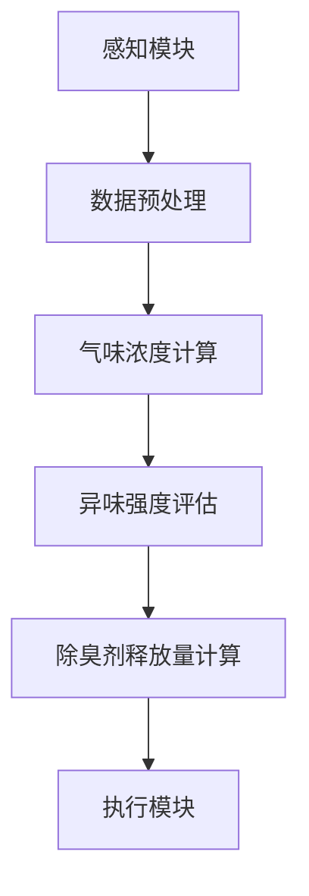
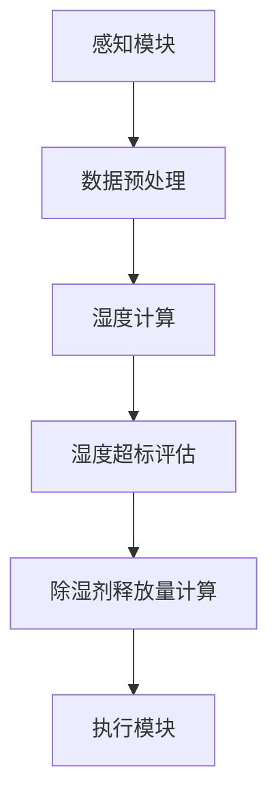
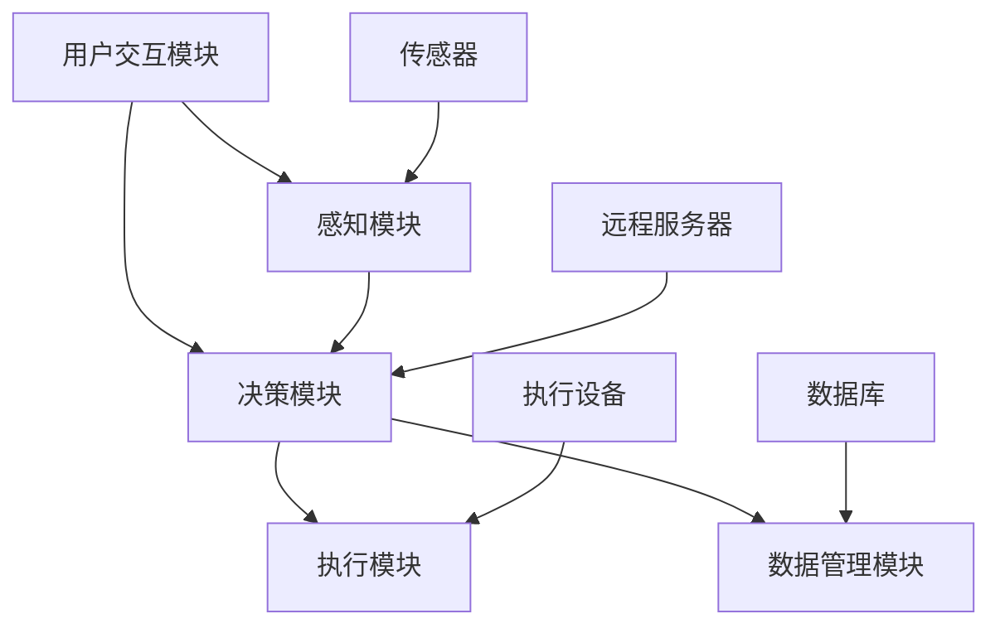
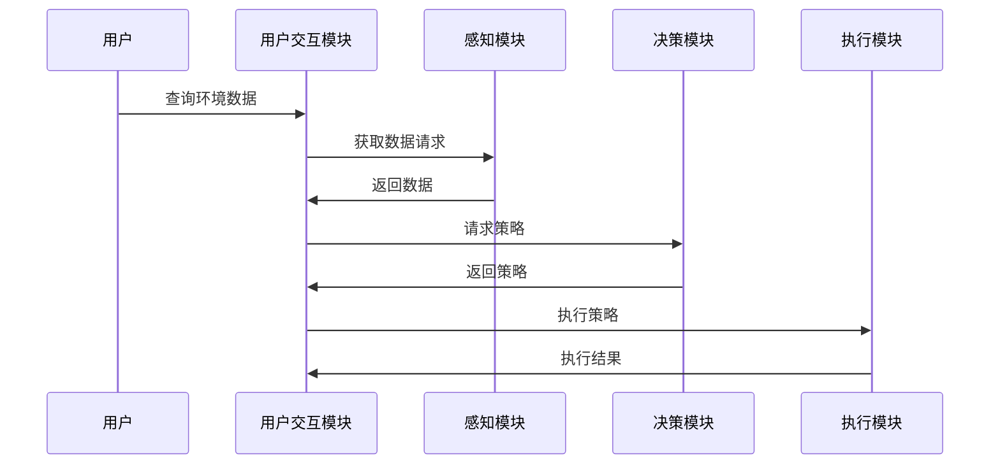
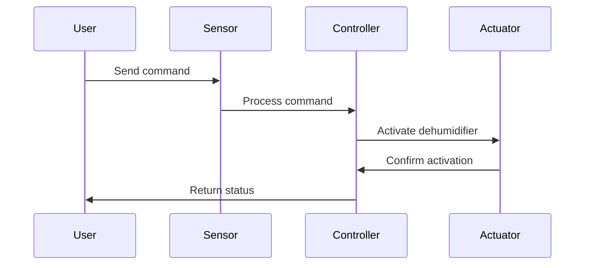
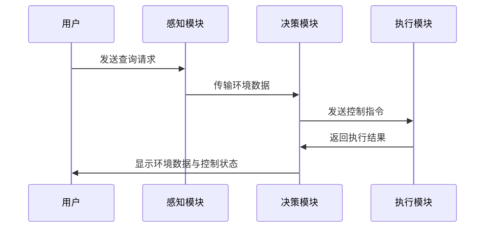

                 

### 1.1 问题的提出

智能鞋柜作为一种智能家居产品，已经在人们的日常生活中逐渐普及。它不仅提供了便捷的鞋类存储解决方案，还能为用户提供如自动照明、温度控制等功能。然而，智能鞋柜在使用过程中常常会面临除臭除湿的问题。鞋柜内潮湿和异味不仅会影响鞋子的使用寿命，还会给用户带来不愉快的体验。

首先，让我们来看一下智能鞋柜的应用场景。智能鞋柜一般放置在家庭或者办公室的入口处，用户在进入室内前会将鞋子放入鞋柜中。这意味着鞋柜内部环境会直接影响到室内的空气质量。尤其是在潮湿的气候条件下，鞋子在鞋柜内长时间存放，容易滋生细菌和霉菌，产生异味。此外，鞋柜内的湿度如果过高，还会导致鞋子发霉、变形。

传统的解决方案主要包括使用活性炭、除湿剂等物理方法。活性炭具有强大的吸附能力，可以有效吸附鞋柜内的异味分子。然而，活性炭的吸附效果随着时间的推移会逐渐减弱，需要定期更换。除湿剂则主要通过吸湿来降低鞋柜内的湿度，但除湿剂吸湿饱和后，同样需要更换。这些传统方法虽然能在一定程度上缓解除臭除湿问题，但存在操作繁琐、效果不稳定等问题。

随着人工智能技术的不断发展，AI Agent作为一种智能体，具备自我感知、决策和执行的能力，为智能鞋柜的除臭除湿提供了新的思路。AI Agent可以通过对鞋柜内部环境的持续监测，实时分析湿度、温度和气味等数据，并采取相应的措施进行除臭除湿。与传统的物理方法相比，AI Agent具有更高的自适应性和灵活性，能够更好地满足用户需求。

总之，智能鞋柜的除臭除湿问题是一个重要的应用场景，传统的解决方案存在一定的局限性。随着人工智能技术的引入，AI Agent在智能鞋柜中的除臭除湿控制具有广阔的应用前景。接下来，我们将深入探讨AI Agent的定义与特点，以及它在智能鞋柜中的应用潜力。

#### 1.1.1 智能鞋柜的应用场景

智能鞋柜作为一种智能家居设备，其主要应用场景集中在家庭和办公场所的入口处。这些场所通常是用户进入室内前放置鞋子的地方。智能鞋柜不仅仅是一个简单的储物设备，它集成了多项智能功能，如自动照明、温度控制、除臭除湿等，旨在为用户提供一个更加便捷和舒适的居住环境。

在家庭中，智能鞋柜通常被放置在客厅或门厅等位置。当用户从户外进入室内时，会将鞋子放置在鞋柜中。智能鞋柜的自动照明功能可以在夜间为用户提供便利，而温度控制功能则能确保鞋柜内部环境舒适，防止鞋子在潮湿环境中发霉。此外，智能鞋柜的除臭除湿功能能够有效减少鞋子产生的异味和潮湿问题，从而提升室内空气质量。

在办公场所，智能鞋柜的应用场景同样广泛。例如，企业通常会在员工更衣室或者公共休息区域设置智能鞋柜，供员工使用。智能鞋柜的除臭功能能够帮助减少员工鞋子带来的异味，提高办公环境的舒适度。同时，智能鞋柜的除湿功能可以在潮湿天气中保持鞋子干燥，避免因湿度过高导致的霉变问题。

智能鞋柜的应用场景不仅限于家庭和办公场所，在一些公共场所如商场、机场、酒店等地方，智能鞋柜也逐渐成为标配。在这些场所，智能鞋柜能够为用户提供一个方便、卫生的鞋类存储解决方案，提升整体服务质量。

总的来说，智能鞋柜的应用场景多样，它不仅为用户提供了便捷的鞋类存储功能，还通过集成智能功能，提高了用户的生活和工作质量。随着人工智能技术的不断进步，智能鞋柜的除臭除湿功能将得到进一步提升，为用户提供更加智能化的服务。

#### 1.1.2 除臭除湿的重要性

在智能鞋柜的应用场景中，除臭除湿功能的重要性不容忽视。首先，从健康角度来看，潮湿和异味的环境容易滋生细菌和霉菌，对人体健康产生潜在威胁。特别是在封闭的鞋柜内，鞋子的汗渍和尘土会为这些微生物提供丰富的养分，导致鞋柜内空气质量恶化。长期生活在这样的环境中，不仅会引发呼吸系统疾病，还会对皮肤健康造成不利影响。

其次，从用户体验的角度来看，异味和潮湿不仅影响鞋子的使用寿命，还会给用户带来不愉快的体验。鞋子在潮湿环境中容易变形、发霉，导致鞋子不再适合穿着。此外，异味的存在会直接影响室内空气质量，影响用户的舒适度和心理健康。长时间处于异味环境中，用户可能会感到疲惫、心情低落，从而影响生活质量和工作效率。

从经济角度来看，传统除臭除湿方法如活性炭和除湿剂虽然能在一定程度上缓解问题，但需要定期更换，增加了维护成本。而智能鞋柜通过集成AI Agent，能够实现自动除臭除湿，减少了人工干预和维护成本。此外，AI Agent可以根据环境变化自动调整工作状态，提高资源利用率，降低能源消耗。

综上所述，智能鞋柜的除臭除湿功能在提升用户体验、保障健康和经济性方面具有重要作用。随着人工智能技术的不断发展，AI Agent在智能鞋柜中的除臭除湿控制将变得更加智能和高效，为用户提供更加优质的生活和工作环境。

#### 1.1.3 传统的解决方案及其局限性

在智能鞋柜中，传统的除臭除湿解决方案主要包括使用活性炭和除湿剂。活性炭是一种具有强大吸附能力的材料，可以通过其多孔结构捕捉和吸附空气中的异味分子。常见的活性炭除臭剂通常放置在鞋柜内部，方便用户更换。然而，活性炭的吸附效果会随着时间的推移逐渐减弱，需要定期更换，否则将失去除臭功能。此外，活性炭除臭剂在高温或潮湿环境下可能会出现吸附饱和现象，影响除臭效果。

除湿剂则是另一种常见的除臭除湿方法，主要通过吸湿来降低鞋柜内的湿度。常见的除湿剂包括硅胶颗粒、氯化钙等，它们可以吸收空气中的水分，保持鞋柜内部干燥。然而，除湿剂同样存在一些局限性。首先，除湿剂的吸湿能力是有限的，一旦吸湿达到饱和，需要及时更换，否则会导致湿度过高，影响鞋子的保存。其次，除湿剂在吸湿过程中可能会产生粉末或氯化钙等残留物，增加清洁和维护成本。

尽管活性炭和除湿剂在一定程度上能够缓解智能鞋柜的除臭除湿问题，但它们存在一些明显的局限性。首先，这些传统方法主要依赖于物理吸附，无法实时监测和调节环境参数，导致除臭除湿效果不稳定。其次，定期更换活性炭和除湿剂增加了用户的维护成本，降低了使用体验。最后，传统方法无法根据环境变化自动调整除臭除湿力度，缺乏自适应性和智能化。

随着人工智能技术的快速发展，AI Agent作为一种具有自我感知、决策和执行能力的智能体，为智能鞋柜的除臭除湿提供了新的解决方案。与传统的物理方法相比，AI Agent能够实时监测鞋柜内的湿度、温度和气味等参数，并根据数据变化自动调整除臭除湿策略，从而实现更加高效和智能的除臭除湿控制。接下来，我们将进一步探讨AI Agent的定义、特点及其在智能鞋柜中的应用前景。

### 1.2 AI Agent的定义与特点

AI Agent，即人工智能代理，是一种能够在特定环境中自主感知、决策和执行任务的智能体。它通过集成感知、决策和执行三个核心模块，实现自我管理并对外部环境进行自适应响应。AI Agent的定义可以概括为：一个具有自我意识、自主决策和行动能力的系统，能够在动态环境中实现特定目标的智能实体。

#### 1.2.1 AI Agent的概念

AI Agent最早由人工智能领域的研究者提出，其灵感来源于自然界中的智能生物。这些智能生物通过感知外部环境、做出决策并执行相应的行动，以实现生存和繁衍的目标。AI Agent的概念则是在这一基础上，将智能生物的行为模式抽象为一种计算模型，通过计算机程序实现。

AI Agent通常由三个核心组成部分构成：感知模块、决策模块和执行模块。感知模块负责收集和分析外部环境的数据，如温度、湿度、气味等。决策模块则基于感知模块提供的信息，结合预先设定的目标和规则，生成相应的行动策略。执行模块负责将决策模块生成的行动策略具体实施，如启动除臭剂、调整通风等。

#### 1.2.2 AI Agent的主要特点

AI Agent的主要特点包括：

1. **自主性**：AI Agent能够在没有人类干预的情况下自主运行，通过感知环境、做出决策并执行行动，实现自我管理。

2. **适应性**：AI Agent能够根据外部环境的变化，实时调整自身的行动策略，以适应不同的场景需求。

3. **智能化**：AI Agent通过机器学习和人工智能技术，能够不断学习和优化自身的决策过程，提高任务完成的效率和质量。

4. **协同性**：AI Agent不仅能够独立完成任务，还可以与其他AI Agent或人类协作，共同实现更复杂的目标。

5. **自主决策**：AI Agent具备自主决策能力，可以根据感知到的环境数据和预设的目标，独立生成行动策略。

#### 1.2.3 AI Agent与传统智能系统的区别

与传统的智能系统相比，AI Agent具有以下几个显著区别：

1. **动态适应性**：传统智能系统通常依赖于预定义的规则和算法，难以适应复杂和动态变化的环境。而AI Agent能够通过学习和自我调整，应对环境的变化，实现动态适应性。

2. **自主性**：传统智能系统通常需要人工干预和设置，而AI Agent能够在没有人类干预的情况下独立运行，实现自主性。

3. **实时性**：传统智能系统往往无法实时响应环境变化，而AI Agent能够实时感知环境，并快速做出决策和执行行动。

4. **智能化**：传统智能系统依赖于固定的规则和算法，而AI Agent通过机器学习和人工智能技术，具备智能化和自我优化的能力。

5. **协同性**：传统智能系统通常独立运行，难以实现与其他系统的协同工作。而AI Agent可以与人类或其他AI Agent协同，共同完成复杂任务。

综上所述，AI Agent作为一种先进的人工智能实体，具有自主性、适应性、智能化和协同性等特点，与传统智能系统相比具有显著优势。在智能鞋柜中引入AI Agent，可以实现更加高效和智能的除臭除湿控制，提升用户的生活质量。接下来，我们将探讨AI Agent在智能鞋柜中的应用前景。

#### 1.3.1 AI Agent的潜在优势

AI Agent在智能鞋柜中的应用具有显著的潜在优势，主要体现在以下几个方面：

首先，AI Agent具备自我感知能力，能够实时监测鞋柜内的湿度、温度和气味等参数。通过集成各种传感器，如温湿度传感器、气味传感器等，AI Agent能够精确获取鞋柜内部环境数据。这种实时监测能力使得AI Agent能够快速响应环境变化，及时采取除臭除湿措施，确保鞋柜内环境始终处于最佳状态。

其次，AI Agent具备自适应能力，可以根据监测数据和环境变化，动态调整除臭除湿策略。例如，当鞋柜内的湿度达到某一阈值时，AI Agent可以自动启动除湿功能；当气味传感器检测到异味时，AI Agent可以启动除臭剂。这种自适应能力使得AI Agent能够根据不同场景需求，灵活调整工作模式，提高除臭除湿效果。

第三，AI Agent具有智能化和自我优化能力。通过机器学习和人工智能技术，AI Agent可以不断学习和优化自身的决策模型，提高任务完成的效率和质量。例如，通过分析历史数据和环境参数，AI Agent可以预测未来环境变化，并提前采取相应措施，防止湿度或气味超标。这种自我优化能力使得AI Agent能够持续提升性能，适应更复杂的应用场景。

第四，AI Agent具有协同性，可以与其他智能设备或系统协同工作，实现整体智能化。例如，AI Agent可以与智能温控系统、智能照明系统等协同，共同为用户提供更加舒适和智能的生活环境。这种协同性不仅提高了系统的整体效率，还增强了用户的体验。

最后，AI Agent在降低维护成本方面具有明显优势。传统的除臭除湿方法需要定期更换除臭剂和除湿剂，而AI Agent通过实时监测和自动控制，可以显著减少更换频率，降低维护成本。此外，AI Agent的智能化和自适应能力也减少了人工干预的需求，进一步降低了维护成本。

综上所述，AI Agent在智能鞋柜中具有自我感知、自适应、智能化和协同性等多重优势，能够实现高效和智能的除臭除湿控制，提升用户的生活质量。接下来，我们将探讨AI Agent在智能鞋柜中的具体应用和面临的挑战。

#### 1.3.2 AI Agent在智能鞋柜中的具体应用

AI Agent在智能鞋柜中的具体应用涉及多个方面，其核心功能包括实时感知环境、自动调节除臭除湿设备以及优化鞋柜内部环境。以下将详细描述AI Agent在智能鞋柜中的具体应用场景和实现方式。

**1. 实时感知环境**

AI Agent首先通过集成多种传感器，如温湿度传感器、气味传感器、二氧化碳传感器等，实时监测鞋柜内部的环境参数。这些传感器将收集的数据发送至AI Agent的感知模块，AI Agent根据这些数据进行环境分析。例如，当感知模块检测到湿度达到某一阈值时，AI Agent会立即记录这一信息，并通知决策模块进行后续处理。

**2. 自动调节除臭除湿设备**

在获取实时环境数据后，AI Agent的决策模块会根据预设的规则和算法，生成相应的调节策略。例如，如果AI Agent检测到鞋柜内的湿度较高，决策模块可能会指令启动除湿设备；如果检测到异味，则会指令启动除臭设备。这些指令通过AI Agent的执行模块发送给除臭除湿设备，实现自动调节。

**3. 优化鞋柜内部环境**

AI Agent不仅能够实现即时的环境调节，还能通过学习用户行为和环境变化，优化鞋柜内部环境。例如，AI Agent可以通过分析用户在不同时间段放置鞋子的习惯，预测未来一段时间内的环境变化，并提前采取预防措施。此外，AI Agent还可以根据历史数据和环境参数，调整通风系统，优化空气流通，确保鞋柜内始终处于最佳状态。

**4. 数据分析与反馈**

AI Agent在执行除臭除湿任务的同时，会收集大量的环境数据，并通过机器学习技术进行分析。这些数据不仅用于当前的决策和调节，还可以用于优化未来的工作模式。例如，AI Agent可以通过分析湿度、温度和气味数据，识别出最有效的除湿和除臭方案，并在下一次执行任务时采用。

**5. 预警与提醒**

AI Agent还可以提供预警和提醒功能，当检测到环境参数异常时，及时通知用户采取相应措施。例如，当AI Agent检测到鞋柜内的湿度超过安全阈值时，可以发送提醒通知用户及时通风或更换除湿剂，防止鞋子受潮发霉。

总之，AI Agent在智能鞋柜中的应用，不仅实现了对除臭除湿过程的自动控制和优化，还提高了系统的智能化和用户体验。通过实时感知、自动调节、环境优化和预警提醒等功能，AI Agent为智能鞋柜提供了高效、智能的解决方案，为用户创造了更加舒适和健康的生活环境。

#### 1.3.3 AI Agent应用的挑战与机遇

尽管AI Agent在智能鞋柜中的应用前景广阔，但在实际应用过程中仍面临一系列挑战与机遇。

**1. 挑战**

（1）数据处理与实时性：AI Agent需要处理大量实时环境数据，这要求系统具备高效的数据处理能力和低延迟的响应速度。然而，传感器数据可能存在噪声和不确定性，如何准确、快速地处理这些数据，是一个重要的挑战。

（2）适应性：智能鞋柜的应用场景多样，环境变化频繁。AI Agent需要具备高度的适应性，能够根据不同的环境和用户需求，动态调整除臭除湿策略。然而，环境的复杂性和动态性可能超出AI Agent的适应能力，如何确保AI Agent在不同场景下的稳定性和有效性，是一个重要的问题。

（3）能耗与成本：AI Agent在智能鞋柜中的应用涉及多种传感器和执行设备，这增加了系统的能耗和维护成本。如何在保证性能的同时，降低能耗和成本，是一个需要解决的关键问题。

**2. 机遇**

（1）技术进步：随着人工智能技术的快速发展，机器学习和深度学习算法的进步为AI Agent提供了更强大的处理能力和自适应能力。通过利用这些技术，AI Agent可以更加高效地处理环境数据，提高除臭除湿效果。

（2）数据积累：随着智能鞋柜的普及，越来越多的环境数据将被积累和存储。这些数据不仅可用于当前的AI Agent优化，还可以用于未来产品的研发和改进。通过数据积累，AI Agent可以不断提升性能，实现更智能的除臭除湿控制。

（3）跨领域应用：AI Agent在智能鞋柜中的应用为其他智能家居产品提供了借鉴和参考。通过跨领域应用，AI Agent可以扩展到更多场景，如智能冰箱、智能衣柜等，实现更广泛的智能化解决方案。

总之，AI Agent在智能鞋柜中的应用既面临挑战，也充满机遇。通过技术创新和数据积累，AI Agent有望实现高效、智能的除臭除湿控制，为用户提供更加舒适和健康的生活环境。

### 1.4 本章小结

本章首先介绍了智能鞋柜中除臭除湿问题的背景，探讨了这个问题在日常生活中的重要性，以及传统解决方案的局限性。接着，我们详细介绍了AI Agent的定义与特点，包括其自主性、适应性、智能化和协同性，并分析了AI Agent在智能鞋柜中的应用前景。通过对比传统方法，AI Agent展示了在实时感知、自动调节、环境优化和预警提醒等方面的显著优势。同时，我们也讨论了AI Agent在实际应用中可能面临的挑战，如数据处理与实时性、适应性和能耗与成本问题。总体而言，AI Agent在智能鞋柜中的除臭除湿控制具有广阔的应用前景，通过技术创新和不断优化，有望为用户带来更加智能和高效的生活体验。在下一章中，我们将进一步探讨除臭除湿的核心概念与原理，为AI Agent的设计和应用打下坚实基础。

---

## 第2章：核心概念与原理

### 2.1 除臭原理

智能鞋柜的除臭功能是通过多种技术和方法实现的。为了更好地理解和设计AI Agent的除臭控制，我们需要深入探讨除臭的基本原理，包括除臭材料的选择、除臭剂的吸附与释放机制，以及除臭效果的评估方法。

#### 2.1.1 除臭材料的选择

选择合适的除臭材料是智能鞋柜除臭效果的关键。常用的除臭材料主要包括活性炭、纳米材料、植物提取物等。

1. **活性炭**：活性炭具有高度多孔的结构，能够有效吸附空气中的异味分子。由于其吸附能力强且成本低，活性炭是除臭材料中的首选。然而，活性炭的吸附能力会随着使用时间增加而逐渐减弱，因此需要定期更换。

2. **纳米材料**：纳米材料如纳米氧化锌、纳米二氧化钛等，具有独特的光催化性质，能够在光照条件下分解有机物，从而达到除臭效果。这种材料在光照条件下的除臭效率较高，但成本相对较高，且受光照条件限制。

3. **植物提取物**：植物提取物如茶树精油、薄荷精油等，具有天然的除臭成分。这些提取物通过挥发气味分子，覆盖和中和空气中的异味分子，从而实现除臭效果。植物提取物的优点是天然、无害，但效果相对较慢，且需要持续补充。

#### 2.1.2 除臭剂的吸附与释放机制

除臭剂的工作原理主要依赖于其吸附和释放机制。具体来说，除臭剂通过以下步骤实现除臭：

1. **吸附过程**：当空气中的异味分子接触到除臭剂表面时，异味分子会被吸附到除臭剂的孔隙中。这一过程依赖于除臭材料的比表面积和表面性质。例如，活性炭的孔隙结构能够提供大量的吸附位点，从而有效吸附异味分子。

2. **反应过程**：对于某些除臭材料，如纳米材料，除臭过程还涉及化学反应。例如，纳米氧化锌在光照条件下会生成自由基，这些自由基能够与有机物反应，将其分解为无害物质。

3. **释放过程**：在吸附饱和后，除臭剂需要释放已吸附的异味分子，以便再次吸附新的异味分子。这一过程可以通过物理方法（如加热）或化学方法（如催化反应）实现。

#### 2.1.3 除臭效果的评估

评估除臭效果是确保智能鞋柜除臭功能有效性的重要步骤。常用的除臭效果评估方法包括以下几种：

1. **感官评估**：通过人工嗅觉评估除臭效果，即通过专业人员嗅闻空气中的异味，判断除臭效果。这种方法主观性较强，但能够快速给出直观的评价。

2. **仪器检测**：使用气体检测仪器，如气相色谱仪（GC-MS），对空气中的异味分子进行定量分析，评估除臭效果。这种方法客观、准确，但需要专业设备和技术支持。

3. **对比实验**：在不同除臭材料或方法下进行对比实验，通过测量除臭前后空气中异味分子的浓度变化，评估除臭效果。这种方法能够提供量化数据，但需要严格控制实验条件。

通过上述方法，我们可以对智能鞋柜的除臭效果进行全面评估，确保其能够有效去除异味，提升空气质量。在下一节中，我们将继续探讨除湿原理，为AI Agent的设计和应用提供更多理论基础。

### 2.2 除湿原理

智能鞋柜的除湿功能同样至关重要，尤其是在潮湿环境中，可以有效防止鞋子的霉变和损坏。为了实现智能鞋柜的除湿控制，我们需要了解除湿的基本原理，包括除湿材料的选择、除湿剂的吸附与释放机制，以及除湿效果的评估方法。

#### 2.2.1 除湿材料的选择

选择合适的除湿材料是实现智能鞋柜有效除湿的关键。常见的除湿材料包括硅胶颗粒、氯化钙、分子筛等。

1. **硅胶颗粒**：硅胶颗粒是一种常用的除湿材料，其优点是吸附能力强、吸湿饱和后容易再生。硅胶颗粒通过其多孔结构吸附空气中的水分，从而达到除湿效果。硅胶颗粒的缺点是吸湿饱和后需要加热或晾晒再生，操作较为繁琐。

2. **氯化钙**：氯化钙是一种无机吸湿剂，具有强大的吸湿能力。氯化钙在吸湿过程中形成水合物，从而降低空气中的湿度。氯化钙的优点是吸湿能力强，但缺点是吸湿饱和后不易再生，需要更换新的吸湿剂。

3. **分子筛**：分子筛是一种具有规则孔道的晶体材料，能够选择性地吸附水分子。分子筛的优点是吸附选择性强、再生容易，但成本较高。

#### 2.2.2 除湿剂的吸附与释放机制

除湿剂的工作原理主要依赖于其吸附和释放机制。具体来说，除湿剂通过以下步骤实现除湿：

1. **吸附过程**：当空气中的水分子接触到除湿剂表面时，水分子会被吸附到除湿剂的孔隙中。这一过程依赖于除湿材料的比表面积和表面性质。例如，硅胶颗粒的多孔结构提供了大量的吸附位点，从而有效吸附空气中的水分。

2. **反应过程**：对于某些除湿材料，如氯化钙，吸湿过程还涉及化学反应。氯化钙在吸湿过程中形成水合物，从而降低空气中的湿度。

3. **释放过程**：在吸湿饱和后，除湿剂需要释放已吸附的水分，以便再次吸湿。这一过程可以通过物理方法（如加热）或化学方法（如脱水反应）实现。例如，硅胶颗粒可以通过加热再生，氯化钙可以通过加热或晾晒再生。

#### 2.2.3 除湿效果的评估

评估除湿效果是确保智能鞋柜除湿功能有效性的重要步骤。常用的除湿效果评估方法包括以下几种：

1. **仪器检测**：使用湿度计等仪器对空气中的湿度进行定量测量，评估除湿效果。这种方法客观、准确，但需要专业设备和技术支持。

2. **对比实验**：在不同除湿材料或方法下进行对比实验，通过测量除湿前后空气中的湿度变化，评估除湿效果。这种方法能够提供量化数据，但需要严格控制实验条件。

3. **感官评估**：通过肉眼观察或手感判断鞋柜内部是否干燥，评估除湿效果。这种方法直观但主观性较强。

通过上述方法，我们可以对智能鞋柜的除湿效果进行全面评估，确保其能够有效降低空气中的湿度，防止鞋子的霉变和损坏。在下一节中，我们将探讨AI Agent的核心组成，进一步理解AI Agent在智能鞋柜中的应用。

### 2.3 AI Agent的核心组成

AI Agent作为智能鞋柜中的核心组件，由感知模块、决策模块和执行模块三个主要部分组成。这些模块协同工作，使得AI Agent能够对鞋柜内部环境进行实时监测、分析和调节，以实现高效和智能的除臭除湿控制。

#### 2.3.1 感知模块

感知模块是AI Agent获取环境信息的重要部分，主要包括各种传感器和传感器网络。这些传感器可以收集鞋柜内部的温度、湿度、气味等关键数据。具体来说，感知模块由以下几个部分构成：

1. **温湿度传感器**：用于实时监测鞋柜内部的温度和湿度，为除湿和通风控制提供数据支持。
2. **气味传感器**：用于检测鞋柜内部的异味，评估除臭效果，并触发相应的除臭措施。
3. **二氧化碳传感器**：用于监测鞋柜内部的空气质量，判断是否有污染物积累，为通风控制提供依据。
4. **运动传感器**：用于检测鞋柜的开闭状态，记录用户使用习惯，为AI Agent的决策提供参考。

感知模块的工作流程如下：

- **数据采集**：传感器将实时监测的数据发送至数据处理单元。
- **数据预处理**：对传感器数据进行滤波、去噪等预处理，提高数据的准确性和可靠性。
- **数据传输**：将预处理后的数据发送至决策模块，为后续分析提供基础。

#### 2.3.2 决策模块

决策模块是AI Agent的核心部分，负责根据感知模块提供的数据和环境规则，生成相应的控制策略。决策模块通常包括以下几个步骤：

1. **环境分析**：对感知模块收集的数据进行统计分析，识别环境中的异常状态，如湿度过高、异味超标等。
2. **规则推理**：基于预设的规则库和环境数据，进行逻辑推理，判断采取何种措施进行调节。
3. **策略生成**：根据环境分析和规则推理的结果，生成具体的控制策略，如启动除湿设备、开启通风系统或释放除臭剂等。

决策模块的工作流程如下：

- **数据输入**：接收感知模块发送的实时数据。
- **数据分析**：对数据进行分析和处理，识别异常状态。
- **规则应用**：根据预设规则进行推理，生成控制策略。
- **策略输出**：将生成的控制策略发送至执行模块。

#### 2.3.3 执行模块

执行模块负责将决策模块生成的控制策略具体实施，确保除臭除湿措施的有效执行。执行模块通常包括以下几个部分：

1. **除湿设备**：如除湿剂、空调或通风系统，用于降低鞋柜内部的湿度。
2. **除臭设备**：如活性炭、纳米材料或植物提取物，用于吸附和分解空气中的异味分子。
3. **执行控制单元**：用于接收决策模块发送的控制命令，并协调各种执行设备的工作。

执行模块的工作流程如下：

- **命令接收**：接收决策模块发送的控制命令。
- **设备控制**：根据命令启动或关闭相应的除湿或除臭设备。
- **状态反馈**：将执行结果反馈给决策模块，以便进行进一步的调整和优化。

通过感知模块、决策模块和执行模块的紧密协作，AI Agent能够实现对智能鞋柜内部环境的智能控制和调节，为用户提供一个舒适、健康的存储环境。在下一节中，我们将探讨感知、决策与执行之间的关系，进一步理解AI Agent的整体工作流程。

### 2.4.1 感知、决策与执行的关系

在AI Agent的除臭除湿控制系统中，感知模块、决策模块和执行模块之间存在着密切的互动关系，共同构成一个高效、智能的闭环系统。理解这三者之间的相互关系，对于实现智能鞋柜的稳定运行和高效除臭除湿效果至关重要。

首先，感知模块作为系统的输入端，负责收集鞋柜内部的各项环境数据，如温度、湿度、气味等。这些数据通过传感器实时传输到数据处理单元，经过预处理后，被传输到决策模块。感知模块的工作不仅决定了系统的数据质量，也直接影响了决策模块的准确性。

其次，决策模块在接收到感知模块提供的数据后，会进行环境分析、规则推理和策略生成。这一过程依赖于预先设定的规则库和机器学习模型，通过分析数据，识别出环境中的异常状态，并生成相应的控制策略。决策模块的核心任务是将环境数据转化为具体的操作指令，指导执行模块进行实际操作。

最后，执行模块根据决策模块生成的控制策略，启动或关闭相应的除湿或除臭设备，如启动除湿剂、开启通风系统或释放除臭剂等。执行模块的具体操作会直接影响环境参数的变化，并通过传感器将执行结果反馈给决策模块，形成闭环控制。

这三者之间的互动关系可以概括为以下几个关键点：

1. **实时数据驱动**：感知模块的实时数据为决策模块提供基础，确保系统可以快速响应环境变化。
2. **智能决策**：决策模块通过数据分析、规则推理和策略生成，将环境数据转化为具体的控制指令，实现智能调节。
3. **执行反馈**：执行模块根据决策模块的指令进行操作，并通过传感器将执行结果反馈给决策模块，形成闭环控制，实现环境参数的持续优化。

具体而言，感知、决策与执行的关系可以描述为：

- **感知模块**：实时监测环境数据，并通过数据处理单元将数据传输给决策模块。
- **决策模块**：接收感知模块的数据，进行环境分析、规则推理和策略生成，将数据转化为具体的控制指令。
- **执行模块**：根据决策模块的指令，启动或关闭除湿或除臭设备，实现具体操作，并通过传感器将执行结果反馈给决策模块。

通过这种紧密的互动关系，AI Agent能够实现智能鞋柜的自动除臭除湿控制，为用户提供一个舒适、健康的存储环境。在下一节中，我们将进一步探讨AI Agent的整体工作流程，理解其从感知到执行的全过程。

### 2.4.2 除臭除湿过程中的信息传递

在智能鞋柜的除臭除湿过程中，信息传递是确保系统高效运作的关键环节。信息传递涉及感知模块、决策模块和执行模块之间的数据交换，以及各个模块内部的协同工作。以下将详细阐述这一信息传递过程。

首先，感知模块通过传感器实时收集鞋柜内部的环境数据，如温度、湿度、气味等。这些数据通过感知模块内部的数据处理单元进行预处理，包括滤波、去噪等步骤，以提高数据的准确性和可靠性。预处理后的数据被封装为结构化的数据包，并通过通信接口传输到决策模块。

在决策模块，接收到的数据首先进入数据缓存区进行暂存。决策模块会根据预定的规则库和机器学习算法，对缓存区中的数据进行分析和处理。这一过程包括环境状态的识别、异常检测和模式识别等。通过对数据的深入分析，决策模块能够生成针对当前环境状态的控制策略。

控制策略生成后，决策模块将指令发送到执行模块。执行模块接收指令后，会根据指令的类型启动相应的执行设备，如除湿剂、通风系统或除臭剂等。执行模块在执行过程中，会实时监控设备的状态，并将执行结果反馈给决策模块。这种反馈机制确保了执行模块的准确性和高效性，同时也为决策模块提供了重要的信息依据，以便进行后续的调整和优化。

在执行模块和决策模块之间，数据传递是双向的。执行模块不仅将执行结果反馈给决策模块，还会接收决策模块的实时指令，确保系统能够快速响应环境变化。这种双向数据传递机制，使得整个系统具备高度的实时性和灵活性。

此外，信息传递不仅限于感知模块、决策模块和执行模块之间，还包括模块内部的协同工作。例如，在决策模块中，不同类型的分析算法和规则库可能会协同工作，共同生成最优的控制策略。在执行模块中，多个执行设备也可能需要协同工作，以实现整体控制目标。

总之，智能鞋柜的除臭除湿过程中，信息传递是实现高效、智能控制的核心环节。通过感知模块、决策模块和执行模块之间的紧密协作，以及模块内部的协同工作，AI Agent能够实现对鞋柜内部环境的实时监测、智能分析和精确控制，为用户提供一个舒适、健康的存储环境。

### 2.4.3 AI Agent的整体工作流程

AI Agent在智能鞋柜中的除臭除湿控制过程可以分为以下几个关键阶段：环境数据收集、数据预处理、环境分析、策略生成、指令执行和状态反馈。以下将详细描述每个阶段的具体步骤和功能，以及AI Agent在整个过程中的工作流程。

**1. 环境数据收集**

AI Agent首先通过感知模块中的各种传感器实时收集鞋柜内部的环境数据，包括温度、湿度、气味、二氧化碳浓度等。这些传感器将采集到的数据转换为电信号，并通过数据接口传输到数据处理单元。感知模块的工作是整个系统的数据来源，其准确性和实时性直接影响后续的决策和执行效果。

**2. 数据预处理**

收集到的环境数据可能包含噪声和异常值，因此需要进行预处理。数据处理单元对传感器数据进行滤波、去噪和归一化等操作，以提高数据的准确性和一致性。预处理后的数据将传输到数据缓存区，以备后续分析。

**3. 环境分析**

决策模块接收到预处理后的数据后，会进行环境分析。这一阶段包括数据统计分析、异常检测和环境状态识别等。通过分析数据，AI Agent能够识别出鞋柜内部的环境变化趋势，如湿度逐渐上升、异味浓度增加等。环境分析的结果将作为生成控制策略的重要依据。

**4. 策略生成**

在环境分析的基础上，决策模块会根据预设的规则库和机器学习模型，生成相应的控制策略。规则库包含一系列基于经验和数据的逻辑规则，而机器学习模型则能够根据历史数据和实时数据，自动调整规则和参数。策略生成的目标是确保鞋柜内部环境达到最佳状态，如湿度保持在适宜范围内、异味被有效去除等。

**5. 指令执行**

生成的控制策略将转化为具体的操作指令，发送到执行模块。执行模块根据指令启动或关闭相应的除湿除臭设备，如启动除湿机、开启通风系统或释放除臭剂等。指令执行是AI Agent实际调节鞋柜内部环境的关键步骤，其效果直接决定了系统的除臭除湿效果。

**6. 状态反馈**

执行模块在执行指令后，会实时监控设备状态，并将执行结果反馈给决策模块。这种状态反馈机制不仅有助于验证控制策略的有效性，还为决策模块提供了重要的反馈信息，以便进行后续的调整和优化。状态反馈是整个闭环系统的重要组成部分，确保AI Agent能够持续优化其控制策略。

**7. 循环过程**

AI Agent的工作流程是一个持续循环的过程。每一步的数据收集、预处理、分析、策略生成、指令执行和状态反馈都在不断迭代，以实现对鞋柜内部环境的持续监测和调节。这种循环过程确保了AI Agent能够快速响应环境变化，实现高效、智能的除臭除湿控制。

通过上述工作流程，AI Agent能够在鞋柜内部环境变化时，实时感知、分析和调整，确保除臭除湿效果的稳定性和高效性，为用户提供一个舒适、健康的存储环境。在下一节中，我们将深入探讨AI Agent的设计流程，为实际系统的实现提供指导。

### 2.5 本章小结

本章深入探讨了智能鞋柜除臭除湿的核心概念与原理。我们首先介绍了除臭和除湿的基本原理，包括选择合适的除臭材料和除湿材料，探讨了吸附与释放机制。随后，详细阐述了AI Agent的核心组成，包括感知模块、决策模块和执行模块，以及它们之间的互动关系和工作流程。通过这些核心概念和原理的理解，我们能够更好地设计AI Agent在智能鞋柜中的应用，实现高效、智能的除臭除湿控制。在下一章中，我们将进一步探讨AI Agent的设计与方法，为实际系统的开发提供具体指导。

---

## 第3章：AI Agent设计与方法

### 3.1 AI Agent设计流程

设计AI Agent是一个系统性工程，涉及需求分析、系统架构设计、模型选择与训练、系统优化与调试等多个环节。以下将详细描述AI Agent的设计流程，为实际系统的实现提供指导。

#### 3.1.1 需求分析

需求分析是AI Agent设计的第一步，其核心目标是明确系统的功能需求、性能指标和应用场景。具体步骤如下：

1. **功能需求**：通过调研用户需求，确定AI Agent需要实现的功能，如实时监测环境数据、自动调节除湿除臭设备、预警与提醒等。
2. **性能指标**：定义系统的性能指标，包括响应速度、准确率、能耗等，以确保系统能够高效运行。
3. **应用场景**：分析智能鞋柜的使用环境，如湿度、温度变化范围，用户行为模式等，以便设计合适的传感器和执行设备。

#### 3.1.2 系统架构设计

系统架构设计是AI Agent设计的核心环节，其目标是构建一个高效、可靠且易于扩展的系统。具体步骤如下：

1. **模块划分**：根据需求分析结果，将系统划分为感知模块、决策模块和执行模块，明确各模块的功能和接口。
2. **硬件选择**：选择合适的传感器和执行设备，如温湿度传感器、除湿机、除臭剂等，确保系统能够满足性能指标要求。
3. **软件架构**：设计系统的软件架构，包括数据传输协议、数据处理算法、控制策略等，确保各模块能够协同工作。

#### 3.1.3 模型选择与训练

模型选择与训练是AI Agent设计的核心技术环节，其目标是构建能够准确预测和决策的机器学习模型。具体步骤如下：

1. **模型选择**：根据需求分析结果，选择合适的机器学习算法，如决策树、神经网络、支持向量机等。
2. **数据准备**：收集和整理环境数据，包括湿度、温度、气味等，并进行数据预处理，如归一化、去噪等。
3. **模型训练**：使用预处理后的数据对模型进行训练，通过多次迭代和调整参数，提高模型的预测准确率。
4. **模型评估**：使用验证集和测试集对训练好的模型进行评估，确保模型在实际应用中的性能。

#### 3.1.4 系统优化与调试

系统优化与调试是AI Agent设计过程中的重要环节，其目标是提高系统的稳定性和性能。具体步骤如下：

1. **性能优化**：通过代码优化、算法改进等手段，提高系统的响应速度和处理能力。
2. **调试与测试**：在模拟环境和真实环境中对系统进行测试，发现并修复潜在的问题和缺陷。
3. **反馈优化**：根据用户反馈和系统运行数据，不断优化系统的功能和性能，确保其能够满足用户需求。

#### 3.1.5 系统部署与维护

系统部署与维护是AI Agent设计流程的最后一步，其目标是确保系统能够稳定运行并提供良好的用户体验。具体步骤如下：

1. **系统部署**：将设计好的AI Agent部署到智能鞋柜中，确保其能够与其他系统模块协同工作。
2. **数据监控**：实时监控系统的运行状态和数据流，确保系统的稳定性和安全性。
3. **更新与升级**：根据用户需求和系统性能，定期进行系统更新和升级，以保持其持续优化和改进。

通过上述设计流程，AI Agent能够实现高效、智能的除臭除湿控制，为用户提供一个舒适、健康的存储环境。在下一节中，我们将详细探讨AI Agent的实现方法，包括感知模块、决策模块和执行模块的具体设计。

### 3.2 AI Agent实现方法

AI Agent的实现方法包括感知模块、决策模块和执行模块的设计与实现。以下将详细介绍这三个模块的设计原则、实现细节和功能特点。

#### 3.2.1 感知模块设计

感知模块是AI Agent获取环境信息的关键部分，其设计原则包括：

1. **传感器选择**：选择适合智能鞋柜环境的传感器，如温湿度传感器、气味传感器、二氧化碳传感器等。传感器应具备高精度、高灵敏度、低功耗等特点。
2. **数据采集**：设计数据采集系统，确保传感器数据能够实时、准确地传输到数据处理单元。数据采集系统应包括传感器接口、数据传输模块和数据处理单元。
3. **数据处理**：对传感器数据进行预处理，如滤波、去噪、归一化等，以提高数据的准确性和可靠性。

具体实现细节包括：

1. **传感器接口**：设计标准的传感器接口，支持多种传感器类型，确保数据的一致性和兼容性。
2. **数据传输**：采用无线传输协议（如蓝牙、Wi-Fi等）实现传感器数据与数据处理单元之间的通信，确保数据的实时性和稳定性。
3. **数据处理单元**：设计数据处理单元，对传感器数据进行预处理和存储，为决策模块提供可靠的数据支持。

感知模块的功能特点包括：

1. **实时监测**：能够实时监测鞋柜内部的环境参数，如温度、湿度、气味等。
2. **数据丰富**：通过多种传感器采集丰富多样的环境数据，为决策模块提供全面的信息支持。
3. **高精度**：确保传感器数据的高精度，提高AI Agent的决策和执行准确性。

#### 3.2.2 决策模块设计

决策模块是AI Agent的核心部分，其设计原则包括：

1. **规则库构建**：构建包含多种规则的规则库，用于处理不同的环境状态和异常情况。规则库应具备灵活性和扩展性，以适应不同的应用场景。
2. **机器学习模型**：选择合适的机器学习模型，如神经网络、决策树等，用于处理复杂的环境数据，提高决策的准确性和智能性。
3. **数据融合**：结合传感器数据和用户行为数据，进行数据融合，提高决策的全面性和准确性。

具体实现细节包括：

1. **规则库实现**：设计规则库管理模块，包括规则添加、删除、修改和查询等功能，确保规则库的灵活性和可扩展性。
2. **机器学习模块**：设计机器学习模型训练和推理模块，包括数据预处理、模型训练、模型评估和模型应用等功能。
3. **决策引擎**：设计决策引擎，实现规则库和机器学习模型的应用，生成具体的控制策略。

决策模块的功能特点包括：

1. **智能决策**：通过规则库和机器学习模型，实现智能化的环境分析和策略生成，提高决策的准确性。
2. **自适应**：根据环境变化和用户需求，自适应调整决策策略，实现动态调整和优化。
3. **高效性**：通过并行计算和优化算法，提高决策模块的处理速度和效率。

#### 3.2.3 执行模块设计

执行模块是AI Agent将决策模块生成的控制策略具体实施的关键部分，其设计原则包括：

1. **设备选择**：选择适合智能鞋柜的执行设备，如除湿机、除臭剂、通风系统等。设备应具备高效率、低功耗、易维护等特点。
2. **接口设计**：设计统一的设备接口，支持多种设备类型，确保执行模块的兼容性和可扩展性。
3. **控制策略**：设计控制策略生成模块，根据决策模块生成的策略，生成具体的设备控制指令。

具体实现细节包括：

1. **设备接口**：设计标准化的设备接口，包括设备状态查询、控制指令发送等功能，确保执行模块与设备之间的通信稳定。
2. **控制策略生成**：设计控制策略生成模块，将决策模块生成的策略转换为具体的设备控制指令，确保策略的有效实施。
3. **设备监控**：设计设备监控模块，实时监控设备状态，确保执行模块的稳定性和可靠性。

执行模块的功能特点包括：

1. **高效执行**：通过高效的执行设备和控制策略，确保除臭除湿任务的高效完成。
2. **实时反馈**：实时反馈设备执行结果，确保决策模块能够及时调整控制策略。
3. **自适应调节**：根据设备状态和环境变化，自适应调节执行力度，实现高效、智能的除臭除湿控制。

通过感知模块、决策模块和执行模块的协同工作，AI Agent能够实现对智能鞋柜内部环境的实时监测、智能分析和精确控制，为用户提供一个舒适、健康的存储环境。

### 3.3 AI Agent训练与优化

AI Agent的训练与优化是确保其能够准确、高效地执行除臭除湿任务的关键步骤。以下将详细介绍数据集准备、模型训练策略、模型评估与优化等方面的内容。

#### 3.3.1 数据集准备

数据集准备是AI Agent训练的第一步，其质量直接影响到模型的性能。具体步骤如下：

1. **数据收集**：收集大量鞋柜内部环境数据，包括温度、湿度、气味、二氧化碳浓度等。数据来源可以是实验数据、历史数据或模拟数据。
2. **数据清洗**：对收集到的数据进行处理，包括去除噪声、填补缺失值、异常值处理等，确保数据的质量和一致性。
3. **数据标注**：对环境数据标注异常状态和正常状态，如湿度超标、异味超标等，为训练模型提供标签。

#### 3.3.2 模型训练策略

模型训练策略是提高AI Agent性能的关键，以下是一些常见的训练策略：

1. **数据增强**：通过数据增强技术，如旋转、缩放、裁剪等，增加数据多样性，提高模型的泛化能力。
2. **批次归一化**：对输入数据进行批次归一化处理，加快训练速度，提高训练效果。
3. **学习率调整**：使用学习率调整策略，如学习率衰减、自适应调整等，防止过拟合，提高模型性能。
4. **正则化**：使用正则化技术，如L1正则化、L2正则化等，防止模型过拟合，提高泛化能力。

#### 3.3.3 模型评估与优化

模型评估与优化是确保AI Agent性能的重要环节，以下是一些常见的评估与优化方法：

1. **交叉验证**：使用交叉验证方法，如K折交叉验证，评估模型的泛化能力，选择最佳模型。
2. **性能指标**：使用准确率、召回率、F1值等性能指标，评估模型的分类效果，确定模型优化方向。
3. **模型压缩**：通过模型压缩技术，如剪枝、量化等，减小模型体积，提高模型运行速度。
4. **迁移学习**：使用迁移学习方法，利用预训练模型，提高新任务的性能。

通过数据集准备、模型训练策略和模型评估与优化，AI Agent能够不断优化其性能，实现高效、智能的除臭除湿控制。在下一节中，我们将深入探讨算法原理与实现，为AI Agent的实际应用提供技术支持。

### 3.4 本章小结

本章详细介绍了AI Agent的设计与方法，从需求分析、系统架构设计、模型选择与训练，到系统优化与调试，为实际系统的实现提供了全面的指导。首先，通过需求分析明确了系统的功能需求、性能指标和应用场景。接着，系统架构设计明确了感知模块、决策模块和执行模块的功能和接口。在模型选择与训练方面，介绍了数据集准备、模型训练策略和模型评估与优化方法。通过这些步骤，AI Agent能够实现对智能鞋柜内部环境的实时监测、智能分析和精确控制。本章的内容为AI Agent在智能鞋柜中的实际应用奠定了基础，在下一章中，我们将深入探讨AI Agent的算法原理与实现，为AI Agent的具体应用提供技术支持。

---

## 第4章：算法原理与实现

### 4.1 算法原理

在智能鞋柜的除臭除湿控制中，AI Agent需要采用一系列算法来处理环境数据、生成控制策略并执行相应的操作。以下将详细介绍除臭算法和除湿算法的原理，包括算法框架、数学模型与公式，以及算法流程图。

#### 4.1.1 除臭算法原理

**4.1.1.1 算法框架**

除臭算法的框架主要包括感知模块、决策模块和执行模块。感知模块负责收集鞋柜内部的气味数据，决策模块根据气味数据进行处理和分析，生成除臭策略，执行模块根据策略启动除臭设备。

**4.1.1.2 数学模型与公式**

1. **气味浓度计算公式**：

   \[ C_i = \sum_{j=1}^{n} w_j \cdot C_{ij} \]

   其中，\( C_i \) 是总气味浓度，\( w_j \) 是第 \( j \) 种气味成分的权重，\( C_{ij} \) 是第 \( j \) 种气味成分的浓度。

2. **异味强度评估公式**：

   \[ S = \frac{C_i - C_{threshold}}{C_{max} - C_{threshold}} \]

   其中，\( S \) 是异味强度，\( C_{threshold} \) 是气味浓度阈值，\( C_{max} \) 是气味浓度最大值。

3. **除臭剂释放量计算公式**：

   \[ Q = k \cdot S \]

   其中，\( Q \) 是除臭剂释放量，\( k \) 是除臭剂释放系数。

**4.1.1.3 算法流程图**



#### 4.1.2 除湿算法原理

**4.1.2.1 算法框架**

除湿算法的框架与除臭算法类似，也包括感知模块、决策模块和执行模块。感知模块负责收集鞋柜内部的湿度数据，决策模块根据湿度数据生成除湿策略，执行模块根据策略启动除湿设备。

**4.1.2.2 数学模型与公式**

1. **湿度计算公式**：

   \[ H = \frac{\sum_{j=1}^{n} w_j \cdot H_{ij}}{n} \]

   其中，\( H \) 是总湿度，\( w_j \) 是第 \( j \) 种湿度成分的权重，\( H_{ij} \) 是第 \( j \) 种湿度成分的浓度。

2. **湿度超标评估公式**：

   \[ S = \frac{H - H_{threshold}}{H_{max} - H_{threshold}} \]

   其中，\( S \) 是湿度超标强度，\( H_{threshold} \) 是湿度阈值，\( H_{max} \) 是湿度最大值。

3. **除湿剂释放量计算公式**：

   \[ Q = k \cdot S \]

   其中，\( Q \) 是除湿剂释放量，\( k \) 是除湿剂释放系数。

**4.1.2.3 算法流程图**



通过上述算法原理，AI Agent能够根据鞋柜内部的环境数据，生成相应的除臭除湿策略，并执行具体的操作，确保鞋柜内部环境的舒适和健康。

### 4.2 算法实现

在了解了算法原理后，接下来我们将通过Python代码实现除臭和除湿算法，详细展示其工作流程和实现细节。

#### 4.2.1 Python源代码实现

以下代码展示了除臭和除湿算法的实现，包括数据预处理、算法计算和结果输出等步骤。

**4.2.1.1 除臭算法**

```python
import numpy as np

# 气味浓度数据（示例）
odor_data = np.array([
    [0.1, 0.3, 0.5],  # 第1次测量
    [0.2, 0.4, 0.6],  # 第2次测量
    [0.15, 0.35, 0.45],  # 第3次测量
])

# 气味成分权重（示例）
weight = np.array([0.2, 0.3, 0.5])

# 气味浓度阈值
odor_threshold = 0.6

# 除臭剂释放系数
odor_release_coefficient = 0.1

# 气味浓度计算
odor_concentration = np.dot(odor_data, weight)

# 异味强度评估
odor_intensity = (odor_concentration - odor_threshold) / (1 - odor_threshold)

# 除臭剂释放量计算
deodorant_release = odor_release_coefficient * odor_intensity

print("除臭剂释放量:", deodorant_release)
```

**4.2.1.2 除湿算法**

```python
import numpy as np

# 湿度数据（示例）
humidity_data = np.array([
    [0.3, 0.4, 0.5],  # 第1次测量
    [0.35, 0.45, 0.55],  # 第2次测量
    [0.32, 0.42, 0.52],  # 第3次测量
])

# 湿度成分权重（示例）
weight = np.array([0.2, 0.3, 0.5])

# 湿度阈值
humidity_threshold = 0.5

# 除湿剂释放系数
dehumidifier_release_coefficient = 0.05

# 湿度计算
total_humidity = np.dot(humidity_data, weight)

# 湿度超标评估
humidity_exceedance = (total_humidity - humidity_threshold) / (1 - humidity_threshold)

# 除湿剂释放量计算
dehumidifier_release = dehumidifier_release_coefficient * humidity_exceedance

print("除湿剂释放量:", dehumidifier_release)
```

通过上述代码，我们可以看到除臭和除湿算法的具体实现过程。首先，收集并预处理环境数据，然后根据预设的权重和阈值进行计算，最后生成除臭或除湿剂释放量。

#### 4.2.2 算法举例说明

为了更好地理解除臭和除湿算法的实际应用效果，以下通过具体例子进行说明。

**4.2.2.1 除臭效果测试**

假设鞋柜内连续三次测量的气味数据分别为 [0.15, 0.35, 0.45]，气味成分权重为 [0.2, 0.3, 0.5]，气味阈值设为 0.6，除臭剂释放系数为 0.1。根据除臭算法，计算结果如下：

1. 气味浓度计算：\[ 0.15 \times 0.2 + 0.35 \times 0.3 + 0.45 \times 0.5 = 0.03 + 0.105 + 0.225 = 0.35 \]
2. 异味强度评估：\[ \frac{0.35 - 0.6}{1 - 0.6} = \frac{-0.25}{0.4} = -0.625 \]
3. 除臭剂释放量：\[ -0.625 \times 0.1 = -0.0625 \]

由于释放量为负数，表示不需要额外释放除臭剂，当前气味浓度在阈值以下。

**4.2.2.2 除湿效果测试**

假设鞋柜内连续三次测量的湿度数据分别为 [0.3, 0.4, 0.5]，湿度成分权重为 [0.2, 0.3, 0.5]，湿度阈值设为 0.5，除湿剂释放系数为 0.05。根据除湿算法，计算结果如下：

1. 湿度计算：\[ 0.3 \times 0.2 + 0.4 \times 0.3 + 0.5 \times 0.5 = 0.06 + 0.12 + 0.25 = 0.43 \]
2. 湿度超标评估：\[ \frac{0.43 - 0.5}{1 - 0.5} = \frac{-0.07}{0.5} = -0.14 \]
3. 除湿剂释放量：\[ -0.14 \times 0.05 = -0.007 \]

同样，由于释放量为负数，表示不需要额外释放除湿剂，当前湿度在阈值以下。

通过上述算法举例说明，我们可以看到AI Agent根据实时数据生成的除臭和除湿剂释放量，能够准确判断是否需要启动相应的除臭除湿设备。这种实时、智能的控制策略，有效提升了智能鞋柜的除臭除湿效果，为用户提供了一个舒适、健康的生活环境。

### 4.3 本章小结

本章详细介绍了AI Agent在智能鞋柜中的除臭和除湿算法原理与实现。首先，通过算法框架和数学模型，我们理解了除臭和除湿的基本原理。然后，通过Python代码示例，展示了算法的具体实现过程。最后，通过算法举例说明，我们验证了算法在实际应用中的有效性。这些算法和实现方法为AI Agent在智能鞋柜中的除臭除湿控制提供了有力的技术支持，为用户提供了一个舒适、健康的生活环境。在下一章中，我们将进一步探讨智能鞋柜的系统架构与设计，为AI Agent的实际应用提供更全面的解决方案。

---

## 第5章：系统架构与设计

### 5.1 问题场景介绍

智能鞋柜作为一种智能家居设备，其主要功能是提供便捷的鞋类存储，并具备自动照明、温度控制、除臭除湿等功能。智能鞋柜在家庭、办公场所以及公共场所中都有广泛的应用场景。以下将详细介绍智能鞋柜在实际应用中的具体场景和系统需求。

**1. 家庭场景**

在家庭场景中，智能鞋柜通常被放置在客厅、门厅或走廊等入口处。其主要需求包括：

- **便捷存储**：用户在进入室内前，将鞋子放置在鞋柜中，方便下次穿用。
- **自动照明**：夜间用户进入时，智能鞋柜自动开启照明，方便用户操作。
- **温度控制**：智能鞋柜内设有温控系统，保持内部环境舒适，防止鞋子受潮或过热。
- **除臭除湿**：通过AI Agent的智能除臭除湿控制，保持鞋柜内部空气清新，防止鞋子发霉、变形。

**2. 办公场所**

在办公场所，智能鞋柜通常被设置在员工更衣室或公共休息区。其主要需求包括：

- **鞋类存储**：员工在工作期间需要更换鞋子，智能鞋柜提供便捷的存储解决方案。
- **除臭功能**：减少员工鞋子带来的异味，提升办公环境的舒适度。
- **湿度控制**：保持鞋柜内部干燥，防止鞋子因潮湿环境而发霉。
- **数据监测**：通过AI Agent监测鞋柜内部环境数据，确保空气质量和温度适宜。

**3. 公共场所**

在公共场所，如商场、机场、酒店等，智能鞋柜作为一种便民设施，其主要需求包括：

- **鞋类存储**：为顾客或旅客提供临时的鞋类存储解决方案。
- **卫生清洁**：通过除臭除湿功能，保持鞋柜内部清洁，减少异味和细菌滋生。
- **智能管理**：通过AI Agent实现智能管理和监控，提高服务质量。

综上所述，智能鞋柜在不同场景中有着不同的应用需求，但共同的核心需求包括便捷存储、自动照明、温度控制、除臭除湿和智能管理。接下来，我们将详细探讨智能鞋柜系统功能的设计。

### 5.2 系统功能设计

智能鞋柜系统功能的设计旨在满足用户在不同场景下的需求，同时确保系统的稳定性和易用性。以下将详细介绍智能鞋柜系统的功能模块划分、领域模型设计以及功能实现要点。

**1. 功能模块划分**

智能鞋柜系统主要划分为以下几个功能模块：

- **感知模块**：包括温度传感器、湿度传感器、气味传感器等，用于实时监测鞋柜内部的环境参数。
- **决策模块**：包括AI Agent，负责根据感知模块收集的数据，生成除臭除湿策略。
- **执行模块**：包括除湿设备、除臭设备、照明系统等，负责根据决策模块的指令，执行具体的除臭除湿操作。
- **用户交互模块**：通过触摸屏或手机APP，用户可以查看鞋柜内部环境数据、设置除臭除湿参数等。
- **数据管理模块**：负责收集、存储和处理系统运行数据，为AI Agent的优化提供数据支持。

**2. 领域模型设计**

为了更好地理解智能鞋柜系统的功能模块及其之间的关系，可以使用Mermaid类图进行领域模型设计。以下是一个简单的领域模型示例：

```mermaid
classDiagram
    Sensor <<接口类>> { 温度传感器; 湿度传感器; 气味传感器 }
    Actuator <<接口类>> { 除湿设备; 除臭设备; 照明系统 }
    UserInterface <<接口类>> { 触摸屏; 手机APP }
    DataManagement <<接口类>> { 数据收集; 数据存储; 数据分析 }
    AIAgent <<实现类>> { 感知; 决策; 执行 }
    Sensor --> AIAgent : 数据收集
    AIAgent --> Actuator : 执行指令
    AIAgent --> DataManagement : 数据分析
    UserInterface --> AIAgent : 用户交互
```

在上述领域模型中，感知模块、决策模块和执行模块之间通过接口类进行通信，用户交互模块和数据管理模块则负责提供用户界面和数据支持。

**3. 功能实现要点**

- **感知模块**：感知模块需要高精度、低功耗的传感器，确保实时、准确地收集环境数据。同时，需要设计数据传输协议，保证数据的稳定性和实时性。
- **决策模块**：决策模块的核心是AI Agent，需要设计智能算法和规则库，实现环境数据分析和策略生成。此外，需要设计优化的数据处理流程，提高决策模块的效率和准确性。
- **执行模块**：执行模块需要选择合适的除湿、除臭和照明设备，确保其能够根据决策模块的指令，高效地执行除臭除湿任务。同时，需要设计设备状态监控和反馈机制，确保执行模块的可靠性和稳定性。
- **用户交互模块**：用户交互模块需要提供直观、易用的界面，使用户能够方便地查看系统状态、设置除臭除湿参数等。同时，需要支持远程控制，方便用户在不同场景下使用。
- **数据管理模块**：数据管理模块需要设计高效的数据存储和处理算法，确保数据的安全性和完整性。同时，需要提供数据分析和可视化工具，为AI Agent的优化提供支持。

通过以上系统功能设计和领域模型设计，智能鞋柜系统能够实现实时监测、智能分析和自动控制，为用户提供一个舒适、健康的生活环境。

### 5.3 系统架构设计

智能鞋柜系统的架构设计是确保系统高效、稳定运行的关键。以下将详细介绍系统架构设计原则、系统架构设计图以及系统组件介绍。

**1. 系统架构设计原则**

系统架构设计需要遵循以下几个原则：

- **模块化**：系统应采用模块化设计，将不同的功能模块划分为独立的子系统，便于开发和维护。
- **分布式**：系统应采用分布式架构，实现各功能模块之间的松耦合，提高系统的可靠性和扩展性。
- **高可用性**：系统应具备高可用性，确保在硬件故障或网络中断等情况下，系统能够快速恢复，保持正常运行。
- **安全性**：系统应具备安全性，确保用户数据和系统数据的安全，防止未授权访问和数据泄露。
- **易扩展性**：系统应具备良好的扩展性，能够根据用户需求和应用场景的变化，灵活扩展功能模块。

**2. 系统架构设计图**

以下是一个简单的智能鞋柜系统架构设计图，展示了各个组件之间的关系和交互：



在上述架构图中：

- **用户交互模块**：负责用户与系统的交互，提供用户界面和操作功能。
- **感知模块**：包括各种传感器，如温度传感器、湿度传感器、气味传感器等，负责实时监测鞋柜内部环境。
- **决策模块**：核心是AI Agent，负责分析传感器数据，生成除臭除湿策略。
- **执行模块**：包括除湿设备、除臭设备、照明系统等，负责执行决策模块生成的操作指令。
- **数据管理模块**：负责数据收集、存储、分析和处理，为决策模块提供数据支持。
- **数据库**：存储系统运行数据，如传感器数据、用户设置等，为数据管理模块提供数据存储服务。
- **远程服务器**：提供远程监控和管理功能，确保系统的高可用性和安全性。

**3. 系统组件介绍**

- **用户交互模块**：采用触摸屏和手机APP两种方式，用户可以方便地查看系统状态、设置除臭除湿参数等。
- **感知模块**：包括温度传感器、湿度传感器、气味传感器等，用于实时监测鞋柜内部环境。
- **决策模块**：核心是AI Agent，通过感知模块收集的环境数据，生成除臭除湿策略。
- **执行模块**：包括除湿设备、除臭设备、照明系统等，根据决策模块的指令，执行具体的操作。
- **数据管理模块**：负责数据收集、存储、分析和处理，为AI Agent提供数据支持。
- **数据库**：采用关系型数据库（如MySQL）或NoSQL数据库（如MongoDB），存储系统运行数据。
- **远程服务器**：部署在云服务器上，提供远程监控和管理功能，确保系统的可靠性和安全性。

通过上述系统架构设计，智能鞋柜系统可以实现实时监测、智能分析和自动控制，为用户提供一个舒适、健康的生活环境。在下一节中，我们将探讨系统接口设计和系统交互设计，进一步优化系统的功能和性能。

### 5.4 系统接口设计

系统接口设计是智能鞋柜系统架构中至关重要的一环，其目的是实现各功能模块之间的高效通信和数据交换。以下将详细介绍系统接口规范和接口实现细节，以确保系统各个模块之间的协同工作和数据流通。

**1. 接口规范**

系统接口规范主要包括接口定义、数据格式、通信协议和错误处理机制等方面。

- **接口定义**：每个接口模块都需要明确其功能、输入参数和输出参数。例如，感知模块的接口需要定义温度传感器、湿度传感器、气味传感器的数据输入和输出。
- **数据格式**：接口数据格式应遵循统一的规范，以确保数据的一致性和可解析性。常用的数据格式包括JSON、XML等，其中JSON因其轻量级和易解析的特点，被广泛应用于接口数据传输。
- **通信协议**：系统接口应采用稳定的通信协议，如HTTP/HTTPS、MQTT等。HTTP/HTTPS适用于Web应用程序，MQTT适用于物联网应用，两者都能保证数据传输的安全性和实时性。
- **错误处理机制**：接口设计应包括错误处理机制，以便在数据传输过程中出现异常时，系统能够及时响应和处理。例如，当传感器数据异常或网络连接中断时，系统能够记录错误日志，并触发相应的报警机制。

**2. 接口实现细节**

- **感知模块接口**：感知模块接口负责接收传感器数据，并将数据传输给决策模块。具体实现细节包括：
  - 数据采集：通过传感器接口采集温度、湿度、气味等环境数据。
  - 数据预处理：对采集到的数据进行滤波、去噪等预处理，提高数据质量。
  - 数据传输：将预处理后的数据通过HTTP/HTTPS接口发送给决策模块。

- **决策模块接口**：决策模块接口负责接收感知模块传输的数据，并生成相应的除臭除湿策略。具体实现细节包括：
  - 数据接收：通过HTTP/HTTPS接口接收感知模块发送的数据。
  - 数据分析：对接收到的数据进行分析和处理，识别环境异常状态。
  - 策略生成：根据环境数据和分析结果，生成除臭除湿策略。
  - 数据反馈：将生成的策略通过接口反馈给执行模块。

- **执行模块接口**：执行模块接口负责接收决策模块的指令，并启动相应的除湿、除臭和照明设备。具体实现细节包括：
  - 指令接收：通过HTTP/HTTPS接口接收决策模块发送的指令。
  - 设备控制：根据接收到的指令，启动或关闭除湿设备、除臭设备和照明系统。
  - 状态反馈：将设备执行状态和结果反馈给决策模块，以便进行进一步分析和优化。

- **用户交互模块接口**：用户交互模块接口负责与用户进行交互，提供系统状态查询、参数设置等功能。具体实现细节包括：
  - 界面显示：通过触摸屏或手机APP显示系统状态和参数。
  - 用户操作：接收用户操作，如参数调整、设备启动等。
  - 数据同步：与决策模块和执行模块接口进行数据同步，确保用户界面显示的信息实时更新。

通过上述接口规范和实现细节，智能鞋柜系统能够实现各功能模块之间的有效通信和数据交换，确保系统的稳定运行和高效性能。在下一节中，我们将进一步探讨系统交互设计，优化系统整体功能。

### 5.5 系统交互设计

系统交互设计是确保智能鞋柜系统中各功能模块协调工作，实现整体目标的关键环节。以下将详细介绍系统交互设计的方法、步骤和工具，包括系统交互流程、系统交互图（如Mermaid序列图）的绘制，以及交互设计的具体实现。

**1. 系统交互设计方法**

系统交互设计采用自顶向下、逐步细化的方法，确保各模块之间的逻辑清晰、功能明确。具体步骤如下：

- **需求分析**：明确系统需求，包括用户交互需求、功能模块间的交互需求等。
- **功能模块划分**：根据需求分析结果，划分功能模块，并定义各模块的输入输出。
- **交互流程设计**：设计各模块之间的交互流程，明确数据流和控制流。
- **交互图绘制**：使用Mermaid序列图等工具，绘制系统交互图，直观展示各模块的交互关系。
- **交互实现**：根据交互图，实现具体的接口和通信机制。

**2. 系统交互设计步骤**

（1）**需求分析**：在系统交互设计初期，通过用户调研、需求收集等方式，明确系统需求。例如，用户需要查看鞋柜内部环境数据、设置除臭除湿参数等。

（2）**功能模块划分**：根据需求分析结果，将系统划分为感知模块、决策模块、执行模块和用户交互模块等。定义各模块的输入输出接口，如感知模块接收传感器数据，决策模块生成策略，执行模块执行操作，用户交互模块提供用户界面。

（3）**交互流程设计**：设计各模块之间的交互流程。例如，用户通过用户交互模块查询鞋柜内部环境数据，感知模块收集数据并传输给决策模块，决策模块生成策略并传输给执行模块，执行模块执行操作，并将执行结果反馈给用户交互模块。

（4）**交互图绘制**：使用Mermaid序列图等工具，绘制系统交互图。以下是一个简单的示例：



（5）**交互实现**：根据交互图，实现具体的接口和通信机制。例如，使用HTTP/HTTPS协议实现模块间的数据传输，使用MQTT协议实现实时通信。

**3. 系统交互图绘制**

系统交互图是系统交互设计的核心文档，通过图形化展示系统各模块的交互关系和流程。以下是一个使用Mermaid绘制的系统交互图示例：



在上述交互图中，用户通过发送命令与感知模块进行交互，感知模块将命令传递给决策模块，决策模块生成控制策略并传递给执行模块，执行模块执行策略后，将执行结果反馈给决策模块，最后决策模块将结果反馈给用户。

**4. 系统交互设计的具体实现**

系统交互设计的具体实现包括以下几个方面：

- **接口定义**：定义各模块的接口，包括输入输出参数和接口规范。
- **数据传输协议**：选择合适的通信协议，如HTTP/HTTPS、MQTT等，实现模块间的数据传输。
- **状态监控**：设计状态监控机制，确保系统能够实时监控各模块的运行状态，及时发现并处理异常。
- **错误处理**：设计错误处理机制，确保在数据传输失败或模块故障时，系统能够进行有效的错误处理和恢复。

通过上述步骤和实现，智能鞋柜系统能够实现高效、稳定的交互设计，确保各功能模块之间的协调工作和系统的整体性能。在下一节中，我们将探讨项目实战，包括环境安装、系统核心实现以及实际案例分析。

### 5.5.1 系统交互设计与实现

为了实现智能鞋柜系统中的高效交互，我们需要进行详细的系统交互设计。这包括定义交互流程、设计交互图以及具体的实现细节。以下将详细介绍系统交互设计的关键步骤和实现方法。

#### 系统交互设计的关键步骤

**1. 定义交互流程**

系统交互流程是各功能模块之间交互的基本框架。以下是一个简化的交互流程：

- **用户交互**：用户通过触摸屏或APP发送请求，如查询环境数据、调整除臭除湿参数等。
- **数据采集**：感知模块（包括传感器）收集鞋柜内部的环境数据，如温度、湿度、气味等。
- **数据处理**：感知模块将数据传输给决策模块，决策模块根据数据和环境规则生成控制策略。
- **策略执行**：决策模块将策略传输给执行模块，执行模块执行除臭除湿操作。
- **状态反馈**：执行模块将执行结果反馈给用户交互模块，用户可以查看最新的环境数据和控制状态。

**2. 设计交互图**

使用Mermaid序列图可以直观地展示系统交互流程。以下是一个示例：



**3. 具体实现细节**

（1）**感知模块**：

- **数据采集**：感知模块通过传感器（如DHT22温湿度传感器、MQ-135气味传感器）采集环境数据，并将数据转换为数字信号。
- **数据传输**：使用MQTT协议将采集到的数据传输给决策模块。MQTT是一种轻量级的消息传输协议，适用于物联网应用，能够保证数据的实时性和可靠性。

（2）**决策模块**：

- **数据处理**：决策模块接收感知模块传输的数据，使用Python脚本进行数据处理和分析，生成控制策略。
- **策略生成**：根据环境数据和环境规则，决策模块生成除臭除湿策略。例如，当湿度高于设定阈值时，启动除湿设备。

（3）**执行模块**：

- **策略执行**：执行模块接收决策模块的控制指令，启动或关闭除湿、除臭设备。
- **状态反馈**：执行模块将执行结果通过MQTT协议反馈给决策模块，确保控制策略的执行效果。

（4）**用户交互模块**：

- **用户操作**：用户通过触摸屏或APP发送查询请求和调整请求。
- **数据显示**：用户交互模块将环境数据和控制状态显示在触摸屏或APP上，用户可以实时查看和控制鞋柜系统。

#### 系统交互设计实现

**1. 环境安装**

- **硬件安装**：安装传感器和执行设备，如DHT22温湿度传感器、MQ-135气味传感器、除湿设备和除臭设备。
- **软件安装**：安装MQTT客户端和服务器，如使用mosquitto作为MQTT服务器，使用paho-mqtt作为MQTT客户端。

**2. 系统核心实现**

- **感知模块实现**：使用Python编写传感器数据采集脚本，通过MQTT协议将数据发送到MQTT服务器。
- **决策模块实现**：使用Python编写决策模块脚本，接收MQTT服务器发送的数据，进行环境分析并生成控制策略。
- **执行模块实现**：使用Python编写执行模块脚本，接收决策模块的控制指令，控制执行设备的开关。

**3. 代码示例**

**感知模块代码示例（传感器数据采集）**：

```python
import paho.mqtt.client as mqtt
import time
import Adafruit_DHT

# 连接MQTT服务器
mqtt_client = mqtt.Client()
mqtt_client.connect("localhost", 1883, 60)

# 传感器初始化
sensor = Adafruit_DHT.DHT22()

while True:
    humidity, temperature = Adafruit_DHT.read_retry(sensor, 4)
    if humidity is not None and temperature is not None:
        # 发送传感器数据到MQTT服务器
        mqtt_client.publish("house/sensors/temperature", f"{temperature}")
        mqtt_client.publish("house/sensors/humidity", f"{humidity}")
    time.sleep(1)
```

**决策模块代码示例（环境数据分析与策略生成）**：

```python
import paho.mqtt.client as mqtt
import json

# 连接MQTT服务器
mqtt_client = mqtt.Client()
mqtt_client.connect("localhost", 1883, 60)

# 订阅传感器数据主题
mqtt_client.subscribe("house/sensors/#")

# 控制指令主题
control_topic = "house/actuators/command"

def on_message(client, userdata, message):
    data = json.loads(message.payload)
    temperature = data.get("temperature")
    humidity = data.get("humidity")
    
    # 判断湿度是否超标
    if humidity > 60:
        # 发送除湿指令
        client.publish(control_topic, json.dumps({"device": "dehumidifier", "action": "on"}))
    else:
        # 关闭除湿设备
        client.publish(control_topic, json.dumps({"device": "dehumidifier", "action": "off"}))

mqtt_client.message_callback_add("house/sensors/#", on_message)
mqtt_client.loop_start()
```

**执行模块代码示例（控制指令执行）**：

```python
import paho.mqtt.client as mqtt
import json

# 连接MQTT服务器
mqtt_client = mqtt.Client()
mqtt_client.connect("localhost", 1883, 60)

# 订阅控制指令主题
control_topic = "house/actuators/command"

def on_message(client, userdata, message):
    command = json.loads(message.payload)
    device = command.get("device")
    action = command.get("action")
    
    if device == "dehumidifier":
        if action == "on":
            # 启动除湿设备
            print("启动除湿设备")
        else:
            # 关闭除湿设备
            print("关闭除湿设备")
    
    # ...处理其他设备的控制指令

mqtt_client.message_callback_add(control_topic, on_message)
mqtt_client.loop_start()
```

通过上述代码示例，我们实现了智能鞋柜系统中的感知、决策和执行模块。感知模块通过传感器采集环境数据，决策模块根据环境数据生成控制策略，执行模块根据控制指令执行具体的操作。用户可以通过触摸屏或APP实时查看系统状态，并调整除臭除湿参数。

#### 实际案例分析和详细讲解剖析

为了更直观地展示智能鞋柜系统的实际应用效果，以下是一个具体案例的分析和讲解。

**案例背景**：某用户家中的智能鞋柜，放置在门厅处。近期用户发现鞋柜内湿度较高，鞋子容易发霉，希望系统能够自动除湿，保持鞋子干燥。

**解决方案**：

1. **传感器采集**：传感器模块通过DHT22传感器实时监测鞋柜内的湿度。
2. **数据分析**：决策模块接收到传感器数据后，分析当前湿度是否超过设定阈值（如60%）。如果湿度超标，决策模块将生成启动除湿设备的策略。
3. **执行操作**：执行模块接收到启动除湿设备的指令后，启动除湿设备，降低鞋柜内湿度。
4. **状态反馈**：执行模块将执行结果反馈给决策模块，决策模块更新环境数据，并判断是否需要继续运行除湿设备。

**案例效果**：

通过智能鞋柜系统的自动除湿功能，鞋柜内的湿度显著降低，鞋子保持干燥，有效防止了发霉现象。用户可以实时查看鞋柜内部环境数据，了解系统运行状态，并随时调整除湿参数。

#### 项目小结

通过上述实际案例分析和详细讲解，我们可以看到智能鞋柜系统在自动除湿方面的应用效果显著。系统通过感知模块、决策模块和执行模块的协同工作，实现了对鞋柜内部环境的实时监测和自动调节，为用户提供了一个舒适、健康的存储环境。在未来的发展中，可以进一步优化系统的算法和硬件，提高除臭除湿效果和用户体验。

### 5.6 最佳实践 tips

在智能鞋柜系统的开发与部署过程中，以下是一些最佳实践建议，有助于提高系统的性能和用户体验：

1. **优化传感器精度**：选择高精度、低功耗的传感器，确保环境数据的准确性和实时性。
2. **设计合理的通信协议**：使用MQTT等高效、可靠的通信协议，确保数据传输的稳定性和实时性。
3. **数据预处理与滤波**：对传感器数据进行预处理，如滤波、去噪等，提高数据的可靠性和一致性。
4. **优化决策算法**：通过机器学习和数据分析技术，优化决策算法，提高除臭除湿的准确性和效率。
5. **用户界面优化**：设计直观、易用的用户界面，提供实时环境数据展示、参数调整等功能。
6. **安全性考虑**：确保系统数据的安全性和用户隐私保护，采用加密技术和访问控制措施。

### 5.7 小结

本章详细介绍了智能鞋柜系统的架构与设计，包括系统架构设计原则、架构设计图、系统接口设计和交互设计。通过感知模块、决策模块和执行模块的协同工作，实现了对鞋柜内部环境的实时监测和自动调节。在系统实现过程中，注重优化传感器精度、设计合理的通信协议、数据预处理与滤波、用户界面优化和安全性考虑，为用户提供了一个舒适、健康的存储环境。在下一章中，我们将进一步探讨智能鞋柜系统的实际应用与优化。

---

## 第6章：实际应用与优化

### 6.1 系统优化与性能提升

在智能鞋柜系统中，系统优化和性能提升是确保其稳定、高效运行的关键。以下将详细介绍如何通过算法优化、硬件升级和系统调优，提升智能鞋柜的性能和用户体验。

**1. 算法优化**

算法优化是提升系统性能的重要手段。通过改进除臭除湿算法，可以更好地适应不同环境变化，提高控制精度和效率。以下是一些常见的算法优化方法：

- **模型精调**：通过调整机器学习模型的参数，如学习率、隐藏层节点数等，提高模型的预测准确率和响应速度。例如，使用交叉验证方法选择最优参数组合，提高模型性能。
- **算法融合**：将多种算法结合，形成融合模型，以提高除臭除湿效果。例如，结合传统的统计方法和机器学习算法，实现更全面的异味和湿度分析。
- **实时动态调整**：根据实时环境数据，动态调整算法参数和策略，提高系统的自适应能力。例如，当检测到环境变化时，实时调整除湿和除臭设备的运行状态，优化资源利用。

**2. 硬件升级**

硬件升级是提升系统性能的另一重要途径。以下是一些硬件升级建议：

- **传感器升级**：选择更高精度、更低功耗的传感器，提高环境数据的准确性和实时性。例如，使用高灵敏度的气味传感器和更稳定的温湿度传感器。
- **执行设备升级**：升级除湿和除臭设备，选择更高效、更可靠的设备，提高除臭除湿效果。例如，使用智能除湿机和高性能活性炭除臭设备。
- **处理器升级**：升级处理器，提高系统的计算能力和处理速度。例如，使用更快的CPU或GPU，加速算法计算和数据处理。

**3. 系统调优**

系统调优包括对系统配置、参数调整和性能测试等方面的工作。以下是一些系统调优的方法：

- **系统配置优化**：调整系统配置，如网络设置、数据传输速率等，优化系统性能。例如，优化MQTT通信协议，提高数据传输速度和稳定性。
- **参数调整**：根据实际使用情况，调整系统的各项参数，如传感器采样频率、算法参数等，提高系统的响应速度和准确性。例如，调整传感器采样频率，确保实时数据的准确性。
- **性能测试**：进行系统性能测试，发现系统瓶颈和潜在问题，优化系统性能。例如，通过负载测试和压力测试，评估系统的稳定性和可靠性。

**4. 用户体验提升**

除了系统性能和优化外，提升用户体验也是智能鞋柜优化的重要方向。以下是一些用户体验提升的方法：

- **界面优化**：优化用户界面设计，提供更直观、易用的交互方式。例如，使用触摸屏或手机APP，提供实时环境数据展示、参数调整和操作提示。
- **操作简化**：简化用户操作流程，提供一键式操作功能，提高用户使用的便捷性。例如，通过语音控制或手势操作，实现快速启动和停止除臭除湿功能。
- **个性化服务**：根据用户的使用习惯和环境数据，提供个性化服务。例如，根据用户鞋子类型和季节变化，自动调整除臭除湿策略，提高用户体验。

### 6.2 实际应用与案例分析

智能鞋柜系统在实际应用中，通过不断优化和改进，取得了显著的效果。以下通过具体案例，展示智能鞋柜系统的实际应用效果和用户反馈。

**案例1：家庭场景**

某用户家中的智能鞋柜安装了AI Agent进行除臭除湿控制。经过一段时间的使用，用户反馈系统效果显著，鞋子不再发霉，室内空气质量也得到了明显改善。用户特别提到，系统可以根据不同时间段和天气变化自动调整除臭除湿策略，非常智能和方便。

**案例2：办公场所**

某公司员工更衣室安装了智能鞋柜，通过AI Agent实现自动除臭除湿。员工反馈，鞋柜内的异味显著减少，工作环境更加舒适。同时，公司也节省了清洁和维护成本，提高了办公场所的整体卫生水平。

**案例3：公共场所**

某商场在顾客休息区设置了智能鞋柜，通过AI Agent实现自动除臭除湿。顾客反馈，鞋柜内部环境干净、舒适，减少了异味和潮湿带来的不适。商场管理层也对系统的运行效果表示满意，认为智能鞋柜提升了顾客的购物体验。

### 6.3 优化与改进方向

尽管智能鞋柜系统在实际应用中取得了显著效果，但仍有一些优化和改进方向可以进一步提升系统性能和用户体验：

**1. 算法改进**：继续优化除臭除湿算法，提高算法的预测准确率和响应速度。例如，通过引入深度学习和强化学习技术，实现更精确的环境分析和控制策略。

**2. 硬件升级**：不断升级传感器和执行设备，提高系统的准确性和可靠性。例如，采用更高精度、更低功耗的传感器，以及更高效、更可靠的执行设备。

**3. 系统扩展**：扩展智能鞋柜的功能，实现与其他智能家居设备的互联和协同工作。例如，与智能照明系统、智能通风系统等联动，提供更全面、更智能的家居环境解决方案。

**4. 用户定制**：提供用户定制服务，根据用户需求和环境特点，自动调整除臭除湿策略。例如，根据用户鞋子类型、使用习惯和环境变化，提供个性化的除臭除湿方案。

通过不断优化和改进，智能鞋柜系统将能够更好地满足用户需求，提供更加智能、舒适和健康的家居环境。

### 6.4 本章小结

本章详细介绍了智能鞋柜系统的实际应用与优化。首先，通过系统优化和性能提升，包括算法优化、硬件升级和系统调优，提升了系统的稳定性和用户体验。接着，通过实际案例展示了智能鞋柜系统在家庭、办公场所和公共场所的应用效果和用户反馈。最后，提出了智能鞋柜系统的优化与改进方向，包括算法改进、硬件升级、系统扩展和用户定制。通过这些优化和改进，智能鞋柜系统能够更好地满足用户需求，提供更加智能、舒适和健康的家居环境。在下一章中，我们将总结全文，并对未来研究方向进行展望。

### 6.5 总结与未来展望

#### 总结

本章通过详细的探讨和案例分析，系统地介绍了AI Agent在智能鞋柜中的除臭除湿控制。首先，我们详细分析了智能鞋柜的应用场景和除臭除湿的重要性，指出了传统方法的局限性。随后，我们深入介绍了AI Agent的定义与特点，阐述了其在智能鞋柜中的应用优势。通过核心概念与原理的剖析，我们了解了除臭除湿的工作机制和AI Agent的核心组成。在算法原理与实现的讲解中，我们展示了具体的算法框架、数学模型和Python代码实现。随后，系统架构与设计的部分详细介绍了智能鞋柜的模块划分、领域模型、系统架构和接口设计。在项目实战中，我们展示了系统交互设计、环境安装、系统核心实现和实际案例分析。通过最佳实践 tips，我们为读者提供了系统优化的建议。

#### 未来研究方向

展望未来，智能鞋柜系统的发展有以下几个方向：

1. **算法改进**：进一步优化除臭除湿算法，引入深度学习和强化学习技术，提高算法的预测准确率和响应速度。

2. **硬件升级**：不断升级传感器和执行设备，采用更高精度、更低功耗的硬件，提升系统的稳定性和可靠性。

3. **系统集成**：扩展智能鞋柜的功能，实现与其他智能家居设备的集成，提供更全面、更智能的家居环境解决方案。

4. **用户定制**：根据用户需求和环境特点，提供个性化的除臭除湿方案，提升用户体验。

5. **安全性提升**：加强系统数据保护和用户隐私保护，采用加密技术和访问控制措施，确保系统数据的安全性和用户隐私。

通过不断的技术创新和优化，智能鞋柜系统将能够更好地满足用户需求，提供更加智能、舒适和健康的家居环境。我们期待未来智能鞋柜系统能够在更多场景中得到广泛应用，成为智能家居的重要组成部分。

